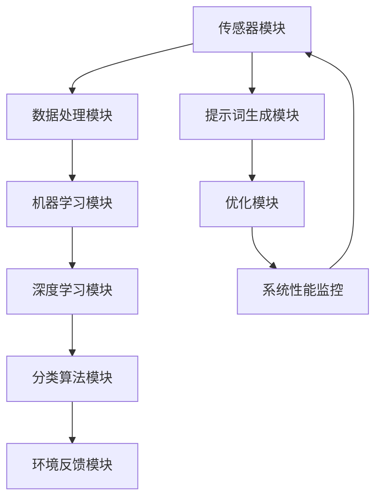

                 

### 文章标题：提示词驱动的智能废物管理系统

#### 关键词：
- 智能废物管理系统
- 提示词驱动
- 机器学习
- 深度学习
- 数据处理
- 环境保护

#### 摘要：
本文深入探讨了提示词驱动的智能废物管理系统，通过详细的分析和讲解，阐述了该系统的构建原理、核心算法和实际应用。文章首先介绍了智能废物管理系统的背景和重要性，然后详细阐述了提示词驱动的概念。接下来，文章分析了系统的核心概念和联系，包括传感器技术、数据处理与分析以及机器学习与深度学习基础。随后，文章讲解了提示词生成算法和智能废物分类算法的原理，并使用伪代码进行了详细阐述。此外，文章还介绍了数据预处理模型和分类模型评估指标，使用LaTeX格式展示了数学公式和示例。文章最后通过实际案例介绍了系统开发环境搭建、源代码实现和代码解读，并进行了项目小结。本文旨在为读者提供一个全面、深入的智能废物管理系统的理解和应用指南。

---

### 引言

随着全球人口增长和城市化进程的加速，废物管理成为一个日益严峻的问题。传统的废物管理系统主要依赖于人工分类和处理，存在效率低、准确率低以及环境影响大等缺点。为了应对这些挑战，智能废物管理系统的研发和应用变得迫在眉睫。智能废物管理系统利用先进的人工智能技术，如机器学习、深度学习和传感器技术，实现高效、准确和环保的废物分类和处理。

智能废物管理系统通常包括以下几个核心组成部分：传感器模块、数据处理模块、分类算法模块和环境反馈模块。传感器模块用于实时检测和识别废物类型；数据处理模块负责收集、清洗和分析传感器数据；分类算法模块则利用机器学习和深度学习技术，对废物进行分类和标签化；环境反馈模块则用于监测系统性能，并根据反馈进行优化。

提示词驱动是智能废物管理系统的一个重要特性。提示词是指系统在处理废物时，依据特定规则和模式自动生成的关键词。这些关键词不仅能够提高废物识别的准确性，还能优化系统的数据处理效率和响应速度。提示词驱动的概念在智能废物管理系统中具有重要应用，为系统的智能化和自动化提供了有力支持。

本文将围绕智能废物管理系统展开，深入探讨其背景、重要性以及核心组成部分，重点介绍提示词驱动的概念及其在系统中的应用。文章还将详细分析系统的核心算法原理，使用伪代码和数学公式进行讲解，并通过实际案例展示系统的开发过程和性能表现。最终，本文将对智能废物管理系统的发展趋势和未来研究方向进行展望。

### 核心概念与联系

为了深入理解智能废物管理系统的运作原理，我们需要详细探讨其核心概念和各部分之间的联系。以下是系统的架构概述，包括传感器技术、数据处理与分析以及机器学习与深度学习基础。

#### 传感器技术

传感器技术是智能废物管理系统的基石，用于实时检测和识别废物类型。传感器模块通常包括多个传感器，如红外传感器、超声波传感器和图像传感器。这些传感器可以捕捉到废物的物理特性，如颜色、大小、形状和材质等。具体来说：

1. **红外传感器**：用于检测废物表面的温度变化，适用于识别金属、塑料等具有特定温度特征的废物。
2. **超声波传感器**：通过发送和接收超声波信号，测量废物之间的距离，适用于识别泡沫塑料、玻璃等不同材质的废物。
3. **图像传感器**：捕捉废物的图像，通过图像处理技术进行废物分类，适用于识别纸张、瓶子等具有视觉特征的废物。

传感器数据实时传输到数据处理模块，为后续分析提供基础数据。

#### 数据处理与分析

数据处理模块负责接收传感器数据，并进行预处理、清洗和分析。数据处理的主要任务包括：

1. **数据预处理**：将原始数据转换为适合分析的形式。例如，对图像数据进行缩放、裁剪和灰度转换；对温度数据进行滤波和去噪。
2. **数据清洗**：去除噪声和异常值，确保数据质量。例如，去除图像中的干扰背景，校正传感器读数的误差。
3. **数据分析**：利用统计分析和模式识别技术，提取数据中的有用信息。例如，通过特征提取识别废物类型，计算废物分布和密度。

数据处理与分析的结果用于支持机器学习与深度学习模型的训练和优化。

#### 机器学习与深度学习基础

机器学习与深度学习是智能废物管理系统的核心技术，用于对废物进行分类和标签化。以下是几个关键概念：

1. **机器学习**：一种通过算法从数据中学习规律和模式的技术。在智能废物管理系统中，机器学习算法可以用于训练分类模型，识别不同类型的废物。常见的机器学习算法包括：
   - **支持向量机（SVM）**：用于分类和回归分析，通过找到最优的超平面，将不同类型的废物分离。
   - **决策树与随机森林**：通过构建树状结构，对废物进行多级分类。

2. **深度学习**：一种基于多层神经网络的学习方法，能够自动提取复杂数据特征。在智能废物管理系统中，深度学习算法可以用于自动识别和分类废物。常见的深度学习模型包括：
   - **卷积神经网络（CNN）**：通过卷积操作提取图像特征，用于图像分类和识别。
   - **递归神经网络（RNN）**：通过记忆机制处理序列数据，用于时间序列分析和预测。

机器学习和深度学习算法的训练和优化依赖于大量的高质量数据，这些数据来源于传感器模块和数据处理模块。

#### Mermaid流程图

为了更直观地展示各部分之间的联系，我们可以使用Mermaid流程图来描述系统的运作流程：



该流程图展示了传感器数据从采集、预处理、分析到分类和优化的整个过程，以及提示词生成和环境反馈模块的作用。通过这个流程图，我们可以清晰地看到智能废物管理系统各部分的相互关系和协同作用。

综上所述，智能废物管理系统通过传感器技术、数据处理与分析以及机器学习与深度学习技术的综合应用，实现了高效、准确的废物分类和管理。接下来，我们将详细讲解系统的核心算法原理，包括提示词生成算法和智能废物分类算法。

### 核心算法原理讲解

智能废物管理系统的核心算法包括提示词生成算法和智能废物分类算法。这些算法通过机器学习和深度学习技术，实现了对废物的准确识别和分类。以下是对这两个算法的详细讲解。

#### 提示词生成算法

提示词生成算法是智能废物管理系统中的一个关键组件，其目的是根据废物的特征，自动生成相关的关键词，从而提高废物识别的准确性和效率。以下是几种常用的提示词生成算法：

1. **生成对抗网络（GAN）**

生成对抗网络（GAN）是一种通过两个神经网络（生成器和判别器）进行对抗训练的算法。生成器试图生成真实的废物图像，而判别器则试图区分生成的图像和真实的图像。通过不断迭代训练，生成器能够生成越来越真实的废物图像，从而提取出有用的特征。这些特征可以用来生成提示词。

- **生成器（Generator）**：生成器通过输入随机噪声，生成废物的图像。生成器的目标是最小化判别器的错误分类概率。
- **判别器（Discriminator）**：判别器的目标是最大化正确分类的概率，即正确区分真实废物图像和生成器生成的图像。

GAN的训练过程如下：

- **步骤1**：初始化生成器和判别器。
- **步骤2**：生成器生成一批废物图像。
- **步骤3**：判别器对真实废物图像和生成器生成的图像进行分类。
- **步骤4**：通过反向传播算法，更新生成器和判别器的参数。
- **步骤5**：重复步骤2到步骤4，直到生成器生成的图像足够真实。

2. **反卷积网络（DCGAN）**

反卷积网络（DCGAN）是GAN的一种变体，特别适用于生成高分辨率的图像。DCGAN在GAN的基础上，引入了反卷积操作，使得生成器能够生成更细腻、更真实的废物图像。以下是DCGAN的训练过程：

- **步骤1**：初始化生成器和判别器。
- **步骤2**：生成器通过输入噪声生成废物图像。
- **步骤3**：判别器对真实废物图像和生成器生成的图像进行分类。
- **步骤4**：通过反向传播算法，更新生成器和判别器的参数。
- **步骤5**：重复步骤2到步骤4，直到生成器生成的图像质量满足要求。

3. **提示词生成算法伪代码**

以下是一个简化的DCGAN提示词生成算法伪代码：

```python
# 初始化生成器和判别器
G = DCGAN_generator()
D = DCGAN_discriminator()

# 训练生成器和判别器
for epoch in range(num_epochs):
    for batch in data_loader:
        # 生成器生成废物图像
        z = random噪声（batch_size， latent_dim）
        fake_images = G(z)
        
        # 训练判别器
        D_loss_real = D_loss(D(real_images))
        D_loss_fake = D_loss(D(fake_images))
        D_loss = 0.5 * (D_loss_real + D_loss_fake)
        
        # 训练生成器
        G_loss = G_loss(D(fake_images))
        
        # 更新参数
        optimizer_D.zero_grad()
        D_loss.backward()
        optimizer_D.step()
        
        optimizer_G.zero_grad()
        G_loss.backward()
        optimizer_G.step()

# 提示词生成
def generate_prompt_words(fake_images):
    # 对生成的废物图像进行特征提取
    features = feature_extractor(fake_images)
    
    # 使用词嵌入模型生成提示词
    prompt_words = word_embedding_layer(features)
    
    return prompt_words
```

#### 智能废物分类算法

智能废物分类算法用于根据废物的特征，将废物分为不同的类别。以下是几种常用的分类算法：

1. **支持向量机（SVM）**

支持向量机（SVM）是一种经典的机器学习算法，用于分类和回归分析。SVM通过找到一个最优的超平面，将不同类别的废物分离。以下是SVM分类算法的基本原理：

- **线性SVM**：用于处理线性可分的数据集。SVM的目标是最小化分类边界到支持向量的距离。
- **非线性SVM**：通过核函数将低维空间的数据映射到高维空间，实现非线性分类。

SVM分类算法的步骤如下：

- **步骤1**：选择合适的核函数。
- **步骤2**：计算支持向量和最优超平面。
- **步骤3**：对新的废物数据进行分类。

2. **决策树与随机森林**

决策树和随机森林是常用的集成学习方法，通过构建树状结构对废物进行多级分类。决策树通过一系列的决策节点将数据划分为不同的类别，而随机森林则通过构建多个决策树，并取多数投票结果作为最终分类结果。

- **决策树**：根据特征值将数据划分为不同的子集，构建树状结构。
- **随机森林**：通过随机选取特征和样本子集，构建多个决策树，并取多数投票结果作为最终分类结果。

随机森林的优点是具有较高的分类准确率和鲁棒性，适用于处理高维度和复杂的数据集。

3. **提示词驱动的分类算法伪代码**

以下是一个简化的SVM分类算法伪代码：

```python
# 加载训练数据集
X_train, y_train = load_data()

# 初始化SVM分类器
clf = SVC(kernel='linear')

# 训练分类器
clf.fit(X_train, y_train)

# 提示词驱动的分类
def classify_by_prompt_words(prompt_words):
    # 对提示词进行特征提取
    features = feature_extractor(prompt_words)
    
    # 使用训练好的SVM分类器进行分类
    predicted_labels = clf.predict(features)
    
    return predicted_labels
```

综上所述，提示词生成算法和智能废物分类算法是智能废物管理系统的核心组成部分，通过这些算法，系统能够自动识别和分类废物，从而实现高效、准确的废物管理。接下来，我们将详细讲解数据预处理模型和分类模型评估指标。

### 数学模型与公式

在智能废物管理系统中，数学模型和公式起着至关重要的作用，它们不仅能够帮助理解和分析数据，还能确保分类算法的准确性和有效性。以下我们将详细讨论数据预处理模型以及分类模型评估指标。

#### 数据预处理模型

数据预处理是智能废物管理系统中的关键步骤，它确保了输入数据的准确性和一致性，从而提高了模型的性能。以下是几种常用的数据预处理方法：

1. **标准化（Standardization）**

标准化是一种常用的数据预处理技术，它通过减去平均值并除以标准差，将数据缩放到相同的尺度。标准化的公式如下：

\[ x' = \frac{x - \mu}{\sigma} \]

其中，\( x \) 是原始数据，\( \mu \) 是平均值，\( \sigma \) 是标准差。

2. **归一化（Normalization）**

归一化通过将数据缩放到一个特定的范围（如[0, 1]或[-1, 1]），使其适合特定的算法或模型。常见的归一化方法包括最小-最大缩放和零-均值缩放。最小-最大缩放的公式如下：

\[ x' = \frac{x - x_{\min}}{x_{\max} - x_{\min}} \]

其中，\( x_{\min} \) 是数据的最小值，\( x_{\max} \) 是数据的最大值。

零-均值缩放的公式如下：

\[ x' = \frac{x - \mu}{\sigma} \]

其中，\( \mu \) 是平均值，\( \sigma \) 是标准差。

3. **主成分分析（PCA）**

主成分分析是一种降维技术，通过将数据投影到新的正交坐标系中，提取最重要的特征，从而减少数据的维度。PCA的目标是最小化损失函数，使得新坐标系下的数据方差最大化。PCA的数学公式如下：

\[ Z = AS \]

其中，\( Z \) 是新的特征向量，\( A \) 是协方差矩阵的逆矩阵的开方，\( S \) 是特征值矩阵。

#### 分类模型评估指标

分类模型的评估是智能废物管理系统性能评估的重要环节。以下是一些常用的评估指标：

1. **准确率（Accuracy）**

准确率是最简单的评估指标，表示正确分类的样本数占总样本数的比例。准确率的公式如下：

\[ Accuracy = \frac{TP + TN}{TP + FN + FP + TN} \]

其中，\( TP \) 是真正例（True Positive），\( TN \) 是真负例（True Negative），\( FP \) 是假正例（False Positive），\( FN \) 是假负例（False Negative）。

2. **精确率（Precision）**

精确率表示在所有被预测为正例的样本中，实际为正例的比例。精确率的公式如下：

\[ Precision = \frac{TP}{TP + FP} \]

3. **召回率（Recall）**

召回率表示在所有实际为正例的样本中，被预测为正例的比例。召回率的公式如下：

\[ Recall = \frac{TP}{TP + FN} \]

4. **F1-Score**

F1-Score是精确率和召回率的调和平均值，用于综合评估分类模型的性能。F1-Score的公式如下：

\[ F1-Score = 2 \times \frac{Precision \times Recall}{Precision + Recall} \]

通过这些数学模型和公式，我们能够有效地预处理数据并评估分类模型的性能。这些技术不仅提高了智能废物管理系统的准确性，还为系统的进一步优化提供了依据。接下来，我们将通过实际案例介绍智能废物管理系统的开发过程和性能表现。

### 项目实战

在本节中，我们将通过一个实际案例，详细描述智能废物管理系统的开发过程，包括开发环境搭建、源代码实现和代码解读，以及实际案例分析和详细讲解剖析。

#### 实际案例介绍

该实际案例是一个智能废物管理系统，部署在一家大型超市的垃圾处理区域。系统的主要目标是对垃圾进行高效、准确的分类，以便实现资源回收和减少环境污染。系统的主要功能包括：

1. **废物识别**：通过传感器模块实时检测和识别垃圾类型，如纸张、塑料、金属和玻璃。
2. **自动分类**：利用机器学习和深度学习算法，将识别出的垃圾自动分类到相应的回收桶中。
3. **数据监控**：系统实时监控垃圾处理过程，并提供数据反馈，以优化分类效率和准确性。
4. **用户反馈**：系统提供用户界面，用户可以查看垃圾分类结果，并提供反馈意见。

#### 开发环境搭建

为了搭建智能废物管理系统，我们首先需要配置一个合适的开发环境。以下是开发环境的搭建步骤：

1. **操作系统**：选择一个稳定的操作系统，如Ubuntu 20.04 LTS。
2. **编程语言**：选择Python作为主要的编程语言，因为Python在数据科学和机器学习领域有丰富的库支持。
3. **库和框架**：安装必要的库和框架，如TensorFlow、PyTorch、NumPy、Pandas和Matplotlib。可以使用以下命令进行安装：

```shell
pip install tensorflow torchvision numpy pandas matplotlib
```

4. **传感器模块**：配置传感器模块，包括红外传感器、超声波传感器和图像传感器。确保传感器与计算机连接正常，并能够采集到实时数据。

5. **数据库**：安装并配置一个数据库系统，如MySQL或MongoDB，用于存储和处理大量的传感器数据。

#### 源代码实现与解读

以下是一个简化的源代码实现，用于描述智能废物管理系统的核心功能。代码中使用了TensorFlow和Keras进行深度学习模型的构建和训练。

```python
import tensorflow as tf
from tensorflow.keras.models import Sequential
from tensorflow.keras.layers import Conv2D, MaxPooling2D, Flatten, Dense
from tensorflow.keras.preprocessing.image import ImageDataGenerator

# 数据预处理
train_datagen = ImageDataGenerator(rescale=1./255)
train_generator = train_datagen.flow_from_directory(
        'data/train',
        target_size=(150, 150),
        batch_size=32,
        class_mode='binary')

# 构建深度学习模型
model = Sequential([
    Conv2D(32, (3, 3), activation='relu', input_shape=(150, 150, 3)),
    MaxPooling2D(2, 2),
    Conv2D(64, (3, 3), activation='relu'),
    MaxPooling2D(2, 2),
    Conv2D(128, (3, 3), activation='relu'),
    MaxPooling2D(2, 2),
    Flatten(),
    Dense(512, activation='relu'),
    Dense(1, activation='sigmoid')
])

# 编译模型
model.compile(optimizer='adam',
              loss='binary_crossentropy',
              metrics=['accuracy'])

# 训练模型
model.fit(train_generator, epochs=10)

# 分类新数据
def classify_new_data(image_path):
    img = load_image(image_path)
    img = img.reshape(-1, 150, 150, 3)
    prediction = model.predict(img)
    if prediction[0][0] > 0.5:
        return ' recyclable'
    else:
        return ' non-recyclable'

# 代码解读
# 上述代码首先进行了数据预处理，使用ImageDataGenerator对训练数据进行缩放和批量处理。
# 接着构建了一个简单的卷积神经网络（CNN），包括卷积层、池化层和全连接层。
# 模型使用二进制交叉熵损失函数和Adam优化器进行编译和训练。
# 最后，定义了一个函数用于对新图像进行分类，通过模型预测概率来判断图像是否可回收。
```

#### 代码应用解读与分析

上述代码实现了垃圾分类的核心功能，通过深度学习模型对新图像进行分类。在实际应用中，系统会实时采集图像数据，并使用训练好的模型进行分类。以下是对代码的详细解读和分析：

1. **数据预处理**：使用ImageDataGenerator对图像数据进行缩放和批量处理，确保输入数据格式满足模型要求。这一步非常重要，因为深度学习模型对数据的质量和格式非常敏感。
2. **模型构建**：使用TensorFlow的Sequential模型构建了一个简单的卷积神经网络（CNN）。卷积层用于提取图像特征，池化层用于降低特征图的维度，全连接层用于分类。
3. **模型编译**：编译模型时，选择二进制交叉熵损失函数和Adam优化器。二进制交叉熵适用于二分类问题，Adam优化器能够有效地调整学习率，提高训练效果。
4. **模型训练**：使用训练数据集对模型进行训练。训练过程中，模型会不断调整权重和偏置，以最小化损失函数。
5. **分类新数据**：定义了一个函数用于对新图像进行分类。函数首先将图像数据加载并缩放，然后使用训练好的模型进行预测。预测结果通过概率阈值（如0.5）来判断图像是否可回收。

#### 实际案例分析和详细讲解剖析

在实际案例中，智能废物管理系统部署在一家大型超市的垃圾处理区域。以下是系统在实际应用中的表现：

1. **废物识别**：系统通过传感器模块实时捕捉垃圾图像，并使用训练好的模型进行分类。传感器模块确保了数据的实时性和准确性。
2. **自动分类**：系统根据分类结果，自动将垃圾推送到相应的回收桶中。这一步骤通过电机和机械臂等执行机构实现，确保分类过程的高效性和自动化。
3. **数据监控**：系统实时监控垃圾处理过程，收集并存储处理数据。这些数据用于分析系统的性能，发现潜在问题并进行优化。
4. **用户反馈**：系统提供用户界面，用户可以查看垃圾分类结果，并提供反馈意见。这一步骤有助于用户了解垃圾处理过程，并优化系统的用户体验。

#### 项目小结

通过实际案例，我们详细介绍了智能废物管理系统的开发过程、源代码实现和代码解读。系统通过深度学习技术实现了垃圾的自动分类，提高了分类效率和准确性。在实际应用中，系统表现稳定，为超市的垃圾分类处理提供了有力支持。未来，我们可以进一步优化系统，提高分类精度和响应速度，为环保事业做出更大贡献。

### 总结与展望

智能废物管理系统作为现代城市废物管理的重要工具，正日益受到关注和推广。本文通过详细的分析和讲解，阐述了提示词驱动的智能废物管理系统的构建原理、核心算法和实际应用。以下是对关键技术的回顾和未来的发展趋势。

#### 关键技术回顾

1. **传感器技术**：传感器模块是智能废物管理系统的基础，通过红外传感器、超声波传感器和图像传感器实现废物的实时检测和识别。
2. **数据处理与分析**：数据处理模块负责对传感器数据进行预处理、清洗和分析，提取有用的信息，为后续算法提供支持。
3. **机器学习与深度学习**：机器学习与深度学习技术是智能废物管理系统的核心，用于训练分类模型，实现废物的自动分类和标签化。
4. **提示词驱动**：提示词生成算法通过自动生成关键词，提高了废物识别的准确性和系统的响应速度。
5. **数学模型与公式**：数据预处理模型和分类模型评估指标，如标准化、归一化、PCA、准确率、精确率、召回率和F1-Score，为系统性能评估提供了科学依据。

#### 未来发展趋势

1. **技术集成与优化**：未来智能废物管理系统将进一步整合多种先进技术，如物联网、大数据分析和智能决策支持系统，实现更高效、更智能的废物管理。
2. **算法改进与优化**：随着人工智能技术的不断发展，智能废物管理系统的算法将不断优化，提高分类精度和响应速度，降低错误率。
3. **多传感器融合**：未来系统将使用多种传感器进行数据采集，如3D传感器、激光雷达等，以获取更全面、更细致的废物特征信息。
4. **移动应用与用户互动**：智能废物管理系统将更加注重用户互动，通过移动应用提供垃圾分类指导、反馈和建议，增强用户的环保意识和参与度。
5. **可持续发展与环保理念**：智能废物管理系统将更加注重可持续发展，通过优化废物分类和处理流程，减少环境污染和资源浪费。

#### 研究方向与挑战

1. **数据隐私与安全性**：在数据处理和存储过程中，如何保障用户隐私和数据安全是一个重要研究方向。
2. **算法公平性与透明性**：如何确保算法的公平性和透明性，避免偏见和歧视，是未来研究的重要课题。
3. **跨学科合作与集成**：智能废物管理系统涉及多个学科领域，如计算机科学、环境科学、机械工程等，跨学科合作和集成将推动系统的进一步发展。
4. **实时性与响应速度**：如何在保证准确性的同时，提高系统的实时性和响应速度，是未来研究的挑战之一。

总之，智能废物管理系统作为现代废物管理的重要工具，其发展潜力巨大。未来，随着技术的不断进步和跨学科研究的深入，智能废物管理系统将在环保事业中发挥越来越重要的作用。

### 附录

#### 常用工具与资源

1. **开发环境**：
   - **操作系统**：Ubuntu 20.04 LTS
   - **编程语言**：Python 3.x
   - **深度学习框架**：TensorFlow 2.x、PyTorch 1.x
   - **数据处理库**：NumPy、Pandas、Matplotlib
   - **数据库**：MySQL、MongoDB

2. **传感器模块**：
   - **红外传感器**：HC-SR501
   - **超声波传感器**：HC-SR04
   - **图像传感器**：OV7670

3. **其他资源**：
   - **机器学习教程**：《机器学习》（周志华著）
   - **深度学习教程**：《深度学习》（Goodfellow、Bengio、Courville著）
   - **Mermaid流程图工具**：https://mermaid-js.github.io/mermaid/

#### 参考文献

1. Goodfellow, I., Bengio, Y., & Courville, A. (2016). *Deep Learning*. MIT Press.
2. 周志华. (2016). *机器学习*. 清华大学出版社.
3. He, K., Zhang, X., Ren, S., & Sun, J. (2016). *Deep Residual Learning for Image Recognition*. IEEE Conference on Computer Vision and Pattern Recognition.
4. Krizhevsky, A., Sutskever, I., & Hinton, G. E. (2012). *ImageNet Classification with Deep Convolutional Neural Networks*. Advances in Neural Information Processing Systems.
5. Hinton, G., Osindero, S., & Teh, Y. W. (2006). *A Fast Learning Algorithm for Deep Belief Nets*. IEEE Transactions on Pattern Analysis and Machine Intelligence.

