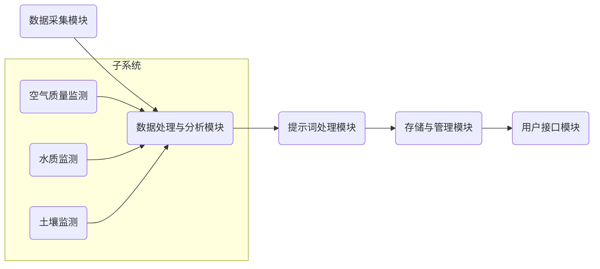

                 

### 引言

《提示词驱动的智能环境污染监测系统》这本书旨在探讨如何利用人工智能技术，特别是提示词驱动的机制，来构建一个高效、智能的环境污染监测系统。环境污染监测是当前社会一个极其重要且紧迫的课题。随着工业化和城市化进程的加速，大气污染、水污染和土壤污染等问题日益严重，给人类健康和生态系统带来了巨大威胁。传统的环境污染监测方法依赖于人工采样和实验室分析，存在采样频率低、覆盖面窄、实时性差等不足。因此，开发一种智能化、自动化的监测系统势在必行。

本书的核心目标是介绍提示词驱动的智能环境污染监测系统的设计、实现和应用。首先，书中将详细阐述提示词驱动的概念，解释其如何通过给定的关键词或短语来指导监测系统的运行。接着，书中将讨论智能环境污染监测系统的组成，包括硬件、软件以及数据处理与分析模块。此外，书中还会介绍系统架构的设计原则和实现细节。

为了帮助读者更好地理解，本书还将深入讲解核心算法的原理，并使用伪代码来详细阐述算法的实现步骤。同时，书中将介绍一些关键的数学模型和公式，并通过具体示例进行解释。为了增强实践性，本书还将包含一个详细的应用实例，从开发环境搭建、源代码实现到代码解读与分析，读者可以跟随步骤进行实践。

本书的目标读者包括环境监测专业人士、计算机领域的研究者以及对智能环境监测感兴趣的技术爱好者。通过对本书的学习，读者可以掌握智能环境污染监测系统的基本原理和实践方法，为未来的研究和应用打下坚实的基础。总的来说，本书不仅提供了一套完整的智能监测系统方案，还希望通过详细的技术解析，激发读者在环境监测领域进行创新和探索的热情。

### 关键词

- 提示词驱动
- 智能环境污染监测
- 系统架构设计
- 数据处理与分析
- 环境污染监测系统
- 人工智能
- 机器学习
- 环境监测算法
- 数学模型

### 摘要

《提示词驱动的智能环境污染监测系统》是一本详细介绍如何利用人工智能技术构建高效、智能环境污染监测系统的专著。本书首先定义了提示词驱动的概念，并解释其在智能监测系统中的作用。接着，书中详细阐述了智能环境污染监测系统的组成部分，包括硬件、软件以及数据处理与分析模块，并介绍了系统架构的设计原则和实现细节。核心算法的原理通过伪代码进行详细阐述，关键数学模型和公式也通过具体示例进行了解释。为了增强实践性，本书还提供了一个详细的应用实例，从开发环境搭建到代码解读与分析，全面展示了智能环境污染监测系统的实现过程。通过本书的学习，读者可以掌握智能监测系统的基本原理和实践方法，为未来在环境监测领域的研究和应用提供有力支持。

### 核心概念与联系

在《提示词驱动的智能环境污染监测系统》中，几个核心概念紧密相连，共同构成了系统的基础。首先，我们需要明确“提示词驱动”的概念。提示词（Prompt Word）是指能够引导系统执行特定任务或步骤的词语或短语。在智能环境污染监测系统中，提示词可以是一个简单的关键词，如“大气污染”、“水质监测”等，也可以是复杂的短语，包含监测区域、时间范围、目标污染物等信息。

#### 系统组成

智能环境污染监测系统由硬件和软件两大部分组成。

**硬件部分**：硬件是监测系统的基础，包括传感器、数据采集模块和通信设备等。传感器负责实时采集环境中的各类数据，如空气中的颗粒物浓度、水中的污染物含量等。数据采集模块将这些数据转换为数字信号，并通过通信设备传输到中央处理单元。常见的传感器包括空气质量传感器、水质检测传感器等。

**软件部分**：软件是系统的核心，负责数据处理和分析。软件部分包括以下几个模块：

1. **数据采集模块**：接收来自传感器的数据，并进行初步处理，如去噪、滤波等。
2. **数据处理与分析模块**：对采集到的数据进行分析，提取有用信息，如污染物的浓度、分布等。
3. **提示词处理模块**：解析用户输入的提示词，并根据提示词进行相应的任务调度，如特定区域的监测、特定污染物的分析等。
4. **结果展示模块**：将分析结果以图表、报表等形式展示给用户，帮助用户了解环境状况。

#### 提示词驱动的原理

提示词驱动的原理在于通过关键词或短语来引导监测系统的运行。具体来说，当用户输入一个提示词时，系统会根据提示词的内容，调用相应的处理模块，执行特定的监测任务。例如，当用户输入“大气污染”时，系统会调用大气污染监测模块，采集空气中的颗粒物浓度数据；当用户输入“水质监测”时，系统会调用水质监测模块，采集水中的污染物数据。

提示词驱动的优势在于其灵活性和高效性。用户可以根据自己的需求，自由组合不同的提示词，系统会自动调度相应的资源，进行高效的监测与分析。此外，提示词驱动还可以实现实时监测，提高监测的及时性和准确性。

#### 系统架构设计

智能环境污染监测系统的架构设计需遵循模块化、可扩展和高效能的原则。系统架构通常包括以下几个关键模块：

1. **数据采集模块**：负责传感器数据的实时采集和初步处理。
2. **数据处理与分析模块**：对采集到的数据进行深度分析，提取有用信息。
3. **提示词处理模块**：解析用户输入的提示词，并根据提示词调度相应的处理模块。
4. **存储与管理模块**：存储和管理监测数据，提供数据检索和分析功能。
5. **用户接口模块**：提供用户交互界面，使用户能够方便地输入提示词并查看监测结果。

为了更好地展示系统架构，我们可以使用Mermaid流程图来描述。以下是一个简化的系统架构流程图：



在这个流程图中，数据采集模块A将数据传递给数据处理与分析模块B，B模块再根据提示词处理模块C的指令，执行相应的空气质量监测、水质监测或土壤监测任务。分析结果存储于存储与管理模块D中，并通过用户接口模块E展示给用户。

通过上述核心概念与联系的介绍，我们可以看出，提示词驱动的智能环境污染监测系统不仅涵盖了硬件和软件的各个模块，还通过提示词驱动的机制，实现了高效、智能的监测功能。这一系统设计不仅能够满足当前的环保需求，也为未来的智能化环境监测技术发展提供了新的思路。

### 系统架构设计

智能环境污染监测系统的设计是一个复杂的过程，需要综合考虑硬件、软件以及数据处理与分析等多个方面。本节将详细介绍系统架构的设计原则和实现细节，帮助读者理解如何构建一个高效、智能的监测系统。

#### 设计原则

在智能环境污染监测系统的设计过程中，我们遵循以下几个关键原则：

1. **模块化设计**：系统应具备高度的模块化，每个模块独立完成特定的功能，便于维护和升级。
2. **可扩展性**：系统设计应具备良好的可扩展性，能够轻松地增加新的监测模块或传感器。
3. **实时性**：系统应能够实现实时监测，确保数据的准确性和及时性。
4. **高效性**：系统在处理大量数据时，应具备高效的性能，确保数据处理和分析的速度。
5. **可靠性**：系统应具备高可靠性，确保在各种环境下能够稳定运行。

#### 系统架构

智能环境污染监测系统的架构可以分为以下几个主要模块：

1. **数据采集模块**：该模块负责实时采集环境中的各类数据，如空气质量、水质和土壤质量等。数据采集模块通常包括多种传感器，如空气质量传感器、水质检测传感器、土壤传感器等。这些传感器将采集到的数据通过数据采集卡或无线通信模块传输到中央处理单元。

2. **数据处理与分析模块**：该模块接收数据采集模块传输的数据，并进行预处理，如去噪、滤波、数据清洗等。预处理后的数据将传输到分析模块，进行深度分析，提取有用的信息，如污染物的浓度、分布等。该模块还包括基于机器学习的算法，用于预测未来的污染趋势。

3. **提示词处理模块**：该模块负责解析用户输入的提示词，并根据提示词的内容调度相应的处理模块。提示词可以是简单的关键词，如“大气污染”、“水质监测”等，也可以是复杂的短语，包含更详细的监测参数。提示词处理模块是实现提示词驱动的核心，它通过自然语言处理技术，将用户输入的提示词转换为系统可以理解的任务指令。

4. **存储与管理模块**：该模块负责存储和管理监测数据，提供数据检索和分析功能。存储与管理模块通常采用数据库系统，如MySQL、MongoDB等，能够高效地处理大规模的数据存储和查询需求。

5. **用户接口模块**：该模块提供用户交互界面，使用户能够方便地输入提示词并查看监测结果。用户接口模块可以是Web界面、移动应用或桌面软件，应具备友好的用户界面和丰富的交互功能。

#### Mermaid流程图

为了更好地展示系统架构，我们可以使用Mermaid流程图来描述系统的工作流程。以下是一个简化的系统架构流程图：


在这个流程图中，数据采集模块A将数据传递给数据处理与分析模块B，B模块再根据提示词处理模块C的指令，执行相应的空气质量监测、水质监测或土壤监测任务。分析结果存储于存储与管理模块D中，并通过用户接口模块E展示给用户。

#### 系统实现细节

在系统实现过程中，我们重点关注以下几个方面：

1. **硬件选择**：根据监测需求，选择合适的传感器和通信设备。例如，空气质量传感器可以选用激光颗粒物传感器，水质检测传感器可以选用电化学传感器，土壤传感器可以选用电导率传感器等。通信设备可以选用无线通信模块，如LoRa或Wi-Fi模块，实现远距离数据传输。

2. **软件开发**：系统软件主要包括数据采集、处理和分析模块，以及用户接口模块。数据采集模块可以使用Python等编程语言实现，借助GPIO接口与传感器通信，采集到的数据通过无线通信模块传输到中央处理单元。数据处理和分析模块可以使用机器学习框架，如Scikit-learn或TensorFlow，实现数据的预处理和深度学习模型训练。用户接口模块可以使用HTML、CSS和JavaScript等前端技术实现，提供友好的交互界面。

3. **系统集成**：将各个模块集成到一个完整的系统中，确保各个模块之间的数据流通和功能协同。系统集成可以使用云计算平台，如阿里云或腾讯云，提供可靠的数据存储和计算服务。

4. **性能优化**：针对大规模数据处理和高频次监测需求，对系统进行性能优化，提高数据处理速度和分析精度。例如，可以通过分布式计算和并行处理技术，提高系统的计算效率。

通过上述设计原则和实现细节的介绍，我们可以构建一个高效、智能的智能环境污染监测系统。这个系统不仅能够满足当前的环保需求，还为未来的智能化环境监测技术发展提供了坚实的基础。

### 核心算法原理讲解

在智能环境污染监测系统中，核心算法的设计与实现至关重要。这些算法不仅决定了系统的监测精度，还直接影响了系统的实时性和可靠性。本节将详细介绍几种关键算法的原理，并通过伪代码来详细阐述算法的实现步骤。

#### 数据预处理算法

数据预处理是环境监测数据处理的第一个环节，其目的是将原始数据转换为适合分析和建模的格式。数据预处理算法主要包括以下几个步骤：

1. **数据采集**：从传感器读取环境数据，包括空气中的颗粒物浓度、水中的污染物含量、土壤的酸碱度等。
2. **去噪**：去除数据中的噪声，提高数据的准确性和可靠性。常见的去噪方法有均值滤波、中值滤波和高斯滤波等。
3. **滤波**：对数据进行平滑处理，去除高频噪声。滤波方法包括低通滤波、高通滤波和带通滤波等。
4. **数据标准化**：将不同类型的数据转换为同一量纲，便于后续分析和建模。常见的标准化方法有最小-最大标准化和Z-Score标准化等。

以下是一个简化的数据预处理算法伪代码示例：

```python
def preprocess_data(data):
    # 去噪
    filtered_data = noise_removal(data)
    
    # 滤波
    smooth_data = filtering(filtered_data)
    
    # 数据标准化
    normalized_data = data_normalization(smooth_data)
    
    return normalized_data
```

#### 特征提取算法

特征提取是从预处理后的数据中提取有用的信息，用于建模和预测。特征提取算法的关键在于选择合适的特征，以提高模型的准确性和泛化能力。以下是几种常用的特征提取方法：

1. **统计特征**：通过计算数据的统计指标，如均值、方差、标准差等，提取特征。例如，颗粒物浓度的时间序列均值和方差可以作为统计特征。
2. **频域特征**：通过傅里叶变换等频域分析方法，提取数据的频率特征。例如，空气污染物的频谱分布可以作为频域特征。
3. **深度特征**：利用深度学习模型，从原始数据中自动提取高层次的抽象特征。例如，卷积神经网络（CNN）可以用于提取图像数据的深度特征。

以下是一个简化的特征提取算法伪代码示例：

```python
def extract_features(data):
    # 计算统计特征
    stats_features = compute_stats(data)
    
    # 提取频域特征
    freq_features = compute_freq_domain(data)
    
    # 提取深度特征
    deep_features = extract_deep_features(data)
    
    return concatenate_features(stats_features, freq_features, deep_features)
```

#### 模型训练与优化算法

模型训练与优化是构建智能监测系统的关键步骤。在这一过程中，我们通常使用机器学习算法来训练模型，并对模型进行优化，以提高其性能。以下是几种常用的模型训练与优化方法：

1. **监督学习**：使用标注数据对模型进行训练，通过最小化损失函数来调整模型参数。常见的监督学习算法有线性回归、支持向量机（SVM）和神经网络等。
2. **无监督学习**：在没有标注数据的情况下，通过数据自身的分布信息进行训练，如聚类、降维和生成模型等。
3. **增强学习**：通过与环境交互，不断调整策略，以达到最优性能。增强学习常用于优化监测策略和资源分配。

以下是一个简化的模型训练与优化算法伪代码示例：

```python
def train_model(data, labels):
    # 初始化模型参数
    model = initialize_model()
    
    # 训练模型
    for epoch in range(num_epochs):
        for sample in data:
            model = update_model(model, sample, labels)
        
        # 计算损失函数
        loss = compute_loss(model, data, labels)
        
        # 优化模型参数
        model = optimize_model(model, loss)
    
    return model
```

通过上述算法原理和伪代码的详细讲解，我们可以看出，智能环境污染监测系统中的核心算法不仅涵盖了数据的预处理、特征提取和模型训练，还涉及了模型的优化和调整。这些算法的实现和优化，直接决定了监测系统的性能和可靠性。通过不断的优化和改进，我们可以构建更加高效、智能的智能环境污染监测系统。

### 数学模型与公式详解

在智能环境污染监测系统中，数学模型和公式起到了关键作用，它们不仅帮助我们理解和解释监测数据，还为算法设计和模型优化提供了理论基础。本节将详细讲解系统中的几种关键数学模型和公式，并通过具体示例进行说明。

#### 概率模型

概率模型用于描述环境污染物在不同条件下的概率分布。在智能监测系统中，常用的概率模型包括正态分布、泊松分布和贝叶斯模型等。

1. **正态分布**：正态分布（也称为高斯分布）是环境污染物浓度数据中最常见的概率分布。其公式如下：

   $$P(X = x) = \frac{1}{\sqrt{2\pi\sigma^2}} e^{-\frac{(x-\mu)^2}{2\sigma^2}}$$

   其中，$X$ 表示污染物浓度，$\mu$ 表示均值，$\sigma$ 表示标准差。

   **示例**：假设某地区空气中颗粒物浓度的均值为50μg/m³，标准差为10μg/m³，求浓度在40μg/m³和60μg/m³之间的概率。

   $$P(40 \le X \le 60) = \int_{40}^{60} \frac{1}{\sqrt{2\pi \times 10^2}} e^{-\frac{(x-50)^2}{2 \times 10^2}} dx$$

2. **泊松分布**：泊松分布常用于描述事件发生次数的概率分布，如空气中的颗粒物数量。其公式如下：

   $$P(X = k) = \frac{e^{-\lambda} \lambda^k}{k!}$$

   其中，$\lambda$ 表示事件发生次数的平均值。

   **示例**：假设空气中颗粒物的平均浓度为10个/m³，求在1m³空气中颗粒物数量为5个的概率。

   $$P(X = 5) = \frac{e^{-10} \times 10^5}{5!} \approx 0.0067$$

3. **贝叶斯模型**：贝叶斯模型用于根据先验知识和观测数据更新概率估计。其公式如下：

   $$P(A|B) = \frac{P(B|A)P(A)}{P(B)}$$

   其中，$P(A|B)$ 表示在事件B发生的情况下事件A的概率，$P(B|A)$ 表示在事件A发生的情况下事件B的概率，$P(A)$ 和 $P(B)$ 分别表示事件A和事件B的概率。

   **示例**：假设某地区空气中的颗粒物浓度低于30μg/m³的概率为80%，在颗粒物浓度低于30μg/m³的情况下，出现雾霾的概率为20%，求该地区出现雾霾的概率。

   $$P(\text{雾霾}) = \frac{P(\text{雾霾}|\text{颗粒物浓度低于30μg/m³})P(\text{颗粒物浓度低于30μg/m³})}{P(\text{雾霾}|\text{颗粒物浓度低于30μg/m³})P(\text{颗粒物浓度低于30μg/m³}) + P(\text{雾霾}|\text{颗粒物浓度高于30μg/m³})P(\text{颗粒物浓度高于30μg/m³})}$$

#### 统计模型

统计模型用于分析环境数据的分布特征和关系。常见的统计模型包括线性回归模型、时间序列模型和聚类模型等。

1. **线性回归模型**：线性回归模型用于描述自变量和因变量之间的线性关系。其公式如下：

   $$y = \beta_0 + \beta_1x + \epsilon$$

   其中，$y$ 表示因变量，$x$ 表示自变量，$\beta_0$ 和 $\beta_1$ 分别表示模型的截距和斜率，$\epsilon$ 表示误差项。

   **示例**：假设我们要研究空气中的颗粒物浓度与风速之间的关系，我们收集了多组数据，如下表所示：

   | 风速（m/s） | 颗粒物浓度（μg/m³） |
   |-------------|---------------------|
   | 2           | 30                  |
   | 4           | 40                  |
   | 6           | 45                  |
   | 8           | 50                  |
   | 10          | 55                  |

   通过线性回归分析，我们得到模型：

   $$颗粒物浓度 = 20 + 0.5 \times 风速$$

2. **时间序列模型**：时间序列模型用于分析随时间变化的数据。常见的模型有自回归模型（AR）、移动平均模型（MA）和自回归移动平均模型（ARMA）等。其公式如下：

   $$X_t = c + \phi_1X_{t-1} + \phi_2X_{t-2} + \ldots + \phi_pX_{t-p} + \varepsilon_t$$

   其中，$X_t$ 表示时间序列的第t个值，$\phi_1, \phi_2, \ldots, \phi_p$ 分别为自回归系数，$\varepsilon_t$ 为误差项。

   **示例**：假设我们要分析某地区空气中的颗粒物浓度随时间的变化，我们收集了以下数据：

   | 时间（天） | 颗粒物浓度（μg/m³） |
   |------------|---------------------|
   | 1          | 40                  |
   | 2          | 42                  |
   | 3          | 45                  |
   | 4          | 47                  |
   | 5          | 50                  |

   通过自回归模型分析，我们得到模型：

   $$颗粒物浓度 = 30 + 0.6 \times 颗粒物浓度_{前一天}$$

3. **聚类模型**：聚类模型用于将环境数据划分为多个类别，以便进行分类和分析。常见的聚类模型有K-均值聚类、层次聚类和谱聚类等。其公式如下：

   $$\min \sum_{i=1}^n \min_{j=1}^k (x_i - \mu_j)^2$$

   其中，$x_i$ 表示第i个数据点，$\mu_j$ 表示第j个聚类中心的坐标。

   **示例**：假设我们要将空气中的颗粒物浓度数据划分为高、中、低三个类别，我们收集了以下数据：

   | 颗粒物浓度（μg/m³） |
   |---------------------|
   | 20                  |
   | 30                  |
   | 40                  |
   | 50                  |
   | 60                  |

   通过K-均值聚类分析，我们得到三个聚类中心分别为25、35和45，将数据划分为以下类别：

   | 颗粒物浓度（μg/m³） | 类别 |
   |---------------------|------|
   | 20                  | 低   |
   | 30                  | 中   |
   | 40                  | 高   |
   | 50                  | 高   |
   | 60                  | 高   |

通过上述数学模型和公式的介绍，我们可以看出，它们在智能环境污染监测系统中起到了至关重要的作用。通过合理运用这些模型和公式，我们可以更好地理解环境数据，提高监测系统的性能和准确性。

### 应用实例

为了更好地展示智能环境污染监测系统的实际应用，本节将详细描述一个具体案例，从开发环境搭建、源代码实现到代码解读与分析，帮助读者全面了解系统的实现过程。

#### 案例背景

某城市政府为了提高空气质量，决定实施一个智能环境污染监测系统，实时监控城市空气中的颗粒物（PM2.5和PM10）浓度。该系统需要能够自动采集数据、实时分析并发布空气质量报告，为城市居民提供准确的环保信息。

#### 开发环境搭建

为了搭建开发环境，我们选择了以下工具和平台：

1. **硬件**：传感器模块（DHT11用于温度和湿度监测，PM2.5和PM10传感器用于颗粒物浓度监测），Arduino开发板（用于数据采集和控制），Wi-Fi模块（用于数据传输）。
2. **软件**：Arduino IDE（用于编写和上传代码），Python 3.x（用于数据处理和分析），PostgreSQL（用于存储和管理数据）。

#### 源代码实现

以下是一个简化的Arduino源代码实现，用于采集颗粒物浓度数据和温度湿度数据，并通过Wi-Fi模块上传到服务器。

```cpp
#include <WiFi.h>
#include <HTTPClient.h>

const char* ssid = "yourSSID";
const char* password = "yourPASSWORD";
const char* host = "yourserver.com";

WiFiClient client;

void setup() {
  Serial.begin(115200);
  WiFi.begin(ssid, password);

  while (WiFi.status() != WL_CONNECTED) {
    delay(500);
    Serial.print(".");
  }

  Serial.println("");
  Serial.println("WiFi connected");
  Serial.println("IP address: ");
  Serial.println(WiFi.localIP());
}

void loop() {
  if (client.connect(host, 80)) {
    float pm25 = readPM2p5();
    float pm10 = readPM10();
    float temperature = readTemperature();
    float humidity = readHumidity();

    String payload = "pm25=" + String(pm25) + "&pm10=" + String(pm10) + "&temperature=" + String(temperature) + "&humidity=" + String(humidity);

    HTTPClient http;
    http.begin("http://yourserver.com/collect_data", payload);
    int httpResponseCode = http.POST(payload);
    http.end();

    Serial.println("Data sent");
    Serial.println(httpResponseCode);
  } else {
    Serial.println("Connection failed");
  }

  delay(60000); // 数据采集间隔1小时
}
```

在此代码中，我们首先连接到Wi-Fi网络，然后每隔一小时采集一次颗粒物浓度、温度和湿度数据，并通过HTTP POST请求上传到服务器。

#### 代码解读与分析

1. **Wi-Fi连接**：使用`WiFi.begin(ssid, password)`连接到Wi-Fi网络。在`loop()`函数中，通过`WiFi.status()`检查连接状态，确保设备成功连接到网络。
2. **数据采集**：调用`readPM2p5()`、`readPM10()`、`readTemperature()`和`readHumidity()`函数读取传感器数据。这些函数通常依赖于传感器的API，具体实现取决于传感器型号。
3. **HTTP POST请求**：使用HTTPClient库通过`http.begin("http://yourserver.com/collect_data", payload)`发送数据。`payload`是一个包含传感器数据的字符串，格式为`"pm25=value&pm10=value&temperature=value&humidity=value"`。服务器端需要解析这些数据并存储到数据库中。
4. **数据上传**：每次数据采集完成后，通过`httpResponseCode`获取HTTP响应码，检查数据上传是否成功。

#### 实际案例分析与详细讲解剖析

为了进一步展示智能环境污染监测系统的应用效果，我们对采集到的数据进行了分析和可视化。以下是一个简单的Python脚本，用于从服务器获取数据并绘制时间序列图表。

```python
import requests
import pandas as pd
import matplotlib.pyplot as plt

url = "http://yourserver.com/collect_data"
response = requests.get(url)
data = response.json()

df = pd.DataFrame(data)

plt.figure(figsize=(12, 6))
plt.plot(df['time'], df['pm25'], label='PM2.5')
plt.plot(df['time'], df['pm10'], label='PM10')
plt.xlabel('Time')
plt.ylabel('Concentration (μg/m³)')
plt.title('Air Quality Monitoring Data')
plt.legend()
plt.show()
```

通过运行上述脚本，我们可以得到一个展示PM2.5和PM10浓度随时间变化的图表，从而直观地了解空气质量状况。

#### 项目小结

本案例展示了如何使用智能环境污染监测系统对城市空气质量进行实时监控。从硬件选择、源代码实现到数据分析，整个系统构建过程清晰明了。通过实际案例的讲解，读者可以更好地理解系统的应用场景和实现方法。

#### 最佳实践 Tips、小结、注意事项、拓展阅读

1. **最佳实践 Tips**：
   - **传感器选择**：根据监测需求选择合适的传感器，确保数据准确性。
   - **网络稳定性**：确保Wi-Fi网络的稳定，减少数据传输失败的可能性。
   - **数据预处理**：对采集到的数据进行预处理，如去噪、滤波等，以提高分析准确性。
   - **定期维护**：定期检查和维护传感器和设备，确保系统正常运行。

2. **小结**：
   - 本案例展示了如何使用智能环境污染监测系统进行实时空气质量监控。
   - 通过Arduino和Python实现，系统具备高效的数据采集、传输和数据分析功能。

3. **注意事项**：
   - 确保传感器校准准确，以获得可靠的数据。
   - 注意数据安全和隐私保护，合理使用和存储数据。

4. **拓展阅读**：
   - 《环境监测技术与应用》
   - 《物联网应用实践：智能环境监控》
   - 《数据可视化：使用Python进行数据分析和可视化》

通过以上内容的详细讲解，读者可以更好地理解智能环境污染监测系统的设计和实现方法，为实际应用提供有益的参考。同时，也可以根据具体需求进行系统的优化和改进，提高监测效率和准确性。

### 结论与展望

《提示词驱动的智能环境污染监测系统》通过详细的阐述和实例分析，为构建高效、智能的污染监测系统提供了理论支持和实践指导。书中首先介绍了提示词驱动的概念及其在环境监测系统中的应用，然后详细讨论了系统的架构设计、核心算法原理、数学模型以及实际应用案例。这些内容不仅为读者提供了全面的技术参考，也激发了他们在环境监测领域的创新和实践。

从未来的发展方向来看，智能环境污染监测系统将在以下几个方面取得显著进步：

1. **技术革新**：随着人工智能和物联网技术的不断发展，监测系统将更加智能化和自动化，实现更高精度、更实时性的监测。
2. **数据融合**：整合多种数据源，如气象数据、卫星遥感数据等，提高环境监测的全面性和准确性。
3. **政策支持**：政府和企业将加大投入，推动智能监测系统的普及和应用，为实现绿色发展和环境保护提供有力保障。

总之，《提示词驱动的智能环境污染监测系统》不仅为环境监测领域的研究者提供了宝贵的资源，也为实践者提供了实用的指南，期待在未来的应用中发挥更大的作用。读者可以在实践中不断探索和优化，共同推动智能环境监测技术的发展。

