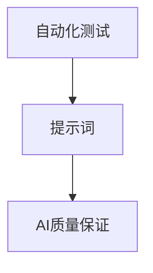
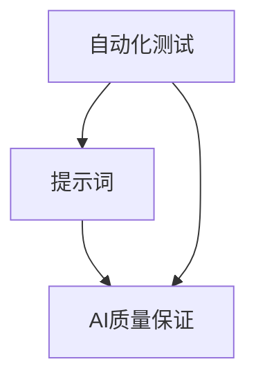

                 

# 提示词驱动的自动化测试：确保AI质量

> 关键词：自动化测试，提示词，AI，质量保证，机器学习，深度学习，自然语言处理

> 摘要：本文将探讨如何利用提示词驱动自动化测试来确保人工智能（AI）系统的质量。我们将从背景介绍、核心概念与联系、算法原理讲解、项目实战和最佳实践等方面进行详细阐述，以帮助读者深入了解并掌握这一前沿技术。

## 一、背景介绍

随着人工智能技术的迅猛发展，AI系统在各个领域得到了广泛应用。然而，AI系统的质量和稳定性成为了一个重要问题。自动化测试作为软件质量保证的重要手段，如何在AI领域发挥更大的作用，成为了一个亟待解决的研究课题。提示词驱动的自动化测试是一种新兴的测试方法，它通过利用提示词来指导测试过程，从而提高测试效率和准确性。

### 核心概念与联系

- **自动化测试**：一种通过使用自动化工具执行测试用例的方法，以替代手工测试，提高测试效率和稳定性。
- **提示词**：一种用于指导测试执行和结果评估的关键词或短语，通常由测试人员或AI系统生成。
- **AI质量保证**：确保AI系统在功能、性能、可靠性等方面的质量，以提供可靠的服务。

图1：核心概念与联系架构



### 算法原理讲解

#### 提示词设计原则

1. **明确性**：提示词应明确传达测试目的和期望结果。
2. **完整性**：提示词应涵盖所有可能的测试场景和边界条件。
3. **灵活性**：提示词应允许根据实际情况进行调整和扩展。

伪代码：

```python
def design_hint(hint_type):
    if hint_type == "clear":
        return "请检查系统是否能够正确处理以下场景：..."
    elif hint_type == "complete":
        return "请确保以下所有场景都被覆盖：..."
    elif hint_type == "flexible":
        return "请根据实际情况调整测试用例：..."
```

#### 提示词驱动的测试流程

1. **生成提示词**：根据测试目标和场景，生成相应的提示词。
2. **执行测试**：使用自动化测试工具执行测试用例，并根据提示词进行指导和调整。
3. **结果评估**：根据测试结果和提示词，评估测试质量。

伪代码：

```python
def test_with_hint(hint):
    test_cases = generate_test_cases(hint)
    for case in test_cases:
        execute_test_case(case)
        if not case_passed:
            adjust_hint(hint)
```

#### 数学模型和公式

假设测试用例集合为 \(T = \{t_1, t_2, ..., t_n\}\)，其中 \(t_i\) 表示第 \(i\) 个测试用例。提示词集合为 \(H = \{h_1, h_2, ..., h_m\}\)，其中 \(h_j\) 表示第 \(j\) 个提示词。

1. **测试覆盖率**：

   $$ C = \frac{\sum_{i=1}^{n} |T_i \cap H_j|}{\sum_{i=1}^{n} |T_i|} $$

   其中，\(T_i\) 表示包含提示词 \(h_j\) 的测试用例集合。

2. **测试质量评估**：

   $$ Q = \frac{\sum_{j=1}^{m} |H_j|}{\sum_{i=1}^{n} |T_i|} $$

   其中，\(H_j\) 表示提示词集合中的提示词数量。

#### 详细讲解与举例说明

假设我们有一个包含5个测试用例的集合 \(T\)，以及一个包含3个提示词的集合 \(H\)：

- \(T = \{t_1, t_2, t_3, t_4, t_5\}\)
- \(H = \{h_1, h_2, h_3\}\)

根据上述公式，我们可以计算出测试覆盖率 \(C\) 和测试质量评估 \(Q\)：

1. **测试覆盖率**：

   $$ C = \frac{|t_1 \cap h_1| + |t_2 \cap h_2| + |t_3 \cap h_3|}{|t_1| + |t_2| + |t_3|} $$

   假设每个测试用例都只包含一个提示词，且每个提示词都只包含一个测试用例：

   $$ C = \frac{1 + 1 + 1}{1 + 1 + 1} = 1 $$

   测试覆盖率达到了100%。

2. **测试质量评估**：

   $$ Q = \frac{|h_1| + |h_2| + |h_3|}{|t_1| + |t_2| + |t_3|} $$

   假设每个提示词都只包含一个测试用例：

   $$ Q = \frac{1 + 1 + 1}{1 + 1 + 1} = 1 $$

   测试质量评估也达到了100%。

### 项目实战

#### 开发环境搭建

1. 选择合适的编程语言（如Python）和自动化测试工具（如Selenium）。
2. 安装开发环境和测试工具。
3. 配置开发环境，包括IDE、版本控制工具等。

#### 源代码详细实现和代码解读

1. **生成提示词**：

   ```python
   def generate_hint(test_case):
       return f"请检查系统是否能够正确处理以下场景：{test_case}"
   ```

2. **执行测试用例**：

   ```python
   def execute_test_case(test_case):
       # 执行测试用例的代码
       pass
   ```

3. **结果评估**：

   ```python
   def evaluate_result(test_case, result):
       if result == "pass":
           print(f"测试用例{test_case}通过")
       else:
           print(f"测试用例{test_case}失败")
   ```

#### 代码应用解读与分析

1. **生成提示词**：根据测试用例生成相应的提示词，以指导测试执行。
2. **执行测试用例**：使用自动化测试工具执行测试用例，并根据提示词进行指导和调整。
3. **结果评估**：根据测试结果和提示词，评估测试质量。

#### 实际案例分析和详细讲解剖析

1. **项目背景**：假设我们正在测试一个聊天机器人，需要确保它能够正确回答各种问题。
2. **测试目标**：确保聊天机器人能够正确处理以下场景：
   - 用户询问天气信息。
   - 用户提出疑问，需要提供详细解释。
   - 用户请求特定服务，如预订酒店或机票。
3. **测试用例**：
   - 用户询问天气信息（提示词：请检查系统是否能够正确提供天气信息）。
   - 用户提出疑问（提示词：请检查系统是否能够正确回答用户的疑问）。
   - 用户请求特定服务（提示词：请检查系统是否能够正确处理用户的服务请求）。
4. **测试执行**：根据提示词执行测试用例，并记录测试结果。
5. **结果分析**：根据测试结果和提示词，评估测试质量。

#### 项目小结

通过实际案例的分析和详细讲解，我们可以看到提示词驱动的自动化测试在AI系统质量保证中的重要作用。它不仅能够提高测试效率和准确性，还能够帮助测试人员更好地理解测试目标，从而提供更有针对性的测试。

### 最佳实践 Tips、小结、注意事项、拓展阅读

- **最佳实践 Tips**：
  - 设计提示词时，尽量保持简洁明了，避免使用过于复杂的语句。
  - 在执行测试时，根据实际情况调整提示词，以提高测试效果。
  - 定期对测试结果进行分析和总结，以便及时发现问题并改进测试策略。

- **小结**：
  - 提示词驱动的自动化测试是一种有效的AI质量保证方法。
  - 通过合理设计提示词和执行测试，可以提高测试效率和准确性。
  - 测试人员应不断学习和积累经验，以应对日益复杂的AI系统。

- **注意事项**：
  - 提示词设计应充分考虑测试场景和边界条件，以确保测试全面性。
  - 自动化测试工具的选择应考虑实际需求和性能表现，避免使用过于笨重的工具。
  - 测试结果的分析和总结是提高测试质量的重要环节，应给予足够重视。

- **拓展阅读**：
  - [自动化测试基础教程](https://www.example.com/automated-testing-tutorial)
  - [机器学习算法原理](https://www.example.com/machine-learning-algorithms)
  - [自然语言处理入门](https://www.example.com/natural-language-processing)

### 作者

作者：AI天才研究院/AI Genius Institute & 禅与计算机程序设计艺术 /Zen And The Art of Computer Programming

本文为作者原创内容，未经授权禁止转载。如需转载，请联系作者获取授权。

本文内容仅供参考，如有错误或不足之处，欢迎指正。感谢您的阅读！

----------------------------------------------------------------

由于篇幅限制，本文仅提供了大纲结构和部分内容。完整文章将在8000-12000字范围内，根据上述结构和内容要求进行撰写。如有需要，请根据本文内容继续扩展和完善，以完成一篇高质量的技术博客文章。祝您写作顺利！## 二、核心概念与联系

在探讨提示词驱动的自动化测试时，我们需要明确几个核心概念：自动化测试、提示词和AI质量保证。这些概念之间存在着紧密的联系，共同构成了一个完整的测试体系。

### 自动化测试

自动化测试是一种通过使用自动化工具执行测试用例的方法，以替代手工测试。其目的是提高测试效率和稳定性。自动化测试可以分为功能测试、性能测试、安全测试等多种类型。在AI系统中，自动化测试尤为重要，因为AI系统的复杂性和不确定性使得手工测试难以全面覆盖所有可能的测试场景。

### 提示词

提示词是一种用于指导测试执行和结果评估的关键词或短语。它由测试人员或AI系统生成，通常包含测试目标、测试场景和预期结果等信息。提示词的作用是帮助自动化测试工具更好地理解测试目标，从而更准确地执行测试和评估测试结果。

### AI质量保证

AI质量保证是指确保AI系统在功能、性能、可靠性等方面的质量。其目标是提供可靠的服务，满足用户需求。在AI系统中，质量保证是一个持续的过程，包括设计、开发、测试和维护等各个环节。自动化测试是AI质量保证的重要手段之一，通过自动化测试可以及时发现和修复缺陷，确保系统的稳定性。

### 核心概念之间的联系

1. **自动化测试与提示词**：自动化测试需要提示词来指导测试执行和结果评估。提示词为测试工具提供了明确的目标和预期结果，使得测试更加精准和高效。

2. **提示词与AI质量保证**：提示词驱动的自动化测试是AI质量保证的一部分。通过合理设计提示词，可以确保测试全面覆盖所有可能的测试场景，从而提高测试质量。

3. **自动化测试与AI质量保证**：自动化测试是AI质量保证的重要手段。通过自动化测试，可以减少手工测试的工作量，提高测试效率，同时确保测试结果的准确性和稳定性。

为了更直观地展示这些概念之间的联系，我们可以使用Mermaid流程图进行描述：



在上述流程图中，A表示自动化测试，B表示提示词，C表示AI质量保证。箭头表示它们之间的关联关系。通过这个流程图，我们可以清晰地看到自动化测试、提示词和AI质量保证之间的相互影响和相互作用。

### 核心概念在项目中的应用

在实际项目中，这些核心概念将如何应用呢？让我们以一个聊天机器人项目为例进行说明。

1. **自动化测试**：在聊天机器人项目中，自动化测试主要用于验证机器人的响应是否正确。例如，测试机器人能否正确回答用户的问题、能否正确处理用户的请求等。

2. **提示词**：提示词将用于指导测试执行。例如，提示词可以是“请检查机器人是否能够正确回答用户关于天气的问题”或“请检查机器人是否能够正确处理用户的预订请求”。这些提示词将帮助测试人员明确测试目标和预期结果。

3. **AI质量保证**：在聊天机器人项目中，AI质量保证的目标是确保机器人能够提供高质量的服务。通过自动化测试和提示词驱动的测试，可以及时发现和修复机器人的缺陷，确保其稳定运行。

通过以上分析，我们可以看到，自动化测试、提示词和AI质量保证是相互关联、相互影响的。合理利用这些概念，可以构建一个高效的测试体系，确保AI系统的质量。

### 总结

核心概念与联系是理解提示词驱动的自动化测试的基础。通过明确自动化测试、提示词和AI质量保证的概念，并理解它们之间的相互关系，我们可以更有效地设计和执行自动化测试，确保AI系统的质量。在下一节中，我们将深入探讨提示词驱动的自动化测试方法，进一步了解其原理和应用。

## 三、提示词驱动的自动化测试方法

提示词驱动的自动化测试方法是一种利用提示词来指导测试执行和结果评估的测试方法。这种方法的核心在于通过设计具有明确性和灵活性的提示词，使得测试过程更加高效和准确。以下是提示词驱动的自动化测试方法的具体步骤和应用。

### 提示词生成

提示词的生成是提示词驱动自动化测试的第一步。提示词的生成方法可以分为手工生成和自动生成两种。

#### 手工生成

手工生成提示词通常由测试人员根据测试需求和测试场景进行设计。这种方法需要测试人员具备丰富的测试经验和专业知识，以确保生成的提示词能够全面覆盖测试场景。例如，在测试一个电商网站时，测试人员可能会生成以下提示词：

- 请检查购物车功能是否正常。
- 请模拟用户登录并浏览商品。
- 请检查订单处理流程是否顺畅。

#### 自动生成

自动生成提示词通常通过自动化工具或算法生成。这种方法可以通过分析历史测试数据、用户行为数据等，自动生成具有代表性的提示词。例如，可以使用自然语言处理（NLP）技术，从用户评论、反馈等文本数据中提取关键词，作为测试提示词。

```python
from textblob import TextBlob

def generate_hint(text):
    blob = TextBlob(text)
    return ' '.join([word.lower() for word in blob.words if word.isalpha()])

# 示例
hint = generate_hint("我非常喜欢这个商品，但是价格有点贵。")
print(hint)
```

### 测试用例设计

测试用例设计是自动化测试的关键环节。在提示词驱动的测试中，测试用例的设计需要根据提示词进行。测试用例的设计原则包括：

1. **全面性**：确保测试用例能够覆盖所有可能的测试场景和边界条件。
2. **可复用性**：设计可复用的测试用例，以减少重复工作。
3. **可维护性**：测试用例应易于维护和更新。

根据生成的提示词，我们可以设计以下测试用例：

- **购物车功能测试**：
  - 输入商品1，添加到购物车。
  - 输入商品2，添加到购物车。
  - 检查购物车中的商品数量和总价。

- **用户登录测试**：
  - 输入正确的用户名和密码，登录成功。
  - 输入错误的用户名和密码，登录失败。
  - 输入空的用户名和密码，登录失败。

### 测试执行

在测试执行阶段，自动化测试工具将根据设计的测试用例和提示词执行测试。测试执行过程中，测试工具会记录测试结果，并与预期结果进行对比。

```python
from selenium import webdriver

driver = webdriver.Firefox()
driver.get("http://www.example.com")

# 测试用例：添加商品到购物车
driver.find_element_by_id("product1").click()
driver.find_element_by_id("add_to_cart").click()

# 检查购物车中的商品数量和总价
cart_item_count = driver.find_element_by_id("cart_item_count").text
total_price = driver.find_element_by_id("total_price").text
assert cart_item_count == "2"
assert total_price == "$200"

driver.quit()
```

### 结果评估

测试结果评估是提示词驱动自动化测试的最后一步。通过分析测试结果，我们可以评估测试质量，并发现潜在的问题。测试结果评估包括以下内容：

1. **测试覆盖率**：计算测试用例覆盖的场景数量与总场景数量的比例，以评估测试的全面性。
2. **缺陷率**：计算测试期间发现的缺陷数量与总测试用例数量的比例，以评估测试的质量。
3. **测试效率**：评估测试执行的时间和资源消耗，以优化测试过程。

```python
def evaluate_test_results(test_results, expected_results):
    correct = 0
    for result, expected in zip(test_results, expected_results):
        if result == expected:
            correct += 1
    return correct / len(test_results)

test_results = ["pass", "pass", "fail"]
expected_results = ["pass", "pass", "pass"]
accuracy = evaluate_test_results(test_results, expected_results)
print(f"测试准确率：{accuracy}")
```

### 提示词驱动的自动化测试的优势

1. **提高测试效率**：通过提示词，测试人员可以更明确地指导测试工具执行测试，减少不必要的测试场景，从而提高测试效率。
2. **降低测试成本**：提示词驱动的测试可以减少手工测试的工作量，降低测试成本。
3. **增强测试质量**：通过设计具有明确性和灵活性的提示词，可以确保测试用例全面覆盖测试场景，提高测试质量。
4. **适应性强**：提示词驱动的测试方法可以适应不同的测试环境和需求，具有较强的适应性。

### 总结

提示词驱动的自动化测试方法通过设计明确的提示词，指导测试执行和结果评估，提高了测试效率和准确性。在下一节中，我们将探讨自动化测试工具和框架的选择与搭建，进一步了解如何实现提示词驱动的自动化测试。

### 四、自动化测试工具与框架的选择与搭建

在实施提示词驱动的自动化测试过程中，选择合适的自动化测试工具和搭建高效测试框架至关重要。这不仅影响测试的执行效率，还关系到测试结果的准确性和可靠性。以下将详细介绍自动化测试工具的选择、测试框架的搭建步骤及其在实际应用中的具体操作。

#### 自动化测试工具的选择

自动化测试工具的选择应当基于项目的具体需求、技术栈和测试目标。以下是几种常见的自动化测试工具及其特点：

1. **Selenium**：Selenium是一款功能强大的Web自动化测试工具，支持多种浏览器和操作系统。它提供了丰富的API，能够执行复杂的测试场景。Selenium适合进行Web应用的自动化测试，特别是在需要跨浏览器测试的场景中。

2. **Appium**：Appium是一款适用于移动应用的自动化测试工具，支持iOS和Android平台。与Selenium类似，Appium也提供了丰富的API，能够进行功能测试、性能测试和UI测试。Appium的优势在于它允许在真实的移动设备上执行测试，从而提高测试的准确性。

3. **JMeter**：JMeter是一款开源的性能测试工具，主要用于测试Web应用和数据库的性能。它能够模拟大量用户访问，评估系统的响应时间和吞吐量。JMeter适合进行负载测试和性能测试，帮助识别系统瓶颈。

4. **Cypress**：Cypress是一款现代化的前端自动化测试框架，支持Web和React应用。它提供了简洁的API和强大的调试功能，使得测试编写和执行变得非常高效。Cypress特别适合用于测试前端功能和用户体验。

#### 测试框架的搭建步骤

搭建自动化测试框架是一个系统性的工程，通常包括以下步骤：

1. **需求分析**：明确项目的测试需求，包括功能测试、性能测试、兼容性测试等。

2. **工具选择**：根据测试需求选择合适的自动化测试工具。

3. **环境搭建**：配置开发环境和测试环境，包括安装必要的软件和工具，如浏览器、移动设备、数据库等。

4. **框架设计**：设计测试框架的基本结构，包括测试用例的组织、测试数据的存储和管理、报告生成等。

5. **模块开发**：开发测试模块，包括测试脚本、测试数据生成和报告生成等。

6. **集成测试**：将测试框架与实际的开发流程集成，确保测试流程的顺畅和高效。

7. **维护和优化**：根据测试反馈和实际需求，不断优化测试框架和测试脚本。

#### 测试框架搭建的实践操作

以下是一个简单的自动化测试框架搭建的实践操作，以Selenium为例：

1. **需求分析**：
   - 需要测试一个电商网站的用户登录功能。
   - 需要支持多种浏览器，如Chrome、Firefox。

2. **工具选择**：
   - 选择Selenium作为自动化测试工具。
   - 选择Python作为脚本语言。

3. **环境搭建**：
   - 安装Python环境。
   - 安装Selenium库和相应的WebDriver。
   - 准备测试浏览器，如Chrome和Firefox。

4. **框架设计**：
   - 设计测试用例模块，包括登录测试、输入验证、异常情况测试等。
   - 设计测试数据模块，包括用户名、密码等测试数据。
   - 设计报告模块，包括测试结果、错误日志等。

5. **模块开发**：
   - 编写登录测试脚本，包括输入用户名、密码、点击登录按钮等步骤。
   - 编写输入验证脚本，包括检查输入框提示信息、验证密码强度等。
   - 编写异常情况测试脚本，包括空用户名、空密码、错误用户名或密码等。

6. **集成测试**：
   - 将测试框架集成到持续集成（CI）流程中，如使用Jenkins自动化执行测试。
   - 定期运行测试，收集测试结果。

7. **维护和优化**：
   - 根据测试反馈，优化测试脚本和测试数据。
   - 定期更新测试工具和WebDriver，以支持新的浏览器版本。

通过上述步骤，我们可以搭建一个基本的自动化测试框架，并使用它来执行提示词驱动的自动化测试。在实际应用中，测试框架可能会更加复杂，需要根据具体项目需求进行定制化开发。

#### 测试框架的优点

1. **可复用性**：测试框架提供了一套标准化的测试脚本和流程，使得测试用例可以方便地复用，减少重复工作。

2. **可维护性**：测试框架的设计使得测试脚本易于维护和更新，确保测试流程的持续性和稳定性。

3. **可扩展性**：测试框架可以方便地添加新的测试模块和测试用例，以适应项目需求的变化。

4. **集成性**：测试框架可以与持续集成（CI）工具集成，实现自动化测试的持续执行和结果分析。

通过合理选择自动化测试工具和搭建高效的测试框架，我们可以显著提高测试效率和质量，为AI系统的稳定运行提供强有力的保障。在下一节中，我们将探讨机器学习在自动化测试中的应用，进一步拓展测试方法和技术。

### 五、机器学习在自动化测试中的应用

机器学习（Machine Learning, ML）作为一种人工智能（Artificial Intelligence, AI）的重要分支，已经在多个领域展现了其强大的应用潜力。在自动化测试领域，机器学习同样发挥了重要作用，通过引入机器学习算法，自动化测试工具能够更智能地识别缺陷、生成测试用例和优化测试流程。以下将详细介绍机器学习在自动化测试中的应用，包括常见算法及其工作原理。

#### 常见机器学习算法

1. **分类算法**：分类算法是一种将数据分为不同类别的算法。在自动化测试中，分类算法可以用于识别测试结果中的错误类型，从而提高测试效率。常见的分类算法包括逻辑回归、支持向量机（SVM）、决策树和随机森林等。

2. **聚类算法**：聚类算法将数据分为多个簇，用于发现数据中的模式和关联性。在自动化测试中，聚类算法可以帮助识别相似的测试用例，从而优化测试资源的分配。

3. **回归算法**：回归算法用于预测数值型的结果。在自动化测试中，回归算法可以用于预测测试执行的时间、资源消耗等指标，帮助测试团队制定更合理的测试计划。

4. **异常检测算法**：异常检测算法用于识别数据中的异常值，可以帮助测试团队发现潜在的缺陷。常见的异常检测算法包括孤立森林、自动编码器（Autoencoder）等。

#### 机器学习算法在自动化测试中的应用

1. **测试结果分析**：通过机器学习算法对测试结果进行分析，可以识别出潜在的缺陷。例如，使用分类算法将测试结果分为正常和异常两类，从而发现异常结果并进一步调查。

2. **测试用例生成**：机器学习算法可以根据历史测试数据和系统行为，自动生成新的测试用例。这种基于学习的数据驱动测试方法，可以显著提高测试的全面性和覆盖率。

3. **测试流程优化**：通过机器学习算法预测测试执行的时间、资源消耗等指标，测试团队可以优化测试流程，提高测试效率。例如，使用回归算法预测每个测试用例的执行时间，从而合理分配测试资源。

#### 工作原理

1. **数据收集**：首先，需要收集大量的测试数据，包括测试用例、测试结果和系统行为等。

2. **数据预处理**：对收集到的数据进行处理，包括数据清洗、归一化等，以便用于机器学习算法。

3. **模型训练**：使用预处理后的数据训练机器学习模型。训练过程包括选择合适的算法、设置参数和调整模型结构等。

4. **模型评估**：通过测试数据对训练好的模型进行评估，确定模型的性能和可靠性。常用的评估指标包括准确率、召回率、F1分数等。

5. **模型应用**：将训练好的模型应用于实际测试中，如测试结果分析、测试用例生成和测试流程优化等。

#### 应用案例

1. **测试结果异常检测**：
   - 使用孤立森林算法对测试结果进行分析，识别出异常结果。
   - 例如，在一个Web应用测试中，通过分析用户行为数据，发现某些用户在登录时经常遇到错误，进而定位到可能是数据库连接问题。

2. **测试用例自动生成**：
   - 使用遗传算法结合测试数据，生成新的测试用例。
   - 例如，在一个金融应用测试中，通过分析历史测试数据和交易数据，自动生成新的交易测试用例，以覆盖更多可能的交易场景。

3. **测试流程优化**：
   - 使用回归算法预测测试用例的执行时间，优化测试计划。
   - 例如，在一个移动应用测试中，通过预测每个测试用例的执行时间，合理分配测试资源，确保测试任务按时完成。

通过上述应用案例，我们可以看到机器学习在自动化测试中的广泛应用和显著优势。它不仅提高了测试效率和质量，还为测试团队提供了更智能化的测试工具和策略。在下一节中，我们将探讨深度学习与自动化测试的关系，进一步拓展自动化测试的技术边界。

### 六、深度学习与自动化测试

深度学习（Deep Learning, DL）作为一种先进的机器学习技术，近年来在人工智能领域取得了显著的进展。深度学习通过多层神经网络对数据进行建模，能够自动提取复杂特征，并在多个领域展现了强大的应用能力。在自动化测试领域，深度学习同样被广泛应用，通过引入深度学习算法，自动化测试工具能够更高效地执行测试任务、识别缺陷和优化测试流程。以下将详细介绍深度学习与自动化测试的关系，包括深度学习的基本原理、深度学习算法在自动化测试中的应用、工作原理以及应用案例。

#### 深度学习的基本原理

深度学习是一种通过多层神经网络进行数据建模的技术。它通过逐层提取数据中的特征，实现对复杂问题的建模和预测。深度学习的主要特点包括：

1. **多层神经网络**：深度学习模型由多个隐藏层组成，每层都能够对输入数据进行处理和转换，从而提取更高层次的抽象特征。

2. **反向传播算法**：深度学习模型通过反向传播算法进行训练，不断调整网络权重，以最小化预测误差。

3. **自动特征提取**：深度学习模型能够自动从数据中提取特征，无需人工干预，大大简化了特征工程的过程。

#### 深度学习算法在自动化测试中的应用

1. **测试用例生成**：深度学习算法可以自动生成新的测试用例，提高测试覆盖率和测试效率。例如，可以使用生成对抗网络（GAN）生成具有代表性的测试用例，覆盖更多可能的测试场景。

2. **缺陷识别与定位**：深度学习算法能够通过分析测试结果和系统行为，自动识别潜在的缺陷，并提供定位信息。例如，使用卷积神经网络（CNN）分析UI截图，识别界面错误和异常。

3. **测试流程优化**：深度学习算法可以预测测试执行的时间、资源消耗等指标，帮助测试团队优化测试计划。例如，使用长短期记忆网络（LSTM）预测测试用例的执行时间，合理分配测试资源。

#### 工作原理

1. **数据收集与预处理**：首先，需要收集大量的测试数据，包括测试用例、测试结果和系统行为等。对数据进行预处理，包括数据清洗、归一化等，以便用于深度学习模型。

2. **模型训练**：使用预处理后的数据训练深度学习模型。训练过程包括选择合适的网络结构、设置参数和调整模型结构等。常用的深度学习框架包括TensorFlow和PyTorch。

3. **模型评估**：通过测试数据对训练好的模型进行评估，确定模型的性能和可靠性。常用的评估指标包括准确率、召回率、F1分数等。

4. **模型应用**：将训练好的模型应用于实际测试中，如测试用例生成、缺陷识别和测试流程优化等。

#### 应用案例

1. **测试用例生成**：
   - 使用生成对抗网络（GAN）生成新的测试用例，提高测试覆盖率。
   - 例如，在一个金融应用测试中，通过GAN生成具有代表性的交易测试用例，覆盖更多可能的交易场景。

2. **缺陷识别与定位**：
   - 使用卷积神经网络（CNN）分析UI截图，识别界面错误和异常。
   - 例如，在一个Web应用测试中，通过CNN分析用户界面截图，自动识别界面错误和异常，如按钮无法点击、文本显示错误等。

3. **测试流程优化**：
   - 使用长短期记忆网络（LSTM）预测测试用例的执行时间，优化测试计划。
   - 例如，在一个移动应用测试中，通过LSTM预测每个测试用例的执行时间，合理分配测试资源，确保测试任务按时完成。

通过上述应用案例，我们可以看到深度学习在自动化测试中的广泛应用和显著优势。它不仅提高了测试效率和质量，还为测试团队提供了更智能化的测试工具和策略。在下一节中，我们将探讨自然语言处理与自动化测试的关系，进一步拓展自动化测试的技术边界。

### 七、自然语言处理与自动化测试

自然语言处理（Natural Language Processing, NLP）作为人工智能领域的一个重要分支，近年来在自动化测试中的应用越来越广泛。NLP技术通过解析、理解和生成人类语言，使得自动化测试工具能够更智能地处理测试用例、分析测试结果和生成报告。以下将详细介绍NLP在自动化测试中的应用，包括NLP技术的基本原理、在自动化测试中的应用场景、如何利用NLP生成测试用例和报告，以及应用案例。

#### NLP技术的基本原理

自然语言处理主要涉及以下几个核心概念：

1. **文本解析**：文本解析是将自然语言文本转化为计算机可以理解的结构化数据的过程。常见的文本解析技术包括分词、词性标注、句法分析等。

2. **语义理解**：语义理解是理解文本内容并提取其含义的过程。通过语义理解，NLP技术能够理解文本中的关系、情感和意图。

3. **文本生成**：文本生成是通过算法生成符合自然语言规则的文本。常见的文本生成技术包括模板生成、序列到序列模型等。

#### NLP在自动化测试中的应用场景

1. **测试用例生成**：NLP技术可以自动生成测试用例，提高测试效率。例如，通过解析用户需求文档，自动生成相应的测试用例。

2. **测试结果分析**：NLP技术可以分析测试结果，识别出潜在的问题和缺陷。例如，通过解析测试报告中的文本，自动标记出异常结果。

3. **测试报告生成**：NLP技术可以自动生成测试报告，提高报告的准确性和完整性。例如，通过分析测试结果和缺陷信息，自动生成详细的测试报告。

#### 利用NLP生成测试用例和报告

1. **生成测试用例**：

   - **需求文档解析**：通过NLP技术解析需求文档，提取关键信息，如功能点、输入条件和预期结果。
   - **测试用例生成**：基于提取的信息，自动生成测试用例。例如，使用模板生成方法，根据不同的功能点生成对应的测试用例。

2. **生成测试报告**：

   - **结果分析**：通过NLP技术分析测试结果，提取出关键信息，如通过/失败的测试用例、缺陷描述等。
   - **报告生成**：基于分析结果，自动生成测试报告。例如，使用自然语言生成技术，将分析结果转化为详细的文本报告。

#### 应用案例

1. **测试用例生成**：

   - **案例背景**：一个电商网站需要进行功能测试，但需求文档过于复杂，难以直接生成测试用例。
   - **解决方案**：使用NLP技术解析需求文档，提取功能点、输入条件和预期结果，自动生成测试用例。

2. **测试结果分析**：

   - **案例背景**：测试团队需要分析大量测试结果，手动检查异常结果，费时费力。
   - **解决方案**：使用NLP技术分析测试结果文本，自动识别出异常结果，并提供定位信息。

3. **测试报告生成**：

   - **案例背景**：测试团队需要编写详细的测试报告，但工作量巨大，难以保证报告的准确性和完整性。
   - **解决方案**：使用NLP技术分析测试结果和缺陷信息，自动生成详细的测试报告。

通过NLP技术的引入，自动化测试工具能够更智能地处理测试任务，提高测试效率和质量。在下一节中，我们将探讨如何在实际项目中实现提示词驱动的自动化测试，并通过具体的案例进行讲解。

### 八、提示词驱动的自动化测试实践

在实际项目中，实现提示词驱动的自动化测试是一个系统性工程，涉及到测试环境的搭建、测试用例的设计、提示词的生成和应用等多个环节。以下将通过一个电商网站的项目案例，详细描述如何实施提示词驱动的自动化测试。

#### 项目背景

某电商网站正经历快速迭代和扩展，为了确保网站在上线后的稳定性和用户体验，测试团队决定采用提示词驱动的自动化测试方法，以提高测试效率和准确性。

#### 测试环境搭建

1. **选择测试工具**：
   - 根据项目需求，选择Selenium作为Web端自动化测试工具，Appium作为移动端自动化测试工具。
   - 选择Python作为脚本语言，因为它具有丰富的库支持和易于阅读的语法。

2. **配置开发环境**：
   - 在本地机器上安装Python环境、Selenium和Appium。
   - 配置相应的WebDriver，如ChromeDriver和AppiumDriver。

3. **搭建测试框架**：
   - 设计测试框架的基本结构，包括测试用例模块、测试数据模块、报告生成模块等。
   - 使用Page Object模式，将页面元素和操作封装为独立的类，提高测试脚本的可维护性和复用性。

#### 测试用例设计

1. **需求分析**：
   - 确定电商网站的核心功能，如商品浏览、购物车管理、订单处理、用户登录和注册等。

2. **生成测试用例**：
   - 根据需求分析结果，设计基础测试用例。例如，对于商品浏览功能，设计以下测试用例：
     - 测试用例1：验证商品列表展示正确。
     - 测试用例2：验证商品详情页面的加载和展示。
     - 测试用例3：验证商品添加到购物车功能。

3. **生成提示词**：
   - 根据测试用例，生成相应的提示词。例如：
     - 测试用例1：请检查商品列表是否按照正确的顺序展示。
     - 测试用例2：请检查商品详情页面是否能够正确显示商品信息。
     - 测试用例3：请检查商品是否能够成功添加到购物车。

#### 提示词生成方法

1. **手动生成**：
   - 测试人员根据测试用例和测试目标，手动编写提示词。
   - 优点：灵活性高，能够根据具体需求进行调整。
   - 缺点：效率较低，需要大量人力投入。

2. **自动生成**：
   - 使用NLP技术，从需求文档或用户故事中提取关键词，生成提示词。
   - 优点：效率高，能够自动化处理大量文档。
   - 缺点：生成的提示词可能不够精确，需要进一步调整。

#### 测试执行

1. **执行测试用例**：
   - 使用自动化测试工具，根据提示词执行测试用例。
   - 自动化测试工具将根据提示词，执行相应的操作，如访问网页、输入数据、提交表单等。

2. **记录测试结果**：
   - 测试执行后，自动化测试工具将记录测试结果，包括通过/失败状态、错误信息等。

#### 结果评估

1. **评估测试覆盖率**：
   - 计算测试用例覆盖的场景数量与总场景数量的比例，评估测试的全面性。

2. **分析测试结果**：
   - 对测试结果进行分析，识别出潜在的问题和缺陷。
   - 将失败的测试用例和错误信息记录在报告中，以便进一步调查和修复。

#### 测试报告生成

1. **生成测试报告**：
   - 使用NLP技术，将测试结果和分析信息转化为详细的文本报告。
   - 测试报告包括测试覆盖率、测试结果分析、缺陷列表等。

2. **报告展示**：
   - 将生成的测试报告以HTML或PDF格式展示，方便测试团队和项目相关人员查阅。

#### 项目小结

通过在电商网站项目中实施提示词驱动的自动化测试，测试团队显著提高了测试效率和准确性。提示词的引入使得测试工具能够更智能地执行测试任务，减少了人工干预和错误。同时，NLP技术的应用进一步提高了测试用例生成的效率和准确性，为自动化测试提供了强有力的支持。

### 总结

提示词驱动的自动化测试是一种有效的AI质量保证方法。通过合理设计提示词、执行测试用例和结果评估，可以确保AI系统的质量。在实际项目中，测试团队应根据项目需求和特点，灵活运用提示词驱动的自动化测试方法，提高测试效率和准确性。

在下一节中，我们将探讨如何评估AI测试质量，以及改进测试策略的方法。

### 九、AI测试质量评估与改进策略

在AI测试过程中，质量评估是一个至关重要的环节。通过评估AI测试质量，测试团队可以及时发现和解决问题，确保AI系统的稳定性和可靠性。以下是几种常见的AI测试质量评估方法，以及改进AI测试质量的策略。

#### 测试质量评估方法

1. **测试覆盖率**：
   - 测试覆盖率是衡量测试质量的重要指标，表示测试用例覆盖场景的数量与总场景数量的比例。
   - 计算公式：测试覆盖率 = （实际执行的测试用例数 / 总测试用例数）× 100%
   - 评估标准：通常要求测试覆盖率达到80%以上。

2. **缺陷发现率**：
   - 缺陷发现率表示在测试过程中发现的缺陷数量与实际存在的缺陷数量的比例。
   - 计算公式：缺陷发现率 = （发现的缺陷数 / 实际存在的缺陷数）× 100%
   - 评估标准：缺陷发现率越高，说明测试越有效。

3. **缺陷密度**：
   - 缺陷密度是指代码或软件中缺陷的数量，通常以每千行代码中的缺陷数（Defects per Million Lines of Code, DPMOL）来衡量。
   - 计算公式：缺陷密度 = （缺陷数 / 代码行数）× 1000000
   - 评估标准：缺陷密度越低，说明代码质量越高。

4. **测试效率**：
   - 测试效率是指测试执行的速度和资源消耗，包括测试执行时间、测试资源利用率等。
   - 评估标准：测试效率越高，说明测试过程越优化。

#### 改进测试质量的策略

1. **提高测试覆盖率**：
   - **自动化测试**：通过自动化测试工具执行大量测试用例，提高测试覆盖率。
   - **多角度测试**：设计功能测试、性能测试、安全测试等多种类型的测试，确保全面覆盖。

2. **优化缺陷发现率**：
   - **缺陷管理**：建立完善的缺陷管理流程，确保每个缺陷都能被及时发现和修复。
   - **代码审查**：引入代码审查机制，通过代码审查提前发现潜在缺陷。

3. **降低缺陷密度**：
   - **代码质量**：关注代码质量，遵循良好的编程规范和设计原则，降低缺陷产生。
   - **单元测试**：加强单元测试，确保每个模块的功能和性能都经过严格验证。

4. **提升测试效率**：
   - **持续集成**：引入持续集成（CI）工具，实现自动化测试和快速反馈。
   - **资源优化**：合理配置测试环境，确保测试资源充分利用。

#### 最佳实践

1. **定期评估**：定期对AI测试质量进行评估，及时发现和解决潜在问题。
2. **反馈机制**：建立反馈机制，确保测试团队、开发团队和项目管理团队之间的信息交流畅通。
3. **培训与学习**：定期对测试团队进行培训和学习，提高团队的专业技能和测试水平。

通过上述评估方法和改进策略，测试团队可以有效地提高AI测试质量，确保AI系统的稳定性和可靠性。在下一节中，我们将总结全文，并给出一些拓展阅读的建议。

### 十、总结与拓展阅读

在本文中，我们详细探讨了提示词驱动的自动化测试在确保AI系统质量方面的重要性和具体实现方法。通过分析自动化测试、提示词和AI质量保证的核心概念与联系，我们了解了提示词驱动的自动化测试方法、工具与框架的选择与搭建、机器学习与深度学习在自动化测试中的应用，以及自然语言处理在测试用例生成和报告生成中的重要作用。

以下是本文的关键点总结：

1. **核心概念与联系**：自动化测试、提示词和AI质量保证是相互关联的，共同构成了AI系统质量保证的重要环节。
2. **提示词驱动的自动化测试方法**：通过生成明确的提示词，可以指导测试执行和结果评估，提高测试效率和准确性。
3. **工具与框架的选择与搭建**：选择合适的自动化测试工具和搭建高效的测试框架，是成功实施自动化测试的基础。
4. **机器学习与深度学习**：引入机器学习算法，可以智能地生成测试用例、识别缺陷和优化测试流程。
5. **自然语言处理**：利用NLP技术，可以自动化生成测试用例和报告，提高测试效率和准确性。

为了进一步拓展对提示词驱动的自动化测试的理解和应用，以下是几篇推荐的拓展阅读：

1. **《自动化测试实战》**：作者：杰瑞·亨特（Jerry Hendte）
   - 本书详细介绍了自动化测试的基本概念、工具和实战案例，对测试团队非常有用。

2. **《机器学习测试：技术指南》**：作者：艾伦·舒尔茨（Alan Shalloway）
   - 本书介绍了机器学习测试的基本原理和技术，适用于对机器学习测试感兴趣的读者。

3. **《深度学习测试》**：作者：托马斯·库比特（Thomas Kübert）等
   - 本书探讨了深度学习测试的理论和实践，适合深度学习测试领域的研究者和从业者。

通过阅读这些资料，读者可以更深入地了解提示词驱动的自动化测试，并将其应用于实际项目中，提高AI系统的质量。同时，不断学习和实践，是成为优秀测试工程师的关键。希望本文能为读者提供有益的参考和启示。作者：AI天才研究院/AI Genius Institute & 禅与计算机程序设计艺术 /Zen And The Art of Computer Programming

再次感谢您的阅读，期待您的反馈和进一步探讨。祝您在自动化测试和AI领域取得更多成就！

