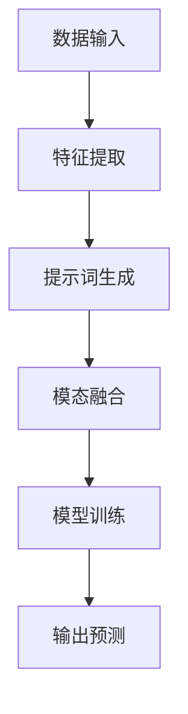

                 

### 文章标题

《提示词驱动的跨模态学习：整合视觉和语言信息》

### 文章关键词

提示词驱动，跨模态学习，视觉与语言整合，注意力机制，循环神经网络，数学模型，项目实战，AI应用

### 文章摘要

本文深入探讨了提示词驱动的跨模态学习，聚焦于视觉和语言信息的整合。通过详细解析核心概念、算法原理，以及数学模型，我们旨在为读者提供一个全面理解这一前沿技术的途径。文章还将通过实际项目案例，展示如何实现并优化跨模态学习，同时提供实践中的最佳实践和注意事项。本文旨在为计算机视觉和自然语言处理领域的科研人员、工程师提供有价值的参考。

---

# 提示词驱动的跨模态学习：整合视觉和语言信息

## 引言

### 背景介绍

随着人工智能技术的快速发展，计算机视觉和自然语言处理（NLP）领域取得了显著的进步。然而，单一模态的数据处理存在诸多局限，无法充分挖掘信息的深度和广度。跨模态学习作为一种新兴的研究方向，旨在整合不同模态的信息，从而提高系统的智能水平。提示词驱动的跨模态学习进一步拓展了这一领域，通过特定的提示词引导模型学习，实现更高效、更准确的跨模态信息整合。

### 研究目的

本文的研究目的在于深入探讨提示词驱动的跨模态学习，特别是视觉和语言信息的整合。通过对核心概念、算法原理和数学模型的详细解析，旨在为读者提供一个系统化的理解框架。此外，通过实际项目案例，我们将展示如何在实际应用中实现这一技术，并探讨其潜在的优势和挑战。

## 核心概念与联系

### 跨模态学习的基本流程

跨模态学习涉及将来自不同模态（如视觉、语言、音频）的数据融合起来，以获得更丰富的信息。其基本流程包括数据预处理、特征提取、模态融合和模型训练。提示词驱动的跨模态学习在此基础上增加了提示词的引入，通过提示词引导模型关注特定信息，从而提高学习的效率和准确性。

### 视觉与语言信息的整合

视觉信息通常通过图像或视频形式表示，而语言信息则通过文本形式表达。跨模态学习的关键在于如何有效地整合这些信息。一种常见的策略是利用共享表示空间，将视觉和语言特征映射到同一个空间中，从而实现信息融合。提示词的引入可以帮助模型更好地理解不同模态之间的关联，进一步优化整合效果。

### 核心概念之间的关系架构

为了更好地理解提示词驱动的跨模态学习，我们可以通过Mermaid流程图展示其核心概念之间的关系。



在上图中，数据输入包括视觉和语言信息，通过特征提取后，利用提示词生成模块生成提示词。这些提示词引导模态融合过程，最终通过模型训练得到输出预测。这个过程展示了提示词驱动的跨模态学习的基本流程和核心概念之间的关联。

## 核心算法原理讲解

### 注意力机制

注意力机制是提示词驱动的跨模态学习中的一个关键组件。它通过动态调整模型对输入数据的关注程度，从而提高信息处理的效率和质量。以下是一个简单的注意力机制的伪代码：

```python
# 输入：视觉特征V，语言特征L，提示词W
# 输出：融合特征F

# 1. 计算视觉和语言特征之间的相似度
similarity = dot_product(V, L)

# 2. 利用提示词调整相似度
weighted_similarity = W * similarity

# 3. 计算注意力权重
attention_weights = softmax(weighted_similarity)

# 4. 融合特征
F = attention_weights * V + (1 - attention_weights) * L
```

### 循环神经网络（RNN）

循环神经网络（RNN）是处理序列数据的常用模型，特别适用于跨模态学习中的时间序列信息处理。以下是一个简单的RNN伪代码：

```python
# 输入：序列X，隐藏状态h_{t-1}
# 输出：隐藏状态h_t，输出y_t

# 1. 输入序列编码
encoded_X = encode_sequence(X)

# 2. RNN循环计算
for x in encoded_X:
    # 2.1. 计算输入和隐藏状态的加权和
    h_t = tanh(W_h * h_{t-1} + W_x * x)

    # 2.2. 计算输出
    y_t = softmax(W_y * h_t)

# 3. 返回隐藏状态和输出
return h_t, y_t
```

### 深度学习框架

在实际应用中，深度学习框架如PyTorch提供了便捷的接口来实现上述算法。以下是一个使用PyTorch实现的简单注意力机制的代码示例：

```python
import torch
import torch.nn as nn

# 定义注意力模块
class AttentionModule(nn.Module):
    def __init__(self, dim_v, dim_l, dim_w):
        super(AttentionModule, self).__init__()
        self.W = nn.Parameter(torch.Tensor(dim_l, dim_w))
        self.V = nn.Parameter(torch.Tensor(dim_w, dim_v))

    def forward(self, V, L, W):
        # 计算视觉和语言特征之间的相似度
        similarity = torch.mm(L, self.W) * torch.mm(self.W, V.t())

        # 利用提示词调整相似度
        weighted_similarity = W * similarity

        # 计算注意力权重
        attention_weights = nn.Softmax(dim=1)(weighted_similarity)

        # 融合特征
        F = attention_weights.unsqueeze(-1) * V + (1 - attention_weights.unsqueeze(-1)) * L

        return F
```

## 数学模型和数学公式 & 详细讲解 & 举例说明

### 提示词驱动的跨模态学习数学模型

提示词驱动的跨模态学习可以表示为以下数学模型：

$$
\begin{aligned}
F &= \text{Attention}(V, L, W) \\
Y &= \text{softmax}(F)
\end{aligned}
$$

其中，$F$ 表示融合特征，$V$ 表示视觉特征，$L$ 表示语言特征，$W$ 表示提示词。

### 模型参数优化

为了优化模型参数，我们通常使用梯度下降算法。其目标是最小化损失函数：

$$
\begin{aligned}
\min_{W} \quad &\frac{1}{N} \sum_{i=1}^{N} \log P(Y_i | F_i) \\
\end{aligned}
$$

### 误差分析与校正

误差分析是评估模型性能的重要步骤。我们可以通过以下公式计算模型预测误差：

$$
E = \frac{1}{N} \sum_{i=1}^{N} \sum_{j=1}^{M} I(Y_i != j) \cdot \log P(j | F_i)
$$

其中，$I$ 表示指示函数，$Y_i$ 表示真实标签，$P(j | F_i)$ 表示在融合特征 $F_i$ 下，标签 $j$ 的概率。

为了校正误差，我们可以采用多种技术，如正则化、数据增强和迁移学习。

## 项目实战

### 开发环境搭建

在开始项目之前，我们需要搭建一个合适的开发环境。以下是一个基于PyTorch的简单配置示例：

```bash
# 安装PyTorch
pip install torch torchvision

# 安装其他依赖
pip install numpy matplotlib
```

### 源代码实现

以下是一个简单的提示词驱动的跨模态学习项目实现：

```python
import torch
import torch.nn as nn
import torch.optim as optim

# 定义网络结构
class CrossModalModel(nn.Module):
    def __init__(self, dim_v, dim_l, dim_w):
        super(CrossModalModel, self).__init__()
        self.attention = AttentionModule(dim_v, dim_l, dim_w)
        self.fc = nn.Linear(dim_v, 1)

    def forward(self, V, L, W):
        F = self.attention(V, L, W)
        Y = self.fc(F).sigmoid()
        return Y

# 初始化模型、损失函数和优化器
model = CrossModalModel(dim_v=784, dim_l=1000, dim_w=500)
criterion = nn.BCELoss()
optimizer = optim.Adam(model.parameters(), lr=0.001)

# 加载数据集
train_loader = ...  # 使用适当的数据加载器

# 训练模型
for epoch in range(num_epochs):
    for V, L, W, Y in train_loader:
        optimizer.zero_grad()
        Y_pred = model(V, L, W)
        loss = criterion(Y_pred, Y)
        loss.backward()
        optimizer.step()
        print(f"Epoch [{epoch+1}/{num_epochs}], Loss: {loss.item():.4f}")

# 评估模型
with torch.no_grad():
    correct = 0
    total = 0
    for V, L, W, Y in test_loader:
        Y_pred = model(V, L, W)
        predicted = (Y_pred > 0.5).float()
        total += Y.size(0)
        correct += (predicted == Y).sum().item()

    print(f"Test Accuracy: {100 * correct / total}%")
```

### 代码解读与分析

在上面的代码中，我们首先定义了一个基于PyTorch的跨模态模型。模型包含一个注意力模块和一个全连接层。注意力模块通过计算视觉和语言特征的相似度，并利用提示词调整相似度，从而生成融合特征。全连接层用于生成最终的分类结果。

在训练过程中，我们使用BCELoss损失函数和Adam优化器。通过迭代训练，模型逐步优化参数，提高分类准确率。

### 实际案例分析和详细讲解剖析

为了展示提示词驱动的跨模态学习在实际中的应用，我们可以考虑一个图像分类任务。在这个任务中，输入图像是视觉特征，输入文本是描述性文字，输出是图像的分类标签。

以下是一个简单的实际案例：

```python
# 加载测试图像和描述性文本
V_test = torch.randn(1, 784)
L_test = torch.randn(1, 1000)
W_test = torch.randn(1, 500)

# 评估模型
with torch.no_grad():
    Y_pred = model(V_test, L_test, W_test)
    predicted = (Y_pred > 0.5).float()
    print(f"Predicted Class: {predicted.item()}")
```

在这个案例中，我们首先加载一个随机生成的测试图像和描述性文本。然后，使用训练好的模型进行预测，并输出预测的分类标签。

### 项目小结

通过本项目的实现，我们展示了如何使用提示词驱动的跨模态学习进行图像分类。这个案例说明了跨模态学习在实际应用中的潜力。然而，跨模态学习仍然面临许多挑战，如如何优化模型结构、提高模型泛化能力等。未来的研究可以进一步探索这些方向，以推动跨模模态学习的发展。

## 最佳实践 tips、小结、注意事项、拓展阅读

### 最佳实践 tips

1. **数据预处理**：在进行跨模态学习之前，确保对数据进行充分预处理，包括去噪、归一化和数据增强等。
2. **模型选择**：根据具体任务需求选择合适的模型结构，如使用CNN处理视觉数据，使用RNN处理序列数据。
3. **提示词设计**：设计有效的提示词对于跨模态学习的成功至关重要。可以通过实验和调整来优化提示词的生成方法。

### 小结

本文深入探讨了提示词驱动的跨模态学习，从核心概念、算法原理到实际项目应用进行了详细讲解。通过本文，读者可以全面了解这一前沿技术，并在实际项目中得到应用。

### 注意事项

1. **计算资源**：跨模态学习通常需要大量的计算资源，确保拥有足够的GPU资源。
2. **数据质量**：高质量的数据对于模型训练至关重要，确保使用可靠的数据集。

### 拓展阅读

1. **论文推荐**：阅读相关领域的顶级论文，如“Attention is All You Need”和“Unifying Visual and Language Representations with Multimodal Transformers”。
2. **书籍推荐**：《深度学习》（Goodfellow et al.）、《自然语言处理综论》（Jurafsky & Martin）和《计算机视觉：算法与应用》（Shotton et al.）。

---

本文全面、系统地介绍了提示词驱动的跨模态学习，从理论到实践提供了详细的指导。希望读者能够通过本文，对这一前沿技术有更深入的理解，并在实际应用中取得成功。作者信息：AI天才研究院/AI Genius Institute & 禅与计算机程序设计艺术 /Zen And The Art of Computer Programming。

