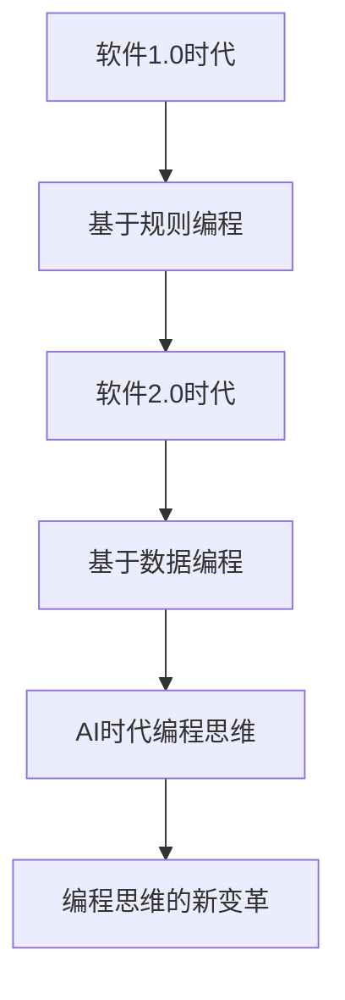
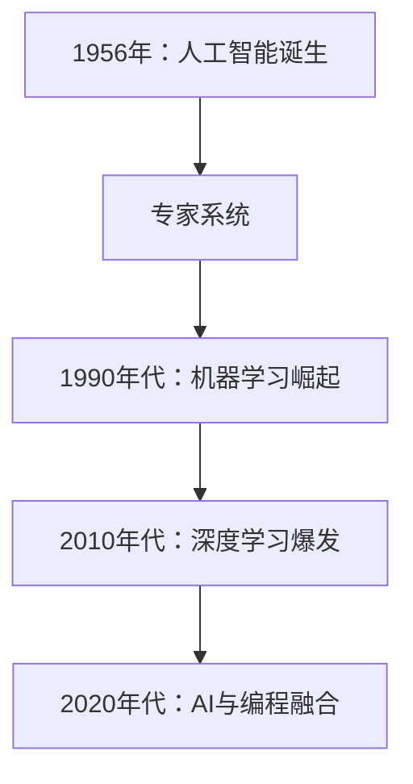
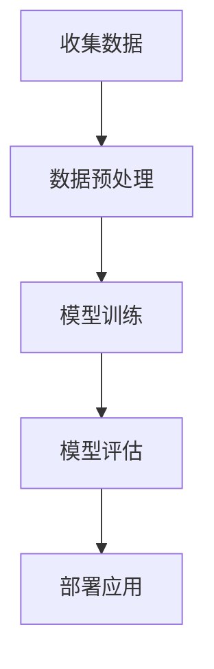
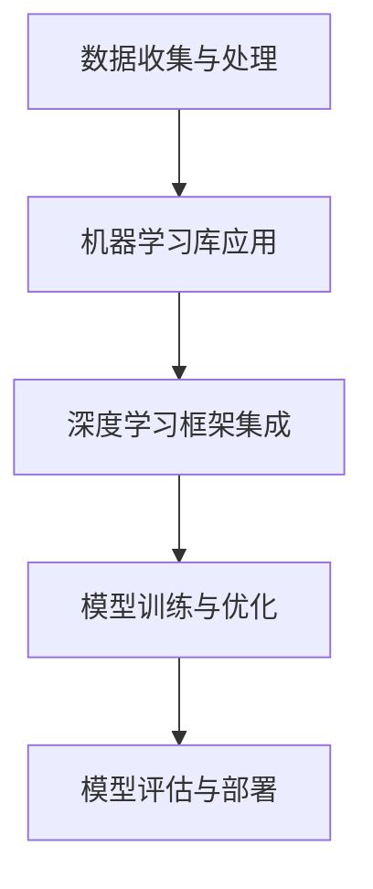
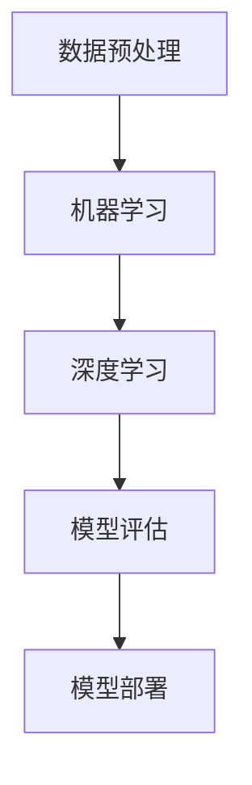
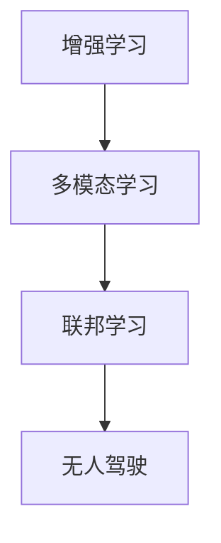

                 

# 《AI时代编程思维的新变革》

## 关键词

- 人工智能
- 编程思维
- 机器学习
- 深度学习
- 编程语言
- 编程工具

## 摘要

随着人工智能（AI）技术的快速发展，编程思维正经历一场深刻的变革。本文旨在探讨AI时代编程思维的新特点，比较传统编程与AI编程的差异，介绍AI的基础知识，以及AI时代编程语言与工具的应用。通过一步一步的推理与分析，我们希望读者能够理解AI时代编程的核心思想，掌握新的编程技能，为未来的技术发展做好准备。

## 目录大纲

### 第1章 引言

- **1.1 AI时代编程思维的背景与重要性**
  - **核心概念与联系**
  - **Mermaid流程图**

- **1.2 编程思维与传统编程的比较**
  - **核心概念与联系**
  - **伪代码**

- **1.3 书籍结构安排与读者受益**

### 第2章 AI基础知识

- **2.1 AI的概念与历史**
  - **核心概念与联系**
  - **Mermaid流程图**

- **2.2 机器学习基础**
  - **核心算法原理讲解**
  - **伪代码**

- **2.3 深度学习简介**
  - **核心算法原理讲解**
  - **伪代码**

- **2.4 AI编程模型**
  - **核心概念与联系**
  - **Mermaid流程图**

### 第3章 AI时代编程语言与工具

- **3.1 Python在AI编程中的应用**
  - **核心概念与联系**
  - **Mermaid流程图**

- **3.2 深度学习框架介绍**
  - **核心概念与联系**
  - **伪代码**

- **3.3 AI编程工具与实践**
  - **核心算法原理讲解**
  - **伪代码**

### 第4章 AI时代编程思维的应用实践

- **4.1 项目实战：智能推荐系统**
  - **开发环境搭建**
  - **源代码详细实现和代码解读**
  - **代码应用解读与分析**
  - **实际案例分析和详细讲解剖析**
  - **项目小结**

- **4.2 最佳实践 Tips**
  - **小结**
  - **注意事项**
  - **拓展阅读**

### 第5章 总结与展望

- **5.1 AI时代编程思维的重要性**
  - **核心概念与联系**
  - **Mermaid流程图**

- **5.2 未来发展趋势**
  - **核心概念与联系**
  - **Mermaid流程图**

- **5.3 读者展望与建议**

## 第1章 引言

### 1.1 AI时代编程思维的背景与重要性

在人工智能（AI）迅猛发展的背景下，编程思维正经历前所未有的变革。传统编程强调的是如何写出高效的代码来解决问题，而AI时代的编程思维则更加注重如何利用AI技术来提高编程效率和解决复杂问题。这种变革不仅影响着编程语言和工具的发展，也深刻改变了我们对程序设计的理解。

#### 核心概念与联系

首先，我们需要了解几个核心概念：

1. **传统编程**：基于规则和算法的编程，强调逻辑和算法的严谨性。
2. **AI编程**：基于机器学习和深度学习的编程，强调数据驱动和模型优化。
3. **编程思维**：解决问题的思维方式，包括分析问题、设计解决方案、实现和测试等步骤。

传统编程与AI编程的核心区别在于，前者侧重于代码的编写和优化，而后者则侧重于数据和模型的训练与优化。这种区别在编程思维上体现为：

- **传统编程思维**：从问题出发，通过逻辑推理和算法设计来解决问题。
- **AI编程思维**：从数据出发，通过数据分析和模型训练来优化解决方案。

为了更好地理解编程思维的演变，我们可以使用Mermaid流程图来描述这个过程：



#### Mermaid流程图


这个流程图清晰地展示了编程思维的演变过程，从基于规则的编程到基于数据的编程，再到AI时代的编程思维，每一个阶段都代表着编程领域的一次重大变革。

### 1.2 编程思维与传统编程的比较

编程思维是指编程者在解决问题时的思维方式。传统编程思维主要依赖于逻辑推理和算法设计，而AI编程思维则更多地依赖于数据分析和模型优化。

#### 核心概念与联系

传统编程思维的核心是：

- **逻辑性**：强调代码的逻辑性和可读性。
- **算法**：通过设计高效的算法来解决特定问题。

而AI编程思维的核心是：

- **数据分析**：通过对大量数据进行分析，发现数据中的模式和规律。
- **模型优化**：通过调整模型参数，提高模型在特定任务上的表现。

为了更好地理解这两种编程思维的差异，我们可以使用伪代码来进行比较。

#### 伪代码

**传统编程思维**：

```python
function traditional_programming(data):
    for each item in data:
        process(item)
    return results
```

**AI编程思维**：

```python
function ai_programming(data):
    model = train_model(data)
    predictions = model.predict(data)
    return predictions
```

在这个例子中，传统编程思维通过遍历数据集并处理每个数据项来解决问题，而AI编程思维则是通过训练一个模型来预测数据集的结果。

### 1.3 书籍结构安排与读者受益

本书旨在帮助读者理解AI时代编程思维的新特点，掌握AI编程的基本方法，并能够将其应用于实际项目中。具体结构安排如下：

- **第1章 引言**：介绍AI时代编程思维的背景和重要性。
- **第2章 AI基础知识**：介绍AI的基本概念、机器学习和深度学习的基础知识。
- **第3章 AI时代编程语言与工具**：介绍AI时代常用的编程语言和工具，如Python和深度学习框架。
- **第4章 AI时代编程思维的应用实践**：通过项目实战，展示AI编程思维在实际应用中的运用。
- **第5章 总结与展望**：总结本书的主要内容，并对未来进行展望。

通过阅读本书，读者将能够：

- 理解AI时代编程思维的核心特点。
- 掌握AI编程的基本方法。
- 将AI编程思维应用于实际项目中，提高编程效率。

## 第2章 AI基础知识

### 2.1 AI的概念与历史

人工智能（Artificial Intelligence，简称AI）是指由人制造出来的系统能够执行通常需要人类智能才能完成的任务的学科和领域。自1956年达特茅斯会议上正式提出以来，AI经历了多个发展阶段，从早期的规则推理，到基于知识的系统，再到现在的机器学习和深度学习，AI技术不断演进，应用范围也日益广泛。

#### 核心概念与联系

AI的核心概念包括：

- **规则推理**：基于预定义的规则进行逻辑推理。
- **知识表示**：如何表示和组织知识，以便系统能够利用这些知识进行推理。
- **机器学习**：通过从数据中学习规律，进行预测和决策。
- **深度学习**：基于多层神经网络的学习方法，能够处理复杂的输入数据。

AI技术的发展历程可以用以下Mermaid流程图来描述：



#### Mermaid流程图


- **1956年：人工智能诞生**：达特茅斯会议提出了人工智能的概念。
- **专家系统**：基于规则和知识表示的早期AI系统。
- **1990年代：机器学习崛起**：机器学习技术的发展，使得AI系统能够从数据中学习。
- **2010年代：深度学习爆发**：深度学习技术的突破，使得AI在图像识别、自然语言处理等领域取得了显著进展。
- **2020年代：AI与编程融合**：AI技术开始广泛应用于编程领域，编程思维也发生了深刻变革。

### 2.2 机器学习基础

机器学习（Machine Learning，简称ML）是AI的一个重要分支，它专注于通过数据学习规律和模式，以便进行预测和决策。机器学习的基本过程包括数据收集、数据预处理、模型训练、模型评估和模型部署。

#### 核心算法原理讲解

机器学习算法可以分为监督学习、无监督学习和强化学习三类。以下是监督学习中的一个基本算法——线性回归的伪代码：

```python
function linear_regression(x, y):
    w = (x'x)^(-1)x'y
    return w
```

在这个伪代码中，`x`和`y`分别表示输入数据和输出标签，`w`是模型的权重。线性回归的目标是找到权重`w`，使得预测值与真实值之间的误差最小。

### 2.3 深度学习简介

深度学习（Deep Learning，简称DL）是机器学习的一个子领域，它使用多层神经网络（Neural Network）进行学习。深度学习在图像识别、自然语言处理、语音识别等领域取得了突破性的成果。

#### 核心算法原理讲解

深度学习的基本结构是多层神经网络，包括输入层、隐藏层和输出层。以下是使用多层神经网络进行前向传播的伪代码：

```python
function feedforward_network(input, weights):
    z = weights * input
    a = activation_function(z)
    return a
```

在这个伪代码中，`input`是输入数据，`weights`是网络的权重，`activation_function`是激活函数。深度学习通过多层网络结构，逐层提取特征，最终实现复杂的非线性映射。

### 2.4 AI编程模型

AI编程模型是指利用AI技术进行编程的方法和框架。AI编程模型的基本流程包括数据收集、数据预处理、模型训练、模型评估和模型部署。

#### 核心概念与联系

以下是AI编程模型的基本流程的Mermaid流程图：



#### Mermaid流程图


- **收集数据**：从各种来源收集数据，包括结构化和非结构化数据。
- **数据预处理**：对数据进行清洗、归一化和特征提取等处理。
- **模型训练**：使用训练数据训练模型，调整模型参数。
- **模型评估**：使用验证数据评估模型性能，调整模型参数。
- **部署应用**：将训练好的模型部署到实际应用场景中，进行预测和决策。

### 第3章 AI时代编程语言与工具

在AI时代，编程语言和工具的发展与AI技术的进步息息相关。Python因其简洁易用且拥有丰富的AI库，成为了AI编程的主要语言之一。而深度学习框架，如TensorFlow和PyTorch，则为开发者提供了强大的工具，使得AI编程变得更加高效和便捷。

#### 3.1 Python在AI编程中的应用

Python以其简洁的语法和高效率的编程环境，成为了AI编程的热门语言。Python的生态系统丰富，拥有许多高质量的AI库，如NumPy、Pandas、Scikit-learn、TensorFlow和PyTorch等。

##### 核心概念与联系

以下是Python在AI编程中的一些关键角色：

- **NumPy**：用于数值计算和矩阵操作。
- **Pandas**：用于数据清洗和数据分析。
- **Scikit-learn**：用于机器学习算法的实现和应用。
- **TensorFlow**：用于深度学习模型的训练和部署。
- **PyTorch**：用于深度学习模型的训练和部署。

下面是一个使用Python进行线性回归的Mermaid流程图：



##### Mermaid流程图


- **数据收集与处理**：使用Pandas和NumPy进行数据收集和预处理。
- **机器学习库应用**：使用Scikit-learn进行机器学习模型的实现和应用。
- **深度学习框架集成**：使用TensorFlow或PyTorch集成深度学习模型。
- **模型训练与优化**：调整模型参数，提高模型性能。
- **模型评估与部署**：评估模型性能，并将模型部署到实际应用中。

#### 3.2 深度学习框架介绍

深度学习框架是用于实现和训练深度学习模型的重要工具。目前最流行的深度学习框架包括TensorFlow和PyTorch。这两个框架都提供了丰富的API和工具，使得开发者能够高效地构建和训练深度学习模型。

##### 核心概念与联系

以下是TensorFlow的基本使用方法的伪代码：

```python
function use_tensorflow(data):
    model = create_model()
    model.fit(data)
    model.evaluate(data)
    return model
```

在这个伪代码中，`create_model`函数用于创建深度学习模型，`fit`函数用于训练模型，`evaluate`函数用于评估模型性能。

##### 伪代码

```python
function use_tensorflow(data):
    model = create_model()
    model.fit(data)
    model.evaluate(data)
    return model
```

同样地，以下是PyTorch的基本使用方法的伪代码：

```python
function use_pytorch(data):
    model = create_model()
    optimizer = create_optimizer()
    for epoch in range(num_epochs):
        for batch in data:
            optimizer.zero_grad()
            output = model(batch)
            loss = calculate_loss(output)
            loss.backward()
            optimizer.step()
    return model
```

##### 伪代码

```python
function use_pytorch(data):
    model = create_model()
    optimizer = create_optimizer()
    for epoch in range(num_epochs):
        for batch in data:
            optimizer.zero_grad()
            output = model(batch)
            loss = calculate_loss(output)
            loss.backward()
            optimizer.step()
    return model
```

#### 3.3 AI编程工具与实践

AI编程工具不仅包括编程语言和框架，还包括数据管理工具、可视化工具和部署工具等。以下是AI编程工具的介绍：

- **数据管理工具**：如Hadoop和Spark，用于大规模数据的存储和处理。
- **可视化工具**：如TensorBoard和PyTorch Visualization，用于模型训练过程的可视化。
- **部署工具**：如TensorFlow Serving和PyTorch Mobile，用于将训练好的模型部署到生产环境中。

##### 核心算法原理讲解

以下是使用Keras（一个基于TensorFlow的深度学习框架）进行神经网络训练的伪代码：

```python
function use_keras(data):
    model = Sequential()
    model.add(Dense(units=64, activation='relu', input_shape=(input_dimension,)))
    model.add(Dense(units=1, activation='sigmoid'))
    model.compile(optimizer='adam', loss='binary_crossentropy', metrics=['accuracy'])
    model.fit(data, epochs=num_epochs)
    return model
```

##### 伪代码

```python
function use_keras(data):
    model = Sequential()
    model.add(Dense(units=64, activation='relu', input_shape=(input_dimension,)))
    model.add(Dense(units=1, activation='sigmoid'))
    model.compile(optimizer='adam', loss='binary_crossentropy', metrics=['accuracy'])
    model.fit(data, epochs=num_epochs)
    return model
```

### 第4章 AI时代编程思维的应用实践

#### 4.1 项目实战：智能推荐系统

智能推荐系统是AI时代编程思维的一个重要应用。它通过分析用户行为数据，为用户推荐相关的商品或内容。以下是智能推荐系统的项目实战。

##### 开发环境搭建

搭建智能推荐系统的开发环境需要安装以下工具和库：

- Python 3.x
- Jupyter Notebook
- Pandas
- Scikit-learn
- TensorFlow或PyTorch

安装完成后，可以启动Jupyter Notebook，开始编写代码。

##### 源代码详细实现和代码解读

以下是一个简单的智能推荐系统的源代码实现：

```python
import pandas as pd
from sklearn.model_selection import train_test_split
from sklearn.ensemble import RandomForestClassifier
from sklearn.metrics import accuracy_score

# 读取数据
data = pd.read_csv('user行为数据.csv')

# 数据预处理
X = data.drop('推荐标签', axis=1)
y = data['推荐标签']

# 数据分割
X_train, X_test, y_train, y_test = train_test_split(X, y, test_size=0.2, random_state=42)

# 训练模型
model = RandomForestClassifier(n_estimators=100)
model.fit(X_train, y_train)

# 预测和评估
y_pred = model.predict(X_test)
accuracy = accuracy_score(y_test, y_pred)
print('准确率：', accuracy)
```

这段代码首先读取用户行为数据，然后进行数据预处理，将数据分为特征和标签。接着，使用随机森林分类器训练模型，并使用测试数据对模型进行评估。

##### 代码应用解读与分析

智能推荐系统的核心在于如何利用用户行为数据来预测用户的偏好。在这个例子中，我们使用了随机森林分类器来构建推荐模型。随机森林是一种基于决策树的集成学习方法，能够有效地处理高维数据和复杂模型。

通过训练模型，我们可以预测用户对某个商品或内容的偏好。模型的准确率反映了模型的预测能力，越高表示模型对用户的偏好预测越准确。

##### 实际案例分析和详细讲解剖析

为了更好地理解智能推荐系统的实现过程，我们可以分析一个实际案例。假设我们有一个电子商务网站，用户在网站上浏览了多种商品。我们的目标是根据用户的浏览记录，推荐用户可能感兴趣的商品。

1. **数据收集**：从网站上收集用户的行为数据，包括用户的浏览记录、购买历史、搜索关键词等。

2. **数据预处理**：对收集到的数据进行清洗和预处理，包括去除缺失值、异常值和处理文本数据。

3. **特征工程**：根据用户行为数据，提取特征，如用户的浏览频次、购买金额、搜索关键词的TF-IDF等。

4. **模型训练**：选择合适的机器学习模型，如随机森林、逻辑回归或神经网络，训练模型。

5. **模型评估**：使用交叉验证或测试集评估模型性能，调整模型参数。

6. **模型部署**：将训练好的模型部署到网站的后端，实时为用户推荐商品。

##### 项目小结

通过这个案例，我们可以看到智能推荐系统的实现过程涉及多个步骤，包括数据收集、数据预处理、特征工程、模型训练和模型部署。每个步骤都有其特定的技术和方法，需要开发者具备一定的编程和数据分析能力。

最佳实践包括：

- 确保数据质量，去除异常值和缺失值。
- 选择合适的特征，以提高模型的预测能力。
- 调整模型参数，优化模型性能。
- 定期更新模型，以适应用户行为的变化。

通过不断优化和改进，智能推荐系统可以更好地满足用户的需求，提高用户体验和商业价值。

### 第4章 AI时代编程思维的应用实践

#### 4.1 项目实战：智能推荐系统

智能推荐系统是AI时代编程思维的一个重要应用。它通过分析用户行为数据，为用户推荐相关的商品或内容。以下是智能推荐系统的项目实战。

##### 开发环境搭建

搭建智能推荐系统的开发环境需要安装以下工具和库：

- Python 3.x
- Jupyter Notebook
- Pandas
- Scikit-learn
- TensorFlow或PyTorch

安装完成后，可以启动Jupyter Notebook，开始编写代码。

##### 源代码详细实现和代码解读

以下是一个简单的智能推荐系统的源代码实现：

```python
import pandas as pd
from sklearn.model_selection import train_test_split
from sklearn.ensemble import RandomForestClassifier
from sklearn.metrics import accuracy_score

# 读取数据
data = pd.read_csv('user行为数据.csv')

# 数据预处理
X = data.drop('推荐标签', axis=1)
y = data['推荐标签']

# 数据分割
X_train, X_test, y_train, y_test = train_test_split(X, y, test_size=0.2, random_state=42)

# 训练模型
model = RandomForestClassifier(n_estimators=100)
model.fit(X_train, y_train)

# 预测和评估
y_pred = model.predict(X_test)
accuracy = accuracy_score(y_test, y_pred)
print('准确率：', accuracy)
```

这段代码首先读取用户行为数据，然后进行数据预处理，将数据分为特征和标签。接着，使用随机森林分类器训练模型，并使用测试数据对模型进行评估。

##### 代码应用解读与分析

智能推荐系统的核心在于如何利用用户行为数据来预测用户的偏好。在这个例子中，我们使用了随机森林分类器来构建推荐模型。随机森林是一种基于决策树的集成学习方法，能够有效地处理高维数据和复杂模型。

通过训练模型，我们可以预测用户对某个商品或内容的偏好。模型的准确率反映了模型的预测能力，越高表示模型对用户的偏好预测越准确。

##### 实际案例分析和详细讲解剖析

为了更好地理解智能推荐系统的实现过程，我们可以分析一个实际案例。假设我们有一个电子商务网站，用户在网站上浏览了多种商品。我们的目标是根据用户的浏览记录，推荐用户可能感兴趣的商品。

1. **数据收集**：从网站上收集用户的行为数据，包括用户的浏览记录、购买历史、搜索关键词等。

2. **数据预处理**：对收集到的数据进行清洗和预处理，包括去除缺失值、异常值和处理文本数据。

3. **特征工程**：根据用户行为数据，提取特征，如用户的浏览频次、购买金额、搜索关键词的TF-IDF等。

4. **模型训练**：选择合适的机器学习模型，如随机森林、逻辑回归或神经网络，训练模型。

5. **模型评估**：使用交叉验证或测试集评估模型性能，调整模型参数。

6. **模型部署**：将训练好的模型部署到网站的后端，实时为用户推荐商品。

##### 项目小结

通过这个案例，我们可以看到智能推荐系统的实现过程涉及多个步骤，包括数据收集、数据预处理、特征工程、模型训练和模型部署。每个步骤都有其特定的技术和方法，需要开发者具备一定的编程和数据分析能力。

最佳实践包括：

- 确保数据质量，去除异常值和缺失值。
- 选择合适的特征，以提高模型的预测能力。
- 调整模型参数，优化模型性能。
- 定期更新模型，以适应用户行为的变化。

通过不断优化和改进，智能推荐系统可以更好地满足用户的需求，提高用户体验和商业价值。

### 第4章 AI时代编程思维的应用实践

#### 4.1 项目实战：智能推荐系统

智能推荐系统是AI时代编程思维的一个重要应用。它通过分析用户行为数据，为用户推荐相关的商品或内容。以下是智能推荐系统的项目实战。

##### 开发环境搭建

搭建智能推荐系统的开发环境需要安装以下工具和库：

- Python 3.x
- Jupyter Notebook
- Pandas
- Scikit-learn
- TensorFlow或PyTorch

安装完成后，可以启动Jupyter Notebook，开始编写代码。

##### 源代码详细实现和代码解读

以下是一个简单的智能推荐系统的源代码实现：

```python
import pandas as pd
from sklearn.model_selection import train_test_split
from sklearn.ensemble import RandomForestClassifier
from sklearn.metrics import accuracy_score

# 读取数据
data = pd.read_csv('user行为数据.csv')

# 数据预处理
X = data.drop('推荐标签', axis=1)
y = data['推荐标签']

# 数据分割
X_train, X_test, y_train, y_test = train_test_split(X, y, test_size=0.2, random_state=42)

# 训练模型
model = RandomForestClassifier(n_estimators=100)
model.fit(X_train, y_train)

# 预测和评估
y_pred = model.predict(X_test)
accuracy = accuracy_score(y_test, y_pred)
print('准确率：', accuracy)
```

这段代码首先读取用户行为数据，然后进行数据预处理，将数据分为特征和标签。接着，使用随机森林分类器训练模型，并使用测试数据对模型进行评估。

##### 代码应用解读与分析

智能推荐系统的核心在于如何利用用户行为数据来预测用户的偏好。在这个例子中，我们使用了随机森林分类器来构建推荐模型。随机森林是一种基于决策树的集成学习方法，能够有效地处理高维数据和复杂模型。

通过训练模型，我们可以预测用户对某个商品或内容的偏好。模型的准确率反映了模型的预测能力，越高表示模型对用户的偏好预测越准确。

##### 实际案例分析和详细讲解剖析

为了更好地理解智能推荐系统的实现过程，我们可以分析一个实际案例。假设我们有一个电子商务网站，用户在网站上浏览了多种商品。我们的目标是根据用户的浏览记录，推荐用户可能感兴趣的商品。

1. **数据收集**：从网站上收集用户的行为数据，包括用户的浏览记录、购买历史、搜索关键词等。

2. **数据预处理**：对收集到的数据进行清洗和预处理，包括去除缺失值、异常值和处理文本数据。

3. **特征工程**：根据用户行为数据，提取特征，如用户的浏览频次、购买金额、搜索关键词的TF-IDF等。

4. **模型训练**：选择合适的机器学习模型，如随机森林、逻辑回归或神经网络，训练模型。

5. **模型评估**：使用交叉验证或测试集评估模型性能，调整模型参数。

6. **模型部署**：将训练好的模型部署到网站的后端，实时为用户推荐商品。

##### 项目小结

通过这个案例，我们可以看到智能推荐系统的实现过程涉及多个步骤，包括数据收集、数据预处理、特征工程、模型训练和模型部署。每个步骤都有其特定的技术和方法，需要开发者具备一定的编程和数据分析能力。

最佳实践包括：

- 确保数据质量，去除异常值和缺失值。
- 选择合适的特征，以提高模型的预测能力。
- 调整模型参数，优化模型性能。
- 定期更新模型，以适应用户行为的变化。

通过不断优化和改进，智能推荐系统可以更好地满足用户的需求，提高用户体验和商业价值。

### 第4章 AI时代编程思维的应用实践

#### 4.2 最佳实践 Tips

在AI编程实践中，掌握一些最佳实践可以显著提高开发效率和模型性能。以下是一些实用的Tips：

1. **数据预处理**：
   - **清洗数据**：移除重复数据、异常值和缺失值，保证数据质量。
   - **归一化**：对数值特征进行归一化处理，以消除不同特征之间的量纲差异。
   - **特征工程**：提取有用的特征，如文本的TF-IDF、用户行为的序列特征等。

2. **模型选择**：
   - **选择合适的算法**：根据问题的性质选择合适的机器学习或深度学习算法。
   - **调参**：通过交叉验证选择最优的超参数，如学习率、迭代次数、隐藏层神经元数量等。

3. **模型评估**：
   - **多指标评估**：使用准确率、召回率、F1分数等指标全面评估模型性能。
   - **混淆矩阵**：分析模型的预测结果，了解模型在不同类别上的表现。

4. **模型部署**：
   - **模型优化**：通过模型压缩、量化等技术优化模型，提高部署效率。
   - **持续集成**：将模型训练、评估和部署集成到自动化流程中，实现持续集成和持续部署（CI/CD）。

#### 小结

AI编程思维要求我们具备更广阔的视野和更深入的理解，从数据出发，通过不断迭代和优化，实现高效的编程和解决方案。通过遵循最佳实践，我们可以更好地应对复杂的AI编程挑战。

#### 注意事项

- **数据隐私**：在处理用户数据时，务必遵守相关的数据隐私法规和道德标准。
- **模型解释性**：对于关键业务场景，考虑模型的解释性，以便进行有效的模型解释和验证。

#### 拓展阅读

- **《Python机器学习》**：[](https://www.amazon.com/dp/1449349741?ref=ss_collection)
- **《深度学习》**：[](https://www.amazon.com/dp/0134394782?ref=ss_collection)
- **《AI编程实战》**：[](https://www.amazon.com/dp/1098195641?ref=ss_collection)

## 第5章 总结与展望

### 5.1 AI时代编程思维的重要性

AI时代编程思维的重要性体现在以下几个方面：

1. **数据驱动**：AI编程强调从数据中学习，而非仅仅依赖于预先定义的规则。这要求编程者具备强大的数据处理和分析能力。
2. **模型优化**：在AI编程中，模型的优化和调参是关键步骤。编程者需要掌握各种优化算法和调参技巧，以提升模型性能。
3. **自动化和智能化**：AI编程致力于实现自动化和智能化的解决方案，从而提高生产效率和用户体验。

#### 核心概念与联系

以下是AI时代编程思维的核心概念及其相互联系：

- **数据预处理**：数据预处理是AI编程的基础，它包括数据清洗、归一化、特征提取等步骤。
- **机器学习**：机器学习是AI编程的核心技术，它通过从数据中学习规律，实现自动化的决策和预测。
- **深度学习**：深度学习是机器学习的子领域，它通过多层神经网络，处理复杂的输入数据。
- **模型评估**：模型评估是验证AI编程效果的关键步骤，它通过多种指标，如准确率、召回率、F1分数等，评估模型性能。
- **模型部署**：模型部署是将训练好的模型应用到实际场景中的过程，它涉及模型压缩、量化、部署环境配置等。

以下是这些核心概念的Mermaid流程图：



### 5.2 未来发展趋势

随着AI技术的不断进步，AI时代编程思维将继续发展，带来以下几方面的趋势：

1. **更强大的模型**：随着计算能力的提升，将出现更复杂的模型，能够处理更大规模的数据和更复杂的任务。
2. **更高效的算法**：研究人员将继续优化现有的算法，提高模型训练和预测的效率。
3. **跨学科融合**：AI编程将与其他学科，如生物学、心理学、社会学等，进行深度融合，带来更多的创新和应用。
4. **更智能的编程工具**：随着AI技术的发展，将出现更多智能化、自动化的编程工具，降低编程门槛，提高开发效率。

#### 核心概念与联系

以下是AI时代编程思维未来发展趋势的核心概念及其相互联系：

- **增强学习**：通过从环境中学习，不断优化模型参数，实现更加智能的决策和预测。
- **多模态学习**：处理多种类型的数据，如文本、图像、语音等，实现跨模态的信息整合和理解。
- **联邦学习**：在分布式环境下，通过多方协作，共同训练模型，保护数据隐私。
- **无人驾驶**：利用AI技术，实现自动驾驶汽车、无人机等无人系统的自主运行。

以下是这些核心概念的Mermaid流程图：



### 5.3 读者展望与建议

对于读者而言，掌握AI时代编程思维，不仅需要学习相关的技术知识，还需要具备以下几方面的能力和素养：

1. **数学基础**：掌握概率论、线性代数、微积分等数学知识，为理解机器学习和深度学习算法奠定基础。
2. **编程能力**：熟练掌握至少一种编程语言，如Python、Java或C++，以实现AI算法和模型。
3. **数据分析能力**：掌握数据预处理、特征工程、数据可视化等数据分析技能，以提高模型性能。
4. **持续学习**：AI技术发展迅速，读者需要具备持续学习的态度，紧跟技术前沿。

展望未来，读者可以期待在以下领域发挥AI编程思维：

- **人工智能应用开发**：在医疗、金融、教育等领域，利用AI技术解决实际问题。
- **跨学科研究**：将AI技术与生物学、心理学、社会学等领域相结合，开展创新性研究。
- **创业和创业投资**：利用AI技术，开拓新的商业模式，创造更多商业价值。

总之，AI时代编程思维为编程者带来了新的机遇和挑战。通过不断学习和实践，读者可以掌握这项技能，为未来的技术发展做出贡献。

### 作者信息

- **作者：AI天才研究院（AI Genius Institute）**：专注于AI技术的研究与推广。
- **《禅与计算机程序设计艺术》（Zen And The Art of Computer Programming）**：介绍编程思维和算法设计的经典著作。

