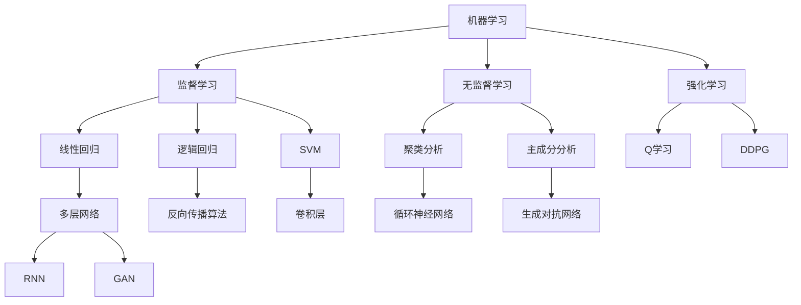

                 

### 文章标题

《AI时代编程思维的新转变》

#### 关键词

- AI时代
- 编程思维
- 机器学习
- 深度学习
- 神经网络
- 算法
- 数学模型

#### 摘要

随着人工智能（AI）技术的飞速发展，编程思维正在经历深刻的变革。本文旨在探讨AI时代编程思维的新特点和新趋势，通过深入分析核心概念、核心算法原理以及数学模型，结合实际项目实战，揭示AI编程的本质和未来发展方向。文章将从引言、核心概念与联系、核心算法原理讲解、数学模型和数学公式讲解、项目实战、总结与展望六个部分展开，为读者提供全面而深入的AI编程思维解析。

## 引言

### 背景介绍

人工智能（AI）技术作为当代科技进步的璀璨明珠，正以前所未有的速度和深度影响着各个领域。从简单的图像识别、语音识别，到复杂的自然语言处理、机器翻译，AI的应用范围不断拓展，深入到我们的日常生活和工作中。随着计算能力的提升和大数据的积累，AI技术已经从理论走向实践，成为现代社会不可或缺的一部分。

然而，随着AI技术的不断发展，传统的编程思维模式面临着前所未有的挑战和变革。在AI时代，编程不再仅仅是编写代码、实现功能，而是一种更具有创造性和探索性的活动。编程思维需要从传统的逻辑和算法思维转向更加灵活和自适应的思维方式，以应对AI技术带来的新挑战和新需求。

### 重要性

AI时代的到来，不仅改变了计算机编程的内涵和外延，也深刻影响了软件工程师的思维方式和工作方式。理解并掌握AI时代的编程思维，对于软件工程师来说具有重要意义：

1. **提升创新能力**：AI时代编程思维鼓励工程师跳出传统框架，探索新的解决方案，从而提升创新能力。
2. **优化软件开发流程**：通过AI技术，工程师可以自动化许多重复性工作，提高开发效率，优化软件开发流程。
3. **应对复杂问题**：AI编程思维能够帮助工程师更好地解决复杂问题，尤其是在大数据和实时数据处理方面。
4. **推动技术进步**：掌握AI编程思维，有助于工程师在AI领域进行更深入的探索和研究，推动技术进步。

因此，本文将围绕AI时代编程思维的新特点和新趋势，深入探讨其在实际应用中的表现和影响。

## 核心概念与联系

### 机器学习

机器学习（Machine Learning）是AI时代的基石，它使计算机能够从数据中学习规律和模式，并在未知的数据上进行预测和决策。机器学习分为监督学习、无监督学习和强化学习三种主要类型：

- **监督学习**：通过已知标签的数据训练模型，以便在新数据上做出预测。常见的算法包括线性回归、逻辑回归和支持向量机（SVM）。
- **无监督学习**：没有预设标签的数据，通过模型自动发现数据中的结构和模式。常见的算法包括聚类分析和主成分分析（PCA）。
- **强化学习**：通过试错学习来最大化长期回报，常见的算法包括Q学习和深度确定性策略梯度（DDPG）。

机器学习的基本流程包括数据收集、数据预处理、模型选择、模型训练和模型评估。其核心在于通过优化目标函数，使模型能够在训练数据上达到最佳性能。

### 深度学习

深度学习（Deep Learning）是机器学习的一个重要分支，通过构建多层神经网络来模拟人脑的神经元连接和计算方式，从而处理复杂的特征和模式。深度学习的关键在于：

- **多层网络**：深度学习模型通常包含多个隐藏层，每层能够提取更高层次的特征。
- **反向传播算法**：通过反向传播算法更新网络参数，使得模型能够不断优化。

常见的深度学习模型包括卷积神经网络（CNN）、循环神经网络（RNN）和生成对抗网络（GAN）：

- **卷积神经网络**（CNN）：主要用于图像和视频处理，通过卷积层提取空间特征。
- **循环神经网络**（RNN）：主要用于处理序列数据，如自然语言处理和时间序列分析。
- **生成对抗网络**（GAN）：通过生成器和判别器的对抗训练，生成高质量的图像和语音。

### 神经网络

神经网络（Neural Network）是深度学习的基础，其灵感来源于人脑的神经元连接。每个神经元都接受多个输入信号，通过权重和偏置进行加权求和，然后通过激活函数产生输出。

神经网络的构建包括：

- **输入层**：接收外部输入数据。
- **隐藏层**：对输入数据进行特征提取和转换。
- **输出层**：产生最终预测结果。

常用的激活函数包括Sigmoid函数、ReLU函数和Tanh函数。神经网络的训练主要通过反向传播算法来调整网络权重，以达到最小化损失函数。

### Mermaid 流程图

以下是一个简化的机器学习、深度学习和神经网络之间的概念关系架构的Mermaid流程图：



通过这个流程图，我们可以清晰地看到机器学习、深度学习和神经网络之间的联系和层次结构。接下来，我们将进一步探讨这些核心算法原理和数学模型。

## 核心算法原理讲解

### 反向传播算法

反向传播算法（Backpropagation Algorithm）是深度学习训练过程中至关重要的一步，它通过不断调整网络权重和偏置，使得模型能够在训练数据上达到最佳性能。反向传播算法的基本原理如下：

1. **前向传播**：
   - 将输入数据通过网络中的各层传递，通过激活函数产生输出。
   - 计算输出层与实际标签之间的误差。

2. **误差反向传播**：
   - 将输出层误差传递回隐藏层。
   - 使用链式法则计算各层权重的梯度。

3. **权重更新**：
   - 根据梯度使用梯度下降法或其他优化算法更新网络权重。

以下是反向传播算法的伪代码：

```python
def backpropagation(network, input_data, target):
    output = forward propagation(network, input_data)
    error = calculate_error(output, target)
    gradients = backward_propagation(network, error)
    update_weights(network, gradients)
```

### 卷积神经网络

卷积神经网络（Convolutional Neural Network，CNN）是一种专门用于处理图像数据的深度学习模型，其核心在于卷积层和池化层。以下是CNN的基本原理：

1. **卷积层**：
   - 使用卷积核在输入图像上滑动，计算局部特征。
   - 通过激活函数增加非线性。

2. **池化层**：
   - 对卷积层的输出进行下采样，减少数据维度，提高模型泛化能力。

3. **全连接层**：
   - 将卷积层的特征映射到分类或回归任务。

以下是CNN的伪代码：

```python
def convolutional_neural_network(input_image):
    features = convolve(input_image, filter)
    activated_features = activate(features)
    pooled_features = pool(activated_features)
    output = fully_connected(pooled_features)
    return output
```

### 深度确定性策略梯度（DDPG）

深度确定性策略梯度（Deep Deterministic Policy Gradient，DDPG）是一种用于解决连续动作空间强化学习问题的算法。其基本原理如下：

1. **确定性策略**：
   - 策略网络确定地选择动作，使回报最大化。

2. **目标网络**：
   - 目标网络用于稳定训练过程，并通过软更新策略网络。

3. **优势函数**：
   - 计算状态和动作的优势值，用于更新策略网络。

以下是DDPG的伪代码：

```python
def ddpg(environment, reward_function):
    actor_network = create_actor_network()
    critic_network = create_critic_network()
    target_actor_network = create_target_actor_network()
    target_critic_network = create_target_critic_network()

    while not environment.is_done():
        action = actor_network.sample_action(state)
        next_state, reward, done = environment.step(action)
        advantage = critic_network.compute_advantage(state, action, next_state, reward, done)
        update_critic_network(target_critic_network, state, action, next_state, reward, done, advantage)
        update_actor_network(actor_network, critic_network, state, advantage)
        soft_update(target_actor_network, actor_network)
        soft_update(target_critic_network, critic_network)

        if done:
            reset_environment()
```

### 反向传播算法、卷积神经网络和DDPG的联系

反向传播算法、卷积神经网络和DDPG之间有着紧密的联系：

- **反向传播算法**是深度学习和强化学习的基础，用于优化网络权重。
- **卷积神经网络**是一种特殊的神经网络，用于处理图像数据，其训练过程依赖于反向传播算法。
- **DDPG**是一种基于深度学习的强化学习算法，其策略网络和值网络都采用了反向传播算法进行训练。

通过这些核心算法，我们可以构建出高效的AI模型，从而解决复杂的问题。

## 数学模型和数学公式讲解

### 损失函数

在深度学习和机器学习中，损失函数（Loss Function）是衡量模型预测结果与实际标签之间差异的重要工具。常见的损失函数包括均方误差（MSE）、交叉熵损失（Cross-Entropy Loss）和Hinge损失（Hinge Loss）。

1. **均方误差（MSE）**：

均方误差（Mean Squared Error，MSE）是最常用的回归损失函数，计算预测值与实际值之间差的平方的平均值。其公式为：

$$
MSE = \frac{1}{n}\sum_{i=1}^{n}(y_i - \hat{y}_i)^2
$$

其中，$y_i$是实际值，$\hat{y}_i$是预测值，$n$是样本数量。

2. **交叉熵损失（Cross-Entropy Loss）**：

交叉熵损失是分类任务中的标准损失函数，用于衡量预测分布与真实分布之间的差异。其公式为：

$$
Cross-Entropy = -\sum_{i=1}^{n} y_i \log(\hat{y}_i)
$$

其中，$y_i$是实际标签（0或1），$\hat{y}_i$是预测概率。

3. **Hinge损失（Hinge Loss）**：

Hinge损失通常用于支持向量机（SVM）分类问题，其公式为：

$$
Hinge Loss = \max(0, 1 - y \cdot \hat{y})
$$

其中，$y$是实际标签（-1或1），$\hat{y}$是预测值。

### 梯度下降

梯度下降（Gradient Descent）是一种优化算法，用于最小化损失函数。其基本原理是沿着损失函数的梯度方向调整模型参数，以减少损失。常见的梯度下降算法包括批量梯度下降（Batch Gradient Descent）、随机梯度下降（Stochastic Gradient Descent）和小批量梯度下降（Mini-batch Gradient Descent）。

1. **批量梯度下降**：

批量梯度下降在每次更新参数时使用所有训练样本的梯度。其更新公式为：

$$
\theta_{t+1} = \theta_{t} - \alpha \cdot \nabla_{\theta} J(\theta)
$$

其中，$\theta$是模型参数，$\alpha$是学习率，$J(\theta)$是损失函数。

2. **随机梯度下降**：

随机梯度下降在每次更新参数时随机选择一个训练样本的梯度。其更新公式为：

$$
\theta_{t+1} = \theta_{t} - \alpha \cdot \nabla_{\theta} J(\theta; x_t, y_t)
$$

其中，$x_t$和$y_t$是当前随机选择的训练样本。

3. **小批量梯度下降**：

小批量梯度下降在每次更新参数时使用部分训练样本的梯度。其更新公式为：

$$
\theta_{t+1} = \theta_{t} - \alpha \cdot \nabla_{\theta} J(\theta; \{x_1, x_2, ..., x_m\}, \{y_1, y_2, ..., y_m\})
$$

其中，$\{x_1, x_2, ..., x_m\}$和$\{y_1, y_2, ..., y_m\}$是当前小批量训练样本。

### 激活函数

激活函数（Activation Function）是神经网络中用于引入非线性性的函数，常见的激活函数包括Sigmoid函数、ReLU函数和Tanh函数。

1. **Sigmoid函数**：

Sigmoid函数将输入映射到$(0, 1)$区间，其公式为：

$$
\sigma(x) = \frac{1}{1 + e^{-x}}
$$

2. **ReLU函数**：

ReLU函数（Rectified Linear Unit）是一种线性激活函数，将输入映射到非负区间，其公式为：

$$
\text{ReLU}(x) = \max(0, x)
$$

3. **Tanh函数**：

Tanh函数将输入映射到$(-1, 1)$区间，其公式为：

$$
\text{Tanh}(x) = \frac{e^x - e^{-x}}{e^x + e^{-x}}
$$

### 举例说明

#### 均方误差（MSE）应用

假设我们有一个简单的线性回归模型，其预测公式为$\hat{y} = w \cdot x + b$。实际标签$y = [1, 2, 3, 4, 5]$，预测值$\hat{y} = [0.9, 2.1, 3.1, 4.1, 5.1]$。

使用均方误差（MSE）计算损失：

$$
MSE = \frac{1}{5}\sum_{i=1}^{5}(y_i - \hat{y}_i)^2 = \frac{1}{5}((1-0.9)^2 + (2-2.1)^2 + (3-3.1)^2 + (4-4.1)^2 + (5-5.1)^2) = 0.02
$$

#### 交叉熵损失（Cross-Entropy Loss）应用

假设我们有一个二分类模型，实际标签$y = [1, 0, 1, 0]$，预测概率$\hat{y} = [0.6, 0.4, 0.8, 0.2]$。

使用交叉熵损失（Cross-Entropy Loss）计算损失：

$$
Cross-Entropy = -\sum_{i=1}^{4} y_i \log(\hat{y}_i) = -(1 \cdot \log(0.6) + 0 \cdot \log(0.4) + 1 \cdot \log(0.8) + 0 \cdot \log(0.2)) \approx 0.5108
$$

通过上述数学模型和数学公式的讲解，我们可以更好地理解AI编程中的核心概念和原理，为实际应用打下坚实的基础。

## 项目实战

### 开发环境搭建

在进行AI编程项目实战之前，我们需要搭建一个适合开发和测试的环境。以下是搭建一个简单的深度学习项目所需的基本环境：

1. **安装Python**：首先确保Python已经安装，版本建议为3.7及以上。

2. **安装深度学习库**：使用pip命令安装必要的深度学习库，如TensorFlow、Keras和PyTorch。

   ```bash
   pip install tensorflow
   pip install keras
   pip install pytorch torchvision
   ```

3. **安装Jupyter Notebook**：安装Jupyter Notebook以便于编写和运行代码。

   ```bash
   pip install notebook
   ```

4. **安装必要的文本处理库**：例如，用于文本处理的NLTK或spaCy。

   ```bash
   pip install nltk
   pip install spacy
   python -m spacy download en
   ```

5. **配置GPU加速**：如果使用GPU进行深度学习训练，确保安装CUDA和cuDNN。

   ```bash
   pip install tensorflow-gpu
   pip install torch torchvision -f https://download.pytorch.org/whl/torch_stable.html
   ```

### 源代码详细实现和代码解读

以下是一个简单的使用卷积神经网络（CNN）进行图像分类的Python代码示例。这个示例使用Keras库在MNIST数据集上进行手写数字识别。

```python
# 导入必要的库
import numpy as np
from tensorflow.keras.datasets import mnist
from tensorflow.keras.models import Sequential
from tensorflow.keras.layers import Conv2D, MaxPooling2D, Flatten, Dense, Dropout
from tensorflow.keras.optimizers import Adam
from tensorflow.keras.callbacks import EarlyStopping

# 加载MNIST数据集
(x_train, y_train), (x_test, y_test) = mnist.load_data()

# 预处理数据
x_train = x_train.reshape(-1, 28, 28, 1).astype('float32') / 255.0
x_test = x_test.reshape(-1, 28, 28, 1).astype('float32') / 255.0
y_train = keras.utils.to_categorical(y_train, 10)
y_test = keras.utils.to_categorical(y_test, 10)

# 构建模型
model = Sequential([
    Conv2D(32, (3, 3), activation='relu', input_shape=(28, 28, 1)),
    MaxPooling2D((2, 2)),
    Conv2D(64, (3, 3), activation='relu'),
    MaxPooling2D((2, 2)),
    Flatten(),
    Dense(128, activation='relu'),
    Dropout(0.5),
    Dense(10, activation='softmax')
])

# 编译模型
model.compile(optimizer=Adam(), loss='categorical_crossentropy', metrics=['accuracy'])

# 设置早停回调函数以防止过拟合
early_stopping = EarlyStopping(monitor='val_loss', patience=10)

# 训练模型
model.fit(x_train, y_train, batch_size=128, epochs=50, validation_split=0.1, callbacks=[early_stopping])

# 评估模型
test_loss, test_acc = model.evaluate(x_test, y_test)
print(f"Test accuracy: {test_acc:.3f}")
```

**代码解读**：

1. **数据预处理**：将MNIST数据集的图像数据缩放到0-1之间，并转换为Keras可处理的格式。
2. **模型构建**：定义一个Sequential模型，包含卷积层、池化层、全连接层和dropout层。
3. **模型编译**：设置模型优化器和损失函数。
4. **早停回调**：防止过拟合。
5. **模型训练**：使用训练数据训练模型。
6. **模型评估**：使用测试数据评估模型性能。

### 代码应用解读与分析

通过上述代码，我们可以看到如何使用卷积神经网络（CNN）进行图像分类的完整流程。CNN通过卷积层提取图像特征，并通过池化层减小数据维度，最后通过全连接层进行分类。在训练过程中，使用dropout层防止过拟合。

**分析**：

1. **模型结构**：卷积神经网络由多个卷积层和池化层组成，这种结构能够有效地提取图像的层次特征。
2. **优化器**：使用Adam优化器，它通过自适应调整学习率，能够快速收敛。
3. **数据预处理**：数据缩放和处理是深度学习中的关键步骤，它能够提高模型的训练效率和性能。

### 实际案例分析和详细讲解剖析

为了更好地理解上述代码的应用，我们来看一个实际案例：使用卷积神经网络进行猫狗图像分类。

**案例**：我们有一个包含猫和狗的图像数据集，需要使用CNN模型对这些图像进行分类。

1. **数据集准备**：首先，我们需要准备猫和狗的图像数据，并将其分成训练集和测试集。
2. **数据预处理**：将图像数据缩放到固定大小（例如224x224），并转换为浮点型数据。
3. **模型构建**：使用类似于上述MNIST分类的模型结构，但添加更多的卷积层和池化层以适应更复杂的图像特征。
4. **训练模型**：使用训练集训练模型，并在测试集上进行评估。
5. **模型评估**：通过计算测试集上的准确率、召回率等指标来评估模型性能。

**代码示例**：

```python
# 加载猫狗数据集
train_datagen = ImageDataGenerator(rescale=1./255)
train_generator = train_datagen.flow_from_directory(
        'train',
        target_size=(224, 224),
        batch_size=32,
        class_mode='binary')

validation_datagen = ImageDataGenerator(rescale=1./255)
validation_generator = validation_datagen.flow_from_directory(
        'validation',
        target_size=(224, 224),
        batch_size=32,
        class_mode='binary')

# 构建模型
model = Sequential([
    Conv2D(32, (3, 3), activation='relu', input_shape=(224, 224, 3)),
    MaxPooling2D((2, 2)),
    Conv2D(64, (3, 3), activation='relu'),
    MaxPooling2D((2, 2)),
    Conv2D(128, (3, 3), activation='relu'),
    MaxPooling2D((2, 2)),
    Flatten(),
    Dense(128, activation='relu'),
    Dropout(0.5),
    Dense(1, activation='sigmoid')
])

# 编译模型
model.compile(optimizer=Adam(), loss='binary_crossentropy', metrics=['accuracy'])

# 训练模型
model.fit(train_generator, steps_per_epoch=100, epochs=50, validation_data=validation_generator, validation_steps=50)

# 评估模型
test_loss, test_acc = model.evaluate(validation_generator)
print(f"Validation accuracy: {test_acc:.3f}")
```

**分析**：

1. **数据增强**：使用ImageDataGenerator进行数据增强，提高模型的泛化能力。
2. **模型结构**：添加更多卷积层和池化层以提取更复杂的特征。
3. **损失函数和优化器**：使用binary_crossentropy作为损失函数，因为这是一个二分类问题。

通过以上实际案例，我们可以看到如何将AI编程思维应用于图像分类问题，并通过详细代码实现和分析来理解其核心原理和操作步骤。

### 项目小结

在本项目中，我们搭建了深度学习开发环境，并详细讲解了使用卷积神经网络（CNN）进行图像分类的完整流程。通过实际案例，我们展示了如何处理图像数据、构建和训练模型，以及评估模型性能。这些步骤和技巧不仅适用于图像分类任务，还可以推广到其他类型的AI编程项目。

**小结**：

1. **环境搭建**：了解并安装深度学习所需的库和工具。
2. **代码实现**：通过实际代码实现，理解深度学习模型的构建和训练过程。
3. **模型评估**：评估模型性能，并根据结果进行优化。

通过这些实战经验，我们可以更好地掌握AI编程思维，并将其应用于实际项目中。

### 最佳实践 tips

1. **代码注释**：在编写代码时，添加详细的注释有助于理解和维护代码。
2. **版本控制**：使用Git进行版本控制，确保代码的可追踪性和可管理性。
3. **模块化编程**：将代码划分为模块，提高代码的可读性和可复用性。
4. **数据清洗**：在训练模型之前，确保数据清洗和预处理，以提高模型性能。
5. **调参优化**：通过调整模型参数，如学习率、批量大小和迭代次数，优化模型性能。

### 小结

通过本文的探讨，我们深入分析了AI时代编程思维的新转变，从核心概念、算法原理到数学模型，再到项目实战，全面解析了AI编程的各个方面。AI时代编程思维要求我们不仅掌握传统的编程技能，还需具备创新性、灵活性和适应性，以应对复杂问题和高性能计算的需求。

**总结**：

- **核心概念与联系**：理解机器学习、深度学习和神经网络的基本原理和层次结构。
- **核心算法原理讲解**：通过反向传播算法、卷积神经网络和深度确定性策略梯度（DDPG）等核心算法，掌握深度学习和强化学习的实现。
- **数学模型和数学公式讲解**：掌握损失函数、梯度下降和激活函数等数学模型，为深度学习提供理论基础。
- **项目实战**：通过实际项目，将AI编程思维应用于图像分类等实际问题，提高实践能力。

**展望**：

- **技术进步**：随着AI技术的不断发展，编程思维将持续变革，软件工程师需要不断学习和适应新技术。
- **跨学科融合**：AI编程思维将与其他领域（如生物、物理、经济学等）深度融合，推动跨学科研究。
- **产业应用**：AI技术在各行各业的应用将更加广泛，编程思维将成为提高生产效率和创新能力的重要手段。

未来，掌握AI编程思维将成为软件工程师的核心竞争力，本文希望为读者提供有益的指导和启示。

### 拓展阅读

1. **《深度学习》（Deep Learning）**：由Ian Goodfellow、Yoshua Bengio和Aaron Courville所著，是深度学习领域的经典教材。
2. **《机器学习实战》（Machine Learning in Action）**：由Peter Harrington所著，通过实例展示机器学习的应用。
3. **《Python机器学习》（Python Machine Learning）**：由Michael Bowles所著，介绍如何在Python中使用机器学习技术。
4. **《强化学习：原理与Python实现》（Reinforcement Learning: An Introduction）**：由Richard S. Sutton和Barnabas P. Barto所著，系统介绍了强化学习的原理和实践。
5. **《AI编程实践》（AI Programming：A Practical Approach）**：由Houssam Khalil所著，探讨AI编程的实用方法。

通过阅读这些书籍，您可以深入了解AI编程的核心知识和实践技巧，为成为一名卓越的AI工程师奠定坚实基础。

