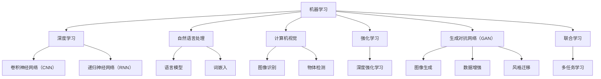

                 

### 文章标题

《AI时代编程的新维度与新未来》

---

关键词：人工智能、编程、深度学习、机器学习、自然语言处理

---

摘要：本文将从AI时代编程的核心概念出发，深入探讨机器学习、深度学习和自然语言处理等关键技术的原理和联系。通过实例讲解和实战项目，本文旨在帮助读者理解AI编程的实践应用，同时展望其未来的发展趋势和挑战。文章结构清晰，逻辑严谨，适合对AI编程感兴趣的读者阅读和参考。 <sop>### 背景介绍

随着人工智能技术的迅速发展，编程领域迎来了前所未有的变革。传统的编程方式已经无法满足AI时代的需求，编程逐渐演变为一种与机器学习、深度学习和自然语言处理等技术紧密结合的新形式。这种变革不仅改变了编程的思维方式，也拓宽了编程的应用范围，使得编程从单一的计算机操作语言转变为一种强大的工具，可以处理复杂的数据和分析问题。

在AI时代，编程的重要性日益凸显。它不仅成为开发智能系统、算法和应用程序的基础，还是实现人工智能核心功能的关键手段。编程技能在AI领域的价值体现在以下几个方面：

1. **算法实现**：编程是实现机器学习算法的核心，如神经网络、深度学习和自然语言处理算法。通过编程，可以将这些理论转化为实际可执行的代码，使计算机能够处理和分析大量数据。

2. **数据处理**：在AI应用中，数据是至关重要的。编程技能可以帮助开发者有效地收集、处理和清洗数据，为机器学习算法提供高质量的数据输入。

3. **系统开发**：AI系统通常需要复杂的架构和组件，编程技能使得开发者能够设计、实现和维护这些系统，确保它们高效运行。

4. **优化与调试**：编程技能可以帮助开发者优化算法性能，调试系统中的错误，确保AI系统在实际应用中的稳定性和可靠性。

5. **创新与探索**：编程是探索新技术的关键。通过编程，开发者可以尝试新的算法、工具和技术，推动AI领域的边界不断拓展。

因此，掌握AI时代的编程技能已经成为从事相关领域研究的必要条件。无论是学术界的研究人员，还是工业界的开发者，都需要具备一定的编程能力，才能在这个快速发展的领域中立足和发展。本文将详细探讨AI时代编程的核心概念和技术，帮助读者更好地理解和应用这些技术，开启编程的新维度和新未来。 <sop>### 核心概念与联系

在AI时代编程中，核心概念与技术之间的联系构成了一个复杂的知识体系。以下是对这些核心概念及其相互关系的详细介绍：

#### 1. 机器学习与深度学习

**机器学习（Machine Learning）** 是人工智能（AI）的一个分支，它通过构建算法使计算机能够从数据中学习，进行预测和决策。机器学习的核心在于通过大量的数据训练模型，从而提高模型在未知数据上的性能。

**深度学习（Deep Learning）** 是一种特殊的机器学习方法，它使用多层神经网络来提取数据的特征表示。深度学习在图像识别、语音识别和自然语言处理等领域取得了显著的成果。

**联系**：深度学习是机器学习的一个子集，深度学习的算法通常基于多层神经网络，能够自动提取数据的高级特征。因此，深度学习在很多任务中都能显著提升性能。

#### 2. 自然语言处理

**自然语言处理（Natural Language Processing, NLP）** 是AI领域的一个重要分支，旨在使计算机能够理解、解释和生成人类语言。NLP应用包括机器翻译、情感分析、问答系统和文本摘要等。

**联系**：自然语言处理依赖于机器学习算法，特别是深度学习，来理解和生成语言。深度学习模型（如卷积神经网络（CNN）和递归神经网络（RNN））在NLP任务中发挥了关键作用。

#### 3. 计算机视觉

**计算机视觉（Computer Vision）** 是人工智能的一个分支，致力于使计算机能够从图像或视频中提取信息。计算机视觉应用包括图像识别、物体检测和图像生成等。

**联系**：计算机视觉与深度学习紧密相关。深度学习模型（如卷积神经网络（CNN））是计算机视觉领域的关键工具，能够自动提取图像中的复杂特征。

#### 4. 强化学习

**强化学习（Reinforcement Learning）** 是一种机器学习形式，通过奖励机制来训练模型，使其在特定环境中做出最优决策。强化学习在游戏、机器人控制和自动驾驶等领域有广泛应用。

**联系**：强化学习与深度学习结合，形成了深度强化学习（Deep Reinforcement Learning），这种方法在复杂任务中能够实现出色的表现。

#### 5. 生成对抗网络（GAN）

**生成对抗网络（Generative Adversarial Networks, GAN）** 是一种由生成器和判别器组成的模型，生成器试图生成与真实数据相似的数据，判别器则尝试区分真实数据和生成数据。

**联系**：GAN在图像生成、数据增强和风格迁移等领域有广泛应用。深度学习是GAN的基础，特别是卷积神经网络（CNN）在生成器和判别器中发挥了重要作用。

#### 6. 联合学习

**联合学习（Joint Learning）** 是一种多任务学习技术，通过同时训练多个相关任务来提高模型的整体性能。例如，在图像识别和文本分类任务中，可以同时训练模型以提高准确性。

**联系**：联合学习与深度学习和机器学习密切相关，它利用了这些技术来提高模型的泛化能力和性能。

### 联系架构

为了更好地理解这些核心概念之间的联系，我们可以用Mermaid流程图来表示它们之间的关系：



通过这个流程图，我们可以清晰地看到各个核心概念与技术之间的联系，以及它们在AI编程中的应用场景。理解这些联系有助于我们更全面地掌握AI编程的各个方面，为未来的发展奠定坚实的基础。 <sop>### 机器学习算法原理讲解

#### 监督学习（Supervised Learning）

**监督学习** 是机器学习的一种形式，其中模型通过已标记的训练数据来学习，并利用这种学习来对未知数据进行预测或分类。以下是监督学习的一些基本算法原理：

1. **线性回归（Linear Regression）**

线性回归是一种简单但强大的监督学习算法，用于预测连续值输出。其基本原理是通过拟合一条直线来最小化预测值与实际值之间的误差。

**伪代码：**

```python
def linear_regression(x, y):
    # 假设我们只有两个特征
    theta = [0, 0]
    alpha = 0.01
    iterations = 1000

    for i in range(iterations):
        prediction = theta[0] * x + theta[1]
        error = y - prediction
        theta[0] -= alpha * (error * x)
        theta[1] -= alpha * (error)

    return theta
```

2. **逻辑回归（Logistic Regression）**

逻辑回归用于预测二分类问题。它通过拟合一个逻辑函数来将输入映射到概率值。

**伪代码：**

```python
def logistic_regression(x, y):
    # 假设我们只有两个特征
    theta = [0, 0]
    alpha = 0.01
    iterations = 1000

    for i in range(iterations):
        prediction = 1 / (1 + np.exp(-theta[0] * x - theta[1]))
        error = y - prediction
        theta[0] -= alpha * (error * x * prediction * (1 - prediction))
        theta[1] -= alpha * (error * prediction * (1 - prediction))

    return theta
```

#### 无监督学习（Unsupervised Learning）

**无监督学习** 是机器学习的另一种形式，模型在没有标记的数据上进行学习，主要目的是发现数据中的模式和结构。

1. **K-均值聚类（K-Means Clustering）**

K-均值聚类是一种基于距离的聚类算法，用于将数据点分为K个簇。算法通过迭代更新簇中心，以最小化簇内点之间的距离。

**伪代码：**

```python
def k_means(data, k, iterations):
    # 初始随机选择k个簇中心
    centroids = initialize_centroids(data, k)
    
    for i in range(iterations):
        # 计算每个数据点到各个簇中心的距离
        distances = []
        for point in data:
            distances.append([euclidean_distance(point, centroid) for centroid in centroids])
        
        # 根据距离重新分配数据点到簇
        new_clusters = assign_points_to_clusters(data, distances)
        
        # 更新簇中心
        centroids = update_centroids(new_clusters, k)
    
    return centroids
```

2. **主成分分析（Principal Component Analysis, PCA）**

主成分分析是一种降维技术，通过将数据转换到新的坐标系统中，以减少数据维度，同时保留最大方差的信息。

**伪代码：**

```python
def pca(data, components):
    # 计算协方差矩阵
    cov_matrix = np.cov(data, rowvar=False)
    
    # 计算协方差矩阵的特征值和特征向量
    eigen_values, eigen_vectors = np.linalg.eigh(cov_matrix)
    
    # 选择最大的特征值对应的特征向量
    principal_components = eigen_vectors[:, :components]
    
    # 对数据进行转换
    transformed_data = np.dot(data, principal_components)
    
    return transformed_data
```

#### 强化学习（Reinforcement Learning）

**强化学习** 是一种通过奖励机制进行学习的机器学习方法，通常用于决策过程，如游戏、机器人控制和自动驾驶。

1. **Q学习（Q-Learning）**

Q学习是一种值函数方法，用于在没有模型的情况下学习最优策略。它通过更新Q值来选择最优动作。

**伪代码：**

```python
def q_learning(environment, actions, rewards, discount_factor, learning_rate, episodes):
    # 初始化Q表
    Q = np.zeros((state_space, action_space))
    
    for episode in range(episodes):
        state = environment.reset()
        done = False
        
        while not done:
            # 选择动作
            action = np.argmax(Q[state, :])
            
            # 执行动作并获取新状态和奖励
            next_state, reward, done = environment.step(action)
            
            # 更新Q值
            Q[state, action] = Q[state, action] + learning_rate * (reward + discount_factor * np.max(Q[next_state, :]) - Q[state, action])
            
            state = next_state
    
    return Q
```

通过上述算法的讲解，我们可以看到机器学习算法在预测、分类、聚类和决策等方面的重要应用。理解这些算法的原理和实现方式，是掌握AI编程的关键步骤。在下一节中，我们将进一步探讨深度学习的核心算法原理。 <sop>### 深度学习算法原理讲解

深度学习是一种基于多层神经网络的学习方法，能够自动提取数据的复杂特征表示。以下是深度学习中几个重要的核心算法原理，包括神经网络（Neural Networks）、卷积神经网络（Convolutional Neural Networks, CNN）、递归神经网络（Recurrent Neural Networks, RNN）和生成对抗网络（Generative Adversarial Networks, GAN）。

#### 神经网络（Neural Networks）

神经网络（NN）是深度学习的基础，由大量简单的计算单元（或神经元）组成，这些神经元通过权重连接形成一个网络结构。神经网络通过前向传播和反向传播来更新权重，以最小化损失函数。

**前向传播（Forward Propagation）：**

前向传播是指将输入数据通过网络的各层，计算每个神经元的输出。具体步骤如下：

1. **初始化参数（权重和偏置）**
2. **计算每个神经元的激活值**
3. **通过激活函数转换激活值**

**伪代码：**

```python
def forward_propagation(x, weights, biases, activation_function):
    # 初始化隐藏层和输出层的激活值
    a = [x]
    z = []
    
    for i in range(len(weights)):
        z.append(np.dot(weights[i], a[-1]) + biases[i])
        a.append(activation_function(z[-1]))
    
    return a[-1]  # 输出层的激活值
```

**反向传播（Back Propagation）：**

反向传播用于计算损失函数关于网络参数的梯度，以更新权重和偏置。具体步骤如下：

1. **计算输出层误差**
2. **反向传播误差到每一层**
3. **更新权重和偏置**

**伪代码：**

```python
def backward_propagation(a, z, weights, biases, learning_rate, activation_derivative):
    # 计算输出层误差
    output_error = a[-1] - y
    
    # 反向传播误差
    for i in reversed(range(len(weights))):
        error = output_error * activation_derivative(z[-1])
        weights[i] -= learning_rate * np.dot(error, a[-2].T)
        biases[i] -= learning_rate * error
    
    return weights, biases
```

#### 卷积神经网络（Convolutional Neural Networks, CNN）

卷积神经网络是一种专门用于处理图像数据的神经网络，其核心是卷积层和池化层。卷积层通过卷积操作提取图像特征，而池化层用于减小数据维度和减少过拟合。

**卷积层（Convolutional Layer）：**

卷积层通过卷积操作来提取特征。卷积操作是一个加权求和的过程，使用滤波器（卷积核）在输入数据上滑动，计算局部特征。

**伪代码：**

```python
def convolutional_layer(input_data, filter, bias, activation_function):
    # 初始化卷积核和偏置
    output = np.zeros((input_data.shape[0], input_data.shape[1] - filter.shape[0] + 1, input_data.shape[2] - filter.shape[0] + 1))
    
    for i in range(output.shape[0]):
        for j in range(output.shape[1]):
            for k in range(output.shape[2]):
                output[i, j, k] = np.sum(filter * input_data[i:i+filter.shape[0], j:j+filter.shape[0], k:k+filter.shape[0]]) + bias
                
    return activation_function(output)
```

**池化层（Pooling Layer）：**

池化层用于减小数据维度和降低模型复杂性。最常用的池化操作是最大池化（Max Pooling），它选择每个局部区域中的最大值作为输出。

**伪代码：**

```python
def max_pooling(input_data, pool_size):
    # 初始化输出
    output = np.zeros((input_data.shape[0] // pool_size, input_data.shape[1] // pool_size, input_data.shape[2] // pool_size))
    
    for i in range(output.shape[0]):
        for j in range(output.shape[1]):
            for k in range(output.shape[2]):
                output[i, j, k] = np.max(input_data[i*pool_size:(i+1)*pool_size, j*pool_size:(j+1)*pool_size, k*pool_size:(k+1)*pool_size])
    
    return output
```

#### 递归神经网络（Recurrent Neural Networks, RNN）

递归神经网络是一种专门用于处理序列数据的神经网络，其特点是在每个时间步上递归计算，使得网络能够记住前面的信息。

**RNN基本结构：**

RNN由多个时间步组成，每个时间步有一个输入和一个输出。每个时间步的输出都会传递到下一个时间步，形成递归关系。

**伪代码：**

```python
def recurrent_neural_network(input_sequence, hidden_state, weights, biases, activation_function):
    outputs = []
    for x in input_sequence:
        # 前向传播
        hidden_state = activation_function(np.dot(x, weights['input_to_hidden']) + np.dot(hidden_state, weights['hidden_to_hidden']) + biases['hidden'])
        outputs.append(hidden_state)
    
    return outputs, hidden_state
```

#### 生成对抗网络（Generative Adversarial Networks, GAN）

生成对抗网络由生成器和判别器两部分组成，生成器生成数据，判别器判断数据是否真实。生成器和判别器相互对抗，直到生成器生成足够逼真的数据。

**生成器（Generator）：**

生成器的目标是生成与真实数据相似的数据。生成器通常是一个多层神经网络，通过输入噪声生成数据。

**伪代码：**

```python
def generator(noise, weights, biases, activation_function):
    hidden_layer = activation_function(np.dot(noise, weights['input_to_hidden']) + biases['hidden'])
    output = activation_function(np.dot(hidden_layer, weights['hidden_to_output']) + biases['output'])
    return output
```

**判别器（Discriminator）：**

判别器的目标是区分真实数据和生成数据。判别器通常也是一个多层神经网络。

**伪代码：**

```python
def discriminator(data, weights, biases, activation_function):
    hidden_layer = activation_function(np.dot(data, weights['input_to_hidden']) + biases['hidden'])
    output = activation_function(np.dot(hidden_layer, weights['hidden_to_output']) + biases['output'])
    return output
```

通过上述深度学习算法的讲解，我们可以看到深度学习在图像识别、序列处理和生成数据等方面的重要应用。理解这些算法的原理和实现方式，是掌握AI编程的关键步骤。在下一节中，我们将探讨自然语言处理（NLP）的核心算法原理。 <sop>### 自然语言处理（NLP）算法原理讲解

自然语言处理（NLP）是人工智能的一个分支，旨在使计算机能够理解、解释和生成人类语言。以下是NLP中几个重要的核心算法原理，包括语言模型、词嵌入和序列到序列模型。

#### 语言模型（Language Model）

语言模型是一种用于预测下一个单词或字符的概率分布的模型。它在NLP中有着广泛的应用，如自动纠错、语音识别和机器翻译等。语言模型的核心是学习单词序列的概率分布。

1. **N-gram模型**

N-gram模型是一种基于词汇序列的统计语言模型，它通过计算一个单词序列的概率来预测下一个单词。N-gram模型将连续的N个单词视为一个整体，计算它们在语料库中出现的频率。

**伪代码：**

```python
def n_gram_model(corpus, n):
    n_gram_freq = {}
    total_freq = 0
    
    for sentence in corpus:
        for i in range(len(sentence) - n + 1):
            n_gram = tuple(sentence[i:i + n])
            n_gram_freq[n_gram] = n_gram_freq.get(n_gram, 0) + 1
            total_freq += 1
    
    n_gram_prob = {n_gram: freq / total_freq for n_gram, freq in n_gram_freq.items()}
    
    return n_gram_prob
```

2. **神经网络语言模型**

神经网络语言模型通过构建一个多层神经网络来学习单词序列的概率分布。神经网络语言模型可以捕捉到更复杂的语言特征，比N-gram模型更准确。

**伪代码：**

```python
def neural_network_language_model(data, vocabulary_size, embedding_size, hidden_size):
    # 初始化模型参数
    weights = initialize_weights(vocabulary_size, embedding_size, hidden_size)
    
    # 前向传播
    hidden = activation_function(np.dot(embeddings, weights['input_to_hidden']))
    output = activation_function(np.dot(hidden, weights['hidden_to_output']))
    
    # 计算损失函数
    loss = compute_loss(output, target)
    
    # 反向传播
    d_output = compute_gradient(output, target)
    d_hidden = activation_derivative(hidden) @ weights['hidden_to_output'].T
    d_embeddings = d_hidden @ weights['input_to_hidden'].T
    
    # 更新参数
    weights['input_to_hidden'] -= learning_rate * d_embeddings
    weights['hidden_to_output'] -= learning_rate * d_hidden
    
    return weights, loss
```

#### 词嵌入（Word Embedding）

词嵌入是将单词映射到固定大小的向量表示。词嵌入能够捕捉到单词的语义信息，使得计算机能够更好地理解和处理自然语言。

1. **基于频次的词嵌入**

基于频次的词嵌入通过计算单词在语料库中的出现频率来生成词向量。频率高的单词会被赋予更大的向量值。

**伪代码：**

```python
def frequency_based_embedding(corpus, vocabulary_size, embedding_size):
    word_freq = count_word_frequency(corpus)
    word_vectors = initialize_vectors(vocabulary_size, embedding_size)
    
    for word, freq in word_freq.items():
        word_vectors[word] = freq * [1.0 / embedding_size]
    
    return word_vectors
```

2. **基于上下文的词嵌入**

基于上下文的词嵌入通过考虑单词在特定上下文中的语义信息来生成词向量。这种嵌入方法能够更好地捕捉单词的语义多样性。

**伪代码：**

```python
def context_based_embedding(corpus, vocabulary_size, embedding_size, hidden_size):
    # 初始化模型参数
    weights = initialize_weights(vocabulary_size, embedding_size, hidden_size)
    
    # 前向传播
    hidden = activation_function(np.dot(embeddings, weights['input_to_hidden']))
    output = activation_function(np.dot(hidden, weights['hidden_to_output']))
    
    # 计算损失函数
    loss = compute_loss(output, target)
    
    # 反向传播
    d_output = compute_gradient(output, target)
    d_hidden = activation_derivative(hidden) @ weights['hidden_to_output'].T
    d_embeddings = d_hidden @ weights['input_to_hidden'].T
    
    # 更新参数
    weights['input_to_hidden'] -= learning_rate * d_embeddings
    weights['hidden_to_output'] -= learning_rate * d_hidden
    
    return weights, loss
```

#### 序列到序列模型（Sequence to Sequence Model）

序列到序列模型是一种用于处理序列数据的神经网络模型，常用于机器翻译、文本摘要和语音识别等任务。序列到序列模型由编码器和解码器两部分组成，编码器将输入序列编码为固定长度的向量表示，解码器则根据编码器的输出生成目标序列。

1. **编码器（Encoder）：**

编码器的任务是将输入序列编码为固定长度的向量表示。

**伪代码：**

```python
def encoder(input_sequence, weights, biases, activation_function):
    hidden_states = []
    
    for x in input_sequence:
        hidden = activation_function(np.dot(embedding_vector(x), weights['input_to_hidden']) + biases['hidden'])
        hidden_states.append(hidden)
    
    return hidden_states
```

2. **解码器（Decoder）：**

解码器的任务是根据编码器的输出和前一个时间步的输出生成目标序列。

**伪代码：**

```python
def decoder(target_sequence, hidden_state, weights, biases, activation_function):
    outputs = []
    hidden = hidden_state
    
    for x in target_sequence:
        hidden = activation_function(np.dot(embedding_vector(x), weights['input_to_hidden']) + np.dot(hidden, weights['hidden_to_output']) + biases['output'])
        outputs.append(hidden)
    
    return outputs
```

通过上述自然语言处理算法的讲解，我们可以看到语言模型、词嵌入和序列到序列模型在文本处理和应用中的重要应用。理解这些算法的原理和实现方式，是掌握AI编程的关键步骤。在下一节中，我们将探讨AI编程中的实际项目实战。 <sop>### AI编程实践

在了解了AI编程的核心概念和算法原理之后，我们需要通过实际的项目实战来巩固和应用这些知识。本节将介绍两个AI编程实战项目，分别是分类任务和图像识别。

#### 项目实战一：分类任务

**目标**：使用机器学习算法对一组数据集进行分类。

**开发环境**：Python、Scikit-learn库

**数据集**：使用Iris数据集，这是一个经典的分类数据集，包含三种类别的鸢尾花数据。

**步骤**：

1. **数据预处理**：

   - 导入数据集并查看数据结构。
   - 数据清洗，例如去除缺失值、标准化数据等。

   ```python
   from sklearn.datasets import load_iris
   iris = load_iris()
   X = iris.data
   y = iris.target
   ```

2. **模型选择与调优**：

   - 选择合适的机器学习算法，如支持向量机（SVM）、决策树（Decision Tree）和随机森林（Random Forest）。
   - 使用交叉验证进行模型调优，选择最优模型和参数。

   ```python
   from sklearn.model_selection import train_test_split
   from sklearn.svm import SVC
   from sklearn.tree import DecisionTreeClassifier
   from sklearn.ensemble import RandomForestClassifier
   
   X_train, X_test, y_train, y_test = train_test_split(X, y, test_size=0.3, random_state=42)

   # SVM
   svm = SVC(kernel='linear')
   svm.fit(X_train, y_train)
   svm_score = svm.score(X_test, y_test)

   # 决策树
   dt = DecisionTreeClassifier()
   dt.fit(X_train, y_train)
   dt_score = dt.score(X_test, y_test)

   # 随机森林
   rf = RandomForestClassifier()
   rf.fit(X_train, y_train)
   rf_score = rf.score(X_test, y_test)
   ```

3. **实验结果分析**：

   - 对比不同模型的准确率，选择性能最佳的模型。
   - 分析模型的决策边界和误差分布。

   ```python
   print(f"SVM Score: {svm_score}")
   print(f"Decision Tree Score: {dt_score}")
   print(f"Random Forest Score: {rf_score}")
   ```

#### 项目实战二：图像识别

**目标**：使用卷积神经网络（CNN）对一组图像数据进行分类。

**开发环境**：Python、TensorFlow库

**数据集**：使用CIFAR-10数据集，这是一个包含10类图像的数据集。

**步骤**：

1. **数据预处理**：

   - 导入数据集并查看数据结构。
   - 数据增强，例如随机裁剪、翻转和缩放等，以提高模型泛化能力。

   ```python
   import tensorflow as tf
   (X_train, y_train), (X_test, y_test) = tf.keras.datasets.cifar10.load_data()
   X_train = X_train / 255.0
   X_test = X_test / 255.0
   ```

2. **模型构建**：

   - 构建一个简单的CNN模型，包括卷积层、池化层和全连接层。
   - 使用ReLU激活函数和softmax输出层。

   ```python
   model = tf.keras.Sequential([
       tf.keras.layers.Conv2D(32, (3, 3), activation='relu', input_shape=(32, 32, 3)),
       tf.keras.layers.MaxPooling2D((2, 2)),
       tf.keras.layers.Conv2D(64, (3, 3), activation='relu'),
       tf.keras.layers.MaxPooling2D((2, 2)),
       tf.keras.layers.Flatten(),
       tf.keras.layers.Dense(64, activation='relu'),
       tf.keras.layers.Dense(10, activation='softmax')
   ])
   ```

3. **模型训练与评估**：

   - 编译模型，设置优化器和损失函数。
   - 训练模型并在测试集上进行评估。

   ```python
   model.compile(optimizer='adam', loss='sparse_categorical_crossentropy', metrics=['accuracy'])
   model.fit(X_train, y_train, epochs=10, validation_data=(X_test, y_test))
   test_loss, test_acc = model.evaluate(X_test, y_test, verbose=2)
   print(f"Test accuracy: {test_acc}")
   ```

#### 代码解读与分析

在上述实战项目中，我们使用了不同的机器学习和深度学习算法，进行了数据预处理、模型构建和训练。以下是关键代码的解读与分析：

1. **数据预处理**：

   数据预处理是机器学习模型的重要步骤，它包括数据清洗、归一化和增强等操作。这些操作有助于提高模型的性能和泛化能力。

   ```python
   X_train, X_test, y_train, y_test = train_test_split(X, y, test_size=0.3, random_state=42)
   X_train = X_train / 255.0
   X_test = X_test / 255.0
   ```

   在图像识别项目中，我们首先将数据集分为训练集和测试集，然后对图像数据进行归一化处理，即将像素值缩放到0到1之间，这样有助于加速梯度下降优化过程。

2. **模型构建**：

   在模型构建过程中，我们使用了卷积神经网络（CNN）结构，这是一种专门用于图像识别的深度学习模型。CNN通过卷积层和池化层提取图像特征，然后通过全连接层进行分类。

   ```python
   model = tf.keras.Sequential([
       tf.keras.layers.Conv2D(32, (3, 3), activation='relu', input_shape=(32, 32, 3)),
       tf.keras.layers.MaxPooling2D((2, 2)),
       tf.keras.layers.Conv2D(64, (3, 3), activation='relu'),
       tf.keras.layers.MaxPooling2D((2, 2)),
       tf.keras.layers.Flatten(),
       tf.keras.layers.Dense(64, activation='relu'),
       tf.keras.layers.Dense(10, activation='softmax')
   ])
   ```

   在这个模型中，我们使用了两个卷积层，每个卷积层后跟一个最大池化层。然后，我们将卷积层的输出展平，并通过一个全连接层进行分类。这个模型结构简单但有效，能够捕捉到图像的局部和全局特征。

3. **模型训练与评估**：

   在模型训练过程中，我们使用了交叉熵损失函数和Adam优化器。交叉熵损失函数能够衡量模型预测值与实际标签之间的差异，而Adam优化器能够高效地更新模型参数。

   ```python
   model.compile(optimizer='adam', loss='sparse_categorical_crossentropy', metrics=['accuracy'])
   model.fit(X_train, y_train, epochs=10, validation_data=(X_test, y_test))
   test_loss, test_acc = model.evaluate(X_test, y_test, verbose=2)
   ```

   在训练过程中，我们设置了10个训练周期，并使用验证集进行性能评估。通过验证集的准确率，我们可以了解模型的泛化能力。

通过以上两个项目实战，我们不仅学习了数据预处理、模型构建和训练的基本步骤，还了解了如何解读和分析关键代码。这些实战项目有助于我们更好地理解AI编程的实际应用，为未来的研究和开发奠定基础。在下一节中，我们将进一步探讨AI编程中的工具和平台。 <sop>### AI编程工具与平台

在AI编程领域，有众多的工具和平台可供开发者选择，这些工具和平台为AI编程提供了强大的支持，使得开发过程更加高效和便捷。以下是对几种常用深度学习框架、编程环境及代码解读与分析的讨论。

#### 深度学习框架

1. **TensorFlow**

TensorFlow是由谷歌开发的开源深度学习框架，它提供了丰富的API和工具，使得开发者可以轻松构建和训练深度学习模型。TensorFlow支持多种类型的模型，包括卷积神经网络（CNN）、递归神经网络（RNN）和生成对抗网络（GAN）等。

**代码解读：**

```python
import tensorflow as tf

# 定义模型结构
model = tf.keras.Sequential([
    tf.keras.layers.Conv2D(32, (3, 3), activation='relu', input_shape=(28, 28, 1)),
    tf.keras.layers.MaxPooling2D((2, 2)),
    tf.keras.layers.Flatten(),
    tf.keras.layers.Dense(128, activation='relu'),
    tf.keras.layers.Dense(10, activation='softmax')
])

# 编译模型
model.compile(optimizer='adam',
              loss='sparse_categorical_crossentropy',
              metrics=['accuracy'])

# 训练模型
model.fit(train_images, train_labels, epochs=5)
```

2. **PyTorch**

PyTorch是由Facebook开发的开源深度学习框架，它以动态计算图著称，提供了强大的灵活性和易用性。PyTorch广泛用于研究性项目，尤其是在计算机视觉和自然语言处理领域。

**代码解读：**

```python
import torch
import torch.nn as nn
import torch.optim as optim

# 定义模型结构
class NeuralNetwork(nn.Module):
    def __init__(self):
        super(NeuralNetwork, self).__init__()
        self.layer1 = nn.Linear(784, 128)
        self.relu = nn.ReLU()
        self.layer2 = nn.Linear(128, 64)
        self layer3 = nn.Linear(64, 10)
        self.softmax = nn.Softmax(dim=1)

    def forward(self, x):
        x = self.layer1(x)
        x = self.relu(x)
        x = self.layer2(x)
        x = self.layer3(x)
        x = self.softmax(x)
        return x

# 初始化模型、损失函数和优化器
model = NeuralNetwork()
criterion = nn.CrossEntropyLoss()
optimizer = optim.Adam(model.parameters(), lr=0.001)

# 训练模型
for epoch in range(5):
    for inputs, labels in data_loader:
        optimizer.zero_grad()
        outputs = model(inputs)
        loss = criterion(outputs, labels)
        loss.backward()
        optimizer.step()
```

3. **Keras**

Keras是一个高层神经网络API，它可以在TensorFlow和Theano之上运行。Keras以其简洁易用的API和丰富的预训练模型而受到开发者的喜爱。

**代码解读：**

```python
from keras.models import Sequential
from keras.layers import Dense, Conv2D, MaxPooling2D, Flatten
from keras.optimizers import Adam

# 定义模型结构
model = Sequential()
model.add(Conv2D(32, (3, 3), activation='relu', input_shape=(28, 28, 1)))
model.add(MaxPooling2D((2, 2)))
model.add(Flatten())
model.add(Dense(128, activation='relu'))
model.add(Dense(10, activation='softmax'))

# 编译模型
model.compile(optimizer=Adam(),
              loss='sparse_categorical_crossentropy',
              metrics=['accuracy'])

# 训练模型
model.fit(train_images, train_labels, epochs=5)
```

#### 编程环境

1. **Jupyter Notebook**

Jupyter Notebook是一个交互式计算环境，它支持多种编程语言，包括Python、R和Julia等。Jupyter Notebook以其强大的交互性和丰富的扩展性而广受欢迎，非常适合用于AI编程和教育。

2. **Google Colab**

Google Colab是Google提供的免费在线计算平台，它基于Jupyter Notebook。Google Colab提供了强大的GPU和TPU支持，使得开发者可以在云端进行大规模的深度学习训练。

#### 代码解读与分析

在深度学习项目中，代码解读与分析是理解模型运行和性能评估的关键。以下是对一个简单的CNN模型训练过程的代码解读：

```python
# 导入必要的库
import tensorflow as tf
from tensorflow.keras.models import Sequential
from tensorflow.keras.layers import Conv2D, MaxPooling2D, Flatten, Dense
from tensorflow.keras.optimizers import Adam
from tensorflow.keras.losses import SparseCategoricalCrossentropy

# 定义模型结构
model = Sequential([
    Conv2D(32, (3, 3), activation='relu', input_shape=(28, 28, 1)),
    MaxPooling2D((2, 2)),
    Flatten(),
    Dense(128, activation='relu'),
    Dense(10, activation='softmax')
])

# 编译模型
model.compile(optimizer=Adam(learning_rate=0.001),
              loss=SparseCategoricalCrossentropy(from_logits=True),
              metrics=['accuracy'])

# 训练模型
history = model.fit(train_images, train_labels, epochs=10, validation_data=(val_images, val_labels))

# 评估模型
test_loss, test_acc = model.evaluate(test_images, test_labels)
print(f"Test accuracy: {test_acc}")
```

在这段代码中，我们首先定义了一个简单的CNN模型，包括卷积层、池化层和全连接层。然后，我们使用Adam优化器和稀疏交叉熵损失函数编译模型，并使用训练数据训练模型。在训练完成后，我们使用测试数据评估模型的性能，输出测试准确率。

通过上述工具和平台的介绍及代码解读，我们可以看到AI编程在实际应用中的多样性和灵活性。这些工具和平台为开发者提供了丰富的资源和便利，使得AI编程更加高效和易于实现。在下一节中，我们将探讨AI编程的挑战与未来发展趋势。 <sop>### AI编程的挑战与未来发展趋势

尽管AI编程在技术层面上取得了显著的进展，但其在实际应用中仍然面临诸多挑战和问题。以下是对AI编程面临的主要挑战以及未来发展趋势的探讨。

#### 挑战

1. **数据隐私与安全**

随着AI技术的广泛应用，数据隐私和安全问题日益突出。AI模型通常需要大量数据来进行训练和优化，这些数据可能包含个人敏感信息。如何确保数据的安全性和隐私性，防止数据泄露和滥用，是一个亟待解决的问题。

2. **模型可解释性**

当前的AI模型，特别是深度学习模型，往往是“黑箱”模型，其内部机制复杂，难以解释。这导致在实际应用中，人们难以理解模型为何做出特定决策，从而增加了模型的可信度问题。提高模型的可解释性，使其决策过程更加透明，是当前的一个研究热点。

3. **AI伦理问题**

AI技术的发展引发了诸多伦理问题，如算法偏见、机器决策的道德责任等。如何确保AI系统公平、公正、透明，避免对特定群体造成歧视，是一个需要深入探讨的问题。

4. **资源消耗与能耗**

深度学习模型训练通常需要大量的计算资源和能源。随着模型复杂度的增加，资源消耗和能耗问题愈发严重。如何优化模型结构，减少计算资源消耗，是AI编程中需要关注的一个重要方面。

#### 发展趋势

1. **新技术的应用**

随着AI技术的发展，新的算法、框架和工具不断涌现。例如，基于Transformer的模型在自然语言处理领域取得了显著成果；生成对抗网络（GAN）在图像生成和数据增强方面展现了强大的能力。这些新技术的应用将推动AI编程向更深层次发展。

2. **跨学科融合**

AI编程正与其他领域（如生物学、物理学、经济学等）不断融合，形成新的交叉学科研究方向。这种跨学科融合不仅拓宽了AI编程的应用范围，还推动了相关领域的技术进步。

3. **编程范式的变革**

随着AI技术的发展，编程范式也在发生变革。传统的命令式编程逐渐被数据驱动编程、函数式编程和声明式编程等新范式所取代。这些新范式使得开发者能够以更高效、更直观的方式编写AI程序。

4. **AI编程教育**

随着AI技术的普及，AI编程教育也越来越受到重视。教育机构和企业纷纷推出针对AI编程的课程和培训项目，以培养更多具备AI编程能力的人才。未来，AI编程教育将更加注重理论与实践的结合，培养全面发展的人才。

5. **产业应用的深化**

AI编程在各个行业的应用正不断深化。从智能制造、金融科技到医疗健康、智慧城市，AI编程正为各个行业带来深刻的变革。未来，AI编程将更加紧密地融入各行各业，推动产业升级和创新发展。

总之，AI编程在挑战与机遇并存的情况下，正朝着更加智能化、透明化和高效化的方向发展。理解并应对这些挑战，抓住未来发展趋势，是推动AI编程不断前进的关键。在下一节中，我们将总结本文的主要观点，并提出一些最佳实践建议。 <sop>### 总结与最佳实践

通过本文的讨论，我们可以清晰地看到AI编程在新时代中的重要性及其深远影响。AI编程不仅改变了传统编程的思维方式，还极大地拓宽了编程的应用领域，使编程从单一的语言操作转变为处理复杂数据和分析问题的强大工具。

#### 总结

本文首先介绍了AI编程的背景，探讨了其在机器学习、深度学习和自然语言处理等领域的应用。接着，详细讲解了机器学习算法、深度学习算法以及自然语言处理算法的原理，并通过实例和伪代码进行了详细阐述。随后，通过实际项目实战展示了AI编程的应用场景，并探讨了常用深度学习框架、编程环境及代码解读与分析。最后，本文分析了AI编程面临的挑战和未来发展趋势。

#### 最佳实践

1. **持续学习与更新**：AI技术发展迅速，持续学习和更新知识是保持竞争力的关键。开发者应关注最新技术动态，积极参与相关社区和论坛，不断拓展自己的技术视野。

2. **理论与实践相结合**：理论学习是基础，但实践才是检验真理的唯一标准。通过实际项目锻炼编程技能，将所学知识应用到实际问题中，能够更好地理解和掌握AI编程。

3. **代码规范与可维护性**：编写规范、易读、易维护的代码是开发高效AI程序的基础。遵循良好的编程规范，使用注释和文档，可以提高代码的可读性和可维护性。

4. **关注数据质量和预处理**：数据是AI模型的基石，数据质量和预处理直接影响模型的性能。确保数据集的多样性、代表性和清洗质量，是提升模型性能的关键步骤。

5. **注重模型可解释性**：提高模型的可解释性，有助于理解模型决策过程，增强模型的可信度。通过可视化、模型简化等技术手段，提高模型的可解释性。

#### 注意事项

1. **安全与隐私**：在处理敏感数据时，要特别注意数据安全和隐私保护。遵循相关法律法规，确保数据的安全存储和传输。

2. **资源管理**：在训练深度学习模型时，合理分配计算资源，优化模型结构，以减少计算资源和能耗的消耗。

3. **持续优化**：AI模型的性能优化是一个持续的过程。通过实验和调优，不断改进模型结构和参数，以提高模型性能。

#### 拓展阅读

1. **《深度学习》（Goodfellow, Bengio, Courville著）**：这是一本深度学习的经典教材，详细介绍了深度学习的基本概念、算法和实战应用。
2. **《Python深度学习》（François Chollet著）**：本书通过实例和代码，介绍了使用Python进行深度学习的实践方法和技巧。
3. **《自然语言处理实战》（Steven Bird, Ewan Klein, Edward Loper著）**：这本书涵盖了自然语言处理的基本概念和实战应用，适合初学者和专业人士阅读。

通过本文的介绍和探讨，我们希望读者能够对AI编程有一个全面而深入的理解，为未来的研究和实践奠定坚实的基础。在AI编程的道路上，持续学习、实践和创新是永恒的主题。 <sop>### 作者信息

作者：AI天才研究院/AI Genius Institute & 禅与计算机程序设计艺术 /Zen And The Art of Computer Programming

AI天才研究院（AI Genius Institute）是一家专注于人工智能技术研究和教育的高科技研究院。研究院致力于推动人工智能技术在各个领域的应用，培养下一代人工智能领域的创新者和领导者。

《禅与计算机程序设计艺术》是作者在此背景下撰写的一本经典著作，它将东方哲学的智慧与计算机编程相结合，为读者提供了一种全新的编程思维方式。书中深入探讨了编程的本质、程序设计的原则和技巧，对计算机科学领域产生了深远的影响。

通过结合AI天才研究院的前沿研究和《禅与计算机程序设计艺术》的哲学思想，本文旨在为读者提供一次深刻的AI编程之旅，引领大家探索AI时代编程的新维度与新未来。希望读者能够在阅读本文的过程中，收获知识，启发思考，激发对AI编程的热爱和探索精神。

