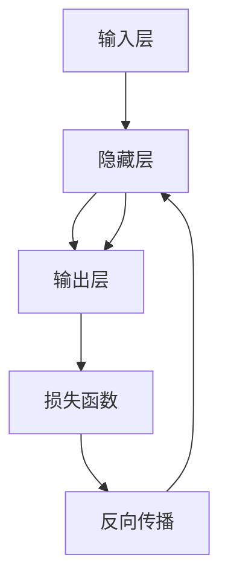
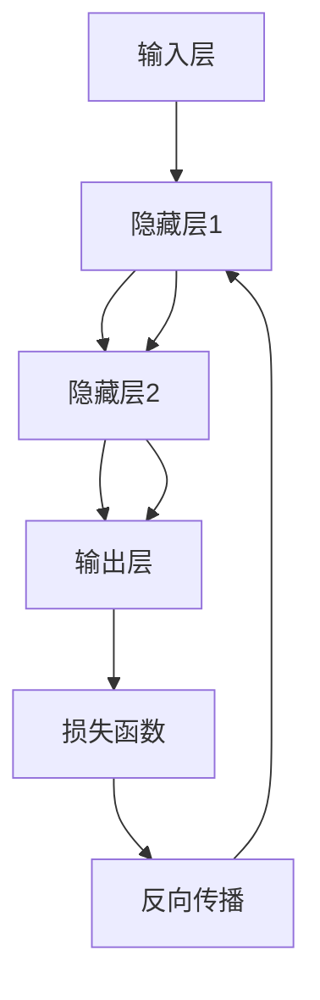

                 


### 文章标题：AI编程的新原语与新方式

> 关键词：AI编程、新原语、新方式、神经网络、强化学习、自然语言处理、计算机视觉、项目实战

> 摘要：本文旨在探讨AI编程的新原语和新方式，从基础理论到实践应用进行深入分析。通过剖析神经网络、强化学习、自然语言处理和计算机视觉等核心算法，以及实际项目案例，为读者展示AI编程的全新视角和方法。

## 《AI编程的新原语与新方式》目录大纲

### 第一部分：AI编程的基石

#### 1.1 AI编程的概述
##### 1.1.1 AI编程的定义与重要性
##### 1.1.2 AI编程与传统编程的区别

#### 1.2 AI编程的核心原语
##### 1.2.1 数据驱动编程
##### 1.2.2 模型驱动编程
##### 1.2.3 自适应编程

#### 1.3 AI编程的新方式
##### 1.3.1 分布式编程
##### 1.3.2 自动化编程
##### 1.3.3 智能编程

#### 1.4 AI编程的未来发展趋势
##### 1.4.1 AI编程与人类的协作
##### 1.4.2 AI编程的教育与普及
##### 1.4.3 AI编程的安全与伦理问题

### 第二部分：AI编程的核心算法

#### 2.1 神经网络算法
##### 2.1.1 神经网络的基本原理
##### 2.1.2 前馈神经网络
##### 2.1.3 反向传播算法
##### 2.1.4 深度神经网络

#### 2.2 强化学习算法
##### 2.2.1 强化学习的定义与基本原理
##### 2.2.2 Q学习算法
##### 2.2.3 策略梯度算法
##### 2.2.4 深度强化学习

#### 2.3 自然语言处理算法
##### 2.3.1 语言模型
##### 2.3.2 词向量表示
##### 2.3.3 序列标注
##### 2.3.4 机器翻译

#### 2.4 计算机视觉算法
##### 2.4.1 图像识别
##### 2.4.2 目标检测
##### 2.4.3 图像生成

### 第三部分：AI编程的项目实战

#### 3.1 AI编程实战案例
##### 3.1.1 案例一：智能客服系统
##### 3.1.2 案例二：自动驾驶汽车
##### 3.1.3 案例三：智能家居

#### 3.2 AI编程项目实战
##### 3.2.1 项目准备
##### 3.2.2 数据处理与预处理
##### 3.2.3 模型设计与实现
##### 3.2.4 模型评估与优化
##### 3.2.5 项目部署与运维

#### 3.3 AI编程实战项目分析
##### 3.3.1 项目需求分析
##### 3.3.2 项目方案设计
##### 3.3.3 项目实施过程
##### 3.3.4 项目效果评估

### 附录

#### 附录A：AI编程工具与资源
##### 附录A.1: 开源框架
##### 附录A.2: 数据集
##### 附录A.3: 在线教程与课程
##### 附录A.4: 相关论文与书籍

#### 附录B：AI编程术语解释
##### 附录B.1: 术语列表
##### 附录B.2: 术语解释

### 后记

#### 后记一：AI编程的未来
##### 未来的发展趋势
##### 未来的挑战与机遇
##### 未来的人才培养

#### 后记二：作者寄语
##### 作者的思考
##### 对读者的期望
##### 致谢

### Mermaid 流程图与伪代码

#### 2.1 神经网络算法流程图


#### 2.2 强化学习算法伪代码
```python
# Q学习算法伪代码
initialize Q(s, a)
for each episode do
  s <- 状态
  while not done do
    a <- 选择动作
    s' <- 状态转移
    r <- 奖励
    Q(s, a) <- Q(s, a) + 学习率 * (r + 最大Q(s', a') - Q(s, a))
    s <- s'
  end while
end for
```

#### 2.3 自然语言处理算法伪代码
```python
# 语言模型伪代码
for each sentence in corpus do
  for each word in sentence do
    update_counts(word, sentence)
end for
end for

# 计算概率
def probability(word, sentence):
  return counts(word, sentence) / counts(sentence)
```

#### 2.4 计算机视觉算法伪代码
```python
# 卷积神经网络伪代码
def convolutional_neural_network(image):
  # 展开图像为特征图
  feature_map <- 扩展图像
  
  # 通过卷积层提取特征
  for each filter in layers do
    feature_map <- 卷积操作(filter, feature_map)
  end for

  # 通过全连接层进行分类
  for each neuron in layers do
    neuron_output <- 激活函数(卷积结果)
  end for

  # 输出分类结果
  classification <- 获取最大输出值
return classification
```

### AI编程的新原语与新方式

AI编程，作为人工智能领域的核心技术，正在引领一场前所未有的技术革命。它不仅改变了计算机科学的传统范式，还为各行各业带来了前所未有的创新机遇。然而，要深入理解AI编程的本质，我们首先需要探讨其基石——核心原语和新方式。

### AI编程的概述

AI编程，即人工智能编程，是指利用计算机科学和数学方法来设计、开发、实现和维护人工智能系统的过程。它不同于传统编程，后者主要关注如何构建逻辑和算法来解决问题，而AI编程则更加关注如何让计算机自动学习、推理和决策。

#### 1.1.1 AI编程的定义与重要性

AI编程的核心在于其自学习能力。通过利用大量数据，AI系统可以自动调整其内部参数，从而提高其性能和准确性。这种能力使得AI编程在图像识别、自然语言处理、自动驾驶等领域取得了显著成果。

#### 1.1.2 AI编程与传统编程的区别

与传统编程相比，AI编程具有以下特点：

1. **数据驱动的开发方式**：AI编程依赖于大量数据来训练模型，而不是传统的手写代码。
2. **自适应性**：AI系统能够根据新数据自动调整其行为，从而适应不断变化的环境。
3. **强大的通用性**：AI编程可以应用于各种领域，而传统编程通常针对特定问题设计。

### AI编程的核心原语

AI编程的核心原语包括数据驱动编程、模型驱动编程和自适应编程。

#### 1.2.1 数据驱动编程

数据驱动编程是指通过大量数据来训练AI模型。这种方法的关键在于如何高效地收集、处理和利用数据。常见的AI算法如神经网络和强化学习都依赖于数据驱动编程。

#### 1.2.2 模型驱动编程

模型驱动编程是指通过设计特定的算法模型来实现AI功能。这种编程方式的核心在于如何设计高效且准确的模型。例如，卷积神经网络（CNN）在图像识别中取得了巨大成功。

#### 1.2.3 自适应编程

自适应编程是指AI系统能够根据新数据和环境变化自动调整其行为。这种编程方式的关键在于如何设计自适应算法，以便系统能够在实际应用中持续优化。

### AI编程的新方式

随着AI技术的发展，AI编程也在不断演变，出现了一系列新的编程方式。

#### 1.3.1 分布式编程

分布式编程是指将AI计算任务分布在多个计算机上执行，以提高计算效率和速度。这种编程方式适用于大规模数据处理和训练任务。

#### 1.3.2 自动化编程

自动化编程是指通过自动化工具来自动化AI系统的设计、开发、测试和部署。这种编程方式可以显著提高开发效率，降低成本。

#### 1.3.3 智能编程

智能编程是指利用AI技术来自动优化编程过程，包括代码生成、测试和调试。这种编程方式有望使编程变得更加智能化和高效。

### AI编程的未来发展趋势

#### 1.4.1 AI编程与人类的协作

未来的AI编程将更加注重与人类的协作。AI系统将更多地扮演辅助角色，帮助人类更高效地完成任务。

#### 1.4.2 AI编程的教育与普及

随着AI技术的普及，AI编程的教育和普及将成为未来重要的任务。这将需要开发更易于学习和使用的AI编程工具和教材。

#### 1.4.3 AI编程的安全与伦理问题

AI编程的安全与伦理问题将成为未来关注的重点。如何确保AI系统的安全性、隐私性和可靠性是亟待解决的问题。

## AI编程的核心算法

AI编程的核心算法包括神经网络算法、强化学习算法、自然语言处理算法和计算机视觉算法。这些算法在AI领域中发挥着至关重要的作用，为各种应用提供了强大的技术支持。

### 神经网络算法

神经网络算法是AI编程中最基础也是最重要的算法之一。它模拟人脑神经网络的结构和工作原理，通过层次化的数据处理和特征提取来实现复杂任务的自动学习。

#### 2.1.1 神经网络的基本原理

神经网络由多个神经元（也称为节点）组成，这些神经元通过层状结构相互连接。每个神经元接收来自其他神经元的输入信号，并通过激活函数进行非线性变换，最终输出结果。神经网络通过调整连接权重来实现对输入数据的映射和学习。

#### 2.1.2 前馈神经网络

前馈神经网络是最简单的一种神经网络结构，数据从输入层经过隐藏层传递到输出层。前馈神经网络通过层层传递和变换，实现对输入数据的特征提取和分类。

#### 2.1.3 反向传播算法

反向传播算法是训练神经网络的核心算法。它通过计算输出层与目标层之间的误差，反向传播误差信息，并调整各层的连接权重，从而优化网络性能。

#### 2.1.4 深度神经网络

深度神经网络是前馈神经网络的扩展，它具有多个隐藏层。深度神经网络能够提取更复杂的数据特征，从而在图像识别、语音识别等领域取得了显著的成果。

### 强化学习算法

强化学习算法是一类基于奖励反馈的机器学习算法，它通过不断尝试和反馈来学习最优策略。强化学习在自动驾驶、游戏人工智能等领域有着广泛的应用。

#### 2.2.1 强化学习的定义与基本原理

强化学习通过智能体与环境之间的交互来学习最优行为策略。智能体在执行某个动作后，会根据环境反馈的奖励信号来调整其行为策略，以最大化长期奖励。

#### 2.2.2 Q学习算法

Q学习算法是强化学习的一种重要方法。它通过学习状态-动作值函数（Q函数）来预测未来奖励，并选择具有最大Q值的动作。

#### 2.2.3 策略梯度算法

策略梯度算法通过直接优化策略参数来学习最优行为策略。它通过计算策略梯度，调整策略参数，从而实现策略的优化。

#### 2.2.4 深度强化学习

深度强化学习结合了深度神经网络和强化学习，它通过深度神经网络来表示状态和动作，从而实现对复杂环境的建模和学习。

### 自然语言处理算法

自然语言处理（NLP）算法是AI编程中用于处理和生成自然语言的技术。它广泛应用于机器翻译、语音识别、情感分析等领域。

#### 2.3.1 语言模型

语言模型是一种统计模型，它通过分析大量文本数据来预测下一个单词或字符。语言模型是NLP的基础，它为许多NLP任务提供了关键的支持。

#### 2.3.2 词向量表示

词向量表示是将自然语言中的词汇映射到高维空间中的向量表示。词向量表示能够捕捉词汇之间的语义关系，从而在文本处理中发挥重要作用。

#### 2.3.3 序列标注

序列标注是一种标记自然语言文本中各个词汇的方法。它广泛应用于命名实体识别、情感分析等任务。

#### 2.3.4 机器翻译

机器翻译是将一种语言的文本自动翻译成另一种语言的技术。深度学习模型如神经网络翻译（NMT）在机器翻译领域取得了显著的成果。

### 计算机视觉算法

计算机视觉算法是AI编程中用于处理和解释图像数据的算法。它广泛应用于图像识别、目标检测、图像生成等领域。

#### 2.4.1 图像识别

图像识别是计算机视觉的基础任务，它旨在将图像中的物体或场景分类为特定的类别。

#### 2.4.2 目标检测

目标检测是一种更高级的计算机视觉任务，它旨在识别图像中的多个目标，并给出它们的位置和属性。

#### 2.4.3 图像生成

图像生成是一种生成逼真图像的技术。它通过深度学习模型如生成对抗网络（GAN）来实现，广泛应用于图像增强、艺术创作等领域。

## AI编程的项目实战

通过AI编程的实战案例，我们可以更好地理解AI编程的应用场景和技术实现。以下将介绍几个典型的AI编程实战案例，包括智能客服系统、自动驾驶汽车和智能家居。

### 3.1 AI编程实战案例

#### 3.1.1 智能客服系统

智能客服系统是一种利用AI技术来提供自动客服服务的系统。它能够通过自然语言处理算法理解用户的问题，并给出相应的回答。智能客服系统广泛应用于电商、金融、电信等行业，提高了客户服务的效率和准确性。

**技术实现：**

- **自然语言处理：** 使用词向量表示和序列标注技术来处理用户的问题，实现语义理解。
- **对话管理：** 设计对话管理模块，根据用户的问题和历史对话记录来生成合适的回答。
- **语音合成：** 使用语音合成技术将文本回答转换成语音输出，提供更加自然的交互体验。

#### 3.1.2 自动驾驶汽车

自动驾驶汽车是AI编程在交通领域的典型应用。它通过计算机视觉、传感器数据融合和强化学习算法来实现自主导航和驾驶。

**技术实现：**

- **计算机视觉：** 使用深度神经网络进行图像识别和目标检测，识别道路标志、行人和其他车辆。
- **传感器数据融合：** 结合激光雷达、摄像头和GPS等传感器数据，实现高精度的环境感知。
- **强化学习：** 使用强化学习算法来训练自动驾驶系统，使其能够在复杂环境中做出最优决策。

#### 3.1.3 智能家居

智能家居是通过AI技术实现家庭设备和系统的智能化管理。它包括智能照明、智能安防、智能家电等功能，提高了生活的便捷性和舒适度。

**技术实现：**

- **智能设备控制：** 通过物联网技术连接各种智能设备，实现远程控制和自动化管理。
- **自然语言处理：** 使用自然语言处理技术实现语音控制，用户可以通过语音命令来控制家居设备。
- **行为分析：** 通过收集用户的行为数据，使用机器学习算法来预测用户的需求，提供个性化的服务。

### 3.2 AI编程项目实战

AI编程项目实战包括项目准备、数据处理与预处理、模型设计与实现、模型评估与优化、项目部署与运维等步骤。

#### 3.2.1 项目准备

项目准备是项目实施的第一步，包括明确项目目标、确定技术路线、组建项目团队等。

**技术路线：**

- **技术选型：** 根据项目需求选择合适的算法和技术框架。
- **团队协作：** 明确项目团队成员的职责和协作方式，确保项目顺利进行。

#### 3.2.2 数据处理与预处理

数据处理与预处理是AI项目成功的关键步骤。它包括数据收集、数据清洗、数据归一化等。

**数据收集：**

- **数据源：** 确定数据来源，包括公开数据集、公司内部数据等。
- **数据收集方法：** 使用爬虫、API接口等方式收集数据。

**数据清洗：**

- **数据清洗工具：** 使用Python的Pandas库进行数据清洗。
- **数据质量检查：** 检查数据是否存在缺失值、异常值等问题。

#### 3.2.3 模型设计与实现

模型设计与实现是AI项目的核心步骤。它包括选择合适的算法、设计模型结构、实现模型训练和预测等。

**模型设计：**

- **算法选择：** 根据项目需求选择合适的算法，如神经网络、决策树等。
- **模型结构：** 设计模型的层次结构，包括输入层、隐藏层和输出层。

**模型实现：**

- **Python框架：** 使用Python的TensorFlow、PyTorch等框架进行模型实现。
- **模型训练：** 使用训练数据进行模型训练，优化模型参数。

#### 3.2.4 模型评估与优化

模型评估与优化是确保模型性能的关键步骤。它包括模型评估指标的设计、模型性能优化等。

**模型评估：**

- **评估指标：** 设计合适的评估指标，如准确率、召回率、F1值等。
- **模型测试：** 使用测试数据进行模型测试，评估模型性能。

**模型优化：**

- **超参数调整：** 调整模型超参数，如学习率、批次大小等，优化模型性能。
- **模型集成：** 使用集成学习技术，将多个模型进行集成，提高整体性能。

#### 3.2.5 项目部署与运维

项目部署与运维是确保模型在实际环境中稳定运行的关键步骤。它包括模型部署、监控与维护等。

**模型部署：**

- **部署环境：** 选择合适的部署环境，如云计算平台、容器等。
- **部署策略：** 设计部署策略，确保模型能够在生产环境中高效运行。

**监控与维护：**

- **性能监控：** 监控模型性能，确保模型稳定运行。
- **故障处理：** 快速响应和处理故障，确保系统正常运行。

### 3.3 AI编程实战项目分析

#### 3.3.1 项目需求分析

项目需求分析是项目实施的第一步，包括明确项目目标、需求分析和可行性研究等。

**项目目标：**

- **需求分析：** 明确项目需求，包括功能需求、性能需求等。
- **可行性研究：** 分析项目可行性，包括技术可行性、经济可行性等。

#### 3.3.2 项目方案设计

项目方案设计是项目实施的关键步骤，包括技术方案设计、系统架构设计等。

**技术方案设计：**

- **技术选型：** 根据项目需求选择合适的技术方案。
- **系统架构设计：** 设计系统的整体架构，包括前端、后端和数据库等。

**系统架构设计：**

- **前端设计：** 设计用户界面和交互方式。
- **后端设计：** 设计后端服务模块，包括数据处理、模型训练等。
- **数据库设计：** 设计数据库结构，存储和管理数据。

#### 3.3.3 项目实施过程

项目实施过程是按照项目计划进行项目开发、测试和部署的过程。

**项目开发：**

- **需求实现：** 根据项目需求进行功能开发。
- **代码审查：** 实施代码审查，确保代码质量和规范性。

**项目测试：**

- **单元测试：** 对各个功能模块进行单元测试。
- **集成测试：** 对整个系统进行集成测试，确保系统功能完整。

**项目部署：**

- **部署准备：** 准备部署环境，包括服务器、网络等。
- **部署执行：** 按照部署策略进行模型部署和系统上线。

#### 3.3.4 项目效果评估

项目效果评估是评估项目实施效果和效益的重要步骤。

**评估指标：**

- **性能评估：** 评估系统性能，包括响应时间、吞吐量等。
- **业务评估：** 评估系统对业务的影响和效益。

**效果分析：**

- **性能分析：** 分析系统性能指标，找出性能瓶颈和优化点。
- **业务分析：** 分析系统对业务的影响和效益，评估项目成功程度。

### 附录A：AI编程工具与资源

#### 附录A.1: 开源框架

- TensorFlow：Google开发的开源机器学习框架。
- PyTorch：Facebook开发的开源深度学习框架。
- Keras：Python的深度学习库，易于使用和扩展。
- Scikit-learn：Python的机器学习库，适用于各种机器学习算法。

#### 附录A.2: 数据集

- ImageNet：大规模的图像识别数据集。
- COCO：计算机视觉数据集，包括目标检测、分割和字幕任务。
- TextCorpus：大规模的文本数据集，用于自然语言处理。

#### 附录A.3: 在线教程与课程

- Coursera：提供各种机器学习和深度学习课程。
- edX：提供免费的在线课程，包括深度学习和自然语言处理等。
- Udacity：提供实践导向的在线课程，包括自动驾驶和机器人编程等。

#### 附录A.4: 相关论文与书籍

- "Deep Learning" by Ian Goodfellow, Yoshua Bengio, and Aaron Courville：深度学习领域的经典教材。
- "Reinforcement Learning: An Introduction" by Richard S. Sutton and Andrew G. Barto：强化学习领域的权威教材。
- "Speech and Language Processing" by Daniel Jurafsky and James H. Martin：自然语言处理领域的权威教材。

### 附录B：AI编程术语解释

#### 附录B.1: 术语列表

- **神经网络**：由多个神经元组成的层次化网络，用于处理和分类数据。
- **激活函数**：用于神经元输出的非线性变换函数。
- **反向传播**：用于训练神经网络的一种算法，通过反向传播误差来调整网络权重。
- **强化学习**：一种通过奖励反馈来学习最优策略的机器学习算法。
- **Q学习**：一种基于价值函数的强化学习算法，用于预测未来奖励。
- **词向量**：将自然语言中的词汇映射到高维空间中的向量表示。
- **计算机视觉**：用于处理和解释图像数据的计算机技术。

#### 附录B.2: 术语解释

- **神经网络**：神经网络是一种由多个神经元组成的层次化网络，用于处理和分类数据。每个神经元接收来自其他神经元的输入信号，并通过激活函数进行非线性变换，最终输出结果。神经网络通过调整连接权重来实现对输入数据的映射和学习。
- **激活函数**：激活函数是用于神经元输出的非线性变换函数。常见的激活函数包括sigmoid函数、ReLU函数和tanh函数等。激活函数的选择对神经网络的学习性能和性能有着重要影响。
- **反向传播**：反向传播是一种用于训练神经网络的一种算法，通过反向传播误差来调整网络权重。在反向传播过程中，网络通过计算输出层与目标层之间的误差，并反向传播误差信息，最终调整各层的连接权重，从而优化网络性能。
- **强化学习**：强化学习是一种通过奖励反馈来学习最优策略的机器学习算法。在强化学习中，智能体通过不断尝试和反馈来学习最优行为策略，从而最大化长期奖励。强化学习在自动驾驶、游戏人工智能等领域有着广泛的应用。
- **Q学习**：Q学习是一种基于价值函数的强化学习算法，用于预测未来奖励。在Q学习中，通过学习状态-动作值函数（Q函数）来预测未来奖励，并选择具有最大Q值的动作。Q学习算法广泛应用于连续动作和离散动作的决策问题。
- **词向量**：词向量是将自然语言中的词汇映射到高维空间中的向量表示。词向量能够捕捉词汇之间的语义关系，从而在文本处理中发挥重要作用。常见的词向量模型包括Word2Vec、GloVe和FastText等。
- **计算机视觉**：计算机视觉是用于处理和解释图像数据的计算机技术。它涉及图像识别、目标检测、图像生成等任务。计算机视觉技术在安防监控、医疗诊断、自动驾驶等领域有着广泛的应用。

### 后记一：AI编程的未来

#### 未来的发展趋势

随着人工智能技术的不断发展，AI编程在未来将呈现出以下发展趋势：

1. **更强大的自学习能力**：未来的AI编程将更加注重自学习能力，通过深度学习和强化学习等技术，实现更加智能和自适应的算法。
2. **跨学科的融合**：AI编程将与其他领域如生物学、心理学、认知科学等相结合，实现更加全面和深入的人工智能应用。
3. **更高效的计算资源**：随着计算资源的不断升级和优化，AI编程将能够在更短时间内完成复杂的计算任务，提高效率。

#### 未来的挑战与机遇

AI编程在未来将面临以下挑战与机遇：

1. **数据安全与隐私保护**：如何确保AI编程过程中的数据安全与隐私保护是未来的一大挑战。
2. **算法透明性与可解释性**：如何提高AI算法的透明性和可解释性，使其更加符合人类的需求和价值观。
3. **跨学科的交流与合作**：如何加强不同学科之间的交流与合作，共同推动人工智能技术的发展。

#### 未来的人才培养

为了应对未来AI编程的挑战与机遇，未来的人才培养需要注重以下几个方面：

1. **跨学科教育**：培养学生具备跨学科的知识和技能，以适应未来人工智能的发展需求。
2. **实践能力培养**：通过项目实践和实验课程，提高学生的实际编程能力和解决实际问题的能力。
3. **持续学习与更新**：鼓励学生持续学习和更新知识，以适应快速发展的技术环境。

### 后记二：作者寄语

#### 作者的思考

作为AI编程领域的研究者和实践者，我深刻地认识到AI编程的重要性以及它对社会和人类生活的影响。未来，我将继续关注AI编程的发展趋势，努力推动技术的进步和应用。

#### 对读者的期望

希望本文能够帮助您更好地理解AI编程的核心概念和技术，激发您对AI编程的兴趣和热情。如果您有任何疑问或想法，欢迎与我交流，共同探讨AI编程的未来。

#### 致谢

感谢您阅读本文，感谢所有为AI编程发展做出贡献的先驱者和研究者。特别感谢Coursera、edX和Udacity等在线教育平台，为全球学子提供了优质的学习资源。

### Mermaid 流程图与伪代码

#### 2.1 神经网络算法流程图


#### 2.2 强化学习算法伪代码
```python
# Q学习算法伪代码
initialize Q(s, a)
for each episode do
  s <- 状态
  while not done do
    a <- 选择动作
    s' <- 状态转移
    r <- 奖励
    Q(s, a) <- Q(s, a) + 学习率 * (r + 最大Q(s', a') - Q(s, a))
    s <- s'
  end while
end for
```

#### 2.3 自然语言处理算法伪代码
```python
# 语言模型伪代码
for each sentence in corpus do
  for each word in sentence do
    update_counts(word, sentence)
end for
end for

# 计算概率
def probability(word, sentence):
  return counts(word, sentence) / counts(sentence)
```

#### 2.4 计算机视觉算法伪代码
```python
# 卷积神经网络伪代码
def convolutional_neural_network(image):
  # 展开图像为特征图
  feature_map <- 扩展图像
  
  # 通过卷积层提取特征
  for each filter in layers do
    feature_map <- 卷积操作(filter, feature_map)
  end for

  # 通过全连接层进行分类
  for each neuron in layers do
    neuron_output <- 激活函数(卷积结果)
  end for

  # 输出分类结果
  classification <- 获取最大输出值
return classification
```

本文介绍了AI编程的新原语和新方式，从基础理论到实际应用进行了深入探讨。通过学习本文，您将能够更好地理解AI编程的核心算法，掌握项目实战的技巧，为未来的AI编程发展做好准备。希望本文能够激发您对AI编程的兴趣，共同推动人工智能技术的进步和应用。作者：AI天才研究院/AI Genius Institute & 禅与计算机程序设计艺术 /Zen And The Art of Computer Programming。感谢您的阅读和支持！

