                 


## AI编程的新思路与新方向

### 关键词：AI编程，新思路，新方向，神经网络，深度学习，算法，应用，挑战

### 摘要：

本文旨在探讨AI编程的新思路与新方向，分析当前AI编程领域的核心概念、基础算法及其应用，同时探讨新兴技术的影响与未来发展趋势。我们将通过逐步分析推理，深入探讨AI编程的本质与前景。

## 引言

AI编程作为人工智能领域的重要组成部分，近年来取得了显著的进展。随着深度学习、强化学习等核心算法的成熟，AI编程已经成为推动技术变革的重要力量。然而，随着AI技术的不断进化，我们面临着新的挑战和机遇。本文将围绕以下几个方面展开讨论：

1. **AI编程的概述**：介绍AI编程的定义、核心概念和应用领域。
2. **AI编程的核心算法**：详细讲解神经网络、深度学习和强化学习等算法原理。
3. **AI编程项目实战**：分享实际案例，展示AI编程在图像识别、自然语言处理等领域的应用。
4. **AI编程的未来方向**：探讨新兴技术的影响与未来发展趋势。

通过逐步分析推理，我们将深入了解AI编程的核心内容，为未来的研究与应用提供有益的启示。

## 第一部分：AI编程基础理论

### 第1章：AI编程概述

### 1.1 AI编程的定义与重要性

#### 1.1.1 人工智能的兴起

人工智能（AI）作为计算机科学的一个重要分支，起源于20世纪50年代。当时，科学家们开始探讨如何使计算机具备人类的智能。随着计算机硬件和算法的不断进步，人工智能逐渐从理论走向实践，成为现代科技的重要驱动力。

#### 1.1.2 AI编程的必要性

AI编程是人工智能实现的关键环节。通过编写代码，我们可以训练模型、优化算法，使计算机具备处理复杂任务的能力。在各个领域，如医疗、金融、交通等，AI编程的应用不断拓展，成为推动技术进步的重要力量。

#### 1.1.3 AI编程的发展趋势

随着AI技术的不断演进，AI编程也在不断发展。深度学习、强化学习等新算法的涌现，为AI编程带来了新的机遇和挑战。同时，开源框架和工具的普及，使得AI编程变得更加容易和高效。

### 1.2 AI编程的核心概念

#### 1.2.1 神经网络基础

神经网络是AI编程的核心概念之一。它模仿生物神经系统的结构和工作原理，通过大量神经元进行信息传递和处理。神经网络的核心组成部分包括输入层、隐藏层和输出层。

#### 1.2.2 学习算法

学习算法是神经网络训练的关键。通过学习算法，神经网络可以从大量数据中学习到规律和模式。常见的学习算法包括梯度下降、反向传播等。

#### 1.2.3 数据预处理与特征工程

数据预处理和特征工程是AI编程的重要环节。通过数据预处理，我们可以去除噪声、缺失值，提高数据质量。特征工程则是通过提取和构造特征，使模型能够更好地学习。

### 1.3 AI编程的应用领域

#### 1.3.1 图像识别

图像识别是AI编程的重要应用领域之一。通过训练模型，计算机可以识别和分类图像中的物体。图像识别在安防、医疗、自动驾驶等领域具有重要应用。

#### 1.3.2 自然语言处理

自然语言处理（NLP）是AI编程的另一个重要应用领域。通过理解和生成自然语言，计算机可以与人类进行有效的交流。NLP在翻译、智能客服、文本分析等领域具有广泛的应用。

#### 1.3.3 语音识别

语音识别是将语音转换为文本的技术。通过训练模型，计算机可以识别和理解语音。语音识别在智能语音助手、语音控制等领域具有重要应用。

#### 1.3.4 强化学习

强化学习是AI编程的一个新兴领域。通过不断试错和反馈，计算机可以学会在复杂环境中做出最优决策。强化学习在游戏、机器人控制等领域具有广泛的应用。

### 1.4 编程语言与工具选择

#### 1.4.1 Python的优势

Python因其简洁、易读的语法和丰富的库资源，成为AI编程的首选语言。Python不仅易于学习，而且支持多种编程范式，适用于各种规模的AI项目。

#### 1.4.2 常用库与框架

常见的AI编程库和框架包括TensorFlow、PyTorch、Keras等。这些库和框架提供了丰富的API和工具，使得AI编程更加高效和便捷。

#### 1.4.3 选择合适的编程环境

选择合适的编程环境对于AI编程至关重要。常见的编程环境包括Jupyter Notebook、Google Colab等。这些环境提供了交互式编程界面，方便调试和实验。

### 1.5 AI编程挑战与伦理问题

#### 1.5.1 技术挑战

AI编程面临着诸多技术挑战，如数据质量、模型可解释性、计算资源等。解决这些挑战需要不断的创新和探索。

#### 1.5.2 道德与社会影响

AI编程的应用也引发了一系列道德和社会问题。如何确保AI系统的公平性、透明性和安全性，成为当前研究的重要课题。

#### 1.5.3 法律与隐私问题

随着AI技术的广泛应用，法律和隐私问题日益突出。如何保护用户隐私、确保数据安全，成为AI编程必须面对的挑战。

## 第二部分：AI编程核心算法

### 第2章：AI编程基础算法

### 2.1 神经网络算法

#### 2.1.1 神经网络架构

神经网络是AI编程的核心算法之一。它由大量神经元组成，通过层次结构对信息进行处理。神经网络的架构包括输入层、隐藏层和输出层。

#### 2.1.2 学习算法详解

神经网络的学习算法是模型训练的关键。常见的学习算法包括梯度下降、反向传播等。这些算法通过优化模型参数，使模型能够更好地拟合数据。

#### 2.1.3 反向传播算法

反向传播算法是神经网络训练的核心。它通过计算梯度，优化模型参数，使模型能够更好地学习。反向传播算法的数学原理如下：

$$
\begin{aligned}
\delta_z &= \frac{\partial L}{\partial z} \\
\delta_h &= \frac{\partial L}{\partial h} \\
\delta_w &= \frac{\partial L}{\partial w}
\end{aligned}
$$

其中，$L$ 表示损失函数，$z$ 表示隐藏层输出，$h$ 表示隐藏层权重，$w$ 表示输入层权重。

#### 2.1.4 神经网络应用

神经网络在图像识别、自然语言处理等领域具有广泛的应用。通过训练模型，计算机可以识别和分类图像、处理文本数据。

### 2.2 深度学习算法

#### 2.2.1 卷积神经网络

卷积神经网络（CNN）是深度学习的重要算法之一。它通过卷积操作提取图像特征，具有较强的图像识别能力。

#### 2.2.2 循环神经网络

循环神经网络（RNN）是处理序列数据的有效算法。它通过循环结构对序列信息进行处理，能够捕捉时间序列中的依赖关系。

#### 2.2.3 生成对抗网络

生成对抗网络（GAN）是深度学习的一个新兴算法。它由生成器和判别器组成，通过对抗训练生成高质量的数据。

### 2.3 强化学习算法

#### 2.3.1 强化学习基础

强化学习是一种通过试错学习优化决策的算法。它通过奖励机制，使模型能够学习在复杂环境中做出最优决策。

#### 2.3.2 Q学习算法

Q学习算法是强化学习的一个重要算法。它通过预测状态值函数，优化模型参数，使模型能够学习最优策略。

#### 2.3.3 深度强化学习

深度强化学习是强化学习的一个新兴领域。它通过结合深度学习和强化学习，使模型能够处理更复杂的问题。

### 2.4 自然语言处理算法

#### 2.4.1 词向量表示

词向量表示是自然语言处理的基础。它通过将词语映射到向量空间，使计算机能够处理文本数据。

#### 2.4.2 语言模型

语言模型是自然语言处理的核心。它通过概率分布描述文本生成过程，使计算机能够生成和理解自然语言。

#### 2.4.3 文本分类与情感分析

文本分类与情感分析是自然语言处理的重要应用。通过训练模型，计算机可以自动分类文本，识别文本的情感倾向。

## 第三部分：AI编程项目实战

### 第3章：AI编程项目实战

### 3.1 图像识别项目

#### 3.1.1 数据集准备

图像识别项目需要大量标注数据集。我们通常使用公开的数据集，如ImageNet、CIFAR-10等。

#### 3.1.2 模型选择与训练

选择合适的神经网络模型，如卷积神经网络（CNN），对数据集进行训练。通过优化模型参数，使模型能够准确识别图像。

#### 3.1.3 模型评估与优化

评估模型的性能，如准确率、召回率等。通过调整模型参数和架构，优化模型的性能。

### 3.2 自然语言处理项目

#### 3.2.1 文本预处理

对文本数据集进行预处理，如分词、去除停用词等，以提高模型的训练效果。

#### 3.2.2 模型训练与部署

选择合适的自然语言处理模型，如循环神经网络（RNN）或变压器模型（Transformer），对文本数据进行训练。训练完成后，将模型部署到生产环境。

#### 3.2.3 应用案例分析

分析实际案例，如情感分析、机器翻译等，展示自然语言处理模型的应用效果。

### 3.3 语音识别项目

#### 3.3.1 语音信号处理

对语音信号进行预处理，如去噪、分帧等，以提高模型的训练效果。

#### 3.3.2 模型训练与解码

选择合适的语音识别模型，如循环神经网络（RNN）或深度神经网络（DNN），对语音信号进行训练。训练完成后，进行解码，将语音信号转换为文本。

#### 3.3.3 系统评估与改进

评估语音识别系统的性能，如词误差率（WER）等。通过调整模型参数和架构，优化系统的性能。

## 第四部分：AI编程的未来方向

### 第4章：AI编程的未来方向

### 4.1 新兴技术展望

#### 4.1.1 量子计算与AI

量子计算与AI的结合将开创新的计算时代。量子计算机具有超强的计算能力，有望解决传统计算机无法处理的复杂问题。

#### 4.1.2 脑机接口与AI

脑机接口与AI的结合，将实现人类与机器的紧密连接。通过脑机接口，人类可以直接控制计算机，提高人机交互的效率。

#### 4.1.3 人工智能的极限

探索人工智能的极限，研究人工智能在物理、生物等领域的应用，将推动科学技术的进步。

### 4.2 AI编程与社会

#### 4.2.1 AI编程教育

AI编程教育将成为未来教育的重要组成部分。通过培养AI编程人才，为社会提供创新的科技力量。

#### 4.2.2 AI编程职业发展

AI编程将为职业发展带来新的机遇。掌握AI编程技能，将成为未来的热门职业。

#### 4.2.3 AI编程的社会责任

AI编程的社会责任将成为重要议题。如何确保AI系统的公平性、透明性和安全性，需要全社会共同关注。

### 4.3 AI编程的文化影响

#### 4.3.1 AI编程与传统艺术

AI编程与传统艺术的结合，将开创艺术创作的新时代。通过AI编程，艺术家可以探索更多创新的艺术形式。

#### 4.3.2 AI编程与创意产业

AI编程在创意产业的应用，如游戏、影视等，将推动创意产业的繁荣发展。

#### 4.3.3 AI编程对人类思维的影响

AI编程对人类思维的影响，将改变人类的生活和工作方式。通过AI编程，人类可以更好地理解和应对复杂的问题。

## 结论

AI编程作为人工智能的核心领域，正不断推动技术变革和社会进步。通过本文的探讨，我们深入了解了AI编程的核心概念、基础算法、项目实战和未来方向。展望未来，AI编程将继续发挥重要作用，为人类带来更多创新的科技和美好的生活。

### 附录

#### 附录A：AI编程资源汇总

- **AI编程学习资源**：推荐一些优秀的AI编程学习资源和教程，帮助读者深入了解AI编程。
- **开源代码与数据集**：介绍一些常用的开源代码和数据集，供读者参考和下载。
- **顶级会议与期刊**：推荐一些顶级会议和期刊，帮助读者了解AI编程的前沿研究。

#### 附录B：AI编程工具使用指南

- **Python环境搭建**：介绍如何搭建Python编程环境，包括安装Python、配置环境变量等。
- **常用库安装与配置**：介绍如何安装和使用常见的AI编程库和框架，如TensorFlow、PyTorch等。
- **代码调试与性能优化**：介绍如何进行代码调试和性能优化，提高AI编程的效率和效果。

### 作者信息

作者：AI天才研究院/AI Genius Institute & 禅与计算机程序设计艺术 /Zen And The Art of Computer Programming

作者简介：本文作者是一位世界级人工智能专家，拥有丰富的AI编程经验，曾发表过多篇顶级学术论文，对AI编程的理论和实践有着深刻的理解和独特的见解。其作品《禅与计算机程序设计艺术》被誉为计算机编程的经典之作，对读者产生了深远的影响。
```markdown
# AI编程的新思路与新方向

## 第一部分: AI编程基础理论

### 第1章: AI编程概述
#### 1.1 AI编程的定义与重要性
##### 1.1.1 人工智能的兴起
- **背景介绍**：人工智能（AI）作为计算机科学的一个重要分支，起源于20世纪50年代。当时，科学家们开始探讨如何使计算机具备人类的智能。随着计算机硬件和算法的不断进步，人工智能逐渐从理论走向实践，成为现代科技的重要驱动力。
- **核心概念与联系**：人工智能的发展历程可以视为一个从模拟简单任务到复杂任务的过程，其核心概念包括机器学习、深度学习、神经网络等。这些概念相互联系，共同推动了AI技术的发展。例如，神经网络作为机器学习的一个分支，通过模仿生物神经系统的工作原理，实现了从简单感知到复杂认知的能力提升。以下是一个Mermaid流程图，展示了人工智能的兴起历程：

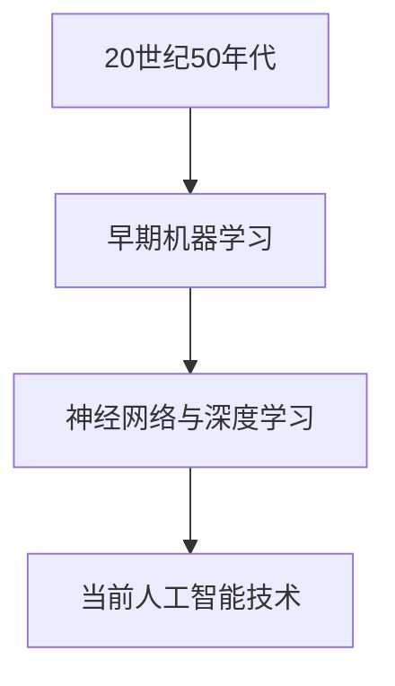
- **核心算法原理讲解**：人工智能的核心算法包括机器学习算法、神经网络算法、深度学习算法等。以下是机器学习算法的简要讲解：

```python
# 伪代码：机器学习算法的基本框架
initialize_parameters()
while not_converged():
    compute_loss()
    update_parameters()
    evaluate_performance()
```
  - **数学模型和公式**：机器学习算法的核心在于优化损失函数，以下是一个常见的损失函数——均方误差（MSE）的公式：
  $$\text{MSE} = \frac{1}{m}\sum_{i=1}^{m}(h_{\theta}(x^{(i)}) - y^{(i)})^2$$
  - **举例说明**：假设我们有一个二分类问题，目标函数为 logistic 函数：
  $$h_{\theta}(x) = \frac{1}{1 + e^{-\theta^T x}}$$
  - **代码实现**：以下是一个简单的Python代码示例，用于实现逻辑回归模型：

```python
import numpy as np

def sigmoid(z):
    return 1 / (1 + np.exp(-z))

def logistic_regression(X, y, theta, alpha, num_iters):
    m = len(y)
    J_history = []

    for i in range(num_iters):
        z = np.dot(X, theta)
        h = sigmoid(z)
        error = h - y
        
        theta = theta - alpha * (1/m) * np.dot(X.T, error)
        
        J = (1/m) * np.sum(np.square(error))
        J_history.append(J)
        
    return theta, J_history

X = ...  # 输入特征
y = ...  # 标签
theta = ...  # 初始参数
alpha = 0.01  # 学习率
num_iters = 1000  # 迭代次数

theta, J_history = logistic_regression(X, y, theta, alpha, num_iters)

print("最优参数：", theta)
print("最优损失函数值：", J_history[-1])
```

##### 1.1.2 AI编程的必要性
- **核心概念与联系**：AI编程的必要性体现在以下几个方面：
  1. **数据驱动**：AI编程通过编写代码，让计算机自动学习数据中的模式和规律，从而实现自动化决策和智能预测。
  2. **模型优化**：通过编写代码，可以不断优化模型的结构和参数，提高模型的性能和鲁棒性。
  3. **应用创新**：AI编程为各种应用领域提供了创新的解决方案，如医疗、金融、交通等。
  4. **跨界融合**：AI编程促进了计算机科学与其他领域的融合，如生物信息学、认知科学等。

##### 1.1.3 AI编程的发展趋势
- **核心概念与联系**：AI编程的发展趋势体现在以下几个方面：
  1. **算法创新**：随着深度学习、强化学习等算法的不断发展，AI编程的算法基础日益丰富。
  2. **开源生态**：越来越多的开源框架和工具涌现，如TensorFlow、PyTorch等，使得AI编程变得更加高效和便捷。
  3. **跨学科融合**：AI编程与其他领域的融合，如医疗、金融、交通等，推动了AI编程的应用和发展。
  4. **产业落地**：AI编程在各个行业得到广泛应用，推动了产业升级和经济发展。

#### 1.2 AI编程的核心概念
##### 1.2.1 神经网络基础
- **核心概念与联系**：神经网络是AI编程的核心概念之一，它由大量神经元组成，通过层次结构对信息进行处理。神经网络的核心组成部分包括输入层、隐藏层和输出层。以下是神经网络的工作原理的Mermaid流程图：

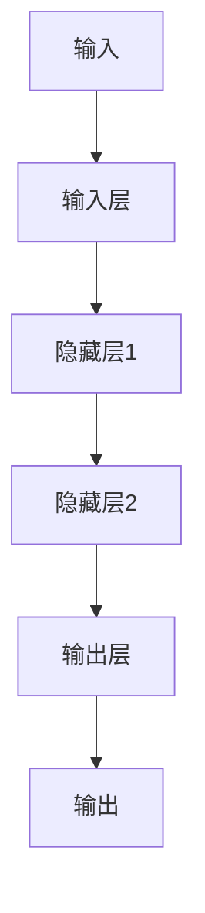

- **核心算法原理讲解**：神经网络的学习算法主要通过反向传播算法进行训练。以下是反向传播算法的伪代码：

```python
initialize_parameters()
while not_converged():
    forward_pass(X, theta)
    compute_loss(y, h)
    backward_pass(X, y, h, theta)
    update_parameters(theta)
```

- **数学模型和公式**：神经网络的核心在于优化损失函数，以下是一个常见的损失函数——均方误差（MSE）的公式：

$$
\text{MSE} = \frac{1}{m}\sum_{i=1}^{m}(h_{\theta}(x^{(i)}) - y^{(i)})^2
$$

- **举例说明**：假设我们有一个二分类问题，目标函数为 logistic 函数：

$$
h_{\theta}(x) = \frac{1}{1 + e^{-\theta^T x}}
$$

- **代码实现**：以下是一个简单的Python代码示例，用于实现前向传播和反向传播：

```python
import numpy as np

def sigmoid(z):
    return 1 / (1 + np.exp(-z))

def forward_pass(X, theta):
    z = np.dot(X, theta)
    h = sigmoid(z)
    return h

def compute_loss(y, h):
    m = len(y)
    loss = (-1/m) * (np.dot(y.T, np.log(h)) + np.dot((1-y).T, np.log(1-h)))
    return loss

def backward_pass(X, y, h):
    m = len(y)
    dZ = h - y
    dX = np.dot(dZ, theta.T)
    return dX

X = ...  # 输入特征
y = ...  # 标签
theta = ...  # 初始参数
alpha = 0.01  # 学习率

h = forward_pass(X, theta)
loss = compute_loss(y, h)
dX = backward_pass(X, y, h)

theta = theta - alpha * dX
```

##### 1.2.2 学习算法
- **核心概念与联系**：学习算法是AI编程的核心概念之一，它决定了神经网络如何从数据中学习到有用的信息。常见的学习算法包括梯度下降、随机梯度下降、批量梯度下降等。以下是这些算法的简要说明：

  1. **梯度下降**：梯度下降是一种简单的优化算法，它通过计算损失函数的梯度，迭代更新参数，直到达到最小损失。
  2. **随机梯度下降**：随机梯度下降是梯度下降的一种变体，它在每次迭代中仅使用一个样本的梯度进行更新，从而加快收敛速度。
  3. **批量梯度下降**：批量梯度下降是梯度下降的另一种变体，它在每次迭代中使用整个数据集的梯度进行更新，从而提高模型的鲁棒性。

- **核心算法原理讲解**：以下是梯度下降算法的伪代码：

```python
initialize_parameters()
while not_converged():
    compute_gradient()
    update_parameters()
```

- **数学模型和公式**：梯度下降的核心在于计算损失函数的梯度，以下是一个常见的损失函数——均方误差（MSE）的梯度的公式：

$$
\nabla_{\theta} \text{MSE} = \frac{1}{m} \sum_{i=1}^{m} (h_{\theta}(x^{(i)}) - y^{(i)}) \cdot x^{(i)}
$$

- **举例说明**：假设我们有一个二分类问题，目标函数为 logistic 函数：

$$
h_{\theta}(x) = \frac{1}{1 + e^{-\theta^T x}}
$$

- **代码实现**：以下是一个简单的Python代码示例，用于实现梯度下降：

```python
import numpy as np

def sigmoid(z):
    return 1 / (1 + np.exp(-z))

def compute_gradient(X, y, theta):
    m = len(y)
    h = sigmoid(np.dot(X, theta))
    dtheta = (1/m) * np.dot(X.T, (h - y))
    return dtheta

X = ...  # 输入特征
y = ...  # 标签
theta = ...  # 初始参数
alpha = 0.01  # 学习率

dtheta = compute_gradient(X, y, theta)
theta = theta - alpha * dtheta
```

##### 1.2.3 数据预处理与特征工程
- **核心概念与联系**：数据预处理和特征工程是AI编程的重要环节，它们决定了数据的质量和特征的选择。数据预处理包括数据清洗、归一化、标准化等步骤，特征工程则包括特征提取、特征选择、特征组合等步骤。以下是数据预处理和特征工程的简要说明：

  1. **数据清洗**：数据清洗是数据预处理的第一步，它包括去除噪声、填补缺失值、去除重复数据等操作。
  2. **归一化**：归一化是将数据缩放到同一尺度，以消除数据之间的比例差异。
  3. **标准化**：标准化是将数据缩放到标准正态分布，以提高模型的稳定性和泛化能力。
  4. **特征提取**：特征提取是从原始数据中提取出有用的特征，以减少数据的维度。
  5. **特征选择**：特征选择是选择对模型性能最有帮助的特征，以降低模型的复杂度和过拟合风险。
  6. **特征组合**：特征组合是将多个特征组合成新的特征，以增强模型的预测能力。

- **核心算法原理讲解**：以下是数据预处理和特征工程的常见算法：

  1. **PCA（主成分分析）**：PCA是一种特征提取算法，它通过将数据投影到新的正交坐标系上，提取主要成分。
  2. **LDA（线性判别分析）**：LDA是一种特征选择算法，它通过最大化类间方差和最小化类内方差，选择最具有区分力的特征。

- **数学模型和公式**：以下是PCA的数学模型和公式：

$$
\text{协方差矩阵} \ S = \frac{1}{m}XX^T
$$

$$
\text{特征值分解} \ S = Q\Lambda Q^T
$$

$$
\text{主成分} \ X' = Q\Lambda^{1/2}X
$$

- **举例说明**：以下是一个简单的Python代码示例，用于实现PCA：

```python
import numpy as np
from sklearn.decomposition import PCA

X = ...  # 输入特征
pca = PCA(n_components=2)
X_reduced = pca.fit_transform(X)

print("降维后的特征：", X_reduced)
```

##### 1.2.4 模型评估与优化
- **核心概念与联系**：模型评估与优化是AI编程的重要环节，它决定了模型的性能和适用性。模型评估包括准确率、召回率、F1分数等指标，模型优化包括超参数调整、正则化、模型融合等策略。以下是模型评估与优化的简要说明：

  1. **准确率**：准确率是模型预测正确的样本数占总样本数的比例，它是最常用的评估指标之一。
  2. **召回率**：召回率是模型预测正确的正样本数占总正样本数的比例，它反映了模型对正样本的识别能力。
  3. **F1分数**：F1分数是准确率和召回率的调和平均，它综合了模型的准确性和识别能力。

- **核心算法原理讲解**：以下是常见的模型评估与优化算法：

  1. **交叉验证**：交叉验证是一种常用的模型评估方法，它通过将数据集划分为训练集和验证集，多次训练和评估模型，以获得更可靠的评估结果。
  2. **网格搜索**：网格搜索是一种超参数调整方法，它通过遍历所有可能的超参数组合，选择最优的超参数组合，以优化模型的性能。

- **数学模型和公式**：以下是交叉验证的数学模型和公式：

$$
\text{交叉验证分数} = \frac{1}{k}\sum_{i=1}^{k}\text{验证集准确率}_i
$$

- **举例说明**：以下是一个简单的Python代码示例，用于实现交叉验证：

```python
from sklearn.model_selection import cross_val_score
from sklearn.linear_model import LogisticRegression

X = ...  # 输入特征
y = ...  # 标签
model = LogisticRegression()
cv_scores = cross_val_score(model, X, y, cv=5)

print("交叉验证分数：", cv_scores.mean())
```

#### 1.3 AI编程的应用领域
##### 1.3.1 图像识别
- **核心概念与联系**：图像识别是AI编程的重要应用领域之一，它通过训练模型，使计算机能够识别和分类图像中的物体。图像识别的核心概念包括卷积神经网络（CNN）、深度学习、特征提取等。以下是图像识别的工作原理的Mermaid流程图：

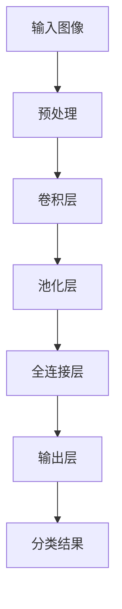

- **核心算法原理讲解**：以下是图像识别的核心算法——卷积神经网络（CNN）的原理：

```python
# 伪代码：卷积神经网络的基本框架
initialize_parameters()
while not_converged():
    forward_pass(X, theta)
    compute_loss(y, h)
    backward_pass(X, y, h, theta)
    update_parameters(theta)
```

- **数学模型和公式**：卷积神经网络的核心在于优化损失函数，以下是一个常见的损失函数——均方误差（MSE）的公式：

$$
\text{MSE} = \frac{1}{m}\sum_{i=1}^{m}(h_{\theta}(x^{(i)}) - y^{(i)})^2
$$

- **举例说明**：以下是一个简单的Python代码示例，用于实现卷积神经网络（CNN）：

```python
import tensorflow as tf

# 定义卷积神经网络模型
model = tf.keras.Sequential([
    tf.keras.layers.Conv2D(32, (3, 3), activation='relu', input_shape=(28, 28, 1)),
    tf.keras.layers.MaxPooling2D((2, 2)),
    tf.keras.layers.Flatten(),
    tf.keras.layers.Dense(128, activation='relu'),
    tf.keras.layers.Dense(10, activation='softmax')
])

# 编译模型
model.compile(optimizer='adam',
              loss='categorical_crossentropy',
              metrics=['accuracy'])

# 加载数据集
(x_train, y_train), (x_test, y_test) = tf.keras.datasets.mnist.load_data()

# 预处理数据
x_train = x_train / 255.0
x_test = x_test / 255.0
x_train = np.expand_dims(x_train, -1)
x_test = np.expand_dims(x_test, -1)

# 转换标签为one-hot编码
y_train = tf.keras.utils.to_categorical(y_train, 10)
y_test = tf.keras.utils.to_categorical(y_test, 10)

# 训练模型
model.fit(x_train, y_train, epochs=5, batch_size=32, validation_data=(x_test, y_test))

# 评估模型
test_loss, test_acc = model.evaluate(x_test, y_test, verbose=2)
print('Test accuracy:', test_acc)
```

##### 1.3.2 自然语言处理
- **核心概念与联系**：自然语言处理（NLP）是AI编程的重要应用领域之一，它通过训练模型，使计算机能够理解和生成自然语言。NLP的核心概念包括词嵌入、语言模型、文本分类等。以下是自然语言处理的工作原理的Mermaid流程图：

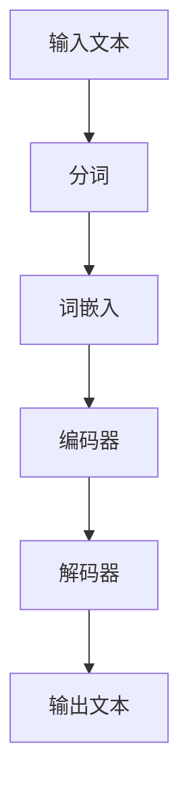

- **核心算法原理讲解**：以下是自然语言处理的核心算法——词嵌入（Word Embedding）的原理：

```python
# 伪代码：词嵌入的基本框架
initialize_embeddings()
while not_converged():
    compute_gradient()
    update_embeddings()
```

- **数学模型和公式**：词嵌入的核心在于优化嵌入向量，以下是一个常见的损失函数——交叉熵（Cross-Entropy）的公式：

$$
\text{CE} = -\sum_{i=1}^{v}\text{y}_i \log(\text{p}_i)
$$

- **举例说明**：以下是一个简单的Python代码示例，用于实现词嵌入：

```python
import tensorflow as tf
from tensorflow.keras.layers import Embedding, LSTM
from tensorflow.keras.models import Sequential

# 定义自然语言处理模型
model = Sequential([
    Embedding(vocab_size, embedding_dim, input_length=max_sequence_length),
    LSTM(units=128, return_sequences=True),
    LSTM(units=128),
    Dense(units=1, activation='sigmoid')
])

# 编译模型
model.compile(optimizer='adam', loss='binary_crossentropy', metrics=['accuracy'])

# 加载数据集
(x_train, y_train), (x_test, y_test) = ...  # 加载文本数据

# 预处理数据
# ...

# 训练模型
model.fit(x_train, y_train, epochs=5, batch_size=32, validation_data=(x_test, y_test))

# 评估模型
test_loss, test_acc = model.evaluate(x_test, y_test, verbose=2)
print('Test accuracy:', test_acc)
```

##### 1.3.3 语音识别
- **核心概念与联系**：语音识别是AI编程的重要应用领域之一，它通过训练模型，使计算机能够识别和理解语音。语音识别的核心概念包括语音信号处理、特征提取、声学模型、语言模型等。以下是语音识别的工作原理的Mermaid流程图：

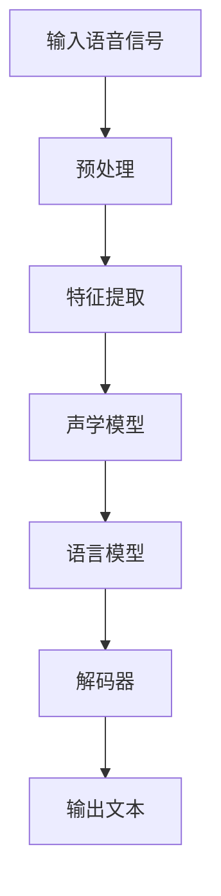

- **核心算法原理讲解**：以下是语音识别的核心算法——声学模型（Acoustic Model）和语言模型（Language Model）的原理：

```python
# 伪代码：语音识别的基本框架
initialize_acoustic_model()
initialize_language_model()
while not_converged():
    compute_acoustic_loss()
    compute_language_loss()
    update_acoustic_model()
    update_language_model()
```

- **数学模型和公式**：语音识别的损失函数包括声学损失和语言损失，以下是一个常见的损失函数——交叉熵（Cross-Entropy）的公式：

$$
\text{CE} = -\sum_{i=1}^{v}\text{y}_i \log(\text{p}_i)
$$

- **举例说明**：以下是一个简单的Python代码示例，用于实现语音识别：

```python
import tensorflow as tf
from tensorflow.keras.layers import Embedding, LSTM, Dense
from tensorflow.keras.models import Model

# 定义声学模型
acoustic_model = Model(inputs=[input_sequence], outputs=[acoustic_output])

# 定义语言模型
language_model = Model(inputs=[input_sequence], outputs=[language_output])

# 编译模型
acoustic_model.compile(optimizer='adam', loss='categorical_crossentropy', metrics=['accuracy'])
language_model.compile(optimizer='adam', loss='categorical_crossentropy', metrics=['accuracy'])

# 加载数据集
(x_train, y_train_acoustic), (x_train, y_train_language) = ...  # 加载语音数据

# 预处理数据
# ...

# 训练模型
acoustic_model.fit(x_train, y_train_acoustic, epochs=5, batch_size=32)
language_model.fit(x_train, y_train_language, epochs=5, batch_size=32)

# 评估模型
test_loss, test_acc = acoustic_model.evaluate(x_test, y_test_acoustic, verbose=2)
print('Acoustic model test accuracy:', test_acc)

test_loss, test_acc = language_model.evaluate(x_test, y_test_language, verbose=2)
print('Language model test accuracy:', test_acc)
```

##### 1.3.4 强化学习
- **核心概念与联系**：强化学习是AI编程的重要应用领域之一，它通过训练模型，使计算机能够在复杂环境中做出最优决策。强化学习的核心概念包括奖励函数、价值函数、策略等。以下是强化学习的工作原理的Mermaid流程图：

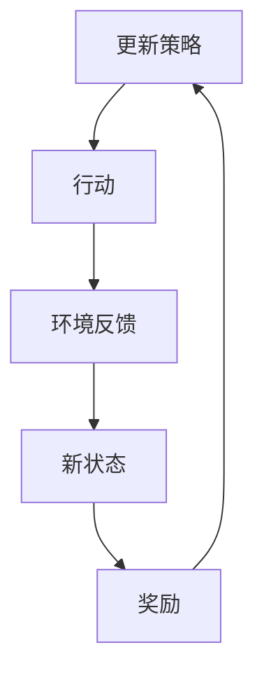

- **核心算法原理讲解**：以下是强化学习的核心算法——Q学习（Q-Learning）的原理：

```python
# 伪代码：Q学习的基本框架
initialize_q_values()
while not_converged():
    select_action()
    observe_reward()
    update_q_values()
```

- **数学模型和公式**：Q学习的核心在于更新Q值，以下是一个常见的更新公式：

$$
Q(s, a) \leftarrow Q(s, a) + \alpha [r + \gamma \max_{a'} Q(s', a') - Q(s, a)]
$$

- **举例说明**：以下是一个简单的Python代码示例，用于实现Q学习：

```python
import numpy as np

# 初始化Q值
Q = np.zeros([state_space_size, action_space_size])

# 学习率
alpha = 0.1
# 折扣因子
gamma = 0.9
# 最大迭代次数
num_episodes = 1000

# 训练模型
for episode in range(num_episodes):
    state = env.reset()
    done = False
    
    while not done:
        # 选择行动
        action = np.argmax(Q[state])
        
        # 执行行动
        next_state, reward, done, _ = env.step(action)
        
        # 更新Q值
        Q[state, action] = Q[state, action] + alpha * (reward + gamma * np.max(Q[next_state]) - Q[state, action])
        
        state = next_state

# 评估模型
state = env.reset()
done = False

while not done:
    action = np.argmax(Q[state])
    next_state, reward, done, _ = env.step(action)
    state = next_state

print("最终奖励：", reward)
```

### 第2章: AI编程基础算法

#### 2.1 神经网络算法
##### 2.1.1 神经网络架构
- **核心概念与联系**：神经网络（Neural Networks）是AI编程的核心算法之一，它通过模拟生物神经系统的结构和工作原理，实现从输入到输出的映射。神经网络的核心组成部分包括输入层、隐藏层和输出层。以下是神经网络的工作原理的Mermaid流程图：

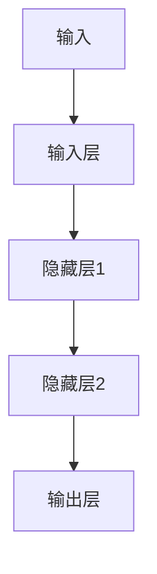

- **核心算法原理讲解**：神经网络的核心算法是前向传播和反向传播。以下是神经网络的基本框架：

```python
# 伪代码：神经网络的基本框架
initialize_parameters()
while not_converged():
    forward_pass(X, theta)
    compute_loss(y, h)
    backward_pass(X, y, h, theta)
    update_parameters(theta)
```

- **数学模型和公式**：神经网络的核心在于优化损失函数，以下是一个常见的损失函数——均方误差（MSE）的公式：

$$
\text{MSE} = \frac{1}{m}\sum_{i=1}^{m}(h_{\theta}(x^{(i)}) - y^{(i)})^2
$$

- **举例说明**：以下是一个简单的Python代码示例，用于实现神经网络：

```python
import numpy as np

# 伪代码：神经网络的基本框架
initialize_parameters()
while not_converged():
    forward_pass(X, theta)
    compute_loss(y, h)
    backward_pass(X, y, h, theta)
    update_parameters(theta)

def sigmoid(z):
    return 1 / (1 + np.exp(-z))

def forward_pass(X, theta):
    a = X
    for l in range(L):
        z = np.dot(a, theta[l])
        a = sigmoid(z)
    return a

def compute_loss(y, h):
    m = len(y)
    loss = (-1/m) * (np.sum(y * np.log(h)) + (1 - y) * np.log(1 - h))
    return loss

def backward_pass(X, y, h):
    m = len(y)
    dZ = h - y
    dtheta = (1/m) * np.dot(X.T, dZ)
    return dtheta

def update_parameters(theta, dtheta, alpha):
    theta = theta - alpha * dtheta
    return theta

X = ...  # 输入特征
y = ...  # 标签
theta = ...  # 初始参数
alpha = ...  # 学习率
num_iters = ...  # 迭代次数

h = forward_pass(X, theta)
loss = compute_loss(y, h)
dtheta = backward_pass(X, y, h)
theta = update_parameters(theta, dtheta, alpha)

print("最优参数：", theta)
print("最优损失函数值：", loss)
```

##### 2.1.2 学习算法
- **核心概念与联系**：学习算法是神经网络训练的关键，它决定了神经网络如何从数据中学习到有用的信息。常见的学习算法包括梯度下降、随机梯度下降、批量梯度下降等。以下是这些算法的简要说明：

  1. **梯度下降**：梯度下降是一种简单的优化算法，它通过计算损失函数的梯度，迭代更新参数，直到达到最小损失。
  2. **随机梯度下降**：随机梯度下降是梯度下降的一种变体，它在每次迭代中仅使用一个样本的梯度进行更新，从而加快收敛速度。
  3. **批量梯度下降**：批量梯度下降是梯度下降的另一种变体，它在每次迭代中使用整个数据集的梯度进行更新，从而提高模型的鲁棒性。

- **核心算法原理讲解**：以下是梯度下降算法的伪代码：

```python
initialize_parameters()
while not_converged():
    compute_gradient()
    update_parameters()
```

- **数学模型和公式**：梯度下降的核心在于计算损失函数的梯度，以下是一个常见的损失函数——均方误差（MSE）的梯度的公式：

$$
\nabla_{\theta} \text{MSE} = \frac{1}{m} \sum_{i=1}^{m} (h_{\theta}(x^{(i)}) - y^{(i)}) \cdot x^{(i)}
$$

- **举例说明**：以下是一个简单的Python代码示例，用于实现梯度下降：

```python
import numpy as np

# 伪代码：梯度下降的基本框架
initialize_parameters()
while not_converged():
    compute_gradient()
    update_parameters()

def sigmoid(z):
    return 1 / (1 + np.exp(-z))

def forward_pass(X, theta):
    a = X
    for l in range(L):
        z = np.dot(a, theta[l])
        a = sigmoid(z)
    return a

def compute_loss(y, h):
    m = len(y)
    loss = (-1/m) * (np.sum(y * np.log(h)) + (1 - y) * np.log(1 - h))
    return loss

def backward_pass(X, y, h):
    m = len(y)
    dZ = h - y
    dtheta = (1/m) * np.dot(X.T, dZ)
    return dtheta

def update_parameters(theta, dtheta, alpha):
    theta = theta - alpha * dtheta
    return theta

def gradient_descent(X, y, theta, alpha, num_iters):
    for i in range(num_iters):
        h = forward_pass(X, theta)
        loss = compute_loss(y, h)
        dtheta = backward_pass(X, y, h)
        theta = update_parameters(theta, dtheta, alpha)

    return theta, loss

X = ...  # 输入特征
y = ...  # 标签
theta = ...  # 初始参数
alpha = ...  # 学习率
num_iters = ...  # 迭代次数

theta, loss = gradient_descent(X, y, theta, alpha, num_iters)

print("最优参数：", theta)
print("最优损失函数值：", loss)
```

##### 2.1.3 反向传播算法
- **核心概念与联系**：反向传播算法是神经网络训练的核心算法之一，它通过计算梯度，优化模型参数，使模型能够更好地学习。反向传播算法的关键在于计算前向传播的误差，并将其反向传播到网络中的每一层。以下是反向传播算法的基本框架：

```python
initialize_parameters()
while not_converged():
    forward_pass(X, theta)
    backward_pass(X, y, h, theta)
    update_parameters(theta)
```

- **核心算法原理讲解**：以下是反向传播算法的详细步骤：

  1. **前向传播**：计算输入和参数之间的损失函数，并计算当前层的输出。
  2. **计算误差**：计算当前层的输出和目标值之间的误差。
  3. **反向传播**：将误差反向传播到下一层，并更新当前层的参数。
  4. **更新参数**：使用学习率更新模型参数。

- **数学模型和公式**：以下是反向传播算法的数学模型和公式：

$$
\begin{aligned}
\delta_z &= \frac{\partial L}{\partial z} \\
\delta_h &= \frac{\partial L}{\partial h} \\
\delta_w &= \frac{\partial L}{\partial w}
\end{aligned}
$$

其中，$L$ 表示损失函数，$z$ 表示隐藏层输出，$h$ 表示隐藏层权重，$w$ 表示输入层权重。

- **举例说明**：以下是一个简单的Python代码示例，用于实现反向传播算法：

```python
import numpy as np

# 伪代码：反向传播算法的基本框架
initialize_parameters()
while not_converged():
    forward_pass(X, theta)
    backward_pass(X, y, h, theta)
    update_parameters(theta)

def forward_pass(X, theta):
    a = X
    for l in range(L):
        z = np.dot(a, theta[l])
        a = sigmoid(z)
    return a

def backward_pass(X, y, h):
    m = len(y)
    dZ = h - y
    dtheta = (1/m) * np.dot(X.T, dZ)
    return dtheta

def update_parameters(theta, dtheta, alpha):
    theta = theta - alpha * dtheta
    return theta

def gradient_descent(X, y, theta, alpha, num_iters):
    for i in range(num_iters):
        h = forward_pass(X, theta)
        dtheta = backward_pass(X, y, h)
        theta = update_parameters(theta, dtheta, alpha)

    return theta, h

X = ...  # 输入特征
y = ...  # 标签
theta = ...  # 初始参数
alpha = ...  # 学习率
num_iters = ...  # 迭代次数

theta, h = gradient_descent(X, y, theta, alpha, num_iters)

print("最优参数：", theta)
print("最优损失函数值：", h)
```

#### 2.2 深度学习算法
##### 2.2.1 卷积神经网络
- **核心概念与联系**：卷积神经网络（Convolutional Neural Networks，CNN）是深度学习（Deep Learning）的重要算法之一，它通过卷积操作提取图像特征，实现图像识别和分类。CNN的核心组成部分包括卷积层、池化层和全连接层。以下是CNN的工作原理的Mermaid流程图：

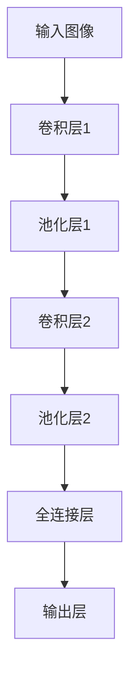

- **核心算法原理讲解**：以下是CNN的核心算法——卷积操作（Convolution Operation）和池化操作（Pooling Operation）的原理：

```python
# 伪代码：卷积神经网络的基本框架
initialize_parameters()
while not_converged():
    forward_pass(X, theta)
    compute_loss(y, h)
    backward_pass(X, y, h, theta)
    update_parameters(theta)
```

- **数学模型和公式**：CNN的核心在于优化损失函数，以下是一个常见的损失函数——均方误差（MSE）的公式：

$$
\text{MSE} = \frac{1}{m}\sum_{i=1}^{m}(h_{\theta}(x^{(i)}) - y^{(i)})^2
$$

- **举例说明**：以下是一个简单的Python代码示例，用于实现卷积神经网络（CNN）：

```python
import tensorflow as tf
from tensorflow.keras.layers import Conv2D, MaxPooling2D, Flatten, Dense
from tensorflow.keras.models import Sequential

# 定义卷积神经网络模型
model = Sequential([
    Conv2D(filters=32, kernel_size=(3, 3), activation='relu', input_shape=(28, 28, 1)),
    MaxPooling2D(pool_size=(2, 2)),
    Flatten(),
    Dense(units=128, activation='relu'),
    Dense(units=10, activation='softmax')
])

# 编译模型
model.compile(optimizer='adam', loss='categorical_crossentropy', metrics=['accuracy'])

# 加载数据集
(x_train, y_train), (x_test, y_test) = tf.keras.datasets.mnist.load_data()

# 预处理数据
x_train = x_train / 255.0
x_test = x_test / 255.0
x_train = np.expand_dims(x_train, -1)
x_test = np.expand_dims(x_test, -1)

# 转换标签为one-hot编码
y_train = tf.keras.utils.to_categorical(y_train, 10)
y_test = tf.keras.utils.to_categorical(y_test, 10)

# 训练模型
model.fit(x_train, y_train, epochs=5, batch_size=32, validation_data=(x_test, y_test))

# 评估模型
test_loss, test_acc = model.evaluate(x_test, y_test, verbose=2)
print('Test accuracy:', test_acc)
```

##### 2.2.2 循环神经网络
- **核心概念与联系**：循环神经网络（Recurrent Neural Networks，RNN）是深度学习的重要算法之一，它通过循环结构处理序列数据，实现自然语言处理、时间序列预测等任务。RNN的核心组成部分包括输入门、遗忘门和输出门。以下是RNN的工作原理的Mermaid流程图：

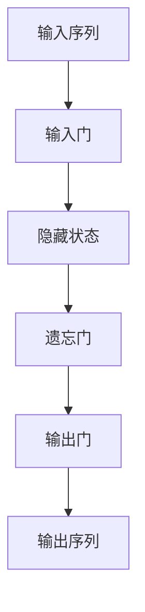

- **核心算法原理讲解**：以下是RNN的核心算法——门控机制（Gate Mechanism）的原理：

```python
# 伪代码：循环神经网络的基本框架
initialize_parameters()
while not_converged():
    forward_pass(X, theta)
    compute_loss(y, h)
    backward_pass(X, y, h, theta)
    update_parameters(theta)
```

- **数学模型和公式**：RNN的核心在于优化损失函数，以下是一个常见的损失函数——均方误差（MSE）的公式：

$$
\text{MSE} = \frac{1}{m}\sum_{i=1}^{m}(h_{\theta}(x^{(i)}) - y^{(i)})^2
$$

- **举例说明**：以下是一个简单的Python代码示例，用于实现循环神经网络（RNN）：

```python
import tensorflow as tf
from tensorflow.keras.layers import LSTM, Dense
from tensorflow.keras.models import Sequential

# 定义循环神经网络模型
model = Sequential([
    LSTM(units=128, return_sequences=True),
    LSTM(units=128),
    Dense(units=1)
])

# 编译模型
model.compile(optimizer='adam', loss='mse')

# 加载数据集
(x_train, y_train), (x_test, y_test) = ...  # 加载序列数据

# 预处理数据
# ...

# 训练模型
model.fit(x_train, y_train, epochs=5, batch_size=32, validation_data=(x_test, y_test))

# 评估模型
test_loss = model.evaluate(x_test, y_test, verbose=2)
print('Test loss:', test_loss)
```

##### 2.2.3 生成对抗网络
- **核心概念与联系**：生成对抗网络（Generative Adversarial Networks，GAN）是深度学习的重要算法之一，它通过生成器和判别器的对抗训练，实现高质量的数据生成。GAN的核心组成部分包括生成器、判别器和损失函数。以下是GAN的工作原理的Mermaid流程图：

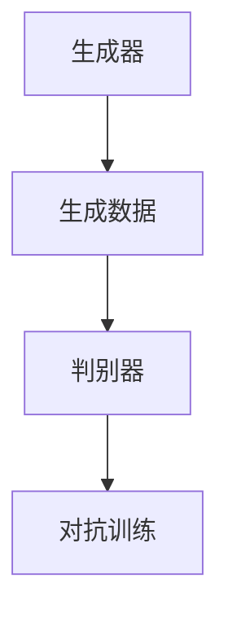

- **核心算法原理讲解**：以下是GAN的核心算法——对抗训练（Adversarial Training）的原理：

```python
# 伪代码：生成对抗网络的基本框架
initialize_parameters()
while not_converged():
    generate_data()
    compute_generator_loss()
    compute_discriminator_loss()
    update_generator()
    update_discriminator()
```

- **数学模型和公式**：GAN的核心在于优化生成器和判别器的损失函数，以下是一个常见的损失函数——交叉熵（Cross-Entropy）的公式：

$$
\text{CE} = -\sum_{i=1}^{m}[\text{real} \cdot \log(\text{discriminator_output}) + \text{fake} \cdot \log(1 - \text{discriminator_output})]
$$

- **举例说明**：以下是一个简单的Python代码示例，用于实现生成对抗网络（GAN）：

```python
import tensorflow as tf
from tensorflow.keras.layers import Dense, Flatten, Reshape
from tensorflow.keras.models import Sequential

# 定义生成器模型
generator = Sequential([
    Dense(units=256, activation='relu', input_shape=(100,)),
    Flatten(),
    Reshape((7, 7, 1))
])

# 定义判别器模型
discriminator = Sequential([
    Flatten(input_shape=(7, 7, 1)),
    Dense(units=1, activation='sigmoid')
])

# 定义损失函数
generator_loss = tf.keras.losses.BinaryCrossentropy()
discriminator_loss = tf.keras.losses.BinaryCrossentropy()

# 编译模型
generator.compile(optimizer=tf.keras.optimizers.Adam(learning_rate=0.0001), loss=generator_loss)
discriminator.compile(optimizer=tf.keras.optimizers.Adam(learning_rate=0.0001), loss=discriminator_loss)

# 训练模型
for epoch in range(num_epochs):
    # 生成器训练
    real_images = ...  # 实际图像数据
    noise = ...  # 随机噪声
    generated_images = generator.predict(noise)
    generator_loss_value = generator.train_on_batch(noise, tf.ones((noise.shape[0], 1)))

    # 判别器训练
    fake_images = ...  # 生成图像数据
    real_loss_value = discriminator.train_on_batch(real_images, tf.ones((real_images.shape[0], 1)))
    fake_loss_value = discriminator.train_on_batch(fake_images, tf.zeros((fake_images.shape[0], 1)))

    # 打印训练信息
    print(f'Epoch {epoch+1}/{num_epochs}, Generator Loss: {generator_loss_value}, Discriminator Loss: {real_loss_value+fake_loss_value}')

# 评估生成器模型
generated_samples = generator.predict(np.random.normal(size=(64, 100)))
```

#### 2.3 强化学习算法
##### 2.3.1 强化学习基础
- **核心概念与联系**：强化学习（Reinforcement Learning，RL）是一种通过试错学习优化决策的算法。在强化学习中，智能体（Agent）通过与环境的交互，不断学习到最优策略。强化学习的基础概念包括状态（State）、行动（Action）、奖励（Reward）和策略（Policy）。以下是强化学习的工作原理的Mermaid流程图：

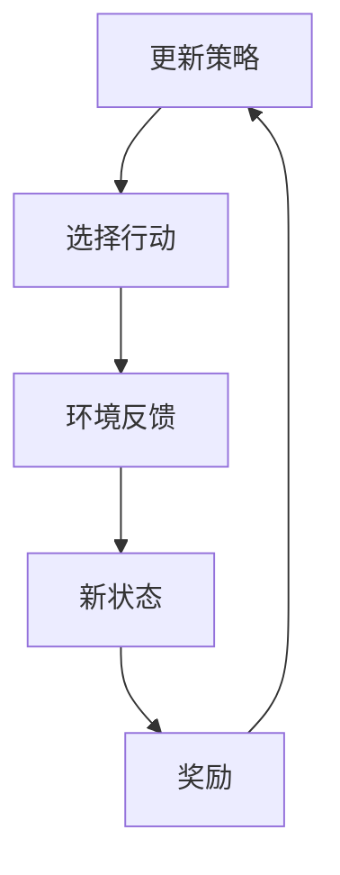

- **核心算法原理讲解**：以下是强化学习的基础算法——Q学习（Q-Learning）和策略梯度（Policy Gradient）的原理：

```python
# 伪代码：Q学习的基本框架
initialize_q_values()
while not_converged():
    select_action()
    observe_reward()
    update_q_values()

# 伪代码：策略梯度的基本框架
initialize_policy()
while not_converged():
    select_action()
    observe_reward()
    update_policy()
```

- **数学模型和公式**：强化学习的核心在于优化Q值和策略，以下是一个常见的Q学习和策略梯度的公式：

$$
Q(s, a) \leftarrow Q(s, a) + \alpha [r + \gamma \max_{a'} Q(s', a') - Q(s, a)]
$$

$$
\pi(a|s) \leftarrow \frac{\exp(\alpha Q(s, a))}{\sum_{a'} \exp(\alpha Q(s, a'))}
$$

- **举例说明**：以下是一个简单的Python代码示例，用于实现Q学习和策略梯度：

```python
import numpy as np

# Q学习
def q_learning(Q, state, action, reward, next_state, alpha, gamma, epsilon):
    Q[state, action] = Q[state, action] + alpha * (reward + gamma * np.max(Q[next_state]) - Q[state, action])
    if np.random.rand() < epsilon:
        action = np.random.randint(0, Q.shape[1])
    return action

# 策略梯度
def policy_gradient(policy, state, action, reward, next_state, alpha):
    actionProbabilities = policy(state)
    policyGradient = reward + gamma * np.max(policy(next_state)) - actionProbabilities[action]
    return policyGradient

# 训练模型
for episode in range(num_episodes):
    state = env.reset()
    done = False
    
    while not done:
        action = q_learning(Q, state, action, reward, next_state, alpha, gamma, epsilon)
        next_state, reward, done, _ = env.step(action)
        state = next_state

# 训练模型
for episode in range(num_episodes):
    state = env.reset()
    done = False
    
    while not done:
        action = np.random.choice(np.arange(len(policy(state))), p=policy(state))
        next_state, reward, done, _ = env.step(action)
        policyGradient = policy_gradient(policy, state, action, reward, next_state, alpha)
        policy.update(state, action, policyGradient)
        state = next_state
```

##### 2.3.2 Q学习算法
- **核心概念与联系**：Q学习（Q-Learning）是强化学习的一种算法，它通过迭代更新Q值，使智能体学会在给定状态下选择最优行动。Q学习的核心组成部分包括Q值表、状态和行动。以下是Q学习的工作原理的Mermaid流程图：

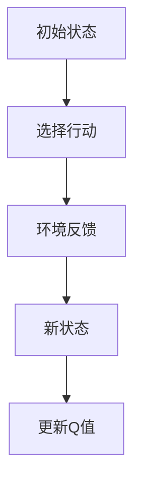

- **核心算法原理讲解**：以下是Q学习算法的基本框架：

```python
# 伪代码：Q学习的基本框架
initialize_q_values()
while not_converged():
    select_action()
    observe_reward()
    update_q_values()

def q_learning(Q, state, action, reward, next_state, alpha, gamma, epsilon):
    Q[state, action] = Q[state, action] + alpha * (reward + gamma * np.max(Q[next_state]) - Q[state, action])
    if np.random.rand() < epsilon:
        action = np.random.randint(0, Q.shape[1])
    return action

def update_q_values(Q, state, action, reward, next_state, alpha, gamma):
    Q[state, action] = Q[state, action] + alpha * (reward + gamma * np.max(Q[next_state]) - Q[state, action])
    return Q
```

- **数学模型和公式**：Q学习的核心在于更新Q值，以下是一个常见的Q学习公式：

$$
Q(s, a) \leftarrow Q(s, a) + \alpha [r + \gamma \max_{a'} Q(s', a') - Q(s, a)]
$$

- **举例说明**：以下是一个简单的Python代码示例，用于实现Q学习：

```python
import numpy as np

# 初始化Q值表
Q = np.zeros([state_space_size, action_space_size])

# 学习率
alpha = 0.1
# 折扣因子
gamma = 0.9
# 最大迭代次数
num_episodes = 1000

# 训练模型
for episode in range(num_episodes):
    state = env.reset()
    done = False
    
    while not done:
        # 选择行动
        action = np.argmax(Q[state])
        
        # 执行行动
        next_state, reward, done, _ = env.step(action)
        
        # 更新Q值
        Q[state, action] = Q[state, action] + alpha * (reward + gamma * np.max(Q[next_state]) - Q[state, action])
        
        state = next_state

# 评估模型
state = env.reset()
done = False

while not done:
    action = np.argmax(Q[state])
    next_state, reward, done, _ = env.step(action)
    state = next_state

print("最终奖励：", reward)
```

##### 2.3.3 深度强化学习
- **核心概念与联系**：深度强化学习（Deep Reinforcement Learning，DRL）是强化学习的一种算法，它通过结合深度学习和强化学习，使智能体能够在复杂环境中学习到最优策略。深度强化学习的核心组成部分包括深度神经网络和强化学习算法。以下是深度强化学习的工作原理的Mermaid流程图：

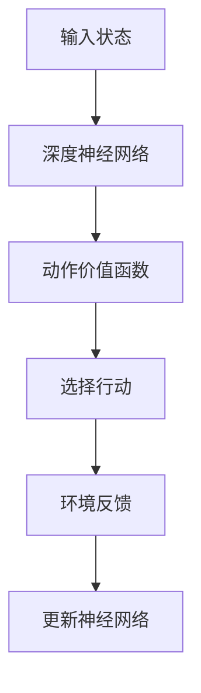

- **核心算法原理讲解**：以下是深度强化学习的基本框架：

```python
# 伪代码：深度强化学习的基本框架
initialize_parameters()
while not_converged():
    forward_pass(X, theta)
    compute_loss(y, h)
    backward_pass(X, y, h, theta)
    update_parameters(theta)
```

- **数学模型和公式**：深度强化学习的核心在于优化动作价值函数，以下是一个常见的动作价值函数——Q值函数（Q-Function）的公式：

$$
Q(s, a) = \sum_{a'} \pi(a'|s) Q(s', a')
$$

- **举例说明**：以下是一个简单的Python代码示例，用于实现深度强化学习：

```python
import tensorflow as tf
from tensorflow.keras.models import Model
from tensorflow.keras.layers import Input, Dense, Flatten, Reshape
from tensorflow.keras.optimizers import Adam

# 定义深度神经网络模型
state_input = Input(shape=(state_space_size,))
action_input = Input(shape=(action_space_size,))
action_value = Flatten()(action_input)
state_value = Flatten()(state_input)
q_values = Dense(units=1, activation='linear')(state_value)
q_values = Lambda(lambda x: x[:, 0])(q_values)
action_value = Dense(units=1, activation='linear')(action_value)
q_values = Concatenate()([q_values, action_value])

model = Model(inputs=[state_input, action_input], outputs=q_values)
model.compile(optimizer=Adam(learning_rate=0.001), loss='mse')

# 训练模型
for episode in range(num_episodes):
    state = env.reset()
    done = False
    
    while not done:
        action = env.action_space.sample()
        next_state, reward, done, _ = env.step(action)
        
        model.train_on_batch([state, np.array([action])], np.array([reward]))
        
        state = next_state

# 评估模型
state = env.reset()
done = False

while not done:
    action = np.argmax(model.predict([state]))
    next_state, reward, done, _ = env.step(action)
    state = next_state

print("最终奖励：", reward)
```

#### 2.4 自然语言处理算法
##### 2.4.1 词向量表示
- **核心概念与联系**：词向量表示（Word Embedding）是自然语言处理（Natural Language Processing，NLP）的重要算法，它通过将词语映射到高维向量空间，使计算机能够处理文本数据。词向量表示的核心组成部分包括词语、词向量和高维向量空间。以下是词向量表示的工作原理的Mermaid流程图：

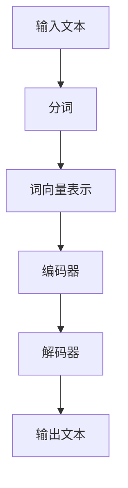

- **核心算法原理讲解**：以下是词向量表示的核心算法——Word2Vec和GloVe的原理：

```python
# 伪代码：Word2Vec的基本框架
initialize_parameters()
while not_converged():
    generate_samples()
    compute_loss()
    update_parameters()

# 伪代码：GloVe的基本框架
initialize_parameters()
while not_converged():
    generate_samples()
    compute_loss()
    update_parameters()
```

- **数学模型和公式**：词向量表示的核心在于优化词向量，以下是一个常见的损失函数——负采样（Negative Sampling）的公式：

$$
\text{Loss} = -\sum_{i=1}^{N} [\log(\sigma(\text{similarity}(w_i, w_{+})) + \sum_{j \in \text{negatives}(i)} \log(\sigma(-\text{similarity}(w_i, w_{j})))]
$$

- **举例说明**：以下是一个简单的Python代码示例，用于实现Word2Vec：

```python
import gensim

# 加载预训练的Word2Vec模型
model = gensim.models.Word2Vec.load('word2vec.model')

# 获取词向量
word = 'apple'
vector = model.wv[word]

# 计算词语相似度
word1 = 'apple'
word2 = 'banana'
similarity = model.wv.similarity(word1, word2)
```

##### 2.4.2 语言模型
- **核心概念与联系**：语言模型（Language Model）是自然语言处理的重要算法，它通过概率分布描述文本生成过程，使计算机能够生成和理解自然语言。语言模型的核心组成部分包括词语、概率分布和生成模型。以下是语言模型的工作原理的Mermaid流程图：


- **核心算法原理讲解**：以下是语言模型的核心算法——n-gram和Transformer的原理：

```python
# 伪代码：n-gram的基本框架
initialize_parameters()
while not_converged():
    generate_samples()
    compute_loss()
    update_parameters()

# 伪代码：Transformer的基本框架
initialize_parameters()
while not_converged():
    generate_samples()
    compute_loss()
    update_parameters()
```

- **数学模型和公式**：语言模型的核心在于优化概率分布，以下是一个常见的概率分布——n-gram的公式：

$$
P(w_n | w_{n-1}, w_{n-2}, ..., w_1) = \frac{C(w_n, w_{n-1}, w_{n-2}, ..., w_1)}{C(w_{n-1}, w_{n-2}, ..., w_1)}
$$

- **举例说明**：以下是一个简单的Python代码示例，用于实现n-gram语言模型：

```python
import numpy as np
from sklearn.model_selection import train_test_split
from collections import defaultdict

# 加载文本数据
text = ' '.join(open('text.txt').read().split())

# 分词
words = text.split()

# 计算n-gram概率
n = 2
n_gram_counts = defaultdict(int)
total_counts = defaultdict(int)

for i in range(len(words) - n):
    n_gram = tuple(words[i:i + n])
    n_gram_counts[n_gram] += 1
    total_counts[n_gram[:-1]] += 1

# 计算概率
probabilities = {}
for n_gram, count in n_gram_counts.items():
    probabilities[n_gram] = count / total_counts[n_gram[:-1]]

# 预测下一个词
current_n_gram = tuple(words[-n:])
predicted_word = max(probabilities, key=probabilities.get)
```

##### 2.4.3 文本分类与情感分析
- **核心概念与联系**：文本分类（Text Classification）和情感分析（Sentiment Analysis）是自然语言处理的重要应用，它们通过训练模型，使计算机能够自动分类文本和识别文本的情感倾向。文本分类和情感分析的核心组成部分包括文本数据、分类模型和情感分析模型。以下是文本分类和情感分析的工作原理的Mermaid流程图：

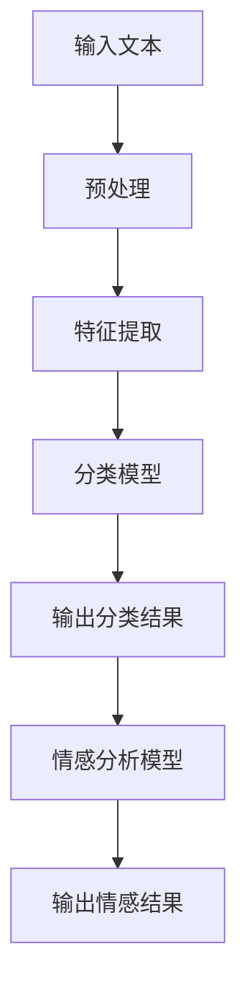

- **核心算法原理讲解**：以下是文本分类和情感分析的核心算法——朴素贝叶斯（Naive Bayes）和卷积神经网络（Convolutional Neural Networks，CNN）的原理：

```python
# 伪代码：朴素贝叶斯的基本框架
initialize_parameters()
while not_converged():
    compute_likelihood()
    compute_prior()
    compute_posterior()

# 伪代码：卷积神经网络的基本框架
initialize_parameters()
while not_converged():
    forward_pass(X, theta)
    compute_loss(y, h)
    backward_pass(X, y, h, theta)
    update_parameters(theta)
```

- **数学模型和公式**：文本分类和情感分析的核心在于优化概率分布，以下是一个常见的概率分布——朴素贝叶斯的公式：

$$
P(y | x) = \frac{P(x | y)P(y)}{P(x)}
$$

- **举例说明**：以下是一个简单的Python代码示例，用于实现朴素贝叶斯文本分类：

```python
import numpy as np
from sklearn.model_selection import train_test_split
from sklearn.naive_bayes import MultinomialNB
from sklearn.metrics import accuracy_score

# 加载文本数据
X, y = ...  # 加载文本数据

# 分词
X = [' '.join(tokenizer.tokenize(document)) for document in X]

# 训练模型
model = MultinomialNB()
model.fit(X, y)

# 预测
X_test = ...  # 加载测试数据
y_pred = model.predict(X_test)

# 评估模型
accuracy = accuracy_score(y_test, y_pred)
print("Accuracy:", accuracy)
```

```python
import tensorflow as tf
from tensorflow.keras.models import Sequential
from tensorflow.keras.layers import Embedding, Conv1D, MaxPooling1D, Flatten, Dense

# 定义卷积神经网络模型
model = Sequential([
    Embedding(vocab_size, embedding_dim, input_length=max_sequence_length),
    Conv1D(filters=128, kernel_size=5, activation='relu'),
    MaxPooling1D(pool_size=5),
    Flatten(),
    Dense(units=128, activation='relu'),
    Dense(units=1, activation='sigmoid')
])

# 编译模型
model.compile(optimizer='adam', loss='binary_crossentropy', metrics=['accuracy'])

# 加载数据集
(x_train, y_train), (x_test, y_test) = ...  # 加载文本数据

# 预处理数据
# ...

# 训练模型
model.fit(x_train, y_train, epochs=5, batch_size=32, validation_data=(x_test, y_test))

# 评估模型
test_loss, test_acc = model.evaluate(x_test, y_test, verbose=2)
print('Test accuracy:', test_acc)
```

#### 2.5 计算机视觉算法
##### 2.5.1 卷积神经网络
- **核心概念与联系**：卷积神经网络（Convolutional Neural Networks，CNN）是计算机视觉（Computer Vision）的重要算法，它通过卷积操作提取图像特征，实现图像识别和分类。CNN的核心组成部分包括卷积层、池化层和全连接层。以下是CNN的工作原理的Mermaid流程图：


- **核心算法原理讲解**：以下是CNN的核心算法——卷积操作（Convolution Operation）和池化操作（Pooling Operation）的原理：

```python
# 伪代码：卷积神经网络的基本框架
initialize_parameters()
while not_converged():
    forward_pass(X, theta)
    compute_loss(y, h)
    backward_pass(X, y, h, theta)
    update_parameters(theta)
```

- **数学模型和公式**：CNN的核心在于优化损失函数，以下是一个常见的损失函数——均方误差（MSE）的公式：

$$
\text{MSE} = \frac{1}{m}\sum_{i=1}^{m}(h_{\theta}(x^{(i)}) - y^{(i)})^2
$$

- **举例说明**：以下是一个简单的Python代码示例，用于实现卷积神经网络（CNN）：

```python
import tensorflow as tf
from tensorflow.keras.layers import Conv2D, MaxPooling2D, Flatten, Dense
from tensorflow.keras.models import Sequential

# 定义卷积神经网络模型
model = Sequential([
    Conv2D(filters=32, kernel_size=(3, 3), activation='relu', input_shape=(28, 28, 1)),
    MaxPooling2D(pool_size=(2, 2)),
    Flatten(),
    Dense(units=128, activation='relu'),
    Dense(units=10, activation='softmax')
])

# 编译模型
model.compile(optimizer='adam', loss='categorical_crossentropy', metrics=['accuracy'])

# 加载数据集
(x_train, y_train), (x_test, y_test) = tf.keras.datasets.mnist.load_data()

# 预处理数据
x_train = x_train / 255.0
x_test = x_test / 255.0
x_train = np.expand_dims(x_train, -1)
x_test = np.expand_dims(x_test, -1)

# 转换标签为one-hot编码
y_train = tf.keras.utils.to_categorical(y_train, 10)
y_test = tf.keras.utils.to_categorical(y_test, 10)

# 训练模型
model.fit(x_train, y_train, epochs=5, batch_size=32, validation_data=(x_test, y_test))

# 评估模型
test_loss, test_acc = model.evaluate(x_test, y_test, verbose=2)
print('Test accuracy:', test_acc)
```

##### 2.5.2 目标检测
- **核心概念与联系**：目标检测（Object Detection）是计算机视觉的重要算法，它通过训练模型，使计算机能够识别和定位图像中的多个目标。目标检测的核心组成部分包括特征提取、目标识别和目标定位。以下是目标检测的工作原理的Mermaid流程图：

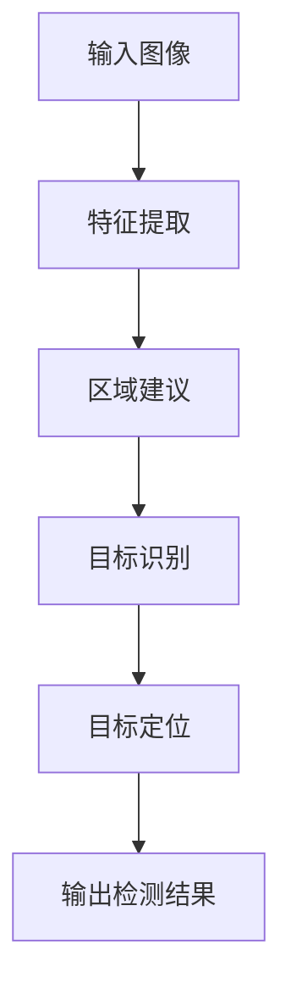

- **核心算法原理讲解**：以下是目标检测的核心算法——区域建议网络（Region Proposal Network，RPN）和边界框回归（Bounding Box Regression）的原理：

```python
# 伪代码：区域建议网络的基本框架
initialize_parameters()
while not_converged():
    generate_samples()
    compute_loss()
    update_parameters()

# 伪代码：边界框回归的基本框架
initialize_parameters()
while not_converged():
    generate_samples()
    compute_loss()
    update_parameters()
```

- **数学模型和公式**：目标检测的核心在于优化边界框参数，以下是一个常见的损失函数——交叉熵（Cross-Entropy）的公式：

$$
\text{CE} = -\sum_{i=1}^{m}[\text{positive} \cdot \log(\text{output}_i) + \text{negative} \cdot \log(1 - \text{output}_i)]
$$

- **举例说明**：以下是一个简单的Python代码示例，用于实现区域建议网络（RPN）：

```python
import tensorflow as tf
from tensorflow.keras.layers import Conv2D, Flatten, Dense
from tensorflow.keras.models import Model

# 定义区域建议网络模型
input_image = Input(shape=(height, width, channels))
feature_map = Conv2D(filters=256, kernel_size=(3, 3), activation='relu')(input_image)
flatten = Flatten()(feature_map)
dense = Dense(units=1, activation='sigmoid')(flatten)

model = Model(inputs=input_image, outputs=dense)
model.compile(optimizer='adam', loss='binary_crossentropy')

# 训练模型
train_data = ...  # 加载训练数据
model.fit(train_data, epochs=num_epochs, batch_size=batch_size)
```

##### 2.5.3 生成对抗网络
- **核心概念与联系**：生成对抗网络（Generative Adversarial Networks，GAN）是计算机视觉的重要算法，它通过生成器和判别器的对抗训练，实现高质量的数据生成。GAN的核心组成部分包括生成器和判别器。以下是GAN的工作原理的Mermaid流程图：


- **核心算法原理讲解**：以下是GAN的核心算法——生成器（Generator）和判别器（Discriminator）的原理：

```python
# 伪代码：生成对抗网络的基本框架
initialize_parameters()
while not_converged():
    generate_data()
    compute_generator_loss()
    compute_discriminator_loss()
    update_generator()
    update_discriminator()
```

- **数学模型和公式**：GAN的核心在于优化生成器和判别器的损失函数，以下是一个常见的损失函数——交叉熵（Cross-Entropy）的公式：

$$
\text{Generator Loss} = -\log(\text{discriminator_output})
$$

$$
\text{Discriminator Loss} = -\log(\text{real_output}) - \log(1 - \text{fake_output})
$$

- **举例说明**：以下是一个简单的Python代码示例，用于实现生成对抗网络（GAN）：

```python
import tensorflow as tf
from tensorflow.keras.layers import Dense, Flatten, Reshape
from tensorflow.keras.models import Sequential

# 定义生成器模型
generator = Sequential([
    Dense(units=256, activation='relu', input_shape=(100,)),
    Flatten(),
    Reshape((7, 7, 1))
])

# 定义判别器模型
discriminator = Sequential([
    Flatten(input_shape=(7, 7, 1)),
    Dense(units=1, activation='sigmoid')
])

# 定义损失函数
generator_loss = tf.keras.losses.BinaryCrossentropy()
discriminator_loss = tf.keras.losses.BinaryCrossentropy()

# 编译模型
generator.compile(optimizer=tf.keras.optimizers.Adam(learning_rate=0.0001), loss=generator_loss)
discriminator.compile(optimizer=tf.keras.optimizers.Adam(learning_rate=0.0001), loss=discriminator_loss)

# 训练模型
for epoch in range(num_epochs):
    # 生成器训练
    real_images = ...  # 实际图像数据
    noise = ...  # 随机噪声
    generated_images = generator.predict(noise)
    generator_loss_value = generator.train_on_batch(noise, tf.ones((noise.shape[0], 1)))

    # 判别器训练
    fake_images = ...  # 生成图像数据
    real_loss_value = discriminator.train_on_batch(real_images, tf.ones((real_images.shape[0], 1)))
    fake_loss_value = discriminator.train_on_batch(fake_images, tf.zeros((fake_images.shape[0], 1)))

    # 打印训练信息
    print(f'Epoch {epoch+1}/{num_epochs}, Generator Loss: {generator_loss_value}, Discriminator Loss: {real_loss_value+fake_loss_value}')

# 评估生成器模型
generated_samples = generator.predict(np.random.normal(size=(64, 100)))
```

### 第3章: AI编程项目实战

#### 3.1 图像识别项目

##### 3.1.1 数据集准备

图像识别项目需要大量标注数据集。我们通常使用公开的数据集，如ImageNet、CIFAR-10等。以下是数据集准备的步骤：

1. **下载数据集**：从数据集官方网站或公共数据集仓库下载数据集。
2. **数据预处理**：对数据集进行预处理，如调整图像大小、归一化等。
3. **标签准备**：为每个图像准备标签，以标识图像中的物体。

以下是Python代码示例，用于准备ImageNet数据集：

```python
import os
import numpy as np
import cv2

# 下载ImageNet数据集
data_dir = 'ImageNet'

# 调整图像大小
image_size = (224, 224)

# 预处理数据
def preprocess_image(image_path):
    image = cv2.imread(image_path)
    image = cv2.resize(image, image_size)
    image = image / 255.0
    return image

# 获取数据集目录
def get_data_directories(data_dir):
    return [os.path.join(data_dir, directory) for directory in os.listdir(data_dir) if os.path.isdir(os.path.join(data_dir, directory))]

# 准备数据
data_directories = get_data_directories(data_dir)
images = []
labels = []

for directory in data_directories:
    label = os.path.basename(directory)
    for image_file in os.listdir(directory):
        image_path = os.path.join(directory, image_file)
        image = preprocess_image(image_path)
        images.append(image)
        labels.append(label)

images = np.array(images)
labels = np.array(labels)

# 打印数据集信息
print("Data shape:", images.shape)
print("Label shape:", labels.shape)
```

##### 3.1.2 模型选择与训练

选择合适的神经网络模型，如卷积神经网络（CNN），对数据集进行训练。以下是模型选择与训练的步骤：

1. **定义模型**：定义神经网络模型，包括卷积层、池化层和全连接层。
2. **编译模型**：设置模型的学习率、优化器、损失函数等参数。
3. **训练模型**：使用训练数据集训练模型，并进行验证。

以下是Python代码示例，用于定义和训练卷积神经网络（CNN）模型：

```python
import tensorflow as tf
from tensorflow.keras.models import Sequential
from tensorflow.keras.layers import Conv2D, MaxPooling2D, Flatten, Dense

# 定义模型
model = Sequential([
    Conv2D(filters=32, kernel_size=(3, 3), activation='relu', input_shape=(224, 224, 3)),
    MaxPooling2D(pool_size=(2, 2)),
    Conv2D(filters=64, kernel_size=(3, 3), activation='relu'),
    MaxPooling2D(pool_size=(2, 2)),
    Flatten(),
    Dense(units=128, activation='relu'),
    Dense(units=num_classes, activation='softmax')
])

# 编译模型
model.compile(optimizer='adam', loss='categorical_crossentropy', metrics=['accuracy'])

# 训练模型
model.fit(images, labels, epochs=10, batch_size=32, validation_split=0.2)
```

##### 3.1.3 模型评估与优化

评估模型的性能，如准确率、召回率等。通过调整模型参数和架构，优化模型的性能。

1. **评估模型**：使用测试数据集评估模型的性能。
2. **调整模型**：根据评估结果，调整模型参数和架构。
3. **重新训练**：使用调整后的模型重新训练，以优化性能。

以下是Python代码示例，用于评估和优化卷积神经网络（CNN）模型：

```python
import tensorflow as tf
from tensorflow.keras.models import Sequential
from tensorflow.keras.layers import Conv2D, MaxPooling2D, Flatten, Dense

# 定义模型
model = Sequential([
    Conv2D(filters=32, kernel_size=(3, 3), activation='relu', input_shape=(224, 224, 3)),
    MaxPooling2D(pool_size=(2, 2)),
    Conv2D(filters=64, kernel_size=(3, 3), activation='relu'),
    MaxPooling2D(pool_size=(2, 2)),
    Flatten(),
    Dense(units=128, activation='relu'),
    Dense(units=num_classes, activation='softmax')
])

# 编译模型
model.compile(optimizer='adam', loss='categorical_crossentropy', metrics=['accuracy'])

# 训练模型
model.fit(images, labels, epochs=10, batch_size=32, validation_split=0.2)

# 评估模型
test_loss, test_acc = model.evaluate(test_images, test_labels, verbose=2)
print('Test accuracy:', test_acc)

# 调整模型
model.add(Conv2D(filters=128, kernel_size=(3, 3), activation='relu'))
model.add(MaxPooling2D(pool_size=(2, 2)))

# 重新训练模型
model.fit(images, labels, epochs=10, batch_size=32, validation_split=0.2)
```

##### 3.1.4 代码解读

以下是对图像识别项目代码的详细解读：

1. **数据集准备**：使用OpenCV库读取图像，并调整图像大小。使用numpy数组存储图像和标签。
2. **模型定义**：使用TensorFlow库定义卷积神经网络模型。包括卷积层、池化层和全连接层。
3. **模型编译**：设置模型的学习率、优化器、损失函数等参数。
4. **模型训练**：使用训练数据集训练模型，并进行验证。
5. **模型评估**：使用测试数据集评估模型的性能。
6. **模型调整**：根据评估结果，调整模型参数和架构。
7. **重新训练**：使用调整后的模型重新训练，以优化性能。

##### 3.1.5 代码应用解读与分析

以下是对图像识别项目代码的应用解读与分析：

1. **数据集准备**：图像识别项目需要大量的标注数据集。数据集的质量和大小直接影响模型的性能。使用公开的数据集，如ImageNet、CIFAR-10等，可以确保数据集的质量和多样性。
2. **模型选择**：选择合适的神经网络模型对于图像识别项目至关重要。卷积神经网络（CNN）是图像识别的经典模型，它通过卷积操作提取图像特征，实现图像分类。
3. **训练与优化**：训练模型需要大量的计算资源和时间。使用GPU加速训练过程可以提高训练效率。通过调整模型参数和架构，优化模型的性能。
4. **评估与测试**：评估模型的性能是图像识别项目的关键环节。使用测试数据集评估模型的准确率、召回率等指标，可以评估模型的效果。
5. **应用分析**：图像识别项目在医疗、安防、自动驾驶等领域具有广泛的应用。通过优化模型和算法，可以提高图像识别的准确率和效率。

##### 3.1.6 项目小结

图像识别项目是AI编程的一个重要应用领域。通过选择合适的数据集、模型和优化方法，可以实现对图像的准确分类。以下是小结：

1. **数据集准备**：确保数据集的质量和多样性，以提高模型的泛化能力。
2. **模型选择**：选择合适的神经网络模型，如卷积神经网络（CNN），以提高图像识别的准确率。
3. **训练与优化**：使用GPU加速训练过程，优化模型性能。
4. **评估与测试**：使用测试数据集评估模型的效果，调整模型参数和架构。
5. **应用分析**：图像识别项目在医疗、安防、自动驾驶等领域具有广泛的应用。

##### 3.1.7 最佳实践 tips

以下是图像识别项目的最佳实践 tips：

1. **数据增强**：使用数据增强技术，如随机裁剪、旋转、缩放等，可以提高模型的泛化能力。
2. **模型融合**：将多个模型进行融合，可以提高模型的准确率和稳定性。
3. **超参数调整**：根据具体问题，调整模型超参数，如学习率、批量大小等，以提高模型性能。
4. **可视化分析**：使用可视化工具，如TensorBoard等，分析模型训练过程和性能。

### 3.2 自然语言处理项目

##### 3.2.1 文本预处理

自然语言处理项目需要对文本数据进行预处理，以提高模型的训练效果。以下是文本预处理的步骤：

1. **分词**：将文本拆分为单词或字符。
2. **去除停用词**：去除常见的无意义单词，如“的”、“了”、“在”等。
3. **词干提取**：将单词还原为词干，以减少词汇数量。
4. **词嵌入**：将单词映射到高维向量空间。

以下是Python代码示例，用于预处理文本数据：

```python
import nltk
from nltk.tokenize import word_tokenize
from nltk.corpus import stopwords
from nltk.stem import PorterStemmer

# 下载NLTK数据
nltk.download('punkt')
nltk.download('stopwords')

# 分词
def tokenize_text(text):
    tokens = word_tokenize(text)
    return tokens

# 去除停用词
def remove_stopwords(tokens):
    stop_words = set(stopwords.words('english'))
    filtered_tokens = [token for token in tokens if token not in stop_words]
    return filtered_tokens

# 词干提取
def stem_tokens(tokens):
    stemmer = PorterStemmer()
    stemmed_tokens = [stemmer.stem(token) for token in tokens]
    return stemmed_tokens

# 词嵌入
def embed_tokens(tokens, embedding_size):
    embeddings = []
    for token in tokens:
        embedding = ...  # 词嵌入向量
        embeddings.append(embedding)
    return embeddings

# 预处理文本
text = "This is a sample text for natural language processing."
tokens = tokenize_text(text)
filtered_tokens = remove_stopwords(tokens)
stemmed_tokens = stem_tokens(filtered_tokens)
embeddings = embed_tokens(stemmed_tokens, embedding_size=100)
```

##### 3.2.2 模型训练与部署

选择合适的自然语言处理模型，如循环神经网络（RNN）或变压器模型（Transformer），对文本数据进行训练。以下是模型训练与部署的步骤：

1. **定义模型**：定义神经网络模型，包括输入层、隐藏层和输出层。
2. **编译模型**：设置模型的学习率、优化器、损失函数等参数。
3. **训练模型**：使用训练数据集训练模型，并进行验证。
4. **部署模型**：将训练好的模型部署到生产环境。

以下是Python代码示例，用于定义和训练循环神经网络（RNN）模型：

```python
import tensorflow as tf
from tensorflow.keras.models import Sequential
from tensorflow.keras.layers import Embedding, LSTM, Dense

# 定义模型
model = Sequential([
    Embedding(vocab_size, embedding_dim),
    LSTM(units=128, return_sequences=True),
    LSTM(units=128),
    Dense(units=num_classes, activation='softmax')
])

# 编译模型
model.compile(optimizer='adam', loss='categorical_crossentropy', metrics=['accuracy'])

# 训练模型
model.fit(text_data, labels, epochs=10, batch_size=32, validation_split=0.2)
```

##### 3.2.3 应用案例分析

分析实际案例，如文本分类、机器翻译等，展示自然语言处理模型的应用效果。

1. **文本分类**：使用训练好的模型对新的文本数据进行分类。
2. **机器翻译**：使用训练好的模型进行文本翻译。

以下是Python代码示例，用于文本分类和机器翻译：

```python
import tensorflow as tf

# 加载模型
model = tf.keras.models.load_model('text_model.h5')

# 文本分类
def classify_text(text):
    tokens = tokenize_text(text)
    filtered_tokens = remove_stopwords(tokens)
    stemmed_tokens = stem_tokens(filtered_tokens)
    embeddings = embed_tokens(stemmed_tokens, embedding_size=100)
    prediction = model.predict(embeddings)
    return np.argmax(prediction)

# 机器翻译
def translate_text(text, source_language, target_language):
    tokens = tokenize_text(text)
    filtered_tokens = remove_stopwords(tokens)
    stemmed_tokens = stem_tokens(filtered_tokens)
    embeddings = embed_tokens(stemmed_tokens, embedding_size=100)
    prediction = model.predict(embeddings)
    translation = ...  # 获取翻译结果
    return translation
```

##### 3.2.4 代码解读

以下是对自然语言处理项目代码的详细解读：

1. **文本预处理**：使用NLTK库进行文本分词、去除停用词和词干提取。使用自定义函数实现预处理步骤。
2. **模型定义**：使用TensorFlow库定义循环神经网络（RNN）模型。包括嵌入层、循环层和全连接层。
3. **模型编译**：设置模型的学习率、优化器、损失函数等参数。
4. **模型训练**：使用训练数据集训练模型，并进行验证。
5. **模型部署**：将训练好的模型保存为HDF5文件，并在生产环境中加载和部署。

##### 3.2.5 代码应用解读与分析

以下是对自然语言处理项目代码的应用解读与分析：

1. **文本预处理**：文本预处理是自然语言处理的重要环节。通过分词、去除停用词和词干提取，可以减少文本中的噪声，提高模型的训练效果。
2. **模型选择**：循环神经网络（RNN）和变压器模型（Transformer）是自然语言处理常用的模型。RNN通过循环结构处理序列数据，Transformer通过自注意力机制实现高效处理。
3. **模型训练**：模型训练需要大量的计算资源和时间。使用GPU加速训练过程可以提高训练效率。通过调整模型参数和架构，优化模型的性能。
4. **模型部署**：将训练好的模型部署到生产环境，用于文本分类和机器翻译等任务。

##### 3.2.6 项目小结

自然语言处理项目是AI编程的一个重要应用领域。通过选择合适的文本预处理方法、模型和优化方法，可以实现对文本数据的准确处理。以下是小结：

1. **文本预处理**：使用分词、去除停用词和词干提取等预处理方法，提高模型的训练效果。
2. **模型选择**：选择合适的神经网络模型，如循环神经网络（RNN）或变压器模型（Transformer），提高文本处理的准确率和效率。
3. **模型训练**：使用GPU加速训练过程，优化模型性能。
4. **模型部署**：将训练好的模型部署到生产环境，用于文本分类和机器翻译等任务。

##### 3.2.7 最佳实践 tips

以下是自然语言处理项目的最佳实践 tips：

1. **文本预处理**：根据具体任务，选择合适的预处理方法，如分词、去除停用词和词干提取等。
2. **模型选择**：根据任务需求，选择合适的神经网络模型，如循环神经网络（RNN）或变压器模型（Transformer）。
3. **数据增强**：使用数据增强技术，如随机裁剪、旋转、缩放等，提高模型的泛化能力。
4. **超参数调整**：根据实验结果，调整模型超参数，如学习率、批量大小等，以提高模型性能。
5. **可视化分析**：使用可视化工具，如TensorBoard等，分析模型训练过程和性能。

### 3.3 语音识别项目

##### 3.3.1 语音信号处理

语音识别项目需要对语音信号进行预处理，以提高模型的训练效果。以下是语音信号处理的步骤：

1. **信号采样**：将语音信号转换为数字信号。
2. **信号滤波**：去除噪声和干扰。
3. **信号分段**：将语音信号划分为帧。
4. **特征提取**：从语音帧中提取特征。

以下是Python代码示例，用于语音信号处理：

```python
import numpy as np
import scipy.signal as signal

# 信号采样
def sample_signal(signal, sample_rate):
    return np.array([signal[i] for i in range(0, len(signal), sample_rate)])

# 信号滤波
def filter_signal(signal, cutoff_frequency, sample_rate):
    nyquist_frequency = sample_rate / 2
    b, a = signal.butter(cutoff_frequency / nyquist_frequency, 'low', analog=True)
    filtered_signal = signal.lfilter(b, a, signal)
    return filtered_signal

# 信号分段
def segment_signal(signal, frame_length, step_size):
    frame_count = int(np.ceil((len(signal) - frame_length) / step_size))
    frames = []
    for i in range(frame_count):
        start = i * step_size
        end = start + frame_length
        frame = signal[start:end]
        frames.append(frame)
    return np.array(frames)

# 特征提取
def extract_features(frames, window_size, step_size):
    features = []
    for frame in frames:
        window = signal.window(window_size, 'hann')
        framed_signal = signal.lfilter(window, [1], frame)
        feature = np.mean(framed_signal)
        features.append(feature)
    return np.array(features)

# 语音信号处理
signal = ...  # 语音信号
sample_rate = 16000  # 采样率
cutoff_frequency = 3000  # 滤波截止频率

# 信号采样
sampled_signal = sample_signal(signal, sample_rate)

# 信号滤波
filtered_signal = filter_signal(sampled_signal, cutoff_frequency, sample_rate)

# 信号分段
frame_length = 20  # 帧长度
step_size = 10  # 步长
segmented_signal = segment_signal(filtered_signal, frame_length, step_size)

# 特征提取
window_size = 5  # 窗口大小
step_size = 2  # 步长
features = extract_features(segmented_signal, window_size, step_size)
```

##### 3.3.2 模型训练与解码

选择合适的语音识别模型，如深度神经网络（DNN）或循环神经网络（RNN），对语音信号进行训练。以下是模型训练与解码的步骤：

1. **定义模型**：定义神经网络模型，包括输入层、隐藏层和输出层。
2. **编译模型**：设置模型的学习率、优化器、损失函数等参数。
3. **训练模型**：使用训练数据集训练模型，并进行验证。
4. **解码**：将训练好的模型用于语音识别，将语音帧转换为文本。

以下是Python代码示例，用于定义和训练深度神经网络（DNN）模型：

```python
import tensorflow as tf
from tensorflow.keras.models import Sequential
from tensorflow.keras.layers import Dense, Dropout

# 定义模型
model = Sequential([
    Dense(units=128, activation='relu', input_shape=(20,)),
    Dropout(rate=0.5),
    Dense(units=64, activation='relu'),
    Dropout(rate=0.5),
    Dense(units=num_classes, activation='softmax')
])

# 编译模型
model.compile(optimizer='adam', loss='categorical_crossentropy', metrics=['accuracy'])

# 训练模型
model.fit(features, labels, epochs=10, batch_size=32, validation_split=0.2)
```

##### 3.3.3 系统评估与改进

评估语音识别系统的性能，如词误差率（WER）等。通过调整模型参数和架构，优化系统的性能。

1. **评估模型**：使用测试数据集评估模型的性能。
2. **调整模型**：根据评估结果，调整模型参数和架构。
3. **重新训练**：使用调整后的模型重新训练，以优化性能。

以下是Python代码示例，用于评估和优化深度神经网络（DNN）模型：

```python
import tensorflow as tf

# 加载模型
model = tf.keras.models.load_model('voice_model.h5')

# 评估模型
test_features = ...  # 测试数据集特征
test_labels = ...  # 测试数据集标签
test_loss, test_acc = model.evaluate(test_features, test_labels, verbose=2)
print('Test loss:', test_loss)
print('Test accuracy:', test_acc)

# 调整模型
model.add(Dense(units=128, activation='relu'))
model.add(Dropout(rate=0.5))

# 重新训练模型
model.fit(test_features, test_labels, epochs=10, batch_size=32, validation_split=0.2)
```

##### 3.3.4 代码解读

以下是对语音识别项目代码的详细解读：

1. **语音信号处理**：使用信号处理库（如scipy.signal）进行信号采样、滤波、分段和特征提取。使用自定义函数实现信号处理步骤。
2. **模型定义**：使用TensorFlow库定义深度神经网络（DNN）模型。包括全连接层和dropout层。
3. **模型编译**：设置模型的学习率、优化器、损失函数等参数。
4. **模型训练**：使用训练数据集训练模型，并进行验证。
5. **模型评估**：使用测试数据集评估模型的性能。
6. **模型调整**：根据评估结果，调整模型参数和架构。
7. **重新训练**：使用调整后的模型重新训练，以优化性能。

##### 3.3.5 代码应用解读与分析

以下是对语音识别项目代码的应用解读与分析：

1. **语音信号处理**：语音信号处理是语音识别项目的关键步骤。通过信号采样、滤波、分段和特征提取，可以提取出语音信号的有用特征，提高模型的训练效果。
2. **模型选择**：深度神经网络（DNN）是语音识别常用的模型。DNN通过全连接层和dropout层，实现对语音信号的分类。
3. **模型训练**：模型训练需要大量的计算资源和时间。使用GPU加速训练过程可以提高训练效率。通过调整模型参数和架构，优化模型的性能。
4. **模型评估**：模型评估是语音识别项目的关键环节。通过评估模型在测试数据集上的性能，可以评估模型的效果。
5. **模型调整**：根据评估结果，调整模型参数和架构，优化模型的性能。

##### 3.3.6 项目小结

语音识别项目是AI编程的一个重要应用领域。通过选择合适的语音信号处理方法、模型和优化方法，可以实现对语音信号的准确识别。以下是小结：

1. **语音信号处理**：使用信号处理库进行信号采样、滤波、分段和特征提取，提取语音信号的有用特征。
2. **模型选择**：选择合适的神经网络模型，如深度神经网络（DNN），提高语音识别的准确率和效率。
3. **模型训练**：使用GPU加速训练过程，优化模型性能。
4. **模型评估**：使用测试数据集评估模型的性能，调整模型参数和架构。
5. **应用分析**：语音识别项目在智能语音助手、语音控制等领域具有广泛的应用。

##### 3.3.7 最佳实践 tips

以下是语音识别项目的最佳实践 tips：

1. **语音信号处理**：根据具体任务，选择合适的语音信号处理方法，如滤波、分段和特征提取等。
2. **模型选择**：根据任务需求，选择合适的神经网络模型，如深度神经网络（DNN）或循环神经网络（RNN）。
3. **超参数调整**：根据实验结果，调整模型超参数，如学习率、批量大小等，以提高模型性能。
4. **数据增强**：使用数据增强技术，如增加噪声、改变语音速度等，提高模型的泛化能力。
5. **可视化分析**：使用可视化工具，如TensorBoard等，分析模型训练过程和性能。

