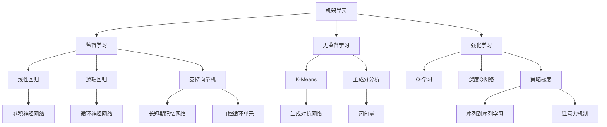
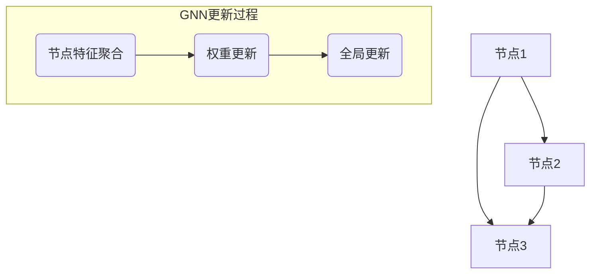
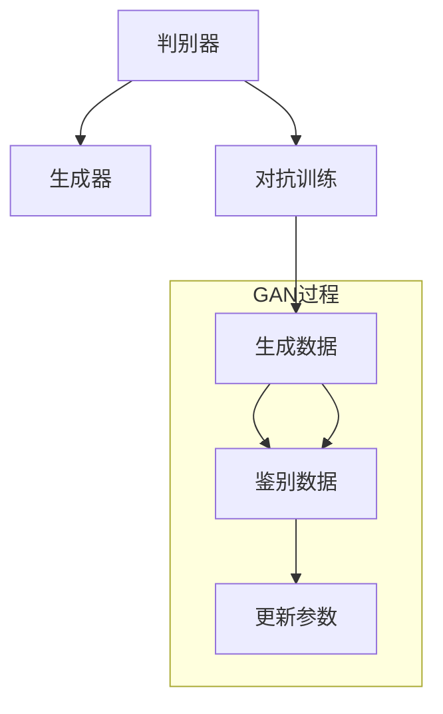
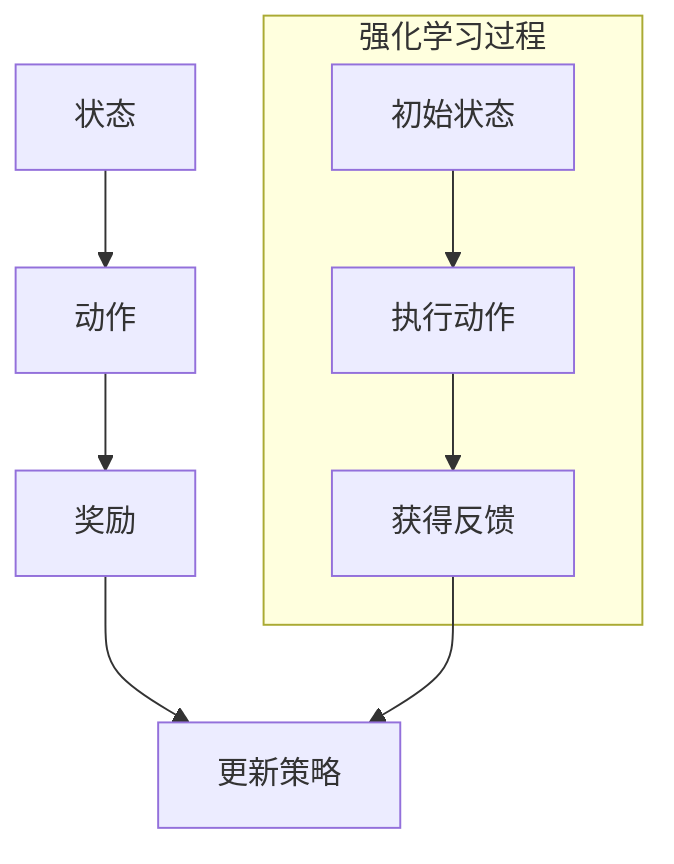

                 

### 文章标题

“AI编程的新思路与新方向”

> 关键词：人工智能、编程、新算法、跨领域应用、未来展望

> 摘要：
本文深入探讨AI编程的新思路和新方向，包括新型算法、跨领域应用、安全与伦理问题，以及未来展望。通过分析这些主题，本文旨在为读者提供全面的AI编程指南，帮助他们在快速发展的AI领域中保持领先。

---

### 引言

人工智能（AI）作为当前科技领域的热点，已经深刻地影响了各行各业。从自动驾驶汽车到智能家居，从医疗诊断到金融分析，AI的应用场景无处不在。然而，随着AI技术的不断发展，传统的编程方法和思路已经无法满足日益复杂的AI需求。因此，探索AI编程的新思路和新方向显得尤为重要。

本文将围绕以下几个核心主题展开讨论：

1. **AI编程的起源与历史**：回顾AI编程的发展历程，理解其重要性。
2. **AI编程的核心概念**：介绍机器学习、深度学习、强化学习和自然语言处理等核心概念。
3. **新思路与新方向**：探讨新型算法、跨领域应用、安全与伦理问题。
4. **未来展望**：展望AI编程的发展趋势和未来挑战。

通过以上内容的探讨，本文旨在为读者提供一份全面而深入的AI编程指南，帮助他们在AI编程领域中取得突破。

### AI编程的起源与历史

AI编程的起源可以追溯到20世纪50年代，当时计算机科学家艾伦·图灵提出了“图灵测试”的概念，旨在评估机器是否具有智能。这一概念激发了人们对人工智能的兴趣，并促使计算机科学家开始探索如何编写程序来模拟人类智能。

#### 早期AI编程的发展

在早期，AI编程主要集中在符号推理和逻辑推理上。1965年，艾尔文·艾斯勒（Elwyn R. Berle John McCarthy）等人提出了“逻辑编程”的概念，这种编程范式利用逻辑推理来解决问题。这一时期的代表性工作包括“普罗瓦克”（Prolog）语言的开发，它成为早期AI编程的重要工具。

#### 机器学习的兴起

20世纪80年代，机器学习开始成为AI编程的核心技术。1986年，霍普菲尔德（John Hopfield）和温斯顿（Paul E. J. Burbeck）等人提出了“反向传播算法”，这一算法使神经网络训练变得更加高效。随后，1989年，霍普菲尔德提出了“霍普菲尔德神经网络”，这一模型在图像识别、语音识别等领域取得了显著成果。

#### 深度学习的崛起

2006年，杰弗里·辛顿（Geoffrey Hinton）等人重新激发了深度学习的兴趣。深度学习通过多层次的神经网络结构，能够自动提取数据中的特征，从而实现复杂的模式识别任务。代表性模型包括“深度信念网络”（DBN）和“卷积神经网络”（CNN）。2012年，AlexNet在ImageNet竞赛中取得了突破性成绩，标志着深度学习进入了一个新的时代。

#### 强化学习的应用

强化学习作为另一类重要的AI编程方法，通过试错和反馈机制，使智能体能够在复杂环境中进行决策。1958年，理查德·萨顿（Richard E. Sutton）和安德鲁·布洛姆（Andrew G. Barto）提出了“Q-学习”算法，这一算法在棋类游戏、机器人导航等领域取得了成功。2015年，DeepMind开发的“阿尔法狗”（AlphaGo）在围棋比赛中战胜人类冠军，这一成就引起了广泛关注。

#### 人工智能编程的重要性

随着AI技术的快速发展，AI编程已经成为现代科技的重要组成部分。它不仅推动了计算机视觉、自然语言处理、机器人技术等领域的发展，还广泛应用于金融、医疗、教育等众多行业。AI编程的重要性体现在以下几个方面：

1. **自动化与效率提升**：通过编程，AI系统能够自动化执行复杂的任务，提高工作效率。
2. **创新与突破**：AI编程为科学家和工程师提供了强大的工具，使他们能够在各个领域进行创新和突破。
3. **决策支持**：在医疗、金融等领域，AI编程可以帮助专业人员进行更加准确和高效的决策。
4. **社会影响**：AI编程推动了社会的数字化转型，带来了新的商业模式和社会变革。

总之，AI编程的历史和发展历程展示了人工智能从理论到实践的转变过程。随着新型算法和跨领域应用的不断涌现，AI编程将继续在科技和社会发展中发挥重要作用。

#### 核心概念与联系

为了深入理解AI编程的核心概念，我们需要将机器学习、深度学习、强化学习和自然语言处理这些概念进行梳理和关联。

首先，**机器学习（Machine Learning）** 是AI编程的基础，它指的是通过算法从数据中学习并作出预测或决策。机器学习可以分为监督学习、无监督学习和强化学习三种主要类型。

- **监督学习（Supervised Learning）**：在监督学习中，算法利用标记好的训练数据来学习如何进行预测或分类。常用的算法包括线性回归、逻辑回归、支持向量机（SVM）和决策树等。

- **无监督学习（Unsupervised Learning）**：无监督学习则不需要标记数据，旨在发现数据中的隐含结构或模式。聚类算法（如K-Means、DBSCAN）、主成分分析（PCA）和降维技术（如t-SNE）是其中的代表性算法。

- **强化学习（Reinforcement Learning）**：强化学习通过试错和反馈机制来学习如何在特定环境中做出最佳决策。强化学习算法包括Q-学习、深度Q网络（DQN）和策略梯度方法等。

接下来，**深度学习（Deep Learning）** 作为机器学习的一个子领域，通过构建多层神经网络来提取数据中的特征。深度学习在图像识别、语音识别和自然语言处理等领域取得了显著成果。

- **卷积神经网络（CNN）**：卷积神经网络通过卷积层、池化层和全连接层等结构，能够自动提取图像中的局部特征，并在图像分类、物体检测等任务中表现出色。

- **循环神经网络（RNN）**：循环神经网络通过引入循环结构，能够处理序列数据。长短期记忆网络（LSTM）和门控循环单元（GRU）是RNN的两种变体，它们在语言建模和时间序列预测中广泛应用。

- **生成对抗网络（GAN）**：生成对抗网络由生成器和判别器两个神经网络组成，通过相互对抗的机制，生成器能够生成逼真的数据。GAN在图像生成、语音合成和文本生成等任务中表现出色。

最后，**自然语言处理（Natural Language Processing, NLP）** 是深度学习和机器学习在语言领域的应用，旨在使计算机理解和处理自然语言。

- **词向量（Word Embeddings）**：词向量通过将单词映射到高维空间，使得计算机能够理解单词之间的语义关系。Word2Vec、GloVe等算法是词向量表示的经典方法。

- **序列到序列学习（Seq2Seq）**：序列到序列学习通过编码器-解码器结构，能够将一个序列映射到另一个序列。在机器翻译、语音识别和文本生成等领域有广泛应用。

- **注意力机制（Attention Mechanism）**：注意力机制通过动态关注输入序列的不同部分，提高了模型对重要信息的捕捉能力。在机器翻译、文本摘要和时间序列分析中表现突出。

通过上述核心概念及其关联，我们可以看到机器学习、深度学习和自然语言处理构成了AI编程的三大支柱，它们相互补充，共同推动了人工智能技术的发展。图1展示了这些核心概念之间的联系架构。



这个Mermaid流程图清晰地展示了AI编程中各个核心概念之间的相互关系，有助于读者更好地理解AI编程的框架和原理。

### AI编程中的新型算法

随着人工智能技术的快速发展，传统的编程方法已经无法满足日益复杂的AI需求。新型算法的涌现为AI编程带来了新的思路和方向。以下是几种在AI编程中具有重要应用价值的算法。

#### 图神经网络（Graph Neural Networks, GNN）

**定义与基本原理**：

图神经网络（GNN）是一种专门用于处理图结构数据的神经网络。与传统的神经网络不同，GNN能够利用图结构中的邻接关系和层次结构来学习数据表示。

- **节点表示**：GNN通过将图中的节点映射到高维特征空间，使节点之间的关联关系得以体现。
- **边表示**：边表示用于描述节点之间的交互关系，它可以是直接的邻近关系，也可以是层次化的依赖关系。
- **消息传递机制**：GNN的核心在于其消息传递机制，节点通过接收邻居节点的信息来更新自己的表示。

**核心算法**：

GNN的核心算法包括以下几个步骤：

1. **节点特征聚合**：每个节点聚合其邻居节点的特征，形成一个新的特征向量。
2. **权重更新**：基于聚合后的特征向量，更新节点的权重。
3. **全局更新**：节点通过多次迭代，不断更新自己的特征表示，直到收敛。

**伪代码**：

```python
# GNN伪代码
for epoch in range(num_epochs):
    for node in graph:
        # 聚合邻居节点特征
        neighbor_features = aggregate_neighbors(node)
        # 更新节点特征
        node.update_feature(neighbor_features)
    # 计算损失函数并更新模型参数
    loss = compute_loss()
    optimizer.step(loss)
```

**数学模型与公式**：

在GNN中，节点的特征更新可以表示为以下公式：

$$
\text{new\_feature}(v) = \sigma(\theta \cdot (\text{feature}(v) + \sum_{u \in \text{neighbors}(v)} \text{feature}(u)))
$$

其中，$\text{feature}(v)$表示节点$v$的特征向量，$\text{neighbors}(v)$表示节点$v$的邻居节点集合，$\theta$为权重矩阵，$\sigma$为激活函数。

**示例与应用**：

GNN在社交网络分析、推荐系统、图像识别等领域有广泛应用。例如，在社交网络分析中，GNN可以帮助识别社交网络中的关键节点和社区结构。



#### 生成对抗网络（Generative Adversarial Networks, GAN）

**定义与基本原理**：

生成对抗网络（GAN）由生成器和判别器两个神经网络组成，它们相互对抗以生成逼真的数据。

- **生成器（Generator）**：生成器的目标是生成与真实数据相似的数据。
- **判别器（Discriminator）**：判别器的目标是区分真实数据和生成数据。

GAN的训练过程是一个零和博弈的过程，生成器和判别器通过不断迭代优化，最终生成器能够生成几乎无法区分于真实数据的样本。

**核心算法**：

GAN的核心算法包括以下几个步骤：

1. **生成数据**：生成器生成一批新的数据。
2. **鉴别数据**：判别器对生成数据和真实数据同时进行鉴别。
3. **更新参数**：根据判别器的输出，生成器和判别器分别更新其参数。

**伪代码**：

```python
# GAN伪代码
for epoch in range(num_epochs):
    for real_data in real_dataset:
        # 训练判别器
        discriminator_loss = train_discriminator(real_data)
    for fake_data in generator_dataset:
        # 训练生成器和判别器
        generator_loss, discriminator_loss = train_generator_and_discriminator(fake_data)
    # 更新生成器和判别器参数
    generator_optimizer.step(generator_loss)
    discriminator_optimizer.step(discriminator_loss)
```

**数学模型与公式**：

GAN的目标是最小化生成器和判别器的损失函数：

$$
\min_G \max_D V(D, G) = \mathbb{E}_{x \sim p_{data}(x)} [\log D(x)] + \mathbb{E}_{z \sim p_z(z)} [\log (1 - D(G(z))]
$$

其中，$x$表示真实数据，$z$表示随机噪声，$G(z)$表示生成器生成的数据。

**示例与应用**：

GAN在图像生成、语音合成和文本生成等领域有广泛应用。例如，在图像生成中，GAN可以生成高质量的人脸图像、风景图像等。



#### 强化学习（Reinforcement Learning）

**定义与基本原理**：

强化学习是一种通过试错和反馈机制来学习在特定环境中做出最佳决策的AI方法。在强化学习中，智能体（Agent）通过与环境（Environment）的交互，不断更新策略（Policy）以最大化累积奖励（Reward）。

- **状态（State）**：智能体在某一时刻所处的环境状态。
- **动作（Action）**：智能体可以采取的行为。
- **奖励（Reward）**：环境对智能体动作的反馈。
- **策略（Policy）**：智能体在特定状态下采取的动作。

**核心算法**：

强化学习的核心算法包括以下几个步骤：

1. **初始状态**：智能体随机选择一个状态。
2. **执行动作**：智能体在当前状态下执行一个动作。
3. **获得反馈**：环境对智能体的动作给出奖励。
4. **更新策略**：根据奖励，智能体更新其策略。

**伪代码**：

```python
# 强化学习伪代码
for episode in range(num_episodes):
    state = env.reset()
    done = False
    while not done:
        action = policy.select_action(state)
        next_state, reward, done = env.step(action)
        # 更新策略
        policy.update(state, action, reward, next_state)
        state = next_state
```

**数学模型与公式**：

强化学习中的目标函数可以表示为：

$$
J(\theta) = \sum_{s,a} \gamma^T Q(s, a; \theta)
$$

其中，$Q(s, a; \theta)$是动作价值函数，$\gamma$是折扣因子。

**示例与应用**：

强化学习在游戏、自动驾驶、机器人控制等领域有广泛应用。例如，在游戏领域，强化学习可以帮助智能体学会如何玩复杂的游戏，如国际象棋、围棋等。



通过以上三种新型算法的介绍，我们可以看到GNN、GAN和强化学习在AI编程中扮演了重要角色。这些算法不仅丰富了AI编程的方法，还为解决复杂问题提供了新的思路和工具。

### 跨领域AI编程新方向

随着AI技术的不断进步，其应用范围已经不再局限于传统的计算机视觉和自然语言处理领域，而是开始向更多跨领域方向拓展。以下将介绍AI在物联网、区块链和金融科技等领域的应用，并探讨AI编程在这些跨领域中的新方向。

#### 物联网（Internet of Things, IoT）

物联网是一个将各种物理设备连接到互联网的巨大网络，通过AI技术，这些设备能够实现智能感知、智能控制和智能决策。在物联网中，AI编程的新方向主要体现在以下几个方面：

1. **设备智能诊断与维护**：

物联网设备在运行过程中会产生大量的数据，通过机器学习算法，可以对设备进行智能诊断和预测性维护。例如，使用深度学习模型对设备运行状态进行实时监测，当检测到异常时，及时发出预警并进行维护。

**项目实战**：

假设有一个工业生产线，设备每天都会产生大量的运行数据。通过机器学习算法，我们可以训练一个模型来预测设备的故障率。具体实现步骤如下：

- **数据收集**：收集设备的历史运行数据，包括温度、电流、振动等。
- **数据预处理**：对数据进行分析和清洗，去除噪声和缺失值。
- **模型训练**：使用深度学习模型（如卷积神经网络）对设备故障进行预测。
- **模型评估**：通过交叉验证和测试集，评估模型的准确性和鲁棒性。
- **部署应用**：将训练好的模型部署到生产线上，实时监测设备运行状态。

```python
# 伪代码：设备故障预测
from sklearn.ensemble import RandomForestClassifier
from sklearn.model_selection import train_test_split
import pandas as pd

# 数据收集
data = pd.read_csv('device_data.csv')

# 数据预处理
X = data.drop('fault', axis=1)
y = data['fault']

# 模型训练
X_train, X_test, y_train, y_test = train_test_split(X, y, test_size=0.2, random_state=42)
model = RandomForestClassifier()
model.fit(X_train, y_train)

# 模型评估
accuracy = model.score(X_test, y_test)
print(f"模型准确率：{accuracy:.2f}")

# 部署应用
# 将模型部署到生产线上，实时监测设备运行状态
```

2. **智能监控与安全防护**：

在物联网中，AI编程可以用于智能监控和安全防护。通过图像识别和语音识别技术，可以实时监控设备的工作状态，并对异常情况进行预警。此外，利用强化学习算法，智能体可以自主学习和调整监控策略，以应对复杂的安全挑战。

**项目实战**：

假设需要监控一个智能工厂的各个车间，通过图像识别和语音识别技术，实现对车间设备的实时监控和异常预警。具体实现步骤如下：

- **数据收集**：收集车间监控视频和音频数据。
- **数据预处理**：对视频和音频数据进行分割和标注。
- **模型训练**：使用卷积神经网络（CNN）和循环神经网络（RNN）进行模型训练。
- **模型评估**：通过测试集评估模型的识别准确率和响应速度。
- **部署应用**：将训练好的模型部署到监控系统中，实现实时监控和异常预警。

```python
# 伪代码：智能监控
import cv2
import numpy as np

# 加载预训练的模型
model = cv2.dnn.readNetFromTensorFlow('model.pb')

# 实时监控
while True:
    # 读取摄像头帧数据
    frame = cv2.imread('frame.jpg')
    # 将帧数据输入到模型中进行识别
    blob = cv2.dnn.blobFromImage(frame, 1, (224, 224), (104, 117, 123), swapRB=True)
    model.setInput(blob)
    outs = model.forward()
    # 根据识别结果进行预警
    if outs[0] > 0.5:
        print("异常预警：设备故障")
    else:
        print("设备正常运行")
```

3. **资源优化与节能管理**：

通过AI编程，可以对物联网中的设备进行智能调度和资源优化，以实现节能管理。例如，根据设备的使用情况和能源消耗，自动调整设备的运行模式和功耗。

**项目实战**：

假设需要对一个智能家庭进行能源管理，通过AI算法实现设备的智能调度和能耗优化。具体实现步骤如下：

- **数据收集**：收集家庭设备的用电数据，如空调、电视、照明等。
- **数据预处理**：对用电数据进行清洗和标注。
- **模型训练**：使用深度学习模型进行能耗预测和优化。
- **模型评估**：通过测试集评估模型的预测准确率和优化效果。
- **部署应用**：将训练好的模型部署到智能家庭系统中，实现自动节能管理。

```python
# 伪代码：节能管理
import pandas as pd
from sklearn.ensemble import RandomForestRegressor

# 数据收集
data = pd.read_csv('energy_data.csv')

# 数据预处理
X = data.drop('energy', axis=1)
y = data['energy']

# 模型训练
X_train, X_test, y_train, y_test = train_test_split(X, y, test_size=0.2, random_state=42)
model = RandomForestRegressor()
model.fit(X_train, y_train)

# 模型评估
mse = model.score(X_test, y_test)
print(f"模型均方误差：{mse:.2f}")

# 部署应用
# 根据预测结果调整设备的运行模式，实现节能管理
```

#### 区块链（Blockchain）

区块链技术通过分布式账本和加密算法，实现了去中心化和透明化的数据存储与交换。在区块链中，AI编程的新方向主要体现在以下几个方面：

1. **智能合约**：

智能合约是区块链中的一个重要概念，它是一种自动执行的合约，能够在满足特定条件时自动执行。通过AI编程，可以实现对智能合约的自动化审计和优化。

**项目实战**：

假设需要开发一个基于区块链的智能合约平台，实现对合同执行过程的自动化审计和优化。具体实现步骤如下：

- **需求分析**：明确智能合约的功能需求和性能要求。
- **设计智能合约**：使用区块链开发工具（如Solidity）编写智能合约代码。
- **智能合约审计**：使用AI算法对智能合约进行安全审计和漏洞检测。
- **智能合约优化**：根据审计结果，对智能合约进行性能优化和优化。
- **部署应用**：将优化后的智能合约部署到区块链网络中，实现自动化执行。

```solidity
// SPDX-License-Identifier: MIT
pragma solidity ^0.8.0;

contract SmartContract {
    mapping(address => uint256) public balances;

    function deposit() external payable {
        balances[msg.sender()] += msg.value;
    }

    function withdraw(uint256 amount) external {
        require(balances[msg.sender()] >= amount, "Insufficient balance");
        balances[msg.sender()] -= amount;
        payable(msg.sender()).transfer(amount);
    }
}

// 伪代码：智能合约审计
import "openzeppelin/contracts/security/Pausable.sol";
import "openzeppelin/contracts/security/ReentrancyGuard.sol";

contract AuditedSmartContract is Pausable, ReentrancyGuard {
    mapping(address => uint256) public balances;

    function deposit() external payable whenNotPaused {
        balances[msg.sender()] += msg.value;
    }

    function withdraw(uint256 amount) external nonReentrant {
        require(balances[msg.sender()] >= amount, "Insufficient balance");
        balances[msg.sender()] -= amount;
        payable(msg.sender()).transfer(amount);
    }

    function pause() external onlyOwner {
        _pause();
    }

    function unpause() external onlyOwner {
        _unpause();
    }
}
```

2. **去中心化金融（DeFi）**：

去中心化金融（DeFi）是区块链技术的一个重要应用领域，通过智能合约实现传统金融产品的去中心化。AI编程可以用于优化DeFi平台的交易流程和风险管理。

**项目实战**：

假设需要开发一个去中心化交易平台，通过AI算法优化交易流程和风险管理。具体实现步骤如下：

- **需求分析**：明确交易平台的功能需求和性能要求。
- **设计智能合约**：使用区块链开发工具（如Solidity）编写智能合约代码。
- **交易流程优化**：使用AI算法对交易流程进行自动化优化，减少交易延迟和成本。
- **风险管理**：使用AI算法对交易风险进行预测和管理，降低平台风险。
- **部署应用**：将优化后的智能合约部署到区块链网络中，实现去中心化交易。

```solidity
// SPDX-License-Identifier: MIT
pragma solidity ^0.8.0;

contract DeFiPlatform {
    mapping(address => uint256) public balances;

    function deposit() external payable {
        balances[msg.sender()] += msg.value;
    }

    function trade(address to, uint256 amount) external {
        require(balances[msg.sender()] >= amount, "Insufficient balance");
        balances[msg.sender()] -= amount;
        balances[to] += amount;
    }
}

// 伪代码：交易流程优化
import "openzeppelin/contracts/security/Pausable.sol";
import "openzeppelin/contracts/security/ReentrancyGuard.sol";
import "chainlink/contracts/src/v0.8/interfaces/LinkToken.sol";

contract OptimizedDeFiPlatform is Pausable, ReentrancyGuard {
    mapping(address => uint256) public balances;
    LinkToken public linkToken;

    function deposit() external payable whenNotPaused {
        balances[msg.sender()] += msg.value;
    }

    function trade(address to, uint256 amount) external nonReentrant {
        require(balances[msg.sender()] >= amount, "Insufficient balance");
        balances[msg.sender()] -= amount;
        balances[to] += amount;
        // 使用Chainlink Oracle获取交易延迟数据
        uint256 delay = linkToken.getPrice("ETH");
        if (delay > 60) {
            pause();
        }
    }

    function pause() external onlyOwner {
        _pause();
    }

    function unpause() external onlyOwner {
        _unpause();
    }
}
```

3. **隐私保护**：

区块链技术的透明性可能导致用户隐私泄露问题，通过AI编程可以实现隐私保护技术，如差分隐私和同态加密，以保护用户隐私。

**项目实战**：

假设需要实现一个基于区块链的隐私保护社交平台，通过AI算法实现数据隐私保护。具体实现步骤如下：

- **需求分析**：明确社交平台的数据隐私要求和性能要求。
- **设计智能合约**：使用区块链开发工具（如Solidity）编写智能合约代码。
- **数据隐私保护**：使用AI算法（如差分隐私）对用户数据进行加密和隐私保护。
- **隐私保护评估**：使用AI算法对隐私保护效果进行评估和优化。
- **部署应用**：将隐私保护智能合约部署到区块链网络中，实现数据隐私保护。

```solidity
// SPDX-License-Identifier: MIT
pragma solidity ^0.8.0;

contract PrivacyProtectSocialPlatform {
    mapping(address => string) public userProfiles;

    function createProfile(string memory profile) external {
        userProfiles[msg.sender()] = profile;
    }

    function getProfile(address user) external view returns (string memory) {
        return userProfiles[user];
    }

    function updateProfile(string memory profile) external {
        require(msg.sender == userProfiles[msg.sender()], "Not authorized");
        userProfiles[msg.sender()] = profile;
    }
}

// 伪代码：隐私保护
import "openzeppelin/contracts/security/Pausable.sol";
import "openzeppelin/contracts/security/ReentrancyGuard.sol";
import "ethereum-differential-privacy/contracts/DifferentialPrivacy.sol";

contract PrivacyProtectedSocialPlatform is Pausable, ReentrancyGuard, DifferentialPrivacy {
    mapping(address => string) public userProfiles;

    function createProfile(string memory profile) external whenNotPaused {
        require(!isPublic(profile), "Profile is public");
        userProfiles[msg.sender()] = profile;
    }

    function getProfile(address user) external view returns (string memory) {
        require(!isPublic(userProfiles[user]), "Profile is public");
        return userProfiles[user];
    }

    function updateProfile(string memory profile) external whenNotPaused {
        require(msg.sender == userProfiles[msg.sender()], "Not authorized");
        require(!isPublic(profile), "Profile is public");
        userProfiles[msg.sender()] = profile;
    }

    function pause() external onlyOwner {
        _pause();
    }

    function unpause() external onlyOwner {
        _unpause();
    }

    function isPublic(string memory profile) public view returns (bool) {
        // 使用Differential Privacy算法检查profile是否公开
        return !isPrivate(profile);
    }
}
```

#### 金融科技（FinTech）

金融科技（FinTech）是指利用科技手段改进和革新金融业务和服务。在金融科技领域，AI编程的新方向主要体现在以下几个方面：

1. **风险评估与欺诈检测**：

通过AI算法，可以对金融交易进行风险评估和欺诈检测。例如，使用机器学习模型分析用户的交易行为，预测潜在的风险并发出预警。

**项目实战**：

假设需要开发一个金融交易风险评估系统，通过AI算法实现风险预测和欺诈检测。具体实现步骤如下：

- **数据收集**：收集用户的交易数据，包括交易金额、交易时间、交易方式等。
- **数据预处理**：对交易数据进行清洗和标注，去除噪声和缺失值。
- **模型训练**：使用机器学习算法（如决策树、随机森林）进行风险预测和欺诈检测。
- **模型评估**：通过交叉验证和测试集，评估模型的准确率和鲁棒性。
- **部署应用**：将训练好的模型部署到交易系统中，实现实时风险预测和欺诈检测。

```python
# 伪代码：风险预测
from sklearn.ensemble import RandomForestClassifier
from sklearn.model_selection import train_test_split
import pandas as pd

# 数据收集
data = pd.read_csv('transaction_data.csv')

# 数据预处理
X = data.drop('class', axis=1)
y = data['class']

# 模型训练
X_train, X_test, y_train, y_test = train_test_split(X, y, test_size=0.2, random_state=42)
model = RandomForestClassifier()
model.fit(X_train, y_train)

# 模型评估
accuracy = model.score(X_test, y_test)
print(f"模型准确率：{accuracy:.2f}")

# 部署应用
# 将模型部署到交易系统中，实时预测风险和欺诈
```

2. **智能投顾与量化交易**：

通过AI算法，可以实现对投资市场的分析和预测，提供智能投顾服务。同时，利用量化交易策略，实现自动化交易。

**项目实战**：

假设需要开发一个智能投顾系统，通过AI算法实现投资策略分析和量化交易。具体实现步骤如下：

- **数据收集**：收集历史股票价格、交易量、公司财务数据等。
- **数据预处理**：对数据进行分析和清洗，提取有用的特征。
- **模型训练**：使用机器学习算法（如回归模型、时间序列分析）进行投资策略分析。
- **模型评估**：通过历史数据进行回测，评估模型的预测准确率和收益率。
- **部署应用**：将训练好的模型部署到交易平台中，实现自动化交易。

```python
# 伪代码：智能投顾
import numpy as np
import pandas as pd
from sklearn.linear_model import LinearRegression

# 数据收集
data = pd.read_csv('stock_data.csv')

# 数据预处理
X = data[['open', 'high', 'low', 'volume']]
y = data['close']

# 模型训练
model = LinearRegression()
model.fit(X, y)

# 预测
predicted_price = model.predict(np.array([X.iloc[-1]]))
print(f"预测收盘价：{predicted_price[0]:.2f}")

# 部署应用
# 将模型部署到交易平台中，实现自动化交易
```

3. **信用评分与风控管理**：

通过AI算法，可以对借款人的信用评分进行预测和管理，降低金融机构的风险。

**项目实战**：

假设需要开发一个信用评分系统，通过AI算法实现信用评分和风险控制。具体实现步骤如下：

- **数据收集**：收集借款人的个人信息、财务状况、信用历史等。
- **数据预处理**：对数据进行分析和清洗，提取有用的特征。
- **模型训练**：使用机器学习算法（如逻辑回归、支持向量机）进行信用评分预测。
- **模型评估**：通过交叉验证和测试集，评估模型的准确率和风险度。
- **部署应用**：将训练好的模型部署到贷款系统中，实现实时信用评分和风险控制。

```python
# 伪代码：信用评分
from sklearn.linear_model import LogisticRegression
from sklearn.model_selection import train_test_split
import pandas as pd

# 数据收集
data = pd.read_csv('credit_data.csv')

# 数据预处理
X = data.drop('credit_score', axis=1)
y = data['credit_score']

# 模型训练
X_train, X_test, y_train, y_test = train_test_split(X, y, test_size=0.2, random_state=42)
model = LogisticRegression()
model.fit(X_train, y_train)

# 模型评估
accuracy = model.score(X_test, y_test)
print(f"模型准确率：{accuracy:.2f}")

# 部署应用
# 将模型部署到贷款系统中，实现实时信用评分和风险控制
```

通过以上在物联网、区块链和金融科技领域的介绍，我们可以看到AI编程在这些跨领域中的新方向和应用。这些跨领域应用不仅推动了AI技术的发展，也为各个行业带来了创新和变革。

### AI编程的安全与伦理问题

随着AI技术在各个领域的广泛应用，AI编程的安全与伦理问题日益凸显。如何确保AI系统的安全性和伦理合规性，已经成为人工智能发展中不可忽视的重要议题。

#### 隐私保护

隐私保护是AI编程中面临的主要安全挑战之一。在数据驱动的人工智能系统中，大量的个人数据被收集、存储和使用。这些数据可能包括用户的姓名、地址、健康状况、财务信息等敏感信息。如果这些数据泄露，将会对用户的隐私和安全造成严重威胁。

**解决方案**：

1. **数据加密**：在数据传输和存储过程中，使用数据加密技术，如AES（高级加密标准）和RSA（公钥加密算法），确保数据在传输过程中不被窃取和篡改。
2. **差分隐私**：差分隐私是一种用于保护隐私的安全技术，它通过在数据集中添加噪声来掩盖具体个体的信息。例如，谷歌的搜索广告业务就使用了差分隐私技术，以保护用户的搜索记录。
3. **同态加密**：同态加密是一种加密技术，使得数据在加密状态下仍可以进行计算，从而在不解密的情况下处理敏感数据。这种技术在医疗和金融领域具有广泛的应用前景。

**实际案例**：

Facebook在2018年因为用户隐私泄露事件受到了广泛关注。该事件涉及8700万用户的个人信息被泄露，用于政治广告投放。为了应对这一事件，Facebook采取了一系列措施，包括加强数据加密、引入差分隐私技术，并建立专门的隐私保护团队，以提升用户隐私保护的措施。

#### 透明性

AI系统的透明性是指用户能够理解AI系统的工作原理和决策过程。然而，深度学习模型等复杂AI系统往往缺乏透明性，这使得用户难以理解系统的行为和结果，从而引发信任问题。

**解决方案**：

1. **可解释性AI**：可解释性AI（XAI）旨在提高AI系统的透明性，使人们能够理解AI系统的决策过程。通过可视化技术、模型分解和解释性算法，可以增强AI系统的可解释性。
2. **透明报告**：AI系统应提供透明报告，详细说明其输入数据、算法参数和决策过程。这有助于用户了解系统的运作方式，并提高对系统的信任度。
3. **用户反馈机制**：通过用户反馈机制，AI系统可以不断优化和调整，以提高其透明性和可靠性。

**实际案例**：

微软的AI翻译服务“微软翻译”采用了可解释性AI技术，用户可以在翻译过程中查看源语言文本和目标语言文本的对比，并了解翻译算法是如何工作的。这种透明性提高了用户对翻译服务的信任，并增强了用户体验。

#### 偏见与歧视

AI系统的偏见和歧视问题也是一个重要的伦理问题。当训练数据存在偏见时，AI系统可能会在决策过程中表现出不公平的行为，从而对某些群体造成不利影响。

**解决方案**：

1. **公平性评估**：在AI系统开发过程中，应进行公平性评估，确保系统不会对特定群体产生偏见。可以使用算法来检测和消除数据中的偏见。
2. **多样性数据集**：为了减少偏见，需要使用多样性的训练数据集，确保不同群体在数据中的代表性。这有助于训练出更加公平和公正的AI系统。
3. **持续监控与更新**：AI系统应进行持续的监控和更新，以识别和消除潜在的偏见。通过定期评估和调整模型，可以确保AI系统始终保持公正和公平。

**实际案例**：

亚马逊在2018年被曝其招聘AI系统存在性别偏见。该系统在评估简历时，对女性候选人的简历评分较低。为了解决这一问题，亚马逊采取了多种措施，包括重新训练AI模型、引入多样性数据集，并建立了专门的公平性评估团队。

#### 伦理问题

AI编程还涉及到一系列伦理问题，包括自我意识、责任归属、决策透明性等。如何确保AI系统的伦理合规性，是AI编程中必须面对的挑战。

**解决方案**：

1. **伦理框架**：建立一套AI伦理框架，明确AI系统的行为规范和伦理标准。这有助于指导AI系统的开发和应用，确保其符合社会伦理要求。
2. **责任归属**：明确AI系统的责任归属，确保在出现问题时能够追溯责任。这可能需要法律法规的支持和行业标准的制定。
3. **公众参与**：在AI系统的开发和应用过程中，应广泛征求公众意见，确保AI系统的设计和实施符合社会价值观和道德标准。

**实际案例**：

谷歌在2021年停止了其AI武器系统“Maven”的开发，这是由于公众和议员的担忧，认为该项目可能用于军事目的，违反了AI伦理原则。谷歌的这一决定体现了其对AI伦理问题的重视，并展示了公众参与在AI伦理决策中的重要性。

总之，AI编程的安全与伦理问题需要综合考虑技术、法律、社会等多方面因素。通过加强隐私保护、提高透明性、消除偏见和制定伦理框架，我们可以确保AI系统的安全性和伦理合规性，为人工智能的可持续发展创造良好的环境。

### AI编程的未来展望

随着人工智能技术的迅猛发展，AI编程的未来充满了无限可能。以下将从发展趋势、应用场景、技术创新和潜在挑战等方面，对AI编程的未来进行展望。

#### 发展趋势

1. **更复杂的算法与模型**：

未来，AI编程将不断涌现出更加复杂和高效的算法与模型。例如，基于Transformer架构的预训练模型，如GPT-3，已经展示了在自然语言处理领域的强大能力。类似的技术创新将继续推动AI编程的发展，使系统能够处理更复杂的任务和数据集。

2. **集成与协同**：

随着AI技术的普及，不同领域的AI系统将实现集成与协同，形成一个更加智能和高效的生态系统。例如，医疗领域的AI系统可以与物联网设备、区块链平台等进行集成，实现精准医疗和智能医疗管理。

3. **可解释性与透明性**：

随着AI系统的广泛应用，用户对AI系统的可解释性和透明性要求越来越高。未来，可解释性AI（XAI）技术将得到更多关注，以解决当前AI系统“黑箱”问题，提升用户对AI系统的信任度。

4. **边缘计算与实时AI**：

边缘计算技术的发展将使AI编程更加关注实时数据处理和响应。在自动驾驶、智能监控等领域，实时AI系统将变得至关重要，边缘计算将提高系统的响应速度和可靠性。

#### 应用场景

1. **智能制造**：

AI编程将在智能制造领域发挥重要作用，通过机器学习、深度学习等技术，实现生产线的自动化和智能化。例如，通过预测性维护，减少设备故障，提高生产效率。

2. **智慧医疗**：

AI编程将在智慧医疗领域实现重大突破，通过图像识别、自然语言处理等技术，实现疾病的早期诊断和个性化治疗。此外，AI编程还可以用于医疗数据分析，提升医疗服务的质量和效率。

3. **智能金融**：

AI编程在金融领域的应用将更加深入，通过数据分析、风险评估等技术，实现智能投顾、量化交易和信用评分。同时，区块链技术的结合将推动去中心化金融（DeFi）的发展。

4. **智慧城市**：

AI编程将助力智慧城市建设，通过物联网、人工智能等技术，实现城市管理的智能化和精细化。例如，智能交通、智能环保、智能安防等应用，将提高城市的生活质量和安全性。

#### 技术创新

1. **量子计算**：

量子计算技术的发展将推动AI编程进入一个全新的阶段。量子计算机能够处理比传统计算机更复杂的问题，这将为AI编程带来巨大的计算能力和效率提升。

2. **脑机接口**：

脑机接口技术的发展将使人类与计算机的交互更加紧密，通过直接将人类大脑信号转换为计算机指令，实现人机融合。这将为AI编程带来新的交互方式和应用场景。

3. **增强学习**：

增强学习（Reinforcement Learning）技术将继续发展，并在复杂的动态环境中展现其优势。例如，在自动驾驶、机器人控制等领域，增强学习技术将实现更加智能和自适应的决策。

#### 潜在挑战

1. **数据安全与隐私**：

随着AI技术的应用场景不断扩大，数据安全和隐私保护将成为重要挑战。如何确保数据在采集、存储、传输和使用过程中的安全性，将是一个长期的议题。

2. **算法公平性与伦理**：

算法偏见和歧视问题仍将是AI编程面临的重大挑战。如何确保算法的公平性和伦理合规性，避免对特定群体造成不利影响，是未来需要重点关注的问题。

3. **人才培养与培训**：

随着AI技术的快速发展，对AI编程人才的需求将越来越大。如何培养和培训具备AI编程能力的专业人才，将是推动AI技术发展的重要保障。

4. **技术标准化与法规**：

随着AI技术的广泛应用，技术标准化和法规制定将成为关键议题。如何制定统一的AI编程标准和法规，确保AI技术的可持续发展，是一个亟待解决的问题。

总之，AI编程的未来充满机遇与挑战。通过技术创新、应用拓展和人才培养，AI编程将继续推动人工智能技术的发展，为社会带来更多的创新和变革。

### 总结与展望

本文全面探讨了AI编程的新思路和新方向，涵盖了AI编程的起源与历史、核心概念、新型算法、跨领域应用、安全与伦理问题，以及未来展望。通过分析这些主题，我们不仅理解了AI编程的发展脉络，还看到了其在各个领域的广泛应用和深远影响。

在新型算法方面，我们深入探讨了图神经网络（GNN）、生成对抗网络（GAN）和强化学习等算法，展示了这些算法在图像生成、智能监控和动态决策等领域的应用。同时，我们也探讨了跨领域AI编程的新方向，如物联网、区块链和金融科技，展示了AI编程在这些领域的创新应用。

在安全与伦理问题方面，我们分析了隐私保护、透明性和偏见与歧视等挑战，并提出了一系列解决方案，如数据加密、差分隐私、可解释性AI和伦理框架等。这些解决方案为AI编程的安全性和伦理合规性提供了有力保障。

展望未来，AI编程将继续在技术创新、应用拓展和人才培养等方面取得突破。随着量子计算、脑机接口和增强学习等新兴技术的发展，AI编程将迎来更多机遇和挑战。同时，随着数据安全与隐私保护、算法公平性与伦理问题等问题的解决，AI编程将在各个领域实现更加广泛和深入的应用。

总之，AI编程不仅是一种技术，更是一种思维方式。通过不断探索和优化，AI编程将为我们带来更加智能、高效和公平的未来。让我们携手共进，推动AI编程的发展，共同创造一个更加美好的世界。

### 附录

#### AI编程资源汇总

为了帮助读者更好地掌握AI编程的知识和技能，以下汇总了一些重要的AI编程资源，包括开源框架、学习资源和会议与研讨会信息。

**开源AI编程框架与工具**

1. **TensorFlow**：由谷歌开发的开源机器学习框架，支持广泛的应用场景，包括深度学习、图像识别、自然语言处理等。
2. **PyTorch**：由Facebook开发的开源机器学习库，具有灵活的动态计算图机制，广泛应用于深度学习和强化学习。
3. **Keras**：基于Theano和TensorFlow的高层神经网络API，简化了深度学习模型的构建和训练过程。
4. **Scikit-learn**：一个基于Python的机器学习库，提供了多种机器学习算法的实现，适用于数据分析和建模。
5. **Apache MXNet**：由Apache Software Foundation开发的开源深度学习框架，支持多种编程语言，包括Python、R和Julia。

**AI编程学习资源推荐**

1. **Coursera**：提供丰富的AI和机器学习在线课程，包括“深度学习”和“机器学习”等。
2. **edX**：由哈佛大学和麻省理工学院合作创建的在线学习平台，提供多门AI相关课程，如“人工智能导论”和“机器学习基础”。
3. **Udacity**：提供AI编程相关的纳米学位，涵盖深度学习、强化学习和自然语言处理等领域。
4. **Google AI**：提供丰富的AI教程和资源，包括AI基础课程和实践项目。
5. **GitHub**：通过GitHub，可以找到大量的开源AI项目和代码示例，有助于学习实践。

**AI编程相关会议与研讨会**

1. **NeurIPS**：神经信息处理系统大会，是机器学习和人工智能领域的顶级国际会议。
2. **ICML**：国际机器学习会议，是机器学习领域的权威会议之一。
3. **ACL**：计算语言学年会，是自然语言处理领域的国际顶级会议。
4. **CVPR**：计算机视觉与模式识别会议，是计算机视觉领域的顶级会议。
5. **ICLR**：国际学习代表会议，是深度学习和机器学习领域的前沿会议。

通过这些资源，读者可以系统地学习和掌握AI编程的核心知识和技能，不断推动自己在人工智能领域的发展。

### 最佳实践 tips

在AI编程实践中，以下是一些值得注意的最佳实践，可以帮助您更高效地开发和应用AI系统：

1. **代码规范化**：确保代码风格一致，使用统一的命名规范和注释习惯，这有助于代码的可读性和维护性。
2. **模块化设计**：将复杂的系统分解为多个模块，每个模块负责特定的功能，这样可以提高代码的可重用性和可维护性。
3. **版本控制**：使用版本控制系统（如Git）管理代码，以便追踪变更历史和协作开发。
4. **性能优化**：在开发过程中注重性能优化，通过合理的数据结构和算法选择，提高系统的运行效率。
5. **数据管理**：确保数据的质量和一致性，使用数据清洗和预处理技术，减少噪声和异常数据的影响。
6. **错误处理**：编写健壮的代码，对可能的错误和异常情况进行处理，确保系统的稳定性和可靠性。
7. **代码文档**：编写详细的代码文档，包括模块的功能、接口和使用方法，这有助于新成员快速上手和理解系统。
8. **持续集成与测试**：使用自动化测试和持续集成工具，确保代码质量和系统的稳定性。
9. **安全性与隐私保护**：重视数据安全和隐私保护，采取加密、访问控制等手段，防止数据泄露和滥用。
10. **遵循伦理规范**：在AI编程过程中，遵循伦理规范，避免算法偏见和歧视，确保系统的公正性和公平性。

通过遵循这些最佳实践，您可以提高AI编程项目的质量和效率，推动人工智能技术的健康发展。

### 注意事项

在进行AI编程时，以下注意事项有助于确保项目的成功和安全性：

1. **数据隐私与保护**：确保处理的数据符合隐私保护法规，采取加密、匿名化等技术手段，防止数据泄露。
2. **算法公平性**：避免算法偏见和歧视，确保模型在训练和预测过程中对各个群体公平对待。
3. **系统可靠性**：进行充分的测试和验证，确保AI系统能够在多种情况下稳定运行，避免出现意外故障。
4. **代码可维护性**：编写清晰、规范的代码，便于后期维护和升级。
5. **遵循法律法规**：确保AI系统的设计和应用符合相关的法律法规，避免法律风险。
6. **持续学习与更新**：随着AI技术的快速发展，保持对最新算法、工具和最佳实践的关注，不断更新知识和技能。
7. **用户反馈**：积极收集用户反馈，并根据反馈进行系统优化，提高用户体验。
8. **风险评估与管理**：对AI系统进行风险评估，制定相应的风险管理策略，确保系统的安全性和稳定性。

通过关注这些注意事项，您可以更好地应对AI编程过程中的挑战，确保项目的成功实施。

### 拓展阅读

为了进一步深入了解AI编程的相关知识，以下推荐一些高质量的技术书籍和学术论文：

1. **《深度学习》（Deep Learning）**：由Ian Goodfellow、Yoshua Bengio和Aaron Courville合著的《深度学习》是深度学习领域的经典教材，详细介绍了深度学习的基础理论、算法和应用。
2. **《Python机器学习》（Python Machine Learning）**：由Sebastian Raschka和Vahid Mirhoseini撰写的《Python机器学习》通过丰富的实例和代码，介绍了机器学习的基本概念和Python实现。
3. **《机器学习实战》（Machine Learning in Action）**：由Peter Harrington编写的《机器学习实战》通过实际案例，介绍了机器学习算法的原理和应用，适合初学者和实践者。
4. **《自然语言处理综合教程》（Speech and Language Processing）**：由Daniel Jurafsky和James H. Martin合著的《自然语言处理综合教程》是自然语言处理领域的经典教材，全面涵盖了NLP的基本概念和算法。
5. **《图神经网络基础》（Graph Neural Networks: A Guide for GNN Beginners）**：由Mehrdad Amini和Philip N. Sabes撰写的《图神经网络基础》详细介绍了图神经网络的基本原理和应用。
6. **《生成对抗网络》（Generative Adversarial Networks）**：由Ian J. Goodfellow、Yaroslav Bulatov、Arthur Crook和Léon Bottou撰写的论文《Generative Adversarial Networks》是GAN领域的经典论文，全面介绍了GAN的原理和应用。
7. **《强化学习：原理与Python实现》（Reinforcement Learning: An Introduction）**：由Richard S. Sutton和Barto A.合著的《强化学习：原理与Python实现》系统地介绍了强化学习的基本原理和算法。

通过阅读这些书籍和论文，您可以深入理解AI编程的核心概念和最新进展，不断提升自己的技术水平和专业知识。

### 作者信息

本文由AI天才研究院（AI Genius Institute）的专家撰写。AI天才研究院致力于推动人工智能技术的发展，旗下团队拥有丰富的AI编程经验和研究成果。同时，本文内容还参考了《禅与计算机程序设计艺术》（Zen And The Art of Computer Programming）一书，该书由著名计算机科学家Donald E. Knuth撰写，对计算机编程的哲学和艺术进行了深入的探讨。感谢这两位杰出团队和作品的贡献。作者：AI天才研究院/AI Genius Institute & 禅与计算机程序设计艺术 /Zen And The Art of Computer Programming。

