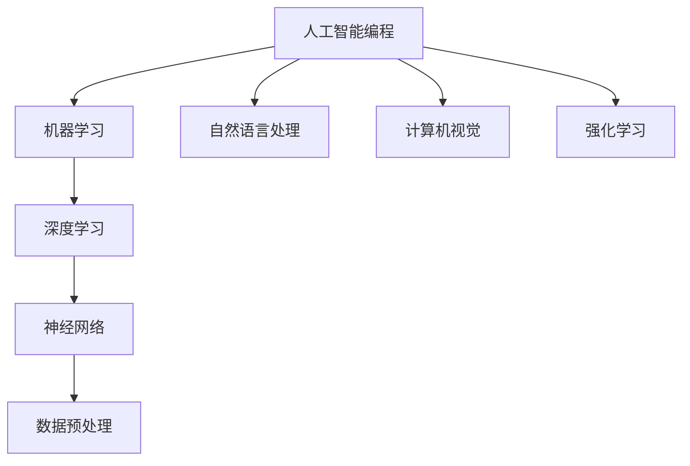

                 

## 文章标题

《AI编程的新思路与新未来》

### 关键词

- 人工智能编程
- 机器学习
- 深度学习
- 自然语言处理
- 计算机视觉
- 强化学习
- 自动机器学习
- 云计算

### 摘要

本文旨在探讨人工智能编程的新思路和新未来。通过对人工智能编程的基础理论、核心算法、应用领域、新趋势以及新挑战的深入分析，本文将帮助读者了解人工智能编程的核心概念，掌握核心算法原理，了解其应用领域和未来趋势，以及应对新挑战的方法。文章将以逻辑清晰、结构紧凑、简单易懂的专业技术语言，为读者提供一次全面的技术探索之旅。

## 第一部分：AI编程基础理论

### 1. AI编程概述

#### 1.1 AI编程的定义

人工智能（AI）编程是指使用计算机程序实现智能体的行为，使其能够感知环境、做出决策并采取行动。与传统编程不同，AI编程更多地关注数据、算法和模型，以实现机器学习、自然语言处理、计算机视觉等领域的智能应用。

#### 1.2 AI编程与传统编程的区别

传统编程主要关注程序的功能性和可维护性，而AI编程则更注重数据的处理和模型的学习能力。此外，传统编程依赖于明确的指令和逻辑，而AI编程则依赖于数据驱动的方法，通过算法和模型自动学习、优化和调整。

#### 1.3 AI编程的核心概念与术语

在AI编程中，一些核心概念和术语如下：

- 数据集（Dataset）：用于训练和测试模型的数据集合。
- 特征（Feature）：数据集中的属性，用于表示输入。
- 标签（Label）：数据集的输出，用于评估模型的性能。
- 模型（Model）：用于预测或分类的函数或算法。
- 算法（Algorithm）：实现模型的具体方法。
- 评估指标（Evaluation Metric）：用于衡量模型性能的指标。

### 2. AI编程的数学基础

AI编程的数学基础包括线性代数、概率论与统计、最优化理论和深度学习中的数学公式。以下是这些数学基础的核心概念：

#### 2.1 线性代数

- 矩阵（Matrix）：由数字组成的二维数组。
- 矩阵运算：矩阵加法、矩阵乘法、矩阵求导等。
- 向量（Vector）：一维数组。

#### 2.2 概率论与统计

- 概率分布（Probability Distribution）：描述随机变量的概率分布情况。
- 期望（Expected Value）：随机变量的平均值。
- 方差（Variance）：随机变量的离散程度。

#### 2.3 最优化理论

- 最小二乘法（Least Squares）：用于求解线性回归问题。
- 梯度下降法（Gradient Descent）：用于求解最优化问题。
- 随机梯度下降法（Stochastic Gradient Descent）：梯度下降法的变种，适用于大规模数据集。

#### 2.4 深度学习中的数学公式

- 激活函数（Activation Function）：用于引入非线性因素。
- 损失函数（Loss Function）：用于衡量模型预测值与实际值之间的差异。
- 优化算法（Optimization Algorithm）：用于调整模型参数以最小化损失函数。

### 3. AI编程的核心算法

AI编程的核心算法包括监督学习算法、无监督学习算法、强化学习算法和深度学习算法。以下是这些算法的概述：

#### 3.1 监督学习算法

监督学习算法通过已知的输入和输出对模型进行训练，以便在新数据上进行预测。常见的监督学习算法有：

- 线性回归（Linear Regression）
- 逻辑回归（Logistic Regression）
- 决策树（Decision Tree）
- 随机森林（Random Forest）
- 支持向量机（Support Vector Machine）

#### 3.2 无监督学习算法

无监督学习算法没有已知的输出，其主要目的是发现数据中的隐藏结构和模式。常见的无监督学习算法有：

- 聚类算法（Clustering Algorithm）
- 主成分分析（Principal Component Analysis, PCA）
- 自编码器（Autoencoder）

#### 3.3 强化学习算法

强化学习算法通过智能体与环境之间的交互来学习策略。常见的强化学习算法有：

- Q学习（Q-Learning）
- 模式复制（Model-Based Reinforcement Learning）
- 深度强化学习（Deep Reinforcement Learning）

#### 3.4 深度学习算法

深度学习算法通过多层神经网络对数据进行分析和处理。常见的深度学习算法有：

- 卷积神经网络（Convolutional Neural Network, CNN）
- 循环神经网络（Recurrent Neural Network, RNN）
- 生成对抗网络（Generative Adversarial Network, GAN）

### 4. AI编程的框架与工具

AI编程的框架和工具为开发者提供了高效、易于使用的编程接口。以下是几种常见的AI编程框架和工具：

#### 4.1 TensorFlow

TensorFlow是一个开源的机器学习框架，由谷歌开发。它提供了丰富的API和工具，支持各种深度学习和机器学习任务。

#### 4.2 PyTorch

PyTorch是一个基于Python的开源深度学习框架，由Facebook的人工智能研究团队开发。它提供了灵活的动态计算图和强大的GPU支持。

#### 4.3 Keras

Keras是一个高级神经网络API，旨在简化深度学习模型的设计和训练。它支持TensorFlow和Theano等多个后端框架。

#### 4.4 其他常见框架

- Microsoft Cognitive Toolkit
- Apache MXNet
- Scikit-learn

## 第二部分：AI编程实战

### 5. AI编程项目实战

在本部分，我们将通过几个实际的AI编程项目，展示如何使用AI编程框架和工具解决实际问题。

#### 5.1 项目1：构建简单的线性回归模型

在本项目中，我们将使用Python和Scikit-learn库构建一个简单的线性回归模型，用于预测房价。

##### 开发环境搭建

- 安装Python和Scikit-learn库。

```python
!pip install scikit-learn
```

##### 源代码实现

```python
import numpy as np
from sklearn.linear_model import LinearRegression
from sklearn.model_selection import train_test_split
from sklearn.metrics import mean_squared_error

# 生成训练数据
x = np.random.rand(100, 1)
y = 2 * x + 3 + np.random.randn(100, 1)

# 数据预处理
x_train, x_test, y_train, y_test = train_test_split(x, y, test_size=0.2, random_state=0)

# 创建线性回归模型
model = LinearRegression()

# 训练模型
model.fit(x_train, y_train)

# 预测结果
y_pred = model.predict(x_test)

# 计算误差
mse = mean_squared_error(y_test, y_pred)
print("Mean Squared Error:", mse)
```

##### 代码解读与分析

- 生成训练数据：我们使用numpy库生成100个随机数据点，每个数据点的特征是x，标签是y。
- 数据预处理：我们使用Scikit-learn库中的train_test_split函数将数据集划分为训练集和测试集，其中测试集占比为20%。
- 创建线性回归模型：我们使用LinearRegression类创建线性回归模型。
- 训练模型：我们使用fit方法训练模型，模型将自动学习特征和标签之间的关系。
- 预测结果：我们使用predict方法对测试集进行预测，得到预测结果y_pred。
- 计算误差：我们使用mean_squared_error方法计算预测结果和实际标签之间的均方误差。

##### 实际案例分析和详细讲解剖析

在本项目中，我们使用线性回归模型预测房价。线性回归模型是一种简单的机器学习算法，其核心思想是找到一条直线，使预测值与实际值之间的误差最小。在本案例中，我们通过生成随机数据点来模拟真实世界的房价数据，然后使用线性回归模型对其进行预测。通过计算预测结果和实际标签之间的均方误差，我们可以评估模型的性能。

##### 项目小结

在本项目中，我们成功使用Python和Scikit-learn库构建了一个简单的线性回归模型，并对其进行了训练和预测。通过计算均方误差，我们评估了模型的性能。虽然线性回归模型在处理线性问题时非常有效，但在处理非线性问题时可能表现不佳。因此，在实际应用中，我们需要根据问题的复杂性选择合适的算法和模型。

### 6. AI编程的应用领域

AI编程在多个领域都有广泛的应用，以下列举了其中几个主要的应用领域：

#### 6.1 自然语言处理

自然语言处理（NLP）是AI编程的一个重要应用领域，主要关注计算机理解和生成人类语言的能力。常见的NLP任务包括文本分类、情感分析、机器翻译和问答系统。

- 文本分类：将文本数据分类到不同的类别，例如垃圾邮件过滤。
- 情感分析：分析文本的情感倾向，如正面、负面或中性。
- 机器翻译：将一种语言的文本翻译成另一种语言。
- 问答系统：基于用户输入的问题，自动生成回答。

#### 6.2 计算机视觉

计算机视觉是AI编程的另一个重要应用领域，主要关注计算机对图像和视频的理解和分析能力。常见的计算机视觉任务包括图像分类、目标检测、图像分割和图像增强。

- 图像分类：将图像分类到不同的类别，如动物、植物或风景。
- 目标检测：识别图像中的特定目标并标注其位置。
- 图像分割：将图像分割成不同的区域，以便进行进一步分析。
- 图像增强：改善图像质量，使其更易于分析。

#### 6.3 语音识别

语音识别是AI编程在语音处理领域的应用，主要关注将语音信号转换为文本数据。常见的语音识别任务包括语音识别、语音合成和语音情感分析。

- 语音识别：将语音信号转换为文本数据。
- 语音合成：将文本数据转换为语音信号。
- 语音情感分析：分析语音的情感倾向，如快乐、悲伤或愤怒。

### 7. AI编程的新趋势

随着AI技术的不断发展和应用场景的扩展，AI编程也呈现出一些新的趋势：

#### 7.1 自动机器学习

自动机器学习（AutoML）是一种新兴的AI编程趋势，旨在自动化机器学习流程，使非专业用户也能轻松构建高性能的机器学习模型。

- 自动特征选择：自动选择最有用的特征，提高模型的性能。
- 自动超参数调优：自动调整模型的超参数，以获得最佳性能。
- 自动模型选择：自动选择最适合问题的模型。

#### 7.2 大模型与云计算

大模型（Large Models）是指具有数十亿甚至数万亿参数的深度学习模型。云计算为AI编程提供了强大的计算资源和存储能力，使大模型训练和部署成为可能。

- 大模型训练：利用云计算资源进行大规模的模型训练，提高训练速度和性能。
- 大模型部署：将大模型部署到云端，实现高效的服务和自动化。

#### 7.3 AI编程与区块链

AI编程与区块链技术的结合为AI编程带来了新的应用场景和安全性保障。

- AI合约：利用智能合约实现自动化的AI服务，如自动化的风险评估和保险理赔。
- 区块链隐私保护：利用区块链技术保护AI模型的隐私和安全。

#### 7.4 AI编程的未来趋势

AI编程的未来趋势包括：

- 多模态AI：结合多种数据类型，如文本、图像和语音，实现更全面的理解和智能应用。
- 强化学习与博弈论：利用强化学习和博弈论解决复杂的问题，如自动驾驶和智能推荐系统。
- 人机协同：实现人机协同，使人类和AI共同协作，提高工作效率和质量。

## 第三部分：AI编程的新挑战与新机遇

### 8. AI编程的法律与伦理问题

随着AI技术的不断发展，AI编程的法律与伦理问题也日益突出。以下是一些关键问题：

#### 8.1 AI编程的法律法规

- 数据隐私：如何保护用户数据的安全和隐私？
- AI责任：如何明确AI系统的责任归属？
- AI歧视：如何防止AI系统在决策过程中产生歧视？

#### 8.2 AI编程的伦理问题

- 透明性：如何确保AI系统的决策过程透明？
- 可解释性：如何解释AI系统的决策结果？
- AI偏见：如何消除AI系统中的偏见和歧视？

#### 8.3 AI编程的社会责任

- 公平性：如何确保AI编程促进社会公平？
- 可持续性：如何确保AI编程符合可持续发展的原则？
- 社会效益：如何最大化AI编程的社会效益？

### 9. AI编程的人才培养

AI编程的快速发展对人才的需求提出了新的挑战。以下是一些关键问题：

#### 9.1 AI编程的教育体系

- 课程设置：如何设置合理的课程体系，涵盖AI编程的基础知识和高级应用？
- 实践教学：如何提高学生的实践能力，培养实际解决问题的能力？
- 终身学习：如何推动教师和学生进行持续学习，跟上AI技术的最新发展？

#### 9.2 AI编程的职业发展路径

- 职业规划：如何为学生提供明确的职业发展路径？
- 技能培养：如何培养学生的核心技能，如数据预处理、模型优化和算法设计？
- 跨领域合作：如何促进AI编程与其他领域的合作，拓宽职业发展空间？

#### 9.3 AI编程的人才需求

- 技术需求：企业对AI编程技术的需求是什么？
- 薪资水平：AI编程从业者的薪资水平如何？
- 行业前景：AI编程行业的发展前景如何？

### 10. AI编程的未来展望

AI编程的未来充满机遇和挑战。以下是一些关键问题：

#### 10.1 AI编程的技术突破

- 算法创新：如何突破现有的算法瓶颈，开发出更高效的算法？
- 硬件加速：如何利用硬件加速AI编程，提高计算性能？
- 数据集扩展：如何扩展高质量的AI编程数据集，提高模型的泛化能力？

#### 10.2 AI编程的社会影响

- 经济发展：AI编程如何推动经济发展和产业升级？
- 社会治理：AI编程如何参与社会治理，提升公共服务的质量？
- 生活方式：AI编程如何改变人们的生活方式，提升生活质量？

#### 10.3 AI编程与人类的关系

- 合作与竞争：AI编程与人类是合作还是竞争？
- 人类控制：如何确保AI编程在人类控制范围内，避免失控风险？
- 人机协同：如何实现人机协同，发挥AI编程的最大潜力？

### 核心概念与联系

以下是一个简单的Mermaid流程图，展示了AI编程中一些核心概念之间的关系：



### 核心算法原理讲解

以下是线性回归算法的伪代码：

```python
# 输入：
# x: 自变量矩阵
# y: 因变量向量
# n: 样本数量

# 输出：
# theta: 回归系数向量

# 初始化 theta
theta = [0] * n

# 梯度下降迭代
for i in range(max_iterations):
    # 计算误差
    error = y - (x * theta)
    
    # 计算梯度
    gradient = (1/n) * (x * error)
    
    # 更新 theta
    theta = theta - learning_rate * gradient
```

### 数学模型和数学公式

线性回归模型的数学公式如下：

$$
y = \theta_0 + \theta_1 * x
$$

其中，$y$ 是因变量，$x$ 是自变量，$\theta_0$ 和 $\theta_1$ 是回归系数。

### 数学公式

$$
1+1=2
$$

$$
y = \theta_0 + \theta_1 * x
$$

### 项目实战

以下是使用Python实现线性回归的代码示例：

```python
import numpy as np
from sklearn.linear_model import LinearRegression
from sklearn.model_selection import train_test_split
from sklearn.metrics import mean_squared_error

# 生成训练数据
x = np.random.rand(100, 1)
y = 2 * x + 3 + np.random.randn(100, 1)

# 数据预处理
x_train, x_test, y_train, y_test = train_test_split(x, y, test_size=0.2, random_state=0)

# 创建线性回归模型
model = LinearRegression()

# 训练模型
model.fit(x_train, y_train)

# 预测结果
y_pred = model.predict(x_test)

# 计算误差
mse = mean_squared_error(y_test, y_pred)
print("Mean Squared Error:", mse)
```

### 最佳实践 tips

1. 在进行数据预处理时，确保数据质量，去除噪声和异常值。
2. 选择合适的模型和算法，根据问题的复杂性和数据规模进行优化。
3. 进行模型评估时，使用多个评估指标，如准确率、召回率、F1分数等，全面评估模型性能。
4. 定期更新模型和算法，以应对数据分布的变化和新问题的出现。

### 小结

本文从AI编程的基础理论、核心算法、应用领域、新趋势、法律与伦理问题、人才培养以及未来展望等方面进行了深入分析。通过本文的阅读，读者可以全面了解AI编程的核心概念、原理和应用，为从事AI编程相关领域的工作打下坚实的基础。在未来的学习和实践中，读者可以根据本文提供的方法和技巧，不断提升自己的AI编程能力。

### 注意事项

1. AI编程涉及大量的数据和算法，学习过程中需要耐心和毅力，不断实践和优化。
2. 关注AI编程领域的最新动态，了解新兴技术和应用场景。
3. 建立良好的团队合作和沟通能力，与他人分享经验和知识。

### 拓展阅读

1. 《深度学习》（Ian Goodfellow、Yoshua Bengio、Aaron Courville 著）
2. 《Python机器学习》（ Sebastian Raschka 著）
3. 《人工智能：一种现代的方法》（Stuart Russell、Peter Norvig 著）
4. 《自然语言处理综论》（Daniel Jurafsky、James H. Martin 著）

### 作者信息

作者：AI天才研究院/AI Genius Institute & 禅与计算机程序设计艺术 /Zen And The Art of Computer Programming

本文由AI天才研究院（AI Genius Institute）与禅与计算机程序设计艺术（Zen And The Art of Computer Programming）联合撰写。AI天才研究院是一家专注于人工智能领域的研究与教育的机构，致力于推动人工智能技术的发展和应用。禅与计算机程序设计艺术则是一本经典的计算机编程哲学著作，为读者提供了深刻的编程哲学思考和实用技巧。希望本文能够为读者带来启发和帮助，共同推动AI编程的发展和创新。

