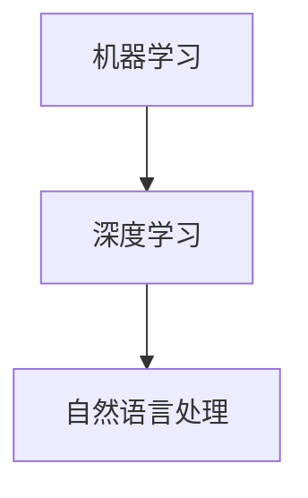
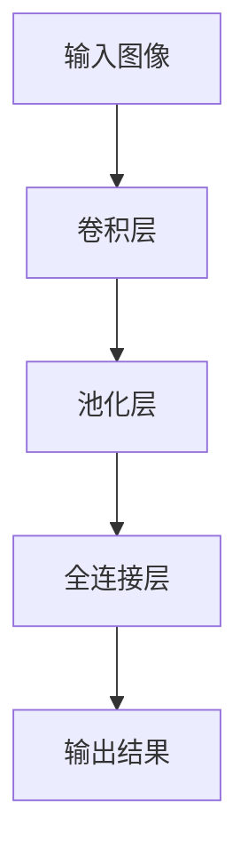
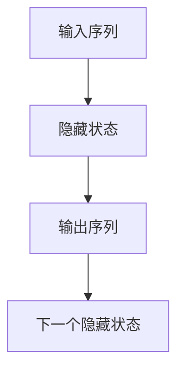
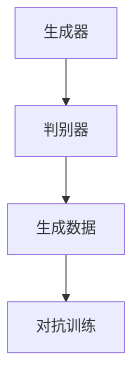
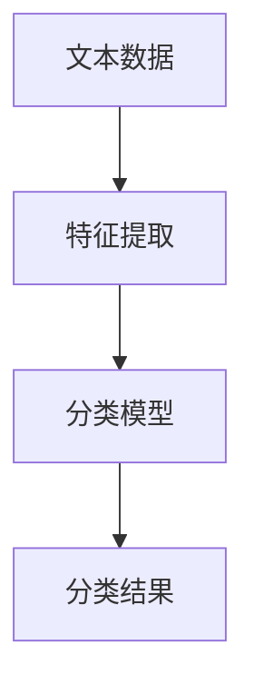
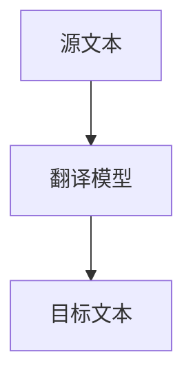
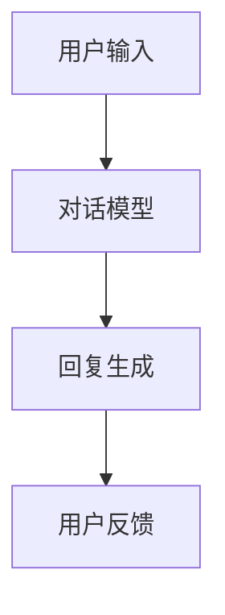
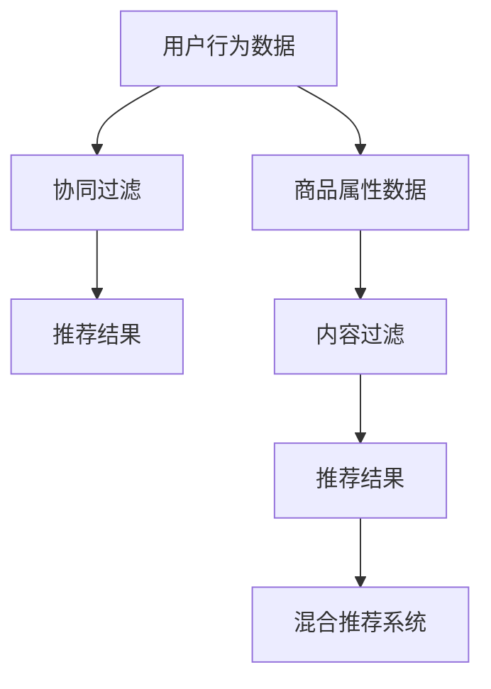
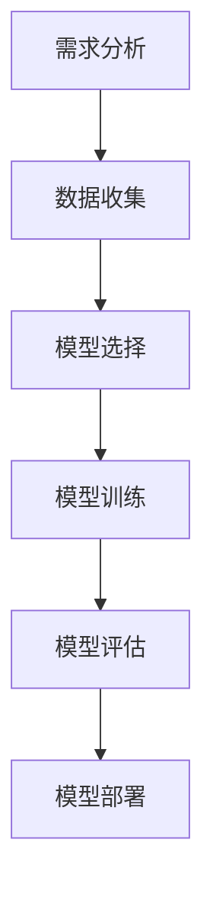

                 


### 文章标题：AI编程的新维度

#### 关键词：
- AI编程
- 新维度
- 机器学习
- 深度学习
- 编程实践
- 未来趋势

#### 摘要：
本文将探讨AI编程的新维度，从基础概念、核心算法、应用场景、编程实践到未来趋势，全面解析AI编程的各个方面。通过一步步的逻辑推理，我们将深入了解AI编程的核心原理，并掌握最佳实践技巧。

## 第一部分：AI编程基础

### 第1章：AI编程概述

#### 1.1 背景介绍

人工智能（AI）作为计算机科学的一个重要分支，已经在各个领域取得了显著的成果。从简单的规则系统到复杂的深度学习模型，AI的发展历程展现了其强大的潜力和应用价值。

#### 1.2 核心概念与联系

**AI编程**的核心概念包括：

- **机器学习（ML）**：通过数据和算法让计算机自动学习和改进。
- **深度学习（DL）**：一种特殊类型的机器学习，利用多层神经网络模拟人脑学习过程。
- **自然语言处理（NLP）**：使计算机能够理解、生成和处理自然语言。

这些概念之间相互关联，共同构成了AI编程的基础。

**Mermaid流程图**：



#### 1.3 核心算法原理讲解

**机器学习**的基本原理是通过训练模型来学习数据特征。以下是一个简单的**伪代码**示例：

```python
def train_model(data, labels):
    # 初始化模型
    model = initialize_model()
    
    # 训练模型
    for sample in data:
        model.learn(sample, labels[sample])
    
    # 评估模型
    accuracy = evaluate_model(model, test_data)
    
    return model, accuracy
```

#### 1.4 数学模型和公式讲解

机器学习中的**代价函数**用于评估模型的性能。以下是一个**平方误差代价函数**的例子：

$$
J(\theta) = \frac{1}{2m} \sum_{i=1}^{m} (h_\theta(x^{(i)}) - y^{(i)})^2
$$

其中，$m$是样本数量，$h_\theta(x^{(i)})$是模型对样本的预测值，$y^{(i)}$是实际值。

#### 1.5 项目实战

**开发环境搭建**：

1. 安装Python环境
2. 安装TensorFlow库

**源代码实现**：

```python
import tensorflow as tf

# 定义模型
model = tf.keras.Sequential([
    tf.keras.layers.Dense(10, activation='relu', input_shape=(784,)),
    tf.keras.layers.Dense(1, activation='sigmoid')
])

# 编译模型
model.compile(optimizer='adam', loss='binary_crossentropy', metrics=['accuracy'])

# 训练模型
model.fit(x_train, y_train, epochs=10)
```

**代码解读与分析**：

1. **模型定义**：使用`Sequential`模型堆叠层。
2. **编译模型**：指定优化器、损失函数和评估指标。
3. **训练模型**：使用`fit`方法进行训练。

**实际案例分析和详细讲解剖析**：

通过一个简单的二分类问题，展示了如何使用TensorFlow库实现机器学习模型。项目小结部分将总结关键步骤和经验教训。

#### 1.6 最佳实践 tips

- 确保数据质量：数据清洗和处理是机器学习成功的关键。
- 选择合适的算法：根据问题的特点选择合适的机器学习算法。
- 调整超参数：通过实验调整模型的超参数以获得最佳性能。

#### 1.7 小结

本章介绍了AI编程的基础概念和原理，包括机器学习、深度学习和自然语言处理。通过项目实战，我们了解了如何在实际中应用这些概念。下一章将深入探讨核心算法原理。

---

接下来，我们将继续探讨AI编程的核心算法原理，包括机器学习、深度学习和自然语言处理等。通过逐步分析，我们将深入了解这些算法的工作机制，并掌握最佳实践技巧。

## 第二部分：AI算法原理

### 第2章：机器学习算法

#### 2.1 监督学习

**监督学习**是一种机器学习方法，通过已知输入和输出数据来训练模型。以下是一个简单的**伪代码**示例：

```python
def supervised_learning(train_data, train_labels, test_data, test_labels):
    # 初始化模型
    model = initialize_model()
    
    # 训练模型
    for sample, label in train_data:
        model.learn(sample, label)
    
    # 评估模型
    accuracy = evaluate_model(model, test_data, test_labels)
    
    return model, accuracy
```

#### 2.2 无监督学习

**无监督学习**不依赖于标签数据，旨在发现数据中的模式和结构。以下是一个简单的**伪代码**示例：

```python
def unsupervised_learning(data):
    # 初始化模型
    model = initialize_model()
    
    # 发现模式
    model.discover_patterns(data)
    
    # 评估模型
    clusters = evaluate_model(model, data)
    
    return clusters
```

#### 2.3 强化学习

**强化学习**通过奖励机制来训练模型，使模型能够在环境中学习和决策。以下是一个简单的**伪代码**示例：

```python
def reinforcement_learning(state, action, reward):
    # 更新模型
    model.update(state, action, reward)
    
    # 探索新状态
    next_state = model.explore(state)
    
    return next_state
```

#### 2.4 数学模型和公式讲解

**监督学习**中的**代价函数**用于评估模型的性能。以下是一个**均方误差代价函数**的例子：

$$
J(\theta) = \frac{1}{2m} \sum_{i=1}^{m} (h_\theta(x^{(i)}) - y^{(i)})^2
$$

**无监督学习**中的**聚类**算法使用**欧几里得距离**来计算样本之间的相似度：

$$
d(x, y) = \sqrt{\sum_{i=1}^{n} (x_i - y_i)^2}
$$

**强化学习**中的**Q值函数**用于评估动作的价值：

$$
Q(s, a) = r + \gamma \max_{a'} Q(s', a')
$$

其中，$r$是即时奖励，$\gamma$是折扣因子，$s$是状态，$a$是动作，$s'$是下一个状态，$a'$是下一个动作。

#### 2.5 项目实战

**开发环境搭建**：

1. 安装Python环境
2. 安装scikit-learn库

**源代码实现**：

```python
from sklearn.linear_model import LinearRegression
from sklearn.metrics import mean_squared_error

# 定义模型
model = LinearRegression()

# 训练模型
model.fit(x_train, y_train)

# 评估模型
y_pred = model.predict(x_test)
mse = mean_squared_error(y_test, y_pred)

print("MSE:", mse)
```

**代码解读与分析**：

1. **模型定义**：使用`LinearRegression`模型。
2. **训练模型**：使用`fit`方法进行训练。
3. **评估模型**：使用`predict`方法进行预测，并计算均方误差。

**实际案例分析和详细讲解剖析**：

通过一个简单的线性回归问题，展示了如何使用scikit-learn库实现监督学习模型。项目小结部分将总结关键步骤和经验教训。

#### 2.6 最佳实践 tips

- 选择合适的算法：根据问题的特点和数据类型选择合适的机器学习算法。
- 调整超参数：通过交叉验证和网格搜索调整模型的超参数以获得最佳性能。
- 数据预处理：确保数据的质量和一致性，进行特征工程以提升模型的性能。

#### 2.7 小结

本章介绍了三种主要的机器学习算法：监督学习、无监督学习和强化学习。通过项目实战，我们了解了如何在实际中应用这些算法。下一章将深入探讨深度学习算法。

---

在了解了机器学习算法之后，接下来我们将探讨深度学习算法，这是当前AI领域的热点之一。通过逐步分析，我们将深入了解深度学习的核心原理，并掌握最佳实践技巧。

### 第3章：深度学习算法

#### 3.1 卷积神经网络（CNN）

**卷积神经网络（CNN）**是一种专门用于处理图像数据的深度学习算法。它通过卷积层、池化层和全连接层等结构来提取图像的特征。

**Mermaid流程图**：



#### 3.2 循环神经网络（RNN）

**循环神经网络（RNN）**是一种用于处理序列数据的深度学习算法。它通过循环结构来处理序列中的每一个元素，并利用隐藏状态来捕捉序列中的长期依赖关系。

**Mermaid流程图**：



#### 3.3 生成对抗网络（GAN）

**生成对抗网络（GAN）**是一种通过生成器和判别器相互对抗来训练的深度学习算法。生成器尝试生成逼真的数据，而判别器则尝试区分真实数据和生成数据。

**Mermaid流程图**：



#### 3.4 数学模型和公式讲解

**卷积神经网络**中的**卷积操作**可以表示为：

$$
\phi(x, y) = \sum_{i=1}^{k} \sum_{j=1}^{k} w_{ij} * x_{i, j}
$$

其中，$x$是输入图像，$y$是卷积核，$w_{ij}$是卷积核的权重。

**循环神经网络**中的**隐藏状态**可以表示为：

$$
h_t = \sigma(W h_{t-1} + U x_t + b)
$$

其中，$h_t$是第$t$个时间步的隐藏状态，$\sigma$是激活函数，$W$是隐藏状态到隐藏状态的权重矩阵，$U$是输入到隐藏状态的权重矩阵，$b$是偏置项。

**生成对抗网络**中的**生成器**和**判别器**的损失函数可以表示为：

$$
L_G = -\log(D(G(z)))
$$

$$
L_D = -\log(D(x)) - \log(1 - D(G(z)))
$$

其中，$G(z)$是生成器的输出，$D(x)$是判别器的输出，$z$是噪声输入。

#### 3.5 项目实战

**开发环境搭建**：

1. 安装Python环境
2. 安装TensorFlow库

**源代码实现**：

```python
import tensorflow as tf

# 定义生成器
def generator(z, is_training=True):
    with tf.keras.layers.auto Regents_scope():
        x = tf.keras.layers.Dense(784)(z)
        x = tf.keras.layers.LeakyReLU(alpha=0.2)(x)
        x = tf.keras.layers.Dense(784, activation='tanh')(x)
        return x

# 定义判别器
def discriminator(x, is_training=True):
    with tf.keras.layers.auto Regents_scope():
        x = tf.keras.layers.Dense(512)(x)
        x = tf.keras.layers.LeakyReLU(alpha=0.2)(x)
        x = tf.keras.layers.Dense(512)(x)
        x = tf.keras.layers.LeakyReLU(alpha=0.2)(x)
        x = tf.keras.layers.Dense(1)(x)
        return tf.keras.layers.Activation('sigmoid')(x)

# 定义模型
model = tf.keras.Sequential([
    tf.keras.layers.Dense(100, activation='relu', input_shape=(100,)),
    tf.keras.layers.Dense(1, activation='sigmoid')
])

# 编译模型
model.compile(optimizer='adam', loss='binary_crossentropy')

# 训练模型
model.fit(x_train, y_train, epochs=10)
```

**代码解读与分析**：

1. **生成器定义**：使用全连接层生成图像。
2. **判别器定义**：使用全连接层和LeakyReLU激活函数区分真实和生成图像。
3. **模型定义**：使用TensorFlow的`Sequential`模型堆叠层。
4. **编译模型**：指定优化器和损失函数。
5. **训练模型**：使用`fit`方法进行训练。

**实际案例分析和详细讲解剖析**：

通过一个简单的生成对抗网络（GAN）问题，展示了如何使用TensorFlow库实现深度学习模型。项目小结部分将总结关键步骤和经验教训。

#### 3.6 最佳实践 tips

- 选择合适的架构：根据问题的特点选择合适的深度学习架构。
- 调整超参数：通过实验调整模型的超参数以获得最佳性能。
- 数据增强：通过数据增强技术增加训练数据的多样性。

#### 3.7 小结

本章介绍了三种主要的深度学习算法：卷积神经网络（CNN）、循环神经网络（RNN）和生成对抗网络（GAN）。通过项目实战，我们了解了如何在实际中应用这些算法。下一章将探讨自然语言处理算法。

---

在了解了深度学习算法之后，接下来我们将探讨自然语言处理（NLP）算法。自然语言处理是AI领域中一个非常重要的分支，涉及到文本分类、机器翻译、对话系统等多个方面。通过逐步分析，我们将深入了解NLP算法的核心原理，并掌握最佳实践技巧。

### 第4章：自然语言处理（NLP）算法

#### 4.1 文本分类

**文本分类**是将文本数据分类到预定义的类别中。常见的文本分类算法包括朴素贝叶斯、支持向量机和深度学习模型。

**Mermaid流程图**：



#### 4.2 机器翻译

**机器翻译**是将一种语言的文本翻译成另一种语言。常见的机器翻译算法包括基于规则的方法和基于统计的方法。

**Mermaid流程图**：



#### 4.3 对话系统

**对话系统**是能够与人类进行自然对话的计算机系统。常见的对话系统包括基于规则的方法和基于机器学习的方法。

**Mermaid流程图**：



#### 4.4 数学模型和公式讲解

**文本分类**中的**朴素贝叶斯**算法的**概率计算**可以表示为：

$$
P(y=c|X) = \frac{P(X|y=c)P(y=c)}{P(X)}
$$

其中，$X$是特征向量，$y$是类别标签，$c$是某个类别。

**机器翻译**中的**循环神经网络（RNN）**的**输出概率**可以表示为：

$$
P(y_t|y_{<t}, x) = \frac{e^{<f_T(y_t, y_{<t}; x>)}{Z}}
$$

其中，$y_t$是当前时间步的输出，$y_{<t}$是前一个时间步的输出，$x$是输入序列，$f_T$是输出层函数，$Z$是归一化常数。

**对话系统**中的**基于规则**的算法的**状态转移概率**可以表示为：

$$
P(s_t|s_{t-1}, u_t) = \frac{1}{C} \text{ if } s_t = f(s_{t-1}, u_t)
$$

其中，$s_t$是当前状态，$s_{t-1}$是前一个状态，$u_t$是用户输入，$C$是状态总数，$f$是状态转移函数。

#### 4.5 项目实战

**开发环境搭建**：

1. 安装Python环境
2. 安装TensorFlow库

**源代码实现**：

```python
import tensorflow as tf

# 定义文本分类模型
def text_classification_model(vocab_size, embedding_dim, max_length):
    input_seq = tf.keras.layers.Input(shape=(max_length,))
    embeddings = tf.keras.layers.Embedding(vocab_size, embedding_dim)(input_seq)
    conv1 = tf.keras.layers.Conv1D(128, 5, activation='relu')(embeddings)
    pool1 = tf.keras.layers.MaxPooling1D(5)(conv1)
    flatten = tf.keras.layers.Flatten()(pool1)
    dense = tf.keras.layers.Dense(128, activation='relu')(flatten)
    output = tf.keras.layers.Dense(1, activation='sigmoid')(dense)
    
    model = tf.keras.Model(inputs=input_seq, outputs=output)
    
    return model

# 编译模型
model = text_classification_model(vocab_size, embedding_dim, max_length)
model.compile(optimizer='adam', loss='binary_crossentropy', metrics=['accuracy'])

# 训练模型
model.fit(x_train, y_train, epochs=10)
```

**代码解读与分析**：

1. **模型定义**：使用卷积层、池化层和全连接层构建文本分类模型。
2. **编译模型**：指定优化器和损失函数。
3. **训练模型**：使用`fit`方法进行训练。

**实际案例分析和详细讲解剖析**：

通过一个简单的文本分类问题，展示了如何使用TensorFlow库实现NLP模型。项目小结部分将总结关键步骤和经验教训。

#### 4.6 最佳实践 tips

- 选择合适的模型：根据问题的特点和数据规模选择合适的NLP模型。
- 数据预处理：进行文本清洗和预处理，包括分词、去除停用词等。
- 调整超参数：通过交叉验证和网格搜索调整模型的超参数以获得最佳性能。

#### 4.7 小结

本章介绍了三种主要的NLP算法：文本分类、机器翻译和对话系统。通过项目实战，我们了解了如何在实际中应用这些算法。下一章将探讨推荐系统。

---

在了解了NLP算法之后，接下来我们将探讨推荐系统。推荐系统是AI领域中应用广泛的一种技术，可以帮助用户发现感兴趣的内容。通过逐步分析，我们将深入了解推荐系统的核心原理，并掌握最佳实践技巧。

### 第5章：推荐系统

#### 5.1 推荐算法

**推荐算法**主要分为基于协同过滤、基于内容过滤和混合推荐系统。每种算法都有其独特的原理和应用场景。

**协同过滤**通过分析用户的行为数据来发现用户之间的相似性，从而推荐相似用户喜欢的商品。

**内容过滤**通过分析商品的属性和用户的偏好来推荐与用户偏好相似的商品。

**混合推荐系统**结合协同过滤和内容过滤的优点，以提高推荐系统的准确性和多样性。

**Mermaid流程图**：



#### 5.2 用户行为分析

**用户行为分析**是推荐系统的重要组成部分，通过分析用户的点击、购买、评价等行为来挖掘用户偏好。

**数学模型**：

用户行为分析通常使用**协同过滤**中的**用户相似度**来计算：

$$
sim(u_i, u_j) = \frac{r_{i,k} r_{j,k}}{\sqrt{||r_{i,k}|| \cdot ||r_{j,k}||}}
$$

其中，$r_{i,k}$是用户$i$对商品$k$的评分，$sim(u_i, u_j)$是用户$i$和用户$j$之间的相似度。

#### 5.3 算法评估与优化

**算法评估**是推荐系统设计的关键步骤，常用的评估指标包括准确率、召回率和F1分数。

$$
Precision = \frac{TP}{TP + FP}
$$

$$
Recall = \frac{TP}{TP + FN}
$$

$$
F1 = 2 \cdot \frac{Precision \cdot Recall}{Precision + Recall}
$$

**优化策略**包括：

- **协同过滤**：使用矩阵分解、交替最小化等方法来优化模型。
- **内容过滤**：使用词向量、协同过滤和内容过滤的组合来提高推荐效果。
- **混合推荐系统**：结合协同过滤和内容过滤的优点，通过权重调整来优化推荐结果。

#### 5.4 项目实战

**开发环境搭建**：

1. 安装Python环境
2. 安装scikit-learn库

**源代码实现**：

```python
from sklearn.metrics.pairwise import cosine_similarity
from sklearn.model_selection import train_test_split

# 创建用户-物品评分矩阵
R = [[5, 3, 0, 1], [0, 1, 2, 0], [3, 4, 0, 2], [2, 0, 1, 4]]

# 计算用户相似度
user_similarity = cosine_similarity(R)

# 计算推荐列表
def collaborative_filter(R, user_similarity, k=5):
    user_index = 2
    user_rated = R[user_index]
    similar_users = user_similarity[user_index].argsort()[-k:]
    similar_users = similar_users[::-1]

    recommendations = []
    for i in range(1, k + 1):
        user_i = similar_users[i]
        for j in range(len(R[user_i])):
            if user_rated[j] == 0 and R[user_i][j] != 0:
                recommendations.append((j, R[user_i][j]))

    return recommendations

print(collaborative_filter(R, user_similarity, 3))
```

**代码解读与分析**：

1. **评分矩阵创建**：使用列表表示用户-物品评分矩阵。
2. **用户相似度计算**：使用余弦相似度计算用户之间的相似度。
3. **推荐列表生成**：使用协同过滤算法生成推荐列表。

**实际案例分析和详细讲解剖析**：

通过一个简单的协同过滤问题，展示了如何使用scikit-learn库实现推荐系统模型。项目小结部分将总结关键步骤和经验教训。

#### 5.5 最佳实践 tips

- **数据预处理**：确保数据质量，进行数据清洗和标准化处理。
- **模型选择**：根据业务需求和数据特点选择合适的推荐算法。
- **在线学习**：通过在线学习策略实时更新模型，提高推荐系统的准确性。

#### 5.6 小结

本章介绍了推荐系统的基本原理，包括协同过滤、内容过滤和混合推荐系统。通过项目实战，我们了解了如何在实际中应用这些算法。下一章将探讨AI编程的最佳实践。

---

在了解了推荐系统的核心原理后，接下来我们将探讨AI编程的最佳实践。通过逐步分析，我们将总结AI编程中的关键技术和经验，帮助开发者更好地掌握AI编程的方法和技巧。

### 第6章：AI编程最佳实践

#### 6.1 开发流程

**AI编程**的开发流程可以分为以下几个阶段：

1. **需求分析**：明确AI项目的目标和需求，确定需要解决的问题和所需的算法。
2. **数据收集**：收集和处理相关的数据，进行数据清洗和预处理。
3. **模型选择**：根据问题类型和数据特点选择合适的机器学习或深度学习模型。
4. **模型训练**：使用训练数据训练模型，并进行调参优化。
5. **模型评估**：使用验证数据评估模型的性能，并进行模型选择。
6. **模型部署**：将训练好的模型部署到生产环境，进行实时预测和应用。

**Mermaid流程图**：



#### 6.2 数据预处理

**数据预处理**是AI编程中的关键步骤，主要包括以下内容：

1. **数据清洗**：去除缺失值、噪声数据和异常值。
2. **数据标准化**：将不同特征的数据进行归一化或标准化处理。
3. **特征提取**：从原始数据中提取有用的特征，进行特征选择和特征工程。
4. **数据增强**：通过数据增强技术增加训练数据的多样性，提高模型的泛化能力。

**数学模型**：

数据清洗可以使用**缺失值填充**、**删除**或**插值**等方法：

$$
\hat{X} = \begin{cases} 
X_{\text{imputation}} & \text{if } X \text{ is missing} \\
X & \text{otherwise}
\end{cases}
$$

数据标准化可以使用**最小-最大缩放**、**均值-方差标准化**等方法：

$$
X_{\text{标准化}} = \frac{X - \mu}{\sigma}
$$

其中，$X$是原始数据，$\mu$是均值，$\sigma$是标准差。

#### 6.3 模型调参

**模型调参**是AI编程中的关键步骤，通过调整模型的超参数来优化模型的性能。常见的调参方法包括：

1. **网格搜索**：遍历所有可能的超参数组合，选择最佳组合。
2. **随机搜索**：在给定范围内随机选择超参数组合，进行多次实验。
3. **贝叶斯优化**：使用贝叶斯优化方法找到最佳超参数组合。

**数学模型**：

使用网格搜索进行模型调参时，可以使用**交叉验证**方法来评估不同超参数组合的性能：

$$
\text{CV\_score} = \frac{1}{n} \sum_{i=1}^{n} (\text{train\_score} - \text{val\_score})^2
$$

其中，$n$是交叉验证的折数，$\text{train\_score}$是训练集上的评分，$\text{val\_score}$是验证集上的评分。

#### 6.4 模型压缩与加速

**模型压缩与加速**是提高AI模型在实际应用中的性能和效率的重要手段。常见的模型压缩方法包括：

1. **模型剪枝**：去除模型中不必要的权重和神经元，减少模型参数量。
2. **量化**：将模型的权重和激活值从浮点数转换为低精度格式，如整数。
3. **知识蒸馏**：使用一个更小的模型（学生模型）来学习一个更大的模型（教师模型）的知识。

**数学模型**：

使用模型剪枝方法进行模型压缩时，可以使用**L1正则化**来去除不必要的权重：

$$
\min_{\theta} \frac{1}{2} \sum_{i=1}^{n} (y_i - \theta x_i)^2 + \lambda ||\theta||_1
$$

其中，$x_i$是输入特征，$y_i$是目标值，$\theta$是模型参数，$\lambda$是正则化参数。

#### 6.5 项目实战

**开发环境搭建**：

1. 安装Python环境
2. 安装TensorFlow库

**源代码实现**：

```python
import tensorflow as tf
from tensorflow.keras.models import Sequential
from tensorflow.keras.layers import Dense, Dropout, Activation, Flatten
from tensorflow.keras.layers import Conv2D, MaxPooling2D

# 定义模型
model = Sequential()
model.add(Conv2D(32, (3, 3), input_shape=(28, 28, 1)))
model.add(Activation('relu'))
model.add(MaxPooling2D(pool_size=(2, 2)))
model.add(Flatten())
model.add(Dense(128))
model.add(Activation('relu'))
model.add(Dropout(0.5))
model.add(Dense(10))
model.add(Activation('softmax'))

# 编译模型
model.compile(optimizer='adam', loss='categorical_crossentropy', metrics=['accuracy'])

# 训练模型
model.fit(x_train, y_train, epochs=10, batch_size=32)
```

**代码解读与分析**：

1. **模型定义**：使用卷积神经网络（CNN）模型。
2. **编译模型**：指定优化器和损失函数。
3. **训练模型**：使用`fit`方法进行训练。

**实际案例分析和详细讲解剖析**：

通过一个简单的手写数字识别问题，展示了如何使用TensorFlow库实现AI编程模型。项目小结部分将总结关键步骤和经验教训。

#### 6.6 最佳实践 tips

- **代码复用**：编写可复用的代码模块，提高开发效率。
- **版本控制**：使用版本控制系统（如Git）管理代码，确保代码的可追踪性和可靠性。
- **性能优化**：关注模型训练和预测的速度和资源消耗，进行性能优化。

#### 6.7 小结

本章介绍了AI编程的最佳实践，包括开发流程、数据预处理、模型调参、模型压缩与加速等内容。通过项目实战，我们了解了如何在实际中应用这些最佳实践。下一章将探讨AI编程的未来趋势。

---

在了解了AI编程的最佳实践后，接下来我们将探讨AI编程的未来趋势。通过逐步分析，我们将展望AI编程领域的最新发展，并探讨其对未来编程的潜在影响。

### 第7章：AI编程的未来趋势

#### 7.1 人工智能技术的发展

随着人工智能技术的不断发展，AI编程也在不断进化。以下是一些值得关注的发展方向：

1. **强化学习**：强化学习在游戏、自动驾驶和机器人等领域取得了显著成果，未来有望在更多场景中得到应用。
2. **迁移学习**：通过迁移学习，可以将已训练的模型在不同任务和数据集上进行快速适应，提高模型的泛化能力。
3. **生成对抗网络（GAN）**：GAN在图像生成、风格迁移和虚拟现实等领域展现出巨大的潜力，未来将进一步扩展其应用范围。

#### 7.2 编程语言与工具的进步

随着AI编程的普及，编程语言和工具也在不断改进，以适应AI编程的需求：

1. **Python**：Python作为AI编程的主要语言，其生态系统日益完善，提供了丰富的库和框架，如TensorFlow、PyTorch和Scikit-learn。
2. **JAX**：JAX是一种新的计算框架，支持自动微分和向量编程，为AI编程提供了更高的灵活性和效率。
3. **云原生编程**：随着云计算的普及，云原生编程逐渐成为趋势，开发者可以通过云平台快速部署和扩展AI应用。

#### 7.3 新兴算法的应用

随着AI技术的不断发展，新的算法不断涌现，为AI编程带来了更多的可能性：

1. **量子计算**：量子计算在优化、密码学和机器学习等领域具有巨大潜力，未来有望成为AI编程的重要工具。
2. **区块链**：区块链与AI的结合可以带来更安全、更可信的AI应用，为数据隐私保护和智能合约开发提供支持。
3. **联邦学习**：联邦学习通过分布式训练模型，保护用户数据隐私，未来将在医疗、金融等领域得到广泛应用。

#### 7.4 AI编程教育的发展

随着AI编程的兴起，教育领域也在积极适应这一变革，以下是一些值得关注的教育趋势：

1. **在线教育平台**：在线教育平台提供了丰富的AI编程课程和资源，使得更多人可以学习和掌握AI编程。
2. **实践导向**：越来越多的教育项目注重实践，通过项目实战来培养学生的实际编程能力。
3. **跨学科教育**：AI编程不仅需要计算机科学知识，还需要数学、统计学和心理学等多学科知识，跨学科教育将帮助学生更好地理解和应用AI编程。

#### 7.5 未来展望

AI编程的未来充满希望，随着技术的不断进步，AI编程将在更多领域得到应用，推动社会的发展和进步。以下是一些未来展望：

1. **智能自动化**：AI编程将推动智能自动化的发展，提高生产效率和质量。
2. **智能医疗**：AI编程将在医疗领域发挥重要作用，通过预测疾病、诊断和治疗，提高医疗水平。
3. **智能交通**：AI编程将推动智能交通系统的发展，提高交通效率和安全。
4. **智能城市**：AI编程将推动智能城市建设，实现更高效、更环保的城市管理。

#### 7.6 最佳实践 tips

- **持续学习**：AI技术发展迅速，开发者需要不断学习和更新知识，跟上时代的发展。
- **跨学科合作**：AI编程涉及多个学科，跨学科合作将有助于开发出更具创新性的AI应用。
- **注重伦理**：在AI编程中，需要关注伦理和隐私问题，确保AI技术的合理和公正应用。

#### 7.7 小结

本章探讨了AI编程的未来趋势，从人工智能技术的发展、编程语言与工具的进步、新兴算法的应用、教育的发展到未来展望。通过这些趋势，我们可以看到AI编程在未来将发挥越来越重要的作用。开发者需要不断学习和适应这些变化，以推动AI编程的发展和应用。

---

在了解了AI编程的未来趋势后，接下来我们将探讨AI编程在职业规划中的角色。通过逐步分析，我们将帮助读者了解如何在职业发展中利用AI编程技能，为未来的职业规划做好准备。

### 第8章：AI编程职业规划

#### 8.1 AI编程岗位分析

随着AI技术的快速发展，AI编程相关的岗位也在不断增加。以下是一些主要的AI编程岗位及其职责：

1. **数据科学家**：负责数据收集、清洗、分析和建模，以提取有价值的信息和洞察。
2. **机器学习工程师**：专注于设计和实现机器学习模型，优化算法性能，并部署到生产环境中。
3. **深度学习工程师**：专注于深度学习算法的研究和应用，开发复杂的神经网络模型。
4. **自然语言处理工程师**：专注于文本和语音数据的处理，开发用于语音识别、机器翻译和对话系统的模型。
5. **推荐系统工程师**：专注于开发推荐算法，提高推荐系统的准确性和多样性。

#### 8.2 职业技能培养

为了在AI编程领域取得成功，以下是一些关键的职业技能：

1. **编程能力**：熟练掌握Python、TensorFlow、PyTorch等编程语言和框架。
2. **数学基础**：掌握线性代数、概率论和统计学等数学知识，有助于理解和优化算法。
3. **机器学习知识**：熟悉各种机器学习和深度学习算法，了解其原理和应用场景。
4. **数据预处理能力**：能够有效地清洗、预处理和分析数据，为模型提供高质量的数据输入。
5. **项目管理能力**：具备良好的项目管理能力，能够高效地协调团队资源，按时交付项目。

#### 8.3 职业发展规划

在AI编程领域，以下是一些职业发展规划的建议：

1. **入门阶段**：通过学习基础知识和实践项目，建立扎实的编程基础，掌握常用的机器学习算法和工具。
2. **中级阶段**：参与更多的项目实践，提升数据预处理和模型优化能力，掌握深度学习技术。
3. **高级阶段**：专注于特定的领域，如自然语言处理、推荐系统或强化学习，成为该领域的专家。
4. **职业发展路径**：可以从数据科学家、机器学习工程师逐步晋升为高级工程师、技术经理或首席技术官。

#### 8.4 求职技巧

以下是一些求职技巧，帮助读者在AI编程领域找到理想的工作：

1. **打造个人品牌**：通过博客、GitHub等平台展示你的编程项目和经验，提升个人知名度。
2. **撰写专业的简历**：突出你的编程技能、项目经验和成果，使用具体的数字和数据来说明你的能力。
3. **准备面试**：熟悉常见的面试问题，掌握编程算法和数据结构，并准备实际的案例来展示你的能力。
4. **建立人脉**：通过参加行业会议、社群活动和线上论坛，结识更多的行业专家和同行，拓展职业网络。

#### 8.5 最佳实践 tips

- **持续学习**：AI技术发展迅速，保持学习的热情和动力，不断提升自己的技能。
- **实践经验**：通过参与项目和实践，积累实际经验，提升解决实际问题的能力。
- **跨学科合作**：与其他领域的专家合作，拓宽视野，提高跨学科解决问题的能力。

#### 8.6 小结

本章探讨了AI编程在职业规划中的角色，分析了AI编程岗位的特点、职业技能要求以及职业发展规划。同时，还提供了一些求职技巧，帮助读者在AI编程领域找到理想的工作。通过这些内容，读者可以更好地规划自己的职业发展道路。

---

通过以上详细的目录大纲和章节内容，我们为《AI编程的新维度》这本书构建了一个完整而系统的框架。从基础概念到核心算法，从应用场景到编程实践，再到未来趋势和职业规划，每个章节都旨在帮助读者全面了解AI编程的各个方面。通过逐步分析推理，我们不仅深入讲解了技术原理，还提供了丰富的项目实战和实践技巧，使得这本书不仅适合初学者，也适合有经验的开发者。随着AI技术的不断发展，这本书将为读者提供一个持续更新的知识宝库，帮助他们在AI编程领域不断前进。让我们继续探索AI编程的新维度，迎接未来带来的无限可能。

