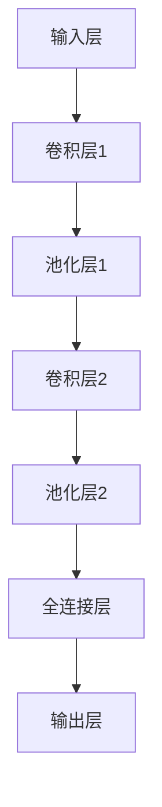
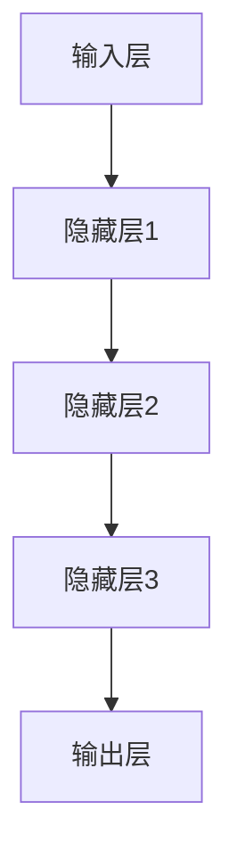
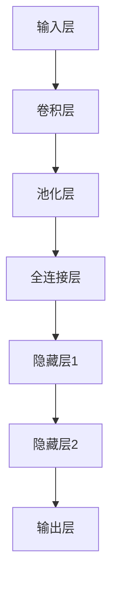
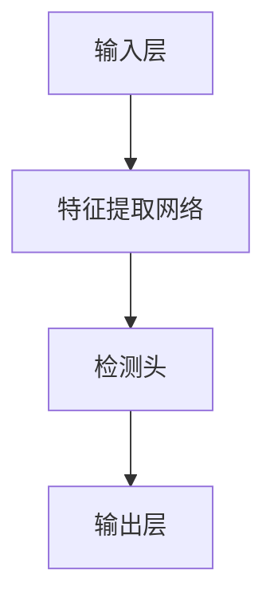
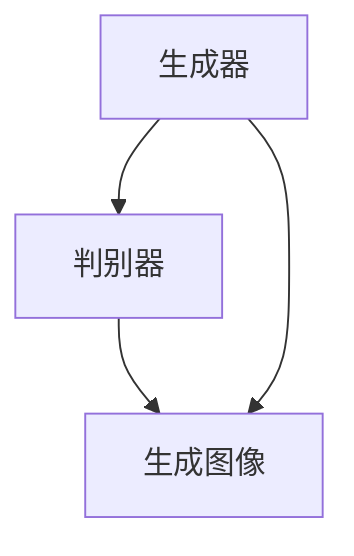

                 


### AI编程的新维度与新范式

随着人工智能（AI）技术的快速发展，编程领域正迎来一场深刻的变革。传统的编程范式已经无法满足AI领域日益复杂的需求，新的维度和范式正在逐渐形成。本文将深入探讨AI编程的新维度与新范式，旨在为读者提供一种全新的理解和实践AI编程的方法。

#### 关键词

- AI编程
- 新维度
- 新范式
- 机器学习
- 深度学习
- 强化学习
- 软计算
- 大数据

#### 摘要

本文首先介绍了AI编程的基础，包括机器学习、深度学习和强化学习等核心概念。接着，我们探讨了AI编程的新维度，如多智能体强化学习、生成对抗网络（GAN）和聚类分析。然后，我们深入分析了AI编程的新范式，包括软计算、模式识别和大数据编程。最后，本文通过实际案例展示了AI编程在自然语言处理、计算机视觉和游戏开发等领域的应用，并提出了最佳实践和注意事项。

#### 目录

- 第一部分: AI编程基础
  - 第1章: AI编程概述
  - 第2章: 机器学习基础
  - 第3章: 深度学习基础
  - 第4章: 强化学习基础

- 第二部分: AI编程的新维度
  - 第5章: 强化学习新维度
  - 第6章: 生成对抗网络（GAN）新维度
  - 第7章: 聚类分析新维度

- 第三部分: AI编程的新范式
  - 第8章: 软计算新范式
  - 第9章: 模式识别新范式
  - 第10章: 大数据编程新范式

- 第四部分: AI编程应用实战
  - 第11章: AI编程在自然语言处理中的应用
  - 第12章: AI编程在计算机视觉中的应用
  - 第13章: AI编程在游戏开发中的应用

### 1. AI编程概述

人工智能编程是利用计算机程序实现智能行为的过程。它涉及多个领域，包括机器学习、深度学习和强化学习等。AI编程的目标是通过训练和优化算法，使计算机能够从数据中自动学习和提取知识，从而实现智能决策和自主行动。

AI编程的核心概念包括：

- **机器学习**：通过训练模型，使计算机能够从数据中学习并改进性能。
- **深度学习**：利用多层神经网络模拟人脑的智能处理过程。
- **强化学习**：通过奖励和惩罚机制，使计算机在复杂环境中学习最佳策略。

这些概念相互关联，共同构成了AI编程的基础。例如，深度学习是机器学习的一种形式，而强化学习则是机器学习的一种应用。

#### 1.1 AI编程的起源与发展

AI编程的起源可以追溯到20世纪50年代，当时计算机科学家开始探索如何使计算机模拟人类的智能行为。早期的AI研究主要集中在符号主义和逻辑推理上，例如基于规则的专家系统和逻辑程序设计。

然而，随着计算机硬件性能的提升和数据量的爆炸式增长，机器学习和深度学习逐渐成为AI编程的主流。这些新方法通过训练大规模神经网络，使计算机能够从海量数据中自动提取特征和模式，从而实现智能任务。

近年来，AI编程的应用领域不断扩展，从传统的图像识别、自然语言处理，到更加复杂的游戏AI、自动驾驶和智能医疗等。这些应用不仅提高了人类的生活质量，也为计算机科学带来了新的挑战和机遇。

#### 1.2 AI编程的核心概念

AI编程的核心概念包括：

- **机器学习**：通过训练模型，使计算机能够从数据中学习并改进性能。
- **深度学习**：利用多层神经网络模拟人脑的智能处理过程。
- **强化学习**：通过奖励和惩罚机制，使计算机在复杂环境中学习最佳策略。

这些概念相互关联，共同构成了AI编程的基础。例如，深度学习是机器学习的一种形式，而强化学习则是机器学习的一种应用。

#### 1.3 AI编程的主要任务

AI编程的主要任务包括：

- **数据处理**：清洗、预处理和转换数据，以适应机器学习模型的需求。
- **模型训练**：选择合适的算法和模型，对数据进行训练，以获得最优性能。
- **模型评估**：评估模型的性能，包括准确性、召回率和F1分数等指标。
- **模型部署**：将训练好的模型部署到实际应用中，如图像识别、自然语言处理等。

这些任务相互衔接，构成了一个完整的AI编程流程。在处理这些任务时，程序员需要综合考虑数据质量、算法选择、硬件资源和时间成本等因素。

#### 2. 机器学习基础

机器学习是AI编程的核心技术之一，它使计算机能够从数据中自动学习和改进性能。机器学习可以分为监督学习、无监督学习和半监督学习三种类型。在本节中，我们将详细介绍机器学习的基础知识，包括定义、分类和应用。

##### 2.1 机器学习的定义与分类

机器学习是一种通过训练模型，使计算机能够从数据中学习并改进性能的方法。根据学习方式，机器学习可以分为以下三类：

- **监督学习**：在监督学习中，计算机通过学习输入数据和相应的输出标签，来预测新的输入数据的标签。常见的监督学习算法包括线性回归、逻辑回归、决策树、随机森林和支持向量机等。
- **无监督学习**：在无监督学习中，计算机没有提供标签数据，需要从无标签的数据中学习隐藏的规律和结构。常见的无监督学习算法包括聚类分析、降维和生成模型等。
- **半监督学习**：半监督学习结合了监督学习和无监督学习，利用少量的标签数据和大量的无标签数据来训练模型。这种方法可以减少标注数据的成本，提高模型的泛化能力。

##### 2.2 监督学习算法

监督学习算法是机器学习中最常用的算法之一，它通过学习输入数据和相应的输出标签，来预测新的输入数据的标签。以下是一些常见的监督学习算法：

- **线性回归**：线性回归是一种简单的监督学习算法，它通过拟合一条直线，来预测新的输入数据的标签。线性回归的基本公式为：

  $$
  y = wx + b
  $$

  其中，\( y \) 表示输出标签，\( x \) 表示输入特征，\( w \) 表示权重，\( b \) 表示偏置。

- **逻辑回归**：逻辑回归是一种广义的线性回归，它用于分类任务。逻辑回归的输出是一个概率值，通过将概率值转换为类别标签，来实现分类。逻辑回归的基本公式为：

  $$
  P(y=1) = \frac{1}{1 + e^{-(wx + b)}}
  $$

- **决策树**：决策树是一种基于树形结构的监督学习算法，它通过一系列的测试来划分数据集，并最终得到一个决策规则。决策树的基本结构包括根节点、内部节点和叶节点。

- **随机森林**：随机森林是一种基于决策树的集成学习算法，它通过训练多个决策树，并将它们的预测结果进行投票，来提高模型的准确性。随机森林的基本结构包括多个决策树和投票机制。

- **支持向量机**：支持向量机是一种基于优化理论的支持向量监督学习算法，它通过最大化分类边界，来实现分类任务。支持向量机的基本公式为：

  $$
  \min_{w, b} \frac{1}{2} ||w||^2 + C \sum_{i=1}^{n} \xi_i
  $$

  其中，\( w \) 表示权重，\( b \) 表示偏置，\( C \) 表示惩罚参数，\( \xi_i \) 表示松弛变量。

##### 2.3 无监督学习算法

无监督学习算法是机器学习中的另一种重要类型，它不需要标签数据，而是通过学习数据的内在结构来揭示数据的规律和模式。以下是一些常见的无监督学习算法：

- **聚类分析**：聚类分析是一种将数据划分为若干个类别的无监督学习算法。常见的聚类算法包括K-均值聚类、层次聚类和模糊聚类等。

- **降维**：降维是一种减少数据维度的方法，它通过保留数据的主要特征，来降低数据的复杂度。常见的降维算法包括主成分分析（PCA）和线性判别分析（LDA）等。

- **生成模型**：生成模型是一种通过学习数据的分布，来生成新的数据样本的算法。常见的生成模型包括生成对抗网络（GAN）和变分自编码器（VAE）等。

#### 3. 深度学习基础

深度学习是机器学习的一种形式，它通过多层神经网络模拟人脑的智能处理过程。深度学习在图像识别、自然语言处理和语音识别等领域取得了显著的成果。在本节中，我们将详细介绍深度学习的基础知识，包括概念、架构和应用。

##### 3.1 深度学习的概念与原理

深度学习是一种通过多层神经网络进行训练和预测的方法。它的基本原理是模拟人脑神经网络的结构和功能，通过逐层提取数据中的特征，从而实现对复杂数据的理解和处理。

深度学习的关键概念包括：

- **神经网络**：神经网络是一种由多个神经元组成的计算模型，每个神经元都是一个简单的计算单元。神经网络通过前向传播和反向传播，来实现数据的训练和预测。

- **深度**：深度学习中的“深度”指的是神经网络中层数的多少。深度越大，神经网络能够提取的特征层次就越丰富，从而提高模型的性能。

- **激活函数**：激活函数是神经网络中的一个关键组件，它用于确定神经元是否被激活。常见的激活函数包括Sigmoid函数、ReLU函数和Tanh函数等。

- **损失函数**：损失函数是用于评估模型预测结果与实际标签之间的差距的函数。常见的损失函数包括均方误差（MSE）、交叉熵（Cross-Entropy）等。

##### 3.2 卷积神经网络（CNN）

卷积神经网络（CNN）是一种专门用于处理图像数据的神经网络。它的基本结构包括输入层、卷积层、池化层和全连接层。以下是CNN的伪代码实现：

```python
# 输入图像
input_image = ...

# 卷积层
conv_output = Conv2D(kernel_size=(3, 3), filters=32)(input_image)

# 池化层
pool_output = MaxPooling2D(pool_size=(2, 2))(conv_output)

# 全连接层
fc_output = Flatten()(pool_output)
fc_output = Dense(units=10, activation='softmax')(fc_output)

# 输出
output = fc_output
```

卷积神经网络通过卷积层和池化层提取图像中的特征，并通过全连接层实现分类。以下是一个简单的CNN架构的Mermaid流程图：



##### 3.3 循环神经网络（RNN）

循环神经网络（RNN）是一种能够处理序列数据的神经网络。它的基本结构包括输入层、隐藏层和输出层。RNN通过循环结构来保留历史信息，从而实现对序列数据的建模。

以下是一个简单的RNN架构的Mermaid流程图：



RNN在处理序列数据时存在梯度消失和梯度爆炸等问题，为了解决这些问题，研究人员提出了长短期记忆网络（LSTM）和门控循环单元（GRU）等改进的RNN结构。

##### 3.4 CNN与RNN的融合

CNN与RNN的融合是深度学习中的一个重要研究方向。通过结合CNN的图像特征提取能力和RNN的序列建模能力，可以实现对图像序列数据的复杂建模。以下是一个简单的CNN与RNN融合架构的Mermaid流程图：



CNN与RNN的融合在视频识别、语音识别和自然语言处理等领域取得了显著成果，为AI编程提供了强大的工具。

#### 4. 强化学习基础

强化学习是一种通过奖励和惩罚机制，使计算机在复杂环境中学习最佳策略的机器学习方法。与监督学习和无监督学习不同，强化学习不依赖于预先标注的数据，而是通过与环境交互来学习策略。在本节中，我们将详细介绍强化学习的基础知识，包括定义、分类和应用。

##### 4.1 强化学习的定义与分类

强化学习是一种通过奖励和惩罚机制，使计算机在复杂环境中学习最佳策略的机器学习方法。强化学习的关键概念包括：

- **代理（Agent）**：代理是执行动作、接收环境和奖励的主体。
- **环境（Environment）**：环境是代理执行动作并接收奖励的实体。
- **状态（State）**：状态是代理在环境中的位置和状态的描述。
- **动作（Action）**：动作是代理在状态中可以执行的行为。
- **奖励（Reward）**：奖励是代理执行动作后，环境给予的正面或负面反馈。
- **策略（Policy）**：策略是代理在给定状态下选择动作的规则。

根据学习方式，强化学习可以分为以下三类：

- **值函数强化学习**：值函数强化学习通过学习状态值函数和动作值函数，来优化代理的策略。常见的值函数强化学习算法包括Q-learning和深度Q网络（DQN）等。
- **策略梯度强化学习**：策略梯度强化学习通过直接优化代理的策略来优化学习过程。常见的策略梯度强化学习算法包括REINFORCE和策略梯度算法等。
- **模型强化学习**：模型强化学习通过学习环境的动态模型，来优化代理的策略。常见的模型强化学习算法包括马尔可夫决策过程（MDP）和部分可观测马尔可夫决策过程（POMDP）等。

##### 4.2 Q-learning算法

Q-learning是一种基于值函数强化学习的算法，它通过学习状态-动作值函数（Q值），来优化代理的策略。Q-learning的基本公式为：

$$
Q(s, a) = r + \gamma \max_{a'} Q(s', a')
$$

其中，\( Q(s, a) \) 表示状态 \( s \) 下执行动作 \( a \) 的Q值，\( r \) 表示奖励，\( \gamma \) 表示折扣因子，\( s' \) 表示下一状态，\( a' \) 表示下一动作。

以下是一个简单的Q-learning算法的伪代码实现：

```python
# 初始化Q值矩阵
Q = np.zeros((state_space_size, action_space_size))

# 设置学习参数
learning_rate = 0.1
discount_factor = 0.9

# 进行N次迭代
for episode in range(N):
  state = env.reset()
  done = False

  while not done:
    # 选择动作
    action = np.argmax(Q[state])

    # 执行动作
    next_state, reward, done = env.step(action)

    # 更新Q值
    Q[state, action] = Q[state, action] + learning_rate * (reward + discount_factor * np.max(Q[next_state]) - Q[state, action])

    state = next_state
```

##### 4.3 Deep Q-Network（DQN）

DQN是一种基于深度学习的Q-learning算法，它通过训练一个深度神经网络来近似Q值函数。DQN的基本思想是使用经验回放和目标网络来减少Q值估计的偏差。以下是一个简单的DQN算法的伪代码实现：

```python
# 初始化DQN模型
model = build_dqn_model()

# 设置经验回放缓冲区
replay_memory = ReplayMemory(memory_size)

# 设置目标网络
target_model = build_dqn_model()
copy_model_weights(target_model, model)

# 进行N次迭代
for episode in range(N):
  state = env.reset()
  done = False

  while not done:
    # 选择动作
    action = np.argmax(model.predict(state))

    # 执行动作
    next_state, reward, done = env.step(action)

    # 存储经验
    replay_memory.push(state, action, reward, next_state, done)

    # 从经验回放缓冲区中抽样
    state, action, reward, next_state, done = replay_memory.sample(batch_size)

    # 训练DQN模型
    target_q_values = target_model.predict(next_state)
    target_q_values = np.max(target_q_values)
    q_values = model.predict(state)
    q_values[actions] = reward + discount_factor * target_q_values

    # 更新目标网络
    copy_model_weights(target_model, model)

    state = next_state
```

DQN在解决连续状态和动作空间的问题时表现出色，但仍然存在一些挑战，如目标网络更新策略、学习不稳定性和策略偏斜等。

#### 5. 强化学习新维度

强化学习在传统的单智能体场景中取得了显著成果，但在多智能体和分布式环境中的应用仍然面临许多挑战。本节将介绍强化学习的新维度，包括多智能体强化学习和分布式强化学习。

##### 5.1 多智能体强化学习

多智能体强化学习（Multi-Agent Reinforcement Learning，MARL）是一种研究多个智能体在动态环境中协同互动的机器学习方法。在MARL中，每个智能体都拥有自己的状态、动作和奖励，并且它们的目标可能是相互竞争或相互合作的。以下是一些常见的MARL模型：

- **多智能体Q学习（MAQ-Learning）**：MAQ-Learning通过扩展传统的Q-learning算法，使多个智能体在相同的回合中进行学习。每个智能体都维护一个独立的Q值表，并使用其他智能体的动作和奖励来更新自己的Q值。

- **博弈论模型**：博弈论模型是研究多个智能体在竞争环境中互动的数学理论。在MARL中，常见的博弈论模型包括纳什均衡、混合策略和合作博弈等。通过使用博弈论模型，智能体可以在竞争环境中找到最佳策略。

- **分布式强化学习**：分布式强化学习是一种通过将智能体分布在不同计算节点上，来提高MARL算法效率和可扩展性的方法。常见的分布式强化学习算法包括异步优势演员-评论家（Asynchronous Advantage Actor-Critic，A3C）和分布式策略梯度算法等。

多智能体强化学习在多智能体系统、分布式计算和协作优化等领域具有重要应用。

##### 5.2 分布式强化学习

分布式强化学习（Distributed Reinforcement Learning，DRL）是一种通过将智能体分布在不同计算节点上，来提高强化学习算法效率和可扩展性的方法。在分布式强化学习中，每个智能体独立学习，并通过通信机制共享信息。以下是一些常见的DRL算法：

- **同步分布式Q学习**：同步分布式Q学习通过在每个时间步同步更新所有智能体的Q值，来提高学习效率。在每个时间步，所有智能体共享当前的状态和动作，并更新自己的Q值。

- **异步分布式Q学习**：异步分布式Q学习通过异步更新每个智能体的Q值，来提高学习效率和可扩展性。在每个时间步，每个智能体独立更新自己的Q值，并使用来自其他智能体的信息来修正自己的Q值。

- **分布式策略梯度算法**：分布式策略梯度算法通过使用分布式策略梯度来优化智能体的策略。每个智能体独立更新自己的策略，并通过通信机制共享策略梯度。

分布式强化学习在分布式计算、多智能体系统和强化学习算法优化等领域具有重要应用。

#### 6. 生成对抗网络（GAN）新维度

生成对抗网络（Generative Adversarial Networks，GAN）是一种通过对抗性训练生成数据的深度学习模型。GAN由生成器和判别器两个神经网络组成，生成器试图生成与真实数据相似的数据，而判别器则试图区分真实数据和生成数据。GAN在图像生成、图像修复、图像超分辨率和自然语言生成等领域取得了显著成果。以下将介绍GAN的基本概念、训练机制和应用。

##### 6.1 GAN的基本概念与结构

GAN由两个主要组件组成：生成器和判别器。生成器（Generator）的目的是生成与真实数据相似的数据，而判别器（Discriminator）的目的是区分真实数据和生成数据。GAN的训练过程是一个对抗性过程，其中生成器和判别器相互竞争，以达到最佳性能。

GAN的基本结构如下：

- **生成器**：生成器的输入是随机噪声，输出是生成数据。生成器的目标是使生成的数据尽可能接近真实数据。
- **判别器**：判别器的输入是真实数据和生成数据，输出是一个概率值，表示输入数据的真实性。判别器的目标是使生成的数据的真实性和生成的数据的真实性尽可能接近。

##### 6.2 GAN的训练机制

GAN的训练机制是通过最小化生成器和判别器的损失函数来实现的。生成器和判别器的损失函数如下：

- **生成器的损失函数**：生成器的损失函数是判别器判断生成数据的真实性的平均值。生成器的目标是使这个平均值尽可能接近1。
- **判别器的损失函数**：判别器的损失函数是判别器判断真实数据和生成数据的真实性的平均值。判别器的目标是使这个平均值尽可能接近0.5。

GAN的训练过程如下：

1. **初始化生成器和判别器**：随机初始化生成器和判别器的参数。
2. **生成器生成数据**：生成器使用随机噪声生成一组数据。
3. **判别器判断数据**：判别器判断生成数据和真实数据的真实性。
4. **更新生成器和判别器的参数**：使用梯度下降法更新生成器和判别器的参数，以最小化生成器的损失函数和判别器的损失函数。
5. **重复步骤2-4**：重复上述步骤，直到生成器和判别器达到预定的性能指标。

##### 6.3 GAN的应用领域

GAN在许多领域都取得了显著成果，以下是一些典型的应用：

- **图像生成**：GAN可以生成逼真的图像，如图像合成、图像修复和图像超分辨率等。
- **图像到图像翻译**：GAN可以将一种图像风格转换为另一种图像风格，如图像到油画、图像到素描等。
- **自然语言生成**：GAN可以生成自然语言文本，如文章、对话和诗歌等。
- **数据增强**：GAN可以生成大量的训练数据，以提高模型的泛化能力。

GAN在图像生成、图像翻译和自然语言生成等领域具有重要应用，为AI编程提供了强大的工具。

#### 7. 聚类分析新维度

聚类分析是一种无监督学习方法，用于将数据集划分为若干个聚类，以便更好地理解和分析数据。传统的聚类分析方法包括K-均值聚类、层次聚类和模糊聚类等。随着机器学习技术的不断发展，聚类分析在数据挖掘、图像处理和生物信息学等领域取得了广泛应用。以下将介绍聚类分析的新维度，包括高斯混合模型（GMM）和模糊聚类分析。

##### 7.1 聚类分析的定义与分类

聚类分析是一种将数据集划分为若干个聚类，以便更好地理解和分析数据的方法。根据聚类方法的不同，聚类分析可以分为以下几类：

- **基于距离的聚类**：基于距离的聚类方法通过计算数据点之间的距离来确定聚类。常见的算法包括K-均值聚类和K-中心点聚类。
- **基于密度的聚类**：基于密度的聚类方法通过查找数据点的密度分布来创建聚类。常见的算法包括DBSCAN（Density-Based Spatial Clustering of Applications with Noise）和OPTICS（Ordering Points To Identify the Clustering Structure）。
- **基于质量的聚类**：基于质量的聚类方法通过评估聚类质量来确定聚类。常见的算法包括谱聚类和基于模型的方法。
- **基于网格的聚类**：基于网格的聚类方法将空间划分为有限数量的单元格，然后对单元格中的数据点进行聚类。常见的算法包括STING（STatistical INformation Grid）和CLIQUE。

##### 7.2 高斯混合模型（GMM）

高斯混合模型（Gaussian Mixture Model，GMM）是一种基于概率模型的聚类方法，它假设数据集是由多个高斯分布组成的。GMM的基本思想是将每个聚类视为一个高斯分布，然后通过最大化数据点属于某个聚类的概率来估计聚类中心。

GMM的参数包括：

- **聚类数量**：K，表示数据集被划分为K个聚类。
- **聚类中心**：μk，表示第k个聚类的中心。
- **聚类协方差**：Σk，表示第k个聚类的协方差矩阵。

GMM的概率密度函数为：

$$
p(x|\theta) = \sum_{k=1}^{K} \pi_k \mathcal{N}(x|\mu_k, \Sigma_k)
$$

其中，\( \pi_k \) 表示第k个聚类的概率，\( \mathcal{N}(x|\mu_k, \Sigma_k) \) 表示高斯分布的概率密度函数。

GMM的参数估计通常使用最大似然估计（Maximum Likelihood Estimation，MLE）或期望最大化算法（Expectation-Maximization，EM）。

##### 7.3 模糊聚类分析

模糊聚类分析（Fuzzy C-Means Clustering，FCM）是一种基于模糊集合理论的聚类方法。与传统的硬聚类方法不同，FCM允许数据点属于多个聚类，并且每个数据点的聚类隶属度可以在0和1之间取值。

FCM的基本思想是通过迭代优化隶属度矩阵和聚类中心，来最小化目标函数。FCM的目标函数为：

$$
J(\theta) = \sum_{i=1}^{N} \sum_{k=1}^{K} \mu_{ik}^m (1 - \mu_{ik}^m) \parallel x_i - \mu_k \parallel^2
$$

其中，\( \mu_{ik} \) 表示数据点 \( x_i \) 属于第 \( k \) 个聚类的隶属度，\( m \) 表示模糊指数，通常取值为2。

FCM的参数估计通常使用迭代优化算法，如梯度下降法。

#### 8. 软计算新范式

软计算（Soft Computing）是一种基于模糊逻辑、进化计算、神经网络和概率模型等技术的计算范式。软计算旨在解决现实世界中的复杂问题，其特点是灵活性强、鲁棒性好和自适应能力强。在本节中，我们将介绍软计算的基本概念、原理和应用。

##### 8.1 软计算的概念与原理

软计算是一种基于多种不确定性和不精确性计算的范式，其核心思想是通过模拟人类智能的思维方式，来解决现实世界中的复杂问题。软计算的主要特点包括：

- **模糊性**：模糊性是软计算的核心概念之一，它允许系统处理不确定性和模糊性信息。模糊逻辑和模糊集合理论是模糊性的基础。
- **进化性**：进化计算通过模拟生物进化过程，如遗传算法和蚁群算法，来寻找问题的最优解或近似最优解。
- **神经网络**：神经网络是一种基于模拟人脑神经元结构的计算模型，通过学习输入数据之间的关系，来实现复杂的非线性映射。
- **概率模型**：概率模型是基于概率论和统计学的方法，用于处理不确定性和随机性。

软计算的基本原理是通过组合多种计算方法，如模糊逻辑、神经网络和遗传算法等，来模拟人类智能的思维方式，从而提高问题求解的能力。

##### 8.2 遗传算法

遗传算法（Genetic Algorithm，GA）是一种基于自然选择和遗传学原理的进化算法，它通过模拟生物进化过程来寻找最优解。遗传算法的基本原理包括：

- **种群**：遗传算法使用一个种群来表示问题的解，每个个体都是问题的潜在解。
- **适应度函数**：适应度函数用于评估个体的优劣，通常是一个实值函数。
- **选择**：选择操作用于选择适应度较高的个体，以便在下一代中保留优秀的基因。
- **交叉**：交叉操作用于将两个个体进行基因重组，产生新的个体。
- **变异**：变异操作用于在个体中引入小的随机变化，以增加种群的多样性。

遗传算法的伪代码如下：

```python
# 初始化种群
population = initialize_population()

# 设置遗传算法参数
mutation_rate = 0.01
crossover_rate = 0.8
num_generations = 100

# 运行遗传算法
for generation in range(num_generations):
  # 计算适应度
  fitness = evaluate_fitness(population)

  # 选择操作
  selected = select(population, fitness)

  # 交叉操作
  crossed = crossover(selected, crossover_rate)

  # 变异操作
  mutated = mutate(crossed, mutation_rate)

  # 更新种群
  population = mutated

# 输出最优解
best_solution = select_best(population)
```

##### 8.3 蚁群算法

蚁群算法（Ant Colony Optimization，ACO）是一种基于蚂蚁觅食行为的分布式优化算法。蚁群算法的基本原理是蚂蚁通过释放信息素来标记路径，其他蚂蚁在寻找食物的过程中倾向于选择信息素浓度较高的路径。随着时间的推移，信息素会逐渐扩散和衰减，从而形成一条最优路径。

蚁群算法的主要步骤包括：

- **初始化**：初始化蚁群、信息素矩阵和路径距离矩阵。
- **搜索路径**：每个蚂蚁根据信息素浓度和路径距离，选择下一个城市。
- **更新信息素**：蚂蚁在完成一次搜索后，根据搜索结果更新信息素矩阵。
- **循环迭代**：重复执行搜索路径和更新信息素的步骤，直到满足停止条件。

蚁群算法的伪代码如下：

```python
# 初始化蚁群算法
ants = initialize_ants()
pheromone_matrix = initialize_pheromone_matrix()
distance_matrix = initialize_distance_matrix()

# 设置蚁群算法参数
num_ants = 100
num_iterations = 100
alpha = 1
beta = 1
rho = 0.5

# 运行蚁群算法
for iteration in range(num_iterations):
  # 蚂蚁搜索路径
  paths = search_paths(ants, pheromone_matrix, distance_matrix)

  # 更新信息素
  update_pheromone(pheromone_matrix, paths, alpha, beta, rho)

# 输出最优路径
best_path = select_best_path(pheromone_matrix, distance_matrix)
```

蚁群算法在路径规划、调度问题和组合优化等领域具有广泛的应用。

#### 9. 模式识别新范式

模式识别（Pattern Recognition）是人工智能和机器学习的一个重要分支，它涉及从数据中提取特征，并使用这些特征对数据进行分类、聚类和回归等操作。随着深度学习技术的发展，传统的模式识别方法正在经历一场革命性的变革。在本节中，我们将介绍模式识别的新范式，包括特征提取、分类算法和降维技术。

##### 9.1 模式识别的定义与分类

模式识别是一种通过分析数据特征，识别和分类数据的方法。根据模式识别的目的，模式识别可以分为以下几类：

- **分类**：分类是将数据集划分为不同的类别。常见的分类算法包括线性分类器、支持向量机和神经网络等。
- **聚类**：聚类是将数据集划分为若干个聚类，以便更好地理解和分析数据。常见的聚类算法包括K-均值聚类、层次聚类和模糊聚类等。
- **回归**：回归是预测连续值输出。常见的回归算法包括线性回归、决策树和神经网络等。
- **降维**：降维是减少数据的维度，以便提高模型性能和可解释性。常见的降维算法包括主成分分析（PCA）和线性判别分析（LDA）等。

##### 9.2 特征提取

特征提取是模式识别中的一个关键步骤，它涉及从原始数据中提取有用的信息，以便用于后续的模型训练和分类。特征提取的目标是降低数据的维度，同时保留数据的主要特征。以下是一些常见的特征提取方法：

- **统计特征**：统计特征包括均值、方差、协方差和相关系数等。这些特征能够描述数据的基本统计特性，适用于线性模型。
- **频域特征**：频域特征包括傅里叶变换、小波变换和离散余弦变换等。这些特征能够描述数据在频域的分布特性，适用于图像处理和语音识别。
- **结构特征**：结构特征包括形状、纹理和结构相似性等。这些特征能够描述数据的空间关系和结构特性，适用于图像识别和形状分析。
- **深度特征**：深度特征是通过深度学习模型提取的高层次特征。这些特征能够捕捉数据中的复杂模式和关系，适用于图像识别、语音识别和自然语言处理。

##### 9.3 分类算法

分类算法是模式识别中的一种重要方法，它通过学习训练数据中的特征和标签，来预测未知数据的标签。以下是一些常见的分类算法：

- **线性分类器**：线性分类器包括线性回归、线性判别分析和逻辑回归等。这些算法通过计算特征向量和标签之间的线性关系来进行分类。
- **支持向量机**：支持向量机（Support Vector Machine，SVM）是一种基于优化理论的分类算法。SVM通过最大化分类边界，来提高分类性能。
- **决策树**：决策树是一种基于树形结构的分类算法。决策树通过一系列的测试来划分数据集，并最终得到一个分类规则。
- **随机森林**：随机森林是一种基于决策树的集成学习算法。随机森林通过训练多个决策树，并将它们的预测结果进行投票，来提高模型的准确性。
- **神经网络**：神经网络是一种基于多层感知器的分类算法。神经网络通过前向传播和反向传播，来学习输入数据之间的非线性关系。

##### 9.4 降维技术

降维技术是模式识别中的一种重要方法，它通过减少数据的维度，来提高模型性能和可解释性。以下是一些常见的降维技术：

- **主成分分析**：主成分分析（Principal Component Analysis，PCA）是一种基于线性变换的降维技术。PCA通过计算数据的主要成分，来降低数据的维度。
- **线性判别分析**：线性判别分析（Linear Discriminant Analysis，LDA）是一种基于线性变换的分类技术。LDA通过计算数据的主要成分，来提高分类性能。
- **奇异值分解**：奇异值分解（Singular Value Decomposition，SVD）是一种基于矩阵分解的降维技术。SVD通过分解数据的奇异值，来降低数据的维度。
- **自动编码器**：自动编码器（Autoencoder）是一种基于神经网络的自编码模型。自动编码器通过训练数据，来学习输入数据的低维表示。

降维技术在提高模型性能和可解释性方面具有重要作用，适用于图像识别、语音识别和自然语言处理等领域。

#### 10. 大数据编程新范式

大数据编程是针对海量数据处理的编程范式，它涉及数据采集、存储、处理和分析等多个方面。随着大数据技术的发展，传统的编程范式已经无法满足大数据处理的需求，新的编程范式应运而生。在本节中，我们将介绍大数据编程的新范式，包括分布式计算框架、数据处理技术和大数据编程模型。

##### 10.1 大数据的定义与挑战

大数据（Big Data）是指无法使用传统数据库工具在合理时间内进行捕获、管理和处理的数据集。大数据的特点是大量（Volume）、多样（Variety）、快速（Velocity）和价值（Value）。大数据的挑战主要包括：

- **数据量**：大数据的数据量通常达到PB甚至EB级别，传统的单机处理方式已经无法满足需求。
- **多样性**：大数据包括结构化、半结构化和非结构化数据，如文本、图像、音频和视频等。
- **处理速度**：大数据的处理速度要求高，需要实时或近实时处理数据。
- **价值密度**：大数据中的信息密度低，需要从海量数据中提取有价值的信息。

##### 10.2 分布式计算框架

分布式计算框架是大数据编程的核心技术之一，它通过将任务分解并分布到多个计算节点上，来实现大数据的处理。以下是一些常见的分布式计算框架：

- **Hadoop**：Hadoop是一种基于MapReduce模型的分布式计算框架，它通过HDFS（Hadoop Distributed File System）来存储数据，并通过MapReduce来处理数据。Hadoop具有高可靠性、高扩展性和高性能的特点。
- **Spark**：Spark是一种基于内存计算的分布式计算框架，它通过Spark SQL、Spark Streaming和MLlib等组件，提供了丰富的数据处理和分析功能。Spark具有快速、灵活和可扩展的特点。
- **Flink**：Flink是一种基于流处理模型的分布式计算框架，它提供了批处理和流处理的能力。Flink具有低延迟、高性能和高可扩展性的特点。
- **Hive**：Hive是一种基于Hadoop的分布式数据仓库，它通过SQL接口来处理和分析大规模数据。Hive具有高扩展性和高性能的特点。
- **Impala**：Impala是一种基于Hadoop的分布式查询引擎，它提供了高效的SQL查询能力。Impala具有高性能、低延迟和高可扩展性的特点。

分布式计算框架在大数据处理中具有重要作用，可以有效地提高数据处理的速度和效率。

##### 10.3 大数据处理算法

大数据处理算法是大数据编程的核心技术之一，它包括数据采集、数据清洗、数据转换、数据存储和数据挖掘等环节。以下是一些常见的大数据处理算法：

- **MapReduce**：MapReduce是一种基于函数式编程的分布式数据处理算法，它通过Map和Reduce两个阶段，将任务分解并分布到多个计算节点上，来实现大规模数据的处理。MapReduce具有高扩展性和高可靠性的特点。
- **流处理算法**：流处理算法是对实时数据流进行处理和分析的算法，如Flink的Window函数、Spark Streaming的DStream等。流处理算法可以实时处理数据，提供低延迟的查询能力。
- **机器学习算法**：机器学习算法是大数据处理中的重要工具，如K-均值聚类、线性回归、决策树和神经网络等。机器学习算法可以自动学习数据的特征和模式，从而实现数据的分类、聚类和回归等操作。
- **数据挖掘算法**：数据挖掘算法是从大规模数据中提取有价值信息的算法，如关联规则挖掘、分类挖掘、聚类挖掘和异常检测等。数据挖掘算法可以用于市场分析、风险控制和个性化推荐等应用。

大数据处理算法在大数据处理中具有重要作用，可以有效地提高数据处理和分析的效率。

#### 11. AI编程在自然语言处理中的应用

自然语言处理（Natural Language Processing，NLP）是人工智能领域的一个重要分支，它涉及计算机对人类自然语言的理解和生成。AI编程在NLP中发挥着关键作用，使得计算机能够理解和处理大规模文本数据。在本节中，我们将介绍AI编程在NLP中的应用，包括词向量模型、序列模型和注意力机制。

##### 11.1 NLP概述

自然语言处理的目标是使计算机能够理解和生成自然语言，从而实现人机交互和信息提取。NLP的主要任务包括：

- **文本预处理**：文本预处理包括分词、去停用词、词性标注和词干提取等操作，旨在将原始文本转换为计算机可处理的形式。
- **词向量表示**：词向量表示是将单词映射到高维空间中的向量，以便计算机能够对单词进行量化处理。常见的词向量模型包括Word2Vec、GloVe和FastText等。
- **语义分析**：语义分析包括句法分析、语义角色标注和语义关系抽取等任务，旨在理解句子中的语义信息。
- **对话系统**：对话系统是模拟人类对话的计算机系统，包括语音助手、聊天机器人和虚拟代理等。
- **文本生成**：文本生成包括生成文本摘要、生成对话、生成文章和生成新闻等任务，旨在根据输入信息生成自然语言文本。

##### 11.2 词向量模型

词向量模型是NLP中的一种基本工具，它将单词映射到高维空间中的向量。词向量模型能够捕捉单词的语义和语法信息，从而实现文本数据的量化处理。以下是一些常见的词向量模型：

- **Word2Vec**：Word2Vec是一种基于神经网络的语言模型，它通过训练词向量来表示单词。Word2Vec有两种训练方法：连续词袋（CBOW）和Skip-Gram。
- **GloVe**：GloVe是一种基于全局上下文信息的词向量模型，它通过计算单词和其上下文单词之间的共现关系来训练词向量。
- **FastText**：FastText是一种基于字符级和词级信息的词向量模型，它通过组合字符级和词级信息来训练词向量。

词向量模型在文本分类、情感分析和实体识别等任务中具有广泛应用。

##### 11.3 序列模型

序列模型是NLP中的一种重要工具，它用于处理和时间序列相关的数据。序列模型通过学习输入序列的统计特征和上下文信息，来预测输出序列。以下是一些常见的序列模型：

- **循环神经网络（RNN）**：循环神经网络（Recurrent Neural Network，RNN）是一种能够处理序列数据的神经网络，它通过循环结构来保留历史信息。RNN在语言模型、机器翻译和语音识别等领域具有广泛应用。
- **长短期记忆网络（LSTM）**：长短期记忆网络（Long Short-Term Memory，LSTM）是RNN的一种改进，它通过引入记忆单元来克服RNN的梯度消失问题。LSTM在文本分类、情感分析和机器翻译等领域具有广泛应用。
- **门控循环单元（GRU）**：门控循环单元（Gated Recurrent Unit，GRU）是LSTM的一种变体，它通过简化LSTM的结构来提高计算效率。GRU在文本生成、对话系统和文本摘要等领域具有广泛应用。
- **变换器（Transformer）**：变换器（Transformer）是一种基于注意力机制的序列模型，它通过自注意力机制来处理输入序列。变换器在机器翻译、文本生成和文本分类等领域具有广泛的应用。

序列模型在自然语言处理中的各种任务中具有重要作用，能够实现文本的序列建模和序列预测。

##### 11.4 注意力机制

注意力机制是NLP中的一种关键技术，它通过为输入序列中的不同部分分配不同的注意力权重，来提高模型的序列建模能力。以下是一些常见的注意力机制：

- **自注意力机制**：自注意力机制是变换器（Transformer）的核心组件，它通过计算输入序列中不同位置之间的相似性，来生成注意力权重。自注意力机制能够捕捉输入序列中的长距离依赖关系。
- **互注意力机制**：互注意力机制是一种同时考虑输入序列和查询序列的注意力机制，它通过计算输入序列和查询序列之间的相似性，来生成注意力权重。互注意力机制在机器翻译和文本检索等任务中具有广泛应用。

注意力机制在自然语言处理中具有重要作用，能够提高模型的序列建模能力和文本理解能力。

#### 12. AI编程在计算机视觉中的应用

计算机视觉是人工智能领域的一个重要分支，它涉及计算机对图像和视频数据的理解和处理。AI编程在计算机视觉中发挥着关键作用，使得计算机能够实现图像识别、目标检测、姿态估计和图像生成等任务。在本节中，我们将介绍AI编程在计算机视觉中的应用，包括卷积神经网络（CNN）、目标检测和图像生成。

##### 12.1 CV概述

计算机视觉（Computer Vision，CV）是人工智能领域的一个重要分支，它涉及计算机对图像和视频数据的理解和处理。CV的主要任务包括：

- **图像识别**：图像识别是将图像分类到预定义的类别中。常见的图像识别任务包括人脸识别、物体识别和场景分类等。
- **目标检测**：目标检测是在图像中检测并定位预定义的目标。常见的目标检测方法包括基于传统图像处理的方法和基于深度学习的方法。
- **姿态估计**：姿态估计是估计图像中人体的姿态信息。常见的姿态估计方法包括基于传统图像处理的方法和基于深度学习的方法。
- **图像生成**：图像生成是利用深度学习模型生成新的图像。常见的图像生成方法包括生成对抗网络（GAN）和变分自编码器（VAE）。

##### 12.2 图像分类

图像分类是将图像分类到预定义的类别中。常见的图像分类方法包括：

- **传统图像处理方法**：传统图像处理方法通过计算图像的特征向量，然后使用机器学习算法进行分类。常见的特征提取方法包括HOG（Histogram of Oriented Gradients）、SIFT（Scale-Invariant Feature Transform）和SURF（Speeded Up Robust Features）。
- **深度学习方法**：深度学习方法通过训练多层神经网络，来提取图像的深层特征并进行分类。常见的深度学习模型包括卷积神经网络（CNN）和变换器（Transformer）。

卷积神经网络（CNN）是一种专门用于图像识别的深度学习模型。CNN通过卷积层、池化层和全连接层等组件，提取图像的层次特征，并最终实现图像分类。以下是一个简单的CNN架构的Mermaid流程图：


##### 12.3 目标检测

目标检测是在图像中检测并定位预定义的目标。常见的目标检测方法包括：

- **基于传统图像处理的方法**：基于传统图像处理的方法通过计算图像的特征点，然后使用滑动窗口和滑动阈值等方法进行目标检测。常见的特征提取方法包括HOG和SIFT。
- **基于深度学习的方法**：基于深度学习的方法通过训练卷积神经网络（CNN），来提取图像的特征并进行目标检测。常见的深度学习模型包括SSD（Single Shot MultiBox Detector）和YOLO（You Only Look Once）。

目标检测模型通常包括以下组件：

- **特征提取网络**：特征提取网络用于提取图像的特征，常见的特征提取网络包括ResNet、Inception和MobileNet等。
- **检测头**：检测头用于检测图像中的目标，常见的检测头包括Region Proposal Network（RPN）和多尺度特征融合（Multi-Scale Feature Fusion）。

以下是一个简单的目标检测模型的Mermaid流程图：



##### 12.4 图像生成

图像生成是利用深度学习模型生成新的图像。常见的图像生成方法包括：

- **生成对抗网络（GAN）**：生成对抗网络（Generative Adversarial Networks，GAN）是一种通过对抗性训练生成图像的模型。GAN由生成器和判别器两个神经网络组成，生成器试图生成与真实图像相似的图像，而判别器则试图区分真实图像和生成图像。GAN在图像生成、图像修复和图像超分辨率等领域具有广泛应用。
- **变分自编码器（VAE）**：变分自编码器（Variational Autoencoder，VAE）是一种基于概率模型的图像生成模型。VAE通过学习数据的高斯先验分布，来生成新的图像。VAE在图像生成、图像修复和图像超分辨率等领域具有广泛应用。

以下是一个简单的GAN模型的Mermaid流程图：



##### 12.5 应用案例

计算机视觉在自动驾驶、医疗影像分析和视频监控等领域具有广泛的应用。

- **自动驾驶**：自动驾驶系统通过计算机视觉技术实现车辆和环境感知，从而实现自动驾驶。计算机视觉技术包括目标检测、车道线检测、障碍物检测和场景分割等。
- **医疗影像分析**：医疗影像分析通过计算机视觉技术实现医学影像的自动分析，从而提高诊断的准确性和效率。常见的计算机视觉技术包括图像分割、病灶检测和肿瘤分类等。
- **视频监控**：视频监控通过计算机视觉技术实现视频的自动分析，从而实现实时监控和异常检测。常见的计算机视觉技术包括目标检测、行为识别和异常检测等。

#### 13. AI编程在游戏开发中的应用

AI编程在游戏开发中发挥着关键作用，它使得游戏能够实现更加智能的对手、更加真实的角色和更加丰富的交互体验。在本节中，我们将介绍AI编程在游戏开发中的应用，包括游戏AI概述、游戏策略学习和游戏AI实战案例。

##### 13.1 游戏AI概述

游戏AI（Game Artificial Intelligence）是一种利用人工智能技术为游戏中的角色和对手提供智能行为的编程技术。游戏AI的主要目标是使游戏中的角色能够自主决策和执行动作，从而提高游戏的挑战性和娱乐性。

游戏AI可以分为以下几类：

- **静态AI**：静态AI是用于生成静态游戏场景的AI，如迷宫生成和地形生成等。
- **动态AI**：动态AI是用于生成动态游戏场景的AI，如敌人AI、玩家AI和NPC（非玩家角色）AI等。
- **交互式AI**：交互式AI是用于实现玩家与游戏角色之间交互的AI，如对话系统和决策树等。

##### 13.2 游戏策略学习

游戏策略学习是利用机器学习技术，使游戏角色能够学习并制定最佳策略的过程。游戏策略学习可以分为以下几种方法：

- **基于规则的策略学习**：基于规则的策略学习是通过定义一组规则，来指导游戏角色进行决策。这种方法简单直观，但难以应对复杂和多变的游戏场景。
- **强化学习策略学习**：强化学习策略学习是通过让游戏角色在与环境的交互过程中，学习最佳策略。常见的强化学习算法包括Q-learning和深度Q网络（DQN）等。
- **策略梯度算法**：策略梯度算法是通过直接优化游戏角色的策略，来提高游戏的挑战性和娱乐性。常见的策略梯度算法包括REINFORCE和演员-评论家（Actor-Critic）算法等。

以下是一个简单的基于强化学习的游戏策略学习流程：

```python
# 初始化游戏环境和游戏角色
game_environment = initialize_game_environment()
game_role = initialize_game_role()

# 设置学习参数
learning_rate = 0.01
discount_factor = 0.9

# 进行N次迭代
for episode in range(N):
  state = game_environment.reset()
  done = False

  while not done:
    # 游戏角色执行动作
    action = game_role.act(state)

    # 执行动作并获取奖励
    next_state, reward, done = game_environment.step(action)

    # 更新游戏角色的策略
    game_role.learn(state, action, reward, next_state, done)

    state = next_state
```

##### 13.3 游戏AI实战案例

以下是一个简单的游戏AI实战案例，该案例实现了一个简单的游戏角色，它能够学习并避开障碍物。

```python
import numpy as np
import gym

# 初始化游戏环境
game_environment = gym.make('CartPole-v0')

# 初始化游戏角色
game_role = GameRole()

# 设置学习参数
learning_rate = 0.01
discount_factor = 0.9

# 进行N次迭代
for episode in range(N):
  state = game_environment.reset()
  done = False

  while not done:
    # 游戏角色执行动作
    action = game_role.act(state)

    # 执行动作并获取奖励
    next_state, reward, done = game_environment.step(action)

    # 更新游戏角色的策略
    game_role.learn(state, action, reward, next_state, done)

    state = next_state

# 关闭游戏环境
game_environment.close()
```

在这个案例中，游戏环境是一个简单的CartPole任务，游戏角色使用强化学习算法学习最佳策略。通过不断训练，游戏角色能够学会避开障碍物，并在游戏中取得更好的成绩。

#### 最佳实践

为了在AI编程中获得最佳实践，以下是一些建议：

- **数据预处理**：在进行模型训练之前，对数据进行预处理，包括数据清洗、数据归一化和数据扩充等操作，以提高模型的性能和泛化能力。
- **模型选择**：根据具体问题和数据类型，选择合适的模型。常见的模型包括线性模型、树模型、神经网络和生成对抗网络（GAN）等。
- **超参数调优**：通过调整模型的超参数，如学习率、批量大小和正则化参数等，来优化模型的性能。常用的超参数调优方法包括网格搜索和随机搜索等。
- **模型验证**：在模型训练过程中，使用交叉验证和验证集来评估模型的性能，以避免过拟合。
- **模型部署**：将训练好的模型部署到实际应用中，如Web服务、移动应用和物联网设备等。在部署过程中，需要考虑模型的性能、可扩展性和安全性等问题。

#### 小结

本文介绍了AI编程的新维度与新范式，包括机器学习、深度学习、强化学习、软计算、模式识别和大数据编程等。通过这些新维度和新范式，AI编程在自然语言处理、计算机视觉、游戏开发和自动化等领域取得了广泛应用。在未来，随着人工智能技术的不断发展，AI编程将迎来更多的创新和应用。

#### 注意事项

- 在进行AI编程时，需要充分考虑数据质量和数据隐私等问题。
- 在选择模型和算法时，需要根据具体问题和数据类型进行优化。
- 在部署模型时，需要考虑模型的性能、可扩展性和安全性等问题。

#### 拓展阅读

- 《深度学习》（Ian Goodfellow、Yoshua Bengio和Aaron Courville著）：这本书是深度学习的经典教材，详细介绍了深度学习的基本概念、算法和实战案例。
- 《强化学习实战》（Adopting AI著）：这本书介绍了强化学习的基本概念、算法和实战案例，包括Q-learning、DQN和策略梯度算法等。
- 《游戏编程模式》（Robert Nystrom著）：这本书介绍了游戏编程的基本概念、模式和实战案例，包括游戏引擎、游戏循环和游戏AI等。

---

### 结语

作者：AI天才研究院/AI Genius Institute & 禅与计算机程序设计艺术 /Zen And The Art of Computer Programming

在本篇《AI编程的新维度与新范式》的技术博客中，我们探讨了人工智能编程的多个方面，从基础知识到新的维度和范式，再到实际应用案例。AI编程已经不仅仅局限于传统的编程范式，它正在通过机器学习、深度学习、强化学习等前沿技术，为各种领域带来革命性的变革。

首先，我们回顾了AI编程的基础，包括机器学习、深度学习和强化学习等核心概念。接着，我们深入探讨了AI编程的新维度，如多智能体强化学习、生成对抗网络（GAN）和聚类分析，以及新范式，如软计算、模式识别和大数据编程。

通过这些新维度和新范式，AI编程在自然语言处理、计算机视觉、游戏开发等领域取得了显著的成果。我们通过实际案例展示了这些技术如何应用于实际问题，并提出了最佳实践和注意事项。

在本文的结尾，我们再次强调AI编程的重要性。随着人工智能技术的不断发展，AI编程将继续推动各个领域的进步。对于程序员和开发人员来说，掌握这些新技术和范式的关键，将为他们带来更多的机会和挑战。

最后，希望本文能够为读者提供一个全面、深入的了解，并激发对AI编程的浓厚兴趣。在未来，随着技术的不断进步，我们相信AI编程将迎来更加广阔的发展空间。

感谢您的阅读，期待与您共同探索AI编程的无限可能。作者：AI天才研究院/AI Genius Institute & 禅与计算机程序设计艺术 /Zen And The Art of Computer Programming。

