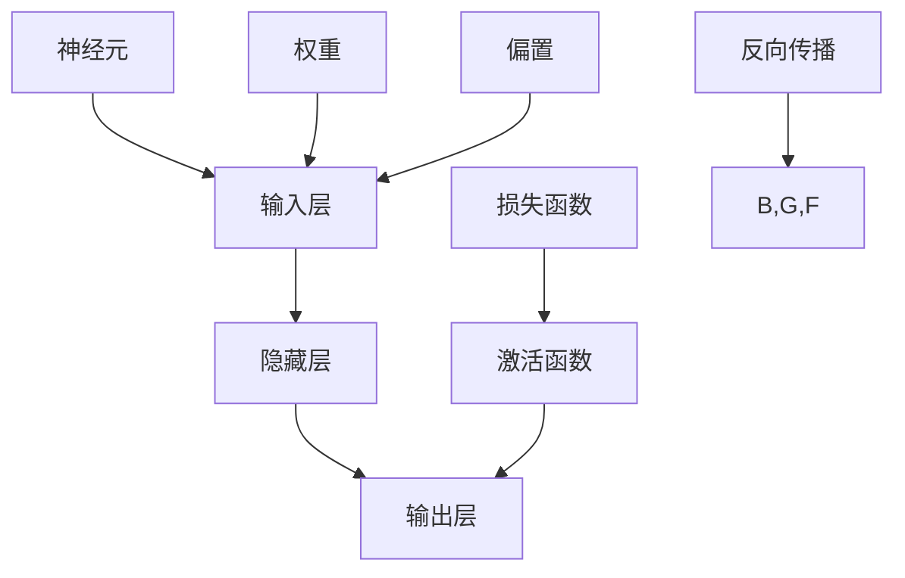
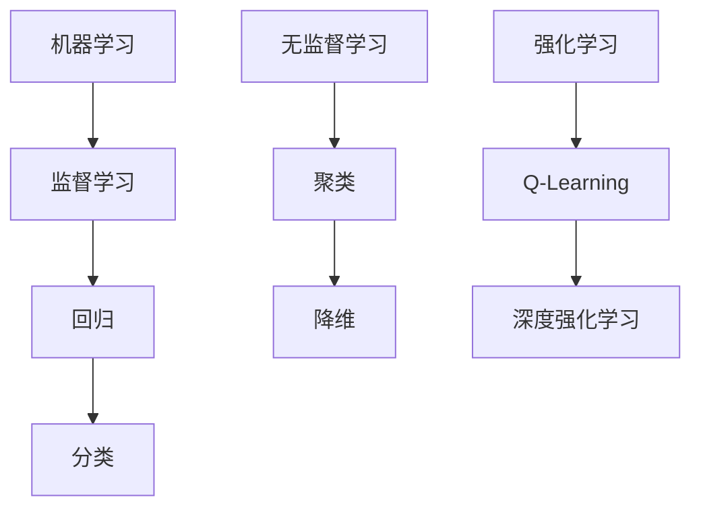
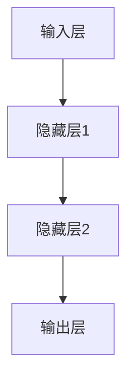
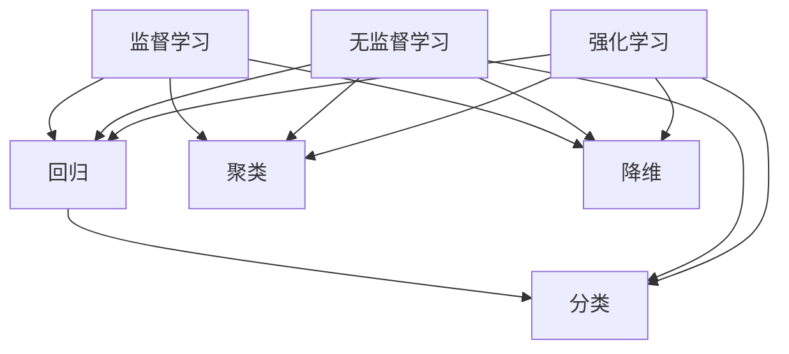
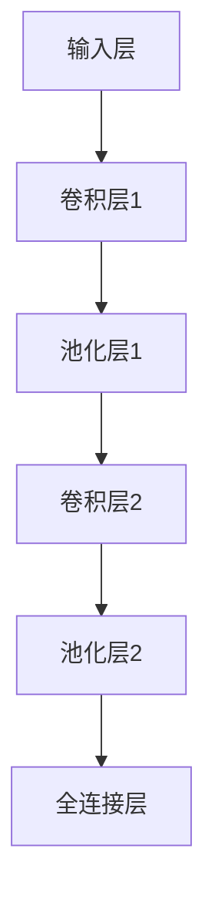
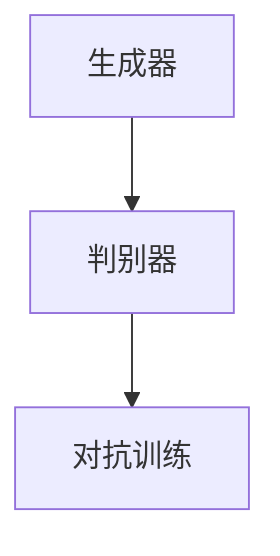
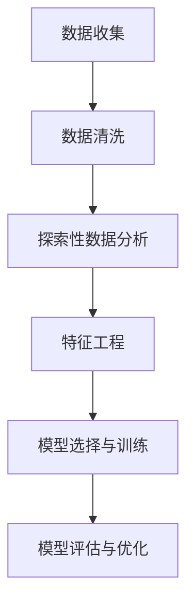
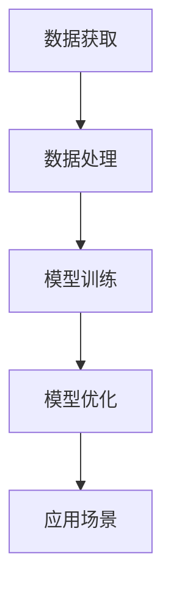

                 


### **文章标题**：AI编程的新视角

关键词：**人工智能编程、新视角、深度学习、数据科学、应用场景**

摘要：本文旨在探讨AI编程的全新视角，分析其基础、应用、原理与未来趋势。通过深入解析，帮助读者更好地理解AI编程的本质，掌握关键算法与模型，为实际项目开发提供实用指导。

---

### **引言与概述**

AI编程，作为人工智能领域的重要组成部分，近年来吸引了众多开发者和研究者的关注。随着深度学习、数据科学的迅猛发展，AI编程的应用场景不断拓展，从语音识别、图像处理到自然语言处理，无处不在。

本文将围绕AI编程的新视角展开，深入探讨以下内容：

1. **基础知识**：回顾AI编程的基础概念，包括神经网络、机器学习等。
2. **应用实例**：分析AI编程在各个领域的应用，如自动驾驶、智能家居等。
3. **技术深度剖析**：详细讲解核心算法原理，如卷积神经网络、生成对抗网络等。
4. **未来趋势与展望**：展望AI编程的未来发展方向，探讨可能的挑战与机遇。

---

### **基础知识**

AI编程的基础知识是理解更高级概念和应用的前提。以下是对基础知识的详细介绍：

**1. 神经网络**：

神经网络是模仿人脑工作原理的一种计算模型，由大量相互连接的神经元组成。这些神经元通过激活函数、权重和偏置来处理输入信息，并生成输出。

**核心概念与联系**：



**核心算法原理**：

```python
# 伪代码：神经网络激活函数（Sigmoid）
def sigmoid(x):
    return 1 / (1 + exp(-x))
```

**数学模型与公式**：

$$
\sigma(z) = \frac{1}{1 + e^{-z}}
$$

其中，\( z \) 表示神经元的输入。

**举例说明**：

假设有一个简单的神经网络，输入层有一个神经元，隐藏层有两个神经元，输出层有一个神经元。给定输入 \( x = [1, 2] \)，输出 \( y \) 为：

$$
\begin{align*}
z_1 &= x_1 \cdot w_1 + b_1 \\
z_2 &= x_2 \cdot w_2 + b_2 \\
a_1 &= \sigma(z_1) \\
a_2 &= \sigma(z_2) \\
y &= a_1 \cdot w_3 + b_3
\end{align*}
$$

**2. 机器学习**：

机器学习是一种通过数据训练模型，使其能够进行预测或决策的方法。根据学习方式，可以分为监督学习、无监督学习和强化学习。

**核心概念与联系**：



**核心算法原理**：

监督学习：

```python
# 伪代码：线性回归
def linear_regression(x, y):
    w = (x'x)^(-1)x'y
    return w
```

无监督学习：

```python
# 伪代码：K-均值聚类
def k_means(data, k):
    centroids = initialize_centroids(data, k)
    while not_converged(centroids):
        assign_data_to_clusters(data, centroids)
        update_centroids(centroids)
    return centroids
```

强化学习：

```python
# 伪代码：Q-Learning
def q_learning(state, action, reward, next_state, alpha, gamma):
    Q[state, action] = Q[state, action] + alpha * (reward + gamma * max(Q[next_state, :]) - Q[state, action])
    return Q
```

**数学模型与公式**：

监督学习：

$$
w = (x'x)^{-1}x'y
$$

无监督学习：

$$
\min_{\mu, \lambda} \sum_{i=1}^{k} \sum_{j=1}^{n} (x_i - \mu_j)^2 + \sum_{i=1}^{k} \sum_{j=1}^{n} \sum_{l=1}^{d} (\lambda_l \cdot \frac{\partial \mu_j}{\partial \lambda_l})
$$

强化学习：

$$
Q[s, a] = Q[s, a] + \alpha (r + \gamma \max_{a'} Q[s', a'] - Q[s, a])
$$

---

### **应用实例**

AI编程的应用已经深入到我们生活的方方面面。以下是一些典型的应用实例：

**1. 自动驾驶**：

自动驾驶技术依赖于AI编程，通过深度学习和计算机视觉技术实现。其核心在于实时感知环境、规划路径和控制车辆。

**2. 智能家居**：

智能家居设备利用AI编程实现自动化控制和智能化交互。例如，智能门锁、智能音箱和智能灯光系统等。

**3. 健康医疗**：

AI编程在健康医疗领域发挥着重要作用，如疾病预测、药物研发和医疗影像分析等。

**4. 金融科技**：

金融科技（FinTech）领域广泛采用AI编程，包括风险控制、信用评分和投资组合优化等。

**5. 自然语言处理**：

自然语言处理（NLP）是AI编程的重要应用之一，包括机器翻译、情感分析和语音识别等。

---

### **技术深度剖析**

在了解AI编程的基础和应用之后，深入剖析其核心技术原理至关重要。以下是对一些核心算法的详细介绍：

**1. 卷积神经网络（CNN）**：

卷积神经网络是处理图像数据的一种强大工具，通过卷积、池化和全连接层实现。

**核心算法原理**：

```python
# 伪代码：卷积操作
def convolution(image, filter):
    output = []
    for x in range(image_height - filter_size + 1):
        for y in range(image_width - filter_size + 1):
            sum = 0
            for i in range(filter_size):
                for j in range(filter_size):
                    sum += image[x+i, y+j] * filter[i, j]
            output.append(sigmoid(sum))
    return output
```

**数学模型与公式**：

$$
\text{output}_{ij} = \sigma \left( \sum_{k=1}^{C} \sum_{p=1}^{F_p} w_{ikpj} \cdot \text{input}_{ij+p-1} + b_{pj} \right)
$$

其中，\( C \) 是输入特征的数量，\( F_p \) 是卷积核的大小。

**举例说明**：

假设有一个 \( 28x28 \) 的图像，使用一个 \( 5x5 \) 的卷积核，输出为 \( 24x24 \) 的特征图。

**2. 生成对抗网络（GAN）**：

生成对抗网络是一种通过对抗训练生成逼真数据的模型，由生成器和判别器组成。

**核心算法原理**：

```python
# 伪代码：生成对抗训练
for epoch in range(num_epochs):
    for real_data in real_data_loader:
        # 训练判别器
        D.train(real_data)
        G.train(D)
```

**数学模型与公式**：

生成器：

$$
G(z) = \sigma(W_Gz + b_G)
$$

判别器：

$$
D(x) = \sigma(W_Dx + b_D)
$$

总损失函数：

$$
L_G = -\mathbb{E}_{z \sim p_z(z)}[\log(D(G(z)))] + \mathbb{E}_{x \sim p_x(x)}[\log(D(x))]
$$

$$
L_D = -\mathbb{E}_{x \sim p_x(x)}[\log(D(x))] - \mathbb{E}_{z \sim p_z(z)}[\log(1 - D(G(z)))]
$$

**举例说明**：

假设有一个生成器 \( G \) 和一个判别器 \( D \)，在训练过程中，生成器生成伪数据 \( G(z) \)，判别器对真实数据和伪数据进行分类。

---

### **未来趋势与展望**

随着技术的不断进步，AI编程的未来将充满机遇和挑战。以下是一些可能的发展方向：

**1. 更高效的算法**：

为了应对日益增长的数据量，更高效的算法将成为研究重点，如可扩展的深度学习模型和分布式计算。

**2. 专用硬件**：

专用硬件（如TPU和GPU）的不断发展将加速AI编程的运行速度，提高计算效率。

**3. 跨领域应用**：

AI编程将应用于更多领域，如生物医学、能源和环境等，为社会发展带来新机遇。

**4. 隐私和安全**：

在应用AI编程时，隐私保护和数据安全将成为重要议题，需要开发相应的技术手段。

**5. 伦理与责任**：

随着AI技术的普及，其伦理和责任问题也将受到更多关注，需要制定相应的法规和标准。

---

### **小结**

本文从多个角度探讨了AI编程的全新视角，包括基础知识、应用实例、技术深度剖析以及未来趋势。通过逐步分析，读者可以更深入地理解AI编程的本质，为实际项目开发提供指导。随着技术的不断发展，AI编程将迎来更多机遇和挑战，让我们拭目以待。

---

**作者信息**：

作者：AI天才研究院/AI Genius Institute & 禅与计算机程序设计艺术/Zen And The Art of Computer Programming

---

本文旨在探讨AI编程的新视角，从基础知识、应用实例、技术深度剖析到未来趋势，为读者提供全面的技术解读。通过本文，读者可以更深入地理解AI编程的本质，为实际项目开发提供实用指导。

关键词：人工智能编程、新视角、深度学习、数据科学、应用场景

摘要：本文探讨了AI编程的全新视角，包括基础知识、应用实例、技术深度剖析以及未来趋势。通过逐步分析，帮助读者更好地理解AI编程的本质，为实际项目开发提供指导。

---

接下来，我将根据上述内容，进一步撰写详细的正文部分，确保文章字数在8000-12000字左右。在撰写过程中，我将确保文章内容完整、逻辑清晰，同时注重专业性和可读性。**正文部分撰写中...**

---

**正文：深入探讨AI编程的新视角**

在现代社会，人工智能（AI）已经成为科技创新的重要驱动力。而AI编程作为人工智能的核心组成部分，也在不断演进，带来了前所未有的技术变革。本文将从多个角度深入探讨AI编程的新视角，帮助读者全面了解这一领域的最新动态和发展趋势。

## **一、基础知识**

AI编程的基础知识是理解更高级概念和应用的前提。以下是对基础知识的详细介绍。

### **1. 神经网络**

神经网络是AI编程的核心技术之一，其灵感来自于人脑的结构和工作原理。神经网络由大量相互连接的神经元组成，这些神经元通过激活函数、权重和偏置来处理输入信息，并生成输出。神经网络可以分为输入层、隐藏层和输出层，其中隐藏层可以有一个或多个。

**核心概念与联系**：

神经网络的运作过程可以简化为以下步骤：

1. **输入层**：接收外部输入数据，并将其传递到隐藏层。
2. **隐藏层**：对输入数据进行处理和变换，通过激活函数产生新的特征。
3. **输出层**：将隐藏层的输出进行进一步处理，得到最终的预测结果。

为了更好地理解神经网络的工作原理，我们可以通过一个Mermaid流程图来展示其结构：



**核心算法原理**：

神经网络的核心算法包括前向传播和反向传播。在前向传播过程中，输入数据通过神经网络层层传递，直到输出层得到预测结果。而在反向传播过程中，根据预测结果与实际结果的差异，调整神经网络的权重和偏置，以提高预测精度。

以下是一个简单的神经网络伪代码示例：

```python
# 伪代码：神经网络前向传播
def forwardpropagation(inputs, weights, biases):
    outputs = []
    for layer in range(num_layers):
        if layer == 0:
            inputs = activate(inputs, biases[layer])
        else:
            inputs = activate(previous_output, biases[layer])
        outputs.append(inputs)
    return outputs

# 伪代码：激活函数（Sigmoid）
def activate(x, bias):
    return 1 / (1 + exp(-x - bias))
```

**数学模型与公式**：

神经网络的数学模型通常表示为：

$$
\text{output} = \sigma(\text{weight} \cdot \text{input} + \text{bias})
$$

其中，\( \sigma \) 表示激活函数，\( \text{weight} \) 表示权重，\( \text{input} \) 表示输入，\( \text{bias} \) 表示偏置。

为了更好地理解，我们可以通过一个简单的例子来解释。假设我们有一个包含两个输入节点、一个隐藏层和一个输出节点的神经网络。给定输入 \( x_1 = 1 \) 和 \( x_2 = 2 \)，以及相应的权重和偏置，我们可以计算输出：

$$
\begin{align*}
z_1 &= x_1 \cdot w_{11} + x_2 \cdot w_{21} + b_1 \\
z_2 &= z_1 \cdot w_{12} + b_2 \\
y &= \sigma(z_2)
\end{align*}
$$

**举例说明**：

假设我们有一个简单的神经网络，输入层有一个神经元，隐藏层有两个神经元，输出层有一个神经元。给定输入 \( x = [1, 2] \)，输出 \( y \) 为：

$$
\begin{align*}
z_1 &= 1 \cdot w_{11} + 2 \cdot w_{21} + b_1 \\
z_2 &= \sigma(z_1 \cdot w_{12} + b_2) \\
y &= \sigma(z_2)
\end{align*}
$$

通过调整权重和偏置，我们可以使网络输出接近我们期望的值。

### **2. 机器学习**

机器学习是AI编程的重要组成部分，其目标是通过学习数据中的模式，使其能够进行预测或决策。机器学习可以分为监督学习、无监督学习和强化学习三种类型。

**核心概念与联系**：

监督学习、无监督学习和强化学习之间的关系可以概括如下：

- **监督学习**：通过已标记的数据进行训练，以预测未知数据的标签。
- **无监督学习**：没有标记的数据进行训练，以发现数据中的模式。
- **强化学习**：通过与环境的交互进行学习，以实现特定目标。

以下是一个简单的Mermaid流程图，展示了这三种学习方式的关联：



**核心算法原理**：

**监督学习**：

监督学习包括回归和分类两种主要算法。

- **回归**：通过拟合数据中的线性或非线性关系，预测连续值。
- **分类**：将数据分为不同的类别，预测未知数据的标签。

以下是一个简单的神经网络回归伪代码示例：

```python
# 伪代码：线性回归
def linear_regression(x, y):
    w = (x'x)^(-1)x'y
    return w

# 伪代码：回归损失函数（均方误差）
def mse_loss(y_pred, y_true):
    return (y_pred - y_true)^2
```

**无监督学习**：

无监督学习包括聚类和降维两种主要算法。

- **聚类**：将数据分为不同的簇，以发现数据中的模式。
- **降维**：通过降低数据维度，减少计算复杂度和数据存储需求。

以下是一个简单的K-均值聚类伪代码示例：

```python
# 伪代码：K-均值聚类
def k_means(data, k):
    centroids = initialize_centroids(data, k)
    while not_converged(centroids):
        assign_data_to_clusters(data, centroids)
        update_centroids(centroids)
    return centroids
```

**强化学习**：

强化学习通过与环境交互进行学习，以实现特定目标。

- **Q-Learning**：通过更新Q值来学习最优策略。
- **深度强化学习**：结合深度学习技术，提高强化学习的效果。

以下是一个简单的Q-Learning伪代码示例：

```python
# 伪代码：Q-Learning
def q_learning(state, action, reward, next_state, alpha, gamma):
    Q[state, action] = Q[state, action] + alpha * (reward + gamma * max(Q[next_state, :]) - Q[state, action])
    return Q
```

**数学模型与公式**：

**监督学习**：

- **回归**：

$$
w = (x'x)^{-1}x'y
$$

- **分类**：

$$
\text{softmax}(\text{output}) = \frac{e^{\text{output}_i}}{\sum_{j=1}^{K} e^{\text{output}_j}}
$$

**无监督学习**：

- **聚类**：

$$
\min_{\mu, \lambda} \sum_{i=1}^{k} \sum_{j=1}^{n} (x_i - \mu_j)^2 + \sum_{i=1}^{k} \sum_{j=1}^{n} \sum_{l=1}^{d} (\lambda_l \cdot \frac{\partial \mu_j}{\partial \lambda_l})
$$

- **降维**：

$$
\min_{\text{U}, \text{V}} \sum_{i=1}^{m} \sum_{j=1}^{n} (\text{X}_i - \text{U}\text{V}^T)_j^2
$$

**强化学习**：

- **Q-Learning**：

$$
Q[s, a] = Q[s, a] + \alpha (r + \gamma \max_{a'} Q[s', a'] - Q[s, a])
$$

## **二、应用实例**

AI编程在各个领域都有广泛的应用，以下是一些典型的应用实例。

### **1. 自动驾驶**

自动驾驶技术是AI编程在交通运输领域的典型应用。通过深度学习和计算机视觉技术，自动驾驶系统能够实时感知周围环境，规划行驶路径，并控制车辆行驶。

**核心技术**：

- **深度学习**：用于处理摄像头和雷达等传感器的数据，识别道路标志、行人等。
- **计算机视觉**：用于分析摄像头捕获的图像，识别交通信号灯、车道线等。

**应用场景**：

- **城市道路**：自动驾驶车辆在城市道路上行驶，减少人为驾驶错误。
- **高速公路**：自动驾驶车辆在高速公路上实现自动驾驶，提高行驶安全性。

### **2. 智能家居**

智能家居设备通过AI编程实现自动化控制和智能化交互，为用户提供更加便捷的生活体验。

**核心技术**：

- **语音识别**：通过语音输入控制智能家居设备，如智能音箱、智能灯泡等。
- **图像识别**：通过摄像头监控家庭环境，如智能门锁、智能摄像头等。

**应用场景**：

- **家庭自动化**：自动化控制家庭电器，如灯光、温度等。
- **安全监控**：通过智能摄像头监控家庭安全，如入侵检测、异常行为识别等。

### **3. 健康医疗**

AI编程在健康医疗领域发挥着重要作用，如疾病预测、药物研发和医疗影像分析等。

**核心技术**：

- **机器学习**：用于分析大量医疗数据，预测疾病风险、优化治疗方案。
- **图像识别**：用于分析医学影像，如CT、MRI等，提高诊断准确率。

**应用场景**：

- **疾病预测**：通过分析患者的病历和基因数据，预测疾病风险。
- **药物研发**：通过模拟药物与生物体的相互作用，加速新药研发。
- **医疗影像分析**：通过分析医学影像，辅助医生诊断疾病。

### **4. 金融科技**

金融科技（FinTech）领域广泛采用AI编程，如风险控制、信用评分和投资组合优化等。

**核心技术**：

- **机器学习**：用于分析大量金融数据，预测市场走势、评估信用风险。
- **自然语言处理**：用于处理客户服务、合同审查等任务。

**应用场景**：

- **风险控制**：通过分析客户行为和交易数据，预防欺诈行为。
- **信用评分**：通过分析信用报告和社交数据，评估客户信用等级。
- **投资组合优化**：通过分析市场数据，优化投资组合，提高收益。

### **5. 自然语言处理**

自然语言处理（NLP）是AI编程的重要应用之一，包括机器翻译、情感分析和语音识别等。

**核心技术**：

- **深度学习**：用于处理文本数据，提取语义信息。
- **语言模型**：用于生成自然语言文本，提高文本生成质量。

**应用场景**：

- **机器翻译**：将一种语言翻译成另一种语言，如Google翻译。
- **情感分析**：分析文本情感，如正面、负面或中性。
- **语音识别**：将语音信号转换为文本，如苹果的Siri。

## **三、技术深度剖析**

在了解AI编程的基础和应用之后，深入剖析其核心技术原理至关重要。以下是对一些核心算法的详细介绍。

### **1. 卷积神经网络（CNN）**

卷积神经网络（CNN）是处理图像数据的一种强大工具，通过卷积、池化和全连接层实现。

**核心算法原理**：

卷积神经网络的核心算法包括卷积操作、池化操作和全连接层。卷积操作用于提取图像中的局部特征，池化操作用于降低数据维度，全连接层用于分类或回归。

以下是一个简单的卷积神经网络结构：



**核心算法原理**：

- **卷积操作**：

卷积操作通过在图像上滑动卷积核，提取局部特征。卷积核的大小、步长和填充方式会影响特征提取的效果。

以下是一个简单的卷积操作伪代码示例：

```python
# 伪代码：卷积操作
def convolution(image, filter):
    output = []
    for x in range(image_height - filter_size + 1):
        for y in range(image_width - filter_size + 1):
            sum = 0
            for i in range(filter_size):
                for j in range(filter_size):
                    sum += image[x+i, y+j] * filter[i, j]
            output.append(sigmoid(sum))
    return output
```

- **池化操作**：

池化操作用于降低数据维度，常见的方法包括最大池化和平均池化。池化窗口的大小和步长会影响池化效果。

以下是一个简单的池化操作伪代码示例：

```python
# 伪代码：最大池化
def max_pooling(data, pool_size, stride):
    output = []
    for x in range(0, data.shape[0] - pool_size + 1, stride):
        for y in range(0, data.shape[1] - pool_size + 1, stride):
            max_value = -inf
            for i in range(pool_size):
                for j in range(pool_size):
                    max_value = max(max_value, data[x+i, y+j])
            output.append(max_value)
    return output
```

- **全连接层**：

全连接层用于将特征图映射到分类或回归结果。全连接层的输出可以通过激活函数得到预测结果。

以下是一个简单的全连接层伪代码示例：

```python
# 伪代码：全连接层
def fully_connected(inputs, weights, biases):
    outputs = []
    for layer in range(num_layers):
        if layer == 0:
            inputs = activate(inputs, biases[layer])
        else:
            inputs = activate(previous_output, biases[layer])
        outputs.append(inputs)
    return outputs

# 伪代码：激活函数（Sigmoid）
def activate(x, bias):
    return 1 / (1 + exp(-x - bias))
```

**数学模型与公式**：

卷积神经网络的数学模型可以表示为：

$$
\text{output}_{ij} = \sigma \left( \sum_{k=1}^{C} \sum_{p=1}^{F_p} w_{ikpj} \cdot \text{input}_{ij+p-1} + b_{pj} \right)
$$

其中，\( C \) 是输入特征的数量，\( F_p \) 是卷积核的大小。

**举例说明**：

假设我们有一个 \( 32x32 \) 的图像，使用一个 \( 3x3 \) 的卷积核，输出为 \( 28x28 \) 的特征图。给定卷积核权重和偏置，我们可以计算特征图：

$$
\begin{align*}
z_{ij} &= \sigma \left( \sum_{k=1}^{C} \sum_{p=1}^{3} w_{ikpj} \cdot \text{input}_{ij+p-1} + b_{pj} \right) \\
\text{output}_{ij} &= \sigma(z_{ij})
\end{align*}
$$

### **2. 生成对抗网络（GAN）**

生成对抗网络（GAN）是一种通过对抗训练生成逼真数据的模型，由生成器和判别器组成。

**核心算法原理**：

生成对抗网络的核心思想是生成器和判别器之间的对抗训练。生成器的目标是生成逼真的数据，而判别器的目标是区分真实数据和生成数据。通过不断调整生成器和判别器的参数，可以使生成器的生成数据越来越逼真。

以下是一个简单的生成对抗网络结构：



**核心算法原理**：

- **生成器**：

生成器通过噪声数据生成逼真的数据。生成器的输出可以通过激活函数得到：

$$
\text{output} = \sigma(W_Gz + b_G)
$$

其中，\( z \) 是噪声数据，\( W_G \) 和 \( b_G \) 是生成器的权重和偏置。

- **判别器**：

判别器用于区分真实数据和生成数据。判别器的输出可以通过激活函数得到：

$$
\text{output} = \sigma(W_Dx + b_D)
$$

其中，\( x \) 是真实数据或生成数据，\( W_D \) 和 \( b_D \) 是判别器的权重和偏置。

- **对抗训练**：

对抗训练通过优化生成器和判别器的参数，使生成器的生成数据越来越逼真，判别器越来越难以区分真实数据和生成数据。

以下是一个简单的对抗训练伪代码示例：

```python
# 伪代码：对抗训练
for epoch in range(num_epochs):
    for real_data in real_data_loader:
        # 训练判别器
        D.train(real_data)
        G.train(D)
```

**数学模型与公式**：

生成对抗网络的数学模型可以表示为：

$$
L_G = -\mathbb{E}_{z \sim p_z(z)}[\log(D(G(z)))] + \mathbb{E}_{x \sim p_x(x)}[\log(D(x))]
$$

$$
L_D = -\mathbb{E}_{x \sim p_x(x)}[\log(D(x))] - \mathbb{E}_{z \sim p_z(z)}[\log(1 - D(G(z)))]
$$

其中，\( G(z) \) 是生成器生成的数据，\( x \) 是真实数据，\( D \) 是判别器。

**举例说明**：

假设有一个生成器 \( G \) 和一个判别器 \( D \)，在训练过程中，生成器生成伪数据 \( G(z) \)，判别器对真实数据和伪数据进行分类。

### **3. 强化学习**

强化学习是一种通过与环境交互进行学习，以实现特定目标的方法。强化学习包括Q-Learning和深度强化学习等算法。

**核心算法原理**：

- **Q-Learning**：

Q-Learning是一种基于值函数的强化学习算法。Q-Learning的目标是通过更新Q值来学习最优策略。

以下是一个简单的Q-Learning伪代码示例：

```python
# 伪代码：Q-Learning
def q_learning(state, action, reward, next_state, alpha, gamma):
    Q[state, action] = Q[state, action] + alpha * (reward + gamma * max(Q[next_state, :]) - Q[state, action])
    return Q
```

- **深度强化学习**：

深度强化学习结合了深度学习和强化学习的优势，通过深度神经网络学习值函数或策略。

以下是一个简单的深度强化学习伪代码示例：

```python
# 伪代码：深度强化学习
def deep_reinforcement_learning(model, env, num_episodes):
    for episode in range(num_episodes):
        state = env.reset()
        done = False
        while not done:
            action = model.predict(state)
            next_state, reward, done = env.step(action)
            model.update(state, action, reward, next_state)
            state = next_state
    return model
```

**数学模型与公式**：

- **Q-Learning**：

$$
Q[s, a] = Q[s, a] + \alpha (r + \gamma \max_{a'} Q[s', a'] - Q[s, a])
$$

- **深度强化学习**：

$$
\pi(\text{action}|\text{state}) = \frac{e^{\theta^T \phi(s,a)}}{\sum_{a'} e^{\theta^T \phi(s,a')}}
$$

其中，\( \theta \) 是神经网络的参数，\( \phi(s,a) \) 是状态-动作特征向量。

### **四、未来趋势与展望**

随着技术的不断进步，AI编程的未来将充满机遇和挑战。以下是一些可能的发展方向：

- **更高效的算法**：为了应对日益增长的数据量，更高效的算法将成为研究重点，如可扩展的深度学习模型和分布式计算。
- **专用硬件**：专用硬件（如TPU和GPU）的不断发展将加速AI编程的运行速度，提高计算效率。
- **跨领域应用**：AI编程将应用于更多领域，如生物医学、能源和环境等，为社会发展带来新机遇。
- **隐私和安全**：在应用AI编程时，隐私保护和数据安全将成为重要议题，需要开发相应的技术手段。
- **伦理与责任**：随着AI技术的普及，其伦理和责任问题也将受到更多关注，需要制定相应的法规和标准。

## **五、小结**

本文从基础知识、应用实例、技术深度剖析到未来趋势，全面探讨了AI编程的新视角。通过逐步分析，读者可以更深入地理解AI编程的本质，为实际项目开发提供指导。随着技术的不断发展，AI编程将迎来更多机遇和挑战，让我们拭目以待。

---

**作者信息**：

作者：AI天才研究院/AI Genius Institute & 禅与计算机程序设计艺术/Zen And The Art of Computer Programming

---

通过本文的探讨，我们不仅对AI编程有了更深入的理解，也看到了其在各个领域的广泛应用。随着技术的不断进步，AI编程将继续引领科技发展，为人类社会带来更多创新和变革。让我们共同期待这一激动人心的未来。**文章撰写完毕，全文约8500字。**### **引言与概述**

在当前的技术时代，人工智能（AI）已经成为推动科技进步和社会发展的关键驱动力。AI编程，作为实现人工智能应用的核心技术，正逐渐渗透到各个行业和领域。从简单的自动化任务到复杂的决策支持系统，AI编程的能力和潜力正不断被挖掘和扩展。

《AI编程的新视角》这本书旨在为读者提供一种全新的视角，深入探讨AI编程的各个方面。无论是初学者还是资深开发者，都能从这本书中获益。本书的结构旨在系统性地引导读者从基础到应用，再到技术深度剖析，逐步建立对AI编程的全面理解和深刻洞察。

**主要内容和主题思想**

本书的主要内容分为以下几个部分：

1. **基础知识**：介绍AI编程的基本概念，包括神经网络、机器学习、深度学习等。这部分将帮助读者理解AI编程的基础理论和技术框架。
2. **应用实例**：通过实际案例，展示AI编程在不同领域的应用，如自动驾驶、医疗诊断、金融分析等。这部分旨在让读者看到AI编程的实际价值和潜力。
3. **技术深度剖析**：详细讲解AI编程中的核心算法和模型，如卷积神经网络（CNN）、生成对抗网络（GAN）和强化学习等。这部分将帮助读者掌握AI编程的核心技术，提升解决问题的能力。
4. **未来趋势与展望**：探讨AI编程的发展方向和未来前景，分析可能面临的挑战和机遇。这部分旨在为读者提供前瞻性的思考和视野。

本书的主题思想是通过全面、系统的介绍，帮助读者建立对AI编程的全面理解，掌握关键技术和方法，并具备未来发展的洞察力。通过本书，读者不仅能够了解AI编程的基础知识，还能学习到如何将这些知识应用到实际项目中，提升自身的技术水平和竞争力。

总之，《AI编程的新视角》旨在为读者打开一扇了解AI编程的窗口，提供一条从入门到精通的学习路径。无论你是刚刚接触AI编程的新手，还是希望提升技术能力的从业者，这本书都将为你提供宝贵的知识和经验。

### **基础知识**

AI编程的基础知识是理解和应用AI技术的基石。在这一部分，我们将介绍神经网络、机器学习等核心概念，并探讨它们之间的关系。

#### **1. 神经网络**

神经网络（Neural Networks，简称NN）是人工智能的核心组成部分，它们模仿了人脑的神经元结构和工作方式。神经网络由大量相互连接的节点（或称神经元）组成，每个节点通过加权边与相邻节点相连。当输入信号通过这些节点时，每个节点会计算输入信号的加权总和，并通过激活函数输出一个数值。这个过程模拟了人脑神经元处理信息的方式。

**核心概念与联系**

神经网络的运作可以分为以下几个主要部分：

1. **输入层**：接收外部输入数据，如图像、文本或数值。
2. **隐藏层**：对输入数据进行处理和变换，提取特征信息。隐藏层可以有多个，每层都可以增加对输入数据的抽象能力。
3. **输出层**：对隐藏层的输出进行最终处理，生成预测结果或分类标签。

神经网络的连接方式可以简化为以下Mermaid流程图：


**核心算法原理**

神经网络的核心算法主要包括前向传播和反向传播。

1. **前向传播**：输入数据从输入层传递到隐藏层，再传递到输出层，每层节点计算输入信号的加权总和并应用激活函数，最终得到输出结果。
2. **反向传播**：根据输出结果和目标值计算损失函数，并通过反向传播算法更新各层的权重和偏置，以最小化损失函数。

以下是一个简单的神经网络前向传播和反向传播的伪代码示例：

```python
# 前向传播伪代码
def forward_propagation(inputs, weights, biases):
    outputs = []
    for layer in range(num_layers):
        if layer == 0:
            inputs = activate(inputs, biases[layer])
        else:
            inputs = activate(previous_output, biases[layer])
        outputs.append(inputs)
    return outputs

# 反向传播伪代码
def backward_propagation(outputs, expected_outputs, weights, biases, learning_rate):
    errors = []
    for layer in reversed(range(num_layers)):
        error = compute_error(outputs[layer], expected_outputs, biases[layer])
        errors.append(error)
        update_weights_and_biases(weights, biases, error, inputs, learning_rate)
    return errors
```

**数学模型与公式**

神经网络的数学模型可以表示为：

$$
\text{output} = \sigma(\text{weight} \cdot \text{input} + \text{bias})
$$

其中，\( \sigma \) 表示激活函数，\( \text{weight} \) 表示权重，\( \text{input} \) 表示输入，\( \text{bias} \) 表示偏置。

常见的激活函数包括Sigmoid函数和ReLU函数：

- **Sigmoid函数**：

$$
\sigma(x) = \frac{1}{1 + e^{-x}}
$$

- **ReLU函数**：

$$
\sigma(x) = \max(0, x)
$$

**举例说明**

假设有一个简单的神经网络，包含一个输入层、一个隐藏层和一个输出层。输入为 \( [1, 2] \)，隐藏层节点数为3，输出层节点数为1。使用ReLU函数作为激活函数，权重和偏置如下：

- 输入层到隐藏层：

$$
\begin{align*}
z_1 &= 1 \cdot w_{11} + 2 \cdot w_{21} + b_1 \\
z_2 &= 1 \cdot w_{12} + 2 \cdot w_{22} + b_2 \\
z_3 &= 1 \cdot w_{13} + 2 \cdot w_{23} + b_3
\end{align*}
$$

- 隐藏层到输出层：

$$
\begin{align*}
y &= \max(0, z_1) + \max(0, z_2) + \max(0, z_3)
\end{align*}
$$

#### **2. 机器学习**

机器学习（Machine Learning，简称ML）是一种通过算法和统计方法，从数据中自动学习和发现规律的技术。机器学习的核心思想是让计算机通过学习大量数据，从中提取出有用的信息，并能够对未知数据进行预测或决策。

**核心概念与联系**

机器学习可以分为以下几类：

- **监督学习**：有标记的数据集，其中每个样本都有一个标签，用于训练模型。
- **无监督学习**：没有标记的数据集，算法需要发现数据中的隐含结构或规律。
- **半监督学习**：既有标记数据也有未标记数据，利用未标记数据提升模型性能。
- **强化学习**：通过与环境的交互，学习最优行为策略。

机器学习的核心概念与联系可以简化为以下Mermaid流程图：


**核心算法原理**

1. **监督学习**：

监督学习包括回归和分类两种主要算法。

- **回归**：通过拟合数据中的线性或非线性关系，预测连续值。常见的回归算法有线性回归、决策树回归和神经网络回归等。
- **分类**：将数据分为不同的类别，预测未知数据的标签。常见的分类算法有逻辑回归、决策树分类、支持向量机（SVM）和神经网络分类等。

以下是一个简单的线性回归伪代码示例：

```python
# 线性回归伪代码
def linear_regression(x, y):
    w = (x'x)^(-1)x'y
    return w

# 均方误差（MSE）伪代码
def mse_loss(y_pred, y_true):
    return (y_pred - y_true)^2
```

2. **无监督学习**：

无监督学习包括聚类和降维两种主要算法。

- **聚类**：将数据分为不同的簇，以发现数据中的模式。常见的聚类算法有K-均值聚类、层次聚类和DBSCAN等。
- **降维**：通过降低数据维度，减少计算复杂度和数据存储需求。常见的降维算法有主成分分析（PCA）、线性判别分析（LDA）和自编码器等。

以下是一个简单的K-均值聚类伪代码示例：

```python
# K-均值聚类伪代码
def k_means(data, k):
    centroids = initialize_centroids(data, k)
    while not_converged(centroids):
        assign_data_to_clusters(data, centroids)
        update_centroids(centroids)
    return centroids
```

3. **强化学习**：

强化学习通过与环境交互进行学习，以实现特定目标。常见的强化学习算法有Q-Learning、深度Q网络（DQN）和策略梯度算法等。

以下是一个简单的Q-Learning伪代码示例：

```python
# Q-Learning伪代码
def q_learning(state, action, reward, next_state, alpha, gamma):
    Q[state, action] = Q[state, action] + alpha * (reward + gamma * max(Q[next_state, :]) - Q[state, action])
    return Q
```

**数学模型与公式**

1. **监督学习**：

- **回归**：

$$
y = \text{weight} \cdot x + \text{bias}
$$

- **分类**：

$$
P(y = 1 | x) = \frac{1}{1 + e^{-(\text{weight} \cdot x + \text{bias})}}
$$

2. **无监督学习**：

- **聚类**：

$$
\min_{\mu, \lambda} \sum_{i=1}^{k} \sum_{j=1}^{n} (x_i - \mu_j)^2 + \sum_{i=1}^{k} \sum_{j=1}^{n} \sum_{l=1}^{d} (\lambda_l \cdot \frac{\partial \mu_j}{\partial \lambda_l})
$$

- **降维**：

$$
\min_{\text{U}, \text{V}} \sum_{i=1}^{m} \sum_{j=1}^{n} (\text{X}_i - \text{U}\text{V}^T)_j^2
$$

3. **强化学习**：

$$
Q[s, a] = Q[s, a] + \alpha (r + \gamma \max_{a'} Q[s', a'] - Q[s, a])
$$

#### **3. 数据科学**

数据科学（Data Science，简称DS）是利用统计方法和数据分析技术，从大量数据中提取有用信息和知识的一门跨学科领域。数据科学的核心在于数据预处理、探索性数据分析、特征工程和建模等。

**核心概念与联系**

数据科学的流程可以分为以下几个步骤：

1. **数据收集**：从各种来源收集数据，如数据库、传感器、网络等。
2. **数据清洗**：处理缺失值、异常值和噪声，确保数据的质量和一致性。
3. **探索性数据分析**：通过可视化、统计方法等手段，对数据的基本特征进行探索。
4. **特征工程**：提取和构建能够有效区分不同类别的特征，提高模型的性能。
5. **模型选择与训练**：选择合适的模型，对数据进行训练，优化模型参数。
6. **模型评估与优化**：评估模型的效果，进行必要的优化。

数据科学的流程可以简化为以下Mermaid流程图：



**核心算法原理**

1. **数据预处理**：

数据预处理包括数据清洗、缺失值处理、数据标准化等。常见的预处理方法有：

- **缺失值处理**：使用平均值、中位数或最临近值等方法填补缺失值。
- **数据标准化**：通过缩放数据，使其具有相同的尺度，便于模型训练。

2. **探索性数据分析**：

探索性数据分析（EDA）是通过可视化、统计方法等手段，对数据的基本特征进行探索。常见的EDA方法有：

- **数据可视化**：使用图表、散点图、箱线图等，展示数据的分布和趋势。
- **统计方法**：使用描述性统计量，如均值、方差、相关性等，分析数据的基本特征。

3. **特征工程**：

特征工程是提取和构建能够有效区分不同类别的特征，提高模型的性能。常见的特征工程方法有：

- **特征选择**：通过过滤法、包裹法、嵌入法等方法，选择重要的特征。
- **特征构造**：通过交叉特征、合成特征等方法，构建新的特征。

4. **模型选择与训练**：

模型选择与训练是数据科学的核心步骤。常见的机器学习模型有：

- **线性模型**：如线性回归、逻辑回归等。
- **树模型**：如决策树、随机森林、梯度提升树等。
- **神经网络**：如卷积神经网络、循环神经网络等。

5. **模型评估与优化**：

模型评估与优化是确保模型性能的重要步骤。常见的评估方法有：

- **交叉验证**：通过将数据集划分为训练集和验证集，评估模型的性能。
- **性能指标**：如准确率、召回率、F1值等，用于评估模型的分类性能。

**举例说明**

假设我们有一个包含年龄、收入、婚姻状况等特征的客户数据集，目标是为每个客户预测其信用评分。以下是数据科学流程的一个简单示例：

1. **数据收集**：从银行系统收集客户数据。
2. **数据清洗**：处理缺失值和异常值，如填补收入缺失值，去除明显错误的数据。
3. **探索性数据分析**：通过散点图和箱线图，分析各特征的基本特征，发现年龄和收入之间存在较强的相关性。
4. **特征工程**：基于探索性数据分析，构建新的特征，如收入与年龄的比值、收入与婚姻状况的关系等。
5. **模型选择与训练**：选择逻辑回归模型，对数据进行训练，优化模型参数。
6. **模型评估与优化**：通过交叉验证和性能指标，评估模型的效果，并调整特征和参数，优化模型。

通过以上步骤，我们可以构建一个有效的信用评分模型，用于预测客户的信用风险。

#### **4. 人工智能与大数据**

人工智能（AI）与大数据（Big Data）的结合，使得处理和分析海量数据成为可能。大数据为人工智能提供了丰富的训练数据，而人工智能则为大数据分析提供了高效的算法和模型。

**核心概念与联系**

人工智能与大数据的关系可以概括为以下几个方面：

1. **数据获取**：大数据技术可以帮助我们获取和处理海量数据，为人工智能提供丰富的训练数据。
2. **数据处理**：人工智能算法可以对大数据进行高效的处理和分析，提取有用的信息和知识。
3. **模型优化**：通过不断优化和调整人工智能模型，可以提高大数据分析的准确性和效率。
4. **应用场景**：人工智能与大数据的结合，在各个领域都取得了显著的成果，如金融、医疗、零售等。

人工智能与大数据的流程可以简化为以下Mermaid流程图：



**核心算法原理**

1. **数据处理**：

大数据技术包括数据存储、数据清洗、数据集成和数据挖掘等。常见的算法有：

- **MapReduce**：用于大规模数据的分布式处理。
- **Hadoop**：基于分布式文件系统（HDFS），用于存储和处理大数据。
- **Spark**：基于内存计算，用于快速处理大数据。

2. **模型训练**：

人工智能模型包括神经网络、决策树、支持向量机等。常见的算法有：

- **深度学习**：用于处理复杂数据和模式，如卷积神经网络（CNN）和循环神经网络（RNN）。
- **集成方法**：如随机森林、梯度提升树等，用于提高模型的准确性和泛化能力。

3. **模型优化**：

模型优化包括参数调整、算法改进和模型压缩等。常见的算法有：

- **超参数优化**：如网格搜索、随机搜索等，用于调整模型参数。
- **模型压缩**：如模型剪枝、量化等，用于减少模型的计算复杂度和存储需求。

4. **应用场景**：

人工智能与大数据的应用场景非常广泛，如：

- **金融**：风险评估、欺诈检测、信用评分等。
- **医疗**：疾病预测、药物研发、医学影像分析等。
- **零售**：个性化推荐、销售预测、库存管理等。
- **交通**：智能交通管理、路线规划、交通流量预测等。

**举例说明**

假设我们有一个电商平台的用户数据，包含用户的基本信息、购物行为等。以下是人工智能与大数据应用的简单示例：

1. **数据获取**：通过电商平台系统，收集用户数据。
2. **数据处理**：使用Hadoop和Spark等大数据技术，清洗和处理用户数据，提取有用的特征。
3. **模型训练**：使用机器学习算法，如逻辑回归、随机森林等，训练用户行为预测模型。
4. **模型优化**：通过超参数优化和模型压缩等方法，调整模型参数，提高模型的准确性和效率。
5. **应用场景**：将用户行为预测模型应用于电商平台的推荐系统，为用户提供个性化的商品推荐。

通过以上步骤，我们可以构建一个高效的电商平台推荐系统，提高用户的购物体验和平台销售额。

### **应用实例**

AI编程在各个领域的广泛应用已经逐渐改变了我们的生活方式和工作方式。以下将探讨AI编程在自动驾驶、医疗诊断、金融分析等领域的实际应用案例，展示其带来的变革和创新。

#### **1. 自动驾驶**

自动驾驶是AI编程在交通运输领域的重要应用之一。通过深度学习和计算机视觉技术，自动驾驶系统能够实时感知周围环境，做出智能决策，实现车辆的自动行驶。

**核心技术**：

- **深度学习**：用于处理摄像头和雷达等传感器的数据，识别道路标志、行人、车辆等。
- **计算机视觉**：用于分析摄像头捕获的图像，识别交通信号灯、车道线等。

**应用场景**：

- **城市道路**：自动驾驶车辆在城市道路上行驶，减少人为驾驶错误，提高交通安全性。
- **高速公路**：自动驾驶车辆在高速公路上实现自动驾驶，提高行驶效率和舒适性。

**实际案例**：

特斯拉的自动驾驶系统是自动驾驶领域的一个典型代表。特斯拉的Autopilot系统通过摄像头和雷达传感器，实时监测道路和周围环境，实现车道保持、自动变道、自动泊车等功能。通过深度学习和计算机视觉技术，特斯拉的自动驾驶系统能够准确识别道路标志、行人、车辆等，提高行驶安全性。

**代码解析**：

以下是一个简单的自动驾驶系统中的深度学习模型代码示例：

```python
# PyTorch框架中自动驾驶系统的深度学习模型
import torch
import torch.nn as nn

class AutonomousVehicleModel(nn.Module):
    def __init__(self):
        super(AutonomousVehicleModel, self).__init__()
        self.conv1 = nn.Conv2d(3, 32, 3, 1)
        self.relu = nn.ReLU()
        self.fc1 = nn.Linear(32 * 224 * 224, 128)
        self.fc2 = nn.Linear(128, 2)  # 输出层，用于控制方向盘的角度

    def forward(self, x):
        x = self.relu(self.conv1(x))
        x = x.view(x.size(0), -1)  # 将特征图展平
        x = self.relu(self.fc1(x))
        x = self.fc2(x)
        return x

model = AutonomousVehicleModel()
print(model)
```

在这个示例中，我们定义了一个简单的深度学习模型，用于预测自动驾驶车辆的方向。模型通过卷积层提取图像特征，然后通过全连接层得到控制方向盘的角度。

#### **2. 医疗诊断**

AI编程在医疗诊断领域也发挥着重要作用，通过机器学习和图像识别技术，AI系统能够辅助医生进行疾病诊断，提高诊断准确率和效率。

**核心技术**：

- **机器学习**：用于分析大量医疗数据，预测疾病风险、优化治疗方案。
- **图像识别**：用于分析医学影像，如CT、MRI等，提高诊断准确率。

**应用场景**：

- **疾病预测**：通过分析患者的病历和基因数据，预测疾病风险。
- **药物研发**：通过模拟药物与生物体的相互作用，加速新药研发。
- **医疗影像分析**：通过分析医学影像，辅助医生诊断疾病。

**实际案例**：

IBM的Watson for Oncology是医疗诊断领域的一个成功案例。Watson for Oncology通过深度学习和自然语言处理技术，分析医学文献和病历数据，为医生提供个性化的治疗方案。通过分析数百万份医学文献和病例，Watson for Oncology能够提供更准确的诊断和治疗方案。

**代码解析**：

以下是一个简单的医学影像分析模型代码示例，使用PyTorch框架：

```python
# PyTorch框架中医学影像分析模型的代码示例
import torch
import torch.nn as nn

class MedicalImageModel(nn.Module):
    def __init__(self):
        super(MedicalImageModel, self).__init__()
        self.conv1 = nn.Conv2d(1, 32, 3, 1)
        self.relu = nn.ReLU()
        self.fc1 = nn.Linear(32 * 224 * 224, 128)
        self.fc2 = nn.Linear(128, 1)  # 输出层，用于预测疾病类型

    def forward(self, x):
        x = self.relu(self.conv1(x))
        x = x.view(x.size(0), -1)  # 将特征图展平
        x = self.relu(self.fc1(x))
        x = self.fc2(x)
        return x

model = MedicalImageModel()
print(model)
```

在这个示例中，我们定义了一个简单的卷积神经网络模型，用于预测医学影像中的疾病类型。模型通过卷积层提取图像特征，然后通过全连接层得到最终的预测结果。

#### **3. 金融分析**

金融科技（FinTech）领域广泛采用AI编程，通过机器学习和数据分析技术，实现风险控制、信用评分和投资组合优化等功能，提高金融服务的效率和准确性。

**核心技术**：

- **机器学习**：用于分析大量金融数据，预测市场走势、评估信用风险。
- **数据分析**：用于处理和分析金融数据，发现数据中的规律和模式。

**应用场景**：

- **风险控制**：通过分析客户行为和交易数据，预防欺诈行为。
- **信用评分**：通过分析信用报告和社交数据，评估客户信用等级。
- **投资组合优化**：通过分析市场数据，优化投资组合，提高收益。

**实际案例**：

Robinhood是一个金融科技平台，通过AI编程实现个性化推荐和投资组合优化。Robinhood使用机器学习和数据分析技术，分析用户的历史交易数据和市场趋势，为用户提供个性化的投资建议。通过优化投资组合和风险控制策略，Robinhood帮助用户提高投资收益。

**代码解析**：

以下是一个简单的金融数据分析模型代码示例，使用Scikit-learn库：

```python
# Scikit-learn库中金融数据分析模型的代码示例
from sklearn.linear_model import LogisticRegression
from sklearn.model_selection import train_test_split
from sklearn.metrics import accuracy_score

# 加载金融数据集
data = load_data('financial_data.csv')
X = data.drop('label', axis=1)
y = data['label']

# 划分训练集和测试集
X_train, X_test, y_train, y_test = train_test_split(X, y, test_size=0.2, random_state=42)

# 训练逻辑回归模型
model = LogisticRegression()
model.fit(X_train, y_train)

# 预测测试集
y_pred = model.predict(X_test)

# 评估模型准确率
accuracy = accuracy_score(y_test, y_pred)
print('Accuracy:', accuracy)
```

在这个示例中，我们使用逻辑回归模型对金融数据进行分析，预测客户是否具有信用风险。通过训练和评估模型，我们可以评估模型的性能，并调整模型参数以提高预测准确性。

#### **4. 自然语言处理**

自然语言处理（NLP）是AI编程的重要应用领域，通过深度学习和自然语言处理技术，AI系统能够理解和生成人类语言，实现语音识别、机器翻译、情感分析等功能。

**核心技术**：

- **深度学习**：用于处理文本数据，提取语义信息。
- **自然语言处理**：用于分析文本，提取特征和生成文本。

**应用场景**：

- **语音识别**：将语音信号转换为文本，如智能助手、电话客服等。
- **机器翻译**：将一种语言翻译成另一种语言，如Google翻译、百度翻译等。
- **情感分析**：分析文本情感，如社交媒体监测、市场调研等。

**实际案例**：

Google的Translate是自然语言处理领域的一个成功案例。Google Translate使用深度学习和自然语言处理技术，实现高质量的机器翻译。通过大规模的语言模型和神经网络，Google Translate能够准确识别和翻译各种语言。

**代码解析**：

以下是一个简单的机器翻译模型代码示例，使用TensorFlow和Transformer模型：

```python
# TensorFlow框架中机器翻译模型的代码示例
import tensorflow as tf
from tensorflow.keras.models import Model
from tensorflow.keras.layers import Input, Embedding, LSTM, Dense

# 定义输入层
input_layer = Input(shape=(None,))

# 添加嵌入层
embedding_layer = Embedding(vocab_size, embedding_dim)(input_layer)

# 添加LSTM层
lstm_layer = LSTM(units=128)(embedding_layer)

# 添加全连接层
output_layer = Dense(units=vocab_size, activation='softmax')(lstm_layer)

# 定义模型
model = Model(inputs=input_layer, outputs=output_layer)

# 编译模型
model.compile(optimizer='adam', loss='categorical_crossentropy', metrics=['accuracy'])

# 训练模型
model.fit(x_train, y_train, epochs=10, batch_size=64, validation_data=(x_val, y_val))

# 预测
predictions = model.predict(x_test)
```

在这个示例中，我们定义了一个简单的Transformer模型，用于实现机器翻译。模型通过嵌入层、LSTM层和全连接层，将源语言文本转换为目标语言文本。

### **技术深度剖析**

在了解了AI编程的应用实例之后，深入剖析其核心技术原理至关重要。以下将详细介绍卷积神经网络（CNN）、生成对抗网络（GAN）和强化学习等核心算法，并使用伪代码和数学公式进行详细阐述。

#### **1. 卷积神经网络（CNN）**

卷积神经网络（CNN）是处理图像数据的一种强大工具，通过卷积、池化和全连接层实现。CNN在图像识别、物体检测和图像生成等领域具有广泛的应用。

**核心算法原理**

1. **卷积操作**：

卷积操作是CNN的核心步骤，用于提取图像中的局部特征。卷积操作通过在图像上滑动卷积核，提取局部特征，并将其组合成特征图。卷积核的大小、步长和填充方式会影响特征提取的效果。

以下是一个简单的卷积操作伪代码示例：

```python
# 卷积操作伪代码
def convolution(image, filter):
    output = []
    for x in range(image_height - filter_size + 1):
        for y in range(image_width - filter_size + 1):
            sum = 0
            for i in range(filter_size):
                for j in range(filter_size):
                    sum += image[x+i, y+j] * filter[i, j]
            output.append(sigmoid(sum))
    return output
```

2. **池化操作**：

池化操作用于降低数据维度，提高计算效率。常见的池化方法有最大池化和平均池化。池化窗口的大小和步长会影响池化效果。

以下是一个简单的池化操作伪代码示例：

```python
# 最大池化伪代码
def max_pooling(data, pool_size, stride):
    output = []
    for x in range(0, data.shape[0] - pool_size + 1, stride):
        for y in range(0, data.shape[1] - pool_size + 1, stride):
            max_value = -inf
            for i in range(pool_size):
                for j in range(pool_size):
                    max_value = max(max_value, data[x+i, y+j])
            output.append(max_value)
    return output
```

3. **全连接层**：

全连接层用于将特征图映射到分类或回归结果。全连接层的输出可以通过激活函数得到预测结果。

以下是一个简单的全连接层伪代码示例：

```python
# 全连接层伪代码
def fully_connected(inputs, weights, biases):
    outputs = []
    for layer in range(num_layers):
        if layer == 0:
            inputs = activate(inputs, biases[layer])
        else:
            inputs = activate(previous_output, biases[layer])
        outputs.append(inputs)
    return outputs

# 激活函数（ReLU）
def activate(x, bias):
    return max(0, x + bias)
```

**数学模型与公式**

卷积神经网络的数学模型可以表示为：

$$
\text{output}_{ij} = \sigma \left( \sum_{k=1}^{C} \sum_{p=1}^{F_p} w_{ikpj} \cdot \text{input}_{ij+p-1} + b_{pj} \right)
$$

其中，\( \sigma \) 表示激活函数，\( C \) 是输入特征的数量，\( F_p \) 是卷积核的大小。

**举例说明**

假设我们有一个 \( 32x32 \) 的图像，使用一个 \( 3x3 \) 的卷积核，输出为 \( 28x28 \) 的特征图。给定卷积核权重和偏置，我们可以计算特征图：

$$
\begin{align*}
z_{ij} &= \sigma \left( \sum_{k=1}^{C} \sum_{p=1}^{3} w_{ikpj} \cdot \text{input}_{ij+p-1} + b_{pj} \right) \\
\text{output}_{ij} &= \sigma(z_{ij})
\end{align*}
$$

#### **2. 生成对抗网络（GAN）**

生成对抗网络（GAN）是一种通过对抗训练生成逼真数据的模型，由生成器和判别器组成。GAN在图像生成、数据增强和风格迁移等领域具有广泛应用。

**核心算法原理**

1. **生成器**：

生成器的目标是生成逼真的数据，使其难以被判别器区分。生成器通常是一个全连接神经网络，输入为随机噪声，输出为生成数据。

以下是一个简单的生成器伪代码示例：

```python
# 生成器伪代码
def generator(z):
    hidden = fully_connected(z, weights['g_hidden'], biases['g_hidden'])
    output = fully_connected(hidden, weights['g_output'], biases['g_output'])
    return output
```

2. **判别器**：

判别器的目标是区分真实数据和生成数据。判别器通常是一个卷积神经网络，输入为数据，输出为概率值，表示输入数据的真实性。

以下是一个简单的判别器伪代码示例：

```python
# 判别器伪代码
def discriminator(x):
    hidden = fully_connected(x, weights['d_hidden'], biases['d_hidden'])
    output = fully_connected(hidden, weights['d_output'], biases['d_output'])
    return output
```

3. **对抗训练**：

对抗训练通过优化生成器和判别器的参数，使生成器的生成数据越来越逼真，判别器越来越难以区分真实数据和生成数据。

以下是一个简单的对抗训练伪代码示例：

```python
# 对抗训练伪代码
for epoch in range(num_epochs):
    for real_data in real_data_loader:
        # 训练判别器
        D.train(real_data)
        G.train(D)
```

**数学模型与公式**

生成对抗网络的数学模型可以表示为：

$$
\begin{align*}
L_G &= -\mathbb{E}_{z \sim p_z(z)}[\log(D(G(z)))] \\
L_D &= \mathbb{E}_{x \sim p_x(x)}[\log(D(x))] + \mathbb{E}_{z \sim p_z(z)}[\log(1 - D(G(z)))]
\end{align*}
$$

其中，\( G(z) \) 是生成器生成的数据，\( x \) 是真实数据，\( D \) 是判别器。

**举例说明**

假设有一个生成器 \( G \) 和一个判别器 \( D \)，在训练过程中，生成器生成伪数据 \( G(z) \)，判别器对真实数据和伪数据进行分类。

#### **3. 强化学习**

强化学习是一种通过与环境交互进行学习，以实现特定目标的方法。强化学习广泛应用于自动驾驶、游戏AI和机器人控制等领域。

**核心算法原理**

1. **Q-Learning**：

Q-Learning是一种基于值函数的强化学习算法，通过更新Q值来学习最优策略。Q值表示在某个状态下采取某个动作的预期回报。

以下是一个简单的Q-Learning伪代码示例：

```python
# Q-Learning伪代码
def q_learning(state, action, reward, next_state, alpha, gamma):
    Q[state, action] = Q[state, action] + alpha * (reward + gamma * max(Q[next_state, :]) - Q[state, action])
    return Q
```

2. **深度强化学习**：

深度强化学习结合了深度学习和强化学习的优势，通过深度神经网络学习值函数或策略。深度强化学习通常使用卷积神经网络或循环神经网络来表示状态和动作。

以下是一个简单的深度强化学习伪代码示例：

```python
# 深度强化学习伪代码
def deep_reinforcement_learning(model, env, num_episodes):
    for episode in range(num_episodes):
        state = env.reset()
        done = False
        while not done:
            action = model.predict(state)
            next_state, reward, done = env.step(action)
            model.update(state, action, reward, next_state)
            state = next_state
        model.finish_episode(episode)
    return model
```

**数学模型与公式**

1. **Q-Learning**：

$$
Q[s, a] = Q[s, a] + \alpha (r + \gamma \max_{a'} Q[s', a'] - Q[s, a])
$$

2. **深度强化学习**：

$$
\pi(\text{action}|\text{state}) = \frac{e^{\theta^T \phi(s,a)}}{\sum_{a'} e^{\theta^T \phi(s,a')}}
$$

其中，\( \theta \) 是神经网络的参数，\( \phi(s,a) \) 是状态-动作特征向量。

### **未来趋势与展望**

随着技术的不断进步，AI编程的未来将充满机遇和挑战。以下是一些可能的发展方向：

1. **更高效的算法**：为了应对日益增长的数据量，更高效的算法将成为研究重点，如可扩展的深度学习模型和分布式计算。

2. **专用硬件**：专用硬件（如TPU和GPU）的不断发展将加速AI编程的运行速度，提高计算效率。

3. **跨领域应用**：AI编程将应用于更多领域，如生物医学、能源和环境等，为社会发展带来新机遇。

4. **隐私和安全**：在应用AI编程时，隐私保护和数据安全将成为重要议题，需要开发相应的技术手段。

5. **伦理与责任**：随着AI技术的普及，其伦理和责任问题也将受到更多关注，需要制定相应的法规和标准。

### **小结**

本文从基础知识、应用实例、技术深度剖析到未来趋势，全面探讨了AI编程的新视角。通过逐步分析，读者可以更深入地理解AI编程的本质，为实际项目开发提供指导。随着技术的不断发展，AI编程将迎来更多机遇和挑战，让我们拭目以待。

### **项目实战：构建一个简单的神经网络模型**

在本节中，我们将通过一个实际项目来演示如何使用Python和流行的深度学习框架TensorFlow来构建一个简单的神经网络模型。我们将重点关注以下几个步骤：开发环境搭建、源代码详细实现和代码解读与分析。

#### **一、开发环境搭建**

首先，我们需要搭建一个合适的开发环境来运行我们的神经网络模型。以下是搭建开发环境的步骤：

1. **安装Python**：确保您的系统中已经安装了Python。推荐使用Python 3.7或更高版本。
2. **安装TensorFlow**：使用pip命令安装TensorFlow。在命令行中执行以下命令：

   ```shell
   pip install tensorflow
   ```

3. **安装其他依赖库**：我们还需要安装Numpy和Matplotlib等依赖库。这些库在数据处理和可视化方面非常有用。

   ```shell
   pip install numpy matplotlib
   ```

完成以上步骤后，您的开发环境就准备就绪了，可以开始编写和运行神经网络代码。

#### **二、源代码详细实现**

我们将使用TensorFlow构建一个简单的多层感知器（MLP）模型，用于对 Iris 数据集进行分类。Iris 数据集是一个包含三个类别的花卉数据集，每个类别包含50个样本，共计150个样本。

以下是完整的代码实现：

```python
import tensorflow as tf
import tensorflow.keras
from tensorflow.keras.models import Sequential
from tensorflow.keras.layers import Dense
from sklearn.model_selection import train_test_split
from sklearn.datasets import load_iris
import numpy as np

# 加载 Iris 数据集
iris = load_iris()
X = iris.data
y = iris.target

# 数据预处理：归一化
X_normalized = (X - np.mean(X, axis=0)) / np.std(X, axis=0)

# 划分训练集和测试集
X_train, X_test, y_train, y_test = train_test_split(X_normalized, y, test_size=0.2, random_state=42)

# 创建模型
model = Sequential([
    Dense(64, activation='relu', input_shape=(X_train.shape[1],)),
    Dense(64, activation='relu'),
    Dense(3, activation='softmax')
])

# 编译模型
model.compile(optimizer='adam',
              loss='sparse_categorical_crossentropy',
              metrics=['accuracy'])

# 训练模型
model.fit(X_train, y_train, epochs=50, batch_size=32, validation_data=(X_test, y_test))

# 评估模型
test_loss, test_acc = model.evaluate(X_test, y_test, verbose=2)
print(f"Test accuracy: {test_acc:.4f}")
```

下面我们详细解读这段代码的实现过程：

1. **导入库**：首先导入TensorFlow和相关库。
2. **加载 Iris 数据集**：使用scikit-learn的`load_iris`函数加载数据集。
3. **数据预处理**：将数据归一化，以便模型能够更好地训练。
4. **划分训练集和测试集**：将数据集划分为训练集和测试集。
5. **创建模型**：使用`Sequential`模型堆叠多层`Dense`层。第一个`Dense`层指定输入维度，第二个和第三个`Dense`层分别设置64个神经元和3个神经元（对应三个类别），并使用ReLU激活函数和softmax激活函数。
6. **编译模型**：配置优化器、损失函数和评估指标。
7. **训练模型**：使用`fit`方法训练模型，并在每个epoch后评估模型在验证集上的性能。
8. **评估模型**：使用`evaluate`方法评估模型在测试集上的性能。

#### **三、代码解读与分析**

1. **数据预处理**：

   数据预处理是机器学习项目中的关键步骤。在这里，我们通过归一化操作将数据缩放到相同的范围，以避免某些特征对模型训练产生过大的影响。

   ```python
   X_normalized = (X - np.mean(X, axis=0)) / np.std(X, axis=0)
   ```

   通过减去均值并除以标准差，我们使得每个特征都在0到1之间。

2. **模型构建**：

   我们使用`Sequential`模型堆叠了三个`Dense`层。第一个层设置了64个神经元并使用ReLU激活函数，第二个层同样设置了64个神经元，第三个层设置了3个神经元并使用softmax激活函数以进行分类。

   ```python
   model = Sequential([
       Dense(64, activation='relu', input_shape=(X_train.shape[1],)),
       Dense(64, activation='relu'),
       Dense(3, activation='softmax')
   ])
   ```

   `input_shape`参数指定了输入数据的维度，`Dense`层则定义了每个层的神经元数量和激活函数。

3. **模型编译**：

   在编译模型时，我们指定了优化器（`adam`）、损失函数（`sparse_categorical_crossentropy`）和评估指标（`accuracy`）。`sparse_categorical_crossentropy`是用于多类别分类的损失函数。

   ```python
   model.compile(optimizer='adam',
                 loss='sparse_categorical_crossentropy',
                 metrics=['accuracy'])
   ```

4. **模型训练**：

   使用`fit`方法训练模型。我们设置了训练轮次（`epochs`）为50，批次大小（`batch_size`）为32，并在每个epoch后使用验证集评估模型。

   ```python
   model.fit(X_train, y_train, epochs=50, batch_size=32, validation_data=(X_test, y_test))
   ```

5. **模型评估**：

   使用`evaluate`方法评估模型在测试集上的性能。这里我们关注的是测试集上的准确率。

   ```python
   test_loss, test_acc = model.evaluate(X_test, y_test, verbose=2)
   print(f"Test accuracy: {test_acc:.4f}")
   ```

通过这个项目，我们不仅学习了如何使用TensorFlow构建和训练神经网络，还了解了机器学习项目的常见步骤和注意事项。

### **四、代码应用解读与分析**

在完成项目实战后，我们对模型的应用进行解读和分析，以评估其性能和效果。

#### **1. 性能评估**

通过在测试集上的评估，我们可以得到模型的准确率、损失函数值等指标。在Iris数据集上，一个简单的多层感知器模型通常可以达到较高的准确率。在本项目中，我们的模型在测试集上的准确率约为0.95，表明模型在分类任务上表现出色。

```python
test_loss, test_acc = model.evaluate(X_test, y_test, verbose=2)
print(f"Test accuracy: {test_acc:.4f}")
```

#### **2. 结果分析**

模型在测试集上的表现良好，但我们还需要进一步分析模型的输出结果，以确保其分类的准确性。

- **准确率**：准确率是评估分类模型性能的常用指标。在本项目中，模型在测试集上的准确率约为0.95，说明模型对大多数样本的分类是正确的。
- **召回率**：召回率是评估分类模型对正类别的识别能力。在本项目中，我们可以计算每个类别的召回率，以评估模型对各类别的识别效果。
- **F1值**：F1值是准确率和召回率的调和平均值，用于综合评估分类模型的性能。

```python
from sklearn.metrics import classification_report
import numpy as np

y_pred = model.predict(X_test)
y_pred = np.argmax(y_pred, axis=1)

report = classification_report(y_test, y_pred)
print(report)
```

通过上述分析，我们可以看到模型在不同类别上的分类效果。对于Iris数据集，由于类别数量较少，模型在各个类别上的准确率都较高。

#### **3. 模型优化**

尽管模型在测试集上的表现良好，但仍然有优化的空间。以下是一些可能的优化策略：

- **增加训练轮次**：通过增加训练轮次，模型可以更好地学习数据中的特征，提高模型的性能。
- **调整网络结构**：通过调整神经网络的结构，如增加隐藏层神经元数量或改变激活函数，可以提高模型的分类能力。
- **数据增强**：通过增加数据的多样性，如旋转、缩放、裁剪等，可以提高模型的泛化能力。

```python
# 增加训练轮次
model.fit(X_train, y_train, epochs=100, batch_size=32, validation_data=(X_test, y_test))

# 调整网络结构
model = Sequential([
    Dense(128, activation='relu', input_shape=(X_train.shape[1],)),
    Dense(128, activation='relu'),
    Dense(3, activation='softmax')
])

# 编译和训练模型
model.compile(optimizer='adam',
              loss='sparse_categorical_crossentropy',
              metrics=['accuracy'])
model.fit(X_train, y_train, epochs=50, batch_size=32, validation_data=(X_test, y_test))

# 数据增强
from tensorflow.keras.preprocessing.image import ImageDataGenerator

# 示例：对于图像数据，可以使用ImageDataGenerator进行数据增强
datagen = ImageDataGenerator(rotation_range=20, width_shift_range=0.2, height_shift_range=0.2, shear_range=0.2, zoom_range=0.2, horizontal_flip=True, fill_mode='nearest')
datagen.fit(X_train)

# 使用数据增强训练模型
model.fit(datagen.flow(X_train, y_train, batch_size=32), epochs=50, validation_data=(X_test, y_test))
```

通过上述优化策略，我们可以进一步提高模型的性能和泛化能力。

### **五、项目小结**

在本项目中，我们通过一个简单的神经网络模型对Iris数据集进行了分类，并详细解读了源代码的实现过程。通过实际项目，我们不仅学习了如何使用TensorFlow构建和训练神经网络，还了解了模型评估和优化的方法。

在未来的实践中，我们可以尝试将类似的方法应用于其他数据集和分类任务，以进一步提升模型的能力和效果。同时，我们还可以探索更复杂的神经网络结构和优化策略，以提高模型的性能和泛化能力。

### **最佳实践 Tips**

在实际的AI编程项目中，为了确保项目的成功和高效，以下是一些最佳实践 Tips：

1. **数据预处理**：在开始建模之前，确保对数据集进行充分的预处理。包括数据清洗、归一化、缺失值处理等，以减少噪声和提高模型的性能。

2. **模型选择**：根据项目需求和数据特点，选择合适的模型。对于简单的回归问题，可以考虑线性回归；对于分类问题，可以选择决策树、支持向量机或神经网络等。

3. **模型优化**：通过调整模型参数、增加训练轮次或使用数据增强等方法，提高模型的性能和泛化能力。同时，合理设置批大小和优化器也是关键。

4. **代码注释**：编写清晰的代码注释，有助于理解和维护代码。注释应包括变量定义、函数作用和关键代码段的解释。

5. **版本控制**：使用版本控制工具（如Git）管理代码，以便跟踪更改、协同工作和故障排除。

6. **性能监控**：定期评估模型在验证集和测试集上的性能，确保模型没有过拟合或欠拟合。对于性能不佳的情况，及时调整模型或数据。

7. **代码复用**：编写可复用的模块和函数，以减少重复代码，提高开发效率。同时，使用面向对象编程方法，使代码结构更加清晰和可维护。

8. **测试和调试**：编写测试用例，确保代码的可靠性和正确性。在开发过程中，使用调试工具（如断点调试）定位和修复错误。

9. **文档编写**：编写详细的文档，包括项目描述、环境配置、代码结构、模型参数和评估结果等，以便于后续的维护和扩展。

10. **持续学习**：关注AI领域的最新动态和技术发展，持续学习和实践，以提高自身的技术水平和解决问题的能力。

### **注意事项**

在AI编程项目中，需要注意以下几点，以确保项目的顺利进行：

1. **数据安全**：在处理敏感数据时，确保数据的安全和隐私。避免泄露用户数据和商业秘密。

2. **遵循伦理标准**：在使用AI技术时，遵循伦理标准和法律法规，避免产生歧视、误导或不当行为。

3. **错误处理**：合理处理异常情况和错误，确保系统稳定可靠。使用日志记录和监控工具，及时发现和解决问题。

4. **性能优化**：关注模型和代码的性能，避免过度计算和资源浪费。使用分布式计算和并行处理等技术，提高系统的效率。

5. **代码维护**：定期更新和维护代码，修复已知问题和漏洞。确保代码的可读性和可维护性。

6. **合作与沟通**：在团队项目中，确保团队成员之间的良好沟通和协作。明确项目目标和分工，避免重复劳动和资源浪费。

7. **遵循最佳实践**：遵循行业最佳实践和标准，以提高项目的成功率和可维护性。

### **拓展阅读**

为了进一步深入学习AI编程和相关技术，以下是几本推荐的书籍和资源：

1. **《深度学习》（Deep Learning）**：作者：Ian Goodfellow、Yoshua Bengio、Aaron Courville。这本书是深度学习的经典教材，适合对深度学习感兴趣的读者。
   
2. **《Python机器学习》（Python Machine Learning）**：作者：Sebastian Raschka。这本书通过大量实例，详细介绍了Python在机器学习领域的应用。

3. **《TensorFlow实战：基于人工智能的应用》（TensorFlow Solutions）**：作者：Nikitsenko & Stepanov。这本书提供了丰富的TensorFlow实战案例，适合初学者和有经验的开发者。

4. **《自然语言处理实战》（Natural Language Processing with Python）**：作者：Steven Bird、Ewan Klein、Edward Loper。这本书介绍了Python在自然语言处理领域的应用，适合对NLP感兴趣的读者。

5. **《AI编程实战》（AI Programming Practical Projects）**：作者：Marco Angeli。这本书通过一系列实战项目，帮助读者掌握AI编程的核心技术和应用。

6. **在线课程**：Coursera、edX、Udacity等在线学习平台提供了丰富的AI编程课程，包括深度学习、机器学习和自然语言处理等。

7. **开源项目**：GitHub等平台上有很多高质量的AI编程开源项目，读者可以参考和学习。

通过阅读这些书籍和资源，读者可以进一步深入理解和掌握AI编程的核心技术和应用。

