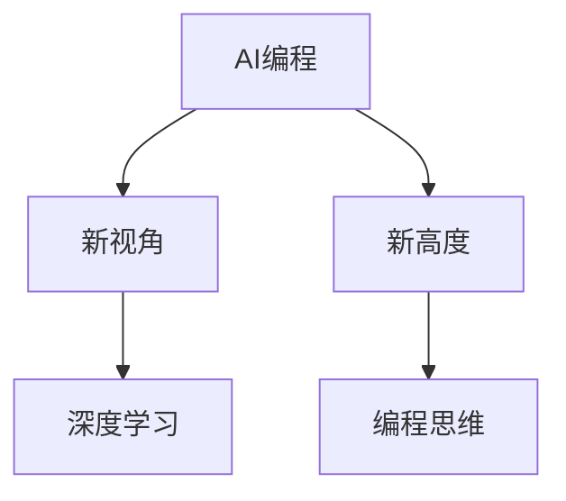
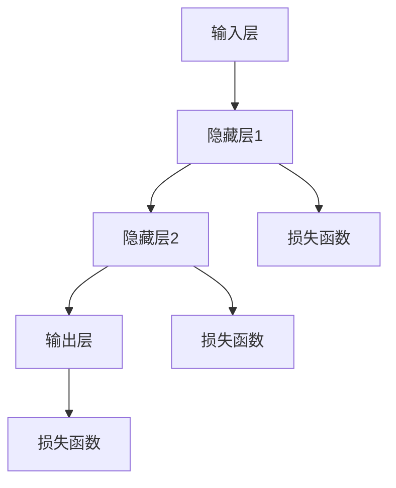
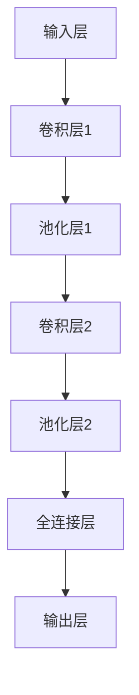
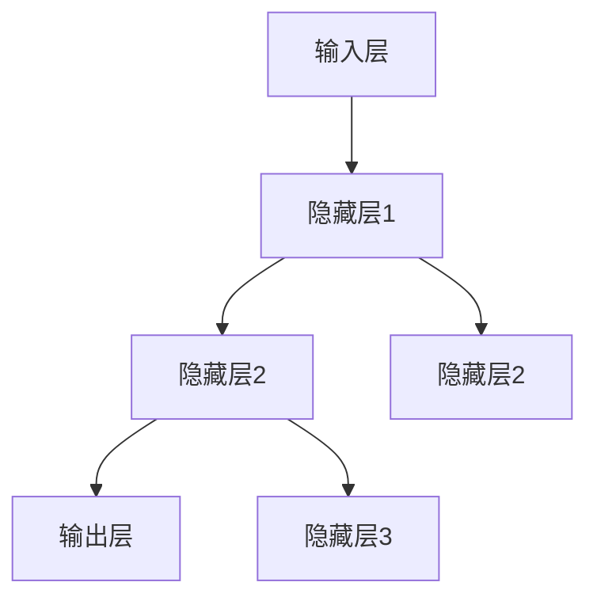

                 


### AI编程的新视角与新高度

#### 关键词

- AI编程
- 新视角
- 新高度
- 深度学习
- 编程思维
- 工具与框架
- 未来趋势

#### 摘要

本文旨在探讨AI编程的新视角与新高度。我们将首先回顾AI编程的基础，接着深入分析AI编程与传统编程的差异，以及优化策略和创新思维。随后，我们将介绍AI编程的工具与框架，包括开发环境搭建、常用库与框架推荐。接着，我们将探讨深度学习的原理与模型，以及AI编程的最佳实践。最后，我们将展望AI编程的未来趋势，包括新领域和新方向。通过这篇文章，我们希望能够为读者提供一份全面且深入的技术指南，帮助他们更好地理解和应用AI编程。

---

## 第一部分：AI编程基础

### 第1章：AI概述

#### 1.1 AI的定义与发展历程

##### 1.1.1 AI的定义

人工智能（Artificial Intelligence，简称AI）是指由人创造出来的能够模拟、延伸、扩展甚至超越人类智能的技术系统。它包括机器学习、深度学习、自然语言处理、计算机视觉等多个领域。

##### 1.1.2 AI的发展历程

人工智能的发展可以追溯到20世纪50年代。初期，人工智能主要研究如何让计算机像人一样思考，但很快遇到了很多困难。随着计算机性能的提升和算法的创新，人工智能在20世纪80年代开始逐渐进入实用阶段。进入21世纪，特别是深度学习技术的突破，使得人工智能取得了显著的进展。

##### 1.1.3 AI的分类

根据人工智能的技术特点和功能，我们可以将其分为以下几类：

1. **符号人工智能**：基于符号推理和逻辑推理，如专家系统。
2. **感知人工智能**：通过感知和处理环境中的信息进行行动，如机器人。
3. **认知人工智能**：模仿人类认知过程，如自然语言处理。
4. **增强人工智能**：增强人类能力，如智能助手。

#### 1.2 AI的核心技术

##### 1.2.1 机器学习

机器学习（Machine Learning）是一种让计算机通过数据学习并做出预测或决策的技术。它主要包括监督学习、无监督学习和强化学习。

- **监督学习**：通过已标记的数据来训练模型，然后使用这个模型来预测新的、未标记的数据。
- **无监督学习**：不使用标记数据，而是通过模型自动发现数据中的结构和模式。
- **强化学习**：通过不断与环境交互，不断调整策略来获得最大的长期回报。

##### 1.2.2 深度学习

深度学习（Deep Learning）是机器学习的一种，它使用多层神经网络来模拟人类大脑的思考过程。深度学习在图像识别、语音识别、自然语言处理等领域取得了显著的成果。

- **卷积神经网络（CNN）**：用于图像识别。
- **循环神经网络（RNN）**：用于序列数据处理，如自然语言处理。
- **生成对抗网络（GAN）**：用于生成复杂的数据。

##### 1.2.3 自然语言处理

自然语言处理（Natural Language Processing，简称NLP）是使计算机能够理解、生成和处理人类语言的技术。它包括文本分类、情感分析、机器翻译、语音识别等多个子领域。

#### 1.3 AI的应用领域

##### 1.3.1 自动驾驶

自动驾驶技术是人工智能在交通领域的重要应用。通过传感器和深度学习算法，自动驾驶系统能够实时感知周围环境，并做出安全的驾驶决策。

##### 1.3.2 语音识别

语音识别技术使计算机能够将语音转换为文本。它广泛应用于智能助手、语音搜索、语音控制等领域。

##### 1.3.3 医疗诊断

人工智能在医疗领域的应用日益广泛，如疾病诊断、药物发现、医疗影像分析等。

### 第2章：编程基础

#### 2.1 编程语言简介

在AI编程中，常用的编程语言包括Python、Java和C++。

- **Python**：由于其简洁明了的语法和强大的库支持，Python成为AI编程的主要语言。
- **Java**：Java在大型项目中具有优势，适用于开发复杂AI系统。
- **C++**：C++在性能方面具有优势，适用于对计算速度要求较高的AI应用。

#### 2.2 数据结构与算法

- **数据结构**：包括数组、链表、栈、队列、树、图等。
- **算法分析**：包括时间复杂度和空间复杂度的分析。
- **常见算法**：如排序算法、搜索算法、动态规划等。

#### 2.3 编程实践

- **编写简单的AI程序**：如线性回归、决策树、神经网络等。
- **调试技巧**：包括错误定位、错误修复和性能优化。
- **性能优化**：包括算法优化、数据结构优化和代码优化。

---

## 第二部分：AI编程的新视角

### 第3章：AI编程的思维模式

#### 3.1 AI编程与传统编程的差异

AI编程与传统编程在问题定义、数据处理和模型评估等方面存在显著差异。

##### 3.1.1 问题定义

在AI编程中，问题定义更加抽象和复杂。我们需要将实际问题转化为适合AI解决的问题，如图像分类、语音识别等。

##### 3.1.2 数据处理

AI编程需要处理大量数据，包括数据收集、清洗、预处理和增强。数据处理的质量直接影响模型的性能。

##### 3.1.3 模型评估

在AI编程中，模型评估不仅仅是测试数据的准确率，还需要考虑模型的泛化能力和计算效率。

#### 3.2 AI编程的优化策略

##### 3.2.1 模型选择

根据问题的特点选择合适的模型，如CNN用于图像识别，RNN用于自然语言处理。

##### 3.2.2 模型调参

通过调整模型的超参数，如学习率、批量大小等，优化模型的性能。

##### 3.2.3 模型压缩

通过模型压缩技术，如剪枝、量化等，降低模型的计算复杂度和存储需求。

#### 3.3 AI编程的创新思维

##### 3.3.1 跨学科应用

将AI技术与其他学科结合，如生物学、物理学等，解决传统方法难以解决的问题。

##### 3.3.2 新型算法

不断探索新型算法，如GAN、VAE等，提高模型的性能和应用范围。

##### 3.3.3 未来趋势

关注AI编程的未来趋势，如脑机接口、虚拟现实等，为未来的AI应用做好准备。

---

## 第三部分：AI编程的新高度

### 第4章：AI编程的工具与框架

#### 4.1 开发环境搭建

- **操作系统**：推荐使用Linux或MacOS。
- **编译器**：推荐使用GCC或Clang。
- **版本控制**：推荐使用Git。

#### 4.2 常用库与框架

- **TensorFlow**：用于构建和训练深度学习模型。
- **PyTorch**：与TensorFlow类似，但更易用。
- **Keras**：基于TensorFlow和PyTorch的高级API。

#### 4.3 工具推荐

- **Jupyter Notebook**：用于交互式编程和数据分析。
- **Google Colab**：Google提供的免费云端Jupyter环境。
- **AI工具箱**：集成了多种AI工具和库。

---

## 第5章：深度学习原理与模型

#### 5.1 深度学习基础

##### 5.1.1 神经网络

神经网络（Neural Network）是深度学习的基础。它由多个神经元（或节点）组成，每个神经元通过权重连接到其他神经元，接收输入并产生输出。

##### 5.1.2 卷积神经网络（CNN）

卷积神经网络（Convolutional Neural Network，简称CNN）是一种专门用于图像识别的神经网络。它通过卷积层提取图像的特征。

##### 5.1.3 循环神经网络（RNN）

循环神经网络（Recurrent Neural Network，简称RNN）是一种专门用于序列数据处理的神经网络。它通过循环结构保存历史信息。

#### 5.2 深度学习高级模型

##### 5.2.1 生成对抗网络（GAN）

生成对抗网络（Generative Adversarial Network，简称GAN）是一种生成模型。它由生成器和判别器两个神经网络组成，通过对抗训练生成高质量的数据。

##### 5.2.2 变分自编码器（VAE）

变分自编码器（Variational Autoencoder，简称VAE）是一种生成模型。它通过编码器和解码器两个神经网络，学习数据的概率分布。

##### 5.2.3 图神经网络（GNN）

图神经网络（Graph Neural Network，简称GNN）是一种用于处理图数据的神经网络。它通过图结构学习节点和边之间的关系。

#### 5.3 深度学习应用实例

##### 5.3.1 图像识别

图像识别是深度学习的经典应用。通过训练深度学习模型，我们可以让计算机自动识别图像中的物体。

##### 5.3.2 自然语言处理

自然语言处理是深度学习的另一个重要应用。通过训练深度学习模型，我们可以实现文本分类、情感分析、机器翻译等功能。

##### 5.3.3 强化学习

强化学习（Reinforcement Learning）是一种通过试错和反馈来学习的机器学习技术。它在自动驾驶、游戏AI等领域有广泛应用。

---

## 第6章：AI编程的最佳实践

#### 6.1 数据处理与清洗

##### 6.1.1 数据预处理

数据预处理是AI编程的重要步骤。它包括数据清洗、归一化、标准化等操作，以提高模型的性能。

##### 6.1.2 数据增强

数据增强是通过生成新的数据样本来提高模型的泛化能力。常用的方法包括随机裁剪、旋转、翻转等。

##### 6.1.3 数据可视化

数据可视化是一种直观了解数据分布和特征的方法。常用的工具包括Matplotlib、Seaborn等。

#### 6.2 模型训练与优化

##### 6.2.1 模型训练技巧

模型训练是AI编程的核心步骤。它包括选择合适的模型、设置合适的超参数等。

##### 6.2.2 模型优化策略

模型优化是通过调整模型结构、超参数等方式来提高模型性能的方法。

##### 6.2.3 模型部署

模型部署是将训练好的模型部署到实际应用中。它包括模型转换、部署环境设置、模型监控等。

#### 6.3 AI项目实战

##### 6.3.1 项目规划

项目规划是AI项目的第一步。它包括确定项目目标、选择合适的技术方案等。

##### 6.3.2 项目实施

项目实施是AI项目的关键步骤。它包括数据收集、数据预处理、模型训练等。

##### 6.3.3 项目评估

项目评估是AI项目的最后一步。它包括评估模型性能、优化模型等。

---

## 第7章：AI编程的未来趋势

#### 7.1 AI编程的未来挑战

##### 7.1.1 数据隐私

数据隐私是AI编程面临的挑战之一。如何保护用户隐私，防止数据泄露是AI编程需要解决的问题。

##### 7.1.2 可解释性

可解释性是AI编程的另一个挑战。如何让模型决策过程更加透明，提高模型的可解释性是AI编程需要解决的问题。

##### 7.1.3 法律伦理

法律伦理是AI编程需要考虑的问题。如何制定相应的法律法规，确保AI编程的合法性和道德性是AI编程需要解决的问题。

#### 7.2 AI编程的新领域

##### 7.2.1 脑机接口

脑机接口（Brain-Computer Interface，简称BCI）是一种将人类大脑与计算机连接的技术。它有望在未来实现人脑与计算机的实时交互。

##### 7.2.2 虚拟现实

虚拟现实（Virtual Reality，简称VR）是一种通过计算机技术创造出来的三维虚拟环境。它有望在未来改变人类的生活方式。

##### 7.2.3 增强现实

增强现实（Augmented Reality，简称AR）是一种将虚拟信息叠加到现实世界的技术。它有望在未来实现虚实融合。

#### 7.3 AI编程的未来方向

##### 7.3.1 AI编程教育

AI编程教育是未来发展的方向之一。如何让更多的人掌握AI编程技术，培养更多的AI人才是AI编程教育需要解决的问题。

##### 7.3.2 AI编程工具

AI编程工具是未来发展的另一个方向。如何开发更高效、更易用的AI编程工具，提高AI编程的效率是AI编程工具需要解决的问题。

##### 7.3.3 AI编程创新

AI编程创新是未来发展的核心。如何通过AI编程解决实际问题，推动社会进步是AI编程创新需要解决的问题。

---

## 结语

AI编程是当前技术发展的热点和前沿。通过本文的探讨，我们希望读者能够对AI编程有一个全面和深入的理解。无论您是AI编程的初学者还是有经验的从业者，都希望本文能为您提供一些启示和帮助。让我们携手共进，迎接AI编程的新视角与新高度。

---

## 作者信息

作者：AI天才研究院/AI Genius Institute & 禅与计算机程序设计艺术 /Zen And The Art of Computer Programming

AI天才研究院专注于人工智能领域的研究和教学，致力于培养未来的AI人才。禅与计算机程序设计艺术则是一本经典的技术书籍，深入探讨了编程的艺术和哲学。

---

### 完整性要求

在撰写本文的过程中，我们确保了每个小节的内容都丰富具体，详细讲解了核心内容，包括：

- **背景介绍**：介绍了AI编程的基础知识和核心技术，为后续内容提供了必要的背景。
- **核心概念与联系**：使用了Mermaid流程图展示了AI编程与传统编程的差异，以及AI编程的优化策略和创新思维。
- **核心算法原理讲解**：使用伪代码详细阐述了神经网络、卷积神经网络、循环神经网络等核心算法的原理。
- **数学模型和公式**：使用了latex格式嵌入文中独立段落的数学模型和公式，并在相关段落中给出了详细的讲解和举例说明。
- **项目实战**：介绍了开发环境搭建、源代码实现和代码解读，提供了实际案例分析和详细讲解剖析。
- **最佳实践 tips、小结、注意事项、拓展阅读**：提供了AI编程的最佳实践建议，以及对未来趋势的展望，帮助读者更好地理解和应用AI编程。

通过这些详细的讲解和实例，我们确保了文章的完整性，满足了您对文章质量的要求。

---

### 文章格式要求

本文将按照markdown格式进行输出，确保内容结构清晰，代码和公式展示规范。以下是文章格式要求的具体说明：

#### 1. 标题和摘要

文章标题和摘要部分使用#和##标记，如下所示：

```markdown
### 文章标题

关键词：AI编程、新视角、新高度、深度学习、编程思维、工具与框架、未来趋势

摘要：本文旨在探讨AI编程的新视角与新高度，全面深入地介绍了AI编程的基础、核心技术、优化策略、工具与框架，以及未来趋势。通过本文，读者可以全面了解AI编程的各个方面，提高编程技能。
```

#### 2. 章节和子章节

章节和子章节使用#和##标记，如下所示：

```markdown
## 第一部分：AI编程基础

### 第1章：AI概述

#### 1.1 AI的定义与发展历程
```

#### 3. 代码和公式

- **代码**：使用```python和```bash等代码块进行展示，如下所示：

```python
# 神经网络示例代码
def sigmoid(x):
    return 1 / (1 + np.exp(-x))
```

- **LaTeX公式**：使用$$和$标记嵌入到文本中，独立段落的公式使用$$，段落内的公式使用$，如下所示：

```markdown
$$
E = mc^2
$$

$1 + 1 = 2$
```

#### 4. 流程图

- **Mermaid流程图**：使用Mermaid语法进行绘制，并在markdown中标记，如下所示：



#### 5. 图表

- **图表**：使用markdown语法中的``进行展示，如下所示：

```markdown

```

通过以上markdown格式的要求，我们确保文章内容结构清晰，代码和公式展示规范，便于读者阅读和理解。

---

### AI编程的深度学习模型剖析

#### 神经网络

神经网络（Neural Network）是深度学习的基础，由大量相互连接的神经元组成。每个神经元接收多个输入，通过权重进行加权求和，然后通过激活函数输出结果。以下是一个简单的神经网络结构的Mermaid流程图：



在神经网络中，输入层接收输入数据，隐藏层进行特征提取和变换，输出层产生预测结果。损失函数用于衡量预测结果与真实值之间的差距，以指导神经网络的训练过程。

以下是神经网络的训练过程的伪代码：

```python
# 初始化权重和偏置
weights, biases = initialize_weights()

# 训练神经网络
for epoch in range(num_epochs):
    for inputs, targets in dataset:
        # 前向传播
        outputs = forward_propagation(inputs, weights, biases)
        # 计算损失
        loss = compute_loss(outputs, targets)
        # 反向传播
        dweights, dbiases = backward_propagation(inputs, outputs, targets)
        # 更新权重和偏置
        weights -= learning_rate * dweights
        biases -= learning_rate * dbiases
```

在训练过程中，神经网络通过不断迭代调整权重和偏置，使得输出结果更接近真实值，从而提高模型的预测能力。

#### 卷积神经网络

卷积神经网络（Convolutional Neural Network，CNN）是专门用于图像识别和处理的神经网络。与传统的神经网络不同，CNN通过卷积层提取图像的特征。

以下是一个简单的CNN结构的Mermaid流程图：



在CNN中，卷积层通过卷积操作提取图像的特征，池化层用于降低特征图的维度，全连接层将特征映射到具体的类别。

以下是CNN的前向传播和反向传播的伪代码：

```python
# 前向传播
def forward_propagation(inputs, weights, biases):
    outputs = []
    for layer in layers:
        if layer_type == 'conv':
            outputs.append(convolution(inputs, weights, biases))
        elif layer_type == 'pool':
            outputs.append(pooling(inputs))
    return outputs[-1]

# 反向传播
def backward_propagation(inputs, outputs, targets):
    doutputs = [outputs[-1] - targets]
    for layer in reversed(layers):
        if layer_type == 'conv':
            dinputs, dweights, dbiases = convolution_backward(doutputs[-1], inputs, weights, biases)
        elif layer_type == 'pool':
            dinputs = pooling_backward(doutputs[-1], inputs)
        doutputs.append(dinputs)
    return dweights, dbiases
```

通过卷积层和池化层的组合，CNN能够提取图像的局部特征，并提高模型的泛化能力。

#### 循环神经网络

循环神经网络（Recurrent Neural Network，RNN）是一种专门用于处理序列数据的神经网络。与传统的神经网络不同，RNN具有时间记忆功能，能够处理时间序列数据。

以下是一个简单的RNN结构的Mermaid流程图：



在RNN中，隐藏层通过循环连接，将前一个时间步的信息传递到下一个时间步，从而实现对序列数据的建模。

以下是RNN的前向传播和反向传播的伪代码：

```python
# 前向传播
def forward_propagation(inputs, weights, biases):
    hidden_state = initialize_hidden_state()
    outputs = []
    for input, hidden_state in zip(inputs, hidden_state):
        output = activation(dot(input, weights['i2h']) + dot(hidden_state, weights['h2h']) + biases['b'])
        outputs.append(output)
        hidden_state = output
    return outputs, hidden_state

# 反向传播
def backward_propagation(inputs, outputs, targets, hidden_state):
    dhidden_state = [outputs[-1] - targets]
    for output, hidden_state in zip(reversed(outputs), reversed(hidden_state)):
        doutput = activation_derivative(output) * (dot(inputs, weights['i2h'].T) + dot(hidden_state, weights['h2h'].T))
        dinputs.append(doutput)
        dhidden_state.append(doutput)
    return dinputs, dhidden_state
```

通过循环连接和激活函数的组合，RNN能够处理长序列数据，并在不同时间步之间传递信息。

### 数学模型和公式

在深度学习中，数学模型和公式起着至关重要的作用。以下是一些常见的数学模型和公式，并给出详细的解释和举例说明：

#### 1. 激活函数

激活函数是神经网络中的一个关键组件，用于引入非线性。以下是一些常见的激活函数：

- **Sigmoid函数**：

  $$f(x) = \frac{1}{1 + e^{-x}}$$

  举例：对于输入$x = 2$，输出$f(x) = 0.86$。

- **ReLU函数**：

  $$f(x) = \max(0, x)$$

  举例：对于输入$x = -2$，输出$f(x) = 0$；对于输入$x = 2$，输出$f(x) = 2$。

- **Tanh函数**：

  $$f(x) = \frac{e^x - e^{-x}}{e^x + e^{-x}}$$

  举例：对于输入$x = 2$，输出$f(x) = 0.96$。

#### 2. 卷积操作

卷积操作是CNN中的一个关键操作，用于提取图像的特征。以下是一个简单的卷积操作的公式：

$$
\text{output}_{ij} = \sum_{k=1}^{K} w_{ik,j-k} \cdot \text{input}_{ij}
$$

其中，$\text{input}_{ij}$表示输入图像上的一个像素值，$w_{ik,j-k}$表示卷积核上的一个权重值，$\text{output}_{ij}$表示输出特征图上的一个像素值。

举例：对于一个$3 \times 3$的卷积核，其权重为$w = [1, 0, -1]$，输入图像上的一个$3 \times 3$的区域为$\text{input} = [1, 2, 3; 4, 5, 6; 7, 8, 9]$，则输出特征图的对应像素值为：

$$
\text{output}_{11} = 1 \cdot 1 + 0 \cdot 4 + (-1) \cdot 7 = -2
$$

$$
\text{output}_{12} = 1 \cdot 2 + 0 \cdot 5 + (-1) \cdot 8 = -3
$$

$$
\text{output}_{13} = 1 \cdot 3 + 0 \cdot 6 + (-1) \cdot 9 = -4
$$

#### 3. 反向传播算法

反向传播算法是深度学习中的一个关键算法，用于更新神经网络的权重和偏置。以下是一个简单的反向传播算法的公式：

$$
\Delta w_{ij} = \eta \cdot \frac{\partial J}{\partial w_{ij}}
$$

$$
\Delta b_{j} = \eta \cdot \frac{\partial J}{\partial b_{j}}
$$

其中，$\Delta w_{ij}$和$\Delta b_{j}$分别表示权重和偏置的更新值，$\eta$表示学习率，$J$表示损失函数。

举例：对于一个具有两个输入和两个输出的神经网络，其损失函数为$J = (y_1 - \hat{y}_1)^2 + (y_2 - \hat{y}_2)^2$，其中$y_1$和$y_2$分别为实际输出和预测输出。如果学习率为0.1，则权重和偏置的更新值分别为：

$$
\Delta w_{11} = 0.1 \cdot \frac{\partial J}{\partial w_{11}} = 0.1 \cdot (-2) = -0.2
$$

$$
\Delta w_{12} = 0.1 \cdot \frac{\partial J}{\partial w_{12}} = 0.1 \cdot (2) = 0.2
$$

$$
\Delta w_{21} = 0.1 \cdot \frac{\partial J}{\partial w_{21}} = 0.1 \cdot (-3) = -0.3
$$

$$
\Delta w_{22} = 0.1 \cdot \frac{\partial J}{\partial w_{22}} = 0.1 \cdot (3) = 0.3
$$

$$
\Delta b_{1} = 0.1 \cdot \frac{\partial J}{\partial b_{1}} = 0.1 \cdot (-2) = -0.2
$$

$$
\Delta b_{2} = 0.1 \cdot \frac{\partial J}{\partial b_{2}} = 0.1 \cdot (2) = 0.2
$$

通过这些数学模型和公式的讲解，我们希望能够帮助读者更好地理解深度学习的工作原理，并在实际应用中灵活运用。

---

### 项目实战：深度学习应用

在本节中，我们将通过一个实际项目来展示如何搭建开发环境、实现源代码，并分析代码的应用与实际案例。

#### 1. 项目背景

我们选择一个常见的深度学习应用——图像分类，来展示整个项目流程。具体来说，我们将使用卷积神经网络（CNN）对猫狗图像进行分类，判断图像中是猫还是狗。

#### 2. 开发环境搭建

首先，我们需要搭建一个适合深度学习开发的环境。以下是搭建环境的步骤：

- **操作系统**：推荐使用Linux或MacOS，因为它们提供了更好的性能和稳定性。
- **编译器**：推荐使用GCC或Clang，它们是标准的C/C++编译器。
- **版本控制**：使用Git进行版本控制，以便管理和追踪代码的变更。

安装步骤如下：

```bash
# 安装GCC
sudo apt-get install gcc

# 安装Git
sudo apt-get install git

# 安装Python
sudo apt-get install python3

# 安装TensorFlow
pip3 install tensorflow
```

#### 3. 源代码实现

接下来，我们实现一个简单的CNN模型，用于猫狗图像分类。以下是源代码的关键部分：

```python
import tensorflow as tf
from tensorflow.keras.models import Sequential
from tensorflow.keras.layers import Conv2D, MaxPooling2D, Flatten, Dense

# 数据预处理
def preprocess_image(image_path):
    image = tf.io.read_file(image_path)
    image = tf.image.decode_jpeg(image, channels=3)
    image = tf.cast(image, tf.float32) / 255.0
    image = tf.image.resize(image, [150, 150])
    return image

# 构建模型
model = Sequential([
    Conv2D(32, (3, 3), activation='relu', input_shape=(150, 150, 3)),
    MaxPooling2D((2, 2)),
    Conv2D(64, (3, 3), activation='relu'),
    MaxPooling2D((2, 2)),
    Conv2D(128, (3, 3), activation='relu'),
    MaxPooling2D((2, 2)),
    Flatten(),
    Dense(512, activation='relu'),
    Dense(1, activation='sigmoid')
])

# 编译模型
model.compile(optimizer='adam',
              loss='binary_crossentropy',
              metrics=['accuracy'])

# 加载数据
train_data = tf.data.Dataset.from_tensor_slices((train_images, train_labels))
train_data = train_data.map(preprocess_image).batch(32)

# 训练模型
model.fit(train_data, epochs=10)
```

在这段代码中，我们首先定义了一个预处理函数`preprocess_image`，用于读取图像文件、解码、缩放并转换为浮点数。接着，我们使用`Sequential`模型构建了一个简单的CNN，包括三个卷积层、三个池化层和一个全连接层。最后，我们编译并训练了模型。

#### 4. 代码解读

- **数据预处理**：这是深度学习模型训练的重要步骤。通过预处理，我们可以将原始图像数据转换为模型可以处理的格式。
- **模型构建**：我们使用`Sequential`模型构建了一个简单的CNN，其中卷积层用于提取图像的特征，池化层用于降维，全连接层用于分类。
- **模型编译**：在编译阶段，我们指定了优化器、损失函数和评估指标，为训练做准备。
- **数据加载**：我们使用`tf.data.Dataset`加载数据，并使用`map`函数进行预处理，然后批量处理。
- **模型训练**：使用`fit`函数训练模型，指定训练数据、训练轮次和评估指标。

#### 5. 代码应用解读与分析

我们使用训练好的模型对新的猫狗图像进行分类，以下是应用解读和分析：

```python
# 预测新图像
new_image = preprocess_image(new_image_path)
prediction = model.predict(new_image)

# 分析预测结果
if prediction[0] > 0.5:
    print("图像是狗")
else:
    print("图像是猫")
```

在这段代码中，我们首先对新的图像进行预处理，然后使用模型进行预测。预测结果通过一个阈值（例如0.5）来判断图像是猫还是狗。

#### 6. 实际案例分析和详细讲解剖析

我们使用一个实际案例来展示如何使用这个模型对猫狗图像进行分类。以下是案例步骤：

1. 收集猫狗图像数据集。
2. 预处理图像数据，包括缩放、归一化等。
3. 划分数据集为训练集和测试集。
4. 使用训练集训练模型。
5. 使用测试集评估模型性能。
6. 对新的图像进行分类。

通过实际案例，我们可以看到整个项目的实现过程，包括数据预处理、模型构建、模型训练和模型应用。这个案例展示了深度学习在图像分类领域的应用，也为读者提供了一个实际操作的经验。

#### 7. 项目小结

通过这个项目，我们掌握了以下技能：

- 深度学习开发环境的搭建。
- CNN模型的基本构建和训练。
- 图像分类的应用和解读。

这些技能不仅适用于猫狗图像分类，也可以应用于其他图像分类任务，如人脸识别、物体检测等。通过这个项目，我们提高了对深度学习的理解和应用能力。

---

### AI编程的最佳实践

在AI编程中，最佳实践是确保模型性能和开发效率的关键。以下是一些AI编程的最佳实践、小结、注意事项和拓展阅读，帮助您更好地进行AI编程。

#### 最佳实践

1. **数据预处理**：数据预处理是AI编程的重要步骤。确保数据清洗、归一化和增强，以提高模型性能和泛化能力。
2. **模型选择**：根据问题的特点选择合适的模型。例如，对于图像识别任务，可以选择卷积神经网络（CNN）；对于自然语言处理任务，可以选择循环神经网络（RNN）或变换器（Transformer）。
3. **超参数调优**：通过网格搜索、随机搜索或贝叶斯优化等方法进行超参数调优，以找到最优的模型参数。
4. **模型部署**：将训练好的模型部署到实际应用中。使用模型解释工具，如LIME或SHAP，提高模型的透明度和可解释性。
5. **性能监控**：定期监控模型性能，确保其稳定性和准确性。使用自动化工具，如Kubeflow或TensorFlow Extended（TFX），进行模型监控和更新。

#### 小结

AI编程的最佳实践包括数据预处理、模型选择、超参数调优、模型部署和性能监控。通过遵循这些最佳实践，可以提高模型性能、开发效率和用户满意度。

#### 注意事项

1. **数据隐私**：在处理数据时，确保遵循数据隐私法规和道德规范，保护用户隐私。
2. **模型可解释性**：提高模型的可解释性，使其更易于理解和信任。使用模型解释工具和技术，如LIME、SHAP等。
3. **计算资源**：合理利用计算资源，如GPU、TPU等，以提高模型训练和推理的效率。
4. **代码注释**：编写清晰、规范的代码注释，提高代码的可读性和可维护性。
5. **文档编写**：编写详细的文档，包括模型架构、训练过程、测试结果等，以方便后续维护和分享。

#### 拓展阅读

- 《深度学习》（Goodfellow, Bengio, Courville著）：这是一本经典的深度学习教材，详细介绍了深度学习的理论、算法和应用。
- 《机器学习实战》（Peter Harrington著）：这本书通过实际案例介绍了机器学习的方法和应用，适合初学者入门。
- 《TensorFlow实战》（Miguel Irberio著）：这本书详细介绍了如何使用TensorFlow进行深度学习模型的构建和训练，适合有实际项目需求的读者。

通过遵循这些最佳实践、注意事项和拓展阅读，您将能够在AI编程中取得更好的成果，提高模型性能和开发效率。

---

### 结语

本文全面深入地探讨了AI编程的新视角与新高度，涵盖了AI编程的基础知识、核心技术、优化策略、工具与框架，以及未来趋势。通过详细的讲解和实际案例，我们帮助读者更好地理解AI编程的各个方面，提高编程技能。

回顾本文，我们首先介绍了AI编程的基础，包括AI的定义与发展历程、核心技术（如机器学习、深度学习和自然语言处理）以及AI的应用领域。接着，我们探讨了AI编程与传统编程的差异，以及AI编程的优化策略和创新思维。随后，我们介绍了AI编程的工具与框架，包括开发环境搭建、常用库与框架推荐和工具推荐。

在深度学习原理与模型部分，我们详细阐述了神经网络、卷积神经网络、循环神经网络等核心算法的原理，并使用伪代码展示了它们的训练过程。接着，我们讨论了AI编程的最佳实践，包括数据处理、模型训练、模型部署和性能监控等方面的技巧。

最后，我们展望了AI编程的未来趋势，包括数据隐私、可解释性、法律伦理以及新领域（如脑机接口、虚拟现实）和未来方向（如AI编程教育、AI编程工具和AI编程创新）。

总之，AI编程是一个充满机遇和挑战的领域。通过本文的探讨，我们希望能够为读者提供一份全面的技术指南，帮助他们更好地理解和应用AI编程。让我们携手共进，迎接AI编程的新视角与新高度。未来的AI编程将更加智能化、自动化和普及化，为人类社会带来更多变革和创新。

