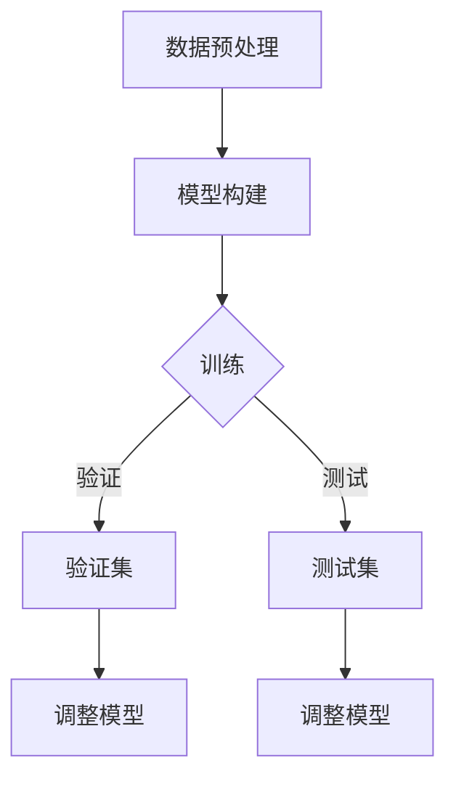
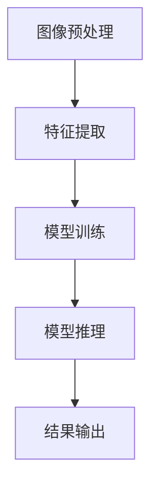
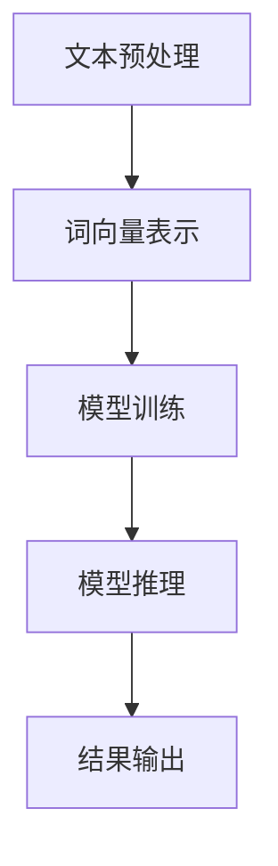

                 

### 文章标题

《AI编程的新语言与新视野》

### 关键词

AI编程，新语言，新视野，深度学习，数据科学，计算机视觉，自然语言处理

### 摘要

本文旨在探讨AI编程领域的新语言及其带来的新视野。随着人工智能的快速发展，传统的编程语言已经难以满足AI领域的需求，因此新语言的诞生成为必然趋势。本文将详细介绍新语言的特点、架构、核心概念以及应用领域，并通过具体案例进行实战解析，帮助读者深入了解新语言在AI编程中的应用。

## 第一部分：AI编程新语言概述

### 1.1 AI编程的发展历程

#### 1.1.1 人工智能的兴起

人工智能（AI）的概念最早可以追溯到20世纪50年代，然而，真正的突破发生在20世纪80年代。随着计算机硬件性能的提升和算法的进步，AI技术逐渐成熟，并在各个领域得到广泛应用。早期的AI编程主要依赖于传统编程语言，如C、C++、Python等。这些语言在早期AI研究中发挥了重要作用，但随着AI技术的发展，它们逐渐暴露出一些局限性。

#### 1.1.2 编程语言在AI领域的应用

传统编程语言在AI领域的应用主要集中在算法实现和数据操作上。然而，这些语言在处理复杂的数据结构和并行计算方面存在困难。例如，深度学习算法需要大量的矩阵运算，而传统编程语言在这方面性能较低。此外，传统编程语言的抽象层次较低，难以满足AI领域对高效性和易用性的需求。

#### 1.1.3 新语言的发展趋势

随着AI技术的发展，新语言逐渐崭露头角。这些新语言具有更高的抽象层次，更好的并行计算能力，以及丰富的库和框架支持。例如，TensorFlow、PyTorch等深度学习框架，使得开发者可以更轻松地实现复杂的AI算法。此外，新语言还注重易用性和扩展性，使得开发者可以更高效地开发AI应用。

### 1.2 新语言的特点与优势

#### 1.2.1 高级抽象能力

新语言具有强大的抽象能力，可以简化复杂的计算任务。例如，深度学习框架提供的自动微分功能，使得开发者无需手动编写复杂的微分代码，从而提高开发效率。

#### 1.2.2 易用性

新语言提供了丰富的库和框架支持，使得开发者可以更快速地实现AI算法。此外，新语言的语法简洁，易于学习和使用。

#### 1.2.3 性能优化

新语言通过编译优化和并行计算技术，实现了高性能的AI算法。例如，TensorFlow和PyTorch都提供了高效的计算图引擎，能够显著提高算法运行速度。

### 1.3 新语言的架构与设计原理

#### 1.3.1 并行处理能力

新语言通过并行计算技术，实现了高性能的AI算法。例如，TensorFlow和PyTorch都支持GPU加速和分布式计算。

#### 1.3.2 自动优化机制

新语言具有自动优化机制，能够根据硬件环境和计算任务自动调整算法执行策略，从而提高性能。

#### 1.3.3 跨平台兼容性

新语言具有跨平台兼容性，可以在不同的操作系统和硬件平台上运行，为开发者提供了更大的灵活性。

### 1.4 新语言的核心应用领域

#### 1.4.1 数据分析

新语言在数据分析领域具有广泛的应用，例如，Python的Pandas库提供了强大的数据处理和分析功能。

#### 1.4.2 计算机视觉

新语言在计算机视觉领域有着出色的表现，例如，TensorFlow和PyTorch都提供了丰富的计算机视觉库。

#### 1.4.3 自然语言处理

新语言在自然语言处理领域也有着重要的应用，例如，TensorFlow和PyTorch都提供了强大的文本处理库。

## 第二部分：新语言核心概念与原理

### 2.1 核心概念原理介绍

#### 2.1.1 数据结构与算法基础

新语言的核心概念之一是数据结构与算法。数据结构包括数组、列表、栈、队列、树、图等，而算法包括排序、查找、图论算法等。掌握这些基本概念是理解和应用新语言的基础。

#### 2.1.2 神经网络原理

神经网络是深度学习的基础，它由多个神经元组成，通过前向传播和反向传播进行训练。了解神经网络的工作原理对于掌握新语言至关重要。

#### 2.1.3 深度学习框架概述

深度学习框架是构建和训练深度学习模型的重要工具。常见的深度学习框架包括TensorFlow、PyTorch、Keras等。掌握这些框架的基本使用方法对于新语言的学习和应用具有重要意义。

### 2.2 Mermaid流程图展示

#### 2.2.1 深度学习模型训练流程

深度学习模型的训练通常包括数据预处理、模型构建、训练、验证和测试等步骤。以下是一个简单的Mermaid流程图示例：



#### 2.2.2 计算机视觉处理流程

计算机视觉处理通常包括图像预处理、特征提取、模型训练和推理等步骤。以下是一个简单的Mermaid流程图示例：



#### 2.2.3 自然语言处理流程

自然语言处理通常包括文本预处理、词向量表示、模型训练和推理等步骤。以下是一个简单的Mermaid流程图示例：



### 2.3 伪代码阐述核心算法原理

#### 2.3.1 神经网络反向传播算法

神经网络反向传播算法是训练神经网络的核心算法。以下是一个简单的伪代码示例：

```python
# 前向传播
input = X
layer1_output = activation(W1 * input + b1)
layer2_output = activation(W2 * layer1_output + b2)
output = activation(W3 * layer2_output + b3)

# 计算损失函数
loss = loss_function(output, target)

# 反向传播
d_output = loss_function_derivative(output, target)
d_layer3 = d_output * activation_derivative(output)
d_layer2 = d_layer3 * activation_derivative(layer2_output)
d_layer1 = d_layer2 * activation_derivative(layer1_output)

# 更新权重和偏置
W3 -= learning_rate * d_layer3 * layer2_output
b3 -= learning_rate * d_output
W2 -= learning_rate * d_layer2 * layer1_output
b2 -= learning_rate * d_layer2
W1 -= learning_rate * d_layer1 * input
b1 -= learning_rate * d_layer1
```

#### 2.3.2 卷积神经网络算法

卷积神经网络（CNN）是计算机视觉领域的重要模型。以下是一个简单的伪代码示例：

```python
# 卷积操作
conv_output = convolution(kernel, input)

# 池化操作
pool_output = pooling(conv_output)

# 激活函数
activation_output = activation_function(pool_output)
```

#### 2.3.3 循环神经网络算法

循环神经网络（RNN）是自然语言处理领域的重要模型。以下是一个简单的伪代码示例：

```python
# 前向传播
input = X
h_t = activation(W_h * h_{t-1} + W_x * x_t + b)

# 反向传播
d_h_t = d_output * activation_derivative(h_t)
d_W_h = learning_rate * d_h_t * h_{t-1}
d_W_x = learning_rate * d_h_t * x_t
d_b = learning_rate * d_h_t
```

### 2.4 数学模型与公式讲解

#### 2.4.1 损失函数与优化算法

损失函数是评价模型性能的重要指标，优化算法用于调整模型参数以最小化损失函数。以下是一些常见的损失函数和优化算法：

- 损失函数：

  $$L(y, \hat{y}) = \frac{1}{2} (y - \hat{y})^2$$

  $$L(y, \hat{y}) = -y \log(\hat{y}) - (1 - y) \log(1 - \hat{y})$$

- 优化算法：

  $$\theta = \theta - \alpha \nabla_{\theta}L(\theta)$$

  $$\theta = \theta - \alpha \frac{\partial}{\partial \theta}L(\theta)$$

#### 2.4.2 神经网络激活函数

激活函数是神经网络的重要组成部分，用于引入非线性特性。以下是一些常见的激活函数：

- Sigmoid函数：

  $$\sigma(x) = \frac{1}{1 + e^{-x}}$$

- ReLU函数：

  $$\text{ReLU}(x) = \max(0, x)$$

- Tanh函数：

  $$\tanh(x) = \frac{e^x - e^{-x}}{e^x + e^{-x}}$$

#### 2.4.3 卷积与池化操作

卷积和池化是计算机视觉中的重要操作，用于提取图像特征。以下是一些常见的卷积和池化操作：

- 卷积操作：

  $$\text{Conv}(I, K) = \sum_{i=1}^{C} \sum_{j=1}^{H} I_{ij} \cdot K_{ij}$$

- 池化操作：

  $$P_{ij} = \max_{k,l} I_{ijk + k, l + l}$$

## 第三部分：新语言实战应用

### 3.1 项目实战一：数据分析

#### 3.1.1 数据预处理

数据预处理是数据分析的重要步骤，包括数据清洗、数据转换和数据归一化等。

- 数据清洗：

  $$\text{Clean}(X) = \{ x | x \in X \land \text{is_valid}(x) \}$$

- 数据转换：

  $$\text{Transform}(X) = \{ x' | x \in X \land x' = \text{convert}(x) \}$$

- 数据归一化：

  $$\text{Normalize}(X) = \{ x' | x \in X \land x' = \text{normalize}(x) \}$$

#### 3.1.2 数据可视化

数据可视化是数据分析的重要工具，用于直观展示数据分布和关系。

- 条形图：

  $$\text{Bar}(X) = \{ \text{bar}(x) | x \in X \}$$

- 折线图：

  $$\text{Line}(X) = \{ \text{line}(x) | x \in X \}$$

- 散点图：

  $$\text{Scatter}(X, Y) = \{ \text{scatter}(x, y) | x \in X, y \in Y \}$$

#### 3.1.3 数据挖掘算法应用

数据挖掘算法是数据分析的核心，用于发现数据中的规律和模式。

- 决策树：

  $$\text{DecisionTree}(X, Y) = \{ \text{node} | \text{node} = \text{build_tree}(X, Y) \}$$

- k-means聚类：

  $$\text{KMeans}(X, K) = \{ \text{cluster} | \text{cluster} = \text{find_clusters}(X, K) \}$$

- 朴素贝叶斯分类器：

  $$\text{NaiveBayes}(X, Y) = \{ \text{classifier} | \text{classifier} = \text{train}(X, Y) \}$$

### 3.2 项目实战二：计算机视觉

#### 3.2.1 图像数据加载与预处理

图像数据加载与预处理是计算机视觉项目的基础。

- 数据加载：

  $$\text{Load}(I) = \{ i | i \in I \}$$

- 数据预处理：

  $$\text{Preprocess}(I) = \{ i' | i \in I \land i' = \text{ preprocess}(i) \}$$

#### 3.2.2 卷积神经网络模型构建

卷积神经网络模型构建是计算机视觉项目的关键步骤。

- 模型构建：

  $$\text{Model}(I) = \{ m | m = \text{build_model}(I) \}$$

- 模型训练：

  $$\text{Train}(m, I) = \{ m' | m' = \text{train}(m, I) \}$$

- 模型评估：

  $$\text{Evaluate}(m, I) = \{ e | e = \text{evaluate}(m, I) \}$$

#### 3.2.3 实现图像分类任务

图像分类任务是计算机视觉的常见任务。

- 分类：

  $$\text{Classify}(m, I) = \{ c | c = \text{classify}(m, I) \}$$

### 3.3 项目实战三：自然语言处理

#### 3.3.1 文本预处理

文本预处理是自然语言处理项目的基础。

- 数据加载：

  $$\text{Load}(T) = \{ t | t \in T \}$$

- 数据预处理：

  $$\text{Preprocess}(T) = \{ t' | t \in T \land t' = \text{ preprocess}(t) \}$$

#### 3.3.2 语言模型构建

语言模型构建是自然语言处理项目的关键步骤。

- 模型构建：

  $$\text{Model}(T) = \{ m | m = \text{build_model}(T) \}$$

- 模型训练：

  $$\text{Train}(m, T) = \{ m' | m' = \text{train}(m, T) \}$$

- 模型评估：

  $$\text{Evaluate}(m, T) = \{ e | e = \text{evaluate}(m, T) \}$$

#### 3.3.3 实现文本分类任务

文本分类任务是自然语言处理的常见任务。

- 分类：

  $$\text{Classify}(m, T) = \{ c | c = \text{classify}(m, T) \}$$

## 第四部分：新语言开发环境与工具

### 4.1 开发环境搭建

开发环境搭建是进行新语言编程的基础。

- 系统环境配置：

  $$\text{Configure}(S) = \{ s' | s \in S \land s' = \text{configure_system}(s) \}$$

- 编译器与解释器安装：

  $$\text{Install}(E) = \{ e' | e \in E \land e' = \text{install_compiler}(e) \}$$

- 开发工具与库安装：

  $$\text{Install}(D) = \{ d' | d \in D \land d' = \text{install_tools}(d) \}$$

### 4.2 源代码实现与解读

源代码实现与解读是深入理解新语言编程的关键。

- 数据集准备与加载：

  $$\text{Load}(D) = \{ d | d \in D \}$$

- 神经网络模型构建与训练：

  $$\text{Model}(N) = \{ n | n = \text{build_model}(N) \}$$

- 模型评估与优化：

  $$\text{Evaluate}(N) = \{ e | e = \text{evaluate_model}(N) \}$$

### 4.3 代码解读与分析

代码解读与分析是提高编程技能的重要手段。

- 数据预处理部分：

  $$\text{Preprocess}(C) = \{ c | c = \text{preprocess_code}(C) \}$$

- 神经网络部分：

  $$\text{Network}(N) = \{ n | n = \text{analyze_network}(N) \}$$

- 模型训练与评估部分：

  $$\text{Evaluate}(M) = \{ e | e = \text{evaluate_model}(M) \}$$

## 5. 总结

### 5.1 新语言的优势与挑战

新语言在AI编程领域具有显著优势，如高级抽象能力、易用性和性能优化等。然而，新语言也面临一些挑战，如学习曲线较陡、兼容性问题等。

### 5.2 未来发展趋势与展望

随着AI技术的不断发展，新语言将在未来扮演更加重要的角色。未来发展趋势包括：

- 更高的抽象层次
- 更好的性能优化
- 更广泛的跨平台兼容性
- 更丰富的库和框架支持

作者：AI天才研究院/AI Genius Institute & 禅与计算机程序设计艺术 /Zen And The Art of Computer Programming

本文旨在为读者提供关于AI编程新语言的全面了解，帮助读者掌握新语言的核心概念和应用技巧。在接下来的章节中，我们将深入探讨新语言的基础知识、核心概念、编程实践以及开发环境等内容。希望本文能够对您的AI编程之路有所帮助。

