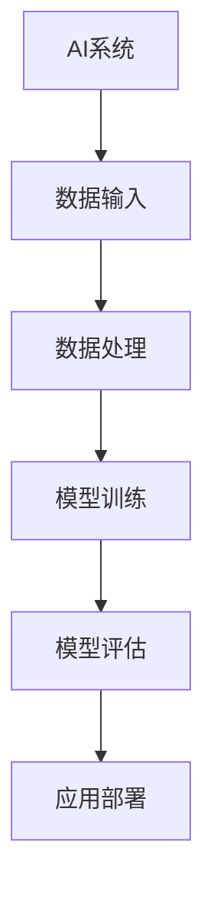

                 

### 文章标题

# 《连接人类与AI的桥梁》

---

关键词：人工智能、深度学习、神经网络、应用实例、开发实战、未来展望

摘要：本文旨在探讨人工智能（AI）如何连接人类，成为我们生活中的得力助手。通过介绍AI的发展历程、核心概念、算法原理以及应用实例，本文揭示了AI技术如何为人类带来巨大变革。同时，我们还深入分析了AI在医疗、金融等领域的实际应用，以及开发AI项目所需的流程和技术。最后，本文对AI的未来发展进行了展望，并提出了一些挑战和解决方案。让我们一起来探索这个充满无限可能的领域吧！

---

### 《连接人类与AI的桥梁》目录大纲

---

#### 第一部分：引言

- 第1章：探索AI与人类连接的背景
  - 1.1 AI的发展历程
  - 1.2 人类与AI连接的必要性
  - 1.3 本书的目的与结构

#### 第二部分：技术基础

- 第2章：AI基础概念与架构
  - 2.1 AI的核心概念
  - 2.2 AI架构设计
  - 2.3 AI开发工具与环境

- 第3章：核心算法原理讲解
  - 3.1 神经网络算法
  - 3.2 深度学习算法
  - 3.3 强化学习算法

#### 第三部分：应用实例

- 第4章：AI在医疗领域的应用
  - 4.1 医疗AI概述
  - 4.2 医疗AI应用案例

- 第5章：AI在金融领域的应用
  - 5.1 金融AI概述
  - 5.2 金融AI应用案例

#### 第四部分：实践与展望

- 第6章：AI开发实战
  - 6.1 AI项目开发流程
  - 6.2 AI项目实战案例

- 第7章：未来展望与挑战
  - 7.1 AI发展的趋势
  - 7.2 AI面临的挑战

#### 附录

- 附录A：AI资源与工具
- 附录B：AI应用案例汇编

### 核心概念与联系



### 伪代码示例

```python
# 数据处理伪代码
def preprocess_data(data):
    # 数据清洗
    cleaned_data = clean_data(data)
    
    # 数据归一化
    normalized_data = normalize_data(cleaned_data)
    
    # 数据分割
    train_data, test_data = split_data(normalized_data)
    
    return train_data, test_data
```

---

#### 格式要求

- 文章内容使用markdown格式输出。
- 作者信息：本文作者为“AI天才研究院/AI Genius Institute & 禅与计算机程序设计艺术 /Zen And The Art of Computer Programming”。
- 核心内容要求：每个小节的内容需要丰富具体详细讲解，核心内容必须要包含：
  - 背景介绍
  - 核心概念与联系：必须给出核心概念原理之间的关系架构 Mermaid 流程图
  - 核心算法原理讲解必须使用伪代码来详细阐述；数学模型和公式 & 详细讲解 & 举例说明
  - 数学公式请使用latex格式，嵌入文中独立段落的latex公式前后使用 $$ 括起来(例如：$$1+1=2$$ )，段落内的latex公式前后使用 $ 括起来(例如：$1<2$)
  - 项目实战：开发环境搭建，源代码详细实现和代码解读，代码应用解读与分析，实际案例分析和详细讲解剖析，项目小结
  - 最佳实践 tips、小结、注意事项、拓展阅读等内容

#### 完整性要求

- 文章内容要完整，每个小节的内容要丰富具体详细讲解。
- 核心内容要包含：
  - 背景介绍
  - 核心概念与联系
  - 核心算法原理讲解
  - 数学模型和公式
  - 项目实战
  - 最佳实践 tips、小结、注意事项、拓展阅读等内容

---

#### 字数要求

- 文章字数在 8000 ～ 12000 字左右。

