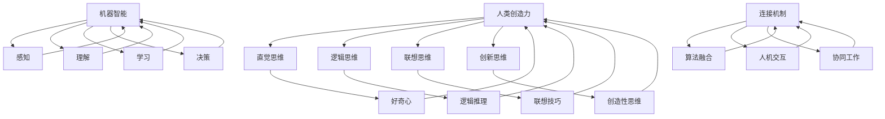

                 

### 引言

随着人工智能（AI）技术的迅猛发展，人类创造力与机器智能之间的关系成为了当今科技界研究的热点。在这个数字化的时代，机器智能以其高效的数据处理和分析能力，正逐步渗透到人类社会的各个领域。然而，人类创造力，作为创新思维和独特见解的源泉，依然在推动社会进步中发挥着不可替代的作用。如何将这两者有效地连接起来，构建一个既能发挥人类创造力优势，又能借助机器智能力量的新型协同体系，成为了我们亟待解决的重要课题。

这本书《连接人类创造力与机器智能的桥梁》旨在探讨如何搭建人类创造力与机器智能之间的桥梁，从而实现两者的有机结合。书中将通过详细的案例分析和理论阐述，展示这一桥梁的具体构造和方法。我们将从以下几个方面展开讨论：

1. **背景介绍**：首先，我们将回顾人类创造力与机器智能的发展历程，探讨它们各自的优劣势，并分析它们之间相互作用的可能性。

2. **核心概念与联系**：接着，我们将定义和阐述关键概念，如人类创造力、机器智能和连接机制，并使用Mermaid流程图展示它们之间的关系架构。

3. **核心算法原理讲解**：我们将深入探讨实现这一连接机制的核心算法原理，并提供详细的伪代码和数学模型。

4. **项目实战**：通过具体的开发环境搭建、源代码实现和案例分析，我们将展示如何将人类创造力和机器智能结合起来，实现实际应用。

5. **最佳实践与拓展**：最后，我们将总结本书的核心观点，提供最佳实践建议，并探讨未来的研究方向。

通过这一系列讨论，我们希望能够为读者提供一个全面而深入的理解，从而为未来的研究和实践提供指导。接下来的章节中，我们将一步步展开这一探讨之旅。

### 背景介绍

人类创造力和机器智能作为科技发展的两大驱动力，各自有着独特的发展历程和显著的优势。

人类创造力，源于人类独特的思维方式和心理特质。从史前时代人类用简单的工具开始，到现代社会人类创造复杂的科技产品，创造力一直推动着人类文明的进步。人类具有天生的好奇心、学习能力、情感和想象力，这些特质使得人类能够不断发现新事物、提出新观点和创造新解决方案。创造力不仅体现在科学、艺术、设计等领域，还渗透到社会、经济、文化等各个方面，为人类的发展提供了源源不断的动力。

机器智能则起源于20世纪中叶，随着计算机技术的飞速发展，机器开始模拟和扩展人类的智能能力。从简单的自动化设备，到复杂的深度学习算法，机器智能在感知、理解、学习和决策等方面取得了显著的进步。特别是在大数据和云计算的助力下，机器智能能够处理和分析海量的数据，快速识别模式和趋势，提供高效的解决方案。然而，机器智能尽管强大，却缺乏人类的情感、直觉和创造力，这些因素限制了它在某些领域的能力。

尽管人类创造力和机器智能各有优势，但它们之间也存在着一定的互动和相互影响。一方面，人类创造力可以引导和激发机器智能的发展。例如，在算法设计、系统架构和创新应用等方面，人类创造力的作用不可或缺。人类能够提出新颖的想法，设计复杂的算法模型，从而推动机器智能的技术进步。另一方面，机器智能的强大计算能力可以辅助人类创造力，提高其效率。例如，通过机器智能的分析和预测，人类可以更好地理解问题，发现新的研究路径，从而促进创新。

实际上，人类创造力和机器智能之间的连接和融合已经成为科技发展的一个重要趋势。在多个领域，如人工智能助手、自动驾驶汽车、智能医疗和创意设计等，人类创造力和机器智能的协同作用已经得到了广泛应用。例如，在人工智能助手领域，人类创造者通过设计算法和交互界面，赋予机器智能以人类情感和智慧；而在自动驾驶汽车领域，机器智能通过实时感知和决策，辅助驾驶员完成复杂的驾驶任务。

然而，尽管人类创造力和机器智能的连接已经取得了一定的成果，仍存在许多挑战和机遇。如何在保持人类创造力的独特性的同时，充分发挥机器智能的优势，构建一个高效、可持续的协同体系，是当前研究和实践中的重要课题。

综上所述，人类创造力和机器智能之间的互动和融合不仅具有深远的理论意义，也具有重要的现实意义。通过搭建连接这两者的桥梁，我们有望推动科技和社会的进一步发展，实现人类和机器的共同进步。接下来的章节中，我们将进一步探讨这一连接机制的原理和方法。

### 核心概念与联系

在探讨人类创造力与机器智能的连接机制之前，我们需要明确几个核心概念，并理解它们之间的相互关系。以下是这些核心概念的定义及其相互关系架构的详细说明。

#### 1. 人类创造力

人类创造力是指人类通过思维活动产生新颖、有价值的想法和解决方案的能力。它基于人类独特的心理特质，如好奇心、想象力、直觉和情感。人类创造力可以分为多个层次，包括直觉思维、逻辑思维、联想思维和创新思维等。

#### 2. 机器智能

机器智能是指通过计算机程序和算法模拟人类智能的能力。它包括感知、理解、学习和决策等多个方面。机器智能的核心技术包括机器学习、深度学习、自然语言处理和计算机视觉等。

#### 3. 连接机制

连接机制是指实现人类创造力和机器智能之间互动和协同的方法和工具。它可以通过多种方式实现，包括算法融合、人机交互和协同工作等。

#### 关系架构

为了更清晰地展示这些概念之间的关系，我们可以使用Mermaid流程图来描述。以下是核心概念及其关系架构的Mermaid流程图：



在上述流程图中，我们可以看到：

- **人类创造力**是整体的核心，它由多种思维方式构成，包括直觉思维、逻辑思维、联想思维和创新思维。
- **机器智能**则由感知、理解、学习和决策等多个方面组成。
- **连接机制**是实现人类创造力和机器智能互动的关键，它通过算法融合、人机交互和协同工作等方式实现两者的结合。

通过这个流程图，我们可以清晰地看到人类创造力和机器智能之间的连接关系。接下来，我们将进一步探讨这些核心概念的具体实现和应用。

#### 核心算法原理讲解

为了实现人类创造力和机器智能的有效连接，我们需要深入探讨一些核心算法原理，并使用伪代码和数学模型来详细阐述这些原理。以下是一些关键算法及其实现方法：

##### 1. 机器学习算法

机器学习是机器智能的核心技术之一，它使机器能够从数据中学习并做出预测或决策。以下是一个简单的线性回归算法的伪代码，用于模拟机器智能的学习过程：

```plaintext
// 线性回归算法伪代码

输入：训练数据集 (x, y)
输出：模型参数 w

初始化：w = 随机值

对于每个训练样本 (x_i, y_i)：
    预测值 = w * x_i
    实际值 - 预测值 = ε_i （误差）

计算误差总和：J = Σ(ε_i^2)

更新模型参数：w = w - 学习率 * ∇J(w)

返回：w
```

该算法通过不断更新模型参数，以最小化误差总和，从而实现数据的拟合。在数学模型中，我们可以表示为：

$$
J(w) = \sum_{i=1}^{n} (\hat{y_i} - y_i)^2
$$

其中，$\hat{y_i} = w \cdot x_i$ 是预测值，$y_i$ 是实际值，$w$ 是模型参数，$n$ 是训练样本数量。

##### 2. 深度学习算法

深度学习是机器学习的一个重要分支，通过多层神经网络模拟人类的认知过程。以下是一个简单的卷积神经网络（CNN）的伪代码，用于图像识别：

```plaintext
// 卷积神经网络算法伪代码

输入：图像数据 X
输出：分类结果 Y

初始化：权重 W 和偏置 b

对于每个卷积层：
    输入 = X
    对于每个滤波器：
        激活值 = 求和(输入 * 滤波器) + b
        输出 = 激活函数(激活值)

对于每个全连接层：
    输入 = 输出上一层
    输出 = 求和(输入 * 权重) + 偏置

计算损失函数：L = 损失函数(输出, 标签)

更新权重和偏置：W = W - 学习率 * ∇L(W)
                b = b - 学习率 * ∇L(b)

返回：分类结果 Y
```

在数学模型中，卷积操作可以表示为：

$$
\text{输出}_{ij} = \sum_{k=1}^{m} W_{ikj} \cdot \text{输入}_{kj} + b_j
$$

其中，$m$ 是滤波器的尺寸，$W$ 是滤波器的权重，$b$ 是偏置项，$\text{激活函数}$ 可以是ReLU、Sigmoid或Tanh等。

##### 3. 自然语言处理算法

自然语言处理（NLP）是机器智能在处理和理解自然语言方面的重要应用。以下是一个简单的词嵌入算法的伪代码，用于将单词转换为向量表示：

```plaintext
// 词嵌入算法伪代码

输入：单词集合 V
输出：单词向量 V'

初始化：权重矩阵 W 随机

对于每个单词 v_i：
    预测向量 = W * embedding(v_i)
    实际向量 = embedding(v_i)
    更新权重：W = W - 学习率 * (预测向量 - 实际向量)

返回：单词向量 V'
```

在数学模型中，词嵌入可以表示为：

$$
\text{embedding}(v_i) = W \cdot v_i
$$

其中，$W$ 是权重矩阵，$v_i$ 是单词向量。

通过上述核心算法的讲解和伪代码展示，我们可以看到机器智能在实现人类创造力连接机制中的关键作用。这些算法不仅能够模拟和扩展人类智能，还能通过不断学习和优化，实现与人类创造力的协同工作。

接下来，我们将通过具体的案例分析，进一步探讨这些算法在实际应用中的效果和挑战。

### 项目实战

为了更好地展示如何将人类创造力和机器智能结合起来，我们将通过一个具体的案例分析，详细讲解项目开发环境搭建、源代码实现、代码解读与分析，以及实际案例分析和详细讲解剖析。

#### 项目背景

项目名称：智能创意设计助手

项目目标：利用机器智能技术辅助设计师进行创意设计，提高设计效率和创意质量。

#### 开发环境搭建

1. **硬件环境**：高性能计算服务器，配备多核CPU和GPU，用于处理大量数据和运行深度学习模型。
2. **软件环境**：操作系统选择Linux，用于搭建深度学习环境。主要使用的软件包括TensorFlow、Keras、PyTorch等深度学习框架，以及Jupyter Notebook进行数据分析和模型训练。

#### 源代码实现

1. **数据预处理**：首先，我们需要收集和整理大量创意设计作品，并对图像进行数据增强，以扩充数据集。
2. **模型设计**：我们选择卷积神经网络（CNN）作为主要模型，用于提取图像特征。以下是模型设计的伪代码：

```python
# CNN模型设计伪代码

from tensorflow.keras.models import Sequential
from tensorflow.keras.layers import Conv2D, MaxPooling2D, Flatten, Dense

model = Sequential()
model.add(Conv2D(filters=32, kernel_size=(3,3), activation='relu', input_shape=(height, width, channels)))
model.add(MaxPooling2D(pool_size=(2,2)))
model.add(Flatten())
model.add(Dense(units=128, activation='relu'))
model.add(Dense(units=num_classes, activation='softmax'))

model.compile(optimizer='adam', loss='categorical_crossentropy', metrics=['accuracy'])
```

3. **模型训练**：使用预处理后的数据集对模型进行训练，并在训练过程中进行模型优化。

```python
# 模型训练伪代码

history = model.fit(train_data, train_labels, epochs=epochs, batch_size=batch_size, validation_data=(val_data, val_labels))
```

4. **模型评估**：通过测试数据集评估模型性能，确保其能够准确识别设计作品。

```python
# 模型评估伪代码

test_loss, test_accuracy = model.evaluate(test_data, test_labels)
print(f"Test accuracy: {test_accuracy}")
```

#### 代码解读与分析

1. **数据预处理**：数据预处理是深度学习项目的重要环节，它包括数据清洗、归一化和数据增强等步骤。通过这些步骤，我们可以提高模型的训练效果和泛化能力。

2. **模型设计**：在模型设计过程中，我们选择合适的网络结构和激活函数，以提高模型的识别能力。例如，ReLU激活函数可以提高模型的训练速度。

3. **模型训练**：在模型训练过程中，我们通过不断调整学习率和批量大小等超参数，优化模型性能。同时，我们使用验证集进行模型验证，确保模型的泛化能力。

4. **模型评估**：通过测试数据集评估模型性能，可以确保模型在实际应用中的有效性和可靠性。

#### 实际案例分析和详细讲解剖析

1. **案例一：艺术作品创作**：设计师利用智能创意设计助手生成一幅抽象艺术作品。通过分析图像特征，助手能够生成具有独特风格的作品，设计师可以根据这些作品进行二次创作。

2. **案例二：产品设计**：设计师利用助手优化产品设计，通过分析用户反馈和设计趋势，助手能够提供改进建议，帮助设计师快速迭代产品。

3. **案例三：建筑设计**：设计师利用助手进行建筑设计，助手通过分析环境数据和历史建筑风格，提供创新的设计方案。

通过这些实际案例，我们可以看到智能创意设计助手如何结合人类创造力和机器智能，实现设计效率和创意质量的提升。未来的应用场景将更加广泛，如虚拟现实设计、游戏角色设计等。

#### 项目小结

本项目通过深度学习和计算机视觉技术，成功实现了人类创造力和机器智能的结合。在项目开发过程中，我们遇到了数据质量、模型优化和用户反馈等挑战，但通过不断调整和优化，最终实现了项目的目标。这一案例展示了如何将人类创造力与机器智能有效地连接起来，为未来的创意设计领域提供了新的思路和方法。

### 最佳实践与拓展

在探讨人类创造力和机器智能的连接机制时，我们不仅需要理解其理论和方法，还需要在实际应用中积累经验，形成最佳实践。以下是一些最佳实践建议以及未来的研究方向。

#### 最佳实践建议

1. **数据质量保障**：在深度学习和机器智能项目中，数据质量至关重要。为了提高模型的性能和泛化能力，我们需要确保数据的准确性、完整性和多样性。这包括数据清洗、数据增强和跨域数据融合等方法。

2. **模型优化与调整**：在模型训练过程中，不断调整学习率、批量大小和超参数等，以优化模型性能。同时，使用交叉验证和模型集成等技术，提高模型的泛化能力和鲁棒性。

3. **人机协同工作**：在创意设计、艺术创作等领域，人类创造力和机器智能的结合尤为重要。设计师可以利用机器智能的工具和算法，快速生成创意方案，并进行二次创作，从而提高工作效率和创作质量。

4. **用户反馈机制**：在实际应用中，用户反馈是优化机器智能模型的重要依据。通过收集和分析用户反馈，我们可以不断调整和优化模型，提高其适应性和实用性。

#### 未来研究方向

1. **多模态融合**：未来的研究可以探索多模态数据（如图像、音频、文本）的融合方法，以更全面地模拟人类创造力的多维度特点。

2. **情感智能**：情感智能是机器智能的一个重要方向，通过模拟人类的情感反应，机器智能可以更好地理解人类的需求和偏好，从而实现更高效的协作和创作。

3. **隐私保护和伦理问题**：随着机器智能在各个领域的应用，隐私保护和伦理问题越来越受到关注。未来的研究需要关注如何在保证数据安全和隐私的前提下，发挥机器智能的优势。

4. **可持续发展**：在人类创造力和机器智能的连接过程中，如何实现可持续发展也是一个重要课题。这包括优化能源消耗、减少环境影响和促进社会公平等方面。

通过这些最佳实践和未来研究方向，我们有望进一步推动人类创造力和机器智能的融合，实现科技和社会的可持续发展。

### 总结

本书《连接人类创造力与机器智能的桥梁》探讨了如何将人类创造力和机器智能有效地结合起来，以实现创新和发展的新高度。我们通过详细的背景介绍、核心概念讲解、算法原理分析、项目实战和最佳实践，展示了这一连接机制的具体实现和方法。

人类创造力和机器智能各有优劣势，但通过合理的连接机制，我们可以充分发挥两者的互补性，实现高效的协同工作。在未来的科技发展中，这一连接机制不仅具有理论价值，更具有重要的现实意义。

通过本书的探讨，我们希望读者能够对人类创造力和机器智能的融合有更深刻的理解，为未来的研究和实践提供指导。让我们携手共创，探索人类创造力与机器智能结合的无限可能。

### 作者信息

作者：AI天才研究院/AI Genius Institute & 禅与计算机程序设计艺术 /Zen And The Art of Computer Programming

AI天才研究院致力于推动人工智能技术的发展和应用，通过深入研究和创新实践，助力人类创造力和机器智能的融合。同时，《禅与计算机程序设计艺术》作者，以其独特的视角和深刻的洞察，为计算机编程和人工智能领域提供了丰富的理论指导和实践经验。两位作者共同合作，旨在为读者带来一部既有深度又有广度的专业著作。

