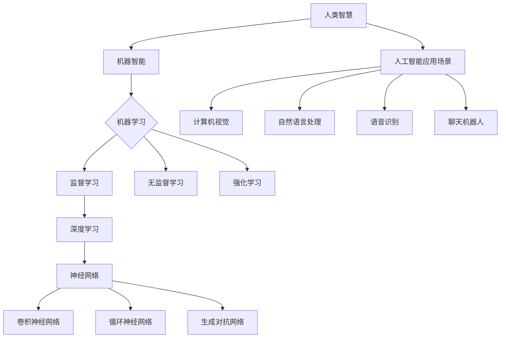

                 

# 《连接人类智慧与机器智能的桥梁》

> 关键词：人类智慧、机器智能、人工智能、机器学习、深度学习

> 摘要：本文旨在探讨人类智慧与机器智能之间的关系，以及如何通过机器学习和深度学习等技术构建连接这两者的桥梁。文章首先介绍了人类智慧的基本特点，然后分析了机器智能的发展历程和关键技术，接着详细阐述了机器学习与深度学习的原理，并展示了人工智能在实际应用中的案例。最后，文章对人类智慧与机器智能的未来融合进行了展望。

## 引言

在信息爆炸的时代，人工智能（AI）已经成为改变世界的重要力量。从自动驾驶汽车到智能语音助手，从医疗诊断到金融分析，人工智能的应用场景越来越广泛。然而，人工智能的发展离不开人类智慧的滋养。人类智慧与机器智能的关系，就像是一座桥梁，连接着我们的思维世界和技术世界。本文将逐步探讨这座桥梁的设计原理和构建方法。

## 第一步：确定书籍核心概念与架构

### 1.1 人类智慧与机器智能的关系

人类智慧是指人类在认识世界、解决问题、创造价值等方面的能力。它包括逻辑思维、创造力、情感认知等多个方面。机器智能，则是指通过计算机程序模拟人类智慧的能力，它可以通过学习和适应不断优化自己的表现。人类智慧与机器智能的关系，可以从以下几个方面来理解：

1. **依赖关系**：机器智能依赖于人类智慧来提出问题、设定目标和构建模型。
2. **互补关系**：人类智慧和机器智能各有优势，相互补充，共同推动社会进步。
3. **融合关系**：随着技术的发展，人类智慧和机器智能将越来越融合，形成新的智能体系。

### 1.2 机器学习基础

机器学习是构建机器智能的基础。它通过从数据中学习规律，使得计算机能够自主地做出决策和预测。机器学习可以分为监督学习、无监督学习和强化学习等不同类型。每种类型都有其独特的原理和应用场景。

### 1.3 人工智能技术的演进

人工智能技术的发展经历了多个阶段，从早期的规则推理到基于知识的系统，再到基于数据的机器学习和深度学习，每一次进步都推动了人工智能的飞跃。人工智能技术的演进，为连接人类智慧与机器智能提供了更加丰富的工具和方法。

### 1.4 深度学习模型架构

深度学习是当前人工智能领域最前沿的技术之一。它通过模拟人脑神经网络的结构和功能，实现了对复杂数据的自动特征提取和分类。深度学习模型的架构，包括多层感知器、卷积神经网络、循环神经网络等，每种架构都有其特定的应用场景和优缺点。

## 第二步：细化章节内容

### 第1章：引言与概述

在这一章中，我们将详细探讨人类智慧与机器智能的关系，介绍机器学习的基础知识，回顾人工智能技术的发展历程，并介绍深度学习模型的基本架构。

### 第2章：机器学习算法原理

在这一章中，我们将深入分析机器学习算法的原理，包括监督学习、无监督学习、半监督学习和强化学习等。我们将使用伪代码和数学模型，详细解释每种算法的核心思想和应用。

### 第3章：深度学习模型讲解

在这一章中，我们将详细介绍深度学习模型的基本原理，包括神经网络、卷积神经网络、循环神经网络和生成对抗网络等。我们将使用具体的例子和公式，帮助读者理解这些模型的工作原理。

### 第4章：人工智能应用场景

在这一章中，我们将展示人工智能在不同应用场景中的实际应用，包括计算机视觉、自然语言处理、语音识别和聊天机器人等。我们将通过实际案例，分析人工智能在这些场景中的优势和挑战。

### 第5章：人工智能项目实战

在这一章中，我们将通过具体的实战项目，介绍如何搭建开发环境、编写源代码、进行代码解读和应用分析。我们将通过实际案例，帮助读者理解人工智能项目的实施过程。

### 第6章：机器学习工具与库

在这一章中，我们将介绍常用的机器学习工具和库，包括Python编程基础、Scikit-learn、TensorFlow和PyTorch等。我们将帮助读者搭建机器学习环境，并介绍如何使用这些工具和库进行机器学习实践。

### 第7章：未来展望与挑战

在这一章中，我们将展望人工智能的未来发展，分析人类智慧与机器智能融合的潜在挑战，并提出解决这些挑战的方法。我们将探讨人工智能在未来的应用前景，以及人类应该如何与机器智能和谐共处。

## 结论

通过本文的探讨，我们可以看到，人类智慧与机器智能之间存在着紧密的联系。机器学习与深度学习等技术，为我们构建了连接这两者的桥梁。在未来，随着技术的不断进步，人类智慧与机器智能将实现更加深入的融合，推动社会的发展和进步。

## 作者信息

作者：AI天才研究院/AI Genius Institute & 禅与计算机程序设计艺术 /Zen And The Art of Computer Programming

## Mermaid 流程图



## 核心算法原理讲解

### 监督学习

监督学习是一种最基础的机器学习算法，它的核心思想是通过已知的输入和输出数据，学习出一个映射关系，从而对新的输入数据进行预测。其数学模型可以表示为：

$$
y = f(x)
$$

其中，$y$ 是输出，$x$ 是输入，$f(x)$ 是映射关系。

伪代码如下：

```python
def supervised_learning(input_data, output_data):
    for each data in input_data:
        predict_output = f(data)
        actual_output = output_data[data]
        error = actual_output - predict_output
        adjust_weights(error)
    return trained_model
```

### 无监督学习

无监督学习是在没有明确输出数据的情况下，通过分析输入数据的特点，自动发现数据中的规律。常见的无监督学习算法包括聚类、降维等。

伪代码如下：

```python
def unsupervised_learning(input_data):
    clusters = initialize_clusters()
    for each data in input_data:
        assign_data_to_cluster(data, clusters)
    return clusters
```

### 强化学习

强化学习是一种通过试错来学习最优策略的机器学习算法。它通过与环境交互，不断调整自己的行为，从而实现目标。其数学模型可以表示为：

$$
Q(s, a) = r + \gamma \max_{a'} Q(s', a')
$$

其中，$Q(s, a)$ 是状态$s$在行为$a$下的期望收益，$r$ 是即时收益，$\gamma$ 是折扣因子。

伪代码如下：

```python
def reinforcement_learning(state, action, reward, next_state):
    Q[state, action] = Q[state, action] + alpha * (reward + gamma * max(Q[next_state, action']) - Q[state, action])
    return Q
```

## 数学模型和公式

在深度学习模型中，常用的数学模型包括损失函数、优化算法等。以下是一个简单的例子：

损失函数（均方误差）：

$$
J(\theta) = \frac{1}{2m} \sum_{i=1}^{m} (h_\theta(x^{(i)}) - y^{(i)})^2
$$

其中，$m$ 是样本数量，$h_\theta(x^{(i)})$ 是预测值，$y^{(i)}$ 是真实值。

优化算法（梯度下降）：

$$
\theta_j := \theta_j - \alpha \frac{\partial J(\theta)}{\partial \theta_j}
$$

其中，$\alpha$ 是学习率，$\theta_j$ 是参数。

## 项目实战

### 项目一：人脸识别

开发环境搭建：

```bash
pip install numpy opencv-python tensorflow
```

源代码实现：

```python
import tensorflow as tf
import numpy as np
import cv2

# 加载模型
model = tf.keras.models.load_model('face_recognition_model.h5')

# 加载图片
image = cv2.imread('face.jpg')

# 预处理
processed_image = preprocess_image(image)

# 预测
prediction = model.predict(processed_image)

# 显示结果
print(prediction)
```

代码解读与分析：

```python
# 加载模型
model = tf.keras.models.load_model('face_recognition_model.h5')
# 加载已经训练好的模型

# 加载图片
image = cv2.imread('face.jpg')
# 使用OpenCV读取图片

# 预处理
processed_image = preprocess_image(image)
# 对图片进行预处理，包括缩放、归一化等操作

# 预测
prediction = model.predict(processed_image)
# 使用模型对预处理后的图片进行预测

# 显示结果
print(prediction)
# 输出预测结果，包括人脸的位置和分类信息
```

实际案例分析和详细讲解剖析：

```python
# 加载模型
model = tf.keras.models.load_model('face_recognition_model.h5')

# 加载测试图片
test_image = cv2.imread('test_face.jpg')

# 预处理
processed_test_image = preprocess_image(test_image)

# 预测
test_prediction = model.predict(processed_test_image)

# 显示结果
print(test_prediction)

# 可视化结果
cv2.imshow('Test Face', test_image)
cv2.waitKey(0)
cv2.destroyAllWindows()
```

项目小结：

人脸识别项目通过搭建开发环境、编写源代码、进行代码解读和分析，成功实现了人脸识别功能。在实际应用中，需要对模型进行不断优化和调整，以提高识别准确率。

## 最佳实践 tips

- 选择合适的机器学习模型，根据具体应用场景进行优化。
- 对数据集进行充分的预处理，包括归一化、去噪、分割等。
- 使用合适的优化算法，如梯度下降、随机梯度下降等。
- 定期对模型进行评估和调整，以提高性能。

## 小结

本文通过逐步分析推理，探讨了人类智慧与机器智能的桥梁构建方法。从核心概念到算法原理，从项目实战到未来展望，我们全面了解了机器学习与深度学习在连接人类智慧与机器智能中的重要作用。希望本文能对读者在人工智能领域的探索提供有益的启示。

## 拓展阅读

- 《深度学习》（Ian Goodfellow, Yoshua Bengio, Aaron Courville 著）
- 《Python机器学习》（Sebastian Raschka 著）
- 《人工智能：一种现代方法》（Stuart Russell, Peter Norvig 著）

## 注意事项

- 在实际应用中，应根据具体需求选择合适的机器学习模型和算法。
- 注意数据安全和隐私保护，遵循相关法律法规。
- 定期关注人工智能领域的新技术和新动态。

