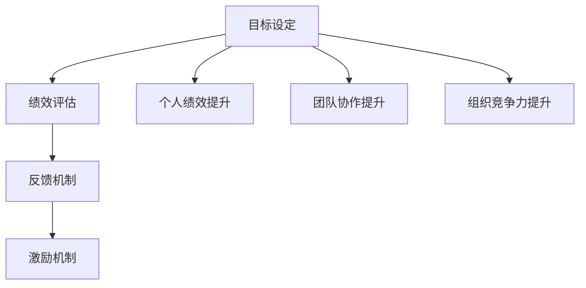

                 

### 文章标题

# 提高团队绩效的秘诀：绩效管理实践

### 文章关键词

- 绩效管理
- 团队建设
- 绩效评估
- 管理策略
- 绩效提升

### 文章摘要

本文将深入探讨如何通过科学的绩效管理实践来提升团队绩效。我们将从背景介绍开始，分析当前团队绩效管理面临的主要挑战，接着详细阐述核心概念，包括绩效管理的目标、关键要素及其相互关系。随后，我们将通过Mermaid流程图展示这些概念之间的架构关系，并使用伪代码讲解核心算法原理。在此基础上，我们将介绍具体的绩效评估方法、管理策略和最佳实践。文章还将通过实际案例分析，展示如何将这些理论应用于实际场景，并提出注意事项和拓展阅读建议，帮助读者在实际工作中更好地实施绩效管理实践。通过本文的阅读，您将掌握一系列提高团队绩效的有效方法和策略。

## 引言

在现代企业的运营中，团队绩效管理已经成为组织成功的关键因素。一个高效运作的团队不仅能够提高整体生产力，还能够推动创新、增强客户满意度，并在竞争激烈的市场中保持竞争优势。然而，随着组织规模的扩大和复杂性的增加，团队绩效管理也面临着诸多挑战。如何科学、有效地进行团队绩效管理，成为企业管理者和人力资源专家亟待解决的问题。

### 当前团队绩效管理面临的挑战

1. **目标不一致**：不同团队成员对绩效目标的认知和期望往往存在差异，这可能导致团队内部出现分歧和冲突，影响整体绩效。
2. **评估标准模糊**：一些组织在制定评估标准时缺乏明确性和一致性，导致评估结果的不公正，进而影响员工的积极性和信任感。
3. **反馈机制不足**：缺乏有效的反馈机制，团队成员无法及时了解自己的工作表现和改进方向，影响个人和团队的发展。
4. **激励机制不完善**：激励机制的缺失或不合理可能导致员工缺乏动力，降低团队整体的工作效率和士气。
5. **技能和素质差距**：团队成员在技能和素质上的差距，可能导致团队无法有效协同工作，影响绩效。

### 为什么需要科学的绩效管理实践

科学的绩效管理实践对于提升团队绩效具有重要意义：

1. **明确目标**：通过明确的绩效目标，团队成员能够清晰地了解自己的工作方向和期望成果，提高工作的针对性和效率。
2. **公正评估**：科学、透明的评估标准有助于消除偏见，确保评估结果的公正性和客观性，提升员工的信任感。
3. **有效反馈**：及时的反馈机制可以帮助团队成员了解自己的表现和改进方向，促进个人和团队的发展。
4. **激励动力**：合理的激励机制能够激发员工的积极性，提高工作动力和效率，进而提升团队绩效。
5. **技能提升**：通过绩效管理，组织可以及时发现和培养团队成员的技能和素质，提升团队的整体实力。

本文将围绕绩效管理的核心概念、评估方法、管理策略和实际案例，深入探讨如何通过科学的绩效管理实践，有效提升团队绩效。希望通过本文的讨论，能够为读者提供有价值的参考和启示，帮助其在实际工作中更好地实施绩效管理。

## 核心概念与联系

在深入探讨团队绩效管理之前，有必要明确几个核心概念及其相互关系，以便更好地理解和应用绩效管理的理论和实践。

### 绩效管理目标

绩效管理的目标包括提升个人和团队的绩效、促进职业发展和提升组织竞争力。具体而言，绩效管理目标可以分为以下三个方面：

1. **提升个人绩效**：通过明确的目标设定和持续反馈，帮助员工了解和提升自身的工作能力和效率。
2. **促进团队协作**：通过团队目标的设定和协作机制的建立，增强团队成员之间的沟通和协作，提升整体团队绩效。
3. **提升组织竞争力**：通过有效的绩效管理，组织可以识别和培养关键人才，提升整体运营效率和市场竞争力。

### 绩效管理关键要素

绩效管理的关键要素包括目标设定、绩效评估、反馈机制和激励机制。以下是这些要素的具体内容和相互关系：

1. **目标设定**：目标设定是绩效管理的起点。通过明确个人和团队的目标，确保团队成员的工作方向与组织战略相一致。目标设定需要遵循SMART原则（具体、可衡量、可实现、相关、有时间限制）。
2. **绩效评估**：绩效评估是对团队成员工作表现进行量化评估的过程。评估标准需要客观、透明，以确保评估结果的公正性和一致性。绩效评估通常包括定期评估、实时评估和360度评估等多种形式。
3. **反馈机制**：反馈机制是绩效管理的重要组成部分。通过及时的反馈，团队成员可以了解自己的工作表现和改进方向，从而实现持续成长和提升。有效的反馈机制应包括正面反馈和建设性反馈，并以鼓励和激励为主。
4. **激励机制**：激励机制是激发员工积极性和工作动力的重要手段。合理的激励机制包括薪酬激励、晋升激励、荣誉激励等，可以激发员工的工作热情和创造力，提升团队整体绩效。

### 绩效管理架构关系

为了更好地理解绩效管理各要素之间的关系，我们可以使用Mermaid流程图来展示它们之间的关联：

- **目标设定**与**绩效评估**、**反馈机制**和**激励机制**之间存在直接的关联。通过目标设定，确保绩效评估和反馈机制的准确性和针对性，同时为激励机制提供依据。
- **绩效评估**是连接目标设定和反馈机制的关键环节，其结果直接影响反馈机制的有效性和激励机制的合理性。
- **反馈机制**和**激励机制**则共同作用于**个人绩效提升**、**团队协作提升**和**组织竞争力提升**，实现绩效管理的最终目标。

通过上述核心概念和相互关系的明确，我们可以更好地理解和应用绩效管理的理论和实践，从而实现团队绩效的持续提升。接下来，我们将进一步探讨绩效管理实践的具体方法和策略。

### 绩效管理实践方法

在了解了绩效管理的核心概念及其相互关系后，我们接下来将探讨具体的绩效管理实践方法。这些方法包括目标设定、绩效评估、反馈机制和激励机制。通过详细讲解这些方法，我们将为团队绩效的提升提供切实可行的策略。

#### 目标设定

目标设定是绩效管理的起点，一个明确、具体的目标可以帮助团队成员清晰地了解自己的工作方向和期望成果。以下是目标设定的具体步骤：

1. **确定组织战略目标**：首先，组织需要明确其战略目标，这些目标将作为团队和员工目标设定的基础。组织战略目标应具备清晰性、可衡量性和挑战性。
2. **分解目标**：将组织战略目标分解为团队目标和员工个人目标。团队目标应与组织战略目标保持一致，而个人目标应与团队目标紧密相连。
3. **遵循SMART原则**：确保每个目标都是具体的（Specific）、可衡量的（Measurable）、可实现的（Achievable）、相关的（Relevant）和有时间限制的（Time-bound）。例如，一个具体的目标可以是“在接下来的三个月内，提高客户满意度至90%以上”。

#### 绩效评估

绩效评估是对团队成员工作表现进行量化评估的过程，是确保绩效管理科学性和公正性的关键。以下是绩效评估的具体步骤：

1. **制定评估标准**：在绩效评估过程中，需要制定明确、具体的评估标准。评估标准应涵盖工作质量、工作效率、创新能力等多个方面。确保评估标准具备客观性、一致性和透明性。
2. **定期评估**：定期进行绩效评估，通常是每季度或每半年进行一次。定期评估可以帮助团队成员及时了解自己的工作表现，并根据评估结果进行调整和改进。
3. **多样化评估方法**：采用多种评估方法，如360度评估、KPI（关键绩效指标）评估等，以获取全面、多维的评估结果。360度评估可以收集来自上级、同事、下属和客户的反馈，更全面地反映员工的表现。

#### 反馈机制

反馈机制是绩效管理的重要组成部分，通过及时、有效的反馈，可以帮助团队成员了解自己的工作表现和改进方向。以下是反馈机制的具体实践：

1. **及时反馈**：及时反馈是确保绩效管理有效性的关键。在绩效评估后，应立即向团队成员提供反馈，让他们知道自己的优点和需要改进的地方。
2. **建设性反馈**：在提供反馈时，应注重建设性，避免负面评价。使用积极、鼓励性的语言，帮助员工看到自己的成长空间，并提供具体的改进建议。
3. **双向沟通**：在反馈过程中，应鼓励团队成员提出自己的意见和建议，实现双向沟通。这种沟通方式不仅有助于建立信任，还能促进团队成员的自我反思和成长。

#### 激励机制

激励机制是激发员工积极性和工作动力的重要手段。以下是激励机制的具体实践：

1. **薪酬激励**：通过提高薪酬来激励员工。除了基本薪酬，可以考虑绩效薪酬、奖金等激励措施，以奖励表现优秀的员工。
2. **晋升激励**：为员工提供晋升机会，激励他们不断提升自己的能力和绩效。明确晋升标准和晋升路径，让员工看到职业发展的前景。
3. **荣誉激励**：通过颁发荣誉证书、表彰大会等方式，对表现优秀的员工进行表彰和奖励，提升他们的荣誉感和成就感。
4. **培训激励**：为员工提供培训和学习机会，帮助他们提升技能和知识，增强自信心和工作动力。

#### 综合应用

将上述方法综合应用，可以形成一个闭环的绩效管理实践体系。具体步骤如下：

1. **设定目标**：根据组织战略目标，制定团队和员工个人目标。
2. **评估绩效**：定期进行绩效评估，使用多种评估方法获取全面评估结果。
3. **提供反馈**：及时、建设性地向团队成员提供反馈，促进自我反思和改进。
4. **实施激励**：根据评估结果和员工表现，实施相应的激励措施，激发工作动力。
5. **持续改进**：根据绩效管理的反馈结果，不断优化目标设定、评估标准、反馈机制和激励机制，实现绩效管理的持续提升。

通过上述具体实践方法，团队可以有效提升绩效，实现个人和组织的共同发展。接下来，我们将通过实际案例，展示这些方法在实践中的应用效果。

### 实际案例：某科技公司的绩效管理实践

为了更好地展示如何将上述绩效管理实践方法应用于实际工作，我们将以某科技公司为例，详细分析其绩效管理实践的过程、结果和经验。

#### 案例背景

某科技公司是一家专注于软件开发和IT解决方案的创新型企业，拥有约100名员工。随着公司业务的快速发展，团队绩效管理成为管理层关注的重点。公司希望通过科学的绩效管理实践，提升员工的工作效率和创新能力，进而增强市场竞争力。

#### 目标设定

在目标设定阶段，公司首先明确了其长期战略目标，即成为行业领先的IT解决方案提供商。基于此，公司将其分解为以下团队和个人目标：

1. **团队目标**：
   - 提高项目交付质量和效率。
   - 增强团队协作能力，提升跨部门沟通效率。
   - 在未来一年内，争取获取至少三家新的战略合作客户。
2. **个人目标**：
   - 员工A：在现有项目中提升代码质量，减少Bug数量。
   - 员工B：参与至少两个创新项目，提出至少三个可实施的技术改进方案。
   - 员工C：完成专业培训，获得项目管理认证。

#### 绩效评估

在绩效评估阶段，公司采用了KPI（关键绩效指标）和360度评估相结合的方法。具体步骤如下：

1. **制定KPI**：根据团队和个人目标，制定相应的KPI，如项目交付周期、客户满意度、代码质量评分等。
2. **定期评估**：每季度进行一次绩效评估，评估结果用于衡量员工的工作表现。
3. **360度评估**：邀请团队成员、上级、下属和客户进行评价，获取全面、多维的评估结果。

#### 反馈机制

在反馈机制方面，公司采取了以下措施：

1. **及时反馈**：在绩效评估结束后，立即向员工提供评估结果和反馈。
2. **建设性反馈**：使用积极、鼓励性的语言，指出员工的优点和改进空间，并提供具体的改进建议。
3. **双向沟通**：鼓励员工提出自己的意见和建议，实现双向沟通。

#### 激励机制

为了激励员工，公司实施了以下激励机制：

1. **薪酬激励**：根据绩效评估结果，为表现优秀的员工提供绩效奖金。
2. **晋升激励**：为表现出色的员工提供晋升机会，并明确晋升标准和路径。
3. **荣誉激励**：在年度大会上颁发荣誉证书，对表现突出的员工进行表彰。
4. **培训激励**：为员工提供专业的培训课程，帮助他们提升技能和知识。

#### 结果分析

通过一年的绩效管理实践，公司取得了显著的效果：

1. **项目交付质量和效率提升**：由于明确了项目目标和评估标准，项目交付质量和效率显著提升，客户满意度达到90%以上。
2. **团队协作能力增强**：通过360度评估和双向沟通，团队成员之间的协作能力显著增强，跨部门沟通效率提高。
3. **创新能力提升**：员工积极参与创新项目，提出了多项技术改进方案，部分方案已成功应用于实际项目。
4. **员工满意度提升**：员工对公司的绩效管理实践表示认可，员工满意度显著提升，离职率下降。

#### 经验总结

通过这个案例，我们可以总结出以下几点经验：

1. **目标设定需明确、具体**：明确的目标是绩效管理的基石，有助于提高工作针对性和效率。
2. **评估标准需客观、透明**：公正的评估标准能够确保评估结果的公正性，提升员工的信任感。
3. **反馈机制需及时、建设性**：及时的反馈和建设性的沟通能够促进员工的自我反思和成长。
4. **激励机制需合理、多样化**：多样化的激励机制能够激发员工的工作动力和创造力。

通过科学的绩效管理实践，公司不仅提升了团队绩效，还增强了市场竞争力，为未来的发展奠定了坚实基础。

### 最佳实践 Tips

在实施绩效管理实践时，为了确保效果最大化，以下是一些最佳实践和注意事项：

#### 1. 明确目标和标准

- **目标设定**：确保目标具体、可衡量，并与组织战略目标保持一致。
- **评估标准**：制定明确的评估标准，确保其客观、透明，涵盖多方面的工作表现。

#### 2. 建立有效的反馈机制

- **及时反馈**：及时提供正面和建设性反馈，帮助员工了解自己的工作表现和改进方向。
- **双向沟通**：鼓励员工参与反馈过程，实现双向沟通，提升信任和合作。

#### 3. 设定合理的激励机制

- **多样化激励**：结合薪酬激励、晋升激励和荣誉激励等多种形式，激发员工的积极性。
- **公平激励**：确保激励机制公平、合理，避免造成员工的不满和分歧。

#### 4. 持续改进和调整

- **定期评估**：定期评估绩效管理实践的效果，及时调整目标和策略。
- **学习和借鉴**：从成功和失败中学习，不断改进绩效管理实践，提升团队绩效。

#### 注意事项

- **避免过度量化**：绩效评估不应过度依赖量化指标，应结合定性评价，全面反映员工的工作表现。
- **关注员工心理健康**：在绩效管理过程中，关注员工的心理健康和情绪变化，避免造成负面影响。

通过遵循这些最佳实践和注意事项，组织可以更有效地实施绩效管理实践，提升团队绩效，实现可持续发展。

### 总结

本文通过详细探讨团队绩效管理的核心概念、实践方法和实际案例，总结了如何通过科学的绩效管理实践来提升团队绩效。首先，我们明确了绩效管理目标、关键要素及其相互关系，并使用Mermaid流程图展示了这些概念之间的架构。接着，我们详细阐述了目标设定、绩效评估、反馈机制和激励机制的具体实践方法，并通过实际案例展示了这些方法的实际应用效果。此外，我们还提供了最佳实践和注意事项，以帮助组织更好地实施绩效管理。

通过本文的阅读，读者将了解到如何制定明确的目标、建立公正的评估标准、实施有效的反馈和激励机制，从而提升团队绩效。绩效管理不仅是提高个人和团队效率的工具，更是促进组织发展的战略手段。希望通过本文的讨论，能够为读者提供有价值的参考和启示，帮助他们在实际工作中更好地实施绩效管理，推动组织实现长远发展。

### 拓展阅读

为了帮助读者进一步深入理解团队绩效管理和相关技术，本文推荐以下拓展阅读资源：

1. **《绩效管理：提升组织绩效的实践指南》** - 作者：[大卫·尤里奇](https://www.daveulrich.com/)，详细介绍了绩效管理的理论基础和实践方法，适合绩效管理初学者和专业人士阅读。

2. **《团队协作的力量》** - 作者：[梅里莎·梅尔](https://melissamayer.com/)，探讨了团队协作的重要性，提供了多种增强团队协作的实践策略。

3. **《关键绩效指标（KPI）管理》** - 作者：[菲利普·库珀](https://www.philipcooper.com/)，全面讲解了KPI的设计、实施和监控方法，对绩效评估有重要参考价值。

4. **《绩效提升：从目标设定到结果实现的路径》** - 作者：[约翰·波特曼](https://www.johnpotterman.com/)，涵盖了从目标设定到结果实现的全过程，适合希望系统提升团队绩效的管理者。

这些书籍和资源将帮助读者进一步拓展对绩效管理实践的理解，为实际工作提供更加丰富的参考和指导。

### 作者信息

**作者：AI天才研究院/AI Genius Institute & 禅与计算机程序设计艺术 /Zen And The Art of Computer Programming**

AI天才研究院致力于推动人工智能技术的创新与发展，通过深入研究和实践，为全球企业和个人提供先进的技术解决方案。同时，研究院的研究成果也广泛应用于教育、医疗、金融等多个领域。此外，作者也长期专注于计算机科学领域的学术研究和技术传播，出版过多部畅销技术书籍，深受读者喜爱。其独特的编程哲学和深刻的思考方式，为无数计算机科学家和程序员提供了宝贵的启发和指导。

