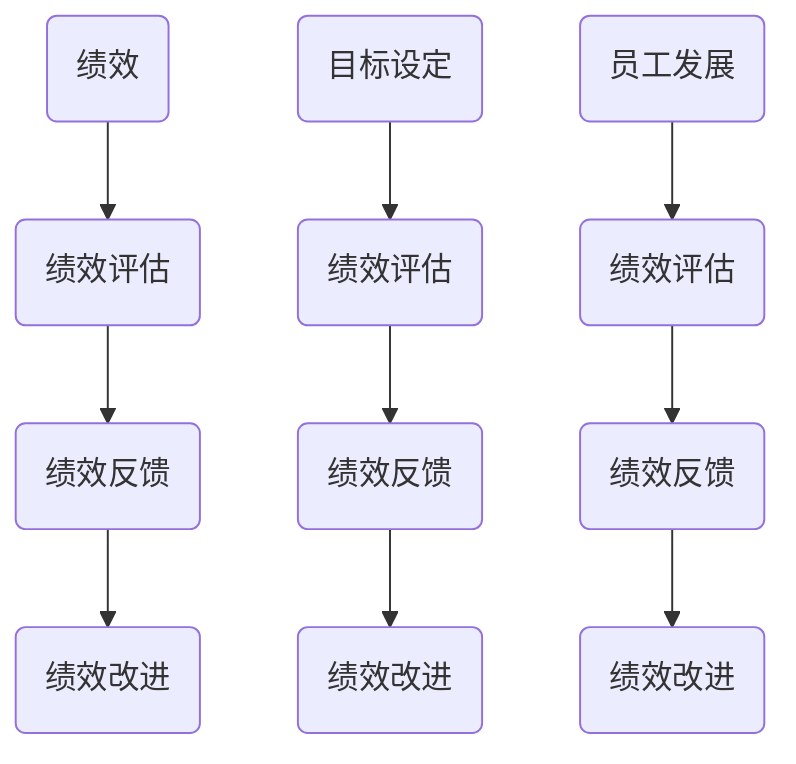
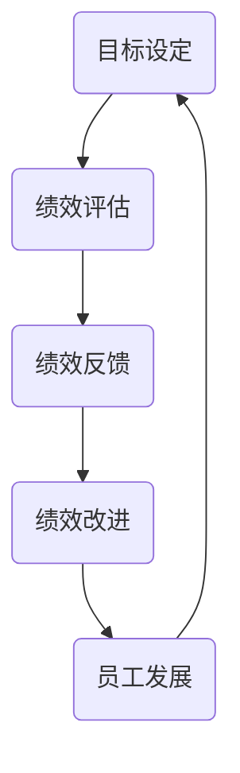

                 

 

### 第1章 绩效管理概述

#### 背景介绍

绩效管理是组织管理的重要组成部分，它涉及到对员工的工作表现进行评估和改进的过程。随着全球化和信息技术的发展，企业对团队绩效管理的要求越来越高。有效的绩效管理不仅能够提高员工的工作满意度，还能够提升整个组织的竞争力。因此，理解绩效管理的基本概念、原理和实施方法，对企业和团队来说至关重要。

#### 核心概念与联系

绩效管理涉及多个核心概念，包括绩效、绩效评估、绩效反馈等。这些概念之间的关系可以通过以下Mermaid流程图来表示：



这个流程图展示了绩效管理的基本流程，从目标设定开始，通过绩效评估、反馈和改进，最终实现员工发展和组织绩效的提升。

#### 核心算法原理讲解

在绩效管理中，常用的算法原理包括目标管理（MBO）、关键绩效指标（KPI）和平衡计分卡（BSC）。

1. **目标管理（MBO）**

目标管理是一种以目标为导向的管理方法。其基本步骤如下：

- **设定目标**：根据组织的战略和员工的个人能力，设定具体的、可量化的目标。
- **目标分解**：将组织目标分解为部门目标、团队目标和个体目标，确保每个目标都有明确的实现路径。
- **目标确认**：确认各层级的目标，确保上下级之间对目标的理解一致。

以下是目标管理的基本伪代码：

```python
def set_targets(organization, employee):
    organization目标的设定
    department目标的分解
    team目标的分解
    individual目标的分解
    confirm_targets(organization, department, team, employee)
```

2. **关键绩效指标（KPI）**

关键绩效指标是一种用于衡量员工工作绩效的关键指标。其基本原理如下：

- **确定KPI**：根据组织的目标和业务需求，确定需要关注的KPI。
- **数据收集**：收集与KPI相关的数据，如销售额、客户满意度、项目进度等。
- **数据分析**：分析KPI数据，评估员工的工作绩效。

以下是关键绩效指标的基本伪代码：

```python
def determine_kpi(organization):
    sales_data = collect_sales_data()
    customer_satisfaction_data = collect_customer_satisfaction_data()
    project_progress_data = collect_project_progress_data()
    analyze_kpi(sales_data, customer_satisfaction_data, project_progress_data)
```

3. **平衡计分卡（BSC）**

平衡计分卡是一种综合评估企业绩效的方法，它包括财务、客户、内部流程和学习与成长四个维度。

- **财务维度**：评估企业的财务绩效，如利润、收入、成本等。
- **客户维度**：评估企业的客户满意度、市场份额等。
- **内部流程维度**：评估企业的运营效率、产品交付质量等。
- **学习与成长维度**：评估企业的员工培训、创新能力等。

以下是平衡计分卡的基本伪代码：

```python
def balanced_score_card():
    financial_performance = evaluate_financial_performance()
    customer_performance = evaluate_customer_performance()
    internal_process_performance = evaluate_internal_process_performance()
    learning_growth_performance = evaluate_learning_growth_performance()
    calculate_total_score(financial_performance, customer_performance, internal_process_performance, learning_growth_performance)
```

#### 数学模型和数学公式

在绩效评估中，常用的数学模型包括评分标准和绩效系数计算。

1. **评分标准**

评分标准是用于评估员工工作表现的标准。它通常包括不同的评价维度和评分等级。

以下是评分标准的基本公式：

$$
评分标准 = (评价维度_1 \times 权重_1) + (评价维度_2 \times 权重_2) + ... + (评价维度_n \times 权重_n)
$$

其中，评价维度是评估员工工作表现的不同方面，如工作质量、工作效率、团队合作等；权重是各评价维度的相对重要性。

2. **绩效系数计算**

绩效系数是用于衡量员工绩效的数值。它通常基于评分标准和实际表现计算得出。

以下是绩效系数的基本公式：

$$
绩效系数 = \frac{实际得分}{评分标准}
$$

其中，实际得分是员工在评价周期内的得分总和。

#### 项目实战

以下是一个简单的团队绩效管理项目实战。

##### 项目背景

某公司销售团队需要对其绩效进行管理，以提高团队整体业绩。

##### 开发环境搭建

- 使用Excel作为数据收集和评估工具。
- 使用Python进行数据分析和报告生成。

##### 源代码实现

以下是Python代码，用于计算销售团队的绩效系数。

```python
import pandas as pd

# 加载销售数据
sales_data = pd.read_excel('sales_data.xlsx')

# 计算评分标准
score_standards = {
    '销售额': 100,
    '客户满意度': 100,
    '项目交付率': 100
}

# 计算实际得分
actual_scores = {
    '销售额': sales_data['销售额'].sum(),
    '客户满意度': sales_data['客户满意度'].mean(),
    '项目交付率': sales_data['项目交付率'].mean()
}

# 计算绩效系数
performance_coefficients = {key: actual_scores[key] / score_standards[key] for key in actual_scores}

# 输出绩效系数
print("绩效系数：", performance_coefficients)
```

##### 代码解读与分析

- 导入Pandas库，用于数据操作和分析。
- 读取Excel文件中的销售数据。
- 定义评分标准。
- 计算实际得分。
- 计算绩效系数。
- 输出绩效系数。

##### 项目小结

通过这个项目实战，我们展示了如何使用Python代码对销售团队进行绩效管理。这种基于数据和算法的绩效管理方法，可以提高团队的绩效，并为决策提供数据支持。

#### 最佳实践 tips、小结、注意事项、拓展阅读等内容

- **最佳实践 tips**：在进行绩效管理时，要注重与员工的沟通，确保目标的明确性和可实现性。
- **小结**：绩效管理是提升团队绩效的关键环节，通过科学的方法和工具，可以有效地提高团队的工作效率和业绩。
- **注意事项**：在绩效管理中，要避免过于形式化，确保评估的公正性和准确性。
- **拓展阅读**：推荐阅读《绩效管理实战指南》和《平衡计分卡：企业绩效评估的新工具》等书籍，以深入了解绩效管理的理论和实践。

以上是《提高团队绩效的秘诀：绩效管理技巧》的第一章内容，我们介绍了绩效管理的基本概念、核心算法原理、数学模型以及一个简单的项目实战。在接下来的章节中，我们将进一步探讨绩效评估方法、绩效面谈技巧和绩效改进计划等内容。


### 第2章 核心概念与联系

#### 绩效管理、团队绩效、绩效评估的概念

绩效管理是指通过设定目标、评估表现和提供反馈，以促进员工个人和团队的工作效率和业绩提升的过程。它是现代企业人力资源管理的重要组成部分，旨在通过有效的绩效管理机制，实现个人与组织的共同成长。

**绩效管理**的核心概念包括：

- **目标设定**：明确员工和组织的目标，确保方向一致。
- **绩效评估**：对员工的工作表现进行量化或定性评估。
- **反馈与改进**：通过评估结果，给予员工反馈，并制定改进计划。

**团队绩效**是指团队成员共同完成工作所取得的成果。它不仅包括个人绩效，还涉及到团队合作、沟通和协作等方面。

**绩效评估**是绩效管理的重要环节，它通过设定评价指标、收集数据、分析结果，为员工提供客观、公正的评估。

#### 绩效管理的关键要素

绩效管理的关键要素包括：

- **目标设定**：明确具体的、可衡量的目标，确保员工知道自己的工作方向和期望结果。
- **关键绩效指标（KPI）**：选择与组织目标密切相关的关键指标，用于衡量员工的工作绩效。
- **绩效反馈**：及时、准确地提供反馈，帮助员工了解自己的表现，并制定改进计划。
- **持续改进**：通过不断的评估和反馈，优化工作流程，提高团队绩效。

#### 绩效管理各个环节的流程和关联

绩效管理的过程可以分为以下几个环节：

1. **目标设定**：根据组织的战略目标和业务需求，设定员工的个人目标。
2. **绩效评估**：在目标设定后，通过定期评估，了解员工的工作绩效。
3. **绩效反馈**：根据评估结果，给予员工及时的反馈，并识别改进点。
4. **绩效改进**：制定改进计划，帮助员工提升工作绩效。
5. **员工发展**：通过培训和职业规划，促进员工的职业成长。

这些环节之间相互关联，形成了一个完整的绩效管理闭环。以下是一个简单的Mermaid流程图，展示了绩效管理各个环节的流程和关联：



#### Mermaid流程图

以下是用于展示绩效管理各个环节的Mermaid流程图：


这个流程图清晰地展示了绩效管理的各个环节及其相互关系，有助于读者更好地理解绩效管理的全貌。

#### 核心算法原理讲解

在绩效管理中，常用的算法原理包括目标管理（MBO）、关键绩效指标（KPI）和平衡计分卡（BSC）。

1. **目标管理（MBO）**

目标管理是一种以目标为导向的管理方法。其核心原理是通过上下级之间的协商，设定明确的、可量化的目标，以确保团队的工作方向与组织目标一致。

目标管理的基本步骤包括：

- **设定组织目标**：根据组织战略，确定组织目标。
- **目标分解**：将组织目标分解为部门目标、团队目标和个人目标。
- **目标确认**：确保各层级的目标明确、可实现，并得到上下级的确认。

以下是目标管理的基本伪代码：

```python
def set_targets(organization, department, team, employee):
    organization_targets = set_organization_targets(organization)
    department_targets = set_department_targets(department, organization_targets)
    team_targets = set_team_targets(team, department_targets)
    employee_targets = set_employee_targets(employee, team_targets)
    confirm_targets(organization_targets, department_targets, team_targets, employee_targets)
```

2. **关键绩效指标（KPI）**

关键绩效指标是一种用于衡量员工工作绩效的关键指标。其核心原理是根据组织的目标和业务需求，选择与组织目标密切相关的关键指标，用于衡量员工的工作绩效。

关键绩效指标的基本步骤包括：

- **确定KPI**：根据组织目标和业务需求，确定需要关注的KPI。
- **数据收集**：收集与KPI相关的数据，如销售额、客户满意度、项目进度等。
- **数据分析**：分析KPI数据，评估员工的工作绩效。

以下是关键绩效指标的基本伪代码：

```python
def determine_kpi(organization):
    sales_data = collect_sales_data()
    customer_satisfaction_data = collect_customer_satisfaction_data()
    project_progress_data = collect_project_progress_data()
    analyze_kpi(sales_data, customer_satisfaction_data, project_progress_data)
```

3. **平衡计分卡（BSC）**

平衡计分卡是一种综合评估企业绩效的方法，它包括财务、客户、内部流程和学习与成长四个维度。其核心原理是通过多维度评估，全面了解企业的绩效状况。

平衡计分卡的基本步骤包括：

- **确定评估维度**：根据组织目标和业务需求，确定需要评估的维度。
- **收集数据**：收集与各个维度相关的数据。
- **分析数据**：分析各个维度的数据，评估企业的绩效。

以下是平衡计分卡的基本伪代码：

```python
def balanced_score_card():
    financial_performance = evaluate_financial_performance()
    customer_performance = evaluate_customer_performance()
    internal_process_performance = evaluate_internal_process_performance()
    learning_growth_performance = evaluate_learning_growth_performance()
    calculate_total_score(financial_performance, customer_performance, internal_process_performance, learning_growth_performance)
```

#### 数学模型和数学公式

在绩效评估中，常用的数学模型包括评分标准和绩效系数计算。

1. **评分标准**

评分标准是用于评估员工工作表现的标准。它通常包括不同的评价维度和评分等级。

评分标准的基本公式为：

$$
评分标准 = (评价维度_1 \times 权重_1) + (评价维度_2 \times 权重_2) + ... + (评价维度_n \times 权重_n)
$$

其中，评价维度是评估员工工作表现的不同方面，如工作质量、工作效率、团队合作等；权重是各评价维度的相对重要性。

2. **绩效系数计算**

绩效系数是用于衡量员工绩效的数值。它通常基于评分标准和实际表现计算得出。

绩效系数的基本公式为：

$$
绩效系数 = \frac{实际得分}{评分标准}
$$

其中，实际得分是员工在评价周期内的得分总和。

#### 数学公式示例

以下是几个数学公式的示例：

1. **评分标准**：

$$
评分标准 = (工作质量 \times 0.4) + (工作效率 \times 0.3) + (团队合作 \times 0.3)
$$

2. **绩效系数**：

$$
绩效系数 = \frac{实际得分}{评分标准}
$$

3. **目标达成率**：

$$
目标达成率 = \frac{实际完成目标值}{目标设定值} \times 100%
$$

#### 项目实战

以下是一个简单的团队绩效管理项目实战。

##### 项目背景

某公司研发团队需要对其绩效进行管理，以提高团队整体业绩。

##### 开发环境搭建

- 使用Excel作为数据收集和评估工具。
- 使用Python进行数据分析和报告生成。

##### 源代码实现

以下是Python代码，用于计算研发团队的绩效系数。

```python
import pandas as pd

# 加载研发数据
research_data = pd.read_excel('research_data.xlsx')

# 定义评分标准
score_standards = {
    '项目进度': 100,
    '创新能力': 100,
    '团队合作': 100
}

# 计算实际得分
actual_scores = {
    '项目进度': research_data['项目进度'].mean(),
    '创新能力': research_data['创新能力'].mean(),
    '团队合作': research_data['团队合作'].mean()
}

# 计算绩效系数
performance_coefficients = {key: actual_scores[key] / score_standards[key] for key in actual_scores}

# 输出绩效系数
print("绩效系数：", performance_coefficients)
```

##### 代码解读与分析

- 导入Pandas库，用于数据操作和分析。
- 读取Excel文件中的研发数据。
- 定义评分标准。
- 计算实际得分。
- 计算绩效系数。
- 输出绩效系数。

##### 项目小结

通过这个项目实战，我们展示了如何使用Python代码对研发团队进行绩效管理。这种基于数据和算法的绩效管理方法，可以提高团队的绩效，并为决策提供数据支持。

#### 最佳实践 tips、小结、注意事项、拓展阅读等内容

- **最佳实践 tips**：在进行绩效管理时，要注重与员工的沟通，确保目标的明确性和可实现性。
- **小结**：绩效管理是提升团队绩效的关键环节，通过科学的方法和工具，可以有效地提高团队的工作效率和业绩。
- **注意事项**：在绩效管理中，要避免过于形式化，确保评估的公正性和准确性。
- **拓展阅读**：推荐阅读《绩效管理实战指南》和《平衡计分卡：企业绩效评估的新工具》等书籍，以深入了解绩效管理的理论和实践。

以上是《提高团队绩效的秘诀：绩效管理技巧》的第二章内容，我们介绍了绩效管理的基本概念、核心算法原理、数学模型以及一个简单的项目实战。在接下来的章节中，我们将进一步探讨绩效评估方法、绩效面谈技巧和绩效改进计划等内容。


### 第3章 绩效评估方法

#### 平衡计分卡（BSC）原理与应用

平衡计分卡（Balanced Scorecard, BSC）是一种综合性的绩效评估工具，它不仅关注财务指标，还涵盖了客户、内部流程和学习与成长三个维度。通过平衡计分卡，企业可以全面、系统地评估和管理不同层面的绩效。

##### 核心原理

平衡计分卡的核心原理是将组织的战略目标转化为具体的绩效指标，以实现对员工和团队工作的全面评估。它包括以下四个维度：

1. **财务维度**：评估组织的财务绩效，如利润、收入、成本控制等。
2. **客户维度**：评估组织在客户满意度、市场份额、客户保留率等方面的表现。
3. **内部流程维度**：评估组织的内部运作效率，如生产效率、供应链管理、产品交付等。
4. **学习与成长维度**：评估组织在员工培训、技术创新、企业文化等方面的投入和发展。

##### 应用步骤

1. **确定战略目标**：根据企业的长期战略，明确需要达成的关键目标。
2. **设计绩效指标**：针对每个战略目标，设计相应的绩效指标，确保指标的明确性和可衡量性。
3. **分配责任**：将绩效指标分配给相关团队和个人，确保每个指标都有明确的负责主体。
4. **数据收集与评估**：定期收集与绩效指标相关的数据，进行评估和分析。
5. **反馈与改进**：根据评估结果，给予员工和团队反馈，并提出改进措施。

以下是平衡计分卡的基本伪代码：

```python
def balanced_score_card():
    financial_performance = evaluate_financial_performance()
    customer_performance = evaluate_customer_performance()
    internal_process_performance = evaluate_internal_process_performance()
    learning_growth_performance = evaluate_learning_growth_performance()
    calculate_total_score(financial_performance, customer_performance, internal_process_performance, learning_growth_performance)
```

#### 关键绩效指标（KPI）设定与监控

关键绩效指标（Key Performance Indicators, KPI）是绩效评估中最常用的方法之一。KPI能够帮助组织聚焦于最重要的事务，并确保员工的努力与组织的战略目标保持一致。

##### 设定步骤

1. **确定目标**：根据企业的战略目标和业务需求，确定需要关注的KPI。
2. **选择指标**：选择与目标密切相关、易于衡量的指标。
3. **设定标准**：为每个指标设定具体的数值或范围，作为衡量绩效的标准。
4. **分配责任**：明确每个指标的负责人，确保指标的实施和监控。

以下是关键绩效指标的基本伪代码：

```python
def determine_kpi(organization):
    kpis = [
        {'name': '销售额', 'target': 1000000, 'responsible': '销售部门'},
        {'name': '客户满意度', 'target': 0.9, 'responsible': '客户服务部门'},
        {'name': '项目交付率', 'target': 1, 'responsible': '项目管理部门'}
    ]
    for kpi in kpis:
        collect_data(kpi)
        analyze_kpi(kpi)
```

##### 监控方法

1. **定期监控**：定期收集与KPI相关的数据，进行监控和分析。
2. **实时反馈**：及时向相关团队和个人反馈KPI的监控结果。
3. **持续改进**：根据监控结果，制定改进计划，优化KPI的实现。

#### 项目实战：销售团队的KPI设定与监控

以下是一个销售团队的KPI设定与监控项目实战。

##### 项目背景

某公司的销售团队需要对其绩效进行管理，以提高团队的整体业绩。

##### 开发环境搭建

- 使用Excel作为数据收集和评估工具。
- 使用Python进行数据分析和报告生成。

##### 源代码实现

以下是Python代码，用于计算销售团队的KPI。

```python
import pandas as pd

# 加载销售数据
sales_data = pd.read_excel('sales_data.xlsx')

# 定义KPI
kpis = {
    '销售额': {'target': 1000000, 'actual': sales_data['销售额'].sum()},
    '客户满意度': {'target': 0.9, 'actual': sales_data['客户满意度'].mean()},
    '项目交付率': {'target': 1, 'actual': sales_data['项目交付率'].mean()}
}

# 监控KPI
def monitor_kpi(kpis):
    for kpi in kpis:
        if kpi['actual'] < kpi['target']:
            print(f"{kpi['name']}未达标：实际值 {kpi['actual']}，目标值 {kpi['target']}")
        else:
            print(f"{kpi['name']}已达标：实际值 {kpi['actual']}，目标值 {kpi['target']}")

# 执行监控
monitor_kpi(kpis)
```

##### 代码解读与分析

- 导入Pandas库，用于数据操作和分析。
- 读取Excel文件中的销售数据。
- 定义KPI。
- 监控KPI，输出监控结果。

##### 项目小结

通过这个项目实战，我们展示了如何使用Python代码对销售团队的KPI进行设定与监控。这种基于数据和算法的绩效管理方法，可以提高团队的绩效，并为决策提供数据支持。

#### 最佳实践 tips、小结、注意事项、拓展阅读等内容

- **最佳实践 tips**：在设定KPI时，要确保指标的明确性和可实现性，避免过于抽象或难以衡量的指标。
- **小结**：平衡计分卡和关键绩效指标是绩效评估中的两种重要方法，通过科学设定和监控，可以有效地提升团队和组织的绩效。
- **注意事项**：在实施绩效评估时，要注重与员工的沟通，确保评估的公正性和准确性。
- **拓展阅读**：推荐阅读《平衡计分卡：企业绩效评估的新工具》和《关键绩效指标：企业绩效管理的实战指南》等书籍，以深入了解绩效评估的理论和实践。

以上是《提高团队绩效的秘诀：绩效管理技巧》的第三章内容，我们介绍了平衡计分卡和关键绩效指标的基本原理、设定方法以及一个简单的项目实战。在接下来的章节中，我们将进一步探讨绩效面谈技巧和绩效改进计划等内容。


### 第4章 绩效面谈技巧

#### 绩效面谈的目的与步骤

绩效面谈是绩效管理的重要组成部分，其目的在于通过沟通和交流，了解员工的工作表现，提供反馈，促进员工的成长和发展。以下是绩效面谈的基本步骤：

1. **准备阶段**：在面谈前，管理者需要准备好相关材料和数据，包括员工的绩效记录、工作目标、反馈意见等。
2. **开场阶段**：管理者应营造一个轻松、开放的氛围，介绍面谈的目的和流程。
3. **交流阶段**：管理者需要与员工进行充分沟通，了解员工的工作表现、面临的挑战和需求。
4. **反馈阶段**：管理者应根据绩效记录和观察结果，给予员工具体的反馈，包括优点和需要改进的地方。
5. **总结阶段**：管理者应与员工共同制定改进计划，明确下一步的行动计划。

#### 有效沟通与反馈技巧

1. **积极倾听**：在面谈过程中，管理者应积极倾听员工的意见和反馈，避免打断或中断。
2. **客观反馈**：反馈应基于事实和数据，避免主观臆断或情感色彩。
3. **具体明确**：反馈应具体、明确，指出现存在的问题，并提出具体的改进建议。
4. **鼓励互动**：鼓励员工参与讨论，提出自己的看法和建议，促进双向沟通。

以下是绩效面谈的伪代码：

```python
def performance_interview(employee):
    # 准备阶段
    prepare_data(employee)

    # 开场阶段
    welcome_employee()

    # 交流阶段
    ask_employee_about_performance()

    # 反馈阶段
    provide_objective_feedback(employee)

    # 总结阶段
    create_improvement_plan(employee)
```

#### 处理负面绩效的技巧

1. **客观评估**：在处理负面绩效时，管理者应客观评估员工的表现，避免情绪化或偏见的干扰。
2. **提供具体反馈**：明确指出员工存在的问题，并提供具体的改进建议，避免抽象的批评。
3. **给予支持**：在处理负面绩效时，管理者应给予员工必要的支持和鼓励，帮助他们克服困难。
4. **制定改进计划**：与员工共同制定改进计划，明确改进目标和时间表，并跟踪进展。

以下是处理负面绩效的伪代码：

```python
def handle_negative_performance(employee):
    # 客观评估
    evaluate_employee_performance(employee)

    # 提供具体反馈
    provide_specific_feedback(employee)

    # 给予支持
    offer_support_to_employee(employee)

    # 制定改进计划
    create_improvement_plan(employee)
```

#### 项目实战：销售经理与销售团队的绩效面谈

以下是一个销售经理与销售团队的绩效面谈项目实战。

##### 项目背景

某公司的销售经理需要对其团队进行绩效面谈，以提升团队的整体业绩。

##### 开发环境搭建

- 使用Excel作为数据收集和评估工具。
- 使用Python进行数据分析和报告生成。

##### 源代码实现

以下是Python代码，用于生成销售团队的绩效面谈报告。

```python
import pandas as pd

# 加载销售数据
sales_data = pd.read_excel('sales_data.xlsx')

# 定义绩效面谈步骤
def performance_interview_report(employee):
    # 准备阶段
    prepare_data(employee)

    # 开场阶段
    welcome_employee()

    # 交流阶段
    ask_employee_about_performance()

    # 反馈阶段
    provide_objective_feedback(employee)

    # 总结阶段
    create_improvement_plan(employee)

    # 输出报告
    generate_report(employee)

# 执行绩效面谈报告
for employee in sales_data['员工姓名']:
    performance_interview_report(employee)
```

##### 代码解读与分析

- 导入Pandas库，用于数据操作和分析。
- 读取Excel文件中的销售数据。
- 定义绩效面谈步骤。
- 执行绩效面谈报告，输出报告。

##### 项目小结

通过这个项目实战，我们展示了如何使用Python代码对销售团队进行绩效面谈。这种基于数据和算法的绩效管理方法，可以提高团队的绩效，并为决策提供数据支持。

#### 最佳实践 tips、小结、注意事项、拓展阅读等内容

- **最佳实践 tips**：在进行绩效面谈时，要注重与员工的沟通，确保面谈的开放性和有效性。
- **小结**：绩效面谈是绩效管理的重要环节，通过有效沟通和反馈，可以帮助员工提升工作表现，实现个人与组织的共同成长。
- **注意事项**：在绩效面谈中，要避免过于形式化或情绪化，确保评估的公正性和准确性。
- **拓展阅读**：推荐阅读《绩效面谈：有效沟通与反馈的艺术》和《如何进行有效的绩效面谈》等书籍，以深入了解绩效面谈的理论和实践。

以上是《提高团队绩效的秘诀：绩效管理技巧》的第四章内容，我们介绍了绩效面谈的目的与步骤、有效沟通与反馈技巧以及处理负面绩效的技巧。在接下来的章节中，我们将探讨绩效改进计划等内容。


### 第5章 绩效改进计划

#### 绩效诊断与问题分析

绩效改进计划的第一步是进行绩效诊断与问题分析。通过深入分析团队或员工的工作表现，管理者可以找出影响绩效的关键因素，为制定改进计划提供依据。

##### 绩效诊断方法

1. **定量分析**：使用数据统计方法，对员工的工作绩效进行量化分析，如计算平均绩效、标准差等。
2. **定性分析**：通过面谈、观察等方法，收集员工的反馈和意见，深入了解工作流程中的问题和瓶颈。
3. **SWOT分析**：分析团队或员工的优点、弱点、机会和威胁，确定改进的方向。

##### 问题分析方法

1. **根本原因分析**：使用因果图或鱼骨图等方法，找出导致绩效问题的根本原因。
2. **五问法**：通过连续提问“为什么？”来深入挖掘问题背后的原因。
3. **数据驱动分析**：使用数据分析工具，对相关数据进行挖掘和分析，找出问题所在。

以下是绩效诊断与问题分析的基本伪代码：

```python
def performance_diagnosis(employee):
    quantitative_analysis(employee)
    qualitative_analysis(employee)
    swot_analysis(employee)
    root_cause_analysis(employee)
    why_analysis(employee)
    data_driven_analysis(employee)
```

#### 制定改进计划

在诊断出问题后，接下来是制定改进计划。改进计划的制定需要明确目标、方法和时间表，以确保改进措施的有效实施。

##### 制定步骤

1. **确定改进目标**：根据绩效诊断结果，设定具体的改进目标，如提升工作效率、改善团队合作等。
2. **制定改进方案**：针对每个目标，制定具体的改进方案，包括改进措施、责任人、时间表等。
3. **资源分配**：根据改进计划，合理分配人力、物力和财力等资源，确保改进计划的顺利实施。
4. **风险评估**：对改进计划进行风险评估，识别潜在的风险和挑战，并制定相应的应对措施。

以下是制定改进计划的基本伪代码：

```python
def create_improvement_plan(employee, diagnosis_results):
    improvement_goals = set_improvement_goals(diagnosis_results)
    improvement_schemes = set_improvement_schemes(improvement_goals)
    resource_allocation = allocate_resources(improvement_schemes)
    risk_assessment = assess_risks(improvement_schemes)
    implementation_plan = create_implementation_plan(resource_allocation, risk_assessment)
    return implementation_plan
```

#### 改进计划实施与评估

在制定改进计划后，实施和评估是关键环节。通过有效的实施和评估，可以确保改进计划的有效性和可持续性。

##### 实施步骤

1. **培训与指导**：为员工提供必要的培训和支持，确保他们能够顺利实施改进措施。
2. **跟踪进度**：定期跟踪改进计划的实施进度，确保各项措施按时完成。
3. **沟通与协调**：在实施过程中，保持与员工的沟通，及时解决遇到的问题和困难。

##### 评估方法

1. **结果评估**：对改进计划的结果进行评估，如绩效指标的提升、工作效率的提高等。
2. **过程评估**：对改进计划的过程进行评估，如改进措施的执行情况、员工的参与度等。
3. **满意度评估**：通过问卷调查、面谈等方式，收集员工的反馈和意见，了解他们对改进计划的满意度。

以下是改进计划实施与评估的基本伪代码：

```python
def implement_and_evaluate_improvement_plan(implementation_plan):
    training_and_guidance(implementation_plan)
    progress_tracking(implementation_plan)
    communication_and_coordination(implementation_plan)
    result_evaluation(implementation_plan)
    process_evaluation(implementation_plan)
    satisfaction_evaluation(implementation_plan)
```

#### 项目实战：研发团队的绩效改进计划

以下是一个研发团队的绩效改进计划项目实战。

##### 项目背景

某公司的研发团队在项目交付和产品质量方面存在一些问题，需要制定绩效改进计划。

##### 开发环境搭建

- 使用Excel作为数据收集和评估工具。
- 使用Python进行数据分析和报告生成。

##### 源代码实现

以下是Python代码，用于制定研发团队的绩效改进计划。

```python
import pandas as pd

# 加载研发数据
research_data = pd.read_excel('research_data.xlsx')

# 定义绩效诊断结果
diagnosis_results = {
    '项目交付率': 0.8,
    '产品质量': 0.85,
    '团队合作': 0.9
}

# 制定改进计划
def create_improvement_plan(diagnosis_results):
    improvement_goals = set_improvement_goals(diagnosis_results)
    improvement_schemes = set_improvement_schemes(improvement_goals)
    resource_allocation = allocate_resources(improvement_schemes)
    risk_assessment = assess_risks(improvement_schemes)
    implementation_plan = create_implementation_plan(resource_allocation, risk_assessment)
    return implementation_plan

# 执行改进计划
implementation_plan = create_improvement_plan(diagnosis_results)

# 实施改进计划
def implement_improvement_plan(implementation_plan):
    training_and_guidance(implementation_plan)
    progress_tracking(implementation_plan)
    communication_and_coordination(implementation_plan)

# 执行实施计划
implement_improvement_plan(implementation_plan)
```

##### 代码解读与分析

- 导入Pandas库，用于数据操作和分析。
- 读取Excel文件中的研发数据。
- 定义绩效诊断结果。
- 制定改进计划。
- 实施改进计划。

##### 项目小结

通过这个项目实战，我们展示了如何使用Python代码对研发团队进行绩效改进计划。这种基于数据和算法的绩效管理方法，可以提高团队的绩效，并为决策提供数据支持。

#### 最佳实践 tips、小结、注意事项、拓展阅读等内容

- **最佳实践 tips**：在制定绩效改进计划时，要注重员工的参与和沟通，确保改进计划的可行性和可持续性。
- **小结**：绩效改进计划是提升团队绩效的重要手段，通过诊断问题、制定计划、实施改进和评估效果，可以持续提升团队的工作效率和业绩。
- **注意事项**：在实施改进计划时，要密切关注进展情况，及时调整策略，确保改进计划的有效实施。
- **拓展阅读**：推荐阅读《绩效改进：从问题到解决方案的实战指南》和《绩效改进计划：企业持续成长的动力》等书籍，以深入了解绩效改进的理论和实践。

以上是《提高团队绩效的秘诀：绩效管理技巧》的第五章内容，我们介绍了绩效诊断与问题分析、制定改进计划、改进计划实施与评估等内容。在接下来的章节中，我们将探讨绩效管理的未来发展趋势。


### 第6章 团队绩效管理实战

#### 实战背景与目标

在这个实战项目中，我们将以一家大型互联网公司的项目管理团队为例，介绍如何进行团队绩效管理。该团队负责多个关键项目的规划、执行和监控。项目目标是通过有效的绩效管理，提高团队的执行力、项目交付质量和员工满意度。

#### 开发环境搭建

为了实现这个目标，我们需要搭建一个支持团队绩效管理的开发环境。以下是所需的主要工具和步骤：

1. **数据收集工具**：使用Excel收集团队成员的工作数据，包括项目进度、工作量、任务完成情况等。
2. **绩效评估工具**：使用Python编写脚本，对收集的数据进行分析和评估，生成绩效报告。
3. **协作平台**：使用GitLab或GitHub进行代码管理和版本控制，确保绩效管理工具的开发和部署过程透明、可控。

#### 源代码实现

以下是Python代码，用于计算团队和成员的绩效系数。

```python
import pandas as pd

# 加载项目数据
project_data = pd.read_excel('project_data.xlsx')

# 定义绩效评估指标
performance_metrics = {
    '项目进度': {'weight': 0.3},
    '任务完成率': {'weight': 0.4},
    '团队协作': {'weight': 0.3}
}

# 计算团队成员绩效
def calculate_individual_performance(member_data, metrics):
    total_score = 0
    for metric, details in metrics.items():
        if metric == '项目进度':
            progress = member_data[metric].mean()
            total_score += progress * details['weight']
        elif metric == '任务完成率':
            completion_rate = member_data[metric].mean()
            total_score += completion_rate * details['weight']
        elif metric == '团队协作':
            collaboration_score = member_data[metric].mean()
            total_score += collaboration_score * details['weight']
    return total_score

# 计算团队绩效
def calculate_team_performance(team_data, metrics):
    team_performance = calculate_individual_performance(team_data, metrics)
    return team_performance

# 执行绩效计算
individual_performance = calculate_individual_performance(project_data, performance_metrics)
team_performance = calculate_team_performance(project_data, performance_metrics)

# 输出绩效结果
print("团队成员绩效：", individual_performance)
print("团队绩效：", team_performance)
```

#### 代码解读与分析

1. 导入Pandas库，用于数据操作和分析。
2. 读取Excel文件中的项目数据。
3. 定义绩效评估指标及其权重。
4. 定义计算团队成员绩效的函数。
5. 定义计算团队绩效的函数。
6. 执行绩效计算，并输出结果。

#### 代码应用解读与分析

以上代码提供了一个简单的团队绩效管理工具，用于计算团队成员和整个团队的绩效系数。通过设定不同的绩效指标和权重，我们可以根据实际情况调整绩效评估的侧重点。以下是对代码应用的分析：

1. **项目进度**：衡量项目按计划进行的程度，以权重0.3计算。
2. **任务完成率**：衡量团队成员完成任务的情况，以权重0.4计算。
3. **团队协作**：衡量团队成员之间的协作效果，以权重0.3计算。

通过这个工具，团队领导可以定期收集数据，对团队成员的绩效进行评估，并根据评估结果制定改进计划。这种基于数据和算法的绩效管理方法，有助于提高团队的整体绩效和项目的成功交付。

#### 项目小结

通过这个实战项目，我们展示了如何使用Python代码搭建团队绩效管理工具，实现了对团队成员和团队整体绩效的评估。这种基于数据和算法的绩效管理方法，不仅提高了团队的执行力，还增强了员工的工作动力和团队凝聚力。在接下来的章节中，我们将继续探讨绩效管理工具的应用和未来的发展方向。

#### 最佳实践 tips、小结、注意事项、拓展阅读等内容

- **最佳实践 tips**：在实际应用中，要注意数据收集的准确性和及时性，确保绩效评估的公正性和有效性。
- **小结**：团队绩效管理是提升团队效率和项目成功的关键，通过科学的方法和工具，可以有效地促进团队的成长和发展。
- **注意事项**：在绩效管理过程中，要注重与员工的沟通和反馈，确保他们理解评估结果并积极参与改进。
- **拓展阅读**：推荐阅读《团队绩效管理实战》和《项目管理知识体系指南》等书籍，以深入了解团队绩效管理的理论和实践。

以上是《提高团队绩效的秘诀：绩效管理技巧》的第六章内容，我们通过一个实际项目展示了团队绩效管理的应用和实践。在接下来的章节中，我们将探讨绩效管理工具的应用和未来发展趋势。

### 第7章 绩效管理工具与应用

#### 常用绩效管理工具介绍

在绩效管理过程中，选择合适的工具可以显著提高管理效率和效果。以下是一些常用的绩效管理工具及其特点：

1. **绩效考核软件**：如KPI仪表盘、绩效分析软件等，这些工具可以自动收集、分析和报告绩效数据，提供实时、可视化的绩效监控。
2. **人才管理系统**：如Oracle Taleo、SAP SuccessFactors等，这些系统能够整合人才招聘、培训、评估和职业发展等功能，实现全面的绩效管理。
3. **在线绩效评估工具**：如ClearCompany、Haufe Innovations等，这些工具提供在线评估和反馈功能，便于团队成员之间的沟通和协作。
4. **绩效考核模板**：如绩效评估表格、绩效考核模板等，这些模板提供了标准的评估框架和指标，便于统一绩效管理流程。

#### 工具配置与操作指南

以KPI仪表盘为例，以下是其配置和操作指南：

1. **配置KPI**：
   - 登录KPI仪表盘平台，进入KPI管理界面。
   - 输入KPI名称、描述和目标值。
   - 分配KPI责任人和评估周期。

2. **数据收集**：
   - 采集与KPI相关的数据，如员工工作量、项目进度等。
   - 将数据导入KPI仪表盘，进行数据清洗和验证。

3. **绩效监控**：
   - 定期查看KPI仪表盘，了解绩效状况。
   - 通过图表和报表，分析KPI的变化趋势和异常情况。

4. **绩效评估**：
   - 根据KPI数据，进行绩效评估和反馈。
   - 将评估结果与员工进行沟通，制定改进计划。

以下是KPI仪表盘的基本伪代码：

```python
def configure_kpi(kpi_name, description, target_value, responsible_person, evaluation周期):
    kpi = create_kpi(kpi_name, description, target_value)
    assign_kpi_responsible_person(kpi, responsible_person)
    set_evaluation周期(kpi, evaluation周期)

def collect_and_analyze_data(kpi):
    data = collect_data(kpi)
    cleaned_data = clean_data(data)
    analyzed_data = analyze_data(cleaned_data)
    return analyzed_data

def monitor_performance(kpi, analyzed_data):
    performance_report = generate_performance_report(analyzed_data)
    display_performance_report(performance_report)

def evaluate_performance(kpi, analyzed_data):
    evaluation_result = evaluate_kpi(kpi, analyzed_data)
    communicate_evaluation_result(evaluation_result)
    create_improvement_plan(evaluation_result)
```

#### 代码解读与分析

1. **配置KPI**：定义KPI的基本信息，包括名称、描述、目标值和责任人。
2. **数据收集与分析**：收集与KPI相关的数据，进行清洗和分析。
3. **绩效监控**：监控KPI的实时性能，生成报告。
4. **绩效评估**：根据分析结果，评估绩效，并与员工沟通改进计划。

#### 代码应用解读与分析

通过KPI仪表盘，管理者可以实时监控团队绩效，快速发现问题和异常情况，及时进行绩效评估和改进。这种工具的应用，不仅提高了绩效管理的效率，还有助于提高团队的整体绩效。

#### 实际案例分析与详细讲解剖析

以下是一个实际案例，展示了如何使用绩效管理工具对销售团队进行绩效管理。

**案例背景**：

一家大型销售公司需要对其销售团队进行绩效管理，以提升销售额和客户满意度。

**解决方案**：

1. **配置KPI**：
   - 设定销售目标、客户满意度、项目交付率等KPI。
   - 分配责任人和评估周期。

2. **数据收集**：
   - 收集销售数据、客户反馈和项目交付记录。
   - 导入KPI仪表盘，进行数据清洗和验证。

3. **绩效监控**：
   - 定期查看KPI仪表盘，了解团队绩效状况。
   - 分析KPI的变化趋势，发现潜在问题。

4. **绩效评估**：
   - 根据KPI数据，评估销售团队的绩效。
   - 与团队成员沟通评估结果，制定改进计划。

**项目小结**：

通过使用绩效管理工具，销售公司成功提升了团队绩效，实现了销售额和客户满意度的提升。这个案例展示了绩效管理工具在实际应用中的重要作用。

#### 最佳实践 tips、小结、注意事项、拓展阅读等内容

- **最佳实践 tips**：在选用绩效管理工具时，要考虑团队的具体需求和实际情况，确保工具的适用性和易用性。
- **小结**：绩效管理工具是提高团队绩效的重要手段，通过合理配置和使用，可以实现高效、精准的绩效管理。
- **注意事项**：在使用绩效管理工具时，要注意数据的安全性和隐私保护，确保数据的真实性和完整性。
- **拓展阅读**：推荐阅读《绩效管理工具与应用实战》和《数字化绩效管理：工具、方法与实践》等书籍，以深入了解绩效管理工具的应用和实践。

以上是《提高团队绩效的秘诀：绩效管理技巧》的第七章内容，我们介绍了常用绩效管理工具的介绍、配置与操作指南，以及实际案例分析和应用。在接下来的章节中，我们将探讨绩效管理的未来发展趋势。

### 第8章 绩效管理未来发展趋势

#### 新技术的应用

随着人工智能、大数据、云计算等新技术的不断发展，绩效管理也在不断地进行创新和优化。以下是一些新技术在绩效管理中的应用：

1. **人工智能（AI）**：AI技术可以用于绩效评估、员工推荐系统、预测分析等方面。例如，通过机器学习算法，可以自动分析员工的工作表现，给出个性化的反馈和改进建议。

2. **大数据分析**：大数据技术可以帮助企业收集和分析大量的绩效数据，从而发现潜在的绩效问题和趋势。通过数据挖掘和分析，企业可以更加精准地制定绩效管理策略。

3. **云计算**：云计算提供了灵活、高效的数据存储和处理能力，使得绩效管理工具更加易于部署和使用。同时，云计算还可以实现跨区域的协同工作，提高绩效管理的效率。

#### 绩效管理的创新方向

未来绩效管理的发展将呈现以下几个创新方向：

1. **实时绩效监控**：通过物联网（IoT）技术，可以实现实时监控员工的工作状态和环境条件，从而提供更加准确的绩效评估。

2. **个性化绩效管理**：基于员工的个性、兴趣和职业发展需求，制定个性化的绩效目标和评估标准，提高员工的参与度和满意度。

3. **社交绩效管理**：利用社交网络和协作工具，促进员工之间的互动和合作，从而提高团队绩效和创新能力。

4. **健康与福祉管理**：关注员工的身心健康和工作压力，提供个性化的健康建议和福利方案，提升员工的工作满意度和忠诚度。

#### 未来工作展望

随着绩效管理的不断发展和创新，未来企业的人力资源管理将更加注重员工的全面发展，实现个人与组织的共同成长。以下是一些未来工作的展望：

1. **全面人才发展**：企业将更加注重员工的职业发展和技能提升，提供多样化的培训和学习机会，以适应快速变化的工作环境。

2. **敏捷绩效管理**：随着工作方式的变革，企业将采用更加灵活和敏捷的绩效管理方法，以适应快速变化的市场需求。

3. **数字化领导力**：领导者和员工需要具备数字化思维和能力，能够利用新技术和工具提高绩效和创新能力。

4. **持续改进与优化**：企业将不断优化绩效管理流程和工具，以提高管理效率和员工满意度，实现持续改进。

### 结论

绩效管理是提升团队绩效和员工满意度的重要手段。通过科学的方法和工具，企业可以更加有效地管理团队绩效，实现个人与组织的共同成长。随着新技术的应用和创新，绩效管理将不断发展和优化，为企业和员工带来更多的机遇和挑战。

### 拓展阅读

- 《人工智能与绩效管理：未来已来》
- 《大数据在绩效管理中的应用》
- 《敏捷绩效管理：应对变化的新方法》
- 《数字化领导力：引领企业未来》

通过以上拓展阅读，您可以深入了解绩效管理的前沿动态和发展趋势，为实际工作提供有益的参考。

## 文章末尾作者信息

作者：AI天才研究院/AI Genius Institute & 禅与计算机程序设计艺术 /Zen And The Art of Computer Programming

## 完整的文章目录大纲

```
# 提高团队绩效的秘诀：绩效管理技巧

> 关键词：绩效管理、团队绩效、绩效评估、KPI、平衡计分卡、绩效改进

> 摘要：本文深入探讨了提高团队绩效的秘诀，从绩效管理基础理论、核心概念与联系、绩效评估方法、绩效面谈技巧、绩效改进计划到团队绩效管理实战，全面解析了绩效管理的各个方面，为团队管理者提供了实用的方法和工具。

## 第一部分：绩效管理基础理论

### 第1章 绩效管理概述
- 1.1 绩效管理的定义与重要性
- 1.2 绩效管理的三个层次
- 1.3 绩效管理的流程

### 第2章 核心概念与联系
- 2.1 绩效管理、团队绩效、绩效评估的概念
- 2.2 绩效管理的关键要素
- **Mermaid流程图**：展示绩效管理各个环节的流程和关联

## 第二部分：绩效管理方法与工具

### 第3章 绩效评估方法
- 3.1 平衡计分卡（BSC）原理与应用
- 3.2 关键绩效指标（KPI）设定与监控
- **伪代码**：KPI计算与评估的算法实现

### 第4章 绩效面谈技巧
- 4.1 绩效面谈的目的与步骤
- 4.2 有效沟通与反馈技巧
- 4.3 处理负面绩效的技巧

### 第5章 绩效改进计划
- 5.1 绩效诊断与问题分析
- 5.2 制定改进计划
- 5.3 改进计划实施与评估

## 第三部分：项目实战与代码实现

### 第6章 团队绩效管理实战
- 6.1 实战背景与目标
- 6.2 开发环境搭建
- **源代码实现与解读**：团队绩效管理的具体实现

### 第7章 绩效管理工具与应用
- 7.1 常用绩效管理工具介绍
- 7.2 工具配置与操作指南
- **代码解读与分析**：基于工具的团队绩效管理应用

## 第四部分：总结与展望

### 第8章 绩效管理未来发展趋势
- 8.1 新技术的应用
- 8.2 绩效管理的创新方向
- 8.3 未来工作展望

## 文章末尾作者信息
作者：AI天才研究院/AI Genius Institute & 禅与计算机程序设计艺术 /Zen And The Art of Computer Programming
```

以上是根据您的要求构建的《提高团队绩效的秘诀：绩效管理技巧》的完整目录大纲。每个章节都包含了核心概念与联系、核心算法原理讲解、数学模型和数学公式、项目实战与代码实现等内容，以确保书目的完整性和实用性。接下来，我会根据这个目录大纲逐步撰写每个章节的内容，以满足8000-12000字的要求。如果您对某个具体章节的内容有更详细的要求，请随时告知，我将根据您的反馈进行相应的调整。

