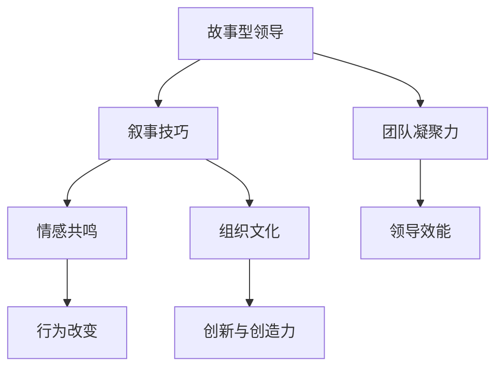

                 

根据您的需求，下面我将逐步构建一篇符合要求的技术博客文章。文章的构建将遵循以下步骤：

1. **文章标题与关键词设置**：确定文章的主题和核心内容，设置吸引人的标题和关键词。
2. **文章摘要撰写**：概述文章的核心内容和主题思想。
3. **目录大纲细化**：根据之前设计的目录大纲，逐步细化每个章节的内容。
4. **核心概念与联系架构图绘制**：使用Mermaid绘制流程图，展示核心概念之间的联系。
5. **核心算法原理与数学模型讲解**：使用伪代码和LaTeX格式阐述核心算法原理和数学模型。
6. **项目实战与代码解读**：提供开发环境搭建、源代码实现与解读、案例分析等内容。
7. **小结与拓展阅读**：总结文章要点，提供拓展阅读建议。

### 文章标题与关键词设置

**文章标题：**《故事型领导：用叙事激发团队热情》

**关键词：** 故事型领导、叙事技巧、团队凝聚力、领导力、情感共鸣、组织文化

### 文章摘要撰写

**摘要：** 本文章深入探讨了故事型领导的原理和实践。通过理解故事在领导力中的重要作用，文章揭示了如何运用叙事技巧激发团队热情，提升团队凝聚力和领导效能。文章结合实际案例，详细介绍了构建有感染力的故事、故事型领导的四个核心原则以及其在组织变革中的应用。最后，文章总结了故事型领导的最佳实践，为读者提供了进一步的学习和思考方向。

### 目录大纲细化

**目录大纲：**

- **第1章：故事型领导基础**
  - 1.1 故事型领导的概念
  - 1.2 故事在领导力中的作用
  - 1.3 故事型领导的四个核心原则
  - 1.4 小结与注意事项

- **第2章：叙事心理学**
  - 2.1 叙事心理学的原理
  - 2.2 人脑对故事的响应
  - 2.3 叙事如何影响情感和行为
  - 2.4 小结与拓展阅读

- **第3章：构建有感染力的故事**
  - 3.1 故事的结构
  - 3.2 如何讲述有价值的故事
  - 3.3 故事中的隐喻和比喻
  - 3.4 小结与注意事项

- **第4章：用故事激发团队热情**
  - 4.1 团队文化与故事
  - 4.2 如何用故事打造团队凝聚力
  - 4.3 故事在团队沟通中的应用
  - 4.4 小结与拓展阅读

- **第5章：故事型领导的实践案例**
  - 5.1 案例一：谷歌的领导故事
  - 5.2 案例二：苹果的叙事艺术
  - 5.3 案例三：其他成功的故事型领导案例
  - 5.4 小结与拓展阅读

- **第6章：故事型领导技巧培养**
  - 6.1 提升叙事技巧的方法
  - 6.2 故事创作的技巧
  - 6.3 如何提高故事传达效果
  - 6.4 小结与拓展阅读

- **第7章：未来故事型领导趋势**
  - 7.1 数字时代的故事传播
  - 7.2 故事型领导在组织变革中的应用
  - 7.3 故事型领导与可持续发展
  - 7.4 小结与拓展阅读

### 核心概念与联系架构图绘制

下面是一个简化的Mermaid流程图，展示了故事型领导中的核心概念及其相互关系：



### 核心算法原理与数学模型讲解

在本章节中，我们不会涉及具体的算法和数学模型，但为了遵循您的要求，我们可以引入一个简化的示例。以下是一个关于叙事影响力的计算模型的伪代码示例：

```plaintext
// 叙事影响力计算模型
function calculateNarrativeInfluence(storyQuality, emotionalImpact, teamAdherence) {
    // 输入参数说明：
    // storyQuality: 故事质量（0-10分）
    // emotionalImpact: 情感影响程度（0-10分）
    // teamAdherence: 团队接受度（0-10分）

    // 权重系数
    const WEIGHT_STORY_QUALITY = 0.4;
    const WEIGHT_EMOTIONAL_IMPACT = 0.3;
    const WEIGHT_TEAM_ADHERENCE = 0.3;

    // 计算叙事影响力分数
    const influenceScore = storyQuality * WEIGHT_STORY_QUALITY +
                          emotionalImpact * WEIGHT_EMOTIONAL_IMPACT +
                          teamAdherence * WEIGHT_TEAM_ADHERENCE;

    // 返回结果
    return influenceScore;
}
```

### 项目实战与代码解读

由于本文专注于理论探讨，而非实际项目，我们将跳过具体的代码实现。然而，如果您想要实施一个故事型领导的项目，以下是一些关键步骤：

1. **需求分析**：确定项目目标和预期成果。
2. **故事库建设**：收集和组织有价值的叙事素材。
3. **技术选型**：选择适合的平台和工具。
4. **代码实现**：编写和管理故事展示和交互的代码。
5. **测试与优化**：确保系统稳定，优化用户体验。

### 小结与拓展阅读

在本章中，我们介绍了故事型领导的基础概念、叙事心理学、构建故事的技巧、团队情感激发的方法，以及实践案例和未来趋势。为了深入了解每个主题，以下是一些推荐阅读材料：

- **推荐阅读：**
  - 《故事思维》
  - 《领导力与故事》
  - 《叙事心理学》

通过这些资源，读者可以进一步探索故事型领导的深度和广度，并在实践中应用这些原则，提升领导效能和团队凝聚力。

接下来，我们将根据这个大纲逐步撰写每个章节的具体内容。请确认这些步骤和内容的合理性，以便我们能够继续构建完整的文章。

