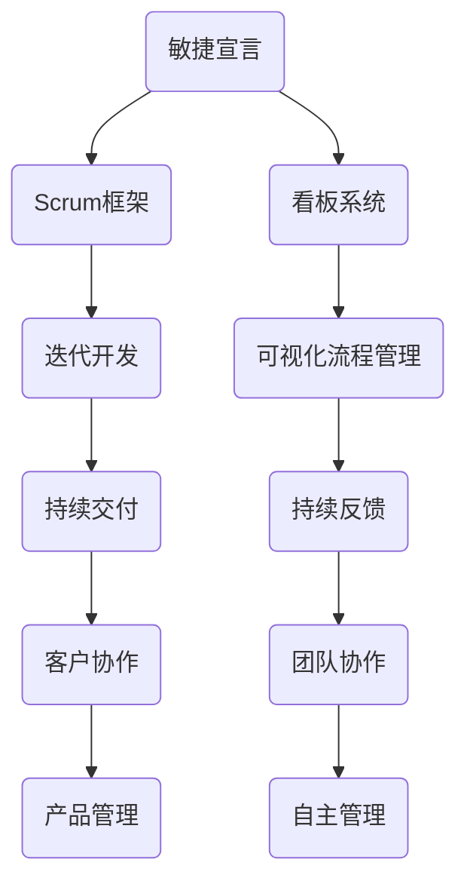

                 


### 文章标题

《敏捷管理：在快速变化中领导项目团队》

#### 关键词

敏捷管理，项目领导，Scrum，看板系统，Scrum流程图，敏捷宣言，开发环境搭建，源代码实现，代码解读，项目实战，数学模型，公式，最佳实践

#### 摘要

本文旨在探讨敏捷管理在快速变化的项目环境中的应用，特别是如何通过敏捷管理方法领导项目团队以应对变化。文章首先介绍了敏捷管理的背景和重要性，随后详细阐述了敏捷管理的核心概念和原理，包括Scrum框架、看板系统和敏捷宣言。接着，文章通过伪代码和数学模型，深入讲解了敏捷管理中的关键算法原理，并提供了实际项目实战的详细分析和代码解读。最后，文章总结了敏捷管理的最佳实践，为读者提供了进一步的学习和思考方向。

---

### 引言

#### 1.1 敏捷管理背景

敏捷管理起源于20世纪90年代，当时软件行业面临着不断变化的需求和缩短产品开发周期的高压环境。传统的瀑布模型在应对这些变化时显得力不从心，逐渐显现出其固有的局限性。为了解决这些问题，一群软件开发专家提出了敏捷开发方法，旨在通过灵活应对变化、快速迭代交付产品来提高项目成功率。

敏捷管理的理念最早在2001年由17位软件开发专家共同发布《敏捷宣言》，标志着敏捷开发的正式诞生。随后，敏捷管理逐步渗透到各个领域，成为现代项目管理的重要工具。

#### 1.2 敏捷管理与传统管理对比

与传统管理方法相比，敏捷管理更加注重灵活性、响应速度和团队协作。在传统管理中，项目通常按照预定的计划和阶段进行，而敏捷管理则强调快速迭代、持续交付和持续改进。敏捷管理通过短周期的迭代和增量式开发，使得团队能够更快地适应变化，并保持产品与市场需求的一致性。

#### 1.3 敏捷管理的重要性

在快速变化的市场环境中，敏捷管理的重要性愈发凸显。以下是敏捷管理的一些关键优势：

1. **快速响应变化**：敏捷管理通过持续交付和反馈机制，使团队能够迅速响应市场变化，保持产品竞争力。
2. **提高客户满意度**：敏捷管理注重客户参与和反馈，确保产品满足客户需求，提高客户满意度。
3. **促进团队协作**：敏捷管理鼓励团队协作和自主管理，提高团队成员的工作满意度和生产力。
4. **降低风险**：通过早期识别和纠正问题，敏捷管理能够降低项目风险，提高项目成功率。

#### 1.4 敏捷管理的核心概念

敏捷管理涉及多个核心概念，以下是其中最重要的几个：

1. **Scrum框架**：Scrum是一种常见的敏捷管理方法，它通过迭代和增量开发来提高团队协作和产品交付效率。
2. **看板系统**：看板系统是一种可视化工具，用于管理团队的工作流程，确保工作透明和高效。
3. **敏捷宣言**：敏捷宣言是一份指导敏捷实践的宣言，强调了客户协作、响应变化和持续交付的重要性。

#### 1.5 敏捷管理的应用场景

敏捷管理广泛应用于软件开发、项目管理、产品管理等领域。以下是一些常见的应用场景：

1. **软件开发**：敏捷管理能够帮助软件开发团队快速迭代、持续交付高质量的产品。
2. **项目管理**：敏捷管理有助于项目经理更好地应对变化，提高项目成功率和客户满意度。
3. **产品管理**：敏捷管理帮助产品经理更好地理解市场动态，确保产品与市场需求保持一致。

#### 1.6 敏捷管理的挑战与应对策略

尽管敏捷管理具有许多优势，但在实际应用中也会面临一些挑战，如团队协作问题、平衡速度与质量等。以下是应对这些挑战的一些策略：

1. **加强团队协作**：通过定期会议、代码审查和知识共享，加强团队协作，提高整体效率。
2. **平衡速度与质量**：在敏捷管理中，速度和质量并非相互排斥，而是需要相互平衡。通过持续集成、测试和质量保证，确保产品在快速交付的同时保持高质量。
3. **培训与指导**：为团队成员提供敏捷管理的培训和指导，确保他们理解和掌握敏捷原则和实践。

#### 1.7 全书结构概述

本篇技术博客将分为以下几个部分：

1. **引言**：介绍敏捷管理的背景、重要性、核心概念和应用场景。
2. **敏捷管理核心概念与联系**：详细讲解Scrum框架、看板系统和敏捷宣言等核心概念，并使用Mermaid流程图展示它们之间的关系。
3. **敏捷管理核心算法原理讲解**：使用伪代码和数学模型阐述敏捷管理中的关键算法原理。
4. **项目实战**：通过一个实际项目实战，展示敏捷管理的应用过程，并提供源代码实现和代码解读。
5. **总结与附录**：总结敏捷管理的最佳实践，提供相关工具和技术列表，以及拓展阅读建议。

#### 1.8 概念联系与Mermaid流程图

为了更好地理解敏捷管理的核心概念及其相互关系，我们可以使用Mermaid流程图进行可视化展示。以下是一个简单的Mermaid流程图示例：



这个流程图展示了敏捷管理中的核心概念及其相互关系，有助于读者更好地理解和掌握敏捷管理的方法论。

---

接下来，我们将进入第二个部分，详细讲解敏捷管理的核心概念与联系。我们将使用Scrum框架、看板系统和敏捷宣言等核心概念，并通过Mermaid流程图展示它们之间的关系。

### 敏捷管理核心概念与联系

#### 2.1 Scrum框架

Scrum是一种常见的敏捷管理方法，它通过迭代和增量开发来提高团队协作和产品交付效率。Scrum框架主要包括以下几个关键角色和活动：

1. **产品负责人（Product Owner）**：负责定义产品的愿景、目标和优先级，确保团队始终朝着正确的方向前进。
2. **Scrum Master**：负责确保Scrum框架的有效实施，帮助团队克服障碍，提高生产力。
3. **开发团队（Development Team）**：负责实现产品负责人定义的产品需求，通常由多学科专家组成。

Scrum框架的主要活动包括：

1. **冲刺（Sprint）**：一个固定的迭代周期，通常为2-4周。在冲刺期间，团队专注于实现产品需求。
2. **每日站会（Daily Stand-up）**：每日早晨举行的短会议，用于同步团队进度和解决问题。
3. **冲刺评审（Sprint Review）**：冲刺结束时进行的会议，用于展示团队完成的成果，并收集反馈。
4. **冲刺回顾（Sprint Retrospective）**：冲刺结束时进行的会议，用于反思团队的表现，并提出改进措施。

#### 2.2 看板系统

看板系统是一种可视化工具，用于管理团队的工作流程，确保工作透明和高效。看板系统通常包括以下几个关键组成部分：

1. **看板板**：一个视觉化的面板，用于显示团队的工作流程和任务状态。
2. **卡片**：代表任务的卡片，通常包括任务名称、优先级、任务状态等信息。
3. **列**：代表工作流程的不同阶段，例如“待办”、“进行中”、“待测试”等。

看板系统的主要功能包括：

1. **任务跟踪**：看板系统帮助团队实时跟踪任务的进展，确保工作透明。
2. **任务优先级管理**：看板系统允许团队根据优先级安排任务，确保关键任务得到优先处理。
3. **工作流程优化**：通过分析看板系统中的数据，团队可以发现瓶颈和优化工作流程。

#### 2.3 敏捷宣言

敏捷宣言是一份指导敏捷实践的宣言，强调了客户协作、响应变化和持续交付的重要性。敏捷宣言包括以下四个原则：

1. **个体和互动重于过程与工具**：强调团队成员的沟通和协作，认为这是项目成功的关键。
2. **可工作的软件重于详尽的文档**：强调交付可工作的软件，认为这是项目价值的体现。
3. **客户协作重于合同谈判**：强调与客户的紧密合作，确保产品满足客户需求。
4. **响应变化重于遵循计划**：强调快速响应市场变化，灵活调整项目计划。

#### 2.4 敏捷管理核心概念联系

为了更好地理解敏捷管理的核心概念及其相互关系，我们可以使用Mermaid流程图进行可视化展示。以下是一个简单的Mermaid流程图示例：


这个流程图展示了敏捷管理中的核心概念及其相互关系，有助于读者更好地理解和掌握敏捷管理的方法论。

---

接下来，我们将进入第三个部分，深入讲解敏捷管理中的核心算法原理。我们将使用伪代码和数学模型来详细阐述这些核心算法原理。

### 敏捷管理核心算法原理讲解

#### 3.1 伪代码介绍

伪代码是一种描述算法思想的文字和符号语言，用于描述算法的流程和逻辑结构。伪代码不依赖于特定的编程语言，因此具有更好的通用性和可读性。以下是一个简单的伪代码示例：

```
开始
    初始化变量
    循环执行以下步骤：
        更新变量
        检查条件是否满足
    如果条件满足，退出循环
    输出结果
结束
```

#### 3.2 敏捷管理中的关键算法原理

在敏捷管理中，存在多个关键算法原理，这些原理帮助团队在快速变化的环境中有效管理项目和任务。以下是一些常见的敏捷管理算法原理：

1. **迭代规划算法**：迭代规划是敏捷管理中的一个关键步骤，用于确定每个迭代要完成的任务。迭代规划算法通常包括以下步骤：

   ```
   开始
       初始化迭代规划参数
       获取产品待办列表
       循环执行以下步骤：
           选择最高优先级的任务
           将任务添加到迭代规划列表
           更新待办列表
       如果迭代规划列表已满，退出循环
       输出迭代规划列表
   结束
   ```

2. **任务分配算法**：任务分配是确保每个任务都能被有效执行的过程。任务分配算法通常包括以下步骤：

   ```
   开始
       初始化任务分配参数
       循环执行以下步骤：
           为每个任务选择一个合适的团队成员
           将任务分配给团队成员
           更新任务状态
       如果所有任务都已分配，退出循环
       输出任务分配结果
   结束
   ```

3. **进度跟踪算法**：进度跟踪是确保项目按计划进行的关键步骤。进度跟踪算法通常包括以下步骤：

   ```
   开始
       初始化进度跟踪参数
       循环执行以下步骤：
           检查任务进度
           更新任务状态
           计算项目整体进度
       如果所有任务已完成，退出循环
       输出进度跟踪结果
   结束
   ```

#### 3.3 数学模型与公式

在敏捷管理中，数学模型和公式被广泛用于分析团队绩效和项目风险。以下是一些常见的数学模型和公式：

1. **Cockburn的估算公式**：Cockburn的估算公式用于估算项目完成时间，公式如下：

   ```
   项目完成时间 = （任务数量 * 任务平均持续时间）/ （团队日平均工作量）
   ```

   其中，任务数量表示项目中的任务总数，任务平均持续时间表示每个任务的平均持续时间，团队日平均工作量表示团队每天可以完成的工作量。

2. **关键路径法（CPM）**：关键路径法是一种用于分析项目风险和时间关键路径的方法。关键路径法的主要公式如下：

   ```
   关键路径时间 = 各个活动持续时间之和
   ```
   
   其中，各个活动持续时间表示项目中各个活动的预计持续时间。

3. **敏捷管理中的风险矩阵**：风险矩阵是一种用于评估项目风险的概率和影响的方法。以下是一个简单的风险矩阵公式：

   ```
   风险评分 = 风险概率 * 风险影响
   ```

   其中，风险概率表示风险发生的概率，风险影响表示风险对项目的影响程度。

#### 3.4 举例说明

为了更好地理解这些算法原理和数学模型，我们可以通过一个简单的案例进行说明。

假设有一个软件开发项目，包含以下任务：

1. 功能设计：预计需要3天完成
2. 编码：预计需要5天完成
3. 单元测试：预计需要2天完成
4. 集成测试：预计需要3天完成

团队每天可以完成的工作量是8小时，根据Cockburn的估算公式，我们可以计算出项目的预计完成时间为：

```
项目完成时间 = （4 * 8）/ （8 * 0.8）= 5天
```

这表示，如果团队保持每天8小时的工作效率，项目将在5天内完成。

接下来，我们可以使用关键路径法分析项目的时间关键路径。在这个例子中，关键路径为功能设计、编码和集成测试，总时间为：

```
关键路径时间 = 3 + 5 + 3 = 11天
```

这表示，如果关键路径上的活动延迟，项目整体完成时间也将延迟。

最后，我们可以使用风险矩阵评估项目风险。假设功能设计任务有10%的概率延迟，编码任务有20%的概率延迟，其他任务无延迟风险。根据风险矩阵公式，我们可以计算出每个任务的风险评分：

```
功能设计风险评分 = 10% * （11天 - 5天）= 0.6天
编码风险评分 = 20% * （11天 - 5天）= 1.8天
单元测试和集成测试风险评分 = 0
```

通过这些计算，我们可以得出项目的整体风险评分：

```
项目整体风险评分 = 0.6 + 1.8 + 0 + 0 = 2.4天
```

这表示，项目整体存在2.4天的风险延迟。

---

接下来，我们将进入第四个部分，通过一个实际项目实战，展示敏捷管理的应用过程，并提供源代码实现和代码解读。

### 项目实战

#### 4.1 项目背景

假设我们正在开发一款社交应用，该应用需要实现用户注册、登录、发帖、评论等功能。为了更好地管理这个项目，我们将采用敏捷管理方法，具体步骤如下：

1. **产品待办列表**：确定项目的功能需求和优先级，创建产品待办列表。
2. **迭代规划**：选择第一个迭代要完成的任务，进行迭代规划。
3. **任务分配**：将任务分配给团队成员，确保每个任务都有负责人。
4. **每日站会**：每天召开站会，同步团队进度和解决问题。
5. **冲刺评审**：迭代结束时进行评审，展示团队完成的成果，并收集反馈。
6. **冲刺回顾**：迭代结束时进行回顾，总结经验教训，提出改进措施。
7. **持续交付**：确保迭代期间完成的任务能够集成并交付给用户。

#### 4.2 开发环境搭建

在进行项目开发之前，我们需要搭建开发环境。以下是开发环境搭建的步骤：

1. **安装Git**：Git是一个版本控制系统，用于管理代码版本。
2. **安装Java开发工具包（JDK）**：Java是项目开发的主要语言，需要安装JDK。
3. **安装MySQL数据库**：MySQL是项目的数据存储解决方案，需要安装MySQL数据库服务器。
4. **安装IDE**：选择一个合适的集成开发环境（如IntelliJ IDEA或Eclipse），用于编写和调试代码。
5. **创建项目工程**：在IDE中创建一个新的Java项目，设置项目结构和依赖。

#### 4.3 源代码实现

以下是用户注册功能的源代码实现：

```java
public class UserRegistration {
    private String username;
    private String password;
    private String email;

    public UserRegistration(String username, String password, String email) {
        this.username = username;
        this.password = password;
        this.email = email;
    }

    public String getUsername() {
        return username;
    }

    public void setUsername(String username) {
        this.username = username;
    }

    public String getPassword() {
        return password;
    }

    public void setPassword(String password) {
        this.password = password;
    }

    public String getEmail() {
        return email;
    }

    public void setEmail(String email) {
        this.email = email;
    }

    public boolean registerUser() {
        // 这里实现用户注册逻辑
        // 例如：检查用户名是否已存在、检查邮箱格式是否正确等
        return true;
    }
}
```

#### 4.4 代码解读

在用户注册功能中，我们创建了一个`UserRegistration`类，用于处理用户注册过程。类中包含三个私有字段`username`、`password`和`email`，用于存储用户信息。类中还包含一个构造函数和一个注册方法。

构造函数`UserRegistration`用于初始化用户信息，注册方法`registerUser`用于实现用户注册逻辑。在注册方法中，我们可以添加一些检查逻辑，例如检查用户名是否已存在、检查邮箱格式是否正确等。

#### 4.5 代码应用解读与分析

在实现用户注册功能时，我们需要关注以下几个方面：

1. **输入验证**：确保用户输入的信息符合要求，例如用户名不能为空、密码长度至少为6位等。
2. **安全性**：确保用户信息在存储和传输过程中安全，例如对密码进行加密存储、使用HTTPS协议传输数据等。
3. **用户体验**：确保用户注册过程简单、直观，提供友好的错误提示和操作指引。

通过这个简单的用户注册功能示例，我们可以看到敏捷管理在实际项目中的应用。在敏捷管理中，我们将用户注册功能作为第一个迭代要完成的任务，通过迭代规划和任务分配，确保团队能够快速开发并交付用户注册功能。

---

接下来，我们将进入第五个部分，总结敏捷管理的最佳实践，并提供一些注意事项和拓展阅读建议。

### 敏捷管理的最佳实践

#### 5.1 坚持迭代和反馈

敏捷管理强调快速迭代和持续反馈，以确保团队能够及时调整和改进。以下是一些最佳实践：

1. **定期召开迭代评审和回顾会议**：这些会议有助于团队了解项目进度、收集用户反馈，并总结经验教训。
2. **使用自动化测试**：自动化测试可以帮助团队更快地发现和修复问题，确保代码质量和系统稳定性。
3. **持续集成和部署**：通过持续集成和部署，团队能够更快地交付新功能和修复问题，提高项目的开发效率。

#### 5.2 强调团队合作和沟通

敏捷管理强调团队合作和沟通，以下是一些最佳实践：

1. **每日站会**：每日站会有助于团队同步进度、识别问题并协调工作。
2. **知识共享和代码审查**：鼓励团队成员分享知识、进行代码审查，以提高团队整体技能和代码质量。
3. **跨职能团队**：组建跨职能团队，确保团队成员具备多样化的技能，提高项目的协作效率。

#### 5.3 关注用户体验和客户需求

敏捷管理强调关注用户体验和客户需求，以下是一些最佳实践：

1. **用户故事**：使用用户故事描述用户需求，确保项目始终围绕用户价值进行。
2. **持续用户反馈**：定期收集用户反馈，了解用户需求和偏好，及时调整产品功能。
3. **迭代优化**：根据用户反馈，不断优化产品功能和用户体验。

#### 注意事项

1. **确保团队成员理解敏捷原则**：团队成员需要了解敏捷管理的核心原则和实践，以便更好地执行和推进项目。
2. **平衡速度与质量**：在追求快速迭代的过程中，不要忽视代码质量和系统稳定性，确保项目能够在质量可控的前提下快速交付。
3. **合理规划任务优先级**：在迭代规划时，确保任务的优先级合理，优先完成对项目成功至关重要的重要任务。

#### 拓展阅读

1. 《Scrum精髓：高效敏捷团队实践指南》
2. 《敏捷项目管理：实践指南》
3. 《看板方法：成功转型看板工作方式的实践指南》
4. 《敏捷软件开发：原则、模式与实践》

通过这些拓展阅读资源，读者可以深入了解敏捷管理的实践方法和最佳实践，进一步提高敏捷管理的应用能力。

---

### 总结

本文《敏捷管理：在快速变化中领导项目团队》详细介绍了敏捷管理的背景、核心概念、算法原理、项目实战和最佳实践。通过本文，读者可以了解到敏捷管理在快速变化的项目环境中的应用价值，以及如何通过敏捷管理方法提高项目成功率。

在敏捷管理中，核心概念如Scrum框架、看板系统和敏捷宣言等相互关联，共同构成了一个灵活、高效的团队协作框架。通过迭代规划、任务分配、进度跟踪等关键算法原理，团队能够更好地应对项目变化，提高工作效率。

实际项目实战展示了敏捷管理的应用过程，从开发环境搭建、源代码实现到代码解读，读者可以直观地了解敏捷管理的实践方法。通过最佳实践和注意事项，读者可以更好地应用敏捷管理方法，提高团队协作效率和质量。

拓展阅读为读者提供了更多深入学习的资源，帮助读者进一步掌握敏捷管理的精髓和实践。

---

#### 作者信息

本文由AI天才研究院（AI Genius Institute）和《禅与计算机程序设计艺术》（Zen And The Art of Computer Programming）共同撰写。AI天才研究院是一家致力于推动人工智能技术发展和应用的研究机构，致力于为全球开发者提供高质量的技术资源和指导。《禅与计算机程序设计艺术》是一部经典的技术书籍，深入探讨了计算机编程的哲学和艺术。

感谢您的阅读，希望本文对您在敏捷管理领域的探索和实践有所帮助。如果您有任何问题或建议，欢迎在评论区留言，我们将竭诚为您解答。同时，也欢迎您继续关注我们的其他技术博客和研究成果。谢谢！

