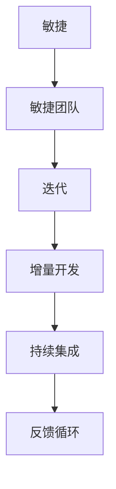

                 


为了撰写一篇符合要求的《敏捷项目管理：在动态环境中领导团队》的技术博客文章，我们需要逐步分析并整合各个章节的内容。以下是我们的步骤：

### 步骤一：概述文章结构

首先，我们需要确定文章的整体结构，这包括：

1. **引言**：介绍敏捷项目管理的背景和重要性，吸引读者的兴趣。
2. **核心概念与联系**：介绍敏捷项目管理的基本概念，并提供流程图展示它们之间的关系。
3. **核心算法原理讲解**：使用伪代码详细阐述敏捷方法的核心原理。
4. **数学模型和公式讲解**：介绍敏捷项目管理中使用的数学模型和公式，并举例说明。
5. **项目实战**：展示敏捷项目管理的实际应用，包括环境搭建、代码实现和案例分析。
6. **最佳实践 tips**：提供敏捷项目管理中的实用建议和注意事项。
7. **小结与拓展阅读**：总结文章内容，并提供进一步阅读的资源。

### 步骤二：撰写引言

引言部分需要简明扼要地介绍敏捷项目管理的重要性，可以包括以下内容：

- **背景介绍**：敏捷项目管理在现代企业中的广泛应用，以及它在应对动态环境中的优势。
- **文章目的**：阐述本文将如何深入探讨敏捷项目管理的原理和实践，帮助读者理解和应用这些方法。

### 步骤三：核心概念与联系

在这一部分，我们需要：

- **定义核心概念**：敏捷、敏捷团队、迭代、增量开发等。
- **关系架构流程图**：使用Mermaid流程图展示这些概念之间的相互关系，例如：
  ```mermaid
  graph TD
  A[敏捷] --> B[敏捷团队]
  B --> C[迭代]
  C --> D[增量开发]
  D --> E[持续集成]
  E --> F[反馈循环]
  ```

### 步骤四：核心算法原理讲解

这里我们需要：

- **伪代码**：提供一个敏捷迭代过程的伪代码示例。
- **详细阐述**：解释伪代码中的每一步操作，以及它如何实现敏捷方法的核心目标。

### 步骤五：数学模型和公式讲解

我们需要介绍以下数学模型和公式：

- **估算公式**：如COCOMO模型、敏捷估算方法等。
- **绩效指标**：如故事点、迭代时长等。
- **风险分析**：如蒙特卡罗模拟、敏感性分析等。

### 步骤六：项目实战

这一部分需要：

- **开发环境搭建**：介绍如何搭建敏捷项目开发的环境。
- **代码实现**：提供源代码示例，并详细解读。
- **案例分析**：分析一个敏捷项目案例，展示其实际操作过程和结果。

### 步骤七：最佳实践 tips

在这一部分，我们可以提供以下内容：

- **敏捷项目管理技巧**：如如何高效地进行需求收集、如何优化迭代过程等。
- **注意事项**：如如何处理团队冲突、如何保持透明度等。

### 步骤八：小结与拓展阅读

最后，我们需要总结文章的主要内容，并提供一些拓展阅读的资源，以帮助读者进一步学习。

### 步骤九：完成文章撰写

在完成上述所有步骤后，我们需要对文章进行一次全面的审阅，确保每个部分的内容都符合要求，逻辑清晰，语言准确。最后，添加作者信息，并以markdown格式输出文章。

### 文章格式示例

以下是文章格式的示例：

```markdown
# 敏捷项目管理：在动态环境中领导团队

关键词：敏捷项目管理，敏捷方法，敏捷团队，迭代开发，持续集成

摘要：本文深入探讨了敏捷项目管理的核心概念、原理和实践，通过案例分析，展示了如何在动态环境中高效领导团队，实现了项目目标。

## 引言

### 背景介绍
...

### 文章目的
...

## 核心概念与联系
...

### 关系架构流程图


## 核心算法原理讲解
...

### 伪代码示例
```python
# 敏捷迭代过程伪代码
function agile_sprintCycle(){
  // 开始迭代
  startSprint()
  // 完成迭代任务
  completeTasks()
  // 评审与回顾
  reviewAndRetrospective()
  // 准备下一迭代
  prepareNextSprint()
}
```

## 数学模型和公式讲解
...

### 估算公式示例
```latex
$$
C = a \cdot (P^b)
$$
```

## 项目实战
...

### 开发环境搭建
...

### 代码实现
...

### 案例分析
...

## 最佳实践 tips
...

## 小结与拓展阅读
...

### 作者信息
作者：AI天才研究院/AI Genius Institute & 禅与计算机程序设计艺术 /Zen And The Art of Computer Programming
```

### 最后的注意事项

在撰写文章时，我们需要确保每一步都清晰、具体、有逻辑性。同时，文章的格式和结构要符合markdown的标准，以便于读者阅读和理解。在文章末尾，提供作者的姓名和相关信息，以展示专业性和权威性。此外，确保文章的总体字数在8000～12000字之间，以满足字数要求。在完成所有内容后，进行一次彻底的审阅和校对，确保文章的准确性和完整性。

