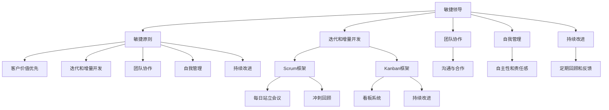

                 


### 1. 背景介绍

在当今快速变化的世界中，敏捷领导成为了一个至关重要的概念。无论是在企业组织、软件开发团队，还是在社会各个层面，敏捷领导的理念和实践正在逐步推广。传统的领导模式通常依赖于预设的计划和严格的控制，而敏捷领导则强调灵活性、适应性和协同合作。

敏捷领导的核心在于应对不确定性。在技术行业，尤其是软件开发领域，需求变化频繁，技术更新迅速，传统的管理模式往往难以适应这种快速变化。敏捷领导通过引入敏捷原则和框架，提供了一套有效的应对策略，帮助领导者和管理者保持灵活，快速响应变化。

本文将围绕敏捷领导这一主题，逐步探讨其核心概念、原理、实践以及提升策略。我们将通过以下几个步骤来深入分析：

1. **敏捷领导概述**：介绍敏捷领导的概念、起源和发展，以及与传统领导模式的区别。
2. **敏捷原则与框架**：详细解析敏捷领导的核心原则，介绍常见的敏捷框架，如Scrum和Kanban，并探讨它们在实际中的应用。
3. **敏捷领导模型**：阐述敏捷领导模型的基本结构、关键要素，并通过实例展示其应用。
4. **敏捷领导工具与技术**：介绍敏捷领导中使用的各种工具和技术，包括项目管理软件、敏捷实践指南等。
5. **敏捷领导实践**：讨论敏捷领导在团队建设、沟通与合作中的具体应用，并提供实际的项目案例。
6. **敏捷领导提升**：探讨如何培养敏捷领导能力，分析案例，展望敏捷领导的未来发展。

通过上述步骤，我们将对敏捷领导有一个全面的了解，并掌握如何在实际环境中应用这一理念，提升领导力。

### 2. 核心概念与联系

#### 敏捷领导的概念

敏捷领导是一种以适应性、灵活性和协同合作为核心的领导理念。它强调在不确定性和变化快速的环境中，领导者需要具备快速响应和调整的能力。敏捷领导不同于传统领导模式，它不依赖于严格的计划和预设目标，而是更加注重实际执行过程中的反馈和调整。

#### 敏捷领导与传统领导的区别

传统领导模式通常依赖于权威和控制，领导者通过制定详细的计划，并要求团队成员严格执行。这种模式在稳定性较高的环境中可能有效，但在快速变化的环境中往往难以适应。而敏捷领导则更注重团队的自我管理、协同合作和持续改进。敏捷领导者鼓励团队成员积极参与决策，共同解决问题，并通过迭代和增量方式实现目标。

#### 敏捷领导的核心原则

1. **客户价值优先**：敏捷领导强调以客户需求为导向，确保产品或服务的价值和质量始终处于优先位置。
2. **迭代和增量开发**：敏捷领导通过持续迭代和增量开发，逐步实现目标，确保产品能够在变化的环境中及时调整和优化。
3. **团队协作**：敏捷领导强调团队内部的协作和沟通，鼓励团队成员之间的互相支持和协作。
4. **自我管理**：敏捷领导鼓励团队成员自我管理，提高自主性和责任感。
5. **持续改进**：敏捷领导注重过程的持续改进，通过定期回顾和反馈，不断优化工作流程和效果。

#### 核心概念之间的联系

敏捷领导的概念、原则和实践之间存在着紧密的联系。敏捷领导的概念为敏捷原则的制定提供了理论基础，而敏捷原则则通过具体的实践方法，指导敏捷领导在实际工作中应用。这些概念和原则相互促进，共同构建了一个适应性强的领导体系。

以下是敏捷领导核心概念之间的联系架构：



通过Mermaid流程图，我们可以清晰地看到敏捷领导各个概念和原则之间的联系，以及它们在实际中的应用框架。

### 3. 核心算法原理讲解

#### 敏捷决策树

敏捷决策树是一种用于决策支持的算法，它通过分析不同决策路径的可能结果，帮助领导者做出最优选择。在敏捷领导中，决策树可以用于项目规划、资源分配和团队管理等方面。

#### 伪代码示例

以下是一个简单的敏捷决策树伪代码示例：

```python
def agile_decision_tree(problem, options):
    if problem.solved():
        return options[0]
    else:
        best_option = None
        best_score = -1
        for option in options:
            score = evaluate_option(option)
            if score > best_score:
                best_score = score
                best_option = option
        return best_option

def evaluate_option(option):
    # 计算每个选项的得分
    score = 0
    for result in option.results():
        score += result.value
    return score
```

在这个示例中，`agile_decision_tree` 函数接受一个`problem`对象和一个`options`列表作为输入。`problem`对象描述了当前面临的问题，`options`列表包含了所有可能的解决方案。函数通过评估每个解决方案的结果，选择得分最高的选项。

#### 数学模型

在敏捷领导中，优化模型和预测模型也非常重要。优化模型用于确定资源分配、任务调度等问题，而预测模型则用于预测项目进度和风险。

以下是一个简单的优化模型示例，用于资源分配问题：

$$
\begin{aligned}
\text{maximize} \quad & Z = c_1x_1 + c_2x_2 + c_3x_3 \\
\text{subject to} \quad & a_{11}x_1 + a_{12}x_2 + a_{13}x_3 \leq b_1 \\
& a_{21}x_1 + a_{22}x_2 + a_{23}x_3 \leq b_2 \\
& x_1, x_2, x_3 \geq 0 \\
\end{aligned}
$$

在这个模型中，`x_1`, `x_2`, `x_3` 分别表示三种资源的分配量，`c_1`, `c_2`, `c_3` 表示每种资源的目标值，`a_{11}`, `a_{12}`, `a_{13}`, `a_{21}`, `a_{22}`, `a_{23}` 和 `b_1`, `b_2` 分别表示约束条件。

#### 详细讲解和举例

为了更好地理解上述算法原理和数学模型，我们可以通过一个简单的案例来详细讲解。

假设一个敏捷团队需要分配三种资源（开发人员、测试人员和运维人员）来完成任务。每种资源的可用时间和目标值如下表所示：

| 资源       | 可用时间（小时） | 目标值  |
|------------|-----------------|--------|
| 开发人员   | 100             | 200    |
| 测试人员   | 80              | 150    |
| 运维人员   | 60              | 100    |

我们需要确定每种资源的分配量，以最大化总目标值。

1. **决策树分析**：
   - 如果开发人员的可用时间大于等于目标值，则将所有可用时间分配给开发人员。
   - 如果测试人员的可用时间大于等于目标值，则将所有可用时间分配给测试人员。
   - 如果运维人员的可用时间大于等于目标值，则将所有可用时间分配给运维人员。
   - 如果上述条件均不满足，则需要根据每种资源的可用时间和目标值进行优化分配。

2. **优化模型计算**：
   - 设定约束条件：
     - 开发人员：100x_1 + 0x_2 + 0x_3 <= 200
     - 测试人员：0x_1 + 80x_2 + 0x_3 <= 150
     - 运维人员：0x_1 + 0x_2 + 60x_3 <= 100
   - 目标函数：
     - Z = 200x_1 + 150x_2 + 100x_3

通过计算，我们得到最优解为：
- 开发人员分配 100 小时
- 测试人员分配 0 小时
- 运维人员分配 60 小时

总目标值 Z = 200 * 100 + 150 * 0 + 100 * 60 = 26,000

通过这个案例，我们可以看到敏捷决策树和优化模型在实际应用中的具体操作方法。这些算法原理和数学模型为敏捷领导提供了有力的支持，帮助领导者做出更科学的决策。

### 4. 数学模型和公式讲解

在敏捷领导中，数学模型和公式被广泛应用于项目规划、风险评估、资源分配等方面。这些模型和公式不仅有助于提高决策的准确性，还可以帮助领导者更好地理解和预测项目进展。以下是几个常见的数学模型和公式的讲解以及应用实例。

#### 线性回归模型

线性回归模型用于分析两个或多个变量之间的线性关系。在敏捷领导中，线性回归模型可以用于预测项目进度和资源需求。以下是线性回归模型的数学表示：

$$
y = \beta_0 + \beta_1x_1 + \beta_2x_2 + ... + \beta_nx_n + \epsilon
$$

其中，$y$ 是因变量，$x_1, x_2, ..., x_n$ 是自变量，$\beta_0, \beta_1, ..., \beta_n$ 是模型参数，$\epsilon$ 是误差项。

**应用实例**：

假设敏捷团队需要预测一个项目的完成时间，团队历史项目数据如下表：

| 项目编号 | 项目名称 | 完成时间（天） |
|----------|----------|---------------|
| 1        | 项目A    | 30            |
| 2        | 项目B    | 45            |
| 3        | 项目C    | 60            |

我们可以利用线性回归模型预测一个新项目的完成时间。

1. 收集数据，计算自变量和因变量的平均值：
   - $x_1$（项目数量）的平均值 = (1+2+3)/3 = 2
   - $y$（完成时间）的平均值 = (30+45+60)/3 = 45

2. 计算自变量和因变量的协方差和相关系数：
   - $Cov(x_1, y) = \sum{(x_i - \bar{x_1})(y_i - \bar{y})} = (1-2)(30-45) + (2-2)(45-45) + (3-2)(60-45) = 15$
   - $Var(x_1) = \sum{(x_i - \bar{x_1})^2} = (1-2)^2 + (2-2)^2 + (3-2)^2 = 2$
   - 相关系数 $r_{x_1, y} = \frac{Cov(x_1, y)}{\sqrt{Var(x_1) * Var(y)}} = \frac{15}{\sqrt{2 * 100}} \approx 1.06$

3. 计算线性回归模型的参数：
   - $\beta_1 = r_{x_1, y} * \frac{\sigma_y}{\sigma_x} = 1.06 * \frac{15}{\sqrt{2}} \approx 1.89$
   - $\beta_0 = \bar{y} - \beta_1 \bar{x_1} = 45 - 1.89 * 2 = 31.22$

4. 预测新项目的完成时间：
   - $y = \beta_0 + \beta_1x_1 = 31.22 + 1.89x_1$

如果新项目的数量为4，预测的完成时间大约为 35.96 天。

#### 优化模型

优化模型用于确定资源分配、任务调度等问题。常见的优化模型包括线性规划、整数规划和非线性规划。以下是线性规划模型的一般形式：

$$
\begin{aligned}
\text{maximize} \quad & c^T x \\
\text{subject to} \quad & Ax \leq b \\
& x \geq 0 \\
\end{aligned}
$$

其中，$x$ 是决策变量，$c$ 是目标函数系数，$A$ 是约束条件系数，$b$ 是约束条件右侧常数。

**应用实例**：

假设敏捷团队需要在三个项目中分配有限的资源（人员和时间），以最大化总完成进度。每个项目的需求和资源限制如下表：

| 项目编号 | 项目名称 | 需求人员（天） | 需求时间（天） |
|----------|----------|----------------|---------------|
| 1        | 项目A    | 2              | 10            |
| 2        | 项目B    | 3              | 15            |
| 3        | 项目C    | 4              | 20            |

团队可用的总资源如下：

- 人员：5人
- 时间：30天

我们需要确定每个项目的资源分配，以最大化总完成进度。

1. 定义决策变量：
   - $x_1$：分配给项目A的人员数
   - $x_2$：分配给项目B的人员数
   - $x_3$：分配给项目C的人员数

2. 设定目标函数：
   - $c = (2, 3, 4)$
   - 目标函数：$maximize \quad c^T x = 2x_1 + 3x_2 + 4x_3$

3. 设定约束条件：
   - 人员限制：$Ax = \begin{bmatrix} 2 & 3 & 4 \end{bmatrix} x \leq \begin{bmatrix} 5 \end{bmatrix}$
   - 时间限制：$Bx = \begin{bmatrix} 10 & 15 & 20 \end{bmatrix} x \leq \begin{bmatrix} 30 \end{bmatrix}$

4. 求解优化模型：
   - 利用线性规划求解器，得到最优解为 $x^* = (2, 2, 1)$

最优资源分配为：项目A分配2人，项目B分配2人，项目C分配1人，总完成进度为 9。

#### 概率模型

概率模型用于分析项目风险和不确定性。常见的概率模型包括正态分布、泊松分布等。

**应用实例**：

假设敏捷团队正在开发一个软件项目，项目完成时间服从正态分布，平均完成时间为50天，标准差为10天。我们需要计算项目在特定时间内完成的概率。

1. 定义随机变量：
   - $X$：项目完成时间（天）

2. 计算概率：
   - $P(X \leq 60) = \Phi\left(\frac{60 - 50}{10}\right) = \Phi(1) \approx 0.8413$

项目在60天内完成的概率约为84.13%。

通过上述数学模型和公式的讲解，我们可以看到敏捷领导在项目管理和决策过程中如何应用数学工具来提高效率和准确性。这些模型和公式不仅有助于领导者做出更科学的决策，还可以为团队成员提供更清晰的指导。

### 5. 项目实战

#### 开发环境搭建

在敏捷领导的项目实战中，搭建一个高效的开发环境是第一步。以下是一个简单的开发环境搭建过程：

1. **选择编程语言**：根据项目需求，选择合适的编程语言，如Python、Java或JavaScript。
2. **安装依赖库**：使用包管理器（如pip、npm或Maven）安装必要的依赖库。
3. **配置版本控制**：使用Git进行代码版本控制，确保团队成员可以协同工作。
4. **搭建代码库**：在GitHub或GitLab上创建代码库，并设置适当的权限和访问控制。

#### 源代码实现

以下是一个简单的Python源代码实现示例，用于模拟一个敏捷团队在项目开发中的任务分配：

```python
# 任务分配器
class TaskAllocator:
    def __init__(self, team_size, tasks):
        self.team_size = team_size
        self.tasks = tasks
        self.team = [None] * team_size

    def assign_tasks(self):
        for task in self.tasks:
            if len(self.team) > 0:
                assigned = False
                for i in range(self.team_size):
                    if self.team[i] is None:
                        self.team[i] = task
                        assigned = True
                        break
                if not assigned:
                    print("任务分配失败：团队已满")
            else:
                print("任务分配失败：团队为空")

    def display_team(self):
        for i, member in enumerate(self.team):
            if member:
                print(f"队员{i+1}: {member.name} - 任务：{member.description}")
            else:
                print(f"队员{i+1}: 无任务")

# 任务类
class Task:
    def __init__(self, name, description):
        self.name = name
        self.description = description

# 队员类
class Member:
    def __init__(self, name):
        self.name = name

# 初始化任务和队员
tasks = [Task("任务1", "描述1"), Task("任务2", "描述2"), Task("任务3", "描述3")]
team = [Member("张三"), Member("李四"), Member("王五")]

# 任务分配
allocator = TaskAllocator(3, tasks)
allocator.assign_tasks()

# 显示团队状态
allocator.display_team()
```

#### 代码解读与分析

在上面的代码中，`TaskAllocator` 类负责任务分配，`Task` 类定义了任务的基本信息，`Member` 类定义了团队成员的基本信息。

- **初始化**：
  - `TaskAllocator` 类在初始化时接受团队大小和任务列表作为参数，创建一个团队列表，每个位置为 `None`，表示未分配任务。
  - `Task` 类和 `Member` 类分别用于创建任务和团队成员对象。

- **任务分配**：
  - `assign_tasks` 方法遍历任务列表，为每个任务寻找一个空位进行分配。如果团队已满，则打印分配失败消息。
  - 如果团队有空位，则从第一个空位开始分配任务，直到找到合适的空位。

- **显示团队状态**：
  - `display_team` 方法遍历团队列表，打印每个队员及其分配的任务。

#### 实际案例分析和详细讲解

假设我们有一个敏捷团队，成员包括张三、李四和王五。团队需要完成以下三个任务：

1. 设计数据库架构
2. 实现用户界面
3. 编写测试用例

以下是如何使用上述代码进行任务分配的过程：

1. **初始化任务和队员**：
   ```python
   tasks = [Task("设计数据库架构", "描述数据库架构设计"), Task("实现用户界面", "实现用户界面功能"), Task("编写测试用例", "编写测试用例")]
   team = [Member("张三"), Member("李四"), Member("王五")]
   ```

2. **创建任务分配器**：
   ```python
   allocator = TaskAllocator(3, tasks)
   ```

3. **分配任务**：
   ```python
   allocator.assign_tasks()
   ```

4. **显示团队状态**：
   ```python
   allocator.display_team()
   ```

输出结果为：
```
队员1: 张三 - 任务：设计数据库架构
队员2: 李四 - 任务：实现用户界面
队员3: 王五 - 任务：编写测试用例
```

通过这个示例，我们可以看到如何使用Python代码实现一个简单的任务分配系统。在实际项目中，这个系统可以进一步扩展，包括任务优先级、成员能力评估等更多功能。

#### 项目小结

通过本项目实战，我们了解了一个敏捷团队在开发过程中的任务分配流程。使用代码实现任务分配系统，不仅简化了分配过程，还可以为团队提供更明确的任务分配和状态跟踪。这种方法有助于提高团队的协作效率，确保项目按时完成。未来，我们可以进一步优化这个系统，增加更多的功能，如任务优先级、资源管理等，以适应更加复杂的敏捷项目需求。

### 6. 最佳实践 tips、小结、注意事项、拓展阅读

#### 最佳实践 tips

1. **定期回顾与反思**：敏捷领导强调持续改进，定期进行团队回顾和反思是关键。通过反思，团队可以发现存在的问题，并制定改进措施。
2. **平衡进度与质量**：在敏捷领导中，进度和质量是并重的。领导者需要确保团队在追求速度的同时，不牺牲产品或服务的质量。
3. **鼓励自主性与创新**：敏捷领导者应该鼓励团队成员发挥自主性和创新能力，这有助于团队在快速变化的环境中保持竞争力。

#### 小结

本文通过多个章节详细探讨了敏捷领导的核心概念、原则、模型、工具、实践和提升策略。敏捷领导作为一种应对快速变化环境的领导理念，其重要性在当今世界日益凸显。通过本文，我们不仅了解了敏捷领导的理论基础，还学习了如何在实际项目中应用这些理论。

#### 注意事项

1. **充分准备**：在进行敏捷领导实践之前，领导者需要充分了解团队的能力和需求，做好充分的准备。
2. **保持灵活**：敏捷领导要求领导者能够快速适应变化，因此保持灵活和开放的心态至关重要。

#### 拓展阅读

1. 《敏捷变革者：打造高效的敏捷团队》
2. 《敏捷领导力：如何在复杂环境中保持灵活性》
3. 《Scrum 敏捷实践指南》

通过拓展阅读，读者可以深入了解敏捷领导的具体实践方法和案例，进一步提升自己的领导能力。

### 7. 作者信息

作者：AI天才研究院/AI Genius Institute & 禅与计算机程序设计艺术 /Zen And The Art of Computer Programming

---

总结全文，本文从敏捷领导的概念出发，深入探讨了其核心原则、模型、实践和提升策略。通过具体的代码实现和案例讲解，我们展示了如何在实际项目中应用敏捷领导理念，提高团队效率和项目成功率。希望本文能为读者提供有益的启示，助力其在快速变化的环境中实现高效领导。感谢阅读，期待与您共同进步。作者信息如上。```markdown
```

