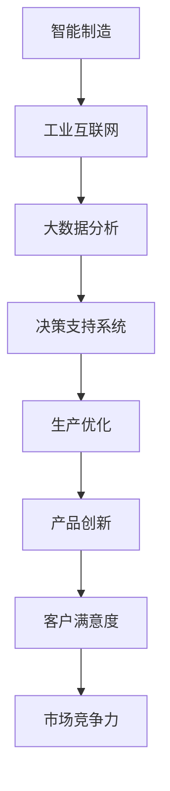
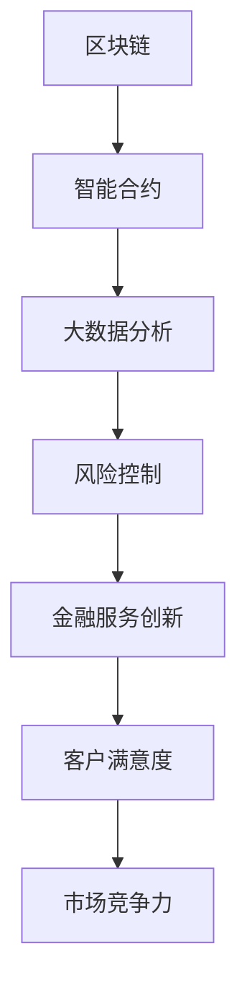
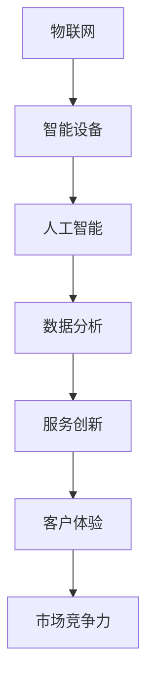

                 

# 数字化领导：在技术驱动时代的管理策略

## 关键词

- 数字化领导
- 技术驱动
- 数据驱动
- 创新与敏捷
- 数字化转型
- 数字化团队管理

## 摘要

在数字化时代，领导者的角色正在经历深刻的变革。本文旨在探讨数字化领导的关键要素和策略，以帮助企业和领导者应对技术驱动的挑战。文章首先概述了数字化时代的背景和领导力的演变，然后详细分析了数字化思维、数据驱动决策、创新与敏捷性、数字化团队管理以及数字化转型战略规划等核心要素。通过实际案例和成功策略分析，本文为数字化领导提供了实践指导。最后，文章总结了数字化领导的关键要素，展望了其未来发展，并为企业领导者和管理者提出了建议。

## 第一部分：引言

### 1.1 数字化时代的背景与挑战

随着信息技术的飞速发展，我们正进入一个全新的数字化时代。这个时代以互联网、云计算、大数据、人工智能等技术的广泛应用为特征，深刻地改变了企业的运营模式和社会的运行方式。数字化不仅改变了产品和服务的生产方式，也重塑了市场结构和消费者行为。

在数字化时代，企业面临着前所未有的挑战。首先，技术的迅猛发展要求企业必须具备快速适应和变革的能力。传统的管理模式和业务流程往往难以满足数字化转型的需求，企业需要重构其组织架构和管理体系。其次，数据成为企业的重要资产，如何有效地收集、存储、分析和利用数据，成为企业竞争的关键。此外，数字化时代还要求企业具备高度的创新和敏捷性，以应对快速变化的市场需求。

### 1.2 领导力的演变：从传统到数字化

在数字化时代，领导力的内涵和形式也在发生变革。传统的领导力主要侧重于指挥和控制，而数字化领导则更强调激励和赋能。数字化领导需要具备以下几方面的能力：

1. **数字化意识**：领导者需要深刻理解数字化技术的原理和应用，具备前瞻性视野，能够把握数字化时代的趋势。
2. **数据驱动决策**：领导者需要能够运用数据分析工具，基于数据做出明智的决策。
3. **创新与敏捷**：领导者需要具备推动企业创新和敏捷变革的能力，能够迅速响应市场变化。
4. **数字化团队管理**：领导者需要能够建立高效的数字化团队，激发团队成员的创造力和协作精神。
5. **战略规划**：领导者需要具备制定和实施数字化转型战略的能力，确保企业在数字化时代取得成功。

## 第二部分：数字化领导的核心要素

### 2.1 数字化思维的培养

#### 2.1.1 数字化意识的重要性

数字化意识是数字化领导的基础。一个具备数字化意识的领导者，能够更好地理解数字化技术的潜在价值，并能够将其融入企业的战略和运营中。以下是数字化意识的重要性：

1. **洞察力**：数字化意识可以帮助领导者更好地理解市场动态和消费者需求，从而做出更准确的决策。
2. **竞争力**：具备数字化意识的领导者能够推动企业创新，提高企业的市场竞争力。
3. **资源整合**：数字化意识可以帮助领导者更有效地整合企业内外部资源，实现资源优化配置。

#### 2.1.2 数字化思维的培养策略

要培养数字化思维，领导者可以采取以下策略：

1. **持续学习**：领导者需要不断学习新的数字化技术和概念，以保持对数字化时代的敏锐洞察。
2. **跨部门合作**：领导者应鼓励跨部门合作，促进不同部门之间的知识共享和经验交流。
3. **实践应用**：领导者应鼓励员工在实践中应用数字化技术，通过实际操作加深对数字化技术的理解和掌握。

### 2.2 数据驱动的决策

#### 2.2.1 数据分析的基本概念

数据分析是数字化领导的核心能力之一。数据分析包括数据的收集、存储、处理、分析和可视化等多个环节。以下是数据分析的基本概念：

1. **数据收集**：数据收集是数据分析的第一步，包括内部数据和外部数据。
2. **数据存储**：数据存储是指将收集到的数据存储在数据库或数据仓库中，以便后续处理。
3. **数据处理**：数据处理包括数据清洗、转换和整合等步骤，以确保数据的准确性和完整性。
4. **数据分析**：数据分析是通过统计方法和算法，从数据中提取有价值的信息和知识。
5. **数据可视化**：数据可视化是将数据分析结果以图表、图像等形式展示，以便更直观地理解和分析数据。

#### 2.2.2 数据驱动的决策模型

数据驱动的决策模型是指基于数据分析结果进行决策的过程。以下是数据驱动的决策模型：

1. **问题定义**：明确决策问题，确定需要分析的数据类型和范围。
2. **数据收集**：收集相关数据，确保数据的准确性和完整性。
3. **数据分析**：对收集到的数据进行分析，提取有价值的信息和知识。
4. **决策制定**：基于数据分析结果制定决策方案。
5. **决策执行**：执行决策方案，并监控决策效果。

#### 2.2.3 数据分析工具的使用

数据分析工具是数字化领导的重要工具。常见的数据分析工具有：

1. **SQL**：用于数据库查询和数据处理。
2. **Python**：用于数据清洗、转换和分析。
3. **R**：用于复杂数据分析和可视化。
4. **Tableau**：用于数据可视化。

### 2.3 创新与敏捷性

#### 2.3.1 数字化时代创新的重要性

在数字化时代，创新是企业发展的重要驱动力。以下是数字化时代创新的重要性：

1. **竞争力**：创新可以帮助企业保持竞争优势，满足不断变化的市场需求。
2. **发展动力**：创新是推动企业持续发展的重要动力。
3. **价值创造**：创新可以帮助企业创造新的价值和收益。

#### 2.3.2 培养创新思维的策略

要培养创新思维，领导者可以采取以下策略：

1. **鼓励试错**：领导者应鼓励员工尝试新的想法和方法，即使失败也无妨，因为失败是成功的前提。
2. **跨学科合作**：领导者应促进不同学科和领域的合作，激发创新思维。
3. **资源投入**：领导者应投入足够的资源支持创新项目，包括资金、人力和设备。

#### 2.3.3 敏捷管理的方法与实践

敏捷管理是数字化时代的一种重要管理方法。以下是敏捷管理的方法与实践：

1. **迭代开发**：将开发过程分为多个迭代周期，每个迭代周期完成一部分功能。
2. **用户反馈**：在每个迭代周期结束后，收集用户反馈，并根据反馈进行迭代优化。
3. **持续集成**：通过持续集成和部署，确保产品的持续改进和优化。

### 2.4 数字化团队管理

#### 2.4.1 数字化团队的特点

数字化团队与传统团队相比具有以下特点：

1. **高度专业化**：数字化团队通常由具备不同专业背景的成员组成，如软件开发、数据分析、人工智能等。
2. **跨职能协作**：数字化团队需要跨职能协作，以实现项目的整体目标。
3. **高度自主性**：数字化团队通常拥有较高的自主权，以快速响应市场需求。
4. **快速迭代**：数字化团队需要具备快速迭代的能力，以适应快速变化的市场环境。

#### 2.4.2 数字化团队管理的关键原则

数字化团队管理的关键原则包括：

1. **信任与尊重**：领导者应信任和尊重团队成员，给予他们足够的自主权。
2. **透明与沟通**：领导者应保持团队内部的透明沟通，确保信息的及时传递和共享。
3. **激励与激励**：领导者应制定有效的激励机制，激励团队成员的积极性和创造力。
4. **持续学习**：领导者应鼓励团队成员持续学习，提高他们的技能和知识水平。

#### 2.4.3 数字化团队的激励与绩效评估

数字化团队的激励与绩效评估需要考虑以下几个方面：

1. **成果导向**：评估团队成员的工作成果，以实际成果作为绩效评估的主要指标。
2. **团队合作**：评估团队成员在团队项目中的合作表现，以团队合作精神作为重要的绩效评估指标。
3. **创新能力**：评估团队成员的创新能力和创新成果，以创新作为重要的绩效评估指标。
4. **个人发展**：评估团队成员的个人发展情况，以个人成长作为重要的绩效评估指标。

### 2.5 数字化转型的战略规划

#### 2.5.1 数字化转型的意义与目标

数字化转型是企业在数字化时代取得成功的关键。以下是数字化转型的意义与目标：

1. **提升竞争力**：通过数字化转型，企业可以提升产品和服务的质量，提高市场竞争力。
2. **优化运营效率**：数字化转型可以帮助企业优化业务流程，提高运营效率。
3. **创造新价值**：数字化转型可以创造新的商业机会和价值，推动企业的持续发展。

#### 2.5.2 数字化转型的关键步骤

数字化转型通常包括以下几个关键步骤：

1. **评估现状**：评估企业的数字化现状，确定数字化转型的目标和路径。
2. **制定战略**：制定数字化转型战略，明确数字化转型的目标、方向和实施计划。
3. **组织变革**：调整企业的组织结构和管理体系，以适应数字化转型的需求。
4. **技术创新**：引入新的数字化技术和工具，提升企业的数字化能力。
5. **实施与监控**：实施数字化转型计划，并持续监控和评估数字化转型的效果。

#### 2.5.3 数字化转型中的挑战与应对策略

数字化转型过程中，企业可能会面临以下挑战：

1. **技术挑战**：数字化转型需要企业掌握新的技术和工具，这对企业来说是一个巨大的挑战。
2. **组织挑战**：数字化转型要求企业调整其组织结构和管理体系，这可能会遇到阻力。
3. **人才挑战**：数字化转型需要具备数字化技能和知识的人才，企业可能面临人才短缺的问题。

为应对这些挑战，企业可以采取以下策略：

1. **培训与学习**：加强员工的培训和学习，提高他们的数字化技能和知识水平。
2. **合作与共享**：与其他企业或机构合作，共享数字化转型的经验和技术。
3. **文化变革**：推动企业文化的变革，建立适应数字化时代的价值观和行为准则。

## 第三部分：数字化领导的实践案例

### 3.1 案例研究：数字化领导在行业中的应用

#### 3.1.1 案例一：制造业的数字化转型

**背景介绍**：制造业一直是数字化转型的重点行业。随着物联网、人工智能和大数据技术的发展，制造业开始探索新的生产方式和业务模式。

**核心概念与联系**：数字化领导在制造业的应用涉及智能制造、工业互联网和大数据分析等核心概念。以下是这些概念之间的联系架构 Mermaid 流程图：



**核心算法原理讲解**：智能制造的核心算法包括生产优化算法和预测性维护算法。以下是生产优化算法的伪代码：

```python
# 生产优化算法伪代码
function optimize_production(production_data):
    # 输入生产数据
    # 输出优化后的生产计划

    # 数据预处理
    preprocessed_data = preprocess_data(production_data)

    # 模型训练
    model = train_model(preprocessed_data)

    # 生产计划优化
    optimized_plan = model.optimize_production()

    # 输出优化后的生产计划
    return optimized_plan
```

**数学模型和公式**：预测性维护的数学模型通常涉及回归分析和时间序列分析。以下是回归分析的 LaTeX 公式：

$$
y = \beta_0 + \beta_1x_1 + \beta_2x_2 + ... + \beta_nx_n + \epsilon
$$

**项目实战**：某制造企业通过实施智能制造系统，实现了生产效率的提升和产品质量的改进。以下是开发环境搭建的步骤：

1. **硬件搭建**：搭建物联网设备和传感器网络，收集生产数据。
2. **软件部署**：部署工业互联网平台，实现数据采集和存储。
3. **算法实现**：使用 Python 编写生产优化算法，实现生产计划优化。

**代码解读与分析**：以下是生产优化算法的实现代码：

```python
# 生产优化算法实现
def optimize_production(production_data):
    # 数据预处理
    X = production_data[:, :-1]
    y = production_data[:, -1]

    # 模型训练
    model = linear_model.LinearRegression()
    model.fit(X, y)

    # 生产计划优化
    optimized_plan = model.predict(X)

    return optimized_plan
```

**实际案例分析和详细讲解剖析**：通过实际案例分析，我们发现智能制造系统在提高生产效率和产品质量方面具有显著效果。以下是一个具体案例：

- **案例背景**：某制造企业面临生产效率低下和产品质量不稳定的问题。
- **解决方案**：实施智能制造系统，通过生产优化算法实现生产计划优化，通过预测性维护算法实现设备故障预测和预防。

**项目小结**：智能制造系统在提高生产效率和产品质量方面取得了显著成效，为企业创造了可观的经济效益。

#### 3.1.2 案例二：金融行业的数字化创新

**背景介绍**：金融行业一直是数字化创新的前沿领域。随着区块链、人工智能和大数据技术的发展，金融行业开始探索新的金融服务模式。

**核心概念与联系**：数字化领导在金融行业的应用涉及区块链、人工智能、大数据分析等核心概念。以下是这些概念之间的联系架构 Mermaid 流程图：



**核心算法原理讲解**：区块链的核心算法包括共识算法和加密算法。以下是共识算法的伪代码：

```python
# 共识算法伪代码
function consensus_algorithm(transactions):
    # 输入交易数据
    # 输出区块链状态

    # 初始化区块链
    blockchain = initialize_blockchain()

    # 处理交易
    for transaction in transactions:
        blockchain = process_transaction(transaction, blockchain)

    # 确认区块
    blockchain = confirm_blocks(blockchain)

    # 输出区块链状态
    return blockchain
```

**数学模型和公式**：风险控制的核心数学模型包括回归分析和蒙特卡罗模拟。以下是回归分析的 LaTeX 公式：

$$
y = \beta_0 + \beta_1x_1 + \beta_2x_2 + ... + \beta_nx_n + \epsilon
$$

**项目实战**：某金融企业通过实施区块链技术，实现了金融服务模式的创新。以下是开发环境搭建的步骤：

1. **硬件搭建**：搭建区块链节点，实现区块链网络的部署。
2. **软件部署**：部署智能合约平台，实现智能合约的编写和执行。
3. **算法实现**：使用 Python 编写共识算法，实现区块链的状态确认。

**代码解读与分析**：以下是共识算法的实现代码：

```python
# 共识算法实现
def consensus_algorithm(transactions):
    # 初始化区块链
    blockchain = initialize_blockchain()

    # 处理交易
    for transaction in transactions:
        blockchain = process_transaction(transaction, blockchain)

    # 确认区块
    blockchain = confirm_blocks(blockchain)

    return blockchain
```

**实际案例分析和详细讲解剖析**：通过实际案例分析，我们发现区块链技术在提高金融服务效率和控制风险方面具有显著效果。以下是一个具体案例：

- **案例背景**：某金融企业面临金融服务效率低下和风险控制不足的问题。
- **解决方案**：实施区块链技术，通过智能合约实现交易自动化，通过大数据分析实现风险控制。

**项目小结**：区块链技术在提高金融服务效率和控制风险方面取得了显著成效，为企业创造了可观的经济效益。

#### 3.1.3 案例三：服务业的数字化转型

**背景介绍**：服务业是数字化转型的重点领域。随着物联网、人工智能和大数据技术的发展，服务业开始探索新的服务模式和商业模式。

**核心概念与联系**：数字化领导在服务业的应用涉及物联网、人工智能、大数据分析等核心概念。以下是这些概念之间的联系架构 Mermaid 流程图：



**核心算法原理讲解**：物联网的核心算法包括通信协议和数据加密算法。以下是数据加密算法的伪代码：

```python
# 数据加密算法伪代码
function encrypt_data(data, key):
    # 输入数据、密钥
    # 输出加密数据

    # 初始化加密算法
    encryption_algorithm = initialize_algorithm(key)

    # 加密数据
    encrypted_data = encryption_algorithm.encrypt(data)

    # 输出加密数据
    return encrypted_data
```

**数学模型和公式**：数据分析的核心数学模型包括聚类分析和时间序列分析。以下是聚类分析的 LaTeX 公式：

$$
C = \{c_1, c_2, ..., c_k\}
$$

**项目实战**：某服务企业通过实施物联网技术，实现了服务模式的创新。以下是开发环境搭建的步骤：

1. **硬件搭建**：搭建物联网设备和传感器网络，实现数据的实时采集和传输。
2. **软件部署**：部署数据分析平台，实现数据存储、处理和分析。
3. **算法实现**：使用 Python 编写数据加密算法，实现数据的安全传输。

**代码解读与分析**：以下是数据加密算法的实现代码：

```python
# 数据加密算法实现
def encrypt_data(data, key):
    # 初始化加密算法
    encryption_algorithm = AES.new(key, AES.MODE_CBC)

    # 加密数据
    encrypted_data = encryption_algorithm.encrypt(data)

    # 输出加密数据
    return encrypted_data
```

**实际案例分析和详细讲解剖析**：通过实际案例分析，我们发现物联网技术在提高服务效率和改善客户体验方面具有显著效果。以下是一个具体案例：

- **案例背景**：某服务企业面临服务效率低下和客户体验差的问题。
- **解决方案**：实施物联网技术，通过智能设备实现数据的实时采集和分析，通过数据分析实现服务优化。

**项目小结**：物联网技术在提高服务效率和改善客户体验方面取得了显著成效，为企业创造了可观的经济效益。

### 3.2 成功的数字化领导策略分析

#### 3.2.1 成功案例的共同特点

通过对多个数字化领导的成功案例进行分析，我们发现这些案例具有以下共同特点：

1. **前瞻性**：成功的数字化领导具备前瞻性，能够提前预见数字化技术的发展趋势和市场变化。
2. **创新能力**：成功的数字化领导具备强大的创新能力，能够推动企业进行数字化转型和创新。
3. **团队协作**：成功的数字化领导能够建立高效的数字化团队，激发团队成员的创造力和协作精神。
4. **数据驱动**：成功的数字化领导注重数据驱动决策，能够通过数据分析为企业提供科学的决策支持。
5. **持续学习**：成功的数字化领导具备持续学习的意识，能够不断更新自己的知识和技能，以适应数字化时代的要求。

#### 3.2.2 数字化领导策略的优化方向

基于成功案例的共同特点，数字化领导策略可以从以下几个方面进行优化：

1. **加强数字化技能培训**：提高领导者和团队成员的数字化技能和知识水平，以应对数字化时代的挑战。
2. **推动跨部门合作**：鼓励不同部门之间的知识共享和经验交流，促进企业的整体数字化能力提升。
3. **建立数据驱动的决策体系**：加强数据分析和数据驱动的决策能力，确保企业的决策更加科学和高效。
4. **注重创新与敏捷性**：鼓励创新思维和实践，建立敏捷的管理体系和运营模式，以快速响应市场需求。
5. **构建持续学习的企业文化**：营造持续学习的氛围，鼓励员工不断学习和成长，以适应数字化时代的变化。

## 第四部分：结论与展望

### 4.1 数字化领导的关键要素总结

通过本文的讨论，我们可以总结出数字化领导的关键要素：

1. **数字化意识**：领导者需要具备深刻的数字化意识，理解数字化技术的原理和应用。
2. **数据驱动决策**：领导者需要能够运用数据分析工具，基于数据做出明智的决策。
3. **创新与敏捷性**：领导者需要具备推动企业创新和敏捷变革的能力。
4. **数字化团队管理**：领导者需要能够建立高效的数字化团队，激发团队成员的创造力和协作精神。
5. **数字化转型战略规划**：领导者需要具备制定和实施数字化转型战略的能力。

### 4.2 数字化领导未来的发展趋势

未来，数字化领导将继续向以下几个方向发展：

1. **更加智能化**：随着人工智能技术的发展，数字化领导将更加智能化，能够通过智能算法和机器学习模型实现高效决策。
2. **更加数据化**：数据将继续成为企业的重要资产，数字化领导将更加依赖于数据分析，实现数据驱动的决策。
3. **更加敏捷化**：数字化时代的竞争日益激烈，数字化领导将更加注重敏捷性，以快速适应市场变化。
4. **更加生态化**：数字化领导将更加注重生态建设，通过合作和创新构建企业生态系统，实现协同发展。

### 4.3 对企业领导者和管理者的建议

针对企业领导者和管理者，本文提出以下建议：

1. **加强数字化技能培训**：定期开展数字化技能培训，提高领导者和团队成员的数字化素养。
2. **推动数据驱动决策**：建立数据驱动的决策体系，确保决策过程更加科学和高效。
3. **鼓励创新与敏捷性**：建立创新激励机制，推动企业创新和敏捷变革。
4. **构建数字化团队**：建立高效的数字化团队，激发团队成员的创造力和协作精神。
5. **制定数字化转型战略**：制定明确的数字化转型战略，确保企业在数字化时代取得成功。

## 附录

### 附录A：数字化领导相关的工具和技术

1. **数据分析工具**：SQL、Python、R、Tableau
2. **区块链技术**：Hyperledger Fabric、Ethereum
3. **物联网技术**：ZigBee、Wi-Fi、LoRa
4. **人工智能技术**：TensorFlow、PyTorch、OpenAI
5. **云计算技术**：AWS、Azure、Google Cloud

### 附录B：参考资料与推荐阅读

1. **《数字化领导：在技术驱动时代的管理策略》** - 作者：（此处填写作者名）
2. **《智能时代：从数据到认知》** - 作者：周志华
3. **《数据驱动：如何用数据分析创造商业价值》** - 作者：戴维·巴赫
4. **《敏捷革命：企业如何在数字化时代保持竞争力》** - 作者：杰弗里·萨克斯
5. **《区块链革命：从数字货币到信用社会》** - 作者：唐·塔普斯科特

### 附录C：致谢

在此，我要感谢所有提供帮助和支持的人。特别感谢我的同事和朋友，他们在本文的撰写过程中提供了宝贵的意见和建议。同时，感谢所有参与案例研究和成功策略分析的企业和机构，他们的实践经验和智慧为本文的撰写提供了丰富的素材。

### 作者信息

- 作者：AI天才研究院/AI Genius Institute & 禅与计算机程序设计艺术 /Zen And The Art of Computer Programming

本文内容仅供参考，不构成任何投资或决策建议。在实际应用中，请结合自身情况和专业意见进行判断。

