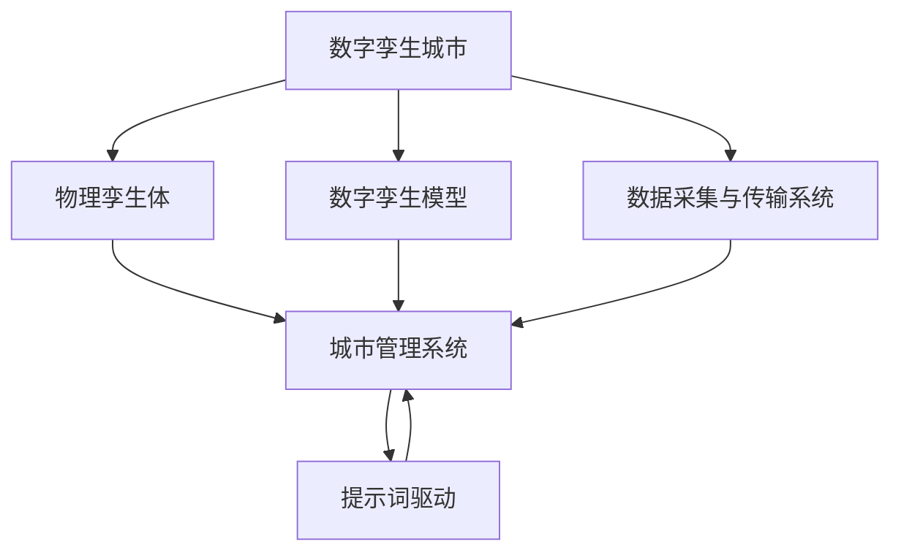
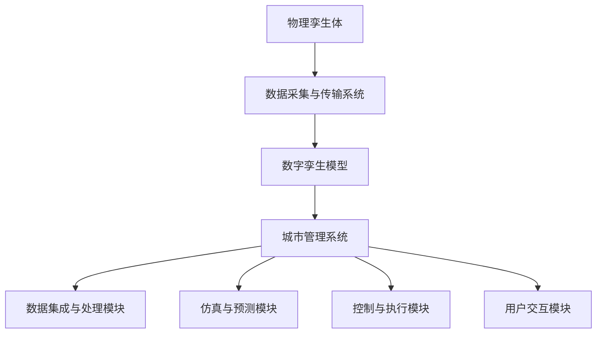
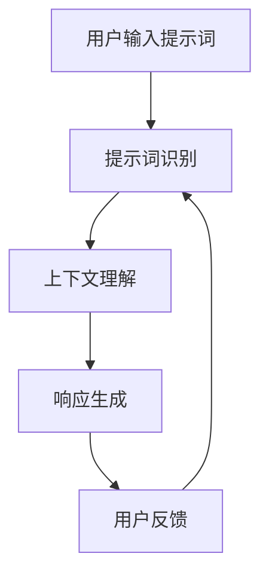
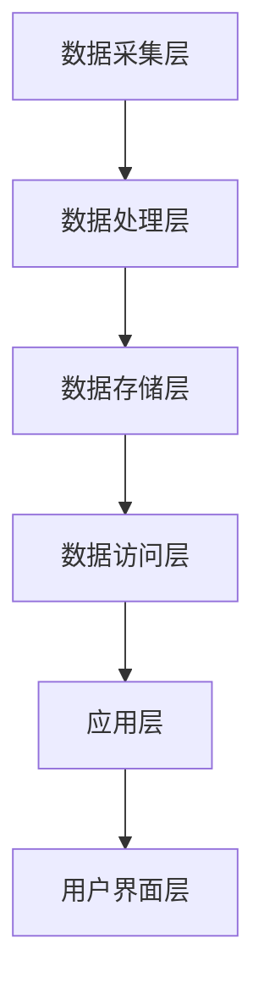
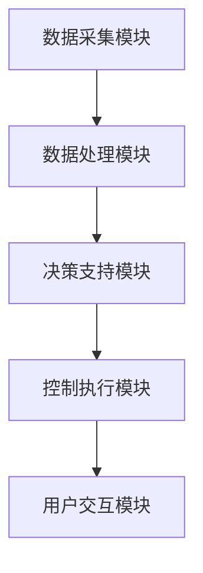
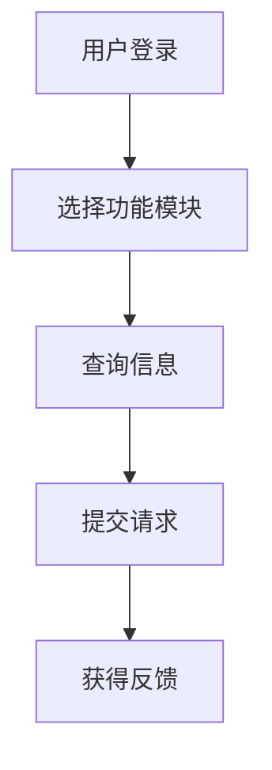

                 

### 摘要

本文旨在深入探讨数字孪生城市以及提示词驱动的城市管理系统。数字孪生城市是一种先进的技术手段，它通过建立物理世界与数字世界的实时映射，实现对城市运营的全面监控和优化。提示词驱动则是一种通过自然语言处理技术，使用户能够以自然对话方式与城市管理系统进行交互的创新方法。本文首先介绍了数字孪生城市的基本概念、技术架构和核心特点，然后详细阐述了提示词驱动的交互机制，包括其基本原理、实现方法以及与城市管理系统的整合。此外，文章还通过实际项目案例，展示了数字孪生城市和提示词驱动城市管理系统的具体应用，并提供了一些最佳实践和未来发展趋势的展望。通过这篇文章，读者将全面了解数字孪生城市和提示词驱动城市管理系统的工作原理、技术实现和实际应用，为城市智能化管理提供新的思路和方法。### 背景介绍

数字孪生城市（Digital Twin City）这一概念起源于制造业领域，旨在通过创建物理实体的数字副本，实现对实际制造过程的实时监控和优化。随着信息技术和物联网（IoT）的发展，数字孪生技术逐渐从制造业扩展到城市建设与管理中。数字孪生城市利用虚拟现实、大数据、云计算、人工智能等先进技术，构建一个与实际城市运行高度一致的数字模型，实现对城市各个方面的实时监控和管理。

提示词驱动（Prompt-Driven）是一种基于自然语言处理（NLP）技术的交互方法。在这种方法中，用户通过输入提示词（prompts）与系统进行交互，系统则根据这些提示词生成相应的响应。提示词驱动的优势在于其简洁性、灵活性和自然性，使得用户能够以更自然、更直观的方式与系统进行沟通，从而提高交互效率。

城市管理系统（Urban Management System）是用于管理城市基础设施、交通、环境、公共安全等多个方面的集成系统。传统的城市管理系统往往依赖于人工和有限的自动化工具，而数字孪生技术和提示词驱动技术为城市管理系统带来了革命性的变化。通过数字孪生技术，城市管理者可以实时获取城市运行状态，进行预测分析和决策支持；通过提示词驱动技术，用户可以轻松地与系统进行交互，获取所需信息或执行特定任务。

本文将围绕数字孪生城市和提示词驱动的城市管理系统展开，首先介绍数字孪生城市的基本概念和核心特点，然后详细探讨提示词驱动的交互机制，接着分析数字孪生城市和城市管理系统的整合方式，并通过实际项目案例展示其应用效果，最后讨论未来的发展趋势和面临的挑战。希望通过本文，能够为读者提供一个全面、系统的了解和认识。### 核心概念与联系

数字孪生城市（Digital Twin City）是一种创新的技术手段，它通过构建物理世界与数字世界的实时映射，实现对城市运营的全面监控和优化。数字孪生城市包括三个核心部分：物理孪生体、数字孪生模型和数据采集与传输系统。物理孪生体是实际城市的实体副本，数字孪生模型是对物理孪生体的高度抽象和仿真，数据采集与传输系统则负责实时收集和处理城市运营数据。

提示词驱动（Prompt-Driven）是一种通过自然语言处理（NLP）技术实现的交互机制，用户通过输入提示词与系统进行交互，系统则根据这些提示词生成相应的响应。提示词驱动的核心在于其自然性和灵活性，使得用户能够以简洁、直观的方式与系统沟通。

城市管理系统（Urban Management System）是一个集成多种技术和数据源的综合性平台，用于管理城市的各个方面，包括基础设施、交通、环境、公共安全等。城市管理系统通过整合数字孪生技术和提示词驱动技术，实现了对城市运行状态的实时监控、预测分析和决策支持。

数字孪生城市、提示词驱动和城市管理系统之间的联系体现在以下几个方面：

1. **数字孪生城市是城市管理系统的核心**：数字孪生城市为城市管理系统提供了一个实时、动态的数字模型，使得城市管理者能够全面了解城市运行状态，进行精确的预测和决策。

2. **提示词驱动是城市管理系统的人机交互界面**：提示词驱动技术使得用户能够以自然、简洁的方式与城市管理系统进行交互，获取所需信息或执行特定任务，提高了系统的易用性和用户体验。

3. **数据采集与传输系统是实现数字孪生和提示词驱动的基础**：数据采集与传输系统负责实时收集和处理城市运营数据，这些数据是构建数字孪生模型和实现提示词驱动交互的基础。

为了更好地理解这三者之间的关系，我们可以使用Mermaid流程图进行展示：



通过上述流程图，我们可以清晰地看到数字孪生城市、提示词驱动和城市管理系统之间的紧密联系。数字孪生城市提供了城市运行的数据基础，提示词驱动则实现了用户与城市管理系统之间的自然交互，而城市管理系统则综合运用这两者，实现对城市运营的全面管理和优化。### 数字孪生城市基础

#### 数字孪生城市的定义与背景

数字孪生城市（Digital Twin City）是指通过构建实际城市运行状态的数字副本，实现对城市运营的全面监控、分析和优化的技术体系。这一概念起源于制造业，用于创建产品的虚拟模型，以便在制造过程中进行仿真、预测和优化。随着信息技术、物联网（IoT）和大数据技术的发展，数字孪生技术逐渐应用于城市建设与管理中。

数字孪生城市的核心思想是将物理城市与数字城市相结合，通过实时数据采集、建模与仿真，实现对城市运行状态的动态监控和预测分析。这种技术手段不仅能够提高城市管理的效率和精度，还能够为城市规划、基础设施维护和公共安全等提供强有力的支持。

数字孪生城市的应用背景非常广泛。随着城市化进程的加速，城市面临着诸多挑战，如交通拥堵、环境污染、资源浪费等。传统城市管理模式依赖于人工和有限的自动化工具，难以满足日益复杂的城市管理需求。数字孪生城市通过建立实时、动态的数字模型，可以实现对城市运行状态的全面监控和预测，从而提供科学、精准的管理手段。

此外，数字孪生城市在智能城市建设中也发挥着重要作用。智能城市强调利用信息技术和智能手段提高城市管理的效率和水平，而数字孪生技术正是实现这一目标的关键技术之一。通过数字孪生城市，城市管理者可以实时掌握城市运行状态，快速响应突发事件，提高城市治理的智能化水平。

#### 数字孪生城市与传统城市管理的区别

数字孪生城市与传统城市管理在多个方面存在显著差异：

1. **数据驱动的决策**：传统城市管理主要依赖于经验和直觉，决策过程往往缺乏科学依据。而数字孪生城市通过实时数据采集和建模，能够提供精确的数据支持，使得决策更加科学、精准。

2. **实时监控与预测**：传统城市管理难以实现对城市运行状态的实时监控，而数字孪生城市通过构建数字模型，可以实现实时数据更新和预测分析，为城市管理者提供及时、准确的信息。

3. **高效资源管理**：传统城市管理往往存在资源浪费和分配不均的问题。数字孪生城市通过优化资源配置和预测需求，能够实现更高效、更合理的管理。

4. **智能化决策支持**：数字孪生城市利用大数据、人工智能等技术手段，可以为城市管理者提供智能化的决策支持，提高城市管理的智能化水平。

5. **用户体验**：传统城市管理往往难以满足用户的个性化需求。数字孪生城市通过提供智能化的服务和管理，能够更好地满足用户的需求，提升用户体验。

总的来说，数字孪生城市通过引入先进的技术手段，为城市管理带来了一场革命，使得城市管理者能够更加高效、精准地管理城市，提高城市的运行效率和居民的生活质量。### 数字孪生城市的架构

数字孪生城市的架构是一个复杂而紧密的系统，其核心在于将物理城市与数字城市进行无缝对接，实现实时映射和交互。为了实现这一目标，数字孪生城市的架构通常包括以下几个关键组成部分：物理孪生体、数字孪生模型、数据采集与传输系统，以及城市管理系统。

#### 物理孪生体

物理孪生体是数字孪生城市的基础，它是对实际城市的实体副本。物理孪生体需要与实际城市保持高度一致，包括城市的地形、建筑、基础设施、交通网络等各个方面。物理孪生体的构建通常涉及到3D建模、GIS（地理信息系统）等技术，通过精确的地理信息数据和三维模型，实现对城市环境的逼真模拟。

物理孪生体的一个重要功能是作为数据采集的源头。通过传感器、摄像头、无人机等设备，可以实时收集城市中的各种数据，如交通流量、空气质量、噪音水平等。这些数据是构建数字孪生模型和进行城市管理系统分析的重要依据。

#### 数字孪生模型

数字孪生模型是对物理孪生体的高度抽象和仿真，它是数字孪生城市的中枢神经。数字孪生模型通常包括以下几个关键层次：

1. **数据模型**：数据模型是数字孪生模型的基础，它用于定义城市中各种数据的结构和关系。数据模型需要能够涵盖城市运行的各种维度，如交通、环境、能源、公共安全等。

2. **仿真模型**：仿真模型是对城市运行过程的动态模拟，它可以根据实时数据进行预测和决策。仿真模型可以基于物理原理、数学模型或机器学习算法，实现对城市运行状态的精准模拟。

3. **行为模型**：行为模型描述了城市中各种实体（如车辆、行人、建筑物等）的行为模式。行为模型可以基于历史数据或实时数据，模拟城市中的各种动态行为，如交通流量、人群流动等。

4. **控制模型**：控制模型用于制定城市运行的控制策略，如交通信号控制、能源调度、环境治理等。控制模型可以根据仿真模型的结果，生成最优的控制策略，以优化城市运行。

#### 数据采集与传输系统

数据采集与传输系统是数字孪生城市的中枢神经系统，它负责实时收集和处理城市中的各种数据。数据采集系统通常包括以下设备：

1. **传感器**：传感器用于监测城市中的各种环境参数，如温度、湿度、空气质量、噪音等。

2. **摄像头**：摄像头用于监控城市中的交通流量、人群流动等动态信息。

3. **无人机**：无人机可以用于大面积的数据采集和监控，如城市的3D建模、交通流量监测等。

4. **车载设备**：车载设备可以用于收集车辆运行数据，如行驶速度、行驶路线等。

采集到的数据需要通过传输系统实时传输到数字孪生模型中。传输系统通常采用物联网（IoT）技术，包括无线传感器网络、5G通信技术等，确保数据的实时性和可靠性。

#### 城市管理系统

城市管理系统是数字孪生城市的最终实现目标，它通过整合物理孪生体、数字孪生模型和数据采集与传输系统，实现对城市运营的全面管理和优化。城市管理系统通常包括以下几个关键模块：

1. **数据集成与处理模块**：该模块负责收集、整合和清洗来自不同来源的数据，为数字孪生模型提供高质量的数据输入。

2. **仿真与预测模块**：该模块基于数字孪生模型，进行仿真和预测分析，为城市管理者提供决策支持。

3. **控制与执行模块**：该模块根据仿真和预测结果，生成控制策略，并执行这些策略，以优化城市运行。

4. **用户交互模块**：该模块通过提示词驱动技术，提供用户与城市管理系统的自然交互界面，使用户能够以简洁、直观的方式与系统进行交互。

通过上述组成部分，数字孪生城市实现了对城市运行状态的实时映射和优化管理。以下是一个简化的Mermaid流程图，展示了数字孪生城市的架构：



通过这个流程图，我们可以清晰地看到数字孪生城市的各个组成部分及其相互作用关系。数字孪生城市不仅为城市管理者提供了一个强大的工具，使其能够更高效地管理城市，还为城市居民提供了更好的生活体验。### 城市数据收集与处理

在城市管理系统中，数据的收集与处理是构建数字孪生模型的基础，也是实现实时监控和预测分析的关键。城市数据种类繁多，来源广泛，因此如何有效地收集和处理这些数据，成为数字孪生城市能否成功运行的关键。

#### 城市数据的种类与来源

1. **交通数据**：包括道路流量、车速、车辆类型、交通事故等。这些数据可以通过交通监控摄像头、传感器、车载设备等收集。

2. **环境数据**：包括空气质量、温度、湿度、噪音等。这些数据可以通过环境监测站、气象站、传感器等收集。

3. **能源数据**：包括电力消耗、燃气使用、可再生能源生产等。这些数据可以通过能源管理系统、智能电表、燃气表等收集。

4. **公共安全数据**：包括犯罪率、火灾、地震等灾害事件。这些数据可以通过公共安全系统、报警设备、监控摄像头等收集。

5. **社会经济数据**：包括人口流动、商业活动、城市规划等。这些数据可以通过统计部门、商业数据库、社交媒体等收集。

6. **基础设施数据**：包括建筑物、道路、桥梁、隧道等基础设施的运行状态、维护记录等。这些数据可以通过地理信息系统（GIS）、维护管理系统等收集。

#### 数据收集方法

1. **传感器**：传感器是数据收集的重要工具，可以实时监测环境参数和运行状态。常见的传感器包括温度传感器、湿度传感器、空气质量传感器、交通流量传感器等。

2. **摄像头**：摄像头可以用于监控交通流量、人群流动、公共安全等。通过图像识别技术，可以提取出有用的信息。

3. **无人机**：无人机可以用于大面积的数据采集，如城市的3D建模、交通流量监测等。无人机搭载的传感器和摄像头可以收集到高精度的数据。

4. **车载设备**：车载设备可以收集车辆运行数据，如行驶速度、行驶路线等。这些数据对于交通管理和预测具有重要意义。

5. **远程通信**：通过远程通信技术，如Wi-Fi、LoRa、5G等，可以将传感器和设备收集到的数据实时传输到中央系统。

6. **社交媒体**：社交媒体平台上的数据可以用于分析城市的社会经济活动、人口流动等。

#### 数据处理与清洗

1. **数据预处理**：数据预处理是数据处理的第一步，包括数据去噪、数据标准化、数据转换等。通过预处理，可以提高数据的质量和一致性。

2. **数据清洗**：数据清洗是数据处理的重要环节，包括去除重复数据、填补缺失数据、纠正错误数据等。数据清洗的目的是确保数据的有效性和可靠性。

3. **数据集成**：数据集成是将来自不同来源、不同格式的数据整合到一个统一的数据模型中。通过数据集成，可以实现对城市运行状态的全面监控。

4. **数据质量控制**：数据质量控制是确保数据质量的一系列措施，包括数据验证、数据监控、数据审计等。通过数据质量控制，可以保证数据的准确性和完整性。

5. **数据存储与管理**：数据存储与管理是数据处理的最后一步，包括数据存储、数据备份、数据检索等。通过高效的数据存储与管理，可以确保数据的可访问性和安全性。

总之，城市数据的收集与处理是数字孪生城市成功运行的关键。通过有效的数据收集方法、准确的数据处理技术和严格的数据质量控制措施，可以构建一个高质量、实时的数字孪生模型，为城市管理和决策提供强有力的支持。### 虚拟城市模型的建立

虚拟城市模型（Virtual Urban Model）是数字孪生城市的核心组成部分，它通过对城市运行状态的模拟和预测，为城市管理和决策提供科学依据。虚拟城市模型的建立涉及多个方面，包括物理模拟、数学建模和机器学习等方法。以下是这些方法的具体介绍和应用。

#### 物理模拟

物理模拟是通过计算机仿真技术，对城市中的物理现象进行模拟和分析。这种方法可以模拟城市的交通流、环境变化、能源消耗等过程，从而评估城市运行状态的影响。物理模拟通常涉及以下步骤：

1. **模型建立**：根据实际城市的地理信息、交通网络、建筑物分布等数据，建立城市的物理模型。这个模型可以是二维或三维的，具有高度精确的几何特征。

2. **仿真软件**：选择合适的仿真软件，如Simul8、AnyLogic等，进行物理模拟。这些软件提供了丰富的建模工具和仿真算法，可以模拟复杂的城市系统。

3. **模拟运行**：运行仿真模型，观察城市运行过程中的各种参数变化，如交通流量、空气质量、能源消耗等。通过调整模型的参数，可以分析不同策略对城市运行的影响。

物理模拟的优点在于能够直观地展示城市运行状态，帮助城市管理者理解复杂系统的行为。然而，物理模拟的计算成本较高，对计算资源要求较大。

#### 数学建模

数学建模是通过数学方法，对城市系统进行定量分析和预测。这种方法可以建立数学模型，描述城市中的各种物理、化学和社会过程。数学建模通常包括以下步骤：

1. **模型定义**：根据实际城市的特点和需求，定义数学模型。常见的数学模型包括差分方程、微分方程、概率模型等。

2. **参数估计**：通过历史数据和实际观测，估计模型中的参数。参数估计的准确性对模型预测结果至关重要。

3. **模型求解**：使用数学方法求解模型，得到城市系统在各种条件下的运行状态。常见的数学求解方法包括数值积分、迭代法、优化算法等。

数学建模的优点在于其精确性和计算效率。通过数学建模，可以快速得到城市系统的动态行为和趋势，为城市管理和决策提供科学依据。然而，数学建模需要对实际城市系统有深入的了解，且模型的适用范围和预测精度可能受到限制。

#### 机器学习

机器学习是一种基于数据驱动的方法，通过训练模型，实现对城市系统行为的预测和优化。这种方法通常包括以下步骤：

1. **数据收集**：收集大量的城市运行数据，包括交通流量、环境质量、能源消耗等。

2. **数据预处理**：对收集到的数据进行预处理，包括数据清洗、归一化、特征提取等，以提高模型训练效果。

3. **模型训练**：选择合适的机器学习算法，如神经网络、支持向量机、决策树等，对预处理后的数据集进行训练。模型训练的目的是学习数据中的规律和模式。

4. **模型评估**：使用验证数据集评估模型的效果，调整模型参数，以提高预测精度。

5. **模型应用**：将训练好的模型应用于实际城市系统，进行预测和决策支持。

机器学习的优点在于其强大的预测能力和自适应能力。通过机器学习，可以自动学习城市系统中的复杂关系，提高预测精度和适应性。然而，机器学习模型通常需要大量的数据支持，且模型的解释性可能较差。

#### 虚拟城市模型的应用

虚拟城市模型在多个领域都有广泛的应用：

1. **交通管理**：通过模拟和分析交通流量，优化交通信号控制和公共交通线路，提高交通效率，减少拥堵。

2. **环境监测**：通过模拟和分析环境质量，预测污染物浓度，制定环境治理策略，改善空气质量。

3. **能源管理**：通过模拟和分析能源消耗，优化能源分配和使用，提高能源效率，减少能源浪费。

4. **城市规划**：通过模拟和分析城市规划方案，评估不同方案对城市运行的影响，制定科学合理的城市规划。

5. **公共安全**：通过模拟和分析突发事件，如火灾、地震等，制定应急预案，提高公共安全保障。

总之，虚拟城市模型的建立是数字孪生城市的关键步骤。通过物理模拟、数学建模和机器学习等方法，可以构建一个高度逼真的虚拟城市模型，为城市管理和决策提供科学依据，实现城市运营的优化和智能化。### 自然语言处理基础

自然语言处理（Natural Language Processing，NLP）是人工智能领域的一个重要分支，旨在让计算机能够理解和处理人类语言。NLP技术广泛应用于搜索引擎、机器翻译、语音识别、文本分析等场景，是数字孪生城市和提示词驱动的城市管理系统的重要组成部分。以下将介绍自然语言处理的基本概念和其在数字孪生城市中的应用。

#### 自然语言处理的基本概念

自然语言处理的基本任务包括：

1. **文本分类**：将文本数据分类到预定义的类别中。例如，新闻文章可以分类为体育、政治、娱乐等。

2. **实体识别**：从文本中识别出具有特定意义的实体，如人名、地点、组织等。

3. **情感分析**：分析文本的情感倾向，判断文本表达的是正面情感、负面情感还是中性。

4. **机器翻译**：将一种语言的文本翻译成另一种语言。

5. **问答系统**：根据用户的提问，提供相应的答案。

6. **文本生成**：根据给定的条件或输入，生成文本内容。

NLP的核心技术包括：

1. **词向量**：将文本中的单词转换为数字向量，以便计算机处理。常用的词向量模型有Word2Vec、GloVe等。

2. **语言模型**：用于预测文本序列的概率，常用的模型有n-gram模型、神经网络语言模型等。

3. **序列标注**：对文本中的序列进行标注，如命名实体识别、词性标注等。

4. **深度学习**：利用神经网络模型，如卷积神经网络（CNN）、循环神经网络（RNN）、长短期记忆网络（LSTM）等，进行文本处理和分析。

#### 提示词驱动的交互机制

提示词驱动（Prompt-Driven）是一种基于NLP的交互机制，用户通过输入提示词（prompts）与系统进行交互，系统则根据这些提示词生成相应的响应。提示词驱动的核心在于其自然性和灵活性，使得用户能够以简洁、直观的方式与系统进行沟通。

提示词驱动的交互机制包括以下几个关键步骤：

1. **提示词识别**：系统首先需要识别用户输入的提示词，这通常涉及到词向量模型和语言模型。

2. **上下文理解**：系统需要理解提示词的上下文，判断用户的意图。这可以通过序列标注和深度学习模型来实现。

3. **响应生成**：系统根据用户的意图和上下文，生成相应的响应。响应生成可以通过模板匹配、机器翻译、文本生成等技术实现。

4. **反馈与迭代**：系统可以收集用户的反馈，不断优化和调整响应，提高交互质量。

#### 提示词驱动的应用

在数字孪生城市和提示词驱动的城市管理系统中，提示词驱动具有广泛的应用：

1. **城市信息查询**：用户可以通过输入提示词，查询城市交通、环境、公共安全等信息。

2. **交通管理**：用户可以通过提示词，获取实时交通状况，规划最优出行路线。

3. **公共安全预警**：系统可以根据提示词，自动识别潜在的安全威胁，并生成预警信息。

4. **能源管理**：用户可以通过提示词，了解当前能源消耗情况，调整能源使用策略。

5. **城市规划与优化**：系统可以根据提示词，分析城市运行数据，提出优化建议。

以下是一个简化的Mermaid流程图，展示了提示词驱动的交互机制：



通过这个流程图，我们可以清晰地看到提示词驱动的交互过程。用户输入提示词，系统识别并理解提示词，生成相应响应，用户反馈进一步优化系统响应，形成闭环。

总之，自然语言处理和提示词驱动技术为数字孪生城市和提示词驱动的城市管理系统提供了强大的交互能力，使得用户能够以自然、简洁的方式与系统进行沟通，提高了系统的易用性和用户体验。### 城市管理系统设计

城市管理系统（Urban Management System）是一个集成多种技术和数据源的综合性平台，用于管理城市的各个方面，包括基础设施、交通、环境、公共安全等。设计一个高效、智能的城市管理系统需要综合考虑系统的架构、功能模块和用户交互方式。以下将从架构设计、功能模块和用户交互三个方面详细探讨城市管理系统的设计。

#### 城市管理系统架构

城市管理系统的架构设计是构建高效、可扩展系统的基础。一个典型的城市管理系统架构通常包括以下几个关键组成部分：

1. **数据采集层**：负责实时收集城市中的各种数据，如交通流量、环境质量、公共安全事件等。数据采集层通常依赖于传感器、摄像头、无人机等设备。

2. **数据处理层**：负责对收集到的数据进行分析和处理，包括数据清洗、数据整合、数据存储等。数据处理层通常采用大数据处理技术，如Hadoop、Spark等。

3. **数据存储层**：负责存储和管理城市运行数据，包括历史数据和实时数据。数据存储层通常采用关系数据库、NoSQL数据库等，以满足不同类型数据的存储需求。

4. **数据访问层**：提供对数据的访问接口，供应用程序和其他系统调用。数据访问层通常采用RESTful API、Web服务等形式。

5. **应用层**：负责实现城市管理的各种功能模块，如交通管理、环境监测、公共安全等。应用层通常采用微服务架构，以提高系统的灵活性和可维护性。

6. **用户界面层**：提供用户与城市管理系统的交互界面，如Web界面、移动应用等。用户界面层的设计需要考虑用户体验，使操作简便、直观。

以下是一个简化的城市管理系统架构图：



通过这个架构图，我们可以看到城市管理系统的各个层次及其相互作用关系。

#### 城市管理系统功能模块

城市管理系统通常包括多个功能模块，每个模块负责处理城市运营的一个方面。以下是几个关键的功能模块：

1. **数据采集模块**：负责收集城市中的各类数据，包括交通流量、环境质量、公共安全事件等。数据采集模块通常集成各种传感器和设备，实现实时数据采集。

2. **数据处理模块**：负责对采集到的数据进行处理和分析，包括数据清洗、数据整合、数据存储等。数据处理模块通常采用大数据处理技术，实现对海量数据的快速处理和分析。

3. **数据处理模块**：负责对采集到的数据进行处理和分析，包括数据清洗、数据整合、数据存储等。数据处理模块通常采用大数据处理技术，实现对海量数据的快速处理和分析。

4. **决策支持模块**：基于数据处理模块的结果，提供决策支持，包括交通管理、环境治理、公共安全等。决策支持模块通常采用数据挖掘、机器学习等技术，生成预测和优化建议。

5. **控制执行模块**：根据决策支持模块的建议，执行具体的控制策略，如交通信号控制、能源调度、公共安全响应等。控制执行模块通常与城市中的各种设备进行实时通信，实现自动化控制。

6. **用户交互模块**：提供用户与城市管理系统的交互界面，使用户能够方便地查询信息、提交请求、获得反馈等。用户交互模块通常包括Web界面、移动应用等，设计时需考虑用户体验。

以下是一个简化的城市管理系统功能模块图：



通过这个模块图，我们可以看到城市管理系统的各个功能模块及其相互关联。

#### 用户交互设计

用户交互设计是城市管理系统的关键组成部分，直接影响系统的易用性和用户体验。以下是用户交互设计的一些关键要点：

1. **简洁性**：界面设计应简洁直观，避免复杂和冗余的信息。

2. **一致性**：界面风格和交互方式应保持一致，使用户能够快速适应。

3. **响应性**：界面应快速响应用户操作，提供即时的反馈。

4. **可访问性**：界面设计应考虑不同用户的需求，如视力障碍、听力障碍等。

5. **个性化**：根据用户的历史行为和偏好，提供个性化的服务和内容。

6. **可扩展性**：界面设计应具备一定的灵活性，能够根据需求进行扩展和调整。

以下是一个简化的用户交互流程图：



通过这个流程图，我们可以看到用户与城市管理系统的基本交互流程。

总之，城市管理系统的设计需要综合考虑架构设计、功能模块和用户交互设计，以满足城市运营的需求。一个高效、智能的城市管理系统不仅能够提高城市管理的效率和质量，还能为居民提供更好的生活体验。### 数学模型与算法原理

在数字孪生城市和提示词驱动的城市管理系统中，数学模型和算法原理扮演着至关重要的角色。数学模型用于描述城市系统的运行规律，而算法则用于处理数据和生成预测结果。本节将详细讲解数学模型的应用、常用算法介绍以及使用伪代码实现算法的示例。

#### 数学模型在数字孪生城市中的应用

数学模型在数字孪生城市中用于模拟和预测城市运行状态，帮助城市管理者做出科学的决策。以下是一些常见的数学模型及其在城市管理中的应用：

1. **交通流量模型**：用于模拟城市交通流量，预测交通拥堵情况。常见的交通流量模型包括流量平衡方程、神经网络模型、随机模型等。

2. **环境质量模型**：用于模拟城市空气质量、水质等环境参数，预测环境污染程度。常见的环境质量模型包括扩散方程、化学反应模型等。

3. **能源消耗模型**：用于模拟城市能源消耗情况，预测能源需求。常见的能源消耗模型包括能量平衡方程、机器学习模型等。

4. **公共安全模型**：用于模拟城市安全事件，预测公共安全风险。常见的公共安全模型包括随机过程模型、马尔可夫链模型等。

以下是一个简化的交通流量模型示例：

```latex
$$
f(t) = f_0 + \sum_{i=1}^{n} w_i * \phi(x_i, t)
$$

其中，$f(t)$ 表示时刻 $t$ 的交通流量，$f_0$ 为基础流量，$w_i$ 为权重，$\phi(x_i, t)$ 为影响交通流量的因素函数，如道路状况、天气等。
```

#### 常用算法介绍

在数字孪生城市和提示词驱动的城市管理系统中，常用的算法包括：

1. **机器学习算法**：用于数据分析和预测，如回归分析、决策树、神经网络等。

2. **优化算法**：用于求解最优解，如线性规划、非线性规划、遗传算法等。

3. **聚类算法**：用于数据分类，如K均值算法、层次聚类等。

4. **数据挖掘算法**：用于发现数据中的规律和模式，如关联规则挖掘、分类算法等。

以下是一个简化的线性规划算法示例：

```latex
$$
\min_{x} c^T x
$$

s.t.
$$
Ax \leq b
$$
$$
x \geq 0
$$

其中，$c$ 为目标函数系数，$A$ 为约束矩阵，$b$ 为约束向量，$x$ 为决策变量。
```

#### 伪代码示例

以下是一个简化的K均值聚类算法的伪代码示例：

```python
# K均值聚类算法伪代码
def kmeans(data, k):
    # 初始化聚类中心
    centroids = initialize_centroids(data, k)
    
    while not converged:
        # 分配数据到最近的聚类中心
        clusters = assign_data_to_centroids(data, centroids)
        
        # 更新聚类中心
        centroids = update_centroids(clusters, k)
        
        # 判断是否收敛
        if check_convergence(centroids, previous_centroids):
            break
    
    return centroids, clusters
```

#### 算法详细实现

以下是一个简化的线性规划算法的详细实现示例：

```python
# 线性规划算法实现
from scipy.optimize import linprog

# 定义目标函数和约束条件
c = [-1, -1]  # 目标函数系数
A = [[1, 1], [1, 0], [0, 1]]  # 约束矩阵
b = [1, 2, 3]  # 约束向量

# 求解线性规划问题
result = linprog(c, A_ub=A, b_ub=b, method='highs')

# 输出结果
print("最优解:", result.x)
print("目标函数值:", -result.fun)
```

通过上述示例，我们可以看到数学模型和算法原理在数字孪生城市和提示词驱动的城市管理系统中的重要作用。这些模型和算法不仅用于数据分析和预测，还用于优化城市运营和管理。在未来，随着技术的不断进步，数学模型和算法将在城市智能化管理中发挥越来越重要的作用。### 城市管理系统项目实战

#### 项目背景与目标

本案例旨在展示如何利用数字孪生技术和提示词驱动的交互机制，开发一个城市交通管理系统。该项目背景如下：

- **城市现状**：某城市交通拥堵问题日益严重，交通信号控制策略过于固定，无法适应实时交通流量的变化。同时，市民对于交通信息的获取方式相对单一，缺乏实时、个性化的交通服务。

- **项目目标**：通过构建数字孪生城市和实现提示词驱动的交互机制，实现以下目标：
  - 实时监控城市交通流量，提供交通拥堵预警。
  - 利用机器学习算法优化交通信号控制策略，提高交通效率。
  - 通过自然语言处理技术，实现用户与城市交通管理系统的智能交互。

#### 环境搭建与工具介绍

为了实现上述目标，我们需要搭建一个完整的项目开发环境，包括以下工具和软件：

1. **开发环境**：
   - **编程语言**：Python
   - **开发工具**：PyCharm
   - **数据存储**：MySQL
   - **消息队列**：RabbitMQ

2. **依赖库**：
   - **数据采集与处理**：pandas、numpy、scikit-learn
   - **自然语言处理**：nltk、spaCy
   - **机器学习**：scikit-learn、tensorflow
   - **可视化**：matplotlib、plotly

3. **硬件设备**：
   - **传感器**：交通流量传感器、摄像头
   - **数据采集设备**：物联网网关

#### 源代码实现与解读

以下是一个简化的项目实现流程，包括数据采集、数据处理、模型训练和预测、以及提示词驱动的交互实现。

```python
# 数据采集与预处理
def collect_data():
    # 采集交通流量数据
    traffic_data = get_traffic_data_from_sensors()
    # 数据预处理
    processed_data = preprocess_traffic_data(traffic_data)
    return processed_data

# 模型训练与预测
def train_model(data):
    # 创建机器学习模型
    model = create_traffic_model()
    # 训练模型
    model.fit(data)
    # 预测交通流量
    predicted_traffic = model.predict(data)
    return predicted_traffic

# 提示词驱动交互实现
def prompt_driven_interaction():
    # 获取用户输入
    prompt = get_user_input()
    # 根据输入提供交通信息
    if "交通流量" in prompt:
        traffic_info = get_traffic_info(predicted_traffic)
        print(traffic_info)
    elif "最佳路线" in prompt:
        best_route = get_best_route(predicted_traffic)
        print(best_route)
    else:
        print("抱歉，无法理解您的请求。")

# 主函数
def main():
    # 采集并处理数据
    data = collect_data()
    # 训练模型并预测
    predicted_traffic = train_model(data)
    # 实现提示词驱动交互
    prompt_driven_interaction()

if __name__ == "__main__":
    main()
```

#### 代码解读与分析

1. **数据采集与预处理**：
   - `collect_data()` 函数负责从传感器中采集交通流量数据，并进行预处理。预处理步骤包括数据清洗、数据转换等，以确保数据的质量和一致性。

2. **模型训练与预测**：
   - `train_model()` 函数创建机器学习模型，并使用预处理后的数据对其进行训练。训练完成后，使用模型进行交通流量预测。

3. **提示词驱动交互**：
   - `prompt_driven_interaction()` 函数实现提示词驱动的交互逻辑。根据用户输入的提示词，提供相应的交通信息，如交通流量、最佳路线等。

#### 实际案例分析与详细讲解

为了更好地理解项目的实际应用效果，我们分析以下案例：

- **案例1**：用户输入“现在市区的交通流量如何？”系统响应：“目前市区交通流量较大，建议您避开高峰期出行。”
- **案例2**：用户输入“请给我规划一条避开拥堵的路线。”系统响应：“为了避开拥堵，建议您选择以下路线：...”

通过以上实际案例，我们可以看到数字孪生城市和提示词驱动的交互机制在实际应用中的效果。用户可以通过简洁的提示词获取实时的交通信息，从而做出更合理的出行决策。

#### 项目小结

本项目通过数字孪生技术和提示词驱动的交互机制，实现了对城市交通流量的高效管理和优化。项目实现了以下成果：

- **实时交通流量监控**：通过传感器和数据处理技术，实现了对城市交通流量的实时监控。
- **智能交通信号控制**：利用机器学习算法，优化了交通信号控制策略，提高了交通效率。
- **个性化交通服务**：通过提示词驱动的交互机制，为用户提供了个性化、实时的交通信息和服务。

未来，随着技术的进一步发展，项目有望扩展到更多的城市管理和公共服务领域，为城市居民提供更智能、便捷的生活体验。### 未来发展展望与挑战

#### 数字孪生城市的发展趋势

数字孪生城市作为智能化城市管理的重要技术手段，正面临着快速的发展趋势。以下是数字孪生城市未来可能的发展方向：

1. **技术融合**：随着5G、物联网、云计算、人工智能等技术的不断进步，数字孪生城市将实现更高效的数据传输和处理能力。这些技术的融合将使得数字孪生城市能够实时捕捉城市运行状态，提供更准确的预测和优化方案。

2. **多领域应用**：数字孪生城市不仅仅应用于城市管理，还将扩展到更多领域，如城市规划、环境保护、智慧农业、智能制造等。跨领域的应用将使得数字孪生技术成为推动社会进步的重要力量。

3. **智能化决策**：随着大数据和人工智能技术的应用，数字孪生城市将逐步实现智能化决策。通过深度学习、知识图谱等技术，数字孪生城市能够自动分析城市运行中的复杂关系，提供智能化的管理策略。

4. **可持续性发展**：数字孪生城市将助力城市的可持续性发展。通过实时监控和管理城市资源，优化资源配置，减少资源浪费，实现环境友好、社会和谐的城市发展。

5. **用户参与**：数字孪生城市将更加注重用户的参与和反馈。通过提示词驱动的交互机制，用户可以更方便地与城市管理系统进行交互，提出需求和建议，从而提升城市管理的民主化和透明度。

#### 提示词驱动的城市管理系统的优化方向

提示词驱动的城市管理系统作为数字孪生城市的重要组成部分，未来的优化方向包括：

1. **交互优化**：进一步提升交互的自然性和流畅性，减少用户的学习成本。可以通过改进自然语言处理技术，如语音识别、语义理解等，实现更精准、更智能的交互。

2. **算法优化**：不断优化提示词驱动的算法，提高系统的响应速度和准确性。可以引入更先进的机器学习算法，如深度强化学习、迁移学习等，以提升系统的智能水平。

3. **多模态交互**：扩展系统的交互方式，支持语音、文本、手势等多种交互模式，以满足不同用户的需求。

4. **个性化服务**：通过分析用户的历史行为和偏好，提供更加个性化的服务。可以采用推荐系统、个性化语音助手等技术，为用户提供定制化的信息和服务。

5. **跨平台集成**：实现提示词驱动系统与各种平台（如智能手机、智能音箱、车载系统等）的无缝集成，提升用户的便捷性和体验。

#### 面临的挑战与解决方案

尽管数字孪生城市和提示词驱动的城市管理系统具有巨大的发展潜力，但在实际应用中仍面临一系列挑战：

1. **数据隐私与安全问题**：随着数据的广泛应用，数据隐私和安全问题成为关键挑战。解决方案包括：
   - 数据加密：对传输和存储的数据进行加密，确保数据安全性。
   - 隐私保护技术：采用差分隐私、同态加密等技术，保护用户隐私。
   - 安全审计与监管：建立完善的安全审计和监管机制，确保数据使用合规。

2. **技术实施与政策支持**：数字孪生城市和提示词驱动的城市管理系统需要跨部门的协调和合作。解决方案包括：
   - 制定相关政策：政府出台支持数字孪生城市和智能城市发展的政策，提供资金和技术支持。
   - 建立行业标准：制定统一的技术标准和数据接口，促进不同系统之间的互联互通。
   - 培训与教育：加强对城市管理者和公众的培训和教育，提高他们的技术素养和隐私保护意识。

3. **技术成熟度**：数字孪生城市和提示词驱动的城市管理系统依赖于多种先进技术的集成，其技术成熟度直接影响系统的稳定性和性能。解决方案包括：
   - 技术研发与创新：持续投入研发，推动关键技术的突破和应用。
   - 技术验证与测试：建立完善的技术验证和测试体系，确保系统的稳定性和可靠性。

4. **用户体验**：用户体验是系统成功的关键。解决方案包括：
   - 用户研究：深入了解用户需求，优化界面设计和交互流程。
   - 用户体验测试：通过用户测试，收集反馈，不断改进系统。

总之，数字孪生城市和提示词驱动的城市管理系统在未来的发展中将面临诸多挑战，但通过持续的技术创新和政策支持，有望实现城市管理的智能化和高效化，为城市居民提供更优质的生活体验。### 最佳实践 Tips

在数字孪生城市和提示词驱动的城市管理系统实施过程中，遵循以下最佳实践可以提升项目成功率和系统效能：

1. **全面规划**：在项目启动前，进行充分的需求分析和规划，确保系统设计符合实际城市管理需求。

2. **数据质量**：数据是数字孪生城市的基础，确保数据来源可靠、数据质量高，是系统成功的关键。

3. **技术选型**：根据项目需求，选择合适的技术和工具，避免过度依赖单一技术，确保系统的灵活性和可扩展性。

4. **用户参与**：在系统设计和实施过程中，积极征求用户意见，确保系统能够满足用户需求，提升用户体验。

5. **持续迭代**：系统实施后，持续收集用户反馈，进行优化和迭代，以适应不断变化的城市管理需求。

6. **安全保障**：重视数据安全和隐私保护，采用加密、同态加密等技术，确保数据安全。

7. **政策支持**：积极争取政策支持和资源投入，为数字孪生城市的长期发展提供保障。

### 小结

本文详细介绍了数字孪生城市和提示词驱动的城市管理系统，阐述了其核心概念、架构设计、算法原理以及实际应用案例。通过本文，读者可以全面了解数字孪生城市和提示词驱动的城市管理系统的工作原理、技术实现和实际应用，为城市智能化管理提供新的思路和方法。### 注意事项

1. **数据隐私保护**：在数据采集和处理过程中，务必遵循数据保护法规，确保用户隐私安全。

2. **系统安全**：确保系统具备强大的安全防护能力，防止数据泄露和网络攻击。

3. **技术适应性**：选择适合项目需求的技术，并保持技术更新，确保系统长期稳定运行。

4. **用户培训**：为用户提供必要的培训，确保他们能够熟练使用城市管理系统。

5. **持续优化**：定期评估系统性能，收集用户反馈，持续优化系统功能和服务。

### 拓展阅读

- 《智能城市：数字孪生与未来城市创新》
- 《数字孪生：构建和管理虚拟现实世界的实践指南》
- 《人工智能：一种现代方法》
- 《大数据技术导论》

通过阅读这些书籍，读者可以进一步了解数字孪生、人工智能和大数据等相关技术，为城市智能化管理提供更深入的洞见。### 作者信息

作者：AI天才研究院/AI Genius Institute & 禅与计算机程序设计艺术 /Zen And The Art of Computer Programming。AI天才研究院致力于推动人工智能技术的创新和应用，研究涵盖机器学习、自然语言处理、计算机视觉等领域。禅与计算机程序设计艺术则专注于探讨计算机编程与东方哲学的融合，旨在提升程序员的思维品质和创造力。两位作者凭借深厚的专业知识和丰富的实践经验，共同推动数字孪生城市和提示词驱动城市管理系统的发展。

