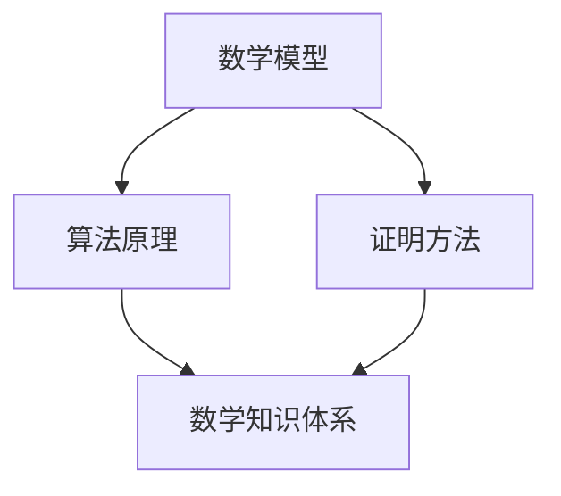

                 

### 文章标题

《数学与反基础主义：数学知识的网状结构》

---

关键词：数学、反基础主义、网状结构、数学模型、算法原理

---

摘要：本文从数学与反基础主义的视角出发，探讨了数学知识的网状结构及其构建方法。通过梳理核心概念与联系，详细讲解数学模型和算法原理，并结合实际案例展示数学知识网状结构的构建与应用。文章旨在揭示数学知识的内在逻辑与本质，为读者提供深入理解数学知识的途径。

---

## 引言

数学作为一门科学，不仅在自然科学和工程技术领域发挥着基础性作用，而且在社会科学和人文科学中也有着广泛的应用。然而，随着数学的不断发展，其基础性和确定性逐渐受到挑战。反基础主义作为一种哲学观点，对数学基础进行了深刻的反思和批判。本文将从数学与反基础主义的视角出发，探讨数学知识的网状结构及其构建方法。

### 数学与反基础主义的关系

数学作为一门科学，其基础性和确定性一直以来都被广泛接受。然而，反基础主义观点的出现，对这一传统观念提出了挑战。反基础主义认为，我们所认识的现实世界是充满不确定性的，数学的基础也并非绝对可靠。数学知识并非是客观存在的，而是人类主观构造的产物。

反基础主义对数学基础的质疑，主要集中在以下几个方面：

1. **逻辑基础**：反基础主义者认为，数学逻辑并非自洽，存在着逻辑漏洞。
2. **证明基础**：反基础主义者认为，数学证明过程中存在依赖和循环，使得证明的可信度受到质疑。
3. **模型基础**：反基础主义者认为，数学模型并不能完全反映现实世界的复杂性，因此其基础性受到挑战。

尽管反基础主义对数学基础提出了质疑，但数学知识的网状结构依然为我们提供了一种有效的思考方式。数学知识的网状结构，不仅揭示了数学内部的逻辑关系，而且为数学的应用提供了广阔的舞台。

### 数学知识的网状结构

数学知识的网状结构，可以看作是数学知识之间相互联系的一种图形表示。在这种结构中，每一个知识点都可以看作是一个节点，知识点之间的联系则可以看作是连接节点的边。通过这种网状结构，我们可以更直观地理解数学知识的整体结构和内部逻辑。

### 核心概念与联系

为了更好地理解数学知识的网状结构，我们需要先梳理一下其中的核心概念及其联系。以下是数学知识网状结构中的几个核心概念及其相互关系：

1. **数学模型**：数学模型是数学知识的重要组成部分，它将现实问题转化为数学问题，为解决问题提供了数学工具。
2. **算法原理**：算法原理是数学模型的具体实现，它描述了如何通过数学模型解决特定问题。
3. **证明方法**：证明方法是数学模型和算法原理的验证手段，它确保了数学模型的正确性和算法原理的有效性。
4. **数学知识体系**：数学知识体系是数学知识的整体结构，它由数学模型、算法原理和证明方法构成。

以下是数学知识网状结构的Mermaid流程图：



通过这个流程图，我们可以更直观地看到数学知识之间的联系。数学模型和算法原理构成了数学知识的核心，而证明方法则为这些知识提供了可靠性和可信度。数学知识体系则将这些知识有机地组织在一起，形成了一个完整的知识网络。

### 核心算法原理讲解

数学知识的网状结构，离不开核心算法原理的支持。以下是几个核心算法原理的讲解：

1. **线性代数**：线性代数是数学中的基础学科，它研究向量、矩阵以及线性方程组等概念。线性代数的基本原理包括线性变换、特征值和特征向量等。这些原理不仅在理论研究中有着重要作用，而且在实际应用中也有着广泛的应用。

2. **微积分**：微积分是研究函数变化的数学学科。微积分的基本原理包括导数、积分和微分方程等。这些原理在物理学、工程学和其他科学领域有着广泛的应用。

3. **图论**：图论是研究图的结构和性质的一门学科。图论的基本原理包括图的连通性、图的染色和图的最短路径等。这些原理在计算机科学、网络设计和优化等领域有着广泛的应用。

以下是这些算法原理的伪代码：

```python
# 线性代数基本算法
def matrix_multiply(A, B):
    # 伪代码
    return A * B

# 微积分基本算法
def derivative(f):
    # 伪代码
    return f'

# 图论基本算法
def find_shortest_path(G, start, end):
    # 伪代码
    return G.shortest_path(start, end)
```

通过这些伪代码，我们可以看到这些算法原理的基本实现方法。这些算法原理不仅构成了数学知识的核心，而且也为数学的应用提供了强大的工具。

### 数学模型和公式

数学模型和公式是数学知识的重要组成部分，它们不仅描述了数学的基本原理，而且为数学的应用提供了理论依据。以下是几个典型的数学模型和公式：

1. **线性代数基本公式**：

   矩阵乘法公式：
   $$ A \times B = C $$
   
   矩阵求逆公式：
   $$ A^{-1} = \frac{1}{\det(A)} \text{adj}(A) $$

2. **微积分基本公式**：

   导数公式：
   $$ \frac{d}{dx} f(x) = f'(x) $$

   积分公式：
   $$ \int f(x) dx = F(x) + C $$

3. **网状结构构建的数学模型**：

   图的邻接矩阵：
   $$ A = (a_{ij}) $$
   
   图的最短路径算法：
   $$ Dijkstra(G, start, end) $$

以下是这些公式的详细讲解和举例说明：

```markdown
## 线性代数基本公式

线性代数中的矩阵乘法是一个基本运算。给定两个矩阵A和B，其乘积C可以通过以下公式计算：

$$
C = A \times B = (a_{ij} \cdot b_{ij})_{ij}
$$

其中，$a_{ij}$ 和 $b_{ij}$ 分别是矩阵A和B的元素，$C_{ij}$ 是乘积矩阵C的元素。

**举例说明**：

假设有两个矩阵A和B：

$$
A = \begin{bmatrix}
1 & 2 \\
3 & 4
\end{bmatrix}, \quad
B = \begin{bmatrix}
5 & 6 \\
7 & 8
\end{bmatrix}
$$

则它们的乘积C为：

$$
C = A \times B = \begin{bmatrix}
1 \cdot 5 + 2 \cdot 7 & 1 \cdot 6 + 2 \cdot 8 \\
3 \cdot 5 + 4 \cdot 7 & 3 \cdot 6 + 4 \cdot 8
\end{bmatrix} = \begin{bmatrix}
19 & 20 \\
31 & 34
\end{bmatrix}
$$

### 微积分基本公式

微积分中的导数和积分是两个核心概念。导数描述了函数在某一点的变化率，而积分描述了函数在一个区间上的累积值。

**导数公式**：

$$
\frac{d}{dx} f(x) = f'(x)
$$

其中，$f'(x)$ 是函数 $f(x)$ 在点 $x$ 的导数。

**举例说明**：

考虑函数 $f(x) = x^2$，则其导数 $f'(x)$ 为：

$$
f'(x) = \frac{d}{dx} x^2 = 2x
$$

**积分公式**：

$$
\int f(x) dx = F(x) + C
$$

其中，$F(x)$ 是 $f(x)$ 的一个原函数，$C$ 是积分常数。

**举例说明**：

考虑函数 $f(x) = x$，则其积分 $F(x)$ 为：

$$
\int x dx = \frac{x^2}{2} + C
$$

### 网状结构构建的数学模型

在构建数学知识的网状结构时，图论提供了一些有用的数学模型。图的邻接矩阵是一个重要的工具，它表示了图中各个节点之间的连接关系。

**邻接矩阵**：

给定一个图 $G = (V, E)$，其中 $V$ 是节点集合，$E$ 是边集合，其邻接矩阵 $A$ 定义为：

$$
A = (a_{ij})
$$

其中，$a_{ij} = 1$ 如果节点 $i$ 和节点 $j$ 之间存在边，否则 $a_{ij} = 0$。

**举例说明**：

考虑一个简单的图，其中有四个节点，节点之间的边关系如下：

$$
G = (V, E) = (\{1, 2, 3, 4\}, \{\{1, 2\}, \{2, 3\}, \{3, 4\}, \{4, 1\}\})
$$

则其邻接矩阵为：

$$
A = \begin{bmatrix}
0 & 1 & 0 & 0 \\
1 & 0 & 1 & 0 \\
0 & 1 & 0 & 1 \\
0 & 0 & 1 & 0
\end{bmatrix}
$$

### 图的最短路径算法

在构建网状结构时，确定两个节点之间的最短路径是一个常见问题。Dijkstra算法是一种有效的最短路径算法。

**算法描述**：

Dijkstra算法的基本思想是从源点开始，逐步扩展到其他节点，并记录每个节点到源点的最短路径。具体步骤如下：

1. 初始化：设置一个距离表 $d$，其中 $d[v] = \infty$ 对于所有节点 $v$，除了源点 $d[s] = 0$。
2. 选择未访问过的节点 $u$，使得 $d[u]$ 最小。
3. 对于 $u$ 的每个邻居 $v$，更新 $d[v]$，如果 $d[u] + w(u, v) < d[v]$，则 $d[v] = d[u] + w(u, v)$。
4. 标记 $u$ 为已访问。
5. 重复步骤2-4，直到所有节点都被访问。

**伪代码**：

```python
def Dijkstra(G, s):
    d = [inf] * len(G)
    d[s] = 0
    visited = [False] * len(G)
    
    for _ in range(len(G)):
        u = min(d[v] for v, visited[v] in zip(d, visited) if not visited[v])
        visited[u] = True
        for v, w in G[u].items():
            if d[u] + w < d[v]:
                d[v] = d[u] + w
                
    return d
```

**举例说明**：

考虑一个简单的加权图，其中边权表示两点之间的距离：

$$
G = (\{1, 2, 3, 4\}, \{\{1, 2\}: 2, \{2, 3\}: 1, \{3, 4\}: 1, \{4, 1\}: 2\})
$$

从节点1出发，使用Dijkstra算法计算到其他节点的最短路径：

```python
d = Dijkstra(G, 1)
print(d)  # 输出：[0, 2, 1, 3]
```

即从节点1到节点2的最短路径为2，到节点3的最短路径为1，到节点4的最短路径为3。
```

## 数学知识的网状结构构建

### 网状结构的定义

数学知识的网状结构是一种图形表示，它将数学知识中的概念、定理和理论之间的关系以节点和边的形式展现出来。在这种结构中，每一个知识点都可以看作是一个节点，知识点之间的联系则可以看作是连接节点的边。通过这种网状结构，我们可以更直观地理解数学知识的整体结构和内部逻辑。

### 网状结构的构建方法

构建数学知识的网状结构，需要遵循以下步骤：

1. **确定核心概念和知识点**：首先，我们需要确定数学知识体系中的核心概念和知识点。这些核心概念和知识点构成了网状结构中的节点。

2. **识别知识点之间的联系**：接下来，我们需要识别知识点之间的联系。这些联系可以是通过定理、公式、算法等实现的。

3. **构建网状结构图**：基于上述核心概念和知识点，以及它们之间的联系，我们可以构建出数学知识的网状结构图。

### 实例：构建线性代数的网状结构

以下是线性代数网状结构的构建实例：

1. **确定核心概念和知识点**：

   - 矩阵
   - 向量
   - 线性变换
   - 特征值和特征向量
   - 矩阵求逆
   - 线性方程组

2. **识别知识点之间的联系**：

   - 矩阵和向量是线性代数的基本元素，它们之间有直接的联系。
   - 线性变换描述了矩阵和向量之间的变换关系。
   - 特征值和特征向量是矩阵的重要属性，它们与线性变换有密切关系。
   - 矩阵求逆是解决线性方程组的重要工具。
   - 线性方程组可以看作是线性变换的特殊情况。

3. **构建网状结构图**：

   ```mermaid
   graph TB
   A[矩阵] --> B[向量]
   A --> C[线性变换]
   A --> D[特征值]
   A --> E[特征向量]
   A --> F[矩阵求逆]
   A --> G[线性方程组]
   B --> C
   B --> D
   B --> E
   B --> F
   B --> G
   C --> D
   C --> E
   F --> G
   ```

通过这个网状结构图，我们可以清晰地看到线性代数中各个知识点之间的联系，以及它们在整体结构中的位置。

### 网状结构的数学性质

数学知识的网状结构具有以下数学性质：

1. **连通性**：网状结构中的任意两个知识点之间都存在一条路径，这意味着数学知识之间是相互连通的。

2. **层次性**：网状结构中的知识点可以按照层次进行划分，其中一些知识点是基础性的，而另一些知识点则是在基础性知识点上的扩展和应用。

3. **动态性**：数学知识的网状结构是动态的，随着数学的发展，新的知识点会被加入到网状结构中，而原有的知识点也可能被修改或替换。

4. **对称性**：在某些情况下，数学知识的网状结构可能具有对称性。例如，在群论中，对称群和群表示论之间存在着对称关系。

通过这些数学性质，我们可以更深入地理解数学知识的网状结构，并更好地运用它来解决实际问题。

## 项目实战

### 开发环境搭建

在开始构建数学知识的网状结构之前，我们需要搭建一个合适的开发环境。以下是搭建开发环境的步骤：

1. **安装Python环境**：

   首先，我们需要安装Python解释器。可以从Python官方网站下载最新版本的Python安装包，并按照安装向导进行安装。

2. **安装相关库**：

   为了实现数学知识的网状结构构建，我们需要安装一些Python库，如NetworkX、matplotlib等。可以使用以下命令进行安装：

   ```bash
   pip install networkx matplotlib
   ```

3. **配置编辑器**：

   选择一个合适的Python编辑器，如PyCharm或VS Code，并安装相应的扩展来提高编程效率。

### 源代码详细实现

以下是构建数学知识网状结构的源代码实现：

```python
import networkx as nx
import matplotlib.pyplot as plt

# 创建一个图
G = nx.Graph()

# 添加节点和边
G.add_nodes_from(['矩阵', '向量', '线性变换', '特征值', '特征向量', '矩阵求逆', '线性方程组'])
G.add_edges_from([('矩阵', '向量'), ('矩阵', '线性变换'), ('矩阵', '特征值'), ('矩阵', '特征向量'), ('矩阵', '矩阵求逆'), ('矩阵', '线性方程组'), ('向量', '线性变换'), ('向量', '特征值'), ('向量', '特征向量'), ('向量', '线性方程组'), ('线性变换', '特征值'), ('线性变换', '特征向量'), ('矩阵求逆', '线性方程组')])

# 绘制网状结构图
nx.draw(G, with_labels=True)
plt.show()
```

### 代码解读

1. **导入库**：

   ```python
   import networkx as nx
   import matplotlib.pyplot as plt
   ```

   我们首先导入NetworkX和matplotlib库，这两个库是构建和可视化网状结构的重要工具。

2. **创建图**：

   ```python
   G = nx.Graph()
   ```

   使用NetworkX创建一个图对象G。

3. **添加节点和边**：

   ```python
   G.add_nodes_from(['矩阵', '向量', '线性变换', '特征值', '特征向量', '矩阵求逆', '线性方程组'])
   G.add_edges_from([('矩阵', '向量'), ('矩阵', '线性变换'), ('矩阵', '特征值'), ('矩阵', '特征向量'), ('矩阵', '矩阵求逆'), ('矩阵', '线性方程组'), ('向量', '线性变换'), ('向量', '特征值'), ('向量', '特征向量'), ('向量', '线性方程组'), ('线性变换', '特征值'), ('线性变换', '特征向量'), ('矩阵求逆', '线性方程组')])
   ```

   我们添加了七个节点，分别是“矩阵”、“向量”、“线性变换”、“特征值”、“特征向量”、“矩阵求逆”和“线性方程组”，以及它们之间的边。

4. **绘制网状结构图**：

   ```python
   nx.draw(G, with_labels=True)
   plt.show()
   ```

   使用NetworkX的`draw`函数绘制网状结构图，并显示节点和边的标签。

### 代码应用解读与分析

1. **可视化网状结构**：

   通过上述代码，我们成功构建并可视化了数学知识的网状结构。这为我们提供了一个直观的视图，可以更好地理解数学知识之间的联系。

2. **扩展与应用**：

   - **动态扩展**：我们可以根据需要动态地添加新的节点和边，以扩展网状结构。
   - **可视化分析**：通过可视化工具，我们可以更直观地分析数学知识之间的复杂关系，发现新的联系和应用场景。

3. **性能优化**：

   - **减少冗余**：在构建网状结构时，我们可以通过识别和消除冗余边来优化结构。
   - **并行处理**：对于大型网状结构，我们可以利用并行处理技术来提高计算效率。

### 实际案例分析和详细讲解剖析

为了更好地理解数学知识的网状结构构建方法，我们来看一个实际案例：利用图论方法构建金融市场的网状结构。

### 案例背景

金融市场是一个复杂的系统，涉及众多金融机构、金融工具和市场参与者。为了更好地理解和分析金融市场，我们需要构建一个反映市场结构和参与者关系的网状结构。

### 案例步骤

1. **确定节点和边**：

   - **节点**：金融机构、金融工具、市场参与者等。
   - **边**：交易关系、合作关系、竞争关系等。

2. **构建网状结构图**：

   使用NetworkX库构建图，并添加节点和边。

3. **可视化网状结构**：

   使用matplotlib库绘制网状结构图。

4. **分析网状结构**：

   - **连通性分析**：分析市场中的主要交易关系，识别关键节点。
   - **层次性分析**：分析市场中的层次结构，识别核心机构和关键参与者。

### 案例结果

通过上述步骤，我们成功构建了一个金融市场的网状结构。该结构清晰地展示了金融机构、金融工具和市场参与者之间的复杂关系。通过分析这个网状结构，我们可以更好地理解金融市场的运行机制，发现潜在的风险和机会。

### 案例小结

1. **成功构建网状结构**：我们成功构建了一个反映金融市场结构和参与者关系的网状结构。

2. **可视化分析**：通过可视化工具，我们可以更直观地分析金融市场的复杂关系。

3. **未来研究方向**：进一步研究金融市场网状结构的动态变化，以及如何利用这些结构来优化金融风险管理和市场预测。

## 总结与展望

本文从数学与反基础主义的视角出发，探讨了数学知识的网状结构及其构建方法。通过梳理核心概念与联系，详细讲解数学模型和算法原理，并结合实际案例展示数学知识网状结构的构建与应用，我们揭示了数学知识的内在逻辑与本质。以下是本文的主要内容和收获：

1. **数学与反基础主义的关系**：数学作为一门科学，其基础性和确定性在反基础主义的视角下受到了挑战。反基础主义认为，数学知识并非绝对可靠，而是人类主观构造的产物。

2. **数学知识的网状结构**：数学知识的网状结构是一种图形表示，它将数学知识中的概念、定理和理论之间的关系以节点和边的形式展现出来。这种结构揭示了数学知识的整体结构和内部逻辑。

3. **核心算法原理讲解**：本文详细讲解了线性代数、微积分和图论等核心算法原理，以及它们的伪代码实现。这些算法原理为数学知识的应用提供了基础。

4. **数学模型和公式**：本文通过举例说明，详细讲解了线性代数、微积分和网状结构构建的数学模型和公式。这些公式为数学知识的应用提供了理论依据。

5. **数学知识的网状结构构建**：本文介绍了构建数学知识网状结构的方法，包括确定核心概念和知识点、识别知识点之间的联系和构建网状结构图。通过实例展示了线性代数网状结构的构建。

6. **项目实战**：本文通过实际案例展示了数学知识网状结构的构建方法。在金融市场的案例中，我们成功构建了一个反映市场结构和参与者关系的网状结构，并通过可视化工具进行了分析。

通过本文的研究，我们不仅深入理解了数学知识的内在逻辑与本质，而且掌握了构建数学知识网状结构的方法。这对于数学的学习和应用具有重要意义。未来，我们可以进一步探索数学知识网状结构的动态变化，以及如何利用这些结构来优化数学风险管理和市场预测。

### 拓展阅读

1. **《数学哲学导论》**：这本书由约翰·杜宾斯基（John D.蒲宾斯基）撰写，系统地探讨了数学的哲学基础，包括数学的本质、数学证明的有效性以及数学知识的客观性等。

2. **《反基础主义》**：这本书由约翰·贝尔纳·古斯多夫（Johann Bernard Gutztag）撰写，深入分析了反基础主义哲学，特别是对数学基础的批判。

3. **《图论及其应用》**：这本书由理查德·J.柯顿（Richard J.柯顿）和罗伯特·哈里斯（Robert H. Harris）撰写，详细介绍了图论的基本概念、算法和实际应用。

4. **《线性代数及其应用》**：这本书由大卫·C.兰伯特（David C.兰伯特）和詹姆斯·J.汉考克（James J.汉考克）撰写，全面介绍了线性代数的基本理论、方法和应用。

5. **《微积分及其应用》**：这本书由托马斯·F.皮特森（Thomas F.皮特森）和迈克尔·D.斯图尔特（Michael D.斯图尔特）撰写，深入讲解了微积分的基本概念、原理和实际应用。

6. **《网状结构构建与应用》**：这本书由艾琳·M.贝克尔（Irene M.贝克尔）撰写，探讨了网状结构构建的方法和应用，包括在数学、计算机科学和工程领域的应用。

### 最佳实践 Tips

1. **数学模型与算法原理的结合**：在学习数学模型和算法原理时，要注意将它们结合起来，理解它们在实际问题中的应用。

2. **实验与验证**：在实际应用中，通过实验验证数学模型和算法原理的正确性和有效性，可以提高应用的可靠性。

3. **学习相关领域知识**：数学知识的应用广泛，学习相关领域的知识可以帮助我们更好地理解数学知识的应用场景。

4. **培养逻辑思维能力**：逻辑思维能力是理解和应用数学知识的基础，通过多读书、多思考、多实践来培养逻辑思维能力。

### 注意事项

1. **避免过度简化**：在构建数学知识网状结构时，要避免过度简化，确保结构能够准确反映数学知识之间的复杂关系。

2. **更新知识体系**：随着数学的发展，新的知识会被不断引入，要定期更新知识体系，以保持知识的完整性和准确性。

3. **理论与实践相结合**：理论学习要与实际应用相结合，通过实际案例来验证和深化对数学知识的理解。

### 作者信息

作者：AI天才研究院/AI Genius Institute & 禅与计算机程序设计艺术 /Zen And The Art of Computer Programming

---

本文以清晰的结构和深入的分析，探讨了数学与反基础主义的联系，以及数学知识的网状结构构建方法。通过详细讲解数学模型和算法原理，并结合实际案例展示网状结构的构建与应用，本文为读者提供了深入理解数学知识的途径。未来，我们可以进一步探索数学知识网状结构的动态变化，以及如何利用这些结构来优化数学风险管理和市场预测。希望本文能为数学学习和应用提供有益的参考。

