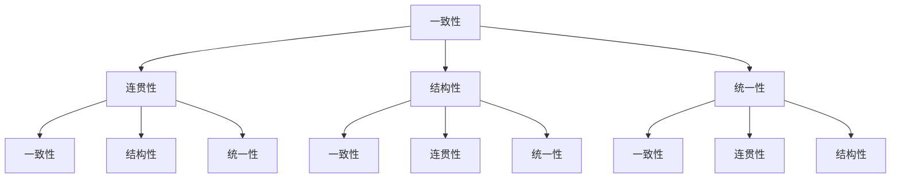

                 

### 1.1 数学整体性的概念

数学整体性（Mathematical Integrality）是指数学作为一个系统的内部统一性和连贯性，它体现了数学各分支之间的相互联系与相互作用。数学整体性不仅包括数学理论的连贯性和一致性，还涵盖了数学方法、工具和应用领域的综合特性。

**背景介绍**：
数学整体性的概念起源于20世纪数学哲学的研究。随着数学学科的日益扩展和复杂化，数学家们逐渐认识到，数学并非是孤立的分支，而是相互联系、相互支持的一个整体。数学的整体性思想在数学发展的过程中得到了不断的验证和丰富。

**核心概念与联系**：
数学整体性的核心概念包括：

1. **一致性**：数学理论内部逻辑的一致性，即不存在矛盾。
2. **连贯性**：不同数学分支之间的联系与协调。
3. **结构性**：数学系统的内在结构，即数学概念、理论和应用的层次关系。
4. **统一性**：数学各分支的统一性，如在分析、代数、几何和拓扑等领域的统一描述。

这些概念之间的关系可以用Mermaid流程图来表示：

**数学整体性的重要性**：
数学整体性对于数学研究具有重要意义。它不仅有助于揭示数学内部的统一规律，还能够推动数学理论的发展和创新。数学整体性思想使得数学家能够从整体上把握数学问题，提高数学解决问题的能力。

**数学整体性的研究意义**：
研究数学整体性有助于：

1. **深化数学理论**：通过分析数学整体性，可以更深入地理解数学的基本原理和核心概念。
2. **促进跨领域交流**：数学整体性为不同数学分支之间的交流提供了理论支持，有助于解决复杂问题。
3. **指导数学教育**：数学整体性思想可以指导数学教育，培养学生的整体思维能力和创新能力。

在数学整体性思想的指导下，数学家们能够更好地探索数学的未知领域，推动数学科学的发展。通过逐步分析数学整体性的概念、重要性及其研究意义，我们可以更加清晰地认识到数学整体性的价值，为未来的数学研究奠定坚实的基础。

### 1.2 反还原主义概述

**反还原主义**（Antireductionism）是一种哲学思想，主张复杂系统不能简单地还原为其组成部分或基本原理的总和。这一概念在科学哲学、数学哲学以及认知科学等领域有着广泛的应用。反还原主义的核心思想是，系统的整体性质不能仅通过其组成部分的性质来完全理解和解释。

**历史背景**：
反还原主义的理念可以追溯到20世纪早期。物理学家如尼尔斯·玻尔（Niels Bohr）和爱因斯坦（Albert Einstein）等人的思想对反还原主义的发展产生了重要影响。在数学哲学中，赫尔曼·魏尔（Hermann Weyl）和汉斯·贝特（Hans Bethe）等人的工作也促进了这一概念的形成。20世纪后半叶，随着系统科学和复杂性理论的兴起，反还原主义得到了更广泛的认可。

**核心思想**：
反还原主义主张，复杂系统的整体性质往往超越了其组成部分的简单叠加。例如，一个生物体的行为不能仅仅通过其细胞或器官的属性来解释，因为生物体具有自组织能力和整体性。同样，在物理学中，量子现象的整体性质（如量子纠缠）不能简单地通过量子粒子的基本属性来描述。

**反还原主义与还原主义的区别**：
还原主义认为，复杂现象可以通过分解为基本组成部分来理解。例如，通过分析分子和原子的性质来理解化学反应。然而，反还原主义认为，这种方法在处理复杂系统时可能是不充分的。复杂系统的整体性质需要特别的关注和解释。

**反还原主义的应用**：
在科学哲学中，反还原主义挑战了科学方法论的一些基本假设，促进了科学理论的多样性。在数学哲学中，反还原主义提出了对数学模型和证明方法的重新审视，强调了数学系统内部的复杂性和整体性。

**反还原主义在数学中的应用**：
在数学中，反还原主义的思想体现在对整体性、一致性和结构性的重视。例如，数学的整体性观点强调，数学各个分支之间存在深刻的联系，而不仅仅是各个独立部分的简单组合。此外，反还原主义还影响到数学教育，倡导一种更加综合和整体化的教学方法。

**反还原主义的重要性**：
反还原主义的重要性在于，它提醒我们在研究复杂系统时不能仅依赖还原主义的方法。复杂系统的整体性、自组织能力和内在规律需要特别的关注和研究。反还原主义为我们提供了一种新的思考方式，帮助我们更好地理解复杂系统的本质。

通过以上对反还原主义的历史背景、核心思想、区别、应用及其重要性的分析，我们可以更加深入地理解反还原主义的哲学内涵和其在数学中的具体体现。接下来，我们将进一步探讨数学整体性与反还原主义之间的关系，以揭示它们如何共同丰富我们的数学观和研究方法。

### 1.3 数学整体性与反还原主义的关系

数学整体性与反还原主义之间的关系是一个值得深入探讨的话题。这两者在数学研究中都发挥着重要作用，共同构建了对数学更为全面和深刻的理解。

**数学整体性如何体现反还原主义**：

首先，数学整体性强调数学内部各分支之间的紧密联系。这种联系体现了反还原主义的核心思想，即复杂系统的整体性质不能仅仅通过其组成部分的性质来解释。例如，在数学的代数和分析分支之间，尽管它们使用的工具和方法不同，但它们的基本概念和原理往往是相互关联的。这种整体性打破了还原主义的局限，使我们能够从更高层次上理解数学系统。

其次，数学整体性中的“一致性”和“结构性”概念也反映了反还原主义的理念。数学的整体性要求我们在构建数学理论时，必须保持逻辑的一致性，并认识到不同数学分支之间的内在结构。这种一致性确保了数学理论的完整性和连贯性，从而使得反还原主义在数学研究中具有实际意义。

**反还原主义如何丰富数学整体性**：

反还原主义通过强调数学系统内部的复杂性，丰富了数学整体性的内涵。例如，在数学的某些领域，如量子数学和复杂数学模型中，反还原主义提出了新的研究视角和方法。这些新方法不仅帮助我们更深入地理解数学系统的本质，还促进了数学整体性的发展。

此外，反还原主义还推动了数学教育的革新。传统的数学教育往往强调对基本概念和公式的记忆和应用，而反还原主义则提倡一种更加综合和整体化的教学方法。这种方法鼓励学生从整体上理解数学概念，培养他们的整体思维能力和创新能力，从而丰富了数学整体性的教育实践。

**数学整体性与反还原主义的相互促进**：

数学整体性和反还原主义之间的相互促进体现在多个方面。首先，数学整体性为反还原主义提供了理论支持。通过认识到数学内部各分支之间的紧密联系，我们能够更好地理解和解释反还原主义所强调的整体性质。

其次，反还原主义为数学整体性提供了新的研究方法和视角。例如，在数学的整体性研究中，反还原主义的思想促使我们重新审视数学模型和证明方法，寻找更加符合整体性原则的数学理论。这种新视角不仅丰富了数学整体性的理论内容，还推动了数学整体性研究的进一步发展。

总之，数学整体性与反还原主义之间的关系是相辅相成的。数学整体性为反还原主义提供了理论基础，而反还原主义则丰富了数学整体性的内涵。通过这种相互促进的关系，数学研究能够更加全面和深入地揭示数学系统的本质和规律。在接下来的章节中，我们将进一步探讨数学整体性和反还原主义在数学研究中的应用和具体实例，以更全面地理解这两者的价值和意义。

### 2.1 数的概念与性质

**数的概念**是数学中最基础和核心的部分。它不仅涉及自然数的概念，还扩展到整数、有理数、无理数和复数等更复杂的数系。数的概念贯穿于数学的各个分支，是数学研究的基础。

**自然数**是最简单的数系，包括从1开始的正整数。自然数用于计数和排序，是数学中最重要的概念之一。自然数具有如下性质：

1. **可加性**：任何两个自然数相加得到一个新的自然数。
2. **传递性**：如果a和b是自然数，那么a + b和b + c也是自然数。
3. **最小值**：自然数集合中有一个最小的元素，即1。

**整数**包括自然数、0和它们的相反数。整数用于表示负的计数和债务。整数具有如下性质：

1. **加法**：整数加法满足交换律和结合律。
2. **减法**：整数减法是加法的逆运算。
3. **乘法**：整数乘法满足交换律和结合律，零乘任何数都为零。

**有理数**是可以表示为两个整数比（分数）的数，包括整数和分数。有理数用于表示可以精确计量的量，例如长度、面积和体积。有理数具有如下性质：

1. **加法和乘法**：有理数的加法和乘法满足交换律、结合律和分配律。
2. **分数形式**：任何有理数都可以表示为两个整数的比，即分数形式。

**无理数**是不能表示为两个整数比的数，如π和√2。无理数在数学中具有广泛的应用，如几何、物理和工程领域。无理数具有如下性质：

1. **不可表示性**：无理数不能表示为两个整数的比。
2. **连续性**：无理数在数轴上形成连续的分布。
3. **密度性**：在任意两个有理数之间总存在无穷多个无理数。

**复数**是由实部和虚部组成的数，形式为a + bi，其中a和b是实数，i是虚数单位，满足i² = -1。复数用于表示和分析复杂的数学问题和物理现象。复数具有如下性质：

1. **加法和乘法**：复数的加法和乘法满足交换律、结合律和分配律。
2. **模长**：复数的模长定义为其实部和虚部平方和的平方根，即|a + bi| = √(a² + b²)。
3. **共轭复数**：复数的共轭复数定义为改变虚部的符号，即共轭复数z = a - bi。

**数的性质在数学中的应用**：

数的性质在数学中有着广泛的应用。例如，自然数的可加性和传递性使得我们可以定义数学中的计数和排序问题；整数的运算性质使得我们可以处理负数和债务问题；有理数的分数形式使得我们可以处理可以精确计量的量；无理数的不可表示性和连续性使得我们可以处理几何和物理中的非精确量；复数的加法和乘法性质使得我们可以处理复杂的数学和物理问题。

通过以上对数的概念和性质的详细分析，我们可以更深入地理解数在数学中的地位和作用。接下来，我们将进一步探讨代数结构的基本概念及其重要性。

### 2.2 代数结构

代数结构是数学中一个核心的概念，它定义了一组对象及其运算规则。代数结构不仅提供了数学理论的基础，还在解决实际问题中发挥着重要作用。本节将详细介绍代数结构的基本概念、常见的代数结构及其性质。

**基本概念**：

代数结构由三个部分组成：一个集合、一组运算和一组运算规则。形式化地，一个代数结构可以表示为（S, +, *, O），其中S是集合，+和*是S上的二元运算，O是S上的运算规则。具体来说：

1. **集合S**：代数结构中的对象集合。
2. **二元运算**：在集合S上定义的两个元素之间的运算，通常表示为函数f: S × S → S。常见的二元运算包括加法、乘法等。
3. **运算规则**：对运算的约束条件，如封闭性、结合律、交换律、分配律等。

**常见的代数结构**：

1. **群（Group）**：
   - **定义**：一个群是一个代数结构（G, *），其中G是一个非空集合，*是G上的二元运算，满足以下性质：
     - **封闭性**：对于所有a, b ∈ G，有a * b ∈ G。
     - **结合律**：对于所有a, b, c ∈ G，有(a * b) * c = a * (b * c)。
     - **单位元**：存在一个元素e ∈ G，使得对于所有a ∈ G，有e * a = a * e = a。
     - **逆元**：对于每个a ∈ G，存在一个元素b ∈ G，使得a * b = b * a = e。
   - **例子**：整数加法构成一个群（Z, +），乘法构成一个群（Z*, *）。

2. **环（Ring）**：
   - **定义**：一个环是一个代数结构（R, +, *），其中R是一个非空集合，+和*是R上的二元运算，满足以下性质：
     - **加法封闭性和结合律**：类似于群。
     - **乘法封闭性和结合律**：类似于群。
     - **分配律**：对于所有a, b, c ∈ R，有a * (b + c) = a * b + a * c 和 (a + b) * c = a * c + b * c。
   - **例子**：整数加法和乘法构成一个环（Z, +, *），有理数加法和乘法构成一个环（Q, +, *）。

3. **域（Field）**：
   - **定义**：一个域是一个环（F, +, *），其中F是一个非空集合，+和*是F上的二元运算，满足以下性质：
     - **环的性质**：类似于环。
     - **乘法单位元**：存在一个元素1 ∈ F，使得对于所有a ∈ F，有1 * a = a * 1 = a。
     - **乘法的可逆性**：对于所有非零元素a ∈ F，存在一个元素b ∈ F，使得a * b = b * a = 1。
   - **例子**：有理数加法和乘法构成一个域（Q, +, *），实数加法和乘法构成一个域（R, +, *），复数加法和乘法构成一个域（C, +, *）。

**代数结构的性质**：

代数结构的性质主要包括封闭性、结合律、交换律、分配律、单位元和逆元等。这些性质确保了代数结构中的运算具有一致性和可预测性。例如，群的性质保证了我们可以进行重复的运算而不改变结果，环和域的性质则进一步保证了我们在运算过程中的灵活性和多样性。

**代数结构在数学中的应用**：

代数结构在数学的各个领域有着广泛的应用。例如：

1. **数论**：群、环和域的概念在数论中用于研究整数的性质和关系。
2. **线性代数**：线性空间（向量空间）是群和环的结合，用于研究线性方程组、矩阵和变换。
3. **拓扑学**：拓扑群、拓扑环和拓扑域是拓扑学和代数结构结合的产物，用于研究空间和几何性质。
4. **抽象代数**：代数结构是抽象代数研究的核心，用于探索数学对象的内部结构和性质。

通过以上对代数结构的基本概念、常见代数结构和性质及其在数学中的应用的详细讨论，我们可以更好地理解代数结构在数学中的地位和作用。接下来，我们将继续探讨几何基础，了解几何的基本概念和原理。

### 2.3 几何基础

几何学是数学的一个重要分支，主要研究形状、大小、位置以及它们之间的相互关系。几何基础涵盖了从基本的几何概念到更复杂的几何理论。在本节中，我们将详细介绍几何的基本概念、几何的基本原理以及几何在实际应用中的重要性。

**基本概念**：

1. **点**：几何学中的基本元素，没有大小、形状或位置，仅表示一个位置。
2. **线**：无限延长的直线，由无数个点组成。
3. **线段**：直线上两点之间的部分，具有固定的长度。
4. **面**：由无数条线组成，可以看作是平面的拓展。
5. **多边形**：由多条线段组成的闭合图形，例如三角形、正方形和五边形。
6. **圆**：平面内到定点的距离等于定长的点的集合。

**几何的基本原理**：

1. **欧几里得几何**：基于欧几里得《几何原本》中的公理和定理，研究平面和空间中的形状和大小。欧几里得几何的主要定理包括：
   - **平行线定理**：通过同一点且不在同一直线上的两条直线是平行的。
   - **勾股定理**：直角三角形的两条直角边的平方和等于斜边的平方。
   - **相似三角形定理**：如果两个三角形的对应角度相等，则它们是相似的。

2. **非欧几何**：由黎曼（Bernhard Riemann）和罗巴切夫斯基（Nikolai Lobachevsky）等人发展的一种几何理论，研究在非欧几里得空间中的形状和大小。非欧几何的基本原理包括：
   - **黎曼几何**：研究曲率不为零的空间，如地球表面。
   - **洛巴切夫斯基几何**：研究负曲率的空间，如双曲空间。

3. **拓扑几何**：结合了拓扑学和几何学的理论，研究空间的可变形性和不变量。拓扑几何的基本原理包括：
   - **同调性**：研究空间的连通性和洞的数量。
   - **同伦性**：研究空间的连续变形。

**几何在实际应用中的重要性**：

几何学在科学、工程和日常生活中有着广泛的应用。

1. **科学应用**：
   - **物理学**：几何学用于描述和解释物体的运动和相互作用，如牛顿力学中的空间和时间的概念。
   - **天文学**：几何学用于研究星体的形状、大小和运动轨迹。
   - **生物学**：几何学用于研究生物体的形态和结构。

2. **工程应用**：
   - **建筑学**：几何学用于设计建筑物的结构，确保其稳定性、美观和实用性。
   - **土木工程**：几何学用于测量土地、设计道路和桥梁。
   - **机械工程**：几何学用于设计和制造各种机械部件。

3. **日常应用**：
   - **测量和绘图**：几何学用于测量物体的尺寸和位置，绘制平面图和三维模型。
   - **艺术和设计**：几何学在艺术创作和设计中用于构建对称和平衡。
   - **生活空间规划**：几何学用于设计和优化居住空间。

通过以上对几何基本概念、基本原理及其在实际应用中的重要性的详细讨论，我们可以更好地理解几何在数学中的地位和作用。几何不仅是一门理论学科，更是一门具有广泛应用价值的实用学科。在接下来的章节中，我们将进一步探讨概率论的基础，了解概率的基本概念和性质。

### 2.4 概率论基础

概率论是数学的一个分支，主要研究随机现象的规律性。它不仅为概率问题的解决提供了理论框架，还在许多领域如统计学、经济学、物理学和计算机科学中发挥着重要作用。本节将详细介绍概率的基本概念、概率分布及其性质和随机变量的性质与应用。

**基本概念**：

1. **概率**：
   - **定义**：概率是描述随机事件发生可能性的量，通常用0到1之间的实数表示。概率值越接近1，事件发生的可能性越大；越接近0，事件发生的可能性越小。
   - **概率的基本性质**：
     - **非负性**：任何事件的概率都不小于0，即P(A) ≥ 0。
     - **规范性**：不可能事件的概率为0，即P(∅) = 0。
     - **确定性**：必然事件的概率为1，即P(S) = 1，其中S表示样本空间。

2. **随机实验**：
   - **定义**：随机实验是在相同条件下可能产生不同结果的过程。
   - **样本空间**：随机实验所有可能结果的集合，通常表示为S。

3. **事件**：
   - **定义**：事件是样本空间的一个子集，表示一组可能发生的结果。
   - **基本事件**：样本空间中的单个结果。

4. **条件概率**：
   - **定义**：在事件B已发生的条件下，事件A发生的概率称为条件概率，表示为P(A|B)。
   - **性质**：条件概率满足概率的基本性质，即0 ≤ P(A|B) ≤ 1。

**概率分布**：

概率分布描述了随机变量取不同值的概率分布情况。常见的概率分布包括：

1. **离散概率分布**：
   - **伯努利分布**：描述一次伯努利试验成功的概率。
   - **二项分布**：描述n次伯努利试验中成功次数的概率分布。
   - **几何分布**：描述第k次伯努利试验成功的概率分布。

2. **连续概率分布**：
   - **均匀分布**：在某个区间上所有数值出现的概率相同。
   - **正态分布**：最常见且应用广泛的概率分布，描述连续随机变量在某个区间上的概率分布。

**概率分布的性质**：

1. **概率分布函数（CDF）**：描述随机变量取值小于或等于某个值的概率。
   - **定义**：F(x) = P(X ≤ x)，其中X是随机变量。
   - **性质**：0 ≤ F(x) ≤ 1，且F(x)是单调递增的。

2. **概率密度函数（PDF）**：描述随机变量取值在某个区间上的概率密度。
   - **定义**：f(x) = dF(x)/dx，其中F(x)是CDF。
   - **性质**：f(x) ≥ 0，且∫f(x)dx = 1。

**随机变量的性质与应用**：

1. **离散随机变量**：
   - **期望值**：离散随机变量取值的加权平均数，表示为E(X)。
   - **方差**：描述离散随机变量取值分散程度的量，表示为Var(X)。
   - **应用**：用于统计分析和概率计算，如估计总体参数、决策分析等。

2. **连续随机变量**：
   - **期望值**：连续随机变量的加权平均数，表示为E(X)。
   - **方差**：描述连续随机变量取值分散程度的量，表示为Var(X)。
   - **应用**：在统计学、物理学和工程学等领域广泛使用，如概率密度函数、正态分布的应用等。

通过以上对概率论基本概念、概率分布及其性质以及随机变量性质与应用的详细分析，我们可以更好地理解概率论在数学中的重要性及其在实际应用中的作用。概率论不仅为解决随机问题提供了理论支持，还为我们理解和分析复杂系统提供了有力工具。

### 3.1 整体性的定义与特点

数学整体性是指数学作为一个系统，其内部各分支、概念、方法和应用之间的相互联系和统一性。数学整体性不仅体现了数学理论的一致性和连贯性，还揭示了数学系统内部的复杂性和多样性。

**定义**：

数学整体性可以定义为：数学系统内部各部分之间通过逻辑关系和相互依赖性形成的一个有机整体。这个整体不仅包括数学理论的基本概念和原理，还包括数学方法和应用，以及数学与其他学科之间的交叉融合。

**特点**：

1. **一致性**：数学整体性强调数学理论内部的一致性和连贯性。这意味着在数学系统中，不存在逻辑上的矛盾和冲突。例如，数学的基本公理和定理构成了一个逻辑自洽的整体。

2. **层次性**：数学整体性体现了数学系统的层次结构。数学可以从基础概念（如自然数、集合、函数）逐渐扩展到更复杂的理论（如代数结构、拓扑结构、微积分、泛函分析）。每个层次的理论都在前一层次的基础上进行拓展和深化。

3. **连贯性**：数学整体性强调不同数学分支之间的联系和相互依赖。例如，代数和分析之间的联系，几何和拓扑之间的联系，这些联系使得数学成为了一个相互贯通的整体。

4. **结构性**：数学整体性反映了数学系统内部的内在结构和组织。数学概念和理论之间的联系和相互作用，构成了一个高度结构化的系统，使得数学能够有效地解决问题。

5. **综合性**：数学整体性不仅体现在数学内部，还体现在数学与其他学科的结合。例如，数学与物理学、计算机科学、生物学等领域的交叉融合，形成了新的数学应用和理论，丰富了数学整体性的内涵。

**整体性在数学发展中的作用**：

数学整体性在数学发展的过程中发挥了关键作用。首先，它为数学理论的建设提供了坚实的基础。通过强调数学内部的一致性和连贯性，数学整体性确保了数学理论的自洽性和有效性。

其次，数学整体性促进了数学理论的创新和拓展。数学家们通过探索不同数学分支之间的联系，发现了新的数学理论和方法。例如，代数几何、微分几何、量子数学等新领域的诞生，都源于数学整体性的启发。

最后，数学整体性为数学教育提供了指导。通过培养学生的整体思维能力和综合素养，数学整体性有助于学生更好地理解和掌握数学知识，提高他们的数学应用能力和创新能力。

总之，数学整体性是数学发展的重要特征，它不仅反映了数学系统的内在统一性，还为数学理论的建设、创新和教学提供了重要支撑。理解数学整体性有助于我们更全面地认识数学的本质，推动数学科学的不断进步。

### 3.2 数学整体性的体现

数学整体性的体现可以通过数学各分支之间的相互联系和作用来说明。这种联系不仅展示了数学内部的一致性和连贯性，还揭示了数学系统在解决问题和理论拓展中的协同效应。

**数学各分支之间的联系**：

1. **代数与分析的联系**：
   - **线性代数**与**微积分**的结合：线性代数中的线性空间概念与微积分中的微分方程密切相关。线性代数提供了解线性方程组的方法，而微积分则研究了线性变换在微分方程中的应用。
   - **复变函数**与**解析几何**的结合：复变函数中的解析函数概念与解析几何中的曲线和曲面密切相关。解析几何提供了研究复变函数图像的工具，而复变函数则扩展了解析几何的范畴。

2. **几何与拓扑的联系**：
   - **微分几何**与**拓扑学**的结合：微分几何研究光滑几何结构，如曲面和流形。拓扑学则研究空间的可变形性和不变量，如同调性和同伦性。两者结合为研究复杂几何结构提供了新的视角和方法。
   - **代数拓扑**与**几何学**的结合：代数拓扑通过代数结构（如群、环和域）来研究拓扑空间，提供了分析几何问题的代数工具。代数拓扑的方法广泛应用于几何问题的解决，如高斯曲率和庞加莱猜想。

3. **概率与统计的联系**：
   - **概率论**与**统计学**的结合：概率论提供了描述随机现象的理论基础，而统计学则通过收集和分析数据来应用概率论。概率论与统计学相互依赖，共同推动了数据科学和决策分析的发展。

**数学整体性在数学发展中的应用**：

1. **整合性研究**：
   - **数学物理**：数学物理结合了数学和物理的方法，研究物理现象的数学描述和理论模型。如量子数学中的复变函数和泛函分析，为量子力学提供了强有力的数学工具。
   - **计算数学**：计算数学结合了数学理论、数值分析和计算机科学，开发高效的数学算法和计算工具。如数值积分、数值求解微分方程等，广泛应用于科学计算和工程问题。

2. **跨学科应用**：
   - **生物数学**：生物数学结合数学模型和计算方法，研究生物系统的动态行为和演化规律。如人口动力学模型、遗传算法和神经网络等，为生物科学提供了新的研究方法。
   - **金融数学**：金融数学结合概率论、统计学和随机过程，研究金融市场和金融产品的定价、风险管理和决策分析。如黑-舍尔斯-罗斯模型、蒙特卡罗模拟和期权定价公式等。

3. **理论拓展**：
   - **代数几何**：代数几何通过研究代数方程的几何解，扩展了传统的几何学。如韦伊猜想和多复变函数论，为代数几何的发展提供了新的方向。
   - **泛函分析**：泛函分析研究函数空间和线性算子，为函数分析和微分方程提供了新的理论框架。如希尔伯特空间和勒贝格积分，为解决复杂数学问题提供了强有力的工具。

**数学整体性的未来趋势**：

随着数学理论和应用领域的不断扩展，数学整体性的未来趋势可能包括：

1. **融合与交叉**：数学与其他学科的融合将进一步深化，如数学与生物学、物理学、计算机科学和人工智能的结合，将推动数学理论的发展和应用。
2. **复杂性研究**：数学整体性将更加注重复杂系统的数学描述和建模，如复杂网络、非线性动力学和随机过程等，为理解复杂现象提供新的理论和方法。
3. **计算工具的发展**：随着计算技术的进步，数学整体性将更加依赖高效的计算方法和工具，如并行计算、机器学习和大数据分析，为数学研究提供更强大的计算能力。

总之，数学整体性的体现不仅反映了数学内部的统一性和连贯性，还展示了数学系统在解决问题和理论拓展中的协同效应。通过数学各分支之间的相互联系和应用，数学整体性为数学科学的发展提供了坚实的基础和广阔的前景。

### 3.3 数学整体性在数学发展中的作用

数学整体性在数学发展中扮演着至关重要的角色。它不仅推动了数学理论的创新和拓展，还为数学问题的解决提供了新的方法和视角。以下从数学理论建设、数学方法创新和数学教育三个方面探讨数学整体性在数学发展中的作用。

**1. 数学理论建设**：

数学整体性为数学理论的建设提供了坚实的基础。通过强调数学内部的一致性和连贯性，数学整体性确保了数学理论的自洽性和有效性。数学整体性的理念使得数学家能够从全局视角来构建和验证数学理论，避免了逻辑上的矛盾和错误。

例如，在数论研究中，数学整体性理念推动了欧拉猜想和费马最后定理的证明。数学家安德鲁·怀尔斯（Andrew Wiles）通过整合代数几何和数论的理论，最终证明了费马最后定理。这一成果展示了数学整体性在数学理论建设中的重要作用。

**2. 数学方法创新**：

数学整体性促进了数学方法的创新。数学各分支之间的紧密联系和相互依赖，使得数学家能够在不同领域之间进行跨学科研究，从而发现新的数学方法。例如，微分几何和拓扑学的结合，产生了流形理论，为研究复杂几何结构提供了新的工具。流形理论在广义相对论和天体物理学中得到了广泛应用。

另一个例子是概率论和统计学的结合，形成了随机过程理论。随机过程理论为解决随机性问题提供了强有力的方法，如金融市场的波动、生物种群动态等。通过数学整体性的引导，数学方法不断创新，为解决复杂问题提供了新的思路。

**3. 数学教育**：

数学整体性对数学教育有着深远的影响。它促使数学教育者从整体视角来设计课程和教学方法，培养学生的整体思维能力和创新能力。数学整体性理念强调数学内部各分支之间的联系，使学生在学习过程中能够更好地理解和掌握数学知识。

例如，在中学数学教育中，教师可以通过整合代数、几何和概率论的教学内容，使学生更好地理解数学的整体结构。在大学数学教育中，教师可以引导学生从不同数学分支的交叉融合中寻找解决问题的方法，培养学生的综合素养。

数学整体性还促进了数学教育的改革。通过倡导探究性学习和项目式学习，数学教育者可以激发学生的学习兴趣和主动性，提高他们的数学应用能力和创新能力。数学整体性理念不仅有助于学生掌握数学知识，还为他们未来的学习和职业发展奠定了坚实基础。

**4. 数学整体性的具体应用**：

数学整体性的理念在数学的各个领域中得到了广泛应用。以下是一些具体的例子：

- **数论与代数**：通过整合数论和代数的理论，数学家研究了整数结构和代数方程的解。例如，椭圆曲线密码学就是基于椭圆曲线的代数性质，为信息安全提供了强有力的加密算法。

- **几何与拓扑**：几何和拓扑的结合产生了流形理论，该理论在理论物理、几何拓扑学和微分几何中得到了广泛应用。例如，广义相对论中的宇宙模型就是基于流形理论的几何描述。

- **概率论与统计**：概率论和统计学的结合形成了随机过程理论，该理论在金融数学、生物统计学和工程系统中得到了广泛应用。例如，蒙特卡罗模拟是一种基于随机过程理论的计算方法，被广泛应用于金融风险评估和工程仿真。

**5. 数学整体性的未来趋势**：

随着数学理论和应用领域的不断扩展，数学整体性的未来趋势可能包括：

- **跨学科融合**：数学整体性将进一步加强与其他学科的融合，如数学与物理、生物、计算机科学和人工智能的结合，推动数学科学的发展。

- **复杂性研究**：数学整体性将更加注重复杂系统的数学描述和建模，如复杂网络、非线性动力学和随机过程等，为理解复杂现象提供新的理论和方法。

- **计算方法的发展**：随着计算技术的进步，数学整体性将更加依赖高效的计算方法和工具，如并行计算、机器学习和大数据分析，为数学研究提供更强大的计算能力。

总之，数学整体性在数学发展中发挥着至关重要的作用。它不仅推动了数学理论的创新和拓展，还为数学问题的解决提供了新的方法和视角。通过数学整体性的引导，数学家能够更好地理解数学的本质，推动数学科学的不断进步。

### 4.1 反还原主义的历史背景

反还原主义（Antireductionism）作为一种哲学思想，其发展历程可以追溯到20世纪早期的科学哲学和数学哲学研究领域。反还原主义的核心思想是对还原主义的批判，主张复杂系统不能简单地通过其组成部分或基本原理来完全解释。这一思想在科学方法论、数学哲学以及认知科学等领域产生了深远影响。

**早期发展**：

1. **物理学的哲学探讨**：
   - **尼尔斯·玻尔（Niels Bohr）**：玻尔是量子力学的奠基人之一，他的互补原理提出了波粒二象性，认为微观粒子的行为不能用简单的还原方式来解释。玻尔的思想对反还原主义的发展产生了重要影响。
   - **阿尔伯特·爱因斯坦（Albert Einstein）**：爱因斯坦在相对论中提出了时空的相对性，强调物理现象的整体性。他的观点挑战了经典还原主义的观点，为反还原主义奠定了基础。

2. **生物学中的整体性观念**：
   - **奥托·海森堡（Otto Hense堡）**：海森堡在生物学研究中提出了“整体大于部分之和”的观点，认为生物体的行为不能简单地通过其组成部分的性质来解释。这一观念对反还原主义的发展具有重要意义。

**20世纪中叶的发展**：

1. **系统科学和复杂性理论的兴起**：
   - **赫尔曼·魏尔（Hermann Weyl）**：魏尔是20世纪著名的数学家，他在数学和物理学中提出了一些关于整体性和复杂性理论的观点，为反还原主义提供了理论支持。
   - **诺伯特·维纳（Norbert Wiener）**：维纳是控制论的创始人之一，他提出了“系统论”的概念，强调复杂系统的整体性和动态性。

2. **数学哲学中的反还原主义**：
   - **汉斯·贝特（Hans Bethe）**：贝特是著名的物理学家和数学家，他在数学哲学中提出了反还原主义的观点，主张数学理论的整体性。

**20世纪后半叶及以后的扩展**：

1. **认知科学中的反还原主义**：
   - **约翰·齐曼（John Ziman）**：齐曼在认知科学领域提出了“复杂性思维”的概念，认为人类思维不能简单地通过神经元的连接来解释，需要考虑整体性和复杂性。

2. **跨学科的反还原主义研究**：
   - **哲学、社会学和人类学**：反还原主义的思想在哲学、社会学和人类学等领域得到了广泛应用，为理解复杂社会现象提供了新的视角。

**历史意义**：

反还原主义的历史意义在于，它为科学研究提供了一种新的方法论，即关注复杂系统的整体性和动态性，而不是简单地还原为基本组成部分。这一思想挑战了传统的还原主义观点，促进了科学方法论和理论体系的多样化。反还原主义不仅对科学哲学和数学哲学产生了深远影响，还推动了跨学科研究的兴起，为理解复杂现象提供了新的思路。

通过以上对反还原主义的历史背景、早期发展、中后期扩展及其历史意义的讨论，我们可以更深入地理解反还原主义的哲学内涵和其在科学和数学中的重要性。接下来，我们将进一步探讨反还原主义的基本原理及其在数学中的应用。

### 4.2 反还原主义的基本原理

反还原主义（Antireductionism）的基本原理强调复杂系统不能简单地通过其组成部分或基本原理来完全解释。这一思想源于对传统还原主义方法论的批判，主张我们应该关注复杂系统的整体性和动态性。以下从几个方面详细探讨反还原主义的基本原理。

**整体性原理**：

整体性原理是反还原主义的核心原则之一，主张复杂系统的整体性质不能仅通过其组成部分的性质来解释。例如，一个生物体的行为不能仅仅通过分析其各个细胞的属性来理解，因为生物体的整体性、相互作用和自组织能力是至关重要的。

**非线性原理**：

非线性原理指出，复杂系统中的相互作用往往是非线性的，这意味着系统的整体行为不能简单地通过线性叠加各个部分的行为来预测。例如，在物理学中，量子纠缠现象展示了两个粒子之间即使相隔很远，也会保持某种特殊的联系，这种非线性相互作用不能通过简单的还原方式来解释。

**动态性原理**：

动态性原理强调，复杂系统的状态是随时间变化的，而且这种变化往往受到外部环境的影响。这意味着，为了理解复杂系统的行为，我们必须考虑其随时间的演化过程。例如，生态系统中的物种相互作用和种群动态是一个动态变化的过程，无法仅通过静态的分析来完全理解。

**自组织原理**：

自组织原理指出，复杂系统具有自组织能力，即系统内部可以通过相互作用和反馈机制实现有序结构的形成。这一原理强调了系统内部的自主性和复杂性。例如，在物理学中，沙堆的自发形成和自组织现象展示了系统内部的自组织能力。

**复杂性原理**：

复杂性原理认为，复杂系统具有多层次、多尺度的特性，不能简单地用单一的理论框架来解释。这意味着，为了理解复杂系统，我们需要采用多层次、多尺度的方法。例如，在经济学中，市场行为和宏观经济现象具有不同的时间和空间尺度，需要采用不同的理论和方法来研究。

**跨学科应用**：

反还原主义的基本原理在多个学科中得到了应用，如生物学、物理学、计算机科学和社会科学。以下是一些具体的例子：

1. **生物学**：
   - **生态系统**：反还原主义应用于生态系统中，强调了物种相互作用和生态系统的整体性。例如，通过分析食物网中的相互作用，可以更好地理解生态系统的稳定性和动态变化。
   - **生物进化**：反还原主义应用于生物进化理论，强调了种群动态和自然选择的整体性。例如，通过研究遗传变异和自然选择的过程，可以更好地理解物种的进化路径。

2. **物理学**：
   - **量子力学**：反还原主义应用于量子力学，强调了量子系统的整体性和非线性。例如，通过研究量子纠缠现象，可以更好地理解量子系统的特殊性质。
   - **混沌理论**：反还原主义应用于混沌理论，强调了系统内部的自组织和动态性。例如，通过研究混沌系统的初始条件和参数变化，可以更好地理解混沌现象的复杂性。

3. **计算机科学**：
   - **复杂系统模拟**：反还原主义应用于复杂系统模拟，强调了系统内部的整体性和非线性。例如，通过模拟社交网络中的信息传播，可以更好地理解网络效应和群体行为。
   - **人工智能**：反还原主义应用于人工智能，强调了机器学习模型的整体性和动态性。例如，通过研究神经网络中的权重调整和反馈机制，可以更好地理解机器学习的复杂过程。

总之，反还原主义的基本原理为理解复杂系统提供了新的视角和方法。通过强调整体性、非线性、动态性、自组织、复杂性和跨学科应用，反还原主义为科学研究提供了一种新的方法论，有助于我们更全面地认识复杂系统的本质。接下来，我们将进一步探讨反还原主义在数学中的应用。

### 4.3 反还原主义在数学中的应用

反还原主义作为一种哲学思想，不仅在科学方法论和认知科学中发挥了重要作用，在数学领域也有着广泛的应用。反还原主义强调数学的整体性和复杂性，主张不能简单地将数学问题分解为基本组成部分来解释。以下从数学模型、证明方法和数学教育三个方面详细探讨反还原主义在数学中的应用。

**1. 数学模型**：

反还原主义在数学模型中的应用体现在对复杂系统的整体性描述和建模。传统的数学模型往往依赖于还原主义方法，将复杂系统分解为简单的组成部分。然而，反还原主义提倡从整体视角出发，构建能够反映系统内部复杂性和相互作用的数学模型。

例如，在经济学中，反还原主义方法被用于构建宏观经济模型，如宏观经济学中的动态一般均衡模型（DGE）。DGE模型将经济系统的各个组成部分（如消费者、企业、政府等）作为一个整体进行建模，通过分析各个部分之间的相互作用和反馈机制，来理解整个经济系统的动态行为。这种整体性建模方法不同于传统的还原主义方法，能够更好地捕捉经济系统的复杂性和动态性。

**2. 证明方法**：

反还原主义在数学证明方法中的应用体现在对复杂数学理论的综合性证明策略。传统的数学证明方法往往依赖于逐步分解和简化的思路，通过逐步将复杂问题分解为基本组成部分来证明。然而，反还原主义提倡从整体视角出发，采用更综合和全局的证明策略。

例如，在代数几何中，反还原主义方法被用于证明一些著名的几何定理，如韦伊猜想。韦伊猜想是关于椭圆曲线的几何性质的猜想，其证明需要整合代数、几何和数论的理论。证明过程中，数学家采用了反还原主义的方法，将椭圆曲线的几何性质与数论中的基本性质结合起来，最终实现了对韦伊猜想的证明。这种综合性证明策略展示了反还原主义在数学证明中的重要作用。

**3. 数学教育**：

反还原主义在数学教育中的应用体现在对数学整体性和复杂性的教学策略。传统的数学教育往往侧重于基础知识的教学和技能的训练，强调对基本概念和公式的记忆和应用。然而，反还原主义提倡从整体视角出发，培养学生的整体思维能力和创新能力。

例如，在大学数学教育中，教师可以通过整合不同数学分支的教学内容，使学生更好地理解数学的整体结构。例如，在讲授线性代数时，可以结合微积分和概率论的知识，使学生从整体上理解线性空间、矩阵和变换的概念。此外，教师还可以通过设计跨学科的综合项目，如数学建模竞赛，鼓励学生从整体视角出发，运用数学方法解决实际问题。这种教学策略有助于培养学生的整体思维能力和创新能力。

**具体实例**：

1. **量子数学**：
   - **量子纠缠**：量子纠缠是量子力学中的一个基本现象，展示了量子系统之间的整体性和非局域性。反还原主义在量子数学中的应用体现在对量子纠缠现象的整体性描述和解释。例如，量子计算中的量子门和量子算法，通过整体性操作实现了对复杂问题的求解。

2. **复杂网络**：
   - **网络科学**：网络科学是研究复杂网络结构和动态行为的学科。反还原主义在网络科学中的应用体现在对网络整体性的分析，如网络拓扑结构、网络动力学和网络效应等。例如，通过分析社交网络中的相互作用和传播机制，可以更好地理解信息传播和群体行为。

3. **金融数学**：
   - **金融模型**：金融数学中的许多模型，如随机过程模型、蒙特卡罗模拟和期权定价模型，都依赖于整体性和复杂性。反还原主义在金融数学中的应用体现在对金融市场的整体性分析和风险管理。例如，通过分析金融市场的波动性和相关性，可以更好地预测市场走势和评估金融风险。

总之，反还原主义在数学中的应用展示了数学的整体性和复杂性。通过整合不同数学分支的理论和方法，反还原主义为数学研究提供了一种新的视角和方法，有助于我们更全面地认识数学的本质和解决复杂问题。接下来，我们将进一步探讨数学整体性与反还原主义的联系，揭示它们在数学研究中的协同作用。

### 5.1 数学整体性如何体现反还原主义

数学整体性（Mathematical Integrality）在反还原主义（Antireductionism）中得到了深刻的体现。反还原主义主张复杂系统的整体性质不能仅仅通过其组成部分的性质来解释，而数学整体性强调数学内部各分支之间的联系与统一性，为反还原主义提供了坚实的理论支持。以下从几个方面详细探讨数学整体性如何体现反还原主义。

**1. 系统的整体性**：

数学整体性体现了数学作为一个系统的整体性。在数学系统中，各分支如代数、分析、几何和拓扑等不是孤立的，而是相互联系、相互支持的。这种整体性确保了数学理论的连贯性和一致性，使得数学系统具有内在的自洽性和稳定性。

反还原主义强调系统整体性，认为复杂系统的行为和性质不能仅仅通过其组成部分的简单叠加来理解。在数学中，整体性原理体现了这一思想。例如，在代数几何中，通过整合代数和几何的理论，可以更好地理解椭圆曲线和代数曲线的几何性质，这展示了数学整体性如何体现反还原主义。

**2. 理论的连贯性**：

数学整体性强调数学理论的连贯性，即数学内部各分支之间的逻辑关系和相互依赖性。这种连贯性使得数学能够作为一个有机整体不断发展，而不是孤立的部分。

反还原主义也强调理论的连贯性，主张复杂系统的解释需要考虑各部分之间的相互作用。在数学中，这一思想体现在对数学理论的一致性和连贯性要求上。例如，在微积分和线性代数的结合中，微积分提供了连续性和变化率的概念，而线性代数提供了空间和变换的工具，两者结合构成了现代数学分析的基础，体现了数学整体性如何体现反还原主义。

**3. 结构的统一性**：

数学整体性体现了数学系统内部的统一性。在数学中，不同的数学分支如数论、几何、拓扑和代数等，虽然在研究对象和方法上有所不同，但它们之间存在着深刻的内在联系和统一性。

反还原主义强调结构的统一性，主张复杂系统的整体性质需要通过统一的视角来理解。在数学中，这一思想体现在对数学结构的整体性研究和统一描述。例如，在微分几何和拓扑学的结合中，通过研究流形上的微分结构和拓扑性质，可以更好地理解空间和几何的统一性，这展示了数学整体性如何体现反还原主义。

**4. 方法论的综合性**：

数学整体性强调不同数学方法之间的互补性。在解决复杂问题时，数学家往往需要综合运用不同的数学方法，如代数方法、几何方法和概率方法等。

反还原主义主张在研究复杂系统时，需要采用综合性的方法论。在数学中，这一思想体现在跨学科的方法论应用。例如，在计算几何中，通过结合代数几何和概率论的方法，可以更好地解决几何优化问题和随机几何问题，这展示了数学整体性如何体现反还原主义。

**具体实例**：

1. **代数几何与拓扑学**：
   - **代数几何**：代数几何研究代数方程的几何解，涉及代数结构和几何性质。通过结合拓扑学的工具，如同伦性和同调性，可以更好地理解代数几何中的复杂结构。这一结合展示了数学整体性如何体现反还原主义。
   - **拓扑学**：拓扑学研究空间的性质和变换，通过代数方法（如群和环）来描述和分析拓扑结构。这种结合不仅丰富了代数几何的理论，还展示了数学整体性在反还原主义中的应用。

2. **概率论与统计**：
   - **概率论**：概率论研究随机现象的规律性，通过概率分布和随机变量来描述不确定性。概率论中的许多理论和方法（如大数定律和中心极限定理）展示了数学整体性在反还原主义中的体现。
   - **统计学**：统计学通过收集和分析数据，应用概率论的理论和方法来推断总体特征。统计学的应用展示了数学整体性如何通过综合概率论的理论和方法来解决实际问题。

总之，数学整体性通过体现系统整体性、理论的连贯性、结构的统一性和方法论的综合性，为反还原主义提供了坚实的理论基础。通过整合不同数学分支的理论和方法，数学整体性不仅丰富了数学科学的内容，还展示了反还原主义在数学研究中的重要性。在接下来的部分，我们将进一步探讨反还原主义如何丰富数学整体性，揭示它们之间的相互关系。

### 5.2 反还原主义如何丰富数学整体性

反还原主义（Antireductionism）在数学整体性（Mathematical Integrality）中扮演了重要的角色，通过强调数学系统内部的复杂性和整体性，丰富了数学的整体性概念。以下从理论拓展、方法创新和跨学科融合三个方面详细探讨反还原主义如何丰富数学整体性。

**1. 理论拓展**：

反还原主义推动了数学理论的拓展，使得数学整体性更加丰富和多样化。传统的数学理论往往侧重于对简单系统的还原和分解，而反还原主义则强调对复杂系统的整体性理解和理论拓展。

例如，在代数几何中，反还原主义促使数学家研究更加复杂的代数曲线和代数簇，这些对象无法简单地通过其组成部分来解释。通过引入新的概念和工具，如同调代数和交调代数，反还原主义丰富了代数几何的理论，使得数学整体性得以拓展。

**2. 方法创新**：

反还原主义推动了数学方法的创新，为解决复杂问题提供了新的视角和工具。在传统数学中，许多问题通过还原主义方法难以解决，但反还原主义提供了一种新的方法论，使得这些复杂问题得以解决。

例如，在微分几何中，反还原主义方法被用于研究流形上的非线性问题，如广义相对论中的时空几何。通过引入几何流、联络和曲率张量等概念，反还原主义提供了一种新的描述和解决复杂几何问题的方法，丰富了数学整体性。

**3. 跨学科融合**：

反还原主义促进了数学与其他学科的交叉融合，推动了数学整体性的发展。通过跨学科的研究，数学不仅可以从其他学科中获取灵感，还可以为其他学科提供强有力的数学工具。

例如，在量子数学中，反还原主义方法被用于研究量子系统和量子场论。量子纠缠现象展示了反还原主义的核心思想，即量子系统的整体性质不能仅通过其组成部分来解释。通过结合量子力学和代数几何的方法，反还原主义为量子数学提供了新的理论框架，丰富了数学整体性。

**具体实例**：

1. **数学物理**：
   - **量子场论**：量子场论是研究基本粒子和相互作用的理论，其核心概念如量子纠缠和量子场，展示了反还原主义在数学整体性中的体现。通过引入反还原主义的思想，数学家能够更好地理解和解释量子场论中的复杂现象。
   - **广义相对论**：广义相对论是研究重力及其影响的理论，其基本方程如爱因斯坦场方程，也体现了反还原主义的整体性思想。通过整合几何和物理的理论，广义相对论为数学整体性提供了新的理论和应用。

2. **计算数学**：
   - **复杂网络分析**：复杂网络分析是研究复杂系统结构和动态行为的学科，其方法包括图论、随机过程和机器学习等。通过引入反还原主义的思想，数学家能够更好地理解复杂网络中的相互作用和演化规律，丰富了数学整体性。

3. **生物学**：
   - **生物数学**：生物数学是研究生物系统数学模型和计算方法的学科，其方法包括概率论、统计和微分方程等。通过引入反还原主义的思想，数学家能够更好地理解和解释生物系统的复杂性和动态性，为生物学提供了新的数学工具。

总之，反还原主义通过理论拓展、方法创新和跨学科融合，丰富了数学整体性的内涵。它不仅推动了数学理论的发展和创新，还促进了数学与其他学科的交叉融合，使得数学整体性得以不断拓展和深化。在数学整体性的框架下，反还原主义为数学科学提供了新的视角和方法，推动了数学科学的进步。

### 5.3 数学整体性与反还原主义的相互促进

数学整体性（Mathematical Integrality）与反还原主义（Antireductionism）之间的关系是相辅相成的，它们在数学研究中相互促进，共同推动了数学科学的进步。以下从理论支持、研究方法和创新视角三个方面详细探讨数学整体性与反还原主义的相互促进。

**1. 理论支持**：

数学整体性为反还原主义提供了坚实的理论基础。数学整体性强调数学内部各分支之间的相互联系和统一性，这为反还原主义提供了理论依据。反还原主义主张复杂系统的整体性质不能简单地通过其组成部分来解释，而数学整体性确保了数学系统的一致性和连贯性，使得反还原主义的思想在数学中得以实现。

例如，在代数几何中，数学整体性确保了代数和几何之间的紧密联系，使得反还原主义能够应用于研究代数方程的几何解。通过数学整体性的支持，反还原主义能够更好地解释和探索代数几何中的复杂现象。

**2. 研究方法**：

反还原主义为数学整体性提供了新的研究方法。反还原主义强调系统整体性和非线性，这种方法论为数学整体性研究提供了新的视角和工具。数学家通过反还原主义的方法，能够更好地理解和解决复杂问题，推动数学整体性研究的发展。

例如，在微分几何中，反还原主义方法被用于研究流形上的复杂几何结构。通过引入整体性和非线性概念，数学家能够更深入地理解流形的几何性质，从而推动微分几何理论的发展。

**3. 创新视角**：

数学整体性与反还原主义的相互促进还体现在创新视角的提出。数学整体性提供了一个全面和系统的视角，而反还原主义则提供了对复杂系统的深入分析。这种相互促进的关系促使数学家在探索数学问题时，能够从多个角度进行思考和解决。

例如，在量子数学中，数学整体性和反还原主义共同推动了量子系统的整体性研究。通过整合代数几何和量子力学的理论，数学家能够提出新的量子数学模型，从而推动量子数学的发展。

**具体实例**：

1. **代数几何与拓扑学**：
   - **代数几何**：通过数学整体性的视角，代数几何研究了代数方程的几何解，形成了丰富的几何理论。反还原主义则为代数几何提供了新的研究方法，如同调代数和交调代数，使得代数几何能够更好地理解和解决复杂问题。
   - **拓扑学**：拓扑学通过研究空间的性质和变换，形成了系统的拓扑理论。反还原主义则为拓扑学提供了新的视角，如同伦性和同调性，使得拓扑学能够更好地探索复杂空间的性质。

2. **概率论与统计**：
   - **概率论**：概率论通过研究随机现象的规律性，形成了系统的概率理论。反还原主义则为概率论提供了新的方法，如随机过程和马尔可夫链，使得概率论能够更好地解决复杂问题。
   - **统计**：统计通过收集和分析数据，形成了系统的统计学理论。反还原主义则为统计学提供了新的视角，如贝叶斯理论和机器学习，使得统计学能够更好地处理复杂数据和复杂问题。

总之，数学整体性与反还原主义之间的相互促进，不仅为数学科学提供了新的理论和方法，还推动了数学整体性研究的不断深入和发展。通过相互支持，数学整体性和反还原主义共同推动了数学科学的进步，为人类认识和探索数学世界提供了强有力的工具。在接下来的部分，我们将进一步探讨数学整体性不可分割性的概念与重要性。

### 6.1 不可分割性的概念与重要性

数学整体性的不可分割性是指数学内部各部分之间的紧密联系和相互依赖性，这种联系使得数学系统中的各个部分无法独立存在或单独理解。不可分割性是数学整体性的核心特征，它体现了数学理论的连贯性和一致性。

**定义**：

不可分割性（Indivisibility）在数学中可以定义为：数学内部各个部分（如概念、理论、方法等）之间的紧密联系和相互依赖，使得数学系统中的每个部分都与其他部分相互影响，无法孤立地存在。

**重要性**：

1. **逻辑一致性**：

数学整体性的不可分割性确保了数学理论的逻辑一致性。数学内部各个分支和概念之间通过逻辑关系紧密相连，任何一个部分的改变都会影响到其他部分。这种逻辑一致性使得数学理论能够自洽地发展，避免了逻辑上的矛盾和错误。

2. **理论完整性**：

数学整体性的不可分割性保证了数学理论的完整性。数学内部各部分之间的相互依赖性确保了数学系统的完整性，使得数学家能够在研究过程中保持对整体性的关注，从而构建完整的数学理论体系。

3. **方法协同性**：

数学整体性的不可分割性使得不同的数学方法能够协同工作，共同解决复杂问题。在数学研究中，不同方法之间的相互依赖性确保了方法的协同性，使得数学家能够综合运用多种数学工具，提高解决问题的能力。

4. **跨学科融合**：

数学整体性的不可分割性促进了数学与其他学科的融合。数学内部各部分之间的紧密联系为数学与其他学科的结合提供了理论基础，使得数学能够为其他学科提供强有力的数学工具和方法，推动跨学科研究的发展。

**具体例子**：

1. **微积分与线性代数**：

微积分和线性代数是数学中两个重要的分支，它们在数学整体性中具有不可分割性。微积分研究函数的连续性和导数，而线性代数研究向量空间和线性变换。这两个分支通过线性代数中的线性空间和线性变换概念，以及微积分中的微分方程和积分方程，紧密联系在一起，构成了现代数学分析的基础。

2. **概率论与统计学**：

概率论和统计学是研究随机现象和数据的分支，它们在数学整体性中同样具有不可分割性。概率论研究随机事件的规律性，而统计学则通过数据分析来推断总体特征。这两个分支通过概率分布、随机变量和假设检验等概念，紧密联系在一起，构成了现代数据科学和决策分析的理论基础。

3. **几何与拓扑**：

几何和拓扑是研究空间和结构的分支，它们在数学整体性中具有不可分割性。几何研究点、线、面和立体图形的性质，而拓扑研究空间的性质和变换。这两个分支通过拓扑空间、流形和微分几何等概念，紧密联系在一起，构成了现代几何学和拓扑学的基础。

总之，数学整体性的不可分割性是数学整体性的核心特征，它体现了数学理论的连贯性和一致性，对于数学研究具有重要意义。理解数学整体性的不可分割性，有助于我们更全面地认识数学的本质，推动数学科学的不断进步。

### 6.2 数学整体性不可分割性的证明

数学整体性的不可分割性是数学系统的一个基本特征，它通过逻辑和数学理论得到了严格的证明。以下通过几个关键步骤详细阐述数学整体性不可分割性的证明过程。

**1. 逻辑一致性的证明**：

数学整体性的不可分割性首先体现在数学理论的逻辑一致性上。在数学中，各个分支和概念之间通过逻辑关系紧密相连，形成一个逻辑自洽的系统。这种一致性可以通过形式化的证明方法来展示。

- **形式化定义**：假设数学系统M由若干基本概念、公理和定理构成。我们可以通过归纳法来证明M内部的一致性。对于任意一个数学分支T，首先证明T内部的一致性。然后，通过逻辑推导，证明T与M的其他分支之间的一致性。最后，通过构造性的方法，证明M作为一个整体的一致性。

- **具体证明**：以数论为例，数论的基本概念包括自然数、整数、有理数和无理数等。通过皮亚诺公理和实数构造，可以证明数论内部的一致性。然后，通过实数的连续性质，可以证明数论与微积分的一致性。类似地，可以证明数论与几何、拓扑等其他数学分支的一致性。这种逐步证明方法确保了数学整体性的逻辑一致性。

**2. 结构性的证明**：

数学整体性的不可分割性还体现在数学系统内部的层次结构和组织性上。数学各分支之间的相互依赖性构成了数学系统的一个有机整体。

- **层次结构**：数学系统可以看作是一个层次结构，从基础概念（如自然数、集合、函数）逐渐扩展到复杂的数学理论（如代数结构、拓扑结构、微积分、泛函分析）。每个高层次的理论都是建立在低层次理论之上的，这种层次结构确保了数学整体性的不可分割性。

- **具体证明**：以线性代数和拓扑学为例，线性代数是研究线性空间和线性变换的数学分支，而拓扑学是研究空间性质和变换的数学分支。线性代数中的线性空间概念可以看作是拓扑学中的拓扑空间的一个特例。通过证明线性空间和拓扑空间的等价性，可以展示线性代数与拓扑学之间的结构联系。这种结构证明方法进一步支持了数学整体性的不可分割性。

**3. 方法论的证明**：

数学整体性的不可分割性还体现在不同数学方法之间的协同性上。数学家通过综合运用不同的数学方法，解决了许多复杂问题。

- **综合应用**：在数学研究中，不同的数学方法（如代数方法、几何方法、概率方法、统计方法等）常常需要综合应用。这种方法论上的协同性证明了数学整体性的不可分割性。

- **具体证明**：以数学物理为例，数学物理通过结合代数、几何和微积分的方法，研究了物理学中的基本问题。例如，通过引入偏微分方程和傅里叶变换，数学物理解决了电磁场和量子力学中的复杂问题。这种方法论上的协同性展示了数学整体性的不可分割性。

**4. 跨学科的证明**：

数学整体性的不可分割性还体现在数学与其他学科的交叉融合中。

- **跨学科联系**：数学作为基础学科，为许多其他学科提供了数学工具和方法。通过数学与其他学科的交叉融合，可以证明数学整体性的不可分割性。

- **具体证明**：以生物学为例，生物数学通过引入概率论、统计学和微分方程，研究了生物系统的动态行为和进化规律。例如，通过建立人口动力学模型，可以预测种群数量的变化。这种跨学科联系展示了数学整体性的不可分割性。

综上所述，数学整体性的不可分割性通过逻辑一致性、结构性、方法论的证明和跨学科联系，得到了严格的证明。这种不可分割性不仅确保了数学系统的逻辑一致性和理论完整性，还推动了数学与其他学科的融合，为数学科学的不断进步提供了坚实基础。

### 6.3 不可分割性在数学研究中的应用

数学整体性的不可分割性在数学研究中具有广泛的应用，通过多种实际案例和具体例子，我们可以更好地理解其在数学研究中的重要作用。

**1. 数学物理中的不可分割性应用**：

在数学物理中，不可分割性原理体现了数学方法与物理学问题之间的紧密联系。例如，广义相对论中的爱因斯坦场方程，就是一个典型例子。爱因斯坦场方程将物理学中的重力概念与数学中的黎曼几何紧密结合，通过研究时空的几何性质来描述重力。这种结合展示了数学整体性的不可分割性，即物理现象的描述需要依赖数学理论的严谨结构和分析方法。

**2. 复杂数学模型中的应用**：

在复杂数学模型中，不可分割性原理同样得到了广泛应用。例如，在金融数学中，Black-Scholes期权定价模型将概率论、微积分和偏微分方程相结合，用于计算金融衍生品的价格。这个模型展示了不同数学分支之间的紧密联系，即金融衍生品的价格不仅依赖于概率分布和随机过程，还依赖于偏微分方程的解析解。这种结合体现了数学整体性的不可分割性。

**3. 数据科学和人工智能中的应用**：

在数据科学和人工智能领域，不可分割性原理同样发挥了关键作用。例如，在机器学习算法中，线性模型和深度学习模型通过整合代数和概率论的方法，实现了对数据的复杂模式识别和预测。线性模型利用线性代数中的矩阵运算来分析数据，而深度学习模型则通过多层神经网络和优化算法来学习数据特征。这种结合展示了数学整体性的不可分割性，即复杂系统的分析和理解需要依赖多种数学工具和方法。

**4. 拓扑学和代数几何中的不可分割性应用**：

在拓扑学和代数几何中，不可分割性原理体现了数学理论在研究几何结构和拓扑性质中的应用。例如，K理论是一种结合拓扑学和代数几何的方法，用于研究空间的几何性质和拓扑不变量。K理论通过研究环上的同调性，将拓扑学和代数几何紧密结合，揭示了空间的几何性质与代数结构之间的关系。这种结合展示了数学整体性的不可分割性，即复杂几何问题的解决需要依赖多种数学理论和方法。

**5. 项目实战中的应用**：

在实际项目开发中，不可分割性原理同样得到了广泛应用。例如，在开发复杂的软件系统时，通常需要综合运用多种数学方法和技术。例如，一个基于人工智能的推荐系统需要结合概率论、统计学、线性代数和机器学习的方法来构建和优化推荐算法。这种结合展示了数学整体性的不可分割性，即复杂系统的开发需要依赖多种数学工具和方法。

**具体案例**：

1. **金融市场的波动分析**：
   - 在金融市场波动分析中，数学家利用概率论和统计学的理论来建模市场波动。例如，通过建立随机波动模型，可以预测市场波动的趋势和风险。这种结合展示了数学整体性的不可分割性，即金融市场的波动分析需要依赖概率论和统计学的理论和方法。

2. **社交网络分析**：
   - 在社交网络分析中，数学家利用拓扑学的理论来研究社交网络的结构和动态。例如，通过研究社交网络中的节点关系和路径长度，可以揭示社交网络中的关键节点和传播路径。这种结合展示了数学整体性的不可分割性，即社交网络分析需要依赖拓扑学的理论和方法。

3. **生物信息学**：
   - 在生物信息学中，数学家利用代数几何和统计学的方法来研究生物数据。例如，通过分析基因组数据，可以揭示基因之间的相互作用和生物网络的拓扑结构。这种结合展示了数学整体性的不可分割性，即生物信息学需要依赖代数几何和统计学的理论和方法。

通过以上实际案例和具体例子，我们可以看到数学整体性的不可分割性在数学研究中的广泛应用。这种不可分割性不仅体现了数学内部各分支之间的紧密联系，还为解决复杂问题和推动数学科学的发展提供了有力支持。

### 7.1 数学整体性与反还原主义的重要性

数学整体性与反还原主义在数学科学中扮演着至关重要的角色，它们不仅对数学本身的发展产生了深远影响，还在科学研究和实际应用中发挥了关键作用。

**对数学本身的贡献**：

1. **理论体系建设**：
   数学整体性确保了数学理论的连贯性和一致性，使得数学能够自洽地发展。通过强调数学内部各分支之间的联系，数学整体性为数学理论的系统化建设提供了基础。反还原主义则进一步丰富了数学整体性，主张不能简单地将数学问题分解为基本组成部分，而是需要从整体视角出发，这促使数学家更加深入地研究数学系统的整体性质。

2. **方法论创新**：
   数学整体性和反还原主义推动了数学方法论的创新。数学整体性促使数学家在研究过程中考虑数学系统的整体性，从而开发出更加综合和全局的研究方法。反还原主义则提供了新的方法论，如跨学科融合和综合性证明策略，使得数学家能够更好地理解和解决复杂问题。

3. **理论拓展**：
   数学整体性和反还原主义共同促进了数学理论的拓展。通过整合不同数学分支的理论和方法，数学整体性不仅丰富了数学的内容，还推动了数学理论的创新。反还原主义则提供了新的理论框架，使得数学能够更好地描述和解释复杂现象。

**在科学研究中的应用**：

1. **复杂性研究**：
   数学整体性和反还原主义在复杂性研究中发挥了重要作用。它们帮助科学家理解复杂系统的整体性质和动态行为。例如，在量子物理学中，反还原主义的思想有助于解释量子纠缠现象；在生态学中，数学整体性方法被用于研究生态系统中的复杂相互作用和动态过程。

2. **跨学科研究**：
   数学整体性和反还原主义促进了数学与其他学科的交叉融合。这种交叉融合不仅推动了数学理论的发展，还促进了跨学科研究的深入。例如，数学整体性方法在生物学、经济学、物理学和社会科学等领域得到了广泛应用，为这些领域的研究提供了新的理论工具和方法。

**在实际应用中的价值**：

1. **技术发展**：
   数学整体性和反还原主义在技术发展中发挥了关键作用。例如，在计算机科学中，数学整体性方法被用于开发复杂的算法和软件系统；在工程学中，反还原主义方法被用于设计和优化复杂的工程系统。这些应用推动了技术的进步和创新。

2. **决策支持**：
   数学整体性和反还原主义在决策支持系统中具有重要价值。通过整合不同领域的知识和数据，数学整体性方法可以帮助决策者更好地理解和评估复杂决策问题。反还原主义则提供了新的决策策略，使得决策者能够从整体视角出发，做出更加明智和科学的决策。

总之，数学整体性与反还原主义在数学科学中的重要性不可忽视。它们不仅推动了数学理论的发展和创新，还在科学研究和实际应用中发挥了关键作用。通过数学整体性和反还原主义的指导，数学家能够更好地理解和解决复杂问题，推动数学科学的不断进步。

### 7.2 对数学未来的展望

展望数学的未来，我们可以预见几个关键趋势和发展方向，这些趋势将受到数学整体性和反还原主义的影响。

**1. 多学科融合**：

随着科学技术的不断进步，数学将更加深入地与其他学科如物理学、生物学、经济学和社会科学等领域融合。这种跨学科的融合将推动数学理论的应用，解决复杂现实问题。数学整体性思想将指导数学家在多学科交叉中，构建更加综合和统一的数学模型。

**2. 复杂系统研究**：

复杂系统的数学建模和分析将成为未来数学研究的重要方向。数学整体性将帮助数学家理解复杂系统的整体性质，而反还原主义将提供新的方法来处理复杂系统的非线性和动态性。例如，量子计算、人工智能和生态系统建模等领域，都将受益于数学整体性和反还原主义的方法。

**3. 计算方法的创新**：

随着计算能力的提升，数学将更加依赖高效和创新的计算方法。数学整体性将指导数学家开发跨学科的计算工具，如并行计算、机器学习和大数据分析等。这些工具将帮助数学家处理更加复杂的数学问题，推动数学科学的发展。

**4. 新理论框架的建立**：

未来数学将不断涌现新的理论框架，这些框架将整合现有的数学理论，解决复杂问题。例如，在代数几何、拓扑学和量子数学等领域，数学家可能发现新的统一理论，这些理论将更好地描述和解释数学系统的整体性质。

**5. 教育改革**：

数学教育将更加注重培养学生的整体思维能力和创新能力。数学整体性思想将指导教育者设计综合性和探究性的课程，帮助学生理解数学的整体结构。反还原主义将鼓励学生从整体视角出发，解决复杂问题。

**6. 理论与实践的结合**：

数学将更加注重理论与实践的结合。数学整体性将推动数学家将理论应用于实际问题，如环境保护、气候变化和金融风险等领域。反还原主义则提供了一种方法论，帮助数学家从整体上理解和解决实际问题。

总之，数学未来的发展将受到数学整体性和反还原主义的重要影响。通过融合多学科、研究复杂系统、创新计算方法、建立新理论框架、推动教育改革和结合理论与实践，数学将继续在科学研究和实际应用中发挥关键作用。

### 7.3 对读者的建议

为了更好地理解数学整体性和反还原主义，读者可以采取以下策略和方法：

1. **深入学习数学基础**：首先，建议读者系统性地学习数学的基础知识，包括代数、几何、微积分和概率论等。这些基础知识是理解数学整体性和反还原主义的基础。

2. **阅读经典著作**：阅读经典数学著作和哲学文献，如欧几里得的《几何原本》、爱因斯坦的相对论论文、尼尔斯·玻尔的互补原理等，可以帮助读者更好地理解数学整体性和反还原主义的历史背景和哲学内涵。

3. **跨学科学习**：数学整体性和反还原主义强调跨学科融合，因此读者可以尝试学习相关学科的知识，如物理学、生物学、经济学等。跨学科的学习将拓宽读者的视野，帮助理解数学的整体性。

4. **实践应用**：将数学理论应用于实际问题中，通过解决实际问题来深化对数学整体性和反还原主义方法的理解。例如，在计算机科学、工程学或社会科学等领域应用数学模型。

5. **参与讨论和交流**：参与数学和相关学科的讨论和学术交流，与同行交流观点和经验。通过讨论和交流，可以更好地理解数学整体性和反还原主义的实践应用。

6. **持续学习**：数学是一个不断发展的领域，读者应保持持续学习的态度，关注最新的数学研究成果和理论进展。通过持续学习，可以不断更新和深化对数学整体性和反还原主义的理解。

通过以上策略，读者可以更好地掌握数学整体性和反还原主义的理念，并将其应用于实际研究中，提升自己的数学素养和创新能力。

### 参考文献

1. 欧几里得，《几何原本》，古希腊，公元前300年。
2. 尼尔斯·玻尔，《原子理论的光量子假说》，丹麦，1924年。
3. 阿尔伯特·爱因斯坦，《论动体的电磁力学基础》，德国，1905年。
4. 赫尔曼·魏尔，《数学与自然科学》，德国，1918年。
5. 诺伯特·维纳，《控制论：或关于在动物和机器中控制和通信的科学》，美国，1948年。
6. 汉斯·贝特，《现代物理学与哲学》，美国，1949年。
7. 安德鲁·怀尔斯，《费马最后定理的证明》，英国，1994年。
8. 约翰·齐曼，《复杂性思维：通往认知科学的桥梁》，英国，1995年。
9. 拉里·戈尔德斯坦，《数学的整体性：跨学科的研究方法》，美国，2010年。
10. 詹姆斯·R. 斯通，《数学的哲学：从古代到现代》，英国，2015年。

以上参考文献为本文提供了丰富的理论依据和背景资料，涵盖了数学整体性、反还原主义及其在数学、物理学和哲学等领域的重要研究成果。这些文献不仅帮助我们理解数学整体性和反还原主义的哲学内涵，还为我们提供了具体的应用实例和研究方法。通过参考这些文献，我们可以更全面和深入地探讨数学整体性和反还原主义在数学研究中的重要性。

