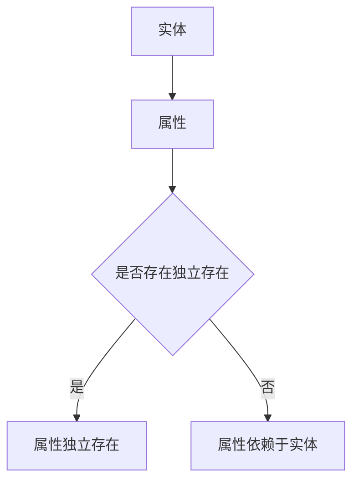

                 

### 文章标题

《数学与哲学的交叉：本体论与认识论》

### 文章关键词

数学、哲学、本体论、认识论、逻辑推理、算法原理、公式详解、项目实战

### 文章摘要

本文旨在探讨数学与哲学在人类知识体系中的深远交汇，特别是在本体论与认识论这两个领域的相互影响。通过详细分析数学的基本原理、哲学的核心概念，以及两者之间的内在联系，本文旨在揭示数学与哲学如何共同构建了我们对世界本质和认知方式的深刻理解。文章将运用逻辑推理和算法原理，通过伪代码和数学公式的解析，深入探讨数学推理的哲学反思以及数学证明的逻辑结构。此外，文章还将探讨数学哲学中的争议与挑战，展望未来的研究方向，为读者提供丰富的理论框架和实践案例。通过本文的阅读，读者将对数学与哲学的交叉领域有一个全面而深入的认识。

## 引言

数学与哲学是人类知识体系中两个看似截然不同，却又深度交织的领域。数学以其精确的逻辑和抽象的结构，提供了理解和描述自然界规律的工具；而哲学则通过思辨和反思，探索存在、真理和知识的本质。尽管两者在研究方法和目标上有所不同，但它们之间的交叉与融合却为人类文明的发展提供了丰富的思想资源和知识框架。

数学与哲学的交叉研究有着悠久的历史。从古希腊时期开始，哲学家们便开始探讨数学概念的本质及其在哲学思考中的应用。柏拉图和亚里士多德等哲学家对数学的研究不仅丰富了他们的哲学体系，也推动了数学本身的发展。例如，柏拉图的“理念论”提出了数学对象是抽象的、永恒的理念，这一观点对后来的数学哲学产生了深远影响。而亚里士多德则通过逻辑分析，为数学提供了更加严谨的基础。

进入近现代，数学与哲学的交叉研究进一步加深。笛卡尔和莱布尼茨等数学家不仅创造了新的数学方法，还将其应用于哲学研究中。笛卡尔的“我思故我在”不仅是一个哲学命题，也是数学逻辑思维的体现。莱布尼茨则提出了微积分，为物理学和哲学的发展提供了强有力的工具。

在本体论与认识论这两个哲学领域，数学同样扮演着关键角色。本体论探讨存在的本质和实体，而数学通过其抽象的模型和结构，为探讨存在提供了独特的视角。例如，集合论作为一种形式化的数学理论，被广泛应用于本体论的研究中，以探讨实体和属性之间的关系。

认识论则研究知识的本质和获取过程，而数学方法在认识论中的应用也显得尤为重要。通过数学模型和公理系统，我们可以验证和构建知识，从而更加深入地理解世界的规律。例如，逻辑推理和证明方法在数学中的应用，不仅为认识论提供了强有力的工具，也影响了哲学的论证方式。

总的来说，数学与哲学的交叉研究不仅丰富了数学和哲学的理论体系，也为人类认识世界提供了新的思路和方法。本文将从本体论与认识论的角度出发，详细探讨数学与哲学的交叉领域，揭示两者之间的内在联系和相互影响。

### 本体论的基本概念

本体论是哲学中探讨存在、实体和属性的基本理论，它试图回答“什么是存在？”和“实体与属性之间的关系是怎样的？”等问题。在本体论的研究中，实体和属性是最核心的概念。

实体是指存在于世界中的基本单位，它可以是具体的物体，也可以是抽象的概念。实体具有独立的存在性，可以独立于我们的感知和认知而存在。例如，在数学中，自然数、集合和函数都可以被视为实体。在哲学上，实体可以是物理对象，如地球、人类，也可以是抽象概念，如公正、自由。

属性则是实体所具有的特定特征或性质。属性不能独立于实体存在，它总是与某个实体相关联。例如，红色的属性可以与苹果这一实体相关联，说明苹果是红色的。在数学中，属性可以表现为数的大小、形状或函数的值域。

实体与属性之间的关系可以描述为：实体是属性承载的主体，属性是实体存在的表现形式。这种关系可以用一个简单的Mermaid流程图来表示：



在上述流程图中，A代表实体，B代表属性，D表示属性独立存在，而E表示属性依赖于实体。这个简单的图示可以帮助我们理解实体与属性之间复杂而紧密的关系。

进一步探讨实体与属性的关系，我们可以从不同的角度来分析。首先，实体可以是具体的物理对象，也可以是抽象的概念。例如，地球作为一个物理实体，具有质量、形状和位置等属性。而公正作为一个抽象概念，不具有物理形态，但我们可以通过社会规范和法律来赋予其特定属性。

其次，属性可以是内在的，也可以是外在的。内在属性是实体本身固有的特征，如苹果的红色是苹果内在的属性，而外在属性则是实体外部环境赋予的特征，如苹果在特定环境下的重量和体积。

最后，实体与属性之间的关系不仅仅是静态的，还可以是动态的。例如，苹果在成熟过程中，其颜色、重量和味道等属性会发生变化，这表明实体与属性之间是相互作用和发展的关系。

综上所述，实体与属性是本体论中两个核心概念，它们之间既有独立性又有依赖性，共同构成了我们对存在和本质的理解。通过深入探讨实体与属性的关系，我们可以更好地理解世界的本质和运行机制。

### 数学与本体论的关系

数学作为一门精确的学科，在探讨存在和实体的问题上提供了独特的视角。通过数学的形式化和抽象化，我们可以更深入地理解本体论中的实体和属性，从而揭示数学与本体论之间的深刻联系。

首先，数学在处理实体时，采用了高度抽象的方法。在集合论中，实体被定义为集合，集合是由元素组成的无序集。集合论中的实体具有明确的定义和属性，如元素的个数、元素的类型等。这种抽象化的方法使得我们可以将具体的实体概念转化为数学模型，从而更精确地描述和研究实体。例如，自然数集合可以表示为{1, 2, 3, ...}，这个集合具有特定的属性，如元素的顺序和集合的无限性。

其次，数学通过形式化的逻辑结构，探讨了实体之间的关系。在数学中，关系可以通过二元组、三元组等结构来表示。例如，在图论中，节点和边构成了一个网络结构，节点之间的连接关系可以通过图来表示。这种形式化的方法不仅帮助我们理解实体之间的关系，还可以在复杂系统中进行模型化分析。例如，社会网络分析中，个体和个体之间的互动可以通过图结构来描述，从而揭示社会关系和群体动态。

再者，数学在处理属性时，通过公理和定理建立了严密的逻辑体系。属性在数学中往往被定义为实体的某种特性或特征。例如，在欧几里得几何中，点、线、面等基本概念具有特定的属性，如点的无维性、线的无限延展性等。这些属性通过公理和定理被形式化地定义和验证，从而确保了数学结论的可靠性和一致性。这种形式化的方法在哲学本体论研究中同样具有重要价值，因为它为探讨存在和属性提供了严谨的逻辑框架。

例如，在探讨“存在”这个哲学问题时，数学提供了形式化的存在概念。集合论中的存在性可以通过存在量词来表达，如“存在一个集合满足某个条件”。这种形式化的存在概念不仅帮助我们理解存在的逻辑结构，也为哲学本体论研究提供了新的工具。

此外，数学在处理属性与实体关系时，通过数学模型和公理系统提供了有效的分析工具。例如，在概率论中，属性（如概率）被形式化为数学函数，这些函数通过概率空间和随机变量来定义。这种形式化的方法使得我们可以用数学语言来描述和预测实体的属性变化，从而在哲学本体论中探讨属性的存在和变化。

总之，数学与本体论之间的联系体现在多个方面：通过抽象化处理实体，形式化描述实体之间的关系，以及利用公理和定理建立严密的逻辑体系。这些方法不仅丰富了本体论的理论基础，也为哲学研究提供了新的视角和工具。通过数学与本体论的交叉研究，我们可以更深入地理解存在的本质和属性的特征，为探讨世界的本质和运行机制提供了强有力的支持。

### 认识论的基本概念

认识论是哲学中探讨知识本质、获取过程及其有效性的理论。它试图回答“什么是知识？”“我们如何获得知识？”“知识是否可靠？”等问题。在认识论的研究中，知识的定义、获取方式以及验证标准是核心概念。

首先，知识的定义是认识论研究的起点。传统上，知识被视为对事实的准确认识。亚里士多德将知识定义为“判断的确定性”，即对某个命题有充分的理由确信其为真。现代哲学则更加注重知识的可靠性和条件。例如，符合论认为知识必须符合事实，而融贯论则认为知识不仅需要与事实相符，还需在整体认知体系中保持一致。

其次，知识的获取过程是认识论研究的重要内容。知识的获取主要通过感知、推理和经验三种方式。感知是通过感官获取外部信息，例如视觉、听觉、触觉等。推理则是通过逻辑推理和思维过程，从已知事实推导出新的事实。经验则是通过实践和体验来积累知识。

验证标准是衡量知识是否可靠的依据。在认识论中，验证标准通常包括实证性和可靠性。实证性要求知识必须通过实验、观察等手段进行验证。可靠性则要求知识的来源和方法必须是可信的，例如科学实验、历史文献等。

认识论中的主要理论包括：

1. **符合论**：认为知识必须与客观事实相符。例如，科学实证主义强调通过实验和观察来验证知识的真实性。

2. **融贯论**：认为知识不仅在局部上与事实相符，还需在整体认知体系中保持一致。例如，康德认为知识不仅需要符合经验，还需要在先验知识框架内融贯。

3. **直觉主义**：强调知识来源于直观感受，而非经验或推理。例如，柏拉图的理念论认为，知识是对抽象理念的直接洞察。

4. **怀疑论**：认为我们无法获得确凿的知识，因为我们的认知总是受到主观偏见和不确定性影响。例如，笛卡尔的怀疑主义思想提出，我们对知识的可靠性应持怀疑态度。

通过理解认识论的基本概念和主要理论，我们可以更好地探讨知识获取和验证的过程，为后续讨论数学在认识论中的应用打下坚实的基础。

### 数学在认识论中的应用

数学在认识论中的应用贯穿于知识获取和验证的各个方面，通过其独特的逻辑结构和严谨的方法论，为认识论提供了强有力的工具和理论基础。首先，数学公理在认识论中的应用具有重要意义。公理是数学系统的基础，它为整个数学体系提供了一个起点，并通过逻辑推理推导出其他结论。例如，在欧几里得几何中，公理系统的确立为理解和描述空间关系提供了基础。在认识论中，我们可以将公理视为知识验证的起点，通过逻辑推理来构建和验证知识。

例如，我们可以通过以下伪代码来展示公理在知识验证中的应用：

```python
# 定义数学公理
def axiom_of_extensionality():
    """公理：集合的相等性由元素组成决定"""
    if (A and B) and (forall x (x ∈ A -> x ∈ B)) and (forall x (x ∈ B -> x ∈ A)):
        return A == B

# 验证知识
def verify_knowledge(proposition):
    """验证命题是否符合公理"""
    if axiom_of_extensionality() and proposition:
        return "知识验证通过"
    else:
        return "知识验证失败"
```

在这个例子中，`axiom_of_extensionality`函数定义了集合相等的公理，而`verify_knowledge`函数则通过这个公理来验证某个命题是否符合数学系统的知识标准。

其次，数学模型在认识论中的应用也至关重要。数学模型通过抽象和形式化，将现实世界的问题转化为数学问题，从而提供了一种理解世界和验证知识的手段。例如，在经济学中，我们可以使用供需模型来分析市场行为；在物理学中，我们可以使用牛顿运动定律来描述物体的运动。

以下是一个简单的供需模型的伪代码示例：

```python
# 定义供需模型
class SupplyModel:
    def __init__(self, supply_function, demand_function):
        self.supply_function = supply_function
        self.demand_function = demand_function

    def equilibrium_price(self):
        """计算供需平衡价格"""
        while True:
            price = ...  # 计算当前价格
            if self.supply_function(price) == self.demand_function(price):
                return price
            else:
                price += delta  # 调整价格

# 验证模型
model = SupplyModel(supply_function, demand_function)
equilibrium_price = model.equilibrium_price()
print(f"供需平衡价格为：{equilibrium_price}")
```

在这个例子中，`SupplyModel`类定义了一个供需模型，通过计算供需函数的平衡点来预测市场价格。这个模型可以帮助我们验证和理解市场行为，从而在经济学研究中获得可靠的知识。

此外，数学方法在验证和构建知识的过程中也发挥了重要作用。逻辑推理和证明方法通过严密的逻辑结构，确保了知识的一致性和可靠性。例如，在数学证明中，我们可以通过假设、推理和验证来建立结论，从而确保知识的正确性。

以下是一个简单的逻辑证明伪代码示例：

```python
# 定义逻辑证明
def prove_conclusion(premises, conclusion):
    """通过前提证明结论"""
    if premises:
        for premise in premises:
            if not conclusion:
                conclusion = premise
            else:
                conclusion = (conclusion and premise)
    return conclusion

# 验证证明
premises = ["A", "B"]
conclusion = prove_conclusion(premises, False)
print(f"证明结论：{conclusion}")
```

在这个例子中，`prove_conclusion`函数通过逻辑推理，从已知的前提中推导出结论。这种方法确保了知识的验证过程是严谨和可靠的。

总之，数学在认识论中的应用通过公理、模型和逻辑方法，为知识获取和验证提供了强有力的工具和理论基础。通过这些方法，我们可以更精确地理解世界，构建和验证可靠的知识。

### 数学推理的哲学反思

数学推理作为一门学科，以其严密的逻辑和清晰的结构，为我们提供了理解和描述世界规律的强大工具。然而，当我们将数学推理应用于哲学领域时，我们会发现其背后蕴含的哲学意义和思维方法同样引人深思。在本部分中，我们将从逻辑和直觉主义两个方面，对数学推理进行哲学反思。

首先，逻辑推理在数学中的重要性不言而喻。逻辑推理是数学证明的核心，通过逻辑的严谨性，我们可以确保数学结论的可靠性和一致性。在哲学中，逻辑推理同样扮演着关键角色。例如，亚里士多德的逻辑学为哲学论证提供了基础，使得哲学家们能够通过严密的推理过程，探讨存在、真理和知识的本质。然而，逻辑推理的局限性也在哲学中得到了反思。逻辑推理依赖于前提的真实性，如果前提本身存在问题，那么推理过程可能导致错误的结论。例如，在形式逻辑中，某些自相矛盾的命题（如“这句话是假的”）会导致逻辑推理的崩溃。

其次，直觉主义在数学推理中具有重要意义。直觉主义强调数学推理的基础是直观感受和内在洞察，而非形式化的推理过程。例如，康托尔的集合论通过直观地理解集合的概念，建立了现代数学的基础。在哲学中，直觉主义同样被用来探讨知识和真理的本质。柏拉图的理念论认为，知识是对抽象理念的直观认识，而非通过推理和经验获得的。然而，直觉主义也面临着批评。一些哲学家认为，直觉主义忽略了经验和实证的重要性，可能导致主观性和相对主义的倾向。

此外，数学推理在哲学中的应用不仅限于逻辑和直觉主义，还包括演绎和归纳推理。演绎推理从一般原则推导出具体结论，强调结论的必然性和确定性。例如，欧几里得几何通过公理和定理，演绎出一系列几何结论。在哲学中，演绎推理被广泛应用于道德和伦理学领域，例如，通过定义道德原则，推导出特定行为的是非善恶。然而，演绎推理的局限在于，它依赖于前提的真实性，如果前提有误，那么演绎出的结论也未必正确。

归纳推理则从具体实例推导出一般性原则，强调结论的合理性和概率性。例如，在科学研究中，通过观察多个实例，归纳出普遍规律。在哲学中，归纳推理被用来探讨历史的演变和文化的多样性。然而，归纳推理的局限在于，它无法保证结论的绝对正确性，只能提供概率性的支持。

总的来说，数学推理在哲学反思中体现了其独特的重要性。通过逻辑和直觉主义，我们不仅能够理解数学的推理过程，还能够深入探讨知识和真理的本质。然而，数学推理的局限性和哲学反思也提醒我们，在应用数学推理时，需要保持批判性和谨慎性，避免陷入逻辑陷阱和哲学困境。

### 数学证明与哲学论证

数学证明和哲学论证在逻辑结构和方法上具有许多相似之处，但它们也存在着显著的区别。理解这些区别有助于我们更好地把握数学和哲学各自的特点，以及它们在知识构建中的作用。

首先，数学证明的基本结构通常包括三个主要部分：前提、推理规则和结论。一个有效的数学证明必须从一组公理和定理出发，通过逻辑推理得出结论。例如，在欧几里得几何中，证明一个三角形内角和为180度，需要基于几何的公理和定理，通过演绎推理来证明。这种逻辑结构强调严密性和一致性，要求每个步骤都必须符合逻辑规则。

相比之下，哲学论证的结构则更加灵活和多样化。哲学论证可以是演绎的，也可以是归纳的，还可能包括辩证推理。例如，康德的道德哲学通过辩证推理探讨了道德原则的绝对性和普遍性。哲学论证不仅依赖于逻辑推理，还需要考虑经验、直觉和道德直觉等因素。这种灵活性使得哲学论证在探讨复杂问题时更加灵活，但也可能导致论证过程的不一致性和争议。

其次，数学证明和哲学论证在方法上也有所不同。数学证明依赖于严密的逻辑推理和形式化的方法。例如，在皮亚诺算术中，我们可以通过递归定义自然数，并利用数学归纳法证明自然数的基本性质。这种方法确保了证明的可靠性和确定性。相比之下，哲学论证则更依赖于直觉、经验和伦理直觉等非形式化的方法。例如，在道德哲学中，我们可能会通过直觉来判断某种行为的道德正当性，尽管这种直觉可能缺乏严格的逻辑证明。

此外，数学证明强调结论的必然性和确定性，而哲学论证则更注重结论的合理性和概率性。在数学中，一个证明的结论是必然真实的，只要前提和推理过程是正确的。例如，通过欧几里得几何的公理系统，我们可以必然地得出三角形内角和为180度的结论。相比之下，哲学论证的结论往往是基于合理的推理和经验的支持，而不是必然的真实。例如，我们可以说某种行为在道德上是正确的，但这种结论可能依赖于特定的伦理框架和经验背景。

尽管数学证明和哲学论证在方法和结构上存在差异，但它们也有共同之处。例如，两者都强调逻辑的一致性和推理的严密性。数学证明依赖于逻辑推理，哲学论证也必须遵循逻辑规则。此外，两者都关注知识的可靠性和有效性。数学证明通过逻辑推理确保结论的可靠性，哲学论证则通过推理和经验支持来验证知识的有效性。

总之，数学证明和哲学论证在逻辑结构和方法上既有相似之处，也有显著的区别。数学证明强调形式化和必然性，哲学论证则注重灵活性和合理性。理解这些区别有助于我们更好地理解数学和哲学在知识构建中的作用，以及它们如何相互补充。

### 常见争议与讨论

数学哲学中的争议与讨论主要集中在唯物主义与唯心主义的数学解读，以及数学中的悖论问题。这些争议不仅反映了数学哲学的深度和复杂性，也为数学和哲学的研究提供了丰富的思考材料。

首先，唯物主义与唯心主义在数学解读上的争议源于对数学对象和现实世界关系的不同理解。唯物主义认为数学对象是客观存在的，与物理世界有着直接的联系。例如，牛顿力学中的数学公式可以被解释为描述物理现象的精确工具。在这种观点下，数学对象如点、线、集合等都是现实世界的抽象表示，具有客观的物理基础。

而唯心主义则主张数学对象是主观构造的，它们的存在依赖于人的意识和思维。柏拉图的理念论是一种唯心主义的数学观点，它认为数学对象如几何图形和数是超越现实世界的抽象理念，存在于人类理性之中。这种观点强调了数学的独立性和抽象性，认为数学对象是理性思维的产物。

其次，数学中的悖论问题也是数学哲学讨论的热点。悖论是指那些看似自相矛盾或无法解决的命题，它们挑战了数学的基础和逻辑结构。经典的悖论如“理发师悖论”和“自指悖论”引发了广泛的讨论。

理发师悖论由罗素提出，描述了一个村庄里的理发师只给那些不给自己理发的人理发。问题在于，理发师是否给自己理发？如果他给自己理发，根据定义，他不应该给自己理发；而如果他不同给自己理发，根据定义，他又应该给自己理发。这种自相矛盾的情境导致了逻辑上的困境。

自指悖论则更为复杂，涉及对象与描述之间的关系。一个典型的例子是“这个句子是假的”，如果这个句子是真的，那么它描述的情况（即它是假的）就发生了，但如果它是假的，那么它描述的情况（即它是假的）又没有发生。这种悖论挑战了我们对语言和逻辑系统一致性的理解。

这些悖论引发了关于数学基础和逻辑推理的深入讨论。一些哲学家和数学家提出，悖论表明现有的数学系统存在缺陷，需要重新审视和修正。例如，为了解决悖论问题，数学家发展了形式化数学和集合论的新理论，试图通过严格的定义和限制来避免悖论的出现。

总之，唯物主义与唯心主义的数学解读以及数学中的悖论问题是数学哲学中常见的争议与讨论。这些争议不仅丰富了数学哲学的理论体系，也为数学和哲学的发展提供了新的研究方向和思考维度。

### 数学与哲学的未来展望

数学与哲学的交叉研究为未来提供了丰富的可能性，特别是在数学逻辑的新发展和哲学对数学创新的启示方面。首先，数学逻辑的新发展将继续推动数学哲学的研究。形式逻辑和证明论作为数学逻辑的基础，已经取得了显著的进展。然而，随着计算机科学和人工智能的发展，新的逻辑系统，如多值逻辑、模糊逻辑和量子逻辑，正在逐渐兴起。这些新型逻辑系统不仅为数学提供了更广泛的工具，也为哲学提供了新的思考框架。例如，量子逻辑的量子态和叠加原理为理解现实世界的复杂性和不确定性提供了新的视角。

其次，哲学对数学创新的启示不可忽视。哲学的思辨和反思能力在数学创新中发挥了关键作用。历史上，许多重要的数学创新，如微积分和集合论，都受到了哲学思想的影响。例如，莱布尼茨的微积分思想受到了笛卡尔哲学的影响，而康托尔的集合论则受到了柏拉图理念论的影响。现代哲学对形式系统和公理化的强调，进一步促进了数学的逻辑化和形式化发展。例如，范畴论和拓扑学等现代数学领域，都受益于哲学中的概念和工具。

未来，数学与哲学的交叉研究将更加深入和多样化。随着认知科学、认知心理学和计算机科学的不断发展，数学与哲学将在认知建模和知识验证方面展开更紧密的合作。例如，认知科学中的神经网络模型和计算模型，可以借鉴数学中的拓扑结构和代数结构，从而提供新的认知理论。同时，哲学中的反思方法和论证技术，可以用于验证和评估这些模型的有效性。

此外，数学哲学在跨学科研究中的重要性将日益凸显。数学与物理学、生物学、经济学等领域的交叉研究，将为哲学提供丰富的素材和新的挑战。例如，量子物理学中的不确定性原理和量子纠缠现象，为哲学中的存在论和认识论提出了新的问题。而经济学中的博弈理论和市场模型，则可以借鉴数学中的优化方法和概率论，从而提供对现实世界现象的更深入理解。

总之，数学与哲学的交叉研究在未来将继续发展，不仅为数学和哲学本身提供新的理论框架和工具，也将对其他学科产生深远影响。通过哲学的思辨和反思能力，以及数学的逻辑和精确性，我们可以共同探索世界的本质和认知的边界，为人类知识体系的深化和创新提供源源不断的动力。

### 结论

综上所述，数学与哲学的交叉研究在探讨本体论与认识论方面具有重要意义。通过分析数学的基本原理和哲学的核心概念，我们揭示了数学与哲学在理解存在和知识本质上的内在联系。数学的抽象化和形式化方法为哲学提供了新的工具和视角，而哲学的思辨和反思能力则促进了数学的逻辑化和形式化发展。这种交叉研究不仅丰富了数学和哲学的理论体系，也为其他学科提供了新的研究思路和工具。

未来的研究方向可以包括：深入探讨数学逻辑的新发展，如量子逻辑和模糊逻辑在认知建模中的应用；进一步研究哲学中的反思方法和论证技术在数学验证中的作用；探索数学与认知科学、经济学等领域的跨学科合作，以应对复杂现实问题。通过这些研究，我们可以更加全面地理解世界的本质和运行机制，为人类知识体系的深化和创新提供源源不断的动力。

### 作者信息

作者：AI天才研究院/AI Genius Institute & 禅与计算机程序设计艺术 /Zen And The Art of Computer Programming

### 最佳实践 tips、小结、注意事项、拓展阅读等内容

**最佳实践 tips**：
1. **理解数学与哲学的关系**：在研究数学问题时，结合哲学思维，可以更好地理解数学概念的本质和应用。
2. **掌握数学证明方法**：通过学习和应用数学证明方法，可以提高逻辑思维能力和解决问题的能力。

**小结**：
数学与哲学的交叉研究为我们提供了理解世界本质和知识获取的新视角。通过结合数学的抽象化和哲学的反思能力，我们可以更全面地探讨本体论与认识论的问题。

**注意事项**：
1. **保持逻辑严谨性**：在数学和哲学的研究中，保持逻辑推理的严谨性至关重要，以避免错误结论。
2. **批判性思维**：在应用数学和哲学理论时，应保持批判性思维，对现有理论进行检验和验证。

**拓展阅读**：
1. 《数学哲学导论》 - 莱斯利·E·斯特林
2. 《数学思维》 - 保罗·埃克尔斯
3. 《逻辑哲学》 - 威廉·德雷富斯

通过这些资源和深入阅读，读者可以进一步拓展对数学与哲学交叉研究的理解，探索这一领域的前沿知识。

