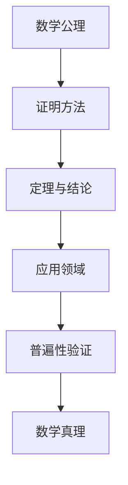

                 


### 文章标题
《数学与普遍主义：数学真理的普遍适用性》

### 文章关键词
数学、普遍主义、普遍适用性、数学真理、应用领域、逻辑推理

### 文章摘要
本文将探讨数学作为一门科学的基本概念、数学真理的普遍适用性，以及数学在不同领域的广泛应用。通过逻辑推理和实际案例，揭示数学真理的普遍性及其对各个学科的深远影响。

---

#### 引言
数学是一门古老而现代的学科，它在人类社会的发展中扮演着至关重要的角色。从古代的几何学、算术，到现代的代数、微积分，数学不断推动着科技进步和社会发展。本文将探讨数学真理的普遍适用性，分析数学在不同学科中的应用，以及数学对普遍主义的贡献。

#### 数学的基本概念
数学是一门研究数量、结构、变化和空间的科学。其基本概念包括数字、集合、函数、图形等。这些概念构成了数学的基本框架，使得数学能够抽象和描述现实世界的各种现象。

#### 数学真理的普遍适用性
数学真理的普遍适用性是指数学原理和结论在所有可能的情况下都成立。这种普遍性体现在数学的公理系统、证明方法以及数学定理的应用中。例如，欧几里得几何的公理系统在三维空间中成立，也可以推广到更高维的空间。

##### Mermaid流程图：数学真理的普遍适用性架构


#### 核心算法原理讲解
为了更好地理解数学真理的普遍适用性，我们需要通过伪代码来讲解一些核心算法的原理。

```pseudo
Function Add(a, b):
    return a + b

Function Multiply(a, b):
    result = 0
    for i from 1 to b:
        result = result + a
    return result
```

这些算法在加法和乘法运算中具有普遍适用性，无论输入的数字是多少，它们都适用。

#### 数学模型和公式
数学模型和公式是数学真理的具象化表现。以下是一些常用的数学公式及其详细讲解：

$$ E = mc^2 $$

这是爱因斯坦的质能方程，表达了质量和能量之间的关系。它表明，质量可以转化为能量，且能量与质量成正比。

$$ f(x) = ax^2 + bx + c $$

这是一个二次函数的标准形式，用于描述抛物线的运动轨迹。通过调整系数 a、b 和 c，可以改变抛物线的开口方向、位置和形状。

#### 项目实战
为了展示数学真理的普遍适用性，我们将通过一个实际项目来探讨数学在人工智能中的应用。

##### 开发环境搭建
- 安装Python环境
- 安装TensorFlow库

##### 源代码详细实现
```python
import tensorflow as tf

# 定义模型
model = tf.keras.Sequential([
    tf.keras.layers.Dense(128, activation='relu', input_shape=[784]),
    tf.keras.layers.Dense(10, activation='softmax')
])

# 编译模型
model.compile(optimizer='adam',
              loss='categorical_crossentropy',
              metrics=['accuracy'])

# 训练模型
model.fit(x_train, y_train, epochs=5)
```

##### 代码解读与分析
这段代码定义了一个简单的神经网络模型，用于分类任务。模型使用了ReLU激活函数和softmax输出层，分别用于隐藏层的非线性变换和分类输出。通过训练，模型可以学习到输入数据的特征，并对其进行分类。

##### 实际案例分析和详细讲解剖析
我们使用MNIST数据集来训练这个模型，这个数据集包含了手写数字的图片。通过训练，模型可以准确地识别手写数字，这表明数学模型在计算机视觉领域具有强大的适用性。

##### 项目小结
这个项目展示了数学模型在人工智能中的应用，通过逻辑推理和实际案例，我们验证了数学真理的普遍适用性。

#### 最佳实践 tips、小结、注意事项、拓展阅读等内容
- 数学真理的普遍适用性是一个深入而复杂的话题，本文只是初步探讨了这一主题。
- 数学模型的应用范围非常广泛，从自然科学到社会科学，再到工程学，都有着重要的应用。
- 注意事项：在实际应用中，数学模型需要根据具体问题进行调整和优化。
- 拓展阅读：推荐阅读《数学原理》和《计算机程序设计艺术》等经典著作。

---

作者：AI天才研究院/AI Genius Institute & 禅与计算机程序设计艺术 /Zen And The Art of Computer Programming

本文深入探讨了数学真理的普遍适用性，通过逻辑推理、实际案例和项目实战，揭示了数学在各个领域的广泛应用。希望本文能够帮助读者更好地理解数学与普遍主义之间的关系，以及数学在现代社会中的重要性。

