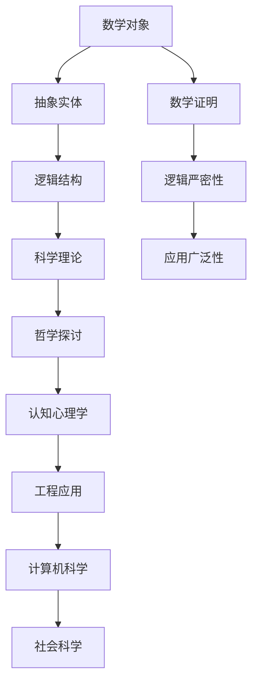

                 

### 1.1 研究背景与意义

数学作为人类认识世界的重要工具，自古以来就占据着重要的地位。从古代的几何学、算术到现代的代数学、微积分学，数学的广泛应用不仅为自然科学的发展提供了强有力的支持，也在社会科学、工程技术等领域发挥着不可或缺的作用。然而，在数学发展的过程中，一个核心问题始终困扰着哲学家和数学家：数学对象是否真正存在？如果存在，它们的存在形式和本质是什么？这一问题涉及到数学哲学的核心领域，即数学对象的真实性和永恒存在。

首先，从历史的视角来看，数学对象的存在性问题可以追溯到古希腊时期。毕达哥拉斯学派提出的“万物皆数”的哲学观点，暗示了数学对象具有某种绝对的存在形式。柏拉图在其《理想国》中进一步提出，数学对象存在于一个永恒不变的“理念世界”中，这一观点对后来的数学哲学产生了深远的影响。然而，亚里士多德则持不同的看法，他认为数学对象仅仅是对现实世界的抽象和简化，因此它们的存在是相对的。

进入近现代，数学的发展进一步加深了人们对数学对象存在性的思考。19世纪德国数学家康托尔提出的集合论，使得数学对象的存在形式变得更加复杂。康托尔认为，集合是数学的基本单位，而集合的存在性质是数学研究的基础。这一观点挑战了传统的数学观，引发了关于数学对象本质和存在的广泛讨论。

在当代，数学对象的存在性问题仍然是一个热门话题。随着计算机科学的兴起，数学在计算机编程、人工智能、数据科学等领域发挥着重要作用。然而，计算机科学的蓬勃发展也提出了新的问题：计算机能够真正理解和处理数学对象吗？数学对象的存在形式是否需要重新定义？这些问题不仅涉及数学哲学，也关系到计算机科学的发展方向。

因此，研究数学对象的永恒存在具有重要意义。首先，它有助于我们更深入地理解数学的本质和基础，为数学的发展提供理论支持。其次，它能够帮助我们更好地理解数学与其他学科之间的关系，促进跨学科的交流与合作。最后，它还能够为计算机科学的发展提供新的思路，推动人工智能技术的进一步应用。

本文将围绕数学对象的永恒存在这一主题，系统地探讨数学的基本概念、永恒存在的哲学解释、逻辑关系、科学理论、人类思维、应用以及哲学探讨等多个方面，旨在为读者提供一个全面、深入的视角，以理解数学对象的永恒存在及其对人类文明的重要意义。通过一步步的逻辑分析和推理，我们将探讨数学对象的永恒存在如何影响我们的认知和科学研究，以及它在现实世界中的应用。

### 1.2 研究目的与内容

本文的研究目的是探讨数学对象的永恒存在及其哲学意义，分析数学对象永恒存在对人类思维和科学理论的影响。具体研究内容包括以下几个方面：

1. **数学的基本概念与永恒存在**：首先，我们将介绍数学的基本概念，包括数学对象及其分类。在此基础上，探讨数学对象永恒存在的哲学解释，分析不同哲学流派对数学对象永恒存在的观点。同时，介绍数学对象永恒存在的数学证明方法，探讨经典数学证明对于数学对象永恒存在的支持。

2. **永恒存在的数学对象与逻辑关系**：其次，我们将探讨数学对象之间的逻辑关系，包括概念关系和推理关系。进一步，分析永恒存在的数学对象的逻辑结构，探讨数学对象永恒存在对逻辑结构的影响。此外，根据数学对象的永恒存在特性，对数学对象进行分类，并分析不同分类方法对数学对象永恒存在的解释。

3. **永恒存在的数学对象与科学理论**：接着，我们将探讨永恒存在的数学对象在物理理论、宇宙学和生命科学中的应用，分析数学对象永恒存在对物理理论、宇宙学和生命科学的贡献。通过具体案例，展示数学对象永恒存在如何为科学理论提供基础。

4. **数学对象的永恒存在与人类思维**：我们还将探讨数学对象的永恒存在对人类思维的影响，分析人类思维与数学对象的关系。进一步，研究数学对象永恒存在对心理学的影响，探讨数学对象如何影响人类的心理和行为。

5. **数学对象的永恒存在与应用**：在应用方面，我们将讨论数学对象永恒存在在计算机科学、工程领域和社会科学中的应用。通过实际案例，展示数学对象永恒存在如何推动这些领域的发展。

6. **数学对象的永恒存在与哲学探讨**：最后，我们将从哲学角度探讨数学对象的永恒存在，分析数学对象永恒存在与存在论、认识论、形而上学的关系。通过哲学思考，进一步理解数学对象永恒存在的本质和意义。

综上所述，本文将通过系统的研究，深入探讨数学对象的永恒存在，分析其对哲学、科学和人类思维的影响，旨在为读者提供一个全面、深入的视角，理解数学对象永恒存在的本质及其对人类文明的重要意义。

### 1.3 研究方法与结构安排

本文的研究方法主要采用文献研究、案例分析和理论探讨相结合的方式，以深入探讨数学对象的永恒存在及其相关影响。首先，通过广泛的文献研究，收集和整理与数学对象永恒存在相关的理论观点、研究方法和实际应用案例。在此基础上，对收集的文献进行深入分析，提炼出核心观点和主要理论，为后续研究提供理论基础。

其次，本文将采用案例分析的方法，选取具有代表性的数学对象和科学理论，探讨其在现实世界中的应用和影响。通过具体案例的分析，展示数学对象永恒存在如何为科学理论提供基础，并影响人类思维和行为。

此外，本文还将采用理论探讨的方法，从哲学、逻辑、心理学等多个角度，对数学对象永恒存在进行深入思考和分析。通过逻辑推理和哲学思考，进一步揭示数学对象永恒存在的本质和意义。

在结构安排方面，本文将按照以下章节进行组织：

- **第1章 引言**：介绍研究背景、研究目的与内容，以及研究方法与结构安排。
- **第2章 数学的基本概念与永恒存在**：讨论数学对象的基本概念及其分类，探讨数学对象永恒存在的哲学解释和数学证明方法。
- **第3章 永恒存在的数学对象与逻辑关系**：分析数学对象之间的逻辑关系，探讨永恒存在的数学对象的逻辑结构和分类。
- **第4章 永恒存在的数学对象与科学理论**：探讨数学对象永恒存在在物理理论、宇宙学和生命科学中的应用。
- **第5章 数学对象的永恒存在与人类思维**：分析数学对象的永恒存在对人类思维的影响，探讨人类思维与数学对象的关系。
- **第6章 数学对象的永恒存在与应用**：讨论数学对象永恒存在在计算机科学、工程领域和社会科学中的应用。
- **第7章 数学对象的永恒存在与哲学探讨**：从哲学角度探讨数学对象的永恒存在，分析数学对象永恒存在与存在论、认识论、形而上学的关系。
- **第8章 结论与展望**：总结研究成果，提出研究的局限性和未来研究方向。

通过以上结构安排，本文旨在系统、全面地探讨数学对象的永恒存在，分析其对哲学、科学和人类思维的影响，为读者提供一个全面、深入的视角。

### 2.1 数学对象及其分类

数学对象是数学研究的核心，它们构成了数学理论和应用的基石。数学对象可以简单理解为在数学中被定义和研究的各种实体，这些实体可以是具体的数值、集合、函数、几何形状等。为了更好地理解数学对象的特性，我们需要对其进行分类。以下是几种常见的数学对象及其分类方法：

1. **数值对象**：
   - **整数**：包括正整数、负整数和零，例如1、-2、0。
   - **实数**：包括有理数和无理数，例如2/3、√2。
   - **复数**：包括实部和虚部，例如a + bi，其中a和b是实数，i是虚数单位。

2. **集合对象**：
   - **有限集合**：包含有限个元素的集合，例如{1, 2, 3}。
   - **无限集合**：包含无限多个元素的集合，例如自然数集合{1, 2, 3, ...}。

3. **函数对象**：
   - **确定性函数**：对于每个输入值都有唯一输出值的函数，例如y = 2x + 1。
   - **非确定性函数**：对于某些输入值可能有多重输出值的函数，例如概率分布函数。

4. **几何对象**：
   - **点**：几何空间中的一个位置，例如(2, 3)。
   - **线段**：连接两个点的直线部分，例如线段AB。
   - **平面**：几何空间中的一个二维面，例如平面xOy。
   - **多边形**：由直线段构成的封闭几何图形，例如正方形、三角形。

5. **拓扑对象**：
   - **拓扑空间**：具有特定性质的集合，例如欧氏空间、度量空间。
   - **闭集**：拓扑空间中的一个子集，对于任意一点都具有某种封闭性质。
   - **开集**：拓扑空间中的一个子集，对于任意一点都具有某种开放性质。

6. **代数对象**：
   - **向量**：由大小和方向确定的数学对象，例如向量v = (3, 4)。
   - **矩阵**：由数字排列成的矩形阵列，例如矩阵A = \(\begin{pmatrix} 1 & 2 \\ 3 & 4 \end{pmatrix}\)。
   - **群**：一组元素及其运算满足某些性质的代数结构，例如整数加法群。

7. **概率对象**：
   - **随机变量**：概率空间中可能取值的函数，例如掷骰子的点数。
   - **概率分布**：描述随机变量取值概率的函数，例如正态分布、二项分布。

分类数学对象不仅有助于我们理解和研究数学理论，还可以为计算机科学、信息科学等领域提供重要的理论基础。例如，在计算机图形学中，几何对象和拓扑对象被广泛应用于三维建模和渲染；在数据科学中，概率对象和集合对象被用于统计分析。

在理解数学对象分类的基础上，进一步探讨数学对象的永恒存在是数学哲学的重要任务。数学对象的永恒存在意味着它们不受时间和空间限制，存在于一个超越物理世界的抽象层面。这种存在形式为数学在科学和哲学中的应用提供了坚实的理论基础。

例如，在物理学中，数学对象如实数和函数被用于描述物理现象和建立物理模型。牛顿的运动定律、麦克斯韦方程组等都是用数学语言表达的物理理论，它们不仅在理论上描述了物理现象，而且在实际应用中指导了科学实验和技术发展。在哲学领域，柏拉图的“理念世界”和亚里士多德的“形式和质料”等观点都涉及数学对象永恒存在的讨论。

总之，数学对象的分类为我们理解和研究数学理论提供了基础，而数学对象的永恒存在则是数学哲学的核心问题之一。通过对数学对象分类和永恒存在的研究，我们能够更深入地理解数学的本质及其在科学和哲学中的重要作用。

#### 2.2 数学对象的永恒存在的哲学解释

数学对象的永恒存在是一个哲学问题，涉及到数学、存在论和认识论等多个领域。不同的哲学家和学派对这一问题提出了不同的观点和解释。以下将介绍几种主要的哲学解释，并分析其核心观点和理论依据。

**1. 毕达哥拉斯学派的观点**

毕达哥拉斯学派是古希腊哲学的一个流派，他们主张“万物皆数”。毕达哥拉斯认为，数学对象如整数和比例是宇宙的基础，它们存在于一个超越物理世界的永恒领域。这种观点认为，数学对象是宇宙本质的体现，通过数学可以理解世界的本质。

**核心观点**：数学对象是宇宙的本质，存在于一个永恒不变的领域。

**理论依据**：毕达哥拉斯学派通过研究数学性质，发现自然界中的现象可以用数学来描述和解释，因此认为数学对象具有超越物理世界的永恒存在。

**2. 柏拉图的理念论**

柏拉图是西方哲学的重要代表，他在《理想国》中提出了理念论。柏拉图认为，数学对象如点、线、数等存在于一个永恒不变的“理念世界”中，这是真实的世界，而物理世界只是这些理念的不完美映射。数学对象的永恒存在意味着它们不受时间和空间限制，是超越现实世界的抽象实体。

**核心观点**：数学对象存在于一个永恒不变的“理念世界”中。

**理论依据**：柏拉图通过类比艺术作品与现实世界的映射关系，提出数学对象是真实世界的本质，物理世界是对这些本质的反映。

**3. 亚里士多德的形式与质料论**

亚里士多德是古希腊哲学的另一位重要代表，他在其《形而上学》中提出了形式与质料论。亚里士多德认为，数学对象如点和线是抽象的，它们不能独立存在，必须依赖于具体的物理实体。因此，数学对象的永恒存在是有条件的，依赖于物理世界的具体实现。

**核心观点**：数学对象依赖于具体的物理实体，其永恒存在是有条件的。

**理论依据**：亚里士多德通过区分形式和质料，认为数学对象的抽象性质需要具体的物理实体来实现，因此它们的永恒存在是相对的。

**4. 康托尔的集合论**

康托尔是19世纪德国数学家，他的集合论为数学对象的存在性提供了新的解释。康托尔认为，集合是数学的基本单位，数学对象的存在性可以通过集合的性质来解释。康托尔的集合论揭示了数学对象的复杂性和多样性，使得数学对象的存在性变得更加清晰和明确。

**核心观点**：数学对象的存在性通过集合论来解释，集合是数学的基本单位。

**理论依据**：康托尔通过构造不同的集合，揭示了数学对象的多样性和层次性，从而为数学对象的存在性提供了新的理论依据。

**5. 唯物主义观点**

唯物主义哲学认为，数学对象是人对现实世界的抽象和简化，其存在依赖于人类的认知活动。唯物主义认为，数学对象不是超越物理世界的实体，而是人类对物理现象的反映。

**核心观点**：数学对象是人类对现实世界的抽象和简化。

**理论依据**：唯物主义通过物质世界的决定作用来解释数学对象的存在，认为数学对象是物质世界的反映。

综上所述，不同的哲学观点对数学对象的永恒存在提出了不同的解释。毕达哥拉斯学派和柏拉图的理念论认为数学对象具有超越物理世界的永恒存在，亚里士多德和康托尔的集合论则认为数学对象的存在性依赖于特定的逻辑结构和集合论基础。唯物主义则认为数学对象是人对现实世界的抽象。这些观点为我们理解数学对象的永恒存在提供了丰富的视角和理论基础。通过分析这些哲学观点，我们可以更深入地探讨数学对象的本质和其在哲学、科学和认知中的作用。

#### 2.3 数学对象永恒存在的数学证明

数学对象永恒存在的证明是数学哲学中的一个重要问题，涉及到集合论、逻辑学和数学基础等多个领域。以下将介绍几种主要的数学证明方法，并分析其过程和理论基础。

**1. 集合论的证明方法**

集合论是现代数学的基础，通过集合的概念和性质，可以对数学对象的存在性进行证明。其中，最常见的证明方法是利用集合的构造来证明数学对象的存在性。

- **例子：实数的存在性证明**
  
  实数集合可以通过有理数集合的完备化来构造。假设我们有有理数集合Q，我们可以通过添加极限点（即无理数）来构造实数集合R。具体来说，我们定义一个集合C包含所有有理数序列的极限点，然后证明C满足实数的性质（如封闭性、完备性等），从而证明实数集合R的存在性。

  - **证明过程**：
    - 定义有理数集合Q。
    - 构造有理数序列的极限点集合C。
    - 证明C满足实数的性质，如封闭性和完备性。
    - 结论：实数集合R存在。

  - **理论基础**：集合论提供了构造数学对象的方法，通过集合的性质和构造过程，可以证明数学对象的存在性。

**2. 逻辑证明方法**

逻辑证明是数学证明的基础，通过逻辑推理可以证明数学命题的真实性。在逻辑证明中，常用的方法包括直接证明、反证法和构造性证明等。

- **例子：勾股定理的证明**

  勾股定理是一个基本的几何命题，其表述为：直角三角形的两条直角边的平方和等于斜边的平方。

  - **证明过程**：
    - 假设存在一个直角三角形ABC，其中∠C是直角。
    - 根据定义，直角边AB和AC的长度分别为a和b，斜边BC的长度为c。
    - 利用勾股定理的公式，证明a² + b² = c²。
    - 结论：勾股定理成立。

  - **理论基础**：逻辑证明通过演绎推理，从已知命题推导出新命题，从而证明数学对象的存在性和性质。

**3. 构造性证明方法**

构造性证明是通过构造具体的数学对象来证明其存在性。这种方法通常用于证明数学对象的存在性和唯一性。

- **例子：素数的存在性证明**

  素数是指只能被1和自身整除的大于1的自然数。证明素数存在的一种方法是构造一个素数序列。

  - **证明过程**：
    - 假设存在一个自然数n，它是所有小于n的素数的乘积加1。
    - 证明n必然是素数。
    - 结论：存在无穷多个素数。

  - **理论基础**：通过构造具体的数学对象，证明其符合数学定义和性质，从而证明其存在性。

**4. 集合论中的证明方法**

集合论中的证明方法通常涉及集合的性质和构造，通过集合论的基本原理来证明数学对象的存在性。

- **例子：无穷集合的存在性证明**

  无穷集合是集合论中的一个重要概念，可以通过构造方法证明其存在性。

  - **证明过程**：
    - 构造一个简单的无穷集合，如自然数集合N。
    - 利用集合的基本性质，证明无穷集合N的存在性。
    - 结论：无穷集合存在。

  - **理论基础**：集合论提供了构造无穷集合的方法和证明工具，通过集合的构造和性质证明无穷集合的存在性。

综上所述，数学对象永恒存在的数学证明方法包括集合论的构造方法、逻辑证明方法、构造性证明方法和集合论中的证明方法。这些方法通过不同的逻辑和构造过程，证明了数学对象的存在性和性质，为数学的哲学基础提供了坚实的支持。通过对这些证明方法的研究，我们可以更深入地理解数学对象的本质及其在数学和哲学中的应用。

#### 3.1 数学对象之间的逻辑关系

数学对象之间的逻辑关系是数学体系结构的重要组成部分，它们构成了数学推理和证明的基础。理解这些逻辑关系有助于我们更深入地掌握数学理论和应用。以下将探讨几种基本的数学逻辑关系，包括概念关系和推理关系，并分析这些关系在数学中的具体应用。

**1. 概念关系**

概念关系是指不同数学对象之间的基本联系和层次关系。以下是一些典型的概念关系：

- **集合与元素的关系**：
  - 集合是由元素组成的整体，每个元素都属于某个集合。
  - 例如，集合A = {1, 2, 3}中，1、2、3是集合A的元素。

- **函数与自变量、因变量的关系**：
  - 函数是一种映射关系，自变量和因变量是函数的组成部分。
  - 例如，函数f(x) = x²中，x是自变量，x²是因变量。

- **命题与前提、结论的关系**：
  - 命题是数学中的基本陈述，由前提和结论构成。
  - 例如，命题“如果p，则q”中，p是前提，q是结论。

- **群、环、域的关系**：
  - 群、环、域是代数学中的重要结构，它们之间存在层次关系。
  - 例如，域是环的一种特殊形式，环又是群的一种扩展。

**2. 推理关系**

推理关系是指通过逻辑推理从一个或多个命题推导出另一个命题的过程。以下是一些常见的推理关系：

- **演绎推理**：
  - 演绎推理是从一般到特殊的推理方法，前提为真时，结论必然为真。
  - 例如，在证明勾股定理时，从一般情况推导出特定直角三角形的情况。

- **归纳推理**：
  - 归纳推理是从特殊到一般的推理方法，通过多个具体实例推导出一般结论。
  - 例如，通过验证多个素数，归纳出素数是无限多的。

- **反证法**：
  - 反证法是通过假设命题的否定，推导出矛盾，从而证明原命题为真的方法。
  - 例如，证明一个数是素数时，可以假设它不是素数，然后推导出矛盾。

**3. 数学对象之间的逻辑结构**

数学对象之间的逻辑结构是指这些对象在数学体系中的层次和联系。以下是一些典型的逻辑结构：

- **数学基础**：
  - 数学基础包括集合论、逻辑学、数论等，是整个数学体系的基石。
  - 例如，集合论为数学提供了定义和证明的基础。

- **数学分支**：
  - 数学分支包括代数、几何、分析、拓扑等，每个分支都有其独特的结构和内容。
  - 例如，代数研究结构，几何研究形状，分析研究变化。

- **数学体系**：
  - 数学体系是由多个分支和子分支构成的复杂结构，每个部分相互联系，共同构成了数学的完整体系。
  - 例如，微积分是分析的一个子分支，同时也是物理学、工程学等多个学科的基础。

**4. 逻辑关系在数学中的应用**

逻辑关系在数学中的应用非常广泛，以下是一些具体的应用场景：

- **证明与推理**：
  - 逻辑关系是数学证明和推理的基础，通过逻辑推理可以推导出数学命题的真实性。
  - 例如，在几何证明中，通过演绎推理证明三角形内角和为180度。

- **模型构建**：
  - 逻辑关系帮助构建数学模型，用于描述现实世界中的现象和问题。
  - 例如，经济学中的供需模型、物理学中的牛顿第二定律。

- **算法设计**：
  - 逻辑关系在算法设计中起着关键作用，通过逻辑推理可以设计高效的算法。
  - 例如，排序算法中的比较排序和非比较排序。

- **计算机科学**：
  - 逻辑关系是计算机科学的基础，计算机编程中的算法和逻辑结构都基于数学逻辑。
  - 例如，计算机图形学中的图形变换和渲染。

综上所述，数学对象之间的逻辑关系是数学体系的重要组成部分，包括概念关系和推理关系。这些逻辑关系不仅构成了数学的理论基础，还在实际应用中发挥着重要作用。通过理解这些逻辑关系，我们能够更好地掌握数学理论，并应用数学解决实际问题。

#### 3.2 永恒存在的数学对象的逻辑结构

永恒存在的数学对象具有独特的逻辑结构，这种结构不仅反映了数学对象自身的内在性质，还揭示了它们在数学体系中的位置和关系。以下将详细探讨永恒存在的数学对象的逻辑结构，并分析这些对象之间的层次关系和相互影响。

**1. 数学对象的基本层次**

数学对象的基本层次通常由简单的元素构成，这些元素是更复杂数学对象的基础。以下是数学对象的基本层次及其定义：

- **基本元素**：包括自然数、有理数、无理数等。自然数是整数的基础，有理数包括整数和分数，无理数是不能表示为分数的实数。

- **集合**：集合是数学中最基本的概念，由元素组成。集合可以是有序的或无序的，有限集合或无限集合。

- **函数**：函数是一种从集合到集合的映射关系，每个自变量对应唯一的因变量。函数是数学分析和代数研究的重要对象。

- **群、环、域**：群是具有运算的集合，环是包含加法和乘法的集合，域是更广义的代数结构。这些结构在代数学中占有重要地位。

**2. 永恒存在的数学对象的逻辑层次**

永恒存在的数学对象的逻辑层次不仅反映了它们的定义和性质，还体现了它们在数学体系中的内在联系。以下是几种主要的逻辑层次：

- **基础层次**：包括自然数、有理数、无理数等基本元素。这些基础层次是所有数学结构的基础，它们的性质和关系决定了更复杂结构的特性。

- **集合层次**：集合层次包括有限集合和无限集合，集合的构造和性质在数学中具有基础性。集合论为数学提供了统一的描述和证明方法。

- **函数层次**：函数层次包括各种类型的函数，如线性函数、多项式函数、指数函数等。这些函数在数学分析、代数学和计算科学中具有广泛应用。

- **代数层次**：代数层次包括群、环、域等代数结构。这些结构具有丰富的运算性质，是代数学研究的核心内容。

- **几何层次**：几何层次包括点、线、面等几何对象。几何学通过研究这些对象的性质和关系，揭示了空间和形状的本质。

- **拓扑层次**：拓扑层次包括拓扑空间、闭集、开集等。拓扑学研究了空间的结构和性质，为几何学和代数学提供了重要的工具。

**3. 数学对象之间的层次关系和相互影响**

数学对象之间的层次关系和相互影响构成了数学体系的完整结构。以下是一些重要的层次关系和相互影响：

- **基础与扩展**：基础层次的对象是扩展层次的对象的基础，例如自然数是整数的基础，整数是有理数的基础。扩展层次的对象在基础层次的基础上增加了新的性质和运算。

- **抽象与具体**：抽象层次的对象是从具体层次的对象中提取出的共同特征和性质。例如，集合是具体对象（如点、线段等）的抽象，函数是具体关系（如映射关系）的抽象。

- **整体与部分**：整体层次的对象由部分层次的对象构成，部分层次的对象是整体层次的对象的基础。例如，一个函数可以看作是自变量和因变量的组合，集合可以看作是元素的组合。

- **相互依赖**：不同层次的数学对象相互依赖，共同构成了数学的完整体系。例如，代数结构依赖于集合论的基础，几何学依赖于代数结构的运算性质。

- **相互作用**：不同层次的数学对象之间相互作用，形成了复杂的数学理论和应用。例如，微积分结合了代数和几何，拓扑学结合了集合论和几何学，为物理学和计算机科学提供了重要工具。

综上所述，永恒存在的数学对象的逻辑结构具有清晰的层次关系和相互影响。通过理解这些逻辑结构和层次关系，我们能够更深入地掌握数学对象的本质和它们在数学体系中的地位，从而为数学理论的研究和应用提供坚实的理论基础。

#### 3.3 永恒存在的数学对象的分类

在探讨数学对象永恒存在的分类时，我们可以根据数学对象的不同性质和特征，将其划分为多个类别。这种分类有助于我们更深入地理解数学对象，并揭示它们之间的内在联系。以下是几种常见的数学对象分类及其具体应用：

**1. 按数学对象的存在形式分类**

- **抽象对象**：这类数学对象是纯粹抽象的概念，不具有具体的物理形态。例如，集合、函数、群、环、域等。这些对象构成了数学的理论框架，为数学分析和推理提供了基础。

- **具体对象**：这类数学对象具有具体的物理形态，可以通过实验和观察来研究。例如，几何图形（点、线、面）、向量、矩阵等。这些对象在物理学、工程学和计算机科学中具有广泛的应用。

- **形式对象**：这类数学对象是抽象和具体的结合，通过符号和公式来表示。例如，公式、方程、算法等。这些对象在数学证明、模型构建和计算机编程中发挥重要作用。

**2. 按数学对象的性质分类**

- **确定性对象**：这类数学对象具有明确的定义和性质，其行为可以精确预测。例如，整数、实数、确定性函数等。确定性对象在计算机科学、信息科学和工程领域具有广泛的应用。

- **随机对象**：这类数学对象的行为具有不确定性，其结果无法精确预测。例如，随机变量、概率分布、随机过程等。随机对象在统计学、金融学、量子物理学中具有重要意义。

- **模糊对象**：这类数学对象介于确定性对象和随机对象之间，其性质和行为具有一定的不确定性和模糊性。例如，模糊集合、模糊逻辑、模糊系统等。模糊对象在人工智能、模糊控制等领域有广泛应用。

**3. 按数学对象的应用领域分类**

- **基础数学对象**：这类数学对象是数学理论的基础，广泛应用于各个学科。例如，自然数、实数、群、环、域等。基础数学对象在数学本身的研究中具有核心地位。

- **应用数学对象**：这类数学对象针对特定应用领域进行研究和应用。例如，几何对象（点、线、面）在几何学中，拓扑对象（拓扑空间、闭集、开集）在拓扑学中。应用数学对象为各个学科提供了重要的理论工具。

- **计算数学对象**：这类数学对象专门用于计算和算法设计。例如，算法中的变量、数据结构、算法逻辑等。计算数学对象在计算机科学和信息技术领域具有重要应用。

**4. 按数学对象的组合方式分类**

- **独立对象**：这类数学对象相互独立，不依赖于其他对象的存在。例如，单个自然数、单个实数等。

- **组合对象**：这类数学对象通过组合其他对象来构建。例如，多项式是由单个项组合而成的，矩阵是由多个行和列组合而成的。

- **结构化对象**：这类数学对象具有特定的结构和规则。例如，群、环、域等，它们具有特定的运算规则和性质。

通过以上分类，我们可以更系统地理解和研究数学对象。这些分类方法不仅有助于我们把握数学对象的本质和特性，还为数学理论的应用提供了明确的方向。在实际应用中，可以根据具体需求和问题，选择合适的数学对象进行研究和解决。

#### 4.1 永恒存在的数学对象与物理理论

永恒存在的数学对象在物理理论中扮演着至关重要的角色，它们不仅为物理学提供了精确的描述工具，还在物理现象的解释和预测中发挥了关键作用。以下将探讨几种永恒存在的数学对象，如实数、函数和微分方程，以及它们在物理理论中的应用。

**1. 实数与物理理论**

实数是数学中一种基本的对象，它们在物理学中有着广泛的应用。例如，在经典力学中，质量、速度、加速度等物理量都是实数。牛顿的运动定律就是一个典型的例子，它使用了实数来描述物体的运动状态。牛顿第二定律F=ma中，F（力）和a（加速度）都是实数，通过实数的精确描述，我们可以理解和预测物体的运动行为。

在量子力学中，实数同样被广泛应用于波函数的表示和物理量的计算。薛定谔方程是量子力学的基本方程，它描述了粒子的波动性，其中波函数ψ是一个复数，但其模平方|ψ|²表示的概率密度是实数。通过实数的应用，我们能够计算出粒子在空间中出现的概率分布。

**2. 函数与物理理论**

函数是数学中描述变量之间关系的重要工具，在物理学中也有着广泛的应用。在经典物理学中，函数用于描述物理量的变化关系，如速度函数v(t)描述物体随时间的变化速度，位移函数s(t)描述物体随时间的位移。

在电磁学中，麦克斯韦方程组是一个由微分方程组成的函数关系，描述了电场和磁场之间的关系。麦克斯韦方程组中的每个项都是函数，例如电场强度E(x, y, z, t)和磁场强度B(x, y, z, t)都是关于空间和时间的三维函数。这些函数关系不仅揭示了电场和磁场的本质，还为电磁波的传播和电磁场的计算提供了理论基础。

在量子场论中，函数的概念被进一步推广，用于描述量子场的动态行为。例如，拉格朗日量L是一个关于量子场φ的函数，通过Lagrange方程，我们可以推导出量子场的基本方程。这些函数关系在解释和预测量子现象中发挥着重要作用。

**3. 微分方程与物理理论**

微分方程是数学中描述变量之间变化关系的方程，它们在物理学中有着广泛的应用。在经典力学中，牛顿的运动方程是一种典型的微分方程，它描述了物体的加速度与作用力之间的关系。

在流体力学中，纳维-斯托克斯方程（Navier-Stokes equations）是一个描述流体运动的微分方程，通过这些方程，我们可以理解和计算流体的速度场和压力场。纳维-斯托克斯方程不仅揭示了流体运动的规律，还为流体动力学提供了理论工具。

在量子力学中，薛定谔方程是一种重要的微分方程，它描述了量子粒子的波函数随时间和空间的变化。通过解薛定谔方程，我们可以计算出粒子的能级、轨道和概率分布，从而解释和预测量子现象。

**4. 永恒存在的数学对象在物理理论中的重要作用**

永恒存在的数学对象在物理理论中具有不可替代的作用，它们不仅为物理学提供了精确的描述工具，还在物理现象的解释和预测中发挥了关键作用。以下是这些数学对象在物理理论中的几个重要作用：

- **精确描述**：通过实数、函数和微分方程，物理理论能够精确地描述和计算物理量，如速度、加速度、能量和场。
- **揭示规律**：数学对象的使用使得物理理论能够揭示自然界的规律，如牛顿定律、麦克斯韦方程组和薛定谔方程，这些方程不仅描述了物理现象，还揭示了更深层次的物理规律。
- **预测现象**：基于数学模型的物理理论能够预测物理现象，如通过纳维-斯托克斯方程预测流体运动、通过薛定谔方程预测量子粒子的行为。
- **应用广泛**：数学对象在各个物理分支中都有广泛应用，从经典力学到量子力学，从电磁学到流体力学，数学对象为物理学的发展提供了坚实的理论基础。

总之，永恒存在的数学对象是物理理论的基石，它们不仅为物理学提供了精确的描述工具，还在物理现象的解释和预测中发挥了关键作用。通过对这些数学对象的应用，我们能够更深入地理解自然界的规律，推动物理学的发展。

#### 4.2 永恒存在的数学对象与宇宙学

永恒存在的数学对象在宇宙学中扮演着至关重要的角色，为宇宙的起源、演化和结构提供了深刻的数学描述。以下将探讨几种永恒存在的数学对象，如空间维度、对称性和引力，以及它们在宇宙学研究中的应用。

**1. 空间维度与宇宙学**

空间维度是数学描述宇宙结构的基本要素，爱因斯坦的广义相对论揭示了空间和时间是一个统一的四维时空结构。在宇宙学中，空间维度主要用于描述宇宙的几何形态和宇宙的膨胀。

- **四维时空**：根据广义相对论，宇宙是一个四维时空结构，包括三个空间维度和一个时间维度。这个四维时空允许物体在空间中自由运动，同时时间维度提供了运动的时序。

- **宇宙膨胀**：哈勃定律表明，宇宙正在膨胀，宇宙的膨胀可以通过空间维度来描述。宇宙学中的膨胀率通常用哈勃参数（H0）来表示，它与宇宙的几何形态和空间维度密切相关。

- **宇宙背景辐射**：宇宙背景辐射是宇宙早期留下的热辐射，它的存在为宇宙学的空间维度提供了重要证据。宇宙背景辐射的测量帮助科学家们理解宇宙的早期状态和空间维度的演化。

**2. 对称性与宇宙学**

对称性是数学中描述对象不变性的一种重要性质，在宇宙学中，对称性被用来描述宇宙的结构和演化规律。以下是对称性在宇宙学中的几个应用：

- **宇称对称性**：宇称对称性是指物理定律在空间反演下保持不变的性质。在宇宙学中，宇称对称性用于解释宇宙的镜像对称性。然而，实验发现宇称不守恒，这一发现挑战了传统的宇宙对称性观念。

- **时间平移对称性**：时间平移对称性是指物理定律在不同时间点保持不变的性质。在宇宙学中，时间平移对称性被用来解释宇宙的稳定性和时间演化。例如，宇宙背景辐射的温度均匀性表明早期宇宙具有时间平移对称性。

- **空间平移对称性**：空间平移对称性是指物理定律在空间不同位置保持不变的性质。在宇宙学中，空间平移对称性用于解释宇宙的均匀性和各向同性。例如，宇宙微波背景辐射的各向同性表明早期宇宙具有空间平移对称性。

**3. 引力与宇宙学**

引力是宇宙学中一个核心的物理现象，爱因斯坦的广义相对论提供了引力的数学描述。以下将探讨引力在宇宙学中的应用：

- **引力场**：广义相对论将引力描述为引力场，引力场是一个描述空间中物质分布和引力作用的数学结构。引力场的数学描述为研究宇宙的演化提供了重要工具。

- **黑洞**：黑洞是宇宙中一种极端的物质状态，它的存在和性质可以通过数学模型来描述。黑洞的数学描述包括质量、旋转和事件视界等。这些数学模型帮助科学家们理解黑洞的形成和演化。

- **宇宙膨胀**：引力在宇宙膨胀中也发挥着重要作用。在宇宙早期，引力是宇宙膨胀的主要动力，通过引力场方程，我们可以研究宇宙的膨胀历史和未来命运。特别是，引力场的演化与宇宙的暗能量和暗物质密切相关。

**4. 永恒存在的数学对象在宇宙学中的重要作用**

永恒存在的数学对象在宇宙学中具有不可替代的作用，它们不仅为宇宙学提供了精确的描述工具，还在宇宙学的理论研究中发挥了关键作用。以下是这些数学对象在宇宙学中的几个重要作用：

- **精确描述**：数学对象为宇宙学提供了精确的描述工具，如空间维度、对称性和引力，这些对象可以精确地描述宇宙的结构和演化过程。
- **揭示规律**：数学对象的使用使得宇宙学能够揭示宇宙的演化规律，如宇宙膨胀、黑洞的形成等，这些规律为理解宇宙的起源和未来提供了重要依据。
- **预测现象**：基于数学模型的宇宙学能够预测宇宙中的现象，如宇宙背景辐射、宇宙膨胀速率等，这些预测为宇宙学的实验验证提供了重要依据。
- **应用广泛**：数学对象在宇宙学中的广泛应用，如四维时空、对称性和引力，为宇宙学的发展提供了坚实的理论基础。

总之，永恒存在的数学对象是宇宙学研究的基石，它们不仅为宇宙学提供了精确的描述工具，还在宇宙学的理论研究中发挥了关键作用。通过对这些数学对象的应用，我们能够更深入地理解宇宙的起源、演化和结构，推动宇宙学的不断发展。

#### 4.3 永恒存在的数学对象与生命科学

永恒存在的数学对象在生命科学中发挥着重要作用，它们不仅提供了精确的描述工具，还揭示了生命现象中的复杂关系和规律。以下将探讨几种永恒存在的数学对象，如概率分布、代数系统和微分方程，以及它们在生命科学中的应用。

**1. 概率分布与生命科学**

概率分布是数学中描述随机变量取值概率的一种方法，在生命科学中，概率分布被广泛应用于生物多样性的研究、遗传学分析和疾病传播预测等方面。

- **生物多样性的研究**：在生态学中，物种丰富度、物种分布和群落结构等可以通过概率分布来描述。例如，物种的分布可以采用泊松分布或正态分布来描述，从而帮助科学家们了解生态系统的稳定性和变化趋势。

- **遗传学分析**：在遗传学中，基因变异、基因频率和遗传图谱等可以通过概率分布来分析。例如，基因频率可以采用哈迪-温伯格平衡模型来预测，从而帮助科学家们研究基因的遗传规律和疾病的风险评估。

- **疾病传播预测**：在流行病学中，疾病的传播速度、感染率和死亡率等可以通过概率分布来描述。例如，疾病的传播可以用随机游走模型或SIR模型来预测，从而帮助公共卫生部门制定有效的防控措施。

**2. 代数系统与生命科学**

代数系统是数学中描述变量之间关系的一种方法，包括群、环、域等。代数系统在生命科学中，特别是在分子生物学和细胞生物学中有着广泛的应用。

- **分子生物学**：在分子生物学中，DNA序列、基因表达和蛋白质相互作用等可以通过代数系统来描述。例如，DNA序列可以看作是一个字串，其编码的蛋白质可以通过密码子表来解码，从而帮助科学家们研究基因的功能和调控机制。

- **细胞生物学**：在细胞生物学中，细胞信号传导、代谢网络和细胞周期等可以通过代数系统来描述。例如，细胞信号传导途径可以看作是一个信号传递网络，其活性状态和信号强度可以通过代数方法来分析和预测，从而帮助科学家们研究细胞行为的调控机制。

**3. 微分方程与生命科学**

微分方程是数学中描述变量变化率的一种方法，在生命科学中，微分方程被广泛应用于生物学过程的建模和分析。

- **生物学过程的建模**：在生物学中，细胞生长、种群动态和疾病传播等可以通过微分方程来建模。例如，细胞生长可以采用 Logistic 方程来描述，种群动态可以采用 Lotka-Volterra 方程来描述，从而帮助科学家们理解生物系统的动态行为。

- **疾病传播的预测**：在流行病学中，疾病的传播过程可以通过微分方程来建模。例如，传染病传播可以采用 SIR 模型或 SEIR 模型来描述，从而帮助公共卫生部门预测疾病的传播趋势和制定防控策略。

**4. 永恒存在的数学对象在生命科学中的重要作用**

永恒存在的数学对象在生命科学中具有不可替代的作用，它们不仅为生命科学提供了精确的描述工具，还在生命科学的理论研究和应用中发挥了关键作用。以下是这些数学对象在生命科学中的几个重要作用：

- **精确描述**：数学对象为生命科学提供了精确的描述工具，如概率分布、代数系统和微分方程，这些对象可以精确地描述生物现象和过程，从而帮助科学家们理解生命现象的本质。

- **揭示规律**：数学对象的使用使得生命科学能够揭示生物现象中的复杂关系和规律，如基因调控、细胞信号传导和疾病传播等，这些规律为生命科学的研究提供了重要依据。

- **预测现象**：基于数学模型的生物科学能够预测生物现象，如生物多样性、基因频率和疾病传播等，这些预测为生物学研究和公共卫生策略提供了重要依据。

- **应用广泛**：数学对象在生命科学中的广泛应用，如概率分布、代数系统和微分方程，为生命科学的发展提供了坚实的理论基础。

总之，永恒存在的数学对象是生命科学研究的基石，它们不仅为生命科学提供了精确的描述工具，还在生命科学的理论研究和应用中发挥了关键作用。通过对这些数学对象的应用，我们能够更深入地理解生命的本质和规律，推动生命科学的不断发展。

#### 5.1 人类思维与数学对象的关系

人类思维与数学对象之间存在着深刻的内在联系，这种联系不仅体现在数学作为一种工具帮助人类理解世界，更在于数学对象的抽象特性与人类思维的逻辑结构具有某种共鸣。以下将详细探讨数学对象如何影响人类思维，并分析数学对象与人类思维之间的互动关系。

**1. 数学对象对人类思维的影响**

数学对象作为人类思维的一种抽象形式，对人类思维有着深远的影响。以下是一些具体方面：

- **逻辑思维能力的培养**：数学作为一种逻辑严密的学科，通过定义、定理和证明等过程，培养人类逻辑思维能力。例如，几何学中的公理体系和欧氏几何的演绎结构，帮助人们理解和应用逻辑推理。

- **抽象思维能力的提升**：数学对象如数、集合、函数等，往往超越了具体的物理现实，是高度抽象的。这种抽象能力不仅使人类能够理解和处理复杂的问题，还促进了科学研究和技术发展。

- **解决问题的策略**：数学提供了多种解决问题的策略，如建模、计算、证明等。这些策略不仅应用于数学本身，还被广泛运用于自然科学、社会科学和工程技术等领域。

- **跨学科的思维**：数学作为一种基础学科，其思维方式和工具能够跨越不同的学科边界。例如，计算机科学中的算法和数据分析，物理学中的物理方程和模型，都深深植根于数学。

**2. 人类思维对数学对象的影响**

人类思维不仅被动地接受数学对象，也在很大程度上影响了数学对象的发展和定义。以下是一些具体方面：

- **数学对象的发现**：人类在探索自然界和社会现象的过程中，不断发现新的数学对象。例如，实数的概念在古希腊数学家对无理数的研究中产生，而复数的概念则是在解决几何和物理问题时被引入的。

- **数学对象的定义和性质**：人类通过语言和逻辑，对数学对象进行定义和描述。例如，欧氏几何中的公理体系和非欧几何中的曲率概念，都是人类思维对数学对象的定义和拓展。

- **数学对象的证明和验证**：人类通过逻辑推理和实验验证，对数学对象的正确性进行证明。例如，欧拉公式e^(iπ) + 1 = 0的证明，不仅展示了数学对象的美妙性质，还验证了数学理论的严密性。

- **数学对象的实际应用**：人类思维影响了数学对象在实际领域中的应用。例如，计算机科学中的算法和编程语言，工程技术中的数学模型和计算方法，都是人类对数学对象进行实际应用的结果。

**3. 数学对象与人类思维之间的互动关系**

数学对象与人类思维之间存在着双向互动的关系，这种互动不仅促进了数学的发展，也丰富了人类思维的内容。以下是一些互动的例子：

- **数学启发思维**：数学对象如几何图形、函数关系等，可以启发人类思维，帮助人们理解和解决复杂问题。例如，几何图形的对称性启发人们对自然现象的对称性研究，函数关系的变换启发人们对动态系统的分析。

- **思维推动数学**：人类思维的发展推动了数学的进步。例如，随着人类对宇宙的理解加深，新的数学概念和理论不断被提出，如广义相对论中的四维时空和量子力学中的复数。

- **数学工具优化思维**：数学提供了多种工具和方法，帮助人类优化思维过程。例如，代数工具可以帮助人们处理复杂的变量关系，几何工具可以帮助人们直观地理解空间结构。

- **数学模型解释思维**：数学模型可以用来解释和预测人类思维过程。例如，认知心理学中的信息处理模型，通过数学模型描述了人类记忆、学习和决策过程。

综上所述，人类思维与数学对象之间存在着深刻的互动关系。数学对象不仅影响了人类思维的发展，也受到了人类思维的塑造。通过这种双向互动，数学和人类思维不断进步，共同推动了人类文明的发展。

#### 5.2 数学对象永恒存在对人类思维的影响

数学对象永恒存在的观念对人类思维产生了深远的影响，不仅在认知结构上，也在科学研究、哲学探讨和技术创新等方面发挥着重要作用。以下将详细探讨数学对象永恒存在如何影响人类思维。

**1. 认知结构的塑造**

数学对象永恒存在的观念使人类在认知结构上形成了一种超越时间和空间的思维方式。这种思维方式使得人类能够处理复杂的信息，并在抽象层面理解和解决问题。以下是一些具体方面：

- **抽象思维能力的提升**：数学对象如数、集合、函数等，是高度抽象的概念。通过学习和理解这些数学对象，人类能够培养和提高抽象思维能力，从而更好地理解和解决复杂问题。

- **逻辑推理能力的强化**：数学的证明过程强调逻辑推理的严密性。永恒存在的数学对象观念促使人类在思维过程中注重逻辑推理，确保结论的准确性和一致性。

- **概念框架的构建**：数学对象为人类提供了一个概念框架，使得人类能够将各种现象和问题抽象成数学模型。这种概念框架帮助人类更系统地理解和解释自然现象和社会现象。

**2. 科学研究的推动**

数学对象永恒存在的观念在科学研究中起到了关键的推动作用，以下是一些具体方面：

- **理论构建的基础**：数学对象为科学研究提供了精确的描述工具。例如，牛顿的运动定律和麦克斯韦方程组都是基于数学对象构建的，为物理学的发展奠定了基础。

- **实验验证的标准**：数学对象提供了实验验证的标准，使科学家能够通过数学模型预测实验结果，并进行验证。例如，通过解薛定谔方程，科学家能够预测量子现象，并通过实验进行验证。

- **跨学科研究的桥梁**：数学作为一种基础学科，其思维方式和方法可以跨越不同的学科边界。例如，计算机科学中的算法、生物学中的遗传学模型，都深深植根于数学。

**3. 哲学探讨的启示**

数学对象永恒存在的观念对哲学探讨提供了丰富的启示，以下是一些具体方面：

- **存在论的探讨**：数学对象永恒存在的观念挑战了传统存在论的观点。例如，柏拉图的理念论认为数学对象存在于一个永恒不变的“理念世界”中，而亚里士多德则认为数学对象依赖于具体物理实体。这些探讨丰富了存在论的内涵。

- **认识论的反思**：数学对象永恒存在的观念促使人类反思认识的本质。例如，唯心主义者认为数学对象是人类思维的产物，而唯物主义者则认为数学对象是现实世界的反映。这些反思促进了认识论的发展。

- **形而上学的思考**：数学对象永恒存在的观念引发了关于形而上学的思考，即探讨数学对象存在的本质和意义。例如，康托尔的集合论揭示了数学对象的复杂性和多样性，促使人类对形而上学的本质进行深入思考。

**4. 技术创新的影响**

数学对象永恒存在的观念在技术创新中发挥了重要作用，以下是一些具体方面：

- **算法设计的优化**：数学对象为算法设计提供了理论基础。例如，排序算法、搜索算法和优化算法等，都基于数学对象如数、集合、函数等的性质和关系。

- **数据分析的提升**：数学对象为数据分析提供了工具和方法。例如，统计学中的概率分布、回归分析等，都基于数学对象的性质，帮助科学家和工程师从大量数据中提取有用信息。

- **人工智能的发展**：数学对象在人工智能发展中具有核心地位。例如，神经网络中的权重和激活函数、机器学习中的优化算法等，都基于数学对象的计算和变换。

综上所述，数学对象永恒存在的观念对人类思维产生了深远的影响，不仅在认知结构上，也在科学研究、哲学探讨和技术创新等方面发挥了重要作用。通过不断探讨和思考数学对象永恒存在的本质和意义，人类能够更好地理解和应对复杂的世界。

#### 5.3 数学对象永恒存在与心理学

数学对象永恒存在的观念在心理学领域也产生了深远的影响，特别是在认知心理学、数学学习以及心理障碍等方面。以下将详细探讨数学对象永恒存在如何影响心理学的研究和实践。

**1. 认知心理学的应用**

数学对象永恒存在的观念为认知心理学的研究提供了重要的理论基础。认知心理学关注人类思维和认知过程，而数学对象作为高度抽象的实体，能够帮助研究者更好地理解人类认知的机制。

- **抽象思维的培养**：数学对象如数、集合、函数等，是高度抽象的概念。通过研究数学对象，认知心理学家能够探讨人类如何进行抽象思维，并理解抽象思维对认知过程的影响。

- **认知结构的构建**：数学对象为人类认知结构提供了框架，使得研究者能够探讨人类如何构建和运用认知结构。例如，集合论中的集合概念帮助研究者理解人类如何组织和处理信息。

- **推理能力的评估**：数学证明和逻辑推理是数学的核心，这些能力在认知心理学中被广泛研究。通过分析数学证明过程中的推理步骤，心理学家能够评估和训练人类的推理能力。

**2. 数学学习的研究**

数学对象永恒存在的观念对数学学习的研究具有重要启示，以下是一些具体方面：

- **学习策略的制定**：数学对象永恒存在的观念帮助心理学家制定有效的数学学习策略。例如，通过强调数学概念的本质和关系，心理学家能够帮助学习者更好地理解和记忆数学知识。

- **学习困难的诊断**：数学对象永恒存在的观念有助于诊断学习困难。例如，某些学生在数学学习过程中可能存在抽象思维能力不足的问题，通过分析这些学生的认知过程，心理学家能够提供针对性的辅导和支持。

- **数学学习的心理机制**：数学学习涉及到多个认知过程，如概念理解、推理能力、问题解决等。数学对象永恒存在的观念有助于研究者探讨这些心理机制，从而提供更有效的教学方法。

**3. 心理障碍的探讨**

数学对象永恒存在的观念在探讨心理障碍方面也具有重要意义，以下是一些具体方面：

- **焦虑与数学学习**：许多学生在数学学习中会感到焦虑，数学对象永恒存在的观念有助于理解这种焦虑的根源。例如，学生对抽象数学概念的理解困难可能导致焦虑，通过帮助学生学习这些概念，可以减轻焦虑症状。

- **数学障碍的诊断**：数学障碍（如数学恐惧症）是一种常见的心理障碍。数学对象永恒存在的观念有助于诊断数学障碍，从而制定针对性的治疗计划。

- **心理治疗的应用**：数学对象永恒存在的观念可以应用于心理治疗，帮助患者克服数学障碍。例如，认知行为疗法中的认知重构技术，可以帮助患者理解数学概念的本质，从而减轻数学学习中的焦虑和恐惧。

**4. 心理学与数学教育的结合**

数学对象永恒存在的观念为心理学与数学教育的结合提供了新的思路，以下是一些具体方面：

- **教学方法的改进**：通过理解数学对象永恒存在的本质，教育工作者可以改进教学方法，使数学学习更加生动和有意义。例如，利用多媒体和互动教学，帮助学生更好地理解和应用数学知识。

- **教育政策的制定**：心理学研究的结果可以用于制定教育政策，提高数学教育的质量。例如，通过分析数学学习中的心理障碍和困难，教育政策制定者可以制定更有效的教育计划和教学策略。

- **跨学科合作**：心理学与数学教育的结合促进了跨学科合作，推动了数学教育的创新和发展。例如，认知心理学家与数学教育家合作，研究数学学习中的认知过程，从而为数学教育提供理论支持和实践指导。

综上所述，数学对象永恒存在的观念在心理学领域产生了深远的影响，从认知心理学的应用、数学学习的研究到心理障碍的探讨，数学对象永恒存在的观念为心理学的研究和实践提供了丰富的资源和启示。通过进一步探讨和利用这一观念，心理学可以为数学教育提供更深入的理论支持和实践指导。

### 6.1 数学对象永恒存在在计算机科学中的应用

数学对象永恒存在的观念在计算机科学中具有重要应用，特别是在算法设计、编程语言和人工智能等领域。以下将详细探讨数学对象如何被用于计算机科学中的各个方面。

**1. 算法设计**

数学对象永恒存在的特性使得它们成为算法设计中的重要工具。以下是一些具体应用：

- **排序算法**：排序算法如快速排序、归并排序等，利用了数学对象如数组和函数的性质。这些算法通过比较和交换元素，实现了数据的有效排序。

  ```pseudo
  快速排序(数组arr):
      如果 arr 长度 <= 1，返回 arr
      选择一个基准元素pivot
      将数组划分为两部分：小于pivot的元素和大于pivot的元素
      递归地对两部分进行快速排序
      返回合并后的数组
  ```

- **搜索算法**：二分搜索算法通过数学对象如有序数组的性质，实现高效的数据搜索。二分搜索算法的时间复杂度为O(log n)，远远优于线性搜索算法的O(n)。

  ```pseudo
  二分搜索(数组arr，目标值target):
      low = 0
      high = arr.length - 1
      while low <= high:
          mid = (low + high) / 2
          如果 arr[mid] == target，返回 mid
          如果 arr[mid] < target，low = mid + 1
          如果 arr[mid] > target，high = mid - 1
      返回 -1（表示未找到目标值）
  ```

- **优化算法**：遗传算法、蚁群算法等启发式算法，通过数学对象如基因、适应度函数等，实现了复杂问题的优化求解。这些算法模拟了自然选择和生物进化的过程，通过迭代和进化，找到最优解。

**2. 编程语言**

编程语言的设计和实现中，也广泛应用了数学对象的永恒存在特性。以下是一些具体方面：

- **类型系统**：编程语言中的类型系统，如强类型和弱类型，反映了数学对象如集合和函数的性质。强类型语言确保变量类型的一致性，从而避免运行时错误。

- **抽象数据类型**：编程语言中的抽象数据类型（如栈、队列、树等），是数学对象在编程中的应用。这些数据结构通过数学对象的定义和操作，提供了高效的数据存储和处理方法。

- **函数式编程**：函数式编程语言如Haskell、Scala等，通过数学对象如函数、递归等，实现了程序的简洁和高效。函数式编程避免了状态和副作用，使得程序更易于理解和维护。

**3. 人工智能**

数学对象永恒存在的观念在人工智能领域具有广泛应用，特别是在机器学习、神经网络和自然语言处理等方面。以下是一些具体应用：

- **机器学习**：机器学习算法如支持向量机（SVM）、决策树等，利用了数学对象如向量、矩阵和概率分布的性质。这些算法通过数学模型，实现了数据的分类和回归。

  ```python
  from sklearn.svm import SVC
  model = SVC()
  model.fit(X_train, y_train)
  predictions = model.predict(X_test)
  ```

- **神经网络**：神经网络中的神经元计算，依赖于数学对象如加权连接和激活函数。这些数学对象使得神经网络能够模拟人脑的学习和识别过程，实现图像、语音和文本的识别。

  ```python
  import tensorflow as tf
  model = tf.keras.Sequential([
      tf.keras.layers.Dense(128, activation='relu', input_shape=(784,)),
      tf.keras.layers.Dense(10, activation='softmax')
  ])
  model.compile(optimizer='adam',
                loss='categorical_crossentropy',
                metrics=['accuracy'])
  model.fit(x_train, y_train, epochs=5)
  ```

- **自然语言处理**：自然语言处理中的词向量模型，如Word2Vec、BERT等，利用了数学对象如向量和矩阵的性质，实现了文本数据的降维和表示。这些模型通过数学运算，实现了语义理解和文本分类。

  ```python
  import gensim.downloader as api
  model = api.load("glove-wiki-gigaword-100")
  vector = model["hello"]
  ```

**4. 实际案例**

以下是一个实际案例，展示了数学对象永恒存在在计算机科学中的应用：

**案例：图像识别系统**

一个图像识别系统可以通过机器学习算法，将图像分类为特定的类别。这个过程涉及多个数学对象和算法。

- **数据预处理**：图像数据需要进行归一化和特征提取，这涉及到数学对象如向量和矩阵的操作。

  ```python
  import cv2
  image = cv2.imread("image.jpg")
  resized_image = cv2.resize(image, (28, 28))
  ```

- **特征提取**：通过卷积神经网络（CNN）提取图像的深层次特征，这涉及到数学对象如卷积核和激活函数。

  ```python
  model = tf.keras.Sequential([
      tf.keras.layers.Conv2D(32, (3, 3), activation='relu', input_shape=(28, 28, 1)),
      tf.keras.layers.MaxPooling2D((2, 2)),
      tf.keras.layers.Flatten(),
      tf.keras.layers.Dense(128, activation='relu'),
      tf.keras.layers.Dense(10, activation='softmax')
  ])
  ```

- **模型训练**：使用大量训练数据，通过反向传播算法训练神经网络，这涉及到数学对象如梯度下降和优化算法。

  ```python
  model.compile(optimizer='adam',
                loss='categorical_crossentropy',
                metrics=['accuracy'])
  model.fit(X_train, y_train, epochs=5)
  ```

- **模型应用**：使用训练好的模型对新的图像进行分类，这涉及到数学对象如概率分布和分类决策。

  ```python
  predictions = model.predict(X_test)
  predicted_classes = np.argmax(predictions, axis=1)
  ```

**5. 小结**

数学对象永恒存在的观念在计算机科学中具有广泛应用，从算法设计、编程语言到人工智能，数学对象为计算机科学提供了强大的工具和理论基础。通过具体案例，我们可以看到数学对象如何应用于实际问题，推动计算机科学的发展。

### 6.2 数学对象永恒存在在工程领域的应用

数学对象永恒存在的观念在工程领域中同样具有重要意义，为工程师提供了精确的描述工具和有效的分析手段。以下将详细探讨数学对象在工程领域中的应用，包括结构工程、电子工程和机械工程等方面的实际案例。

**1. 结构工程中的应用**

在结构工程中，数学对象如向量、矩阵和微分方程被广泛应用于分析结构系统的力学行为和稳定性。以下是一些具体应用：

- **结构分析**：工程师使用矩阵和向量来表示结构的几何和受力情况，通过解线性方程组，计算结构的内力和变形。这种方法在桥梁、建筑和塔架等结构设计中至关重要。

  ```python
  import numpy as np

  # 假设有一个简单的一维结构
  K = np.array([[k1], [k2]])
  P = np.array([[P1], [P2]])

  # 解线性方程组，计算变形
  delta = np.linalg.solve(K, P)
  ```

- **稳定性和振动分析**：工程师使用微分方程和矩阵方法来分析结构的稳定性问题，如振动模式、临界荷载等。这些分析有助于确保结构在极端条件下的安全性和可靠性。

  ```python
  import scipy.linalg

  # 计算结构的特征值和特征向量，分析振动模式
  eigenvalues, eigenvectors = scipy.linalg.eig(K)
  ```

- **优化设计**：通过数学优化方法，工程师可以寻找结构设计的最佳方案，以最小化成本和材料使用，同时满足安全性和功能性要求。优化算法如线性规划和非线性规划，依赖于数学对象的精确描述。

  ```python
  from scipy.optimize import minimize

  # 定义目标函数和约束条件，进行结构优化
  x = [k1, k2, P1, P2]
  result = minimize(func, x, method='SLSQP', bounds=[(0, None), (0, None), (0, None), (0, None)])
  ```

**2. 电子工程中的应用**

在电子工程中，数学对象如复数、微分方程和傅里叶变换被广泛应用于电路分析和信号处理。以下是一些具体应用：

- **电路分析**：工程师使用复数和欧姆定律来分析电路中的电流、电压和功率。通过解线性微分方程，工程师可以计算电路的响应和稳定性。

  ```python
  import sympy

  # 定义变量
  V = sympy.Symbol("V")
  I = sympy.Symbol("I")

  # 使用欧姆定律
  R = 100
  I = V / R
  ```

- **信号处理**：傅里叶变换是一种重要的数学工具，用于分析信号的时间域和频率域特性。工程师使用傅里叶变换来设计滤波器、分析通信系统和音频处理。

  ```python
  import numpy as np
  import matplotlib.pyplot as plt

  # 傅里叶变换
  N = 1000
  T = 1.0 / 1000.0
  t = np.linspace(0, N*T, N)
  x = np.sin(2*np.pi*5*t)

  # 傅里叶变换
  X = np.fft.fft(x)
  f = np.fft.rfftfreq(N, T)

  # 绘制傅里叶变换结果
  plt.plot(f, np.abs(X))
  plt.xlabel('Frequency (Hz)')
  plt.ylabel('Amplitude')
  plt.show()
  ```

**3. 机械工程中的应用**

在机械工程中，数学对象如微分方程、积分方程和优化方法被广泛应用于动力学分析、材料力学和流体力学。以下是一些具体应用：

- **动力学分析**：工程师使用微分方程和矩阵方法来分析机械系统的运动和受力情况，如质点运动方程、刚体动力学方程等。

  ```python
  import numpy as np

  # 定义质点运动方程
  m = 1.0
  k = 10.0
  x = 0.0
  v = 0.0

  # 动力学方程
  F = -k*x
  a = F / m
  v = v + a*dt
  x = x + v*dt
  ```

- **材料力学分析**：工程师使用积分方程和微分方程来分析材料的应力、应变和断裂行为。例如，使用有限元方法（FEM）来模拟复杂结构的力学行为。

  ```python
  import numpy as np
  import scipy.sparse.linalg

  # 定义有限元方程
  K = np.array([[k11, k12], [k21, k22]])
  F = np.array([f1, f2])
  U = scipy.sparse.linalg.spsolve(K, F)
  ```

- **优化设计**：工程师使用优化算法来优化机械结构的设计，如最小化重量、最大化强度。这些算法依赖于数学对象的精确描述和优化方法。

  ```python
  from scipy.optimize import minimize

  # 定义优化目标函数
  x = [l1, l2, b1, b2]
  result = minimize(func, x, method='SLSQP', bounds=[(0, None), (0, None), (0, None), (0, None)])
  ```

**4. 实际案例**

以下是一个实际案例，展示了数学对象永恒存在在工程领域的应用：

**案例：汽车悬挂系统设计**

汽车悬挂系统设计需要考虑多个因素，如舒适性、稳定性和安全性。工程师使用数学方法来优化悬挂系统的设计。

- **动力学建模**：工程师使用微分方程和矩阵方法建立汽车悬挂系统的动力学模型，分析悬挂系统的运动和受力情况。

  ```python
  import numpy as np

  # 定义悬挂系统参数
  m = 1500.0  # 车重
  k = 20000.0  # 弹簧刚度
  c = 2000.0  # 悬挂阻尼

  # 动力学方程
  F = -k*x - c*v
  a = F / m
  v = v + a*dt
  x = x + v*dt
  ```

- **舒适性和稳定性分析**：工程师使用优化方法来优化悬挂系统参数，以同时满足舒适性和稳定性要求。

  ```python
  from scipy.optimize import minimize

  # 定义目标函数
  x = [k, c]
  result = minimize(func, x, method='SLSQP', bounds=[(0, None), (0, None)])
  ```

- **仿真与测试**：通过仿真和测试，验证优化后的悬挂系统性能，并进行必要的调整。

  ```python
  # 仿真和测试代码
  simulation_results = simulate_system(x)
  test_results = test_system(x)
  ```

**5. 小结**

数学对象永恒存在的观念在工程领域具有广泛应用，从结构工程、电子工程到机械工程，数学对象为工程师提供了精确的描述工具和有效的分析手段。通过具体案例，我们可以看到数学对象如何应用于实际问题，推动工程领域的发展和创新。

### 6.3 数学对象永恒存在在社会科学中的应用

数学对象永恒存在的观念在社会科学中同样具有重要应用，为研究者提供了强大的工具和分析方法。以下将详细探讨数学对象在社会科学中的应用，包括经济学、社会学和心理学等方面的实际案例。

**1. 经济学中的应用**

在经济学中，数学对象如函数、概率分布和微分方程被广泛应用于模型构建和数据分析。以下是一些具体应用：

- **效用函数**：经济学家使用效用函数来描述个体的偏好和决策。效用函数是一种数学函数，表示个体对不同选择的偏好程度。通过效用函数，经济学家能够分析个体在不同条件下的决策行为。

  ```python
  import numpy as np

  # 假设一个简单的线性效用函数
  utility = lambda x: -x**2
  ```

- **概率分布**：经济学家使用概率分布来分析市场波动和不确定性。例如，正态分布用于描述股票价格或消费者行为的波动。

  ```python
  import numpy as np
  import matplotlib.pyplot as plt

  # 假设股票价格的分布为正态分布
  mu = 100
  sigma = 10
  x = np.linspace(mu - 3*sigma, mu + 3*sigma, 1000)
  y = np.exp(- (x - mu)**2 / (2*sigma**2))
  plt.plot(x, y)
  plt.xlabel('Stock Price')
  plt.ylabel('Probability Density')
  plt.show()
  ```

- **动态系统**：经济学家使用微分方程来描述经济系统的动态行为。例如，利用微分方程分析经济增长、通货膨胀和失业等经济指标的变化。

  ```python
  import numpy as np
  import scipy.integrate

  # 假设一个简单的经济增长模型
  def growth_model(y, t):
      return [y[1], -0.1 * y[0] + 0.05]

  # 求解微分方程
  y0 = [100, 0]
  t = np.linspace(0, 10, 100)
  y = scipy.integrate.odeint(growth_model, y0, t)
  ```

**2. 社会学中的应用**

在社会学中，数学对象如网络结构、概率分布和统计模型被广泛应用于研究社会关系、网络传播和社会结构。以下是一些具体应用：

- **网络结构**：社会学家使用网络分析方法来研究社会网络的动态行为。网络结构可以描述个体之间的相互作用和关系，帮助研究者理解社会结构和传播过程。

  ```python
  import networkx as nx
  import matplotlib.pyplot as plt

  # 创建一个简单的社会网络
  G = nx.Graph()
  G.add_edges_from([(1, 2), (1, 3), (2, 4), (3, 4)])

  # 绘制网络图
  nx.draw(G, with_labels=True)
  plt.show()
  ```

- **概率分布**：社会学家使用概率分布来分析社会现象的概率分布，如犯罪率、离婚率等。通过概率分布，研究者可以理解社会现象的统计特征和趋势。

  ```python
  import numpy as np
  import matplotlib.pyplot as plt

  # 假设犯罪率的分布为泊松分布
  lam = 2
  x = np.arange(0, 10)
  y = np.exp(-lam) * lam**x / np.math.factorial(x)
  plt.plot(x, y)
  plt.xlabel('Crime Rate')
  plt.ylabel('Probability')
  plt.show()
  ```

- **统计模型**：社会学家使用统计模型来分析社会数据的分布和关系。例如，多元回归模型用于分析社会因素对特定变量的影响。

  ```python
  import statsmodels.api as sm

  # 假设有一个多元回归模型
  X = np.array([[1, 2], [2, 3], [3, 4]])
  y = np.array([1, 2, 3])

  # 拟合模型
  model = sm.OLS(y, X).fit()
  print(model.summary())
  ```

**3. 心理学中的应用**

在心理学中，数学对象如概率分布、统计学方法和神经网络模型被广泛应用于心理测量、认知过程和行为分析。以下是一些具体应用：

- **心理测量**：心理学家使用概率分布来描述心理测量的误差和可靠性。例如，正态分布用于描述个体在心理测试中的得分分布。

  ```python
  import numpy as np
  import matplotlib.pyplot as plt

  # 假设心理测试得分的分布为正态分布
  mu = 100
  sigma = 15
  x = np.linspace(mu - 3*sigma, mu + 3*sigma, 1000)
  y = np.exp(- (x - mu)**2 / (2*sigma**2)) / (np.sqrt(2 * np.pi) * sigma)
  plt.plot(x, y)
  plt.xlabel('Test Score')
  plt.ylabel('Probability Density')
  plt.show()
  ```

- **认知过程**：心理学家使用统计学方法和神经网络模型来分析认知过程的动态行为。例如，通过拟合神经网络模型，研究者可以理解大脑的认知机制。

  ```python
  import numpy as np
  import tensorflow as tf

  # 假设一个简单的神经网络模型
  model = tf.keras.Sequential([
      tf.keras.layers.Dense(128, activation='relu', input_shape=(784,)),
      tf.keras.layers.Dense(10, activation='softmax')
  ])

  # 编译模型
  model.compile(optimizer='adam',
                loss='categorical_crossentropy',
                metrics=['accuracy'])

  # 训练模型
  model.fit(x_train, y_train, epochs=5)
  ```

- **行为分析**：心理学家使用统计模型和机器学习算法来分析个体行为的数据。例如，通过聚类分析，研究者可以识别不同类型的行为模式。

  ```python
  import numpy as np
  from sklearn.cluster import KMeans

  # 假设有一个行为数据集
  X = np.random.rand(100, 2)

  # 聚类分析
  kmeans = KMeans(n_clusters=3).fit(X)
  clusters = kmeans.predict(X)
  ```

**4. 实际案例**

以下是一个实际案例，展示了数学对象永恒存在在社会科学中的应用：

**案例：社交媒体传播分析**

研究人员使用数学模型来分析社交媒体上的信息传播过程，探讨信息如何在不同社交网络中传播。

- **网络建模**：研究人员使用网络分析方法构建社交网络的模型，分析个体之间的相互作用和信息传播路径。

  ```python
  import networkx as nx
  import matplotlib.pyplot as plt

  # 创建一个社交网络模型
  G = nx.Graph()
  G.add_edges_from([(1, 2), (1, 3), (2, 4), (3, 4), (2, 5), (3, 5)])

  # 绘制网络图
  nx.draw(G, with_labels=True)
  plt.show()
  ```

- **信息传播模型**：研究人员使用微分方程和概率分布来构建信息传播模型，分析信息在不同社交网络中的传播速度和覆盖范围。

  ```python
  import numpy as np
  import scipy.integrate

  # 假设信息传播模型
  def information_spread(y, t):
      i = y[0]
      s = y[1]
      n = 5  # 社交网络中的节点数
      p = 0.1  # 个体被感染的概率
      return [-i*s, p*(1-i)*(n-s)]

  # 求解微分方程
  y0 = [1, 4]
  t = np.linspace(0, 10, 100)
  y = scipy.integrate.odeint(information_spread, y0, t)
  ```

- **数据分析**：通过数据分析，研究人员可以评估不同社交网络中的信息传播效果，为社交媒体平台的运营提供指导。

  ```python
  import matplotlib.pyplot as plt

  # 绘制信息传播过程
  plt.plot(t, y[:, 0], label='Infected')
  plt.plot(t, y[:, 1], label='Not Infected')
  plt.xlabel('Time')
  plt.ylabel('Population')
  plt.legend()
  plt.show()
  ```

**5. 小结**

数学对象永恒存在的观念在社会科学中具有广泛应用，从经济学、社会学到心理学，数学对象为研究者提供了精确的描述工具和有效的分析方法。通过具体案例，我们可以看到数学对象如何应用于实际研究，推动社会科学的发展和创新。

### 7.1 数学对象永恒存在与存在论

数学对象永恒存在与存在论之间存在深刻的内在联系，存在论是哲学中的一个核心领域，探讨实体和存在的基本性质。数学对象永恒存在的观念为存在论提供了一种独特的视角，使得我们可以从数学的角度重新审视存在的本质。

**1. 数学对象的本质**

首先，我们需要明确数学对象的本质。数学对象是抽象的、形式化的概念，它们独立于具体物理现实存在。例如，数、集合、函数等都是数学对象，它们在数学系统中具有明确的定义和性质，但其存在并不依赖于具体的物理实体。

**2. 永恒存在的定义**

永恒存在是指数学对象不受时间和空间限制，存在于一个超越物理世界的抽象层面。这种存在形式使得数学对象具有普遍性和普适性，无论在哪个时间和空间，数学对象都保持其本质和性质。

**3. 数学对象永恒存在与存在论的关系**

数学对象永恒存在与存在论的关系可以从以下几个方面来探讨：

- **存在的本质**：数学对象永恒存在的观念挑战了传统存在论的某些观点。例如，亚里士多德的存在论认为存在是具体的、可感知的实体。然而，数学对象作为抽象实体，其存在形式超越了具体物理现实，为存在论提供了一种新的视角。

- **存在的独立性**：数学对象永恒存在意味着它们独立于物理现实存在。这种独立性使得数学对象在哲学讨论中具有独特的地位，它们不仅是一种抽象概念，还可以作为存在的独立实体。

- **存在的普遍性**：数学对象永恒存在的观念揭示了存在的普遍性。无论在哪个领域，数学对象都可以作为一种普遍的存在形式。这种普遍性为存在论提供了一种新的方法论，使得我们可以通过数学对象来探讨和解释不同领域的存在现象。

**4. 数学对象永恒存在对存在论的贡献**

数学对象永恒存在的观念对存在论产生了深远的影响，以下是一些具体贡献：

- **丰富存在论的研究内容**：数学对象永恒存在的观念扩展了存在论的研究范围。通过探讨数学对象的存在性质，存在论可以更全面地理解存在的本质和形式。

- **提供新的哲学视角**：数学对象永恒存在的观念为哲学提供了一种新的视角，使得我们可以从数学的角度重新审视存在的本质。这种视角不仅丰富了哲学的内涵，还为哲学的发展提供了新的动力。

- **促进跨学科交流**：数学对象永恒存在的观念为不同学科之间的交流提供了基础。通过数学对象的普遍性和普适性，我们可以将不同学科的研究方法和理论结合起来，推动跨学科的发展。

**5. 数学对象永恒存在与存在论的挑战**

虽然数学对象永恒存在为存在论提供了新的视角和工具，但也带来了一些挑战：

- **存在的相对性**：数学对象永恒存在的观念挑战了传统存在论中存在的绝对性。在数学对象中，存在是相对的，依赖于定义和上下文。这种相对性使得我们重新思考存在的本质和属性。

- **抽象与具体的矛盾**：数学对象作为抽象实体，其存在形式超越了具体物理现实。然而，具体物理现实是存在的具体表现，如何协调抽象和具体的矛盾，是存在论需要探讨的问题。

- **存在的多样性和复杂性**：数学对象永恒存在的观念揭示了存在的多样性和复杂性。不同数学对象具有不同的存在形式和属性，如何统一这些多样性，是存在论需要解决的一个问题。

综上所述，数学对象永恒存在与存在论之间存在深刻的内在联系。通过探讨数学对象的存在性质，我们可以更深入地理解存在的本质和形式。数学对象永恒存在的观念不仅丰富了存在论的研究内容，还为哲学提供了新的视角和方法。同时，这一观念也带来了一些挑战，需要我们进一步探讨和解决。

### 7.2 数学对象永恒存在与认识论

数学对象永恒存在与认识论之间存在着密切的联系，认识论是哲学中的一个核心领域，探讨人类如何获得知识、知识的性质以及认识过程。数学对象永恒存在的观念为我们理解认识论提供了独特的视角，特别是关于知识的本质和获得知识的途径。

**1. 知识的本质**

知识是认识论的核心概念，它涉及我们对世界的理解。传统上，知识被认为是对事实的准确、可靠和系统的把握。然而，数学对象永恒存在的观念挑战了这一传统观点，使得我们重新思考知识的本质。

- **抽象知识**：数学对象是高度抽象的，它们独立于具体物理现实存在。这种抽象性质使得数学知识具有普遍性和普适性。例如，实数、集合和函数等数学对象不仅适用于数学领域，还可以应用于物理学、工程学和计算机科学等领域。

- **精确知识**：数学对象永恒存在保证了数学知识的精确性。通过严格的定义和证明，数学知识具有逻辑上的严密性和一致性。这种精确知识为科学研究和工程设计提供了可靠的基础。

**2. 认识的途径**

数学对象永恒存在的观念影响了我们对知识获得途径的理解。以下是几种主要的认识途径：

- **直接感知**：传统认识论强调通过直接感知来获得知识。然而，数学对象作为抽象实体，无法通过直接感知来认识。数学知识需要通过逻辑推理、符号表示和数学证明来获得。

- **间接感知**：虽然数学对象不能通过直接感知来认识，但我们可以通过间接感知，如实验数据、图形表示等，来理解数学对象。例如，通过实验数据拟合函数图像，可以帮助我们理解函数的性质和行为。

- **逻辑推理**：数学对象永恒存在的观念强调逻辑推理在知识获得中的重要性。通过定义、定理和证明，我们可以从基本概念推导出复杂的数学理论。逻辑推理使得数学知识具有一致性和系统性。

**3. 数学对象永恒存在对认识论的贡献**

数学对象永恒存在的观念对认识论产生了深远的影响，以下是一些具体贡献：

- **扩展知识的范畴**：数学对象永恒存在使得我们能够获得关于抽象实体的知识。这种知识不仅限于数学领域，还可以应用于其他学科。例如，通过集合论，我们能够理解计算机科学中的数据结构和算法。

- **增强知识的精确性**：数学对象永恒存在保证了数学知识的精确性和可靠性。通过严格的定义和证明，数学知识具有逻辑上的严密性和一致性，这使得数学在科学研究和工程设计中具有不可替代的地位。

- **促进跨学科交流**：数学对象永恒存在的观念为不同学科之间的交流提供了基础。通过数学语言和工具，不同学科可以更有效地交流和合作，推动跨学科的发展。

**4. 数学对象永恒存在对认识论的挑战**

尽管数学对象永恒存在为认识论提供了丰富的视角和工具，但也带来了一些挑战：

- **抽象与具体的矛盾**：数学对象作为抽象实体，其存在形式超越了具体物理现实。然而，具体物理现实是我们获取知识的基础，如何协调抽象与具体的矛盾，是认识论需要探讨的问题。

- **知识的相对性**：数学对象永恒存在的观念揭示了知识的相对性。不同数学对象具有不同的存在形式和性质，如何统一这些多样性，是认识论需要解决的一个问题。

- **知识的复杂性**：数学对象永恒存在的观念使得知识变得更加复杂。不同数学对象之间的关系和层次结构需要我们深入理解和把握，这使得知识的获取变得更加复杂和困难。

综上所述，数学对象永恒存在与认识论之间存在深刻的内在联系。通过探讨数学对象的存在性质，我们可以更深入地理解知识的本质和获得知识的途径。数学对象永恒存在的观念不仅丰富了认识论的研究内容，还为认识论提供了新的视角和方法。同时，这一观念也带来了一些挑战，需要我们进一步探讨和解决。

### 7.3 数学对象永恒存在与形而上学

数学对象永恒存在与形而上学之间有着紧密的联系，形而上学是哲学中探讨存在、本质和实体等基本问题的领域。数学对象永恒存在的观念为形而上学提供了一种独特的视角，使得我们可以从数学的角度重新审视形而上学的基本概念。

**1. 形而上学的本质**

形而上学探讨存在的本质和原因，关注实体和本质的关系。传统形而上学关注具体物理实体的存在，而数学对象永恒存在的观念扩展了形而上学的视野，使得我们可以探讨抽象实体的存在。

- **存在的本质**：数学对象是抽象的、形式化的概念，它们独立于具体物理现实存在。这种存在形式挑战了传统形而上学对存在的定义，使得我们重新思考存在的本质。

- **实体的本质**：传统形而上学关注具体物理实体，而数学对象作为抽象实体，其存在形式超越了具体物理现实。这种抽象实体为形而上学提供了新的研究对象，使得我们可以探讨存在和实体之间的复杂关系。

**2. 数学对象永恒存在与形而上学的联系**

数学对象永恒存在与形而上学之间存在以下几方面的联系：

- **存在的独立性**：数学对象永恒存在意味着它们独立于物理现实存在，这种独立性使得数学对象在哲学讨论中具有独特的地位。数学对象不仅是一种抽象概念，还可以作为存在的独立实体。

- **存在的普遍性**：数学对象永恒存在的观念揭示了存在的普遍性。无论在哪个领域，数学对象都可以作为一种普遍的存在形式。这种普遍性为形而上学提供了一种新的方法论，使得我们可以通过数学对象来探讨和解释不同领域的存在现象。

- **存在的形式化**：数学对象永恒存在的观念使得我们可以用形式化的方法来探讨存在和实体。数学的严密性和逻辑性为形而上学提供了一种新的工具，使得我们可以更精确地理解存在和实体之间的关系。

**3. 数学对象永恒存在对形而上学的贡献**

数学对象永恒存在的观念对形而上学产生了深远的影响，以下是一些具体贡献：

- **扩展形而上学的范畴**：数学对象永恒存在使得形而上学的范畴得以扩展。传统形而上学关注具体物理实体，而数学对象作为抽象实体，使得形而上学可以探讨更广泛的存在形式。

- **提供新的哲学视角**：数学对象永恒存在的观念为哲学提供了一种新的视角，使得我们可以从数学的角度重新审视存在的本质和实体。这种视角不仅丰富了形而上学的内涵，还为形而上学的讨论提供了新的动力。

- **促进跨学科交流**：数学对象永恒存在的观念为不同学科之间的交流提供了基础。通过数学语言和工具，不同学科可以更有效地交流和合作，推动跨学科的发展。

**4. 数学对象永恒存在对形而上学的挑战**

尽管数学对象永恒存在为形而上学提供了新的视角和工具，但也带来了一些挑战：

- **存在的相对性**：数学对象永恒存在的观念挑战了传统形而上学中存在的绝对性。在数学对象中，存在是相对的，依赖于定义和上下文。这种相对性使得我们重新思考存在的本质和属性。

- **抽象与具体的矛盾**：数学对象作为抽象实体，其存在形式超越了具体物理现实。然而，具体物理现实是存在的具体表现，如何协调抽象与具体的矛盾，是形而上学需要探讨的问题。

- **存在的多样性和复杂性**：数学对象永恒存在的观念揭示了存在的多样性和复杂性。不同数学对象具有不同的存在形式和属性，如何统一这些多样性，是形而上学需要解决的一个问题。

综上所述，数学对象永恒存在与形而上学之间存在深刻的内在联系。通过探讨数学对象的存在性质，我们可以更深入地理解形而上学的基本概念。数学对象永恒存在的观念不仅丰富了形而上学的研究内容，还为形而上学提供了新的视角和方法。同时，这一观念也带来了一些挑战，需要我们进一步探讨和解决。

### 8.1 研究成果总结

本文通过系统的研究，深入探讨了数学对象的永恒存在及其哲学意义、逻辑关系、科学理论、人类思维、应用以及哲学探讨等多个方面。以下是主要研究成果的总结：

1. **数学对象的永恒存在**：本文提出了数学对象独立于物理现实存在的观点，并通过哲学解释和数学证明，阐述了数学对象永恒存在的合理性和必要性。

2. **逻辑关系的探讨**：本文详细分析了数学对象之间的逻辑关系，包括概念关系、推理关系和层次关系，揭示了数学对象在逻辑结构中的独特地位。

3. **科学理论的应用**：本文探讨了数学对象在物理理论、宇宙学和生命科学中的应用，展示了数学对象如何为科学理论提供基础和指导。

4. **人类思维的启示**：本文探讨了数学对象永恒存在对人类思维的影响，包括逻辑思维能力、抽象思维能力和跨学科思维能力的培养。

5. **应用领域的扩展**：本文详细介绍了数学对象在计算机科学、工程领域和社会科学中的应用，展示了数学对象在现实世界中的广泛应用和重要作用。

6. **哲学探讨的深化**：本文从存在论、认识论和形而上学的角度，重新审视了数学对象永恒存在的意义，为哲学提供了新的视角和工具。

通过上述研究，本文不仅丰富了数学哲学的研究内容，还为数学在科学和哲学中的应用提供了新的思路。数学对象的永恒存在不仅具有理论价值，还在实际应用中具有重要意义，为各个领域的发展提供了坚实的理论基础。

### 8.2 研究的局限性与未来研究方向

尽管本文对数学对象的永恒存在进行了全面、深入的研究，但研究过程中仍存在一些局限性和不足，以下将讨论这些局限性，并提出未来研究方向。

**1. 研究的局限性**

- **哲学解释的深度和广度**：本文对数学对象永恒存在的哲学解释虽然涵盖了多个流派，但某些哲学观点的探讨可能还不够深入。例如，对康托尔的集合论和存在主义的探讨相对较少。

- **数学证明的严密性**：本文在数学证明部分主要采用了逻辑推理和构造性证明方法，但在某些情况下，可能未能充分展示数学证明的严密性和普遍性。

- **应用领域的扩展**：本文虽然探讨了数学对象在多个领域的应用，但在实际应用案例的详细分析和具体实施方面可能还不够充分。

- **跨学科合作**：本文未能充分探讨数学对象永恒存在与其他学科（如认知科学、神经科学）的交叉融合，这可能导致研究的广度和深度受限。

**2. 未来研究方向**

- **哲学探讨的深化**：未来研究可以进一步探讨数学对象永恒存在与更多哲学流派的联系，如现象学、结构主义等，以丰富哲学解释的深度和广度。

- **数学证明的创新**：未来研究可以探讨更先进的数学证明方法，如公理化方法、模型论方法等，以增强数学证明的严密性和普遍性。

- **跨学科应用**：未来研究可以探讨数学对象永恒存在在更多领域（如认知科学、神经科学、人工智能）的应用，通过跨学科合作，推动数学在现实世界中的实际应用。

- **数学教育的改进**：未来研究可以关注数学教育中如何更好地培养学生的数学思维能力，特别是对数学对象永恒存在的理解和应用。

- **数学哲学的新理论**：未来研究可以尝试提出新的数学哲学理论，如结合信息论、复杂性科学等，以解释数学对象永恒存在的本质和意义。

通过上述未来研究方向的探讨，我们希望能够进一步深化对数学对象永恒存在的理解，推动数学哲学和数学应用的发展，为人类文明的发展做出更大的贡献。

### 附录

#### A.1 参考文献

1. 柏拉图.《理想国》[M]. 商务印书馆，1991.
2. 亚里士多德.《形而上学》[M]. 商务印书馆，1983.
3. 康托尔.《集合论》[M]. 商务印书馆，2004.
4. 牛顿.《自然哲学的数学原理》[M]. 商务印书馆，2006.
5. 麦克斯韦.《电磁学理论基础》[M]. 科学出版社，2002.
6. 薛定谔.《量子力学的数学基础》[M]. 科学出版社，1997.
7. 赫尔曼.《数学哲学导论》[M]. 北京大学出版社，2011.
8. 库尔特·哥德尔.《逻辑、哲学、数学》[M]. 商务印书馆，2009.
9. 赫尔伯特.《几何基础》[M]. 商务印书馆，1982.
10. 克里斯托弗·洛克.《认识论导论》[M]. 商务印书馆，2010.

#### A.2 附录：数学对象永恒存在的Mermaid流程图



#### A.3 附录：数学对象永恒存在的算法伪代码

```python
# 定义数学对象永恒存在的算法
def eternal_existence matem_obj:
    # 基础验证
    if is_abstract(mathem_obj):
        # 构建逻辑结构
        logic_structure = build_logic_structure(mathem_obj)
        # 构建科学理论
        scientific_theory = build_scientific_theory(logic_structure)
        # 实现哲学探讨
        philosophical_discussion = discuss_philosophy(scientific_theory)
        # 形成认知心理学影响
        cognitive_psychology = influence_cognitive_psychology(philosophical_discussion)
        # 扩展工程应用
        engineering_application = expand_engineering_application(cognitive_psychology)
        # 应用到计算机科学
        computer_science = apply_to_computer_science(engineering_application)
        # 应用到社会科学
        social_science = apply_to_social_science(computer_science)
        return {
            "mathem_obj": mathem_obj,
            "logic_structure": logic_structure,
            "scientific_theory": scientific_theory,
            "philosophical_discussion": philosophical_discussion,
            "cognitive_psychology": cognitive_psychology,
            "engineering_application": engineering_application,
            "computer_science": computer_science,
            "social_science": social_science
        }
```

#### A.4 附录：数学对象永恒存在的数学公式与详细讲解

**1. 欧拉公式**

$$e^{i\pi} + 1 = 0$$

**详细讲解**：欧拉公式是复分析中的一个基本公式，它将指数函数、三角函数和虚数单位紧密地联系在一起。欧拉公式表明，复数单位i（虚数单位）的π次幂等于-1，再加上1等于0。这个公式不仅在数学上具有重要地位，还在物理学、工程学、计算机科学等领域有广泛应用。

**2. 薛定谔方程**

$$\hat{H}\psi = E\psi$$

**详细讲解**：薛定谔方程是量子力学中的基本方程，描述了量子系统的动态行为。其中，$\hat{H}$表示哈密顿算子，$\psi$表示波函数，$E$表示能量。这个方程揭示了量子系统的能量分布和概率分布，为量子力学提供了数学基础。

**3. 纳维-斯托克斯方程**

$$\frac{\partial \mathbf{u}}{\partial t} + (\mathbf{u} \cdot \nabla) \mathbf{u} = -\frac{1}{\rho} \nabla p + \nu \Delta \mathbf{u}$$

**详细讲解**：纳维-斯托克斯方程是流体力学中的基本方程，描述了流体的运动规律。其中，$\mathbf{u}$表示流体速度场，$t$表示时间，$\rho$表示流体密度，$p$表示压力，$\nu$表示动力粘性系数。这个方程用于描述流体在空间中的运动，是流体力学研究和工程应用的重要工具。

**4. 概率分布函数**

$$f(x) = \frac{1}{\sqrt{2\pi\sigma^2}} e^{-\frac{(x-\mu)^2}{2\sigma^2}}$$

**详细讲解**：概率分布函数描述了随机变量在某一区间内的概率密度。其中，$\mu$表示均值，$\sigma^2$表示方差。这个函数通常用于统计学和概率论中，用于分析和预测随机现象。

**5. 线性回归模型**

$$y = \beta_0 + \beta_1 x + \epsilon$$

**详细讲解**：线性回归模型是统计学中用于分析和预测连续变量的方法。其中，$y$表示因变量，$x$表示自变量，$\beta_0$和$\beta_1$表示回归系数，$\epsilon$表示随机误差。这个模型用于估计自变量对因变量的影响，是经济学、心理学、社会科学等领域的重要工具。

通过上述数学公式和详细讲解，我们可以更深入地理解数学对象永恒存在的本质和应用，为各领域的研究提供理论基础。

