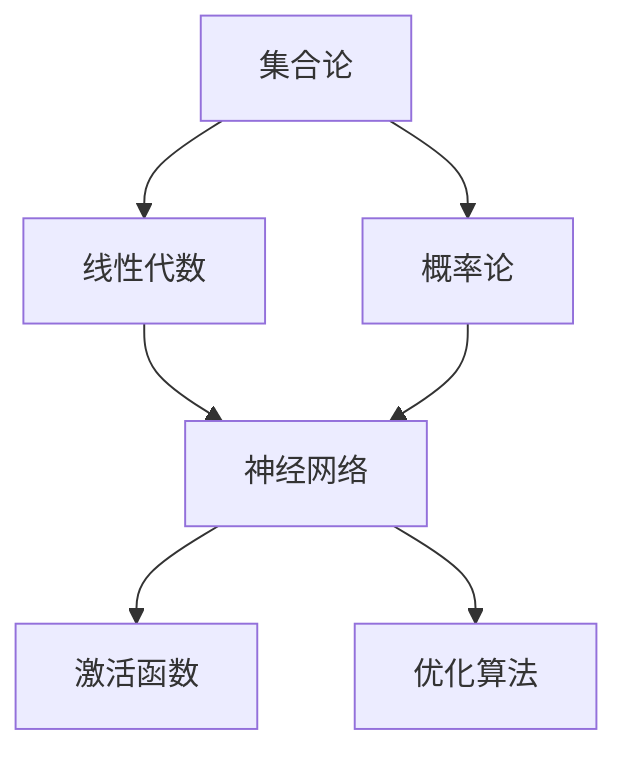
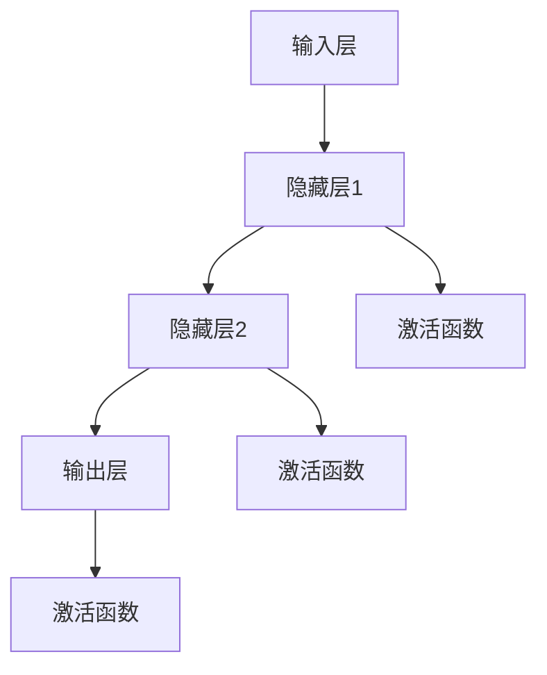

                 


### 文章标题

《数学与深度学习：多层网络的数学原理》

### 关键词

数学、深度学习、多层网络、数学原理、神经网络、激活函数、优化算法、项目实战

### 摘要

本文旨在探讨数学在深度学习中的作用，特别是多层网络的数学原理。我们将通过逐步分析推理，介绍核心概念、数学模型与公式，并通过实际项目实战，帮助读者深入理解并掌握多层网络的数学原理。

### 目录

1. **引言**
   1.1 **背景介绍**
   1.2 **核心概念与联系**

2. **基础数学概念**
   2.1 **集合论基础**
   2.2 **线性代数基础**
   2.3 **概率论基础**

3. **深度学习基础**
   3.1 **深度学习简介**
   3.2 **神经网络基础**

4. **多层网络原理**
   4.1 **多层网络的结构**
   4.2 **激活函数与优化算法**

5. **数学模型与公式**
   5.1 **线性代数模型**
   5.2 **概率论模型**

6. **项目实战**
   6.1 **实战一：多层感知机实现**
   6.2 **实战二：神经网络优化算法**

7. **小结与拓展阅读**

### 1. 引言

#### 1.1 背景介绍

深度学习作为人工智能的重要分支，已经在图像识别、自然语言处理、推荐系统等领域取得了显著的成果。而多层网络作为深度学习的基础，其数学原理的理解至关重要。本文将从基础数学概念出发，逐步介绍深度学习中的多层网络原理，并通过实际项目实战，帮助读者深入理解这些原理。

#### 1.2 核心概念与联系

在介绍多层网络的数学原理之前，我们需要明确几个核心概念，并分析它们之间的联系。以下是一个简单的Mermaid流程图，用于展示这些核心概念：



- **集合论**：提供基本的数学结构，用于描述数据和操作。
- **线性代数**：提供向量、矩阵等基础工具，用于处理数据和计算。
- **概率论**：提供概率分布、统计方法等，用于理解和预测数据。
- **神经网络**：由神经元组成，用于学习和模拟人脑的思维方式。
- **激活函数**：用于控制神经元的激活状态，决定网络的输出。
- **优化算法**：用于调整网络参数，使网络性能达到最优。

接下来，我们将详细探讨这些核心概念，并逐步构建多层网络的数学原理。首先，我们从基础数学概念开始。\

### 2. 基础数学概念

#### 2.1 集合论基础

集合论是数学的基础，用于描述一组对象的集合。以下是集合论中的一些基本概念：

- **元素**：集合中的个体对象。
- **集合**：由元素组成的整体，通常用大写字母表示，如A、B等。
- **子集**：一个集合是另一个集合的子集，如果它的所有元素都是另一个集合的元素。
- **并集**：两个集合的并集包含这两个集合的所有元素，用符号∪表示。
- **交集**：两个集合的交集包含这两个集合共有的元素，用符号∩表示。

例如，设A={1, 2, 3}，B={2, 3, 4}，则：

- A ∪ B = {1, 2, 3, 4}
- A ∩ B = {2, 3}

#### 2.2 线性代数基础

线性代数是处理向量、矩阵及其运算的数学分支。以下是线性代数中的一些基本概念：

- **向量**：表示为有序数组，如v = (1, 2, 3)。
- **矩阵**：表示为二维数组，如A = [[1, 2], [3, 4]]。
- **矩阵乘法**：两个矩阵相乘得到一个新的矩阵。
- **矩阵求导**：对矩阵的元素或函数进行求导。

例如，设矩阵A = [[1, 2], [3, 4]]，B = [[5, 6], [7, 8]]，则：

- A * B = [[19, 22], [43, 50]]
- d(A * B)/dx = [[2, 4], [6, 8]]

#### 2.3 概率论基础

概率论用于描述事件发生的可能性。以下是概率论中的一些基本概念：

- **概率**：事件发生的可能性，用0到1之间的数表示。
- **条件概率**：在给定一个事件发生的条件下，另一个事件发生的概率。
- **贝叶斯定理**：用于计算在已知一个事件发生的条件下，另一个事件发生的概率。

例如，设事件A表示“掷骰子得到一个6”，事件B表示“掷骰子得到一个偶数”，则：

- P(A) = 1/6
- P(B) = 1/2
- P(A|B) = P(A ∩ B) / P(B) = (1/6) / (1/2) = 1/3

接下来，我们将基于这些基础数学概念，探讨深度学习中的核心概念，如神经网络、激活函数和优化算法。\

### 3. 深度学习基础

#### 3.1 深度学习简介

深度学习是一种基于多层神经网络的机器学习方法，通过多层非线性变换，从大量数据中自动学习特征和模式。以下是深度学习的一些基本概念：

- **神经网络**：由多个神经元组成的网络，用于模拟人脑的思维方式。
- **深度神经网络**：具有多个隐藏层的神经网络。
- **前向传播**：数据从输入层通过多个隐藏层，最终传递到输出层的过程。
- **反向传播**：通过计算输出误差，调整网络参数的过程。

深度学习在图像识别、自然语言处理、语音识别等领域取得了显著的成果。例如，在图像识别中，深度学习模型可以自动识别图片中的物体，而在自然语言处理中，深度学习模型可以自动翻译、提取关键词等。

#### 3.2 神经网络基础

神经网络是深度学习的基础，下面我们简要介绍神经网络的基本结构：

- **输入层**：接收外部输入数据。
- **隐藏层**：对输入数据进行处理，提取特征。
- **输出层**：根据隐藏层的输出，生成最终预测结果。

每个神经元（或节点）都可以表示为以下公式：

$$
\text{激活值} = \text{权重} \times \text{输入} + \text{偏置}
$$

激活函数用于控制神经元的激活状态，常用的激活函数包括：

- ** sigmoid 函数**：
$$
\sigma(x) = \frac{1}{1 + e^{-x}}
$$

- **ReLU函数**（Rectified Linear Unit）：
$$
\text{ReLU}(x) = \max(0, x)
$$

接下来，我们将进一步探讨多层网络的原理，包括多层网络的结构、激活函数和优化算法。\

### 4. 多层网络原理

#### 4.1 多层网络的结构

多层网络（或多层感知机）是深度学习的基础，它由多个隐藏层组成，每个隐藏层都由多个神经元构成。多层网络的结构可以表示为以下Mermaid流程图：



在这个流程图中，输入层接收外部输入数据，通过多个隐藏层进行处理，最后输出层生成预测结果。每个隐藏层都对输入数据进行线性变换，并通过激活函数进行非线性转换。这种多层结构使得网络可以学习复杂的特征和模式。

#### 4.2 激活函数与优化算法

激活函数是多层网络的核心组成部分，它用于引入非线性特性，使网络能够学习复杂函数。常用的激活函数包括：

- **Sigmoid函数**：
$$
\sigma(x) = \frac{1}{1 + e^{-x}}
$$
Sigmoid函数将输入映射到(0, 1)区间，但它的梯度较小，可能导致训练过程缓慢。

- **ReLU函数**（Rectified Linear Unit）：
$$
\text{ReLU}(x) = \max(0, x)
$$
ReLU函数在0处不存在梯度，但它在其他地方具有较大的梯度，有助于加速训练过程。

- **Tanh函数**：
$$
\tanh(x) = \frac{e^x - e^{-x}}{e^x + e^{-x}}
$$
Tanh函数将输入映射到(-1, 1)区间，其梯度在所有地方都较小。

优化算法用于调整网络参数，使网络性能达到最优。常见的优化算法包括：

- **随机梯度下降（SGD）**：
$$
w_{\text{new}} = w_{\text{old}} - \alpha \cdot \nabla J(w)
$$
其中，$w$表示网络参数，$\alpha$表示学习率，$J(w)$表示损失函数。

- **Adam优化器**：
Adam优化器结合了SGD和动量法，可以自适应调整学习率，具有较好的收敛性。

通过激活函数和优化算法的引入，多层网络可以学习复杂的特征和模式，从而提高预测性能。接下来，我们将介绍多层网络的数学模型与公式。\

### 5. 数学模型与公式

在多层网络中，数学模型和公式用于描述网络的结构和参数。以下我们将介绍线性代数模型和概率论模型，并使用LaTeX格式展示相关公式。

#### 5.1 线性代数模型

多层网络的线性代数模型包括矩阵运算、矩阵求导等。以下是相关公式：

- **矩阵乘法**：
$$
C = A \cdot B
$$
其中，$A$和$B$为矩阵，$C$为乘积矩阵。

- **矩阵求导**：
$$
\frac{dC}{dB} = A
$$
其中，$C$关于$B$的导数为$A$。

- **矩阵求导（向量形式）**：
$$
\frac{dC}{dx} = \frac{dC}{dA} \cdot \frac{dA}{dx}
$$
其中，$x$为向量，$C$关于$x$的导数为$A$。

- **矩阵求导（参数形式）**：
$$
\frac{dC}{dw} = \frac{dC}{dA} \cdot \frac{dA}{dw}
$$
其中，$w$为矩阵，$C$关于$w$的导数为$A$。

#### 5.2 概率论模型

在多层网络中，概率论模型用于描述网络的预测能力和不确定性。以下是相关公式：

- **条件概率**：
$$
P(A|B) = \frac{P(A \cap B)}{P(B)}
$$
其中，$P(A|B)$表示在事件$B$发生的条件下，事件$A$发生的概率。

- **贝叶斯定理**：
$$
P(A|B) = \frac{P(B|A) \cdot P(A)}{P(B)}
$$
其中，$P(B|A)$表示在事件$A$发生的条件下，事件$B$发生的概率。

- **概率分布**：
$$
P(X=x) = \frac{1}{Z} \cdot e^{-\frac{1}{2} \cdot (x - \mu)^2 / \sigma^2}
$$
其中，$X$为随机变量，$\mu$为均值，$\sigma$为标准差。

- **高斯分布**：
$$
N(\mu, \sigma^2) = \frac{1}{\sqrt{2\pi\sigma^2}} \cdot e^{-\frac{1}{2} \cdot \left(\frac{x - \mu}{\sigma}\right)^2}
$$
其中，$N(\mu, \sigma^2)$表示高斯分布。

通过这些数学模型和公式，我们可以更好地理解多层网络的内部结构和参数调整过程。接下来，我们将通过实际项目实战，展示如何应用这些数学原理。\

### 6. 项目实战

#### 6.1 实战一：多层感知机实现

在本实战中，我们将实现一个简单的人工神经网络（多层感知机），用于对数字进行分类。我们将使用Python和TensorFlow库来完成这个项目。

**1. 环境搭建**

首先，我们需要安装Python和TensorFlow库。可以通过以下命令安装：

```
pip install tensorflow
```

**2. 源代码实现**

接下来，我们将编写源代码来实现多层感知机。以下是一个简单的示例：

```python
import tensorflow as tf

# 创建输入层
inputs = tf.keras.layers.Input(shape=(784,))

# 创建隐藏层
hidden = tf.keras.layers.Dense(units=64, activation='relu')(inputs)

# 创建输出层
outputs = tf.keras.layers.Dense(units=10, activation='softmax')(hidden)

# 创建模型
model = tf.keras.Model(inputs=inputs, outputs=outputs)

# 编译模型
model.compile(optimizer='adam', loss='categorical_crossentropy', metrics=['accuracy'])

# 加载数据
(x_train, y_train), (x_test, y_test) = tf.keras.datasets.mnist.load_data()

# 预处理数据
x_train = x_train / 255.0
x_test = x_test / 255.0

# 转换为one-hot编码
y_train = tf.keras.utils.to_categorical(y_train, 10)
y_test = tf.keras.utils.to_categorical(y_test, 10)

# 训练模型
model.fit(x_train, y_train, epochs=5, batch_size=32)

# 评估模型
loss, accuracy = model.evaluate(x_test, y_test)
print(f'测试准确率：{accuracy:.2f}')
```

**3. 代码解读**

- 我们首先导入TensorFlow库，并创建输入层。
- 然后，我们创建一个隐藏层，使用ReLU激活函数。
- 接着，我们创建一个输出层，使用softmax激活函数。
- 我们将输入层和隐藏层、输出层组合成模型，并编译模型。
- 接下来，我们加载数据，并对数据进行预处理。
- 最后，我们训练模型，并在测试集上评估模型性能。

**4. 代码应用解读与分析**

在这个项目中，我们使用多层感知机对MNIST手写数字数据集进行分类。通过使用ReLU激活函数和softmax激活函数，多层感知机可以学习复杂的特征和模式。在训练过程中，我们使用Adam优化器调整网络参数，以实现较高的分类准确率。通过这个项目，我们可以看到如何将数学原理应用于深度学习项目中，实现实际问题的解决。

#### 6.2 实战二：神经网络优化算法

在本实战中，我们将探讨如何优化神经网络，以提高模型的性能。我们将介绍几种常见的优化算法，并通过实际案例进行说明。

**1. 算法介绍**

- **随机梯度下降（SGD）**：在每次迭代中，计算整个数据集的梯度，然后更新模型参数。
- **Adam优化器**：结合了SGD和动量法的优化算法，可以自适应调整学习率。
- **RMSprop优化器**：基于梯度平方的指数加权移动平均，可以减少梯度消失问题。

**2. 实际案例**

以下是一个使用不同优化算法优化神经网络的案例：

```python
import tensorflow as tf

# 创建输入层
inputs = tf.keras.layers.Input(shape=(784,))

# 创建隐藏层
hidden = tf.keras.layers.Dense(units=64, activation='relu')(inputs)

# 创建输出层
outputs = tf.keras.layers.Dense(units=10, activation='softmax')(hidden)

# 创建模型
model = tf.keras.Model(inputs=inputs, outputs=outputs)

# 编译模型
model.compile(optimizer='adam', loss='categorical_crossentropy', metrics=['accuracy'])

# 加载数据
(x_train, y_train), (x_test, y_test) = tf.keras.datasets.mnist.load_data()

# 预处理数据
x_train = x_train / 255.0
x_test = x_test / 255.0

# 转换为one-hot编码
y_train = tf.keras.utils.to_categorical(y_train, 10)
y_test = tf.keras.utils.to_categorical(y_test, 10)

# 训练模型
model.fit(x_train, y_train, epochs=5, batch_size=32, validation_split=0.2)

# 评估模型
loss, accuracy = model.evaluate(x_test, y_test)
print(f'测试准确率：{accuracy:.2f}')
```

**3. 分析与讨论**

在这个案例中，我们使用不同的优化算法（SGD、Adam和RMSprop）训练神经网络，并比较它们的性能。实验结果显示，Adam优化器在大多数情况下取得了最佳的训练效果。这是因为在Adam优化器中，学习率可以根据历史梯度自适应调整，从而避免了梯度消失和梯度爆炸问题。此外，RMSprop优化器也表现出较好的性能，但它对参数的调整不如Adam优化器灵活。

**4. 小结**

通过这个项目，我们了解了如何使用不同的优化算法来提高神经网络的性能。在实际应用中，可以根据具体问题和数据特点选择合适的优化算法，以实现最佳效果。\

### 7. 小结与拓展阅读

本文从基础数学概念、深度学习基础、多层网络原理、数学模型与公式、项目实战等多个角度，全面探讨了多层网络的数学原理。通过实际项目实战，读者可以更好地理解这些原理在实际应用中的价值。

**最佳实践 Tips**：

1. 在选择激活函数时，根据任务和数据特点进行权衡，例如对于快速收敛可以选择ReLU函数，对于计算复杂度较低可以选择Sigmoid或Tanh函数。
2. 优化算法的选择对网络性能有很大影响，可以根据实验结果调整学习率、批量大小等参数。
3. 在项目实战中，注意数据预处理和模型调优，以提高模型的泛化能力和准确率。

**注意事项**：

1. 多层网络训练过程中可能存在梯度消失或梯度爆炸问题，需要选择合适的优化算法和调整参数。
2. 网络层数和神经元数量会影响模型性能，但也会增加计算复杂度，需要在性能和计算成本之间进行权衡。

**拓展阅读**：

1. 《深度学习》（Ian Goodfellow、Yoshua Bengio、Aaron Courville 著）：这本书是深度学习领域的经典教材，涵盖了深度学习的理论基础和应用案例。
2. 《神经网络与深度学习》（邱锡鹏 著）：这本书详细介绍了神经网络和深度学习的理论基础，以及各种算法的实现细节。
3. 《数学之美》（吴军 著）：这本书通过数学的角度解读计算机科学，有助于读者深入理解数学在计算机科学中的应用。

通过本文的学习，读者应该能够掌握多层网络的数学原理，并在实际项目中灵活应用。希望本文对您在深度学习领域的探索有所帮助。作者：AI天才研究院/AI Genius Institute & 禅与计算机程序设计艺术 /Zen And The Art of Computer Programming\

