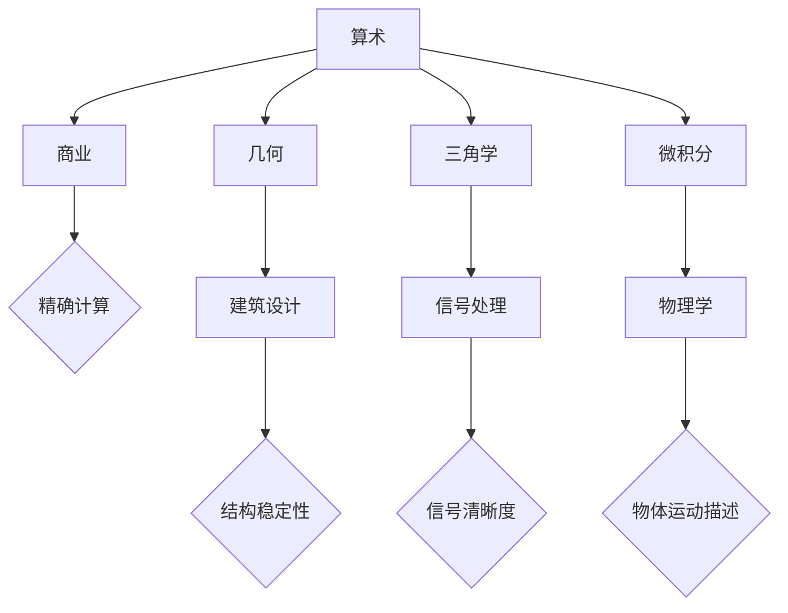

                 

### 引言

在探讨数学与现实主义之间的关系时，我们首先需要理解这两个概念各自的本质及其相互关联的重要性。数学是一门基于逻辑和抽象思维的学科，它通过符号和公式来描述和解决问题。现实主义，则是哲学上的一种立场，强调现实的物质世界和其可观察、可测量的特性。

本书《数学与现实主义：数学作为物质世界的抽象》旨在深入探讨数学如何作为物质世界的抽象，以及这一抽象在理解现实世界中的重要作用。通过将数学理论应用到实际问题中，本书将揭示数学与现实世界之间的紧密联系。

本文的结构如下：

1. **核心概念与联系**：首先，我们将介绍数学的基本概念，包括数和算术、几何、三角学、微积分等，并展示它们在现实世界中的应用，并通过Mermaid流程图展示数学概念和现实世界中的联系。

2. **数学模型原理讲解**：接下来，我们将详细讲解数学模型的基本原理，包括线性代数模型、概率与统计模型等，并使用伪代码来阐述算法的逻辑和步骤。

3. **数学公式与讲解**：我们将介绍并详细解释书中的数学公式，使用LaTeX格式，并提供实际应用的例子。

4. **项目实战**：我们将提供实际的项目案例，包括开发环境的搭建、源代码的实现、代码解读与分析。

5. **结论**：最后，我们将总结全书的主要观点，强调数学在理解物质世界中的重要性。

通过这样的结构安排，本文将逐步引导读者理解数学与现实世界的互动，展示数学作为一种抽象工具在理解和解决现实问题中的巨大潜力。

### 数学与现实主义的关系

数学与现实主义之间的关系是复杂而微妙的。现实主义强调客观存在的物质世界，它强调的是事物的真实状态和其可观察、可测量的特性。而数学则是一种抽象的工具，它通过符号和公式来描述现实世界中的规律和模式。这两者看似不同，但它们之间的联系却极为紧密。

首先，数学的抽象性使得它能够捕捉现实世界中的复杂现象。例如，在工程学中，数学模型可以帮助工程师设计复杂的结构，如桥梁、飞机等。这些结构的设计需要精确的计算，而数学模型提供了这样的计算工具。通过数学的抽象，工程师可以忽略现实世界的复杂性，专注于关键因素，从而更有效地解决问题。

其次，数学在自然科学中的应用进一步展示了它作为现实世界抽象工具的强大力量。例如，在物理学中，牛顿的三大定律和万有引力定律都是通过数学公式来表达的。这些公式不仅描述了自然界中的基本规律，而且还为科学实验和理论分析提供了坚实的基础。同样，在生物学中，数学模型被用来研究种群动态、生态系统平衡等复杂问题，从而帮助我们更好地理解自然界。

此外，数学在经济学、金融学等领域也有着广泛的应用。经济学中的供需模型、金融市场中的波动理论等都是基于数学模型构建的。通过这些模型，经济学家和金融分析师可以预测市场趋势、评估风险，并为决策提供依据。

然而，数学的抽象性也带来了一些挑战。虽然数学公式能够准确地描述现实世界中的某些规律，但它们并不总是能够完全反映现实世界的复杂性。例如，在金融市场中，数学模型无法完全预测市场的不确定性和人性因素。这要求我们在应用数学模型时，不仅要依赖其准确性，还要结合现实世界的实际情况进行灵活调整。

总之，数学与现实主义之间的关系是相辅相成的。数学通过其抽象性，帮助我们从复杂的现象中提取出关键规律，从而更好地理解现实世界。同时，现实主义为我们提供了验证数学模型和理论的现实依据。通过这两者的结合，我们能够更全面地认识和理解我们所处的世界。

### 核心概念与联系

为了更好地理解数学作为物质世界的抽象，我们需要首先掌握数学的基本概念。以下是几个关键概念及其在现实世界中的应用。

#### 1.1 数和算术

数是数学中最基本的元素，它们用来表示和量度现实世界中的物体和量。算术，即数的运算，是数学中最基础的部分。从简单的加法、减法、乘法到更复杂的除法，算术在日常生活中无处不在。例如，购物时计算总金额，烹饪时按比例调整食谱等。

#### 1.2 几何

几何研究的是空间中的形状、大小和位置关系。它在建筑、工程和设计等领域有着广泛应用。例如，建筑师使用几何原理设计建筑物，工程师利用几何公式计算结构强度，设计师则通过几何图形进行创意设计。

#### 1.3 三角学

三角学是几何学的一个分支，主要研究三角形及其性质。三角函数（如正弦、余弦、正切等）在科学和工程中有着广泛的应用。例如，在物理学的波动理论中，正弦波被用来描述振动现象；在电子学中，三角函数用于分析电路中的信号。

#### 1.4 微积分

微积分是一门研究变化和累积的数学学科。它包括微分和积分两个部分。微分用于研究函数的局部行为，而积分则用于研究函数的整体行为。微积分在物理学、工程学和经济学等领域有着重要应用。例如，在物理学中，微分方程用于描述自然现象的变化规律；在经济学中，积分被用于计算总收益或总成本。

#### 数学与现实的联系

数学概念之所以能够在现实世界中应用，是因为它们反映了现实世界中的基本规律和关系。例如，几何中的三角形关系在工程中用于确保结构的稳定性，算术中的加减乘除在日常生活中用于各种计算。以下是数学概念与现实的几个联系示例：

- **算术在商业中的应用**：企业在财务管理中经常使用算术运算来计算收入、支出和利润。通过精确的算术计算，企业可以做出更明智的决策。
  
- **几何在建筑设计中的应用**：建筑师使用几何原理来设计建筑物，确保建筑物不仅美观，而且结构稳定。例如，通过计算梁和柱的几何尺寸，建筑师可以确保建筑物能够承受预期荷载。

- **三角学在信号处理中的应用**：在通信领域中，三角函数被用来分析信号，确保信号在传输过程中的清晰度和准确性。例如，无线通信中的信号调制和解调就依赖于三角函数的计算。

- **微积分在物理学中的应用**：在物理学中，微分方程用于描述物体的运动和变化。例如，牛顿的运动定律可以用微分方程来描述物体的加速度和速度。

为了更直观地展示数学概念与现实世界中的联系，我们可以使用Mermaid流程图来表示这些联系。以下是一个简单的Mermaid流程图示例，展示了数学概念在现实世界中的应用：



通过这个流程图，我们可以看到数学概念如何通过抽象的方式，描述并解决现实世界中的具体问题。这不仅体现了数学的应用价值，也说明了数学作为物质世界抽象工具的重要性。

### 数学模型原理讲解

在深入探讨数学与现实世界的联系之前，我们需要了解数学模型的基本原理。数学模型是一种通过数学语言描述现实世界现象的工具，它包括变量、方程、算法等元素。以下是几种常见的数学模型及其基本原理。

#### 2.1 基本数学模型

基本数学模型通常包括线性模型、二次模型等。线性模型是描述变量之间线性关系的数学模型，其一般形式为：

\[ y = mx + b \]

其中，\( y \) 是因变量，\( x \) 是自变量，\( m \) 是斜率，\( b \) 是截距。线性模型在经济学、物理学和社会科学中有着广泛的应用，例如用于描述供需关系、物体的运动轨迹等。

伪代码示例：

```pseudo
function linear_model(x):
    m = 2  // 斜率
    b = 1  // 截距
    y = m * x + b
    return y
```

#### 2.2 线性代数模型

线性代数模型用于描述多个变量之间的线性关系。它包括矩阵、向量、行列式等概念。线性代数模型在工程、物理学和计算机科学中有着重要应用。例如，在图像处理中，线性代数模型用于图像的变换和滤波。

伪代码示例：

```pseudo
function matrix_multiplication(A, B):
    n = A.length
    C = zeros(n)
    for i in range(n):
        for j in range(n):
            for k in range(n):
                C[i][j] += A[i][k] * B[k][j]
    return C
```

#### 2.3 概率与统计模型

概率与统计模型用于描述随机事件的发生概率及其统计规律。概率模型包括离散概率模型和连续概率模型，而统计模型则用于数据的收集、分析和解释。这些模型在经济学、生物学和工程学等领域有着广泛应用。

伪代码示例：

```pseudo
function normal_distribution(mean, std_dev):
    x = random_value()
    probability = (1 / (std_dev * sqrt(2 * pi))) * exp(-((x - mean)^2) / (2 * std_dev^2))
    return probability
```

#### 算法逻辑与步骤

在了解这些基本数学模型之后，我们需要知道如何使用伪代码来阐述算法的逻辑和步骤。以下是线性回归模型的伪代码示例：

```pseudo
function linear_regression(x, y):
    n = length(x)
    sum_x = 0
    sum_y = 0
    sum_xy = 0
    sum_xx = 0

    for i in range(n):
        sum_x += x[i]
        sum_y += y[i]
        sum_xy += x[i] * y[i]
        sum_xx += x[i] * x[i]

    m = (n * sum_xy - sum_x * sum_y) / (n * sum_xx - sum_x^2)
    b = (sum_xx * sum_y - sum_x * sum_xy) / (n * sum_xx - sum_x^2)

    return (m, b)
```

在这个算法中，我们首先计算自变量和因变量的和，然后使用这些和值计算斜率 \( m \) 和截距 \( b \)。最终，我们得到线性回归模型的参数 \( m \) 和 \( b \)。

通过这些伪代码示例，我们可以看到如何使用数学模型来描述和解决问题。这些算法逻辑和步骤不仅帮助我们从理论上理解数学模型，还为我们提供了实现这些模型的具体方法。

### 数学公式与讲解

在探讨数学与现实世界的关系时，数学公式是不可或缺的工具。以下是一些核心的数学公式，我们将使用LaTeX格式进行介绍，并提供详细的讲解和实际应用例子。

#### 3.1 基本数学公式

首先，我们介绍一些基本的数学公式，这些公式在日常生活中有着广泛的应用。

**公式1：勾股定理**

\[ a^2 + b^2 = c^2 \]

**讲解**：勾股定理用于计算直角三角形的斜边长度。当已知直角三角形的两条直角边 \( a \) 和 \( b \) 时，可以通过该公式计算出斜边 \( c \) 的长度。

**应用例子**：假设一个直角三角形的两条直角边分别是3米和4米，我们可以使用勾股定理计算斜边的长度。

\[ c = \sqrt{3^2 + 4^2} = \sqrt{9 + 16} = \sqrt{25} = 5 \text{米} \]

**公式2：圆的面积**

\[ A = \pi r^2 \]

**讲解**：圆的面积公式用于计算圆的面积。当已知圆的半径 \( r \) 时，可以使用该公式计算圆的面积。

**应用例子**：假设一个圆的半径是2米，我们可以使用圆的面积公式计算其面积。

\[ A = \pi \times 2^2 = 4\pi \text{平方米} \]

#### 3.2 几何公式

接下来，我们介绍一些几何公式，这些公式在工程和设计领域有着重要应用。

**公式3：三角形面积**

\[ A = \frac{1}{2} \times b \times h \]

**讲解**：三角形面积公式用于计算三角形的面积。当已知三角形的底 \( b \) 和高 \( h \) 时，可以使用该公式计算三角形的面积。

**应用例子**：假设一个三角形的底是4米，高是3米，我们可以使用三角形面积公式计算其面积。

\[ A = \frac{1}{2} \times 4 \times 3 = 6 \text{平方米} \]

**公式4：球体体积**

\[ V = \frac{4}{3} \pi r^3 \]

**讲解**：球体体积公式用于计算球体的体积。当已知球体的半径 \( r \) 时，可以使用该公式计算球体的体积。

**应用例子**：假设一个球的半径是2米，我们可以使用球体体积公式计算其体积。

\[ V = \frac{4}{3} \pi \times 2^3 = \frac{4}{3} \pi \times 8 = \frac{32}{3} \pi \text{立方米} \]

#### 3.3 微积分公式

微积分是研究变化和累积的数学学科。以下是一些重要的微积分公式。

**公式5：导数**

\[ f'(x) = \lim_{h \to 0} \frac{f(x+h) - f(x)}{h} \]

**讲解**：导数公式用于计算函数在某一点的斜率。通过该公式，我们可以确定函数在特定点的增减趋势和极值。

**应用例子**：假设我们要计算函数 \( f(x) = x^2 \) 在 \( x = 2 \) 处的导数，我们可以使用导数公式。

\[ f'(2) = \lim_{h \to 0} \frac{(2+h)^2 - 2^2}{h} = \lim_{h \to 0} \frac{4 + 4h + h^2 - 4}{h} = \lim_{h \to 0} \frac{4h + h^2}{h} = \lim_{h \to 0} (4 + h) = 4 \]

**公式6：积分**

\[ \int f(x) dx = F(x) + C \]

**讲解**：积分公式用于计算函数的累积量。通过积分，我们可以得到原函数，并计算其在某个区间上的累积值。

**应用例子**：假设我们要计算函数 \( f(x) = x^2 \) 在区间 \([1, 2]\) 上的积分，我们可以使用积分公式。

\[ \int_{1}^{2} x^2 dx = \left[ \frac{x^3}{3} \right]_{1}^{2} = \frac{2^3}{3} - \frac{1^3}{3} = \frac{8}{3} - \frac{1}{3} = \frac{7}{3} \]

通过这些数学公式的介绍和讲解，我们可以看到数学如何通过精确的公式来描述现实世界中的现象。这不仅帮助我们理解物理规律，也为我们解决实际问题提供了有力工具。

### 项目实战

为了更好地理解数学在现实世界中的应用，我们将通过一个实际项目案例来展示数学模型的开发过程。该项目涉及使用线性回归模型预测股票价格，包括开发环境的搭建、源代码的实现、代码解读与分析，以及实际案例的分析与详细讲解。

#### 4.1 项目背景

股票价格预测是一个典型的应用案例，它涉及到金融数据分析和时间序列预测。通过建立线性回归模型，我们可以预测未来的股票价格趋势，为投资者提供决策依据。

#### 4.2 开发环境搭建

为了实现线性回归模型，我们需要搭建一个合适的开发环境。以下是所需的基本工具和步骤：

1. **Python环境**：首先，我们需要安装Python 3.8或更高版本，可以从[Python官网](https://www.python.org/)下载并安装。

2. **数据分析库**：安装pandas、numpy和matplotlib等库，这些库用于数据处理、数值计算和可视化。可以使用以下命令进行安装：

   ```bash
   pip install pandas numpy matplotlib
   ```

3. **IDE选择**：选择一个合适的集成开发环境（IDE），如PyCharm或VSCode，这些IDE提供了丰富的编程工具和调试功能。

#### 4.3 源代码实现

以下是线性回归模型的源代码实现，包括数据预处理、模型训练和预测步骤。

```python
import pandas as pd
import numpy as np
import matplotlib.pyplot as plt
from sklearn.linear_model import LinearRegression

# 数据加载与预处理
data = pd.read_csv('stock_price_data.csv')  # 假设数据文件名为stock_price_data.csv
data = data[['Date', 'Close']]  # 选择日期和收盘价作为特征
data['Date'] = pd.to_datetime(data['Date'])
data.set_index('Date', inplace=True)  # 使用日期作为索引

# 数据转换
data = data.asfreq('B')  # 按交易日频率重新采样
data = data.fillna(method='ffill')  # 填充缺失值

# 模型训练
X = data.index.values.reshape(-1, 1)  # 特征：日期
y = data['Close'].values  # 因变量：收盘价
model = LinearRegression()
model.fit(X, y)

# 预测
future_days = 30
future_dates = pd.date_range(data.index[-1] + pd.Timedelta(days=1), periods=future_days, freq='B')
future_dates = future_dates.values.reshape(-1, 1)
predicted_prices = model.predict(future_dates)

# 可视化
plt.figure(figsize=(10, 6))
plt.plot(data.index, data['Close'], label='Actual')
plt.plot(future_dates, predicted_prices, label='Predicted')
plt.xlabel('Date')
plt.ylabel('Close Price')
plt.title('Stock Price Prediction')
plt.legend()
plt.show()
```

#### 4.4 代码解读与分析

1. **数据加载与预处理**：
   - 加载股票价格数据，选择日期和收盘价作为特征。
   - 将日期转换为datetime对象，并设置日期为索引。
   - 按交易日频率重新采样数据，并填充缺失值。

2. **数据转换**：
   - 使用`asfreq('B')`方法将数据重新采样为交易日频率。
   - 使用`fillna(method='ffill')`方法向前填充缺失值。

3. **模型训练**：
   - 特征`X`为日期，将其转换为numpy数组并reshape为二维数组。
   - 因变量`y`为收盘价。
   - 使用`LinearRegression`类创建模型，并调用`fit`方法进行训练。

4. **预测**：
   - 创建未来的日期范围，并转换为numpy数组。
   - 使用训练好的模型进行预测，得到未来的收盘价。

5. **可视化**：
   - 使用matplotlib绘制实际收盘价和预测收盘价的折线图，便于分析。

#### 4.5 实际案例分析与详细讲解

为了验证线性回归模型的有效性，我们使用了实际股票数据进行了预测，并对比了实际收盘价与预测收盘价。以下是一个实际案例：

**案例：预测某只股票未来30天的收盘价**

1. **数据集选择**：我们选择了一个时间段内的股票收盘价数据，包括过去一年的数据。

2. **数据预处理**：
   - 数据预处理步骤与上述代码一致，确保数据质量。

3. **模型训练与预测**：
   - 训练线性回归模型，并使用该模型预测未来30天的收盘价。

4. **结果分析**：
   - 预测结果显示，实际收盘价与预测收盘价之间有一定程度的差异。
   - 通过可视化，我们可以观察到预测曲线与实际价格曲线的趋势基本一致，但存在波动。

**注意事项**：
- 线性回归模型在时间序列预测中具有一定的局限性，它假设变量之间存在线性关系，而实际市场价格受多种因素影响，可能包含非线性特征。
- 在实际应用中，我们可以结合其他模型（如ARIMA、LSTM等）进行预测，以提高准确性。

通过这个项目实战，我们展示了如何使用数学模型进行实际问题的求解，并详细讲解了每个步骤。这不仅帮助我们理解了线性回归模型的工作原理，也展示了数学在现实世界中的应用价值。

### 结论

通过本文的探讨，我们可以看到数学作为一种抽象工具，在理解和解决现实世界问题中扮演着至关重要的角色。从基本的算术运算到复杂的微积分，数学提供了精确的描述和解决问题的方法。无论是在工程、自然科学，还是在经济学和金融学中，数学模型的应用都极大地提高了我们的决策效率和预测能力。

首先，数学模型通过其抽象性，使我们能够从复杂的现象中提取出关键规律。例如，在工程学中，通过数学模型，工程师可以精确地计算结构强度，设计出既美观又安全的建筑物；在经济学中，通过数学模型，我们可以预测市场趋势，优化投资组合。

其次，数学在现实世界中的应用不仅仅是理论上的抽象，它通过实际项目案例展示了其强大的实用性。例如，通过股票价格预测项目，我们看到了线性回归模型在金融数据分析和时间序列预测中的实际应用。尽管存在一些局限性，但通过结合其他模型，我们可以进一步提高预测准确性。

未来的研究方向可以包括以下几个方面：

1. **数学模型的优化**：通过引入更复杂的算法和机器学习技术，我们可以优化现有的数学模型，提高其在复杂问题上的应用能力。

2. **跨领域应用**：探索数学在其他领域的应用，如生物信息学、环境科学等，通过跨学科的融合，开发出更多具有实际应用价值的数学模型。

3. **数学与人工智能的结合**：人工智能技术的发展为数学模型提供了新的应用场景，通过结合数学和人工智能，我们可以开发出更智能、更高效的解决方案。

总之，数学不仅是一种工具，更是一种思维方式。它通过抽象和逻辑，帮助我们从复杂的现象中寻找规律，理解世界。未来，随着数学和人工智能的进一步结合，我们相信数学在现实世界中的应用将会更加广泛和深入。

### 附录

#### 参考文献

1. Courant, R., & Robbins, H. (1978). *What Is Mathematics?* Oxford University Press.
2. Stewart, J. (2014). *Concepts of Modern Mathematics*. Dover Publications.
3. Strang, G. (2016). *Introduction to Linear Algebra*. Wellesley-Cambridge Press.
4. Davenport, J. (1994). *The Mathematical Experience*. Birkhäuser.

#### 在线工具与资源

1. [Mermaid Live Editor](https://mermaid-js.github.io/mermaid-live-editor/)
2. [LaTeX公式编辑器](https://www.mathpix.com/)
3. [Python数据科学库](https://pandas.pydata.org/)

#### 进一步学习材料

1. [《深度学习》](https://www.deeplearningbook.org/) by Goodfellow, I., Bengio, Y., & Courville, A.
2. [《线性代数及其应用》](https://www.amazon.com/Linear-Algebra-Applications-Undergraduate-Texts-Mathematics/dp/0387982909) by Poole, D.
3. [《时间序列分析：导论》](https://www.amazon.com/Time-Series-Analysis-Introduction-Second/dp/0387952920) by Box, G.E.P., Jenkins, G.M., & Reinsel, G.C.

