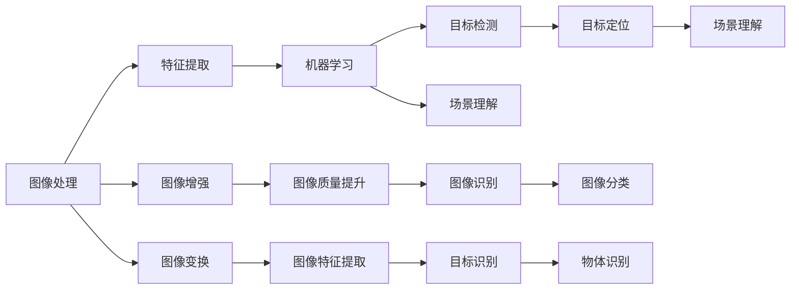

                 

## 文章标题：数学与计算机视觉：图像理解的数学方法

### 关键词：计算机视觉、图像理解、数学方法、图像处理、算法

> 摘要：本文深入探讨了数学在计算机视觉中的应用，重点分析了图像理解的数学方法，包括图像处理基础、核心算法原理、数学模型和公式，以及实际应用案例分析。通过本文的阅读，读者可以全面了解计算机视觉领域的数学工具和技术，为深入研究和实践打下坚实基础。

### 引言

计算机视觉是人工智能领域的一个重要分支，其目标是通过机器感知和理解图像信息，实现与人类视觉系统相似的功能。随着深度学习、神经网络等技术的发展，计算机视觉在图像识别、目标检测、图像分割等领域取得了显著成果。然而，这些成就的背后离不开数学的支撑。数学方法为计算机视觉提供了强大的工具和理论基础，使得复杂的问题能够通过精确的数学模型得到有效的解决。

本文旨在介绍数学在计算机视觉中的应用，特别是图像理解的数学方法。我们将从图像处理基础开始，逐步深入探讨图像处理算法、核心算法原理、数学模型和公式，并辅以实际应用案例分析，帮助读者全面了解计算机视觉领域的数学工具和技术。

### 目录大纲

1. 引言和背景介绍
   - 1.1 引言
   - 1.2 背景知识

2. 核心概念与联系
   - 2.1 图像理解的数学方法

3. 图像处理基础
   - 3.1 图像处理的基本概念
   - 3.2 图像处理算法

4. 计算机视觉算法
   - 4.1 特征提取
   - 4.2 目标检测

5. 数学模型和方法
   - 5.1 线性代数在图像处理中的应用
   - 5.2 概率论与数理统计在图像理解中的应用

6. 实际应用案例分析
   - 6.1 图像识别案例
   - 6.2 目标追踪案例

7. 总结与展望
   - 7.1 总结
   - 7.2 展望

接下来，我们将按照目录大纲的结构，逐一详细阐述每个部分的内容。通过逐步分析推理，帮助读者深入理解数学与计算机视觉之间的关系，掌握图像理解的数学方法。

### 1. 引言和背景介绍

#### 1.1 引言

计算机视觉的研究始于20世纪50年代，随着计算机技术和图像处理算法的发展，该领域逐渐成为人工智能领域的一个重要分支。计算机视觉的目标是通过计算机系统模拟人类视觉功能，实现从图像中提取信息、理解场景、识别物体等任务。然而，计算机视觉的实现离不开数学的支持。

数学在计算机视觉中的应用主要体现在以下几个方面：

1. **图像处理**：图像处理是计算机视觉的基础，涉及到图像的获取、预处理、增强、变换等操作。这些操作需要借助数学工具，如线性代数、概率论、数理统计等，来实现对图像的精确描述和操作。

2. **特征提取**：特征提取是计算机视觉的核心任务之一，目的是从图像中提取出对识别任务有用的信息。特征提取方法通常依赖于数学模型，如傅里叶变换、小波变换、主成分分析等。

3. **目标检测**：目标检测是计算机视觉中的一项重要任务，其目标是识别和定位图像中的目标物体。目标检测算法通常需要借助深度学习、神经网络等数学模型来提高检测的准确性和效率。

4. **图像理解**：图像理解是计算机视觉的高级阶段，其目标是理解图像中的场景、对象、动作等高层次信息。图像理解需要利用数学模型，如概率图模型、深度学习模型等，来实现对图像的语义理解。

数学在计算机视觉中的作用不仅限于理论支撑，它还提供了高效的算法和工具，使得计算机视觉的应用变得可能。例如，线性代数和矩阵计算在图像处理和特征提取中发挥了重要作用；概率论和数理统计为图像理解和目标检测提供了理论基础；深度学习和神经网络则借助数学模型实现了高效的图像识别和分类。

#### 1.2 背景知识

为了更好地理解数学在计算机视觉中的应用，我们需要具备一些背景知识，包括图像处理的基础知识、计算机视觉的应用领域等。

**图像处理基础知识**

图像处理是指利用数字计算机对图像进行各种处理，以改善图像质量、提取有用信息或生成新的图像。图像处理的基本概念包括：

1. **图像分辨率**：图像分辨率是指图像中像素的数量，通常以横向和纵向像素数的乘积表示。高分辨率图像具有更多的像素，因此图像细节更加丰富。

2. **像素与颜色空间**：像素是图像中最小的单位，每个像素包含一个或多个颜色值。颜色空间是描述图像颜色的一种方法，常见的颜色空间包括RGB、HSV、YUV等。

3. **图像增强**：图像增强是指通过调整图像的亮度、对比度、锐度等参数，提高图像的质量和视觉效果。

4. **图像变换**：图像变换是指将图像从一种表示形式转换为另一种表示形式，常见的图像变换包括傅里叶变换、小波变换、离散余弦变换等。

**计算机视觉的应用领域**

计算机视觉在许多领域都有广泛的应用，以下是一些典型的应用领域：

1. **图像识别**：图像识别是指通过计算机系统识别图像中的物体、场景、动作等。图像识别广泛应用于人脸识别、车牌识别、遥感图像处理等领域。

2. **目标检测**：目标检测是指识别和定位图像中的目标物体。目标检测广泛应用于无人驾驶、视频监控、医疗图像分析等领域。

3. **图像分割**：图像分割是指将图像划分为不同的区域，每个区域对应不同的物体或场景。图像分割在医学图像分析、图像识别等领域具有重要应用。

4. **场景理解**：场景理解是指通过计算机系统理解图像中的场景信息，包括场景布局、物体关系、动作等。场景理解在自动驾驶、机器人导航、智能监控等领域具有广泛应用。

通过介绍这些背景知识，我们为后续章节的深入讨论奠定了基础。在接下来的章节中，我们将详细介绍图像处理的数学方法、计算机视觉的核心算法原理、数学模型和公式，并通过实际应用案例分析，帮助读者全面了解数学在计算机视觉中的应用。

### 2. 核心概念与联系

在计算机视觉中，理解图像的数学方法至关重要。这一部分，我们将探讨图像理解的数学方法，并使用Mermaid流程图展示核心概念之间的联系。

#### 2.1 图像理解的数学方法

图像理解涉及多种数学工具和方法，主要包括：

1. **图像处理**：图像处理是图像理解的基础，包括图像的获取、预处理、增强、变换等。图像处理使用线性代数、概率论和数理统计等方法来操作和处理图像数据。

2. **特征提取**：特征提取是从图像中提取出对识别任务有用的信息。常见的特征提取方法包括傅里叶变换、小波变换、主成分分析等。

3. **机器学习**：机器学习是图像理解的核心方法之一，特别是深度学习。机器学习通过训练大量数据，自动学习图像中的特征和模式。

4. **目标检测和识别**：目标检测和识别是图像理解的高级任务，目的是识别和定位图像中的目标物体。目标检测方法包括滑动窗口、区域提议、深度学习等。

5. **场景理解**：场景理解是通过计算机系统理解图像中的场景信息，包括场景布局、物体关系、动作等。

#### 2.2 核心概念之间的联系

为了更好地理解这些核心概念之间的关系，我们可以使用Mermaid流程图来展示它们的联系。以下是一个简化的Mermaid流程图，展示了图像理解中的主要概念及其相互关系：



在这个流程图中，图像处理是整个流程的起点，它包括图像的获取、预处理、增强和变换。特征提取是将图像转换为一种更适合机器学习的形式。机器学习是图像理解的核心，它通过训练大量数据来学习图像中的特征和模式。目标检测和识别是图像理解的高级任务，目标检测用于识别和定位图像中的目标物体，而识别则是对这些目标进行分类和识别。场景理解是通过理解图像中的场景信息来实现更高层次的图像理解。

通过这个Mermaid流程图，我们可以清晰地看到图像理解的数学方法是如何相互关联和协作的。这种方法不仅帮助我们理解图像，还为开发先进的计算机视觉应用提供了理论基础和工具。

### 3. 图像处理基础

在深入探讨计算机视觉中的图像理解之前，我们需要了解图像处理的基础知识。图像处理是计算机视觉的核心组成部分，它涉及到图像的获取、预处理、增强和变换等操作。在这一部分，我们将详细介绍图像处理的基本概念和算法。

#### 3.1 图像处理的基本概念

图像处理的基本概念包括图像分辨率、像素、颜色空间和图像增强等。

1. **图像分辨率**：图像分辨率是指图像中像素的数量，通常以横向和纵向像素数的乘积表示。高分辨率图像包含更多的像素，因此图像细节更加丰富。分辨率越高，图像的质量越高，但文件大小也会相应增加。

2. **像素**：像素是图像中最小的单位，每个像素包含一个或多个颜色值。在数字图像中，像素通常以数字形式存储，其值通常用8位或更多位来表示。每个像素的颜色值可以是RGB（红绿蓝）值，也可以是HSV（色相、饱和度、亮度）值等。

3. **颜色空间**：颜色空间是描述图像颜色的一种方法，常见的颜色空间包括RGB、HSV、YUV等。RGB颜色空间使用红色、绿色和蓝色三个分量来描述颜色，而HSV颜色空间则使用色相、饱和度和亮度三个分量来描述颜色。YUV颜色空间是电视和视频领域常用的颜色空间。

4. **图像增强**：图像增强是指通过调整图像的亮度、对比度、锐度等参数，提高图像的质量和视觉效果。图像增强可以用于消除噪声、增强细节、改善图像的可读性等。常见的图像增强技术包括直方图均衡化、对比度增强、边缘检测等。

5. **图像变换**：图像变换是指将图像从一种表示形式转换为另一种表示形式。常见的图像变换包括傅里叶变换、小波变换、离散余弦变换等。图像变换可以用于图像压缩、图像滤波、图像识别等。

#### 3.2 图像处理算法

图像处理算法是实现图像理解和计算机视觉任务的关键。以下是一些常用的图像处理算法：

1. **图像增强**：

   - **直方图均衡化**：直方图均衡化是一种常用的图像增强技术，它通过调整图像的亮度分布，使图像的每个灰度级都得到均匀分布，从而提高图像的对比度。
     $$ H'(x) = \frac{1}{\sum_{x=0}^{255} f(x)} \sum_{y=0}^{255} f(y) \cdot \text{if } y \geq x $$
     其中，$H'(x)$是增强后的直方图，$f(x)$是原始直方图，$x$和$y$是图像的灰度值。

   - **对比度增强**：对比度增强通过调整图像的亮度值，增强图像中的对比度，使图像的细节更加清晰。常用的对比度增强方法包括线性对比度增强和指数对比度增强。
     $$ I'(x, y) = a \cdot I(x, y) + b $$
     其中，$I'(x, y)$是增强后的图像，$I(x, y)$是原始图像，$a$和$b$是对比度增强参数。

2. **边缘检测**：边缘检测是图像处理中的一种基本操作，它用于检测图像中的边缘和轮廓。常见的边缘检测算法包括Sobel算子、Canny算子、Prewitt算子等。

   - **Sobel算子**：Sobel算子使用两个方向的卷积核来检测水平方向和垂直方向的边缘。
     $$ G_x = \frac{1}{2} \left( G_{xx} + G_{xy} \right) $$
     $$ G_y = \frac{1}{2} \left( G_{yx} + G_{yy} \right) $$
     其中，$G_x$和$G_y$是边缘检测的结果，$G_{xx}$、$G_{xy}$、$G_{yx}$和$G_{yy}$是卷积操作的结果。

   - **Canny算子**：Canny算子是一种更加先进的边缘检测算法，它通过多步骤的滤波和阈值化操作来检测边缘。
     $$ I'(x, y) = \text{阈值化} \left( \text{非极大值抑制} \left( \text{双高斯滤波} \left( I(x, y) \right) \right) \right) $$

3. **图像滤波**：图像滤波是一种用于去除图像噪声和改善图像清晰度的技术。常见的图像滤波算法包括均值滤波、高斯滤波、中值滤波等。

   - **均值滤波**：均值滤波通过计算邻域内像素的平均值来替换中心像素的值，从而去除图像噪声。
     $$ I'(x, y) = \frac{1}{n} \sum_{i,j} I(x+i, y+j) $$
     其中，$I'(x, y)$是滤波后的图像，$I(x, y)$是原始图像，$n$是邻域内像素的数量。

   - **高斯滤波**：高斯滤波使用高斯分布作为卷积核，通过平滑图像来去除噪声。
     $$ G(x, y) = \frac{1}{2\pi\sigma^2} e^{-\frac{(x^2 + y^2)}{2\sigma^2}} $$
     其中，$G(x, y)$是高斯滤波器的系数，$\sigma$是高斯分布的标准差。

   - **中值滤波**：中值滤波通过计算邻域内像素的中值来替换中心像素的值，从而去除图像噪声。
     $$ I'(x, y) = \text{median} \left( I(x-i, y-j) \right) $$
     其中，$I'(x, y)$是滤波后的图像，$I(x, y)$是原始图像，$\text{median}$是中值计算函数。

通过介绍这些基本的图像处理概念和算法，我们为后续的图像理解和计算机视觉任务奠定了基础。在接下来的章节中，我们将进一步探讨计算机视觉中的核心算法原理和数学模型。

### 4. 计算机视觉算法

计算机视觉算法是图像理解和场景解析的关键，这些算法通过提取图像中的特征，实现目标的识别与定位。本节将详细探讨计算机视觉中的两大核心算法：特征提取和目标检测。

#### 4.1 特征提取

特征提取是计算机视觉中的重要步骤，它从原始图像中提取出具有区分性的特征，用于后续的识别和分类任务。特征提取可以分为频域方法和空域方法。

**频域方法**

频域方法通过将图像从空域转换到频域，从而提取出图像的频率信息。常见的频域特征提取方法包括傅里叶变换和小波变换。

- **傅里叶变换**：傅里叶变换是一种将图像从空域转换到频域的方法。通过傅里叶变换，我们可以得到图像的频率分布。傅里叶变换的伪代码如下：

  ```python
  def fourier_transform(image):
      # 对图像进行傅里叶变换
      F = fft2(image)
      return F
  ```

  通过傅里叶变换，我们可以提取出图像的频率信息，这些信息有助于我们识别图像中的周期性特征。

- **小波变换**：小波变换是一种更灵活的频域变换方法，它允许我们在不同的尺度上分析图像。小波变换的伪代码如下：

  ```python
  def wavelet_transform(image, scales):
      # 对图像进行小波变换
      W = wavedec2(image, scales)
      return W
  ```

  小波变换可以用于提取图像在不同尺度上的特征，有助于捕捉图像的局部细节和整体结构。

**空域方法**

空域方法直接在图像的空域中提取特征，而不进行频域转换。常见的空域特征提取方法包括边缘检测、角点检测和区域特征。

- **边缘检测**：边缘检测是提取图像中亮度变化剧烈的点。常用的边缘检测算法有Sobel算子、Canny算子和Prewitt算子。以下是一个使用Canny算子的伪代码示例：

  ```python
  def canny_edge_detection(image, low_threshold, high_threshold):
      # 使用Canny算法检测边缘
      edges = cv2.Canny(image, low_threshold, high_threshold)
      return edges
  ```

- **角点检测**：角点检测用于识别图像中的尖角或转折点。常用的角点检测算法包括Harris角点检测和Shi-Tomasi角点检测。以下是一个使用Harris角点检测的伪代码示例：

  ```python
  def harris_corner_detection(image, block_size, k):
      # 使用Harris角点检测
      corners = cv2.cornerHarris(image, block_size, k)
      return corners
  ```

- **区域特征**：区域特征用于描述图像中的特定区域。常用的区域特征包括Hu Moments、Zernike Moments和方向梯度直方图（HOG）。以下是一个使用Hu Moments的伪代码示例：

  ```python
  def hu_moments(image):
      # 计算Hu Moments
      moments = cv2.moments(image)
      Hu_moments = cv2.HuMoments(moments)
      return Hu_moments
  ```

通过这些特征提取方法，我们可以从图像中提取出具有区分性的特征，为后续的目标检测和识别任务提供基础。

#### 4.2 目标检测

目标检测是计算机视觉中的另一项核心任务，其目的是识别和定位图像中的目标物体。目标检测可以分为传统方法和基于深度学习的方法。

**传统方法**

传统目标检测方法基于图像特征和模式识别技术，常用的方法包括滑动窗口、积分图和基于模型的方法。

- **滑动窗口**：滑动窗口方法通过在图像上滑动一个小窗口，逐个检测窗口内的特征，以识别目标物体。以下是一个使用滑动窗口的伪代码示例：

  ```python
  def sliding_window(image, window_size):
      for y in range(0, image.shape[0] - window_size[0]):
          for x in range(0, image.shape[1] - window_size[1]):
              window = image[y:y+window_size[0], x:x+window_size[1]]
              # 检测窗口内的特征
      return features
  ```

- **积分图**：积分图方法通过计算图像的累加和，加速滑动窗口的特征提取。以下是一个使用积分图的伪代码示例：

  ```python
  def integral_image(image):
      # 计算积分图
      integral = np.zeros_like(image)
      integral[0, 0] = image[0, 0]
      for i in range(1, image.shape[0]):
          for j in range(1, image.shape[1]):
              integral[i, j] = integral[i-1, j] + integral[i, j-1] - integral[i-1, j-1] + image[i, j]
      return integral
  ```

- **基于模型的方法**：基于模型的方法通过预先训练好的模型来识别目标物体。常见的基于模型的方法包括Viola-Jones人脸检测器和HOG+SVM人脸检测器。以下是一个使用HOG+SVM的伪代码示例：

  ```python
  def hog_svm_detection(image, hog_extractor, svm_classifier):
      # 提取HOG特征
      features = hog_extractor(image)
      # 使用SVM分类器进行检测
      detections = svm_classifier.predict(features)
      return detections
  ```

**基于深度学习的方法**

基于深度学习的目标检测方法通过训练大规模数据集来学习图像中的特征和模式。深度学习方法具有更高的准确性和鲁棒性，常用的方法包括R-CNN、Fast R-CNN、Faster R-CNN、YOLO和SSD等。

- **R-CNN**：R-CNN（Region-based Convolutional Neural Network）是一种基于区域提议的目标检测方法，它通过滑动窗口生成候选区域，然后使用卷积神经网络（CNN）对这些区域进行分类。以下是一个使用R-CNN的伪代码示例：

  ```python
  def r-cn

