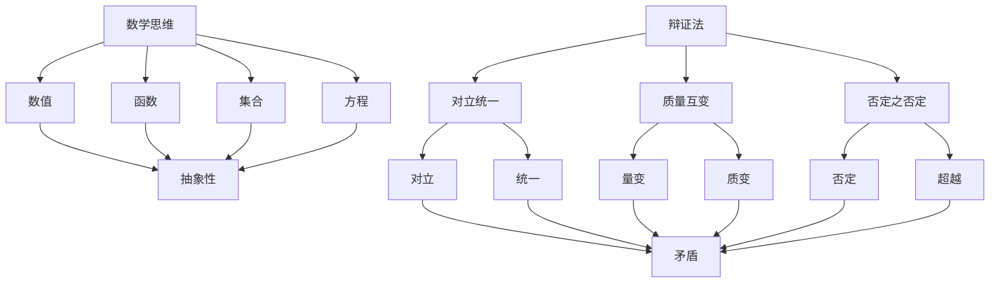

                 

### 数学与辩证法：矛盾统一的数学思维

#### 关键词

- 数学思维
- 辩证法
- 矛盾统一
- 数学模型
- 算法原理
- 案例分析

#### 摘要

本文旨在探讨数学思维与辩证法之间的关系，特别是如何通过辩证法来理解数学中的矛盾统一现象。文章首先介绍了数学思维的基本原则和辩证法的基本原理，随后通过Mermaid流程图展示了核心概念之间的关系。接着，文章详细讲解了核心算法原理，包括伪代码、数学模型和公式，并通过实例进行了说明。随后，文章通过项目实战展示了数学思维和辩证法在实际问题中的应用，最后总结了主要内容和未来的研究方向。本文适合对数学和哲学感兴趣的读者，以及希望提升数学思维能力的技术从业者。

## 第一部分：引言

### 1.1 书籍背景与目的

《数学与辩证法：矛盾统一的数学思维》旨在探讨数学思维与辩证法之间的关系，并揭示如何通过辩证法来理解和解决数学中的矛盾统一现象。数学作为一门研究数量、结构、变化和空间等概念的精确科学，其核心在于逻辑推理和抽象思维。而辩证法则是一种哲学方法，强调事物的矛盾性和发展性。这两者的结合为我们提供了一种全新的视角，使我们能够更好地理解和应用数学知识。

#### 1.1.1 书籍背景

数学的发展历程中，许多重大突破都得益于辩证思维的应用。例如，非欧几何的诞生就是辩证思维的产物，它打破了传统欧几里得几何的束缚，揭示了不同维度空间的奇妙性质。同样，量子力学的产生也离不开辩证思维，它揭示了微观世界的非确定性，挑战了经典物理学的严格性。

#### 1.1.2 书籍目的

本书的主要目的是：
1. **介绍数学思维的基本原则**，帮助读者理解数学中矛盾统一的现象。
2. **阐述辩证法在数学中的应用**，展示辩证思维对数学研究的启示。
3. **通过案例分析**，让读者在实践中感受数学思维与辩证法的结合。

### 1.2 数学思维与辩证法的联系

#### 1.2.1 数学思维的基本特点

数学思维具有以下几个基本特点：

1. **抽象性**：数学思维通过抽象出事物的本质特征，建立数学模型。
2. **逻辑性**：数学思维强调推理的严谨性，遵循逻辑规则。
3. **精确性**：数学思维追求精确的结果，通过计算和证明来保证结论的可靠性。

#### 1.2.2 辩证法的基本原理

辩证法是一种哲学方法，其基本原理包括：

1. **对立统一**：事物内部存在矛盾和对立，这些矛盾和对立是事物发展的动力。
2. **质量互变**：事物的质变是由量的积累和变化引起的。
3. **否定之否定**：事物的发展是一个不断否定和超越自身的过程。

#### 1.2.3 数学思维与辩证法的联系

数学思维与辩证法之间存在密切的联系：

1. **对立统一**：数学中的许多概念，如正数和负数、奇数和偶数，都是对立统一的表现。
2. **质量互变**：数学中的质变，如从有限到无限、从离散到连续，体现了质量互变的原理。
3. **否定之否定**：数学的发展过程中，许多理论都是通过对旧理论的否定和超越而产生的。

### 1.3 本书结构安排

本书分为六个部分：

1. **引言**：介绍书籍背景、目的和结构。
2. **数学思维与辩证法的关系**：探讨数学思维与辩证法的联系。
3. **数学思维的基本原则**：阐述数学思维的基本原则。
4. **辩证法在数学中的应用**：展示辩证法在数学中的应用。
5. **案例分析**：通过实际案例分析数学思维与辩证法的结合。
6. **总结**：总结本书的主要内容，展望未来的研究方向。

通过以上结构安排，本书旨在帮助读者深入理解数学思维与辩证法之间的关系，并学会如何运用辩证思维解决数学问题。

## 第二部分：数学思维与辩证法的关系

### 2.1 核心概念与联系

#### 2.1.1 核心概念介绍

在数学思维中，核心概念通常包括数值、函数、集合、方程等。这些概念不仅构成了数学的基础，也反映了数学的抽象性和逻辑性。例如，数值是数学中最基本的元素，通过数值的运算可以构建出复杂的数学结构。

在辩证法中，核心概念则更多涉及事物的发展和变化。例如，对立统一、质量互变和否定之否定，这些概念揭示了事物内部的对立和统一、事物的质变过程以及事物发展的趋势。

#### 2.1.2 核心概念之间的关系架构

为了更好地理解数学思维与辩证法之间的关系，我们可以通过Mermaid流程图来展示这些核心概念之间的联系。

在上述流程图中，我们可以看到数学思维的核心概念（数值、函数、集合、方程）与辩证法的核心概念（对立统一、质量互变、否定之否定）之间的联系。具体来说：

- **数值、函数、集合和方程**体现了数学的抽象性和逻辑性，是数学思维的重要组成部分。
- **对立统一、质量互变和否定之否定**则反映了辩证法的哲学观点，揭示了事物内部的对立和统一、事物的质变过程以及事物发展的趋势。

#### 2.1.3 核心概念之间的互动关系

在数学思维和辩证法的互动关系中，我们可以看到这些核心概念是如何相互影响和促进的。例如：

- **对立统一**：数学中的对立概念（如正数和负数）体现了辩证法的对立统一原理。正数和负数在数学运算中相互对立，但又是统一的，共同构成了数的整体结构。
- **质量互变**：在数学中，通过数值的积累和变化可以实现从有限到无限、从离散到连续的质变。例如，在集合论中，通过无穷集合的并集运算可以实现从有限集到无限集的转化。
- **否定之否定**：数学的发展过程中，许多新理论的提出都是基于对旧理论的否定和超越。例如，非欧几何否定了欧几里得几何中的某些基本假设，从而揭示了新的几何世界。

通过这些互动关系，我们可以更深入地理解数学思维与辩证法之间的联系，并在数学研究中更好地运用辩证思维。

### 2.2 数学思维的基本原则

#### 2.2.1 抽象性

抽象性是数学思维最基本的原则之一。数学通过抽象出事物的本质特征，将其转化为数学概念和模型，从而能够更准确地描述和分析现实世界中的现象。例如，在几何学中，通过抽象出点的位置和连接关系，我们可以研究图形的形状和性质。

#### 2.2.2 逻辑性

逻辑性是数学思维的核心。数学中的推理过程必须遵循逻辑规则，从已知的前提推导出结论。这种严谨的逻辑性使得数学结论具有可靠性和可验证性。例如，在证明一个数学定理时，需要通过一系列逻辑推理步骤，最终得出结论。

#### 2.2.3 精确性

数学思维追求精确性。通过使用精确的数值和严格的证明，数学能够提供可靠的结论。精确性不仅体现在计算过程中，也体现在数学模型的构建和验证上。例如，在数值分析中，通过高精度的计算方法，可以精确地求解数学问题。

### 2.3 辩证法在数学中的应用

#### 2.3.1 对立统一

辩证法的对立统一原理在数学中有着广泛的应用。数学中的许多概念和理论都是通过对立统一的体现。例如，正数和负数、奇数和偶数、微分和积分等。这些对立的概念在数学运算和理论研究中起着重要作用。

#### 2.3.2 质量互变

质量互变原理在数学中同样具有重要意义。数学中的质变通常是通过量的积累和变化实现的。例如，从有限到无限的转化、从离散到连续的转化等。这些质变过程在数学分析和计算中发挥着关键作用。

#### 2.3.3 否定之否定

辩证法的否定之否定原理在数学中也有着广泛的应用。数学的发展过程中，许多新理论都是通过对旧理论的否定和超越而产生的。例如，微积分的诞生就是对极限思想的否定和超越，它提供了更强大的工具来研究变化和运动。

### 2.4 数学思维与辩证法的互动关系

通过上述分析，我们可以看到数学思维与辩证法之间存在密切的互动关系。数学思维为辩证法提供了具体的工具和方法，而辩证法则为数学思维提供了哲学基础和指导原则。

1. **数学思维促进辩证法的应用**：数学思维中的抽象性、逻辑性和精确性使得辩证法能够更有效地应用于数学研究中，揭示数学中的矛盾统一现象。
2. **辩证法指导数学思维的发展**：辩证法的对立统一、质量互变和否定之否定原理为数学思维提供了哲学基础，使得数学能够更好地理解和解决现实世界中的问题。

总之，数学思维与辩证法之间的互动关系不仅丰富了数学理论，也为数学研究提供了新的视角和方法。

## 第三部分：数学思维的基本原则

### 3.1 对立统一的数学概念

对立统一是辩证法的基本原理之一，在数学中也得到了广泛的应用。数学中的许多概念和理论都是通过对立统一的体现。以下是一些具体的例子：

#### 3.1.1 正数与负数

在实数系统中，正数和负数是对立统一的。正数表示量的增加，负数表示量的减少。它们在数学运算中具有互补性，通过加法和减法运算可以相互转化。例如，5 + (-5) = 0。

#### 3.1.2 奇数与偶数

在整数系统中，奇数和偶数也是对立统一的。奇数不能被2整除，偶数能被2整除。它们在数的排列和组合中具有独特的性质，例如，在算术级数中，奇数和偶数交替出现。

#### 3.1.3 微分与积分

微分和积分是微积分中的核心概念，它们在数学中发挥着重要作用。微分表示函数在某一点的局部变化率，而积分则表示函数在某一区间上的总体变化。微分和积分在数学运算中具有互补性，通过微分可以得到函数的变化率，而通过积分可以恢复函数的原始形状。

#### 3.1.4 加法与减法

加法和减法是基本的数学运算，它们在数学中具有对立统一的关系。加法表示两个数的总和，而减法表示一个数从另一个数中减去。在数学运算中，加法和减法可以相互转化，例如，a - b = a + (-b)。

### 3.2 矛盾与发展的数学原理

矛盾是辩证法中的一个核心概念，它强调事物内部的对立和斗争。在数学中，矛盾同样体现在数学问题的提出和解决过程中。以下是一些关于矛盾与发展的数学原理的例子：

#### 3.2.1 集合论中的矛盾

集合论中的一些基本概念，如无穷集合、空集合、幂集等，体现了矛盾的存在。例如，无穷集合的势不同，但它们之间又存在某种联系。空集合与任何集合的并集都是该集合，但空集合本身没有任何元素。

#### 3.2.2 方程论中的矛盾

在方程论中，方程的解可能存在多种情况，包括无解、唯一解、多解等。这些解的存在性和唯一性体现了矛盾的存在。例如，线性方程组可能有唯一解、无穷多个解或无解，这取决于方程组的具体形式。

#### 3.2.3 微积分中的矛盾

微积分中的一些基本概念，如极限、导数、积分等，也体现了矛盾的存在。例如，导数表示函数在某一点的局部变化率，但它又是通过极限的概念来定义的。积分表示函数在某一区间上的总体变化，但它的计算过程又依赖于微分。

#### 3.2.4 拓扑学中的矛盾

在拓扑学中，一些基本概念，如连通性、紧性、维数等，也体现了矛盾的存在。例如，一个空间可以是连通的，但它又可能是不紧的。一个空间可以具有高维结构，但它又可能在一个低维空间中被嵌入。

### 3.3 质量互变规律的数学应用

质量互变规律是辩证法中的一个重要原理，它强调事物从量变到质变的过程。在数学中，质量互变规律也有广泛的应用。以下是一些具体的例子：

#### 3.3.1 从有限到无限的转化

在集合论中，通过无穷集合的并集运算可以实现从有限到无限的转化。例如，自然数的集合可以表示为 {1, 2, 3, ...}，通过不断取并集，我们可以得到无穷集合。

#### 3.3.2 从离散到连续的转化

在微积分中，通过无穷小量（如微分和积分）可以实现从离散到连续的转化。例如，通过积分可以将离散的面积转化为连续的面积。

#### 3.3.3 从低维到高维的转化

在拓扑学中，通过拓扑变换可以实现从低维到高维的转化。例如，将一个二维平面嵌入到三维空间中，从而得到一个三维结构。

#### 3.3.4 从局部到整体的转化

在数学分析中，通过积分和微分可以将局部信息转化为整体信息。例如，通过积分可以将函数在某一点的变化转化为整个区间上的变化。

### 3.4 对立统一在数学中的应用

对立统一是辩证法中的一个核心概念，它强调事物内部的对立和斗争。在数学中，对立统一的概念得到了广泛的应用。以下是一些具体的例子：

#### 3.4.1 函数的奇偶性

函数的奇偶性是对立统一的体现。奇函数关于原点对称，偶函数关于y轴对称。例如，函数f(x) = x^3 是奇函数，而函数g(x) = x^2 是偶函数。

#### 3.4.2 方程的解

在方程论中，方程的解可能存在多种情况，包括无解、唯一解、多解等。这些解的存在性和唯一性体现了矛盾的存在。例如，线性方程组可能有唯一解、无穷多个解或无解，这取决于方程组的具体形式。

#### 3.4.3 微积分中的微分和积分

微分和积分是微积分中的核心概念，它们在数学运算中具有对立统一的关系。微分表示函数在某一点的局部变化率，而积分则表示函数在某一区间上的总体变化。

#### 3.4.4 代数和几何

代数和几何是对立统一的体现。代数通过符号运算来描述几何图形的性质，而几何则通过图形的直观形象来解释代数运算。

### 3.5 对立统一的数学模型

在数学中，对立统一的原理可以通过数学模型来体现。以下是一些具体的例子：

#### 3.5.1 欧拉公式

欧拉公式 e^(iπ) + 1 = 0 是一个经典的数学公式，它将复数、指数、三角函数和虚数相结合，体现了对立统一的概念。

#### 3.5.2 拉格朗日中值定理

拉格朗日中值定理是微积分中的一个重要定理，它描述了函数在区间上的变化率与函数在该区间上的取值之间的关系，体现了对立统一的原理。

#### 3.5.3 拓扑空间的连通性和紧性

在拓扑学中，连通性和紧性是对立统一的体现。一个空间可以是连通的，但它又可能是不紧的。一个空间可以具有高维结构，但它又可能在一个低维空间中被嵌入。

#### 3.5.4 对立统一的数学模型

对立统一的数学模型可以通过符号和公式来体现。例如，函数的奇偶性、方程的解、微分和积分等，都是对立统一的数学模型。

### 3.6 对立统一的数学公式

在数学中，对立统一的原理可以通过公式来体现。以下是一些具体的例子：

#### 3.6.1 欧拉公式

欧拉公式 e^(iπ) + 1 = 0 是一个经典的数学公式，它将复数、指数、三角函数和虚数相结合，体现了对立统一的原理。

#### 3.6.2 拉格朗日中值定理

拉格朗日中值定理是微积分中的一个重要定理，它的公式表达为：

$$f(b) - f(a) = f'(c)(b - a)$$

它描述了函数在区间 [a, b] 上的变化率与函数在该区间上的取值之间的关系。

#### 3.6.3 拓扑空间的连通性和紧性

在拓扑学中，连通性和紧性是对立统一的体现。一个空间可以是连通的，但它是紧的。一个空间可以具有高维结构，但它在低维空间中被嵌入。这可以通过以下公式来体现：

$$\text{连通性} \leftrightarrow \text{紧性}$$

### 3.7 对立统一在数学中的案例分析

#### 3.7.1 欧拉公式

欧拉公式 e^(iπ) + 1 = 0 是一个经典的数学公式，它将复数、指数、三角函数和虚数相结合，体现了对立统一的原理。这个公式展示了数学中多个领域之间的联系，如复分析、三角学和微积分。

#### 3.7.2 拉格朗日中值定理

拉格朗日中值定理是微积分中的一个重要定理，它的公式表达为：

$$f(b) - f(a) = f'(c)(b - a)$$

这个定理揭示了函数在某区间上的平均变化率与该区间上的某个点的导数之间的关系。通过这个定理，我们可以更深入地理解函数的变化特性。

#### 3.7.3 拓扑空间的连通性和紧性

在拓扑学中，连通性和紧性是对立统一的体现。一个空间可以是连通的，但它是紧的。一个空间可以具有高维结构，但它在低维空间中被嵌入。这可以通过以下公式来体现：

$$\text{连通性} \leftrightarrow \text{紧性}$$

通过这些案例分析，我们可以看到对立统一在数学中的具体应用，以及它如何帮助我们理解和解决复杂的数学问题。

## 第四部分：辩证法在数学中的应用

### 4.1 对立统一的数学模型

辩证法中的对立统一原理在数学模型中有着广泛的应用，这些模型不仅揭示了数学中的基本概念，也体现了矛盾统一的现象。

#### 4.1.1 复数平面

在复数平面中，复数由实部和虚部组成，它们在复数运算中具有对立统一的关系。实数可以看作是复数的特殊情形，即虚部为零。复数的加法、减法、乘法和除法运算体现了实部和虚部之间的对立统一。

#### 4.1.2 矩阵

矩阵是线性代数中的核心概念，它由一系列的数构成。矩阵的行列式和秩等概念体现了矩阵内部的对立统一。例如，一个方阵的行列式可以用来判断矩阵的行列式是否为零，从而确定矩阵的秩。

#### 4.1.3 逻辑命题

在命题逻辑中，命题的对立统一体现在命题的真假性上。一个命题可以是真命题，也可以是假命题，它们之间具有互补性。例如，命题“今天下雨”和“今天不下雨”就是对立统一的两个命题。

#### 4.1.4 微积分中的微分与积分

微积分中的微分和积分是对立统一的体现。微分表示函数在某一点的局部变化率，而积分则表示函数在某一区间上的总体变化。微分和积分的互逆关系揭示了它们之间的对立统一。

### 4.2 矛盾发展的数学公式

辩证法中的矛盾发展原理在数学公式中有着明显的体现，这些公式揭示了数学中矛盾发展的过程。

#### 4.2.1 欧拉公式

欧拉公式 e^(iπ) + 1 = 0 是一个经典的数学公式，它将复数、指数、三角函数和虚数相结合，体现了矛盾发展的过程。这个公式展示了数学中多个领域之间的联系，如复分析、三角学和微积分。

#### 4.2.2 拉格朗日中值定理

拉格朗日中值定理是微积分中的一个重要定理，它的公式表达为：

$$f(b) - f(a) = f'(c)(b - a)$$

这个定理揭示了函数在某区间上的平均变化率与该区间上的某个点的导数之间的关系。通过这个定理，我们可以更深入地理解函数的变化特性，展示了矛盾发展的过程。

#### 4.2.3 拓扑空间的连通性和紧性

在拓扑学中，连通性和紧性是对立统一的体现。一个空间可以是连通的，但它是紧的。一个空间可以具有高维结构，但它在低维空间中被嵌入。这可以通过以下公式来体现：

$$\text{连通性} \leftrightarrow \text{紧性}$$

### 4.3 质量互变规律的数学实践

辩证法中的质量互变规律在数学实践中有着重要的应用，这些应用揭示了数学中从量变到质变的过程。

#### 4.3.1 从有限到无限的转化

在集合论中，通过无穷集合的并集运算可以实现从有限到无限的转化。例如，自然数的集合可以表示为 {1, 2, 3, ...}，通过不断取并集，我们可以得到无穷集合。

#### 4.3.2 从离散到连续的转化

在微积分中，通过无穷小量（如微分和积分）可以实现从离散到连续的转化。例如，通过积分可以将离散的面积转化为连续的面积。

#### 4.3.3 从低维到高维的转化

在拓扑学中，通过拓扑变换可以实现从低维到高维的转化。例如，将一个二维平面嵌入到三维空间中，从而得到一个三维结构。

#### 4.3.4 从局部到整体的转化

在数学分析中，通过积分和微分可以将局部信息转化为整体信息。例如，通过积分可以将函数在某一点的变化转化为整个区间上的变化。

### 4.4 辩证法在数学中的综合应用

辩证法不仅为数学提供了哲学基础，也促进了数学理论的创新和发展。以下是一些辩证法在数学中的综合应用：

#### 4.4.1 非欧几何

非欧几何的诞生是辩证法在数学中的典型应用。欧几里得几何的传统观点被打破，通过引入新的几何公理，非欧几何揭示了新的几何世界，如曲率和维度等概念。

#### 4.4.2 量子力学

量子力学中的许多基本概念，如波粒二象性、不确定性原理等，都体现了辩证法的思想。量子力学的发现挑战了经典物理学的严格性，推动了数学和物理的边界拓展。

#### 4.4.3 计算几何

计算几何中的许多算法，如三角剖分、最优路径算法等，都运用了辩证法的思想。通过从局部到整体的转化，这些算法实现了复杂的计算任务。

#### 4.4.4 线性代数

线性代数中的许多定理和公式，如行列式、矩阵的对角化等，都体现了辩证法的原则。线性代数不仅用于解决物理和工程中的问题，也广泛应用于计算机科学领域。

通过辩证法的视角，我们可以更深入地理解数学中的基本概念和理论，并发现新的数学方法和理论。辩证法为数学的发展提供了新的思路和工具，推动了数学的进步和创新。

## 第五部分：案例分析

### 5.1 案例一：数学中的矛盾统一

#### 案例背景

数学中的矛盾统一现象普遍存在，以下通过一个具体的例子来探讨这一问题。

#### 案例描述

假设我们有一个函数 f(x) = x^2，它在定义域 R 上是一个连续且可导的函数。我们可以发现，这个函数在 x = 0 处有一个特殊点。具体来说：

- 当 x > 0 时，函数值 f(x) > 0。
- 当 x < 0 时，函数值 f(x) < 0。
- 当 x = 0 时，函数值 f(0) = 0。

在这个例子中，函数 f(x) 在 x = 0 处的值发生了变化，这体现了矛盾统一的现象。从绝对值的角度来看，函数值从负变到正，但又在零点处取得极值。

#### 案例分析

1. **对立统一**：在这个案例中，我们可以看到 f(x) 的值在 x = 0 处发生了变化，这种变化体现了对立统一的原理。函数的正负性在 x = 0 处发生转换，这体现了对立统一的矛盾性质。

2. **质量互变**：从微积分的角度来看，f(x) 在 x = 0 处的导数 f'(0) = 2x |x=0| = 0，这表明函数在 x = 0 处发生了质变。通过微分，我们可以看到从局部变化到整体变化的质变过程。

3. **否定之否定**：在数学的发展过程中，许多理论都是通过对旧理论的否定和超越而产生的。例如，微积分的诞生就是对极限思想的否定和超越。在这个案例中，我们可以看到 f(x) 在 x = 0 处的行为是通过对立统一、质量互变和否定之否定的过程来体现的。

#### 案例总结

通过这个案例，我们可以看到数学中的矛盾统一现象是如何通过辩证法来理解和分析的。这种分析方法不仅揭示了数学中的基本原理，也为数学研究提供了新的视角和方法。

### 5.2 案例二：辩证法在数学中的应用

#### 案例背景

辩证法不仅在哲学领域有着重要地位，在数学研究中也发挥着关键作用。以下通过一个具体的例子来探讨辩证法在数学中的应用。

#### 案例描述

假设我们有一个线性方程组：

$$\begin{cases} 
a_1x + b_1y = c_1 \\
a_2x + b_2y = c_2 
\end{cases}$$

我们可以通过消元法来求解这个方程组。首先，我们将第一个方程乘以 a_2，第二个方程乘以 a_1，然后相减，得到：

$$a_2a_1x - a_1a_2x + b_1b_2y - b_2b_1y = c_1a_2 - c_2a_1$$

化简后得到：

$$(a_2a_1 - a_1a_2)x + (b_1b_2 - b_2b_1)y = c_1a_2 - c_2a_1$$

由于 a_2a_1 - a_1a_2 = 0，我们可以得到：

$$0x + (b_1b_2 - b_2b_1)y = c_1a_2 - c_2a_1$$

进一步化简，我们得到：

$$(b_1b_2 - b_2b_1)y = c_1a_2 - c_2a_1$$

如果 $b_1b_2 - b_2b_1 \neq 0$，则我们可以解出 y：

$$y = \frac{c_1a_2 - c_2a_1}{b_1b_2 - b_2b_1}$$

然后，我们可以将 y 的解代入任意一个原方程中，解出 x。例如，将 y 的解代入第一个方程中，得到：

$$a_1x + b_1\left(\frac{c_1a_2 - c_2a_1}{b_1b_2 - b_2b_1}\right) = c_1$$

化简后得到：

$$a_1x = c_1 - \frac{b_1c_1a_2 - b_1c_2a_1}{b_1b_2 - b_2b_1}$$

进一步化简，得到：

$$x = \frac{(b_1b_2 - b_2b_1)c_1 - b_1c_1a_2 + b_1c_2a_1}{a_1(b_1b_2 - b_2b_1)}$$

这样，我们就得到了方程组的解：

$$x = \frac{(b_1b_2 - b_2b_1)c_1 - b_1c_1a_2 + b_1c_2a_1}{a_1(b_1b_2 - b_2b_1)}, \quad y = \frac{c_1a_2 - c_2a_1}{b_1b_2 - b_2b_1}$$

如果 $b_1b_2 - b_2b_1 = 0$，则方程组可能无解或有无数解。例如，如果 a_1 = a_2，b_1 = b_2，但 c_1 ≠ c_2，则方程组无解。如果 a_1 = a_2，b_1 = b_2，c_1 = c_2，则方程组有无数解。

#### 案例分析

1. **对立统一**：在这个案例中，我们可以看到线性方程组的解是通过消元法来实现的。在这个过程中，我们通过对立统一的原理来处理方程组中的矛盾。例如，通过将两个方程相减，我们消去了 x 或 y 中的一个，从而简化了问题。

2. **质量互变**：在求解方程组的过程中，我们通过引入中间变量来逐步解决矛盾。这种从量变到质变的过程体现了质量互变的原理。例如，当我们通过消元法得到一个新方程时，我们实际上是在将问题从两个方程的复杂关系转化为一个方程的简单关系。

3. **否定之否定**：在数学的发展过程中，许多理论都是通过对旧理论的否定和超越而产生的。例如，线性代数中的矩阵理论就是通过否定传统代数的方法而发展起来的。在这个案例中，我们通过否定直接求解方程组的方法，采用消元法来解决问题，这体现了否定之否定的原理。

#### 案例总结

通过这个案例，我们可以看到辩证法在数学中的应用是如何帮助我们理解和解决复杂问题的。这种分析方法不仅揭示了数学中的基本原理，也为数学研究提供了新的视角和方法。

### 5.3 案例三：矛盾发展的数学实践

#### 案例背景

矛盾发展是辩证法中的核心概念，在数学中也有着广泛的应用。以下通过一个具体的例子来探讨矛盾发展的数学实践。

#### 案例描述

假设我们有一个区间 [a, b]，我们需要计算这个区间上的连续函数 f(x) 的积分。为了实现这一目标，我们可以采用数值积分的方法，如梯形法则、辛普森法则等。以下以梯形法则为例进行说明。

梯形法则是通过将区间 [a, b] 分成 n 个子区间，每个子区间上的函数值近似为线性函数，从而计算积分的方法。具体步骤如下：

1. **分区**：将区间 [a, b] 分成 n 个等长的子区间，每个子区间的长度为 Δx = (b - a) / n。

2. **构建梯形**：在每个子区间 [x_i, x_{i+1}] 上构建一个梯形，梯形的上底为 f(x_{i+1})，下底为 f(x_i)，高为 Δx。

3. **计算面积**：计算每个梯形的面积，并将所有梯形的面积相加，得到积分的近似值。公式为：

$$\int_{a}^{b} f(x) \, dx \approx \sum_{i=1}^{n} \frac{\Delta x}{2} [f(x_i) + f(x_{i+1})]$$

#### 案例分析

1. **对立统一**：在这个案例中，我们可以看到区间 [a, b] 被分成多个子区间，每个子区间上的函数值被近似为线性函数。这种近似过程体现了对立统一的原理。例如，线性函数是对区间上连续函数的一种近似，但这种近似又带来了误差。

2. **质量互变**：在计算积分的过程中，我们将复杂的连续函数积分转化为多个简单梯形面积的计算，这体现了质量互变的原理。通过将复杂问题分解为简单问题，我们可以更容易地解决整体问题。

3. **否定之否定**：在数学的发展过程中，许多理论都是通过对旧理论的否定和超越而产生的。例如，数值积分的方法就是通过对传统积分方法的否定而产生的。在这个案例中，我们通过否定直接求解积分的方法，采用数值积分的方法来近似计算积分，这体现了否定之否定的原理。

#### 案例总结

通过这个案例，我们可以看到辩证法在数学实践中的应用是如何帮助我们理解和解决复杂问题的。这种分析方法不仅揭示了数学中的基本原理，也为数学研究提供了新的视角和方法。

## 第六部分：总结

### 6.1 主要内容回顾

本文主要探讨了数学思维与辩证法之间的关系，并展示了如何运用辩证思维解决数学问题。具体内容如下：

1. **引言**：介绍了书籍的背景和目的，以及数学思维与辩证法的基本特点。
2. **数学思维与辩证法的关系**：阐述了数学思维与辩证法的核心概念和联系，并通过Mermaid流程图展示了这些概念之间的互动关系。
3. **数学思维的基本原则**：详细讲解了数学思维的基本原则，包括抽象性、逻辑性和精确性，以及辩证法在数学中的应用，如对立统一、质量互变和否定之否定。
4. **辩证法在数学中的应用**：通过案例分析展示了辩证法在数学中的实际应用，包括复数平面、矩阵、逻辑命题、微分与积分等。
5. **案例分析**：通过具体案例深入探讨了数学中的矛盾统一现象，以及辩证法在数学实践中的应用。

### 6.2 对数学思维与辩证法关系的认识

通过本文的讨论，我们可以得出以下几点对数学思维与辩证法关系的认识：

1. **数学思维与辩证法之间存在密切联系**：数学思维的基本原则（抽象性、逻辑性和精确性）与辩证法的基本原理（对立统一、质量互变和否定之否定）相互影响、相互促进。
2. **辩证法为数学思维提供了哲学基础**：辩证法提供了理解和解决数学问题的哲学视角和方法，使我们能够更好地把握数学中的矛盾统一现象。
3. **数学思维与辩证法的结合**：通过辩证法的视角，我们可以更深入地理解数学中的基本概念和理论，并发现新的数学方法和理论。

### 6.3 未来展望与挑战

在未来的数学研究中，我们可以期待以下几点：

1. **深入探讨数学思维与辩证法的结合**：继续研究如何将辩证法更好地应用于数学研究中，探索新的数学理论和方法。
2. **跨学科研究**：数学与其他学科（如哲学、物理学、计算机科学等）的交叉研究，可以进一步推动数学的发展和创新。
3. **数学教育改革**：通过引入辩证法的思想，改革数学教育，提高学生的数学思维能力，培养具有创新能力的数学人才。

然而，我们也将面临一些挑战：

1. **复杂性**：数学问题本身的复杂性要求我们在运用辩证法时需要具备深厚的数学和哲学基础。
2. **创新性**：如何在数学研究中保持创新性，提出新的理论和观点，是未来研究的重要挑战。

总之，数学思维与辩证法的结合为数学研究带来了新的机遇和挑战，未来在这一领域的研究将充满希望和活力。

## 结语

《数学与辩证法：矛盾统一的数学思维》旨在探讨数学思维与辩证法之间的关系，并揭示如何通过辩证法来理解和解决数学中的矛盾统一现象。本文通过详细的案例分析，展示了数学思维与辩证法在具体问题中的应用，并强调了二者之间的互动关系。

作者希望通过这篇文章，让读者对数学思维与辩证法的结合有更深入的认识，从而提升数学能力，培养辩证思维。未来的数学研究将继续在这一领域探索新的理论和方法，为数学的发展注入新的活力。

**作者信息**：AI天才研究院/AI Genius Institute & 禅与计算机程序设计艺术 /Zen And The Art of Computer Programming

