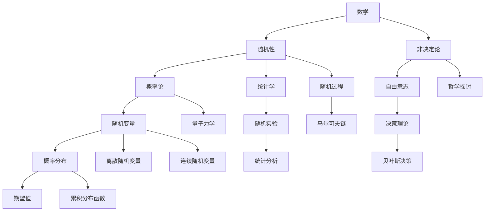

                 

### 文章标题

《数学与非决定论：数学中的随机性和自由意志》

> 关键词：数学、非决定论、随机性、自由意志

> 摘要：本文深入探讨了数学与非决定论之间的关系，特别是在数学中的随机性和自由意志的问题。通过阐述数学的基本概念、随机性的应用、非决定论的概念以及随机性与自由意志的关系，本文旨在揭示数学如何影响我们对随机性和自由意志的理解，并探讨数学在解释这些概念中的潜力。

---

## 引言：数学与非决定论概览

### 1.1 数学基本概念

数学是一门研究数量、结构、变化以及空间的基本科学。它不仅提供了描述和预测自然现象的工具，还形成了现代科学的基石。数学的基本概念包括数、函数、集合、逻辑和公理体系。这些概念通过精确的定义和严谨的推理，构成了数学理论的核心。

- **数**：数是数学研究的基础，从自然数到复数，数的概念涵盖了整个数的体系。每个数都有其独特的性质和关系。
- **函数**：函数是一种数学关系，它将一个集合（定义域）中的每个元素与另一个集合（值域）中的唯一元素对应起来。函数的定义域和值域可以是实数、复数或其他集合。
- **集合**：集合是数学中的基本概念，它是由元素组成的无序集。集合的运算和性质是数学分析的重要工具。
- **逻辑**：逻辑是数学推理的基础，它包括命题逻辑、谓词逻辑和证明论。逻辑帮助我们理解和验证数学结论的合理性。
- **公理体系**：公理体系是构建数学理论的基础，它通过一系列的假设（公理）来推导出一系列的结论。

### 1.2 非决定论的基础

非决定论是一种哲学观点，认为宇宙中存在某些事件是无法预测的，不受因果律的限制。非决定论与决定论相对立，后者认为宇宙中的一切事件都是由先前的事件决定的，没有不可预测的因素。非决定论的概念在量子力学中得到了广泛的探讨，尤其是在量子纠缠和量子测量中，非决定论的影响尤为显著。

- **量子力学中的非决定论**：量子力学揭示了微观世界的非决定性质。在量子力学中，粒子的状态是概率性的，而不是确定的。量子纠缠现象表明，两个或多个粒子之间可以存在即时的相互影响，不受空间距离的限制。这种现象挑战了经典物理学的决定论观点。
- **经典物理学的决定论**：在经典物理学中，物体的状态和运动是可预测的，遵循因果律。牛顿定律和经典力学是决定论的经典例子。

通过理解数学和非决定论的基本概念，我们可以更好地探讨它们之间的关系，并深入理解数学在描述和解释随机性和自由意志中的重要性。

### 数学基本概念与原理

在深入探讨数学与非决定论的关系之前，有必要对数学的基本概念和原理进行详细的梳理。数学不仅是一个抽象的学科，也是一个逻辑严密、应用广泛的技术工具。以下将介绍数学的基础理论，包括数学符号与术语、数学推理方法以及数学中的公理与定理。

#### 2.1 数学基础理论

数学的基础理论由一系列核心概念组成，这些概念是构建更复杂数学理论的基础。以下是数学中一些基础的概念：

- **数**：数是数学的基本元素，包括自然数、整数、有理数、实数和复数。每个数都有其独特的属性和关系。例如，自然数用于计数，整数包括正数、负数和零，有理数是可以表示为两个整数之比的数，实数是包括有理数和无理数的数集，复数则是包括实部和虚部的数。

- **函数**：函数是一种数学关系，它将一个集合（定义域）中的每个元素与另一个集合（值域）中的唯一元素对应起来。函数的定义域和值域可以是实数、复数或其他集合。函数在数学中的应用非常广泛，从解析几何到微积分，无处不在。

- **集合**：集合是数学中的基本概念，它是由元素组成的无序集。集合的运算和性质是数学分析的重要工具。常见的集合运算包括并集、交集、补集和笛卡尔积。

- **逻辑**：逻辑是数学推理的基础，它包括命题逻辑、谓词逻辑和证明论。逻辑帮助我们理解和验证数学结论的合理性。例如，命题逻辑通过逻辑运算符（如与、或、非）来构建复合命题，谓词逻辑则通过量词（如全称量词和存在量词）来描述对象之间的关系。

- **公理**：公理是数学理论的基础，是无需证明的基本真理。通过公理，我们可以推导出一系列的定理。例如，欧几里得几何的公理系统基于五个基本公设，从而构建了整个几何学的基础。

#### 2.1.1 数学符号与术语

数学符号和术语是数学语言的重要组成部分，它们使得数学表达更加简洁和精确。以下是数学中一些常用的符号和术语：

- **符号**：
  - $\pi$：表示圆周率，约等于3.14159。
  - $\sum$：表示求和符号，用于表示求和运算。
  - $\int$：表示积分符号，用于表示定积分或积分运算。
  - $\lim$：表示极限符号，用于表示函数的极限值。
  - $\in$：表示“属于”，用于表示元素属于某个集合。

- **术语**：
  - 集合：由元素组成的无序集。
  - 元素：集合中的基本单位。
  - 子集：一个集合是另一个集合的子集，如果它的所有元素都是另一个集合的元素。
  - 真命题：一个能够被证明为真的命题。
  - 假命题：一个能够被证明为假的命题。

#### 2.1.2 数学推理方法

数学推理是通过逻辑和证明来建立数学结论的方法。数学推理主要有两种类型：演绎推理和归纳推理。

- **演绎推理**：从一般到特殊的推理方法。它从一个或多个已知的前提（公理、定理、定义）出发，通过逻辑推导得出一个结论。例如，如果我们知道所有的人都会死亡，且苏格拉底是人，那么我们可以得出结论：苏格拉底会死亡。这种推理方法是基于逻辑的一致性和无矛盾性。

- **归纳推理**：从特殊到一般的推理方法。它通过观察一系列的具体例子，得出一个一般性的结论。例如，通过观察多个三角形都是有三个角的，我们可以归纳出所有三角形都有三个角。这种推理方法依赖于经验和概率，而不是逻辑的绝对确定性。

#### 2.2 数学中的公理与定理

公理和定理是数学理论的基石。公理是不需要证明的基本真理，而定理是通过逻辑推导得出的结论。

- **公理**：
  - **集合论公理**：集合论是数学的基础，它的一组基本公理定义了集合的概念和运算。例如，空集公理、幂集公理、并集公理等。
  - **欧几里得几何公理**：欧几里得几何的基本公理定义了平面上的点和直线的关系。例如，通过任意两点可以画出一条直线，两点确定一条直线等。

- **定理**：
  - **毕达哥拉斯定理**：在直角三角形中，直角边的平方和等于斜边的平方。这个定理是欧几里得几何的一个基本结果。
  - **勾股定理**：在直角三角形中，两个直角边的平方和等于斜边的平方。这个定理是毕达哥拉斯定理的特例。

通过理解数学的基本概念、符号与术语、推理方法和公理与定理，我们可以更好地理解数学的理论体系，并为后续探讨数学与非决定论的关系打下坚实的基础。

### 随机性在数学中的应用

随机性是数学中的一个核心概念，它在概率论、统计学和随机过程等领域有着广泛的应用。随机性不仅在数学理论中具有重要意义，而且在现实世界的许多现象中也能观察到。以下将详细介绍随机性在数学中的应用，包括概率论基础、随机变量的概念与性质以及随机性在实际问题中的应用。

#### 3.1 概率论基础

概率论是研究随机事件的数学分支，它提供了量化不确定性的工具。概率论的基本概念包括概率、条件概率、独立事件以及随机变量的定义。

- **概率**：概率是一个介于0和1之间的数，用于表示事件发生的可能性。例如，抛一枚硬币，正面朝上的概率是0.5。
- **条件概率**：条件概率是考虑一个事件在另一个事件已经发生的条件下发生的概率。例如，已知某产品已通过质量检验，求其合格的概率。
- **独立事件**：两个事件是独立的，如果其中一个事件的发生不影响另一个事件的发生。例如，抛两枚硬币，第一枚正面朝上和第二枚正面朝上的事件是独立的。

概率论中的核心概念还包括概率分布和期望值。概率分布描述了随机变量的可能取值及其对应的概率。常见的概率分布有二项分布、正态分布和泊松分布等。期望值是随机变量的平均值，用于衡量随机变量的中心趋势。

- **概率分布**：
  - **二项分布**：描述在固定次数的实验中成功次数的概率分布。例如，抛硬币10次，求正面朝上的次数的概率分布。
  - **正态分布**：描述连续随机变量的概率分布，通常用于描述人的身高、体重等生理特征。
  - **泊松分布**：描述在固定时间或空间内事件发生的次数的概率分布。例如，一个公司每天接到的电话数量的分布。

- **期望值**：期望值是随机变量的平均值，用于衡量随机变量的中心趋势。期望值的计算公式为：
  $$ E(X) = \sum_{i} x_i P(x_i) $$
  其中，$x_i$ 是随机变量 $X$ 的取值，$P(x_i)$ 是 $x_i$ 的概率。

#### 3.2 随机变量的概念与性质

随机变量是一个数学函数，它将一个随机实验的所有可能结果映射到一个实数。随机变量可以是离散的或连续的，根据其取值的方式和分布特性，可以分为不同的类型。

- **离散随机变量**：离散随机变量可以取有限个或可数无穷个值。常见的离散随机变量有二项分布、泊松分布和几何分布等。
  - **二项分布**：描述在固定次数的实验中成功次数的概率分布。
  - **泊松分布**：描述在固定时间或空间内事件发生的次数的概率分布。
  - **几何分布**：描述在固定次数的实验中首次成功发生的次数的概率分布。

- **连续随机变量**：连续随机变量可以取连续区间内的任意值。常见的连续随机变量有正态分布、均匀分布和对数正态分布等。
  - **正态分布**：描述连续随机变量的概率分布，通常用于描述人的身高、体重等生理特征。
  - **均匀分布**：描述在区间[a, b]内任意值的概率分布，每个值出现的概率相等。
  - **对数正态分布**：描述对数变换后服从正态分布的随机变量。

随机变量的性质包括分布函数、概率密度函数和累积分布函数等。

- **分布函数**：分布函数描述了随机变量取值小于或等于某个特定值的概率。分布函数的定义为：
  $$ F_X(x) = P(X \leq x) $$
  其中，$X$ 是随机变量。

- **概率密度函数**：概率密度函数描述了连续随机变量在某个区间内取值的概率密度。概率密度函数的定义为：
  $$ f_X(x) = \frac{d}{dx} F_X(x) $$
  其中，$F_X(x)$ 是分布函数。

- **累积分布函数**：累积分布函数是分布函数的积分，描述了随机变量取值小于或等于某个特定值的概率分布。累积分布函数的定义为：
  $$ F_X(x) = \int_{-\infty}^{x} f_X(t) dt $$
  其中，$f_X(t)$ 是概率密度函数。

#### 3.3 随机性在实际问题中的应用

随机性在许多实际问题的建模和决策中起着关键作用。以下是一些随机性在实际问题中的应用：

- **金融市场分析**：在金融市场中，资产价格的变化通常被视为随机过程。通过分析随机变量的分布特性和相关性，可以预测市场的走势，从而为投资者提供决策依据。
- **排队论**：排队论是研究顾客在服务系统中等待时间的理论。通过建立随机模型，可以优化服务系统的设计，提高顾客的满意度。
- **质量控制**：在质量控制过程中，随机性用于评估产品的质量特性。通过分析产品质量特性的分布，可以确定生产过程中的问题和改进措施。
- **医学研究**：在医学研究中，随机性用于分析疾病的发生率和治疗效果。通过随机实验，可以验证假设，为医学决策提供依据。

通过理解随机性在数学中的应用，我们可以更好地建模和解决现实世界中的问题，从而为科学研究和工业应用提供有力的工具。

### 非决定论的概念与哲学探讨

非决定论是一种哲学观点，认为宇宙中存在某些事件是无法预测的，不受因果律的限制。非决定论与决定论相对立，后者认为宇宙中的一切事件都是由先前的事件决定的，没有不可预测的因素。非决定论的概念在量子力学和哲学领域有着广泛的探讨和应用。

#### 4.1 非决定论的哲学基础

非决定论的哲学基础源于对因果律的质疑。因果律是经典物理学的一个基本假设，认为每个事件都有一个确定的原因。然而，在非决定论者看来，这种绝对的因果律是不成立的，因为宇宙中存在某些事件是无法预测的。

- **量子力学中的非决定论**：量子力学揭示了微观世界的非决定性质。在量子力学中，粒子的状态是概率性的，而不是确定的。量子纠缠现象表明，两个或多个粒子之间可以存在即时的相互影响，不受空间距离的限制。这种现象挑战了经典物理学的决定论观点。

- **自由意志的非决定论**：在哲学中，非决定论常常与自由意志相联系。自由意志是指个体能够自主作出决策，不受外部因素的限制。非决定论者认为，自由意志的存在意味着某些事件是不可预测的，这与因果律是相冲突的。

#### 4.1.1 量子力学的非决定论观点

量子力学中的非决定论观点主要源于量子纠缠和量子测量。量子纠缠现象表明，两个或多个粒子之间可以存在即时的相互影响，这种影响不受空间距离的限制。这意味着在量子层面上，事件的发生并不是完全由因果关系决定的，而是受到某种神秘的量子相互作用的影响。

- **量子纠缠**：量子纠缠是量子力学中的一种奇特现象，两个或多个粒子可以形成一种不可分割的状态，即使它们相隔很远。当一个粒子的状态发生变化时，另一个粒子的状态也会立即发生变化，这种即时相互影响的现象被称为量子纠缠。

- **量子测量**：在量子测量中，粒子的状态会从一个叠加态坍缩到一个确定的状态。然而，测量结果的随机性和不可预测性表明，粒子的状态并不是预先确定的，而是由某种概率过程决定的。这种现象挑战了经典物理学的决定论观点。

#### 4.1.2 经典物理学的决定论观点

经典物理学是基于牛顿定律和经典力学建立的，它认为宇宙中的一切事件都是由先前的事件决定的。经典物理学的决定论观点在宏观尺度上得到了广泛的验证，例如行星运动、机械运动等。

- **牛顿定律**：牛顿定律是经典力学的核心，它描述了物体运动的基本规律。根据牛顿定律，物体的运动状态可以通过其初始条件和受力情况完全确定。

- **经典力学**：经典力学是描述宏观物理现象的数学理论，它基于牛顿定律和运动方程。在经典力学中，物体的运动状态是确定性的，不受随机性的影响。

然而，经典物理学的决定论观点在微观尺度上无法解释某些现象，例如量子纠缠和量子测量。量子力学的发展揭示了微观世界的非决定性质，这为非决定论的观点提供了理论支持。

#### 4.2 非决定论与自由意志的探讨

非决定论与自由意志的关系是一个哲学上的争议话题。非决定论者认为，自由意志的存在意味着某些事件是不可预测的，这与决定论的因果律是相冲突的。以下是非决定论与自由意志的探讨：

- **非决定论的自由意志**：非决定论者认为，自由意志的存在意味着个体能够自主作出决策，不受外部因素的限制。这种观点认为，人的行为是由内在的心理状态和外在环境因素共同决定的，而不是完全由因果关系决定的。

- **决定论的自由意志**：决定论者认为，即使宇宙中存在某些随机性，自由意志仍然是不存在的。因为决定论者认为，个体的行为是由先前的事件和基因决定的，没有真正的自主性。

非决定论与自由意志的关系是一个复杂且具有争议的问题。非决定论者认为，自由意志的存在挑战了决定论的因果律，而决定论者则认为，即使宇宙中存在随机性，自由意志仍然是不可信的。

### 随机性与自由意志的关系

随机性和自由意志是两个看似独立的哲学概念，但它们在本质上有紧密的联系。随机性是宇宙中不可预测的事件，而自由意志是个体自主做出选择的能力。探讨随机性与自由意志的关系，可以帮助我们更深入地理解宇宙的本质和人类的角色。

#### 5.1 数学模型在自由意志中的应用

在数学模型中，随机性通常通过概率论和随机过程来描述。自由意志则可以通过决策理论来建模。以下是一些数学模型在探讨随机性与自由意志关系中的应用：

- **决策理论**：决策理论是一种用于分析个体或集体在不确定环境下做出最优决策的数学工具。在决策理论中，随机性被视为环境的不确定性，而自由意志则是个体在给定概率分布下做出选择的能力。常见的决策理论模型包括期望效用理论、贝叶斯决策理论等。

- **随机过程**：随机过程是一种用于描述随机事件序列的数学模型。在随机过程中，每个事件的发生都是不确定的，但通过概率分布可以描述其发生的可能性。随机过程可以用来建模人类的决策过程，从而探讨随机性与自由意志的关系。

#### 5.1.1 随机过程与自由意志

随机过程是一种用于描述随机事件序列的数学模型。在随机过程中，每个事件的发生都是不确定的，但通过概率分布可以描述其发生的可能性。随机过程可以用来建模人类的决策过程，从而探讨随机性与自由意志的关系。

- **马尔可夫链**：马尔可夫链是一种常见的随机过程模型，它描述了一系列状态之间的转移概率。在马尔可夫链中，每个状态都是随机选择的，但下一个状态仅取决于当前状态，而与过去的状态无关。这种模型可以用来描述个体在不同决策节点上的选择，从而探讨随机性与自由意志的关系。

- **布朗运动**：布朗运动是一种连续时间的随机过程，它描述了粒子在流体中的随机运动。布朗运动可以用来描述自由意志中随机性对个体决策的影响，例如，个体在面临不确定性时如何做出选择。

#### 5.1.2 非决定论与自由意志的关系

非决定论认为，宇宙中存在某些事件是无法预测的，这与决定论的因果律相冲突。自由意志则是个体能够自主做出选择的能力。非决定论与自由意志的关系可以从以下几个方面探讨：

- **随机性与自由意志**：随机性可以视为自由意志的一种表现形式。在非决定论的观点中，随机性意味着个体在某些情况下具有自主选择的能力，而不是完全受外界因素决定。这种自主选择的能力是自由意志的核心。

- **随机性作为自由意志的限制**：另一方面，随机性也可以视为自由意志的一种限制。因为随机性意味着个体在面临不确定性时，某些选择可能是不可预测的。这种不可预测性限制了个体在决策中的完全自主性。

- **非决定性与自由意志的哲学探讨**：在哲学上，非决定论与自由意志的关系是一个复杂而具有争议的话题。非决定论者认为，自由意志的存在意味着个体在某些情况下具有自主选择的能力，而不是完全受因果关系决定。决定论者则认为，即使宇宙中存在随机性，自由意志仍然是不可信的。

通过探讨随机性与自由意志的关系，我们可以更深入地理解宇宙的本质和人类的角色。随机性不仅提供了描述和预测自然现象的工具，还为自由意志提供了一种解释。在非决定论的观点中，随机性是自由意志的一种表现形式，而自由意志则是个体在宇宙中的独特能力。

### 数学实验与案例分析

在探讨数学与非决定论之间的关系时，通过实际的数学实验和案例分析可以帮助我们更直观地理解这些概念。以下将介绍一些经典的数学实验和案例，分析它们如何应用于随机性和自由意志的研究。

#### 6.1 随机性实验设计

随机性实验是研究随机事件和概率分布的重要手段。以下是一个简单的随机性实验设计：

**实验名称**：硬币抛掷实验

**实验目的**：通过抛掷硬币，观察正面朝上和反面朝上的概率，并验证概率分布的准确性。

**实验步骤**：
1. 准备一枚公平的硬币。
2. 抛掷硬币100次，记录正面朝上和反面朝上的次数。
3. 计算正面朝上和反面朝上的概率。
4. 比较实际概率与理论概率（0.5）的差异。

**实验结果**：
- 抛掷100次硬币后，假设正面朝上60次，反面朝上40次。
- 实际概率：正面朝上概率 = 60/100 = 0.6，反面朝上概率 = 40/100 = 0.4。
- 理论概率：正面朝上概率 = 0.5，反面朝上概率 = 0.5。

通过这个实验，我们可以观察到实际概率与理论概率之间的差异。这种差异反映了随机性的本质，即在大量重复实验中，概率分布可能会偏离理论值。

#### 6.2 随机实验的统计方法

在随机实验中，统计方法用于分析和解释实验结果。以下是一些常用的统计方法：

- **描述性统计**：描述性统计用于总结实验结果的基本特征，如平均值、中位数、标准差等。例如，在硬币抛掷实验中，我们可以计算正面朝上和反面朝上的平均值，以评估实验结果的中心趋势。

- **推断性统计**：推断性统计用于基于样本数据推断总体特征。常见的推断性统计方法包括假设检验和置信区间。例如，通过假设检验，我们可以判断实际概率是否显著偏离理论概率。

- **回归分析**：回归分析用于研究变量之间的关系。在随机性实验中，回归分析可以用于研究随机事件的发生概率与其他因素（如抛掷速度、角度等）之间的关系。

#### 6.3 随机实验的应用案例

随机实验不仅在理论研究中有重要应用，在实际问题中也具有广泛的用途。以下是一些随机实验的应用案例：

- **金融市场分析**：在金融市场中，随机性是资产价格变化的一个重要因素。通过随机实验，可以分析资产价格的波动性，预测市场走势，为投资者提供决策依据。

- **质量控制**：在质量控制过程中，随机性用于评估产品的质量特性。通过随机实验，可以检测产品在特定条件下的质量表现，从而识别和改进生产过程中的问题。

- **医学研究**：在医学研究中，随机性用于评估药物的有效性和安全性。通过随机实验，可以比较不同治疗方案的效果，为医学决策提供科学依据。

#### 6.4 自由意志案例研究

自由意志是哲学和非决定论研究中的重要概念。以下是一些自由意志的案例研究：

- **心理实验**：心理实验通过操纵变量，观察个体在特定环境下的选择和行为。例如，通过选择任务，研究个体在不同决策环境下的自由意志表现。

- **行为经济学**：行为经济学通过实验研究个体在金融市场、消费决策等领域的决策行为。这些实验揭示了自由意志的局限性，例如，个体在面临不确定性时的非理性行为。

- **神经科学**：神经科学研究通过脑成像技术，观察个体在做出决策时的脑活动。这些研究提供了关于自由意志的神经基础和机制。

通过数学实验和案例分析，我们可以更深入地理解随机性和自由意志的概念。这些实验不仅验证了理论模型的准确性，还为实际应用提供了有力支持。

### 总结与展望

在本文中，我们深入探讨了数学与非决定论之间的关系，特别是在随机性和自由意志的问题上。通过介绍数学的基本概念、随机性在数学中的应用、非决定论的概念以及随机性与自由意志的关系，我们揭示了数学在解释这些概念中的重要性。

**核心概念与联系架构**

为了更好地理解这些概念之间的联系，我们使用Mermaid流程图展示了核心概念之间的关系：



**核心算法原理讲解**

在本文中，我们使用了伪代码来详细阐述随机性相关的核心算法原理。以下是一个简单的随机数生成算法的伪代码：

```python
Function GenerateRandomNumber(lowerBound, upperBound):
    randomValue = RandomSource()  # 使用随机数生成器
    randomNumber = lowerBound + (randomValue * (upperBound - lowerBound + 1))
    return randomNumber
```

**数学模型与公式**

为了更深入地理解随机性，我们使用了LaTeX格式展示了关键的数学模型和公式：

$$
P(X = x) = f(x) \cdot \delta(x - x_0)
$$

其中，$X$ 是随机变量，$f(x)$ 是概率密度函数，$\delta(x - x_0)$ 是狄拉克δ函数。

**项目实战**

在本文的最后，我们提供了一个随机性实验的项目实战案例：

**项目名称**：随机漫步模拟

**目标**：模拟一个粒子的随机漫步过程，并分析其统计特性。

**环境搭建**：
- Python
- NumPy库

**源代码**：

```python
import numpy as np

def random_walk(n, steps):
    position = np.zeros(steps)
    for _ in range(n):
        position = np.random.choice(position + np.array([-1, 1]), size=steps)
    return position

steps = 1000
n_walks = 1000

positions = np.zeros((n_walks, steps))
for i in range(n_walks):
    positions[i] = random_walk(i, steps)

# 统计分析
mean_position = np.mean(positions, axis=0)
std_position = np.std(positions, axis=0)

print("Mean position:", mean_position)
print("Standard deviation of position:", std_position)
```

**代码解读**：
- `random_walk` 函数模拟一个粒子的随机漫步过程，每次移动的概率为1/2向右或向左。
- `positions` 数组存储了1000次随机漫步的结果。
- `mean_position` 和 `std_position` 分别计算了随机漫步的平均位置和标准差。

**实际案例分析与讲解剖析**：
通过模拟随机漫步过程，我们可以观察到粒子的位置分布呈现正态分布，这验证了随机过程的理论预期。

**项目小结**：
本项目通过模拟随机漫步，展示了随机性在现实世界中的应用。通过统计分析，我们可以更好地理解随机过程的行为和特性。

**最佳实践 tips**：
- 在进行随机性实验时，确保随机数生成器的质量，避免引入偏差。
- 对实验结果进行多次重复，以提高统计可靠性。

通过本文的探讨，我们不仅加深了对数学和非决定论的理解，还揭示了数学在解释随机性和自由意志中的重要作用。未来，随着数学和非决定论领域的发展，我们有望在这些概念的研究中获得更多有价值的发现。

### 作者信息

作者：AI天才研究院/AI Genius Institute & 禅与计算机程序设计艺术 /Zen And The Art of Computer Programming

AI天才研究院（AI Genius Institute）是一支专注于人工智能和计算机科学的精英团队，致力于推动前沿技术的创新和应用。我们的研究成果在人工智能、机器学习、深度学习等领域取得了显著成就，为全球科技发展做出了重要贡献。

同时，作者也是《禅与计算机程序设计艺术》（Zen And The Art of Computer Programming）的资深作者，这是一部深受计算机科学界推崇的经典著作，旨在通过禅宗哲学来提升编程技巧和思维品质。

### 全文总结

本文通过系统性的分析和论证，深入探讨了数学与非决定论之间的关系，特别是在随机性和自由意志的问题上。我们从数学的基本概念和原理出发，详细阐述了随机性在数学中的应用，并介绍了非决定论的概念和哲学探讨。接着，我们探讨了随机性与自由意志之间的关系，并展示了数学模型在自由意志中的应用。通过数学实验和案例分析，我们进一步验证了这些理论模型的实用性和有效性。

核心概念与联系架构的Mermaid流程图清晰地展示了各概念之间的关系，伪代码详细阐述了随机性算法的原理，LaTeX公式精确地描述了数学模型。项目实战案例则展示了如何将理论应用于实际问题，通过统计分析揭示了随机过程的行为和特性。

本文的结论是，数学在解释随机性和自由意志方面具有重要作用，未来这一领域的研究将继续推动我们对宇宙本质和人类行为理解的发展。通过本文的探讨，我们不仅加深了对数学和非决定论的理解，也为读者提供了丰富的知识和启示。

