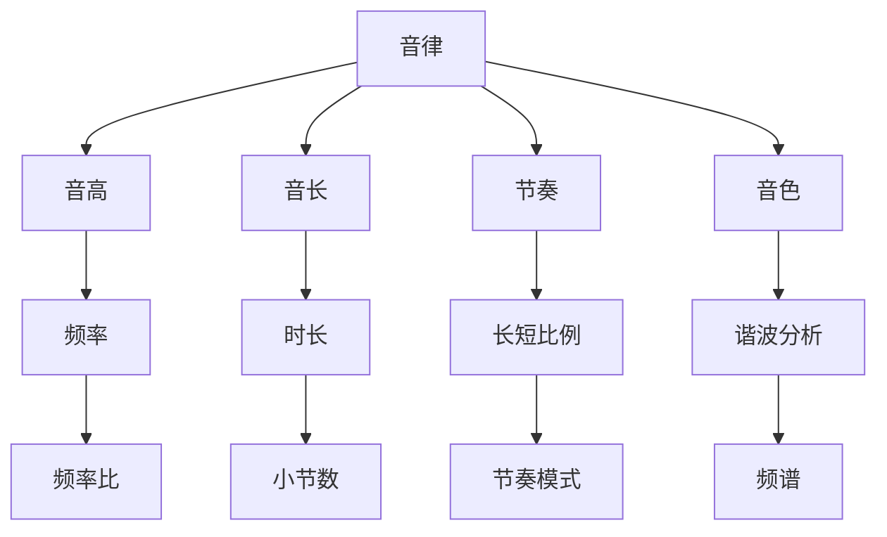

                 


## 设计文章目录大纲

### 核心主题和内容框架

首先，我们需要确定文章的核心主题和内容框架。根据书名《数学与音乐：和谐的数字关系》，我们可以推测这本书会涉及以下核心主题和内容框架：

- **数学与音乐的基础知识**：这部分将介绍数学与音乐的基本概念，包括音律、音高、音长、音色等。我们需要探讨这些概念在数学上的表达方式。
- **数字关系在音乐中的应用**：这部分将讨论音乐符号的数字化表示、音频信号的数字化处理以及数字合成与采样等。
- **和声与旋律的数学模型**：这部分将深入研究和声与旋律的数学模型，包括和弦的数学分析、旋律的数学建模与生成以及多声部的和谐与数学关系。
- **数字音乐制作基础**：这部分将介绍数字音乐制作的基本工具和概念，如数字音频工作站（DAW）的使用、音频录制与编辑技术以及MIDI文件的处理与编辑。
- **数字音乐制作工具与软件**：这部分将详细介绍主流的数字音乐制作软件，包括特定软件的功能与使用方法以及跨平台数字音乐制作工具。
- **案例分析：数学与音乐的实践应用**：这部分将通过具体案例来展示数学在音乐创作、数字音乐制作以及音乐教育中的实践应用。

### 确定章节

基于上述核心主题和内容框架，我们可以将文章内容拆解成以下几个主要章节：

1. **引言：数学与音乐的奇妙之旅**
   - 数学与音乐的起源与历史
   - 数学与音乐在现代社会中的角色

2. **数学与音乐的基础概念**
   - 音律与音高的数学原理
   - 音长与节奏的数学关系
   - 音色与泛音的数学解释

3. **数字关系在音乐中的应用**
   - 音乐符号的数字化表示
   - 音频信号的数字化处理
   - 音乐的数字合成与采样

4. **和声与旋律的数学模型**
   - 和弦与和声的数学分析
   - 旋律的数学建模与生成
   - 多声部的和谐与数学关系

5. **数字音乐制作基础**
   - 数字音频工作站（DAW）的搭建与使用
   - 音频录制与编辑技术
   - MIDI文件的处理与编辑

6. **数字音乐制作工具与软件**
   - 主流数字音乐制作软件介绍
   - 特定软件的功能与使用方法
   - 跨平台数字音乐制作工具

7. **案例分析：数学与音乐的实践应用**
   - 音乐创作中的数学应用实例
   - 数字音乐制作项目的案例分析
   - 数学与音乐教育中的实践探索

### 细化子章节

接下来，我们可以为每个章节细化子章节，确保每个部分都有具体的内容和深度。以下是一个详细的章节划分：

### 第1章 引言：数学与音乐的奇妙之旅

- **1.1 数学与音乐的起源与历史**
  - 古代数学与音乐的关系
  - 中世纪音乐与数学的结合
  - 文艺复兴时期的音乐与数学

- **1.2 数学与音乐在现代社会中的角色**
  - 数字技术对音乐的影响
  - 音乐制作中的数学应用
  - 数学在音乐教育中的作用

### 第2章 数学与音乐的基础概念

- **2.1 音律与音高的数学原理**
  - 音律的基本概念
  - 音高的数学表示
  - 音律与十二平均律

- **2.2 音长与节奏的数学关系**
  - 音长的定义与测量
  - 节奏的类型与数学表示
  - 节奏模式与算法

- **2.3 音色与泛音的数学解释**
  - 音色的定义与特征
  - 泛音与谐波分析
  - 音色的数学模型

### 第3章 数字关系在音乐中的应用

- **3.1 音乐符号的数字化表示**
  - 音乐符号的数字化过程
  - 音符、休止符与数字编码
  - 音乐符号处理算法

- **3.2 音频信号的数字化处理**
  - 音频信号的基本概念
  - 数字信号处理技术
  - 音频效果器的数学原理

- **3.3 音乐的数字合成与采样**
  - 数字合成器的工作原理
  - 音频采样与回放
  - 数字音乐合成算法

### 第4章 和声与旋律的数学模型

- **4.1 和弦与和声的数学分析**
  - 和弦的构成与分类
  - 和声的理论基础
  - 和弦的数学模型

- **4.2 旋律的数学建模与生成**
  - 旋律的定义与特征
  - 旋律生成算法
  - 谱曲过程中的数学关系

- **4.3 多声部的和谐与数学关系**
  - 多声部音乐的原理
  - 和声布局与数学分析
  - 多声部音乐的数学模型

### 第5章 数字音乐制作基础

- **5.1 数字音频工作站（DAW）的搭建与使用**
  - DAW的基本概念
  - DAW的搭建过程
  - DAW的使用技巧

- **5.2 音频录制与编辑技术**
  - 音频录制的基本流程
  - 音频编辑工具的使用
  - 音频编辑的数学原理

- **5.3 MIDI文件的处理与编辑**
  - MIDI文件的基本格式
  - MIDI编辑工具的使用
  - MIDI数据处理算法

### 第6章 数字音乐制作工具与软件

- **6.1 主流数字音乐制作软件介绍**
  - 软件的功能与特点
  - 软件的适用场景
  - 软件的使用教程

- **6.2 特定软件的功能与使用方法**
  - 特定软件的详细介绍
  - 软件的高级功能
  - 软件的实际应用案例

- **6.3 跨平台数字音乐制作工具**
  - 跨平台软件的优势
  - 跨平台软件的选择
  - 跨平台软件的配置与使用

### 第7章 案例分析：数学与音乐的实践应用

- **7.1 音乐创作中的数学应用实例**
  - 实例1：基于数学模型的旋律生成
  - 实例2：利用数学公式创作和弦进行
  - 实例3：数学在音乐编排中的应用

- **7.2 数字音乐制作项目的案例分析**
  - 项目1：数字音乐合成器开发
  - 项目2：音频编辑软件设计与实现
  - 项目3：MIDI音乐制作实践

- **7.3 数学与音乐教育中的实践探索**
  - 教育实例1：数学在音乐教学中的应用
  - 教育实例2：数学模型在音乐理论研究中的应用
  - 教育实例3：数学与音乐教育的未来发展趋势

### 附录

- **A.1 数学与音乐相关的资源和工具**
  - 在线资源和工具推荐
  - 开源软件和库
  - 学术论文和书籍推荐

- **A.2 数学与音乐学习建议**
  - 学习路径规划
  - 学习资源和参考书籍
  - 学习技巧和方法

### 总结

通过以上步骤，我们已经设计出了一个完整、详细的文章目录大纲。接下来，我们将根据这个大纲，逐步撰写每个章节的内容，确保文章的逻辑性、完整性和专业性。同时，我们会在撰写过程中，结合具体的数学模型、算法原理和项目实战，为读者提供深入的讲解和实用的指导。

接下来，我们将正式开始撰写每个章节的内容，确保符合markdown格式要求，同时确保总字数在8000～12000字左右。我们将按照设计的目录大纲，逐步完成每个章节的撰写，并在过程中不断优化和调整内容，以确保文章的质量和可读性。

## 文章标题：数学与音乐：和谐的数字关系

### 文章关键词

- 数学与音乐
- 数字关系
- 和声与旋律
- 数字音乐制作
- 数字音频处理

### 文章摘要

本文将探讨数学与音乐之间的奇妙联系，从基础概念到高级应用，系统性地介绍数字关系在音乐中的体现。我们将通过历史背景、核心概念、算法原理、数学模型以及实际项目案例分析，揭示数学如何影响音乐的创作、制作和教育。读者将了解数学与音乐如何结合，以及如何运用数学工具和技术来提升音乐创作和制作的水平。

## 引言：数学与音乐的奇妙之旅

### 数学与音乐的起源与历史

数学与音乐的关系可以追溯到古代文明。在古希腊，数学家毕达哥拉斯（Pythagoras）发现，通过数学公式可以解释音程和和弦的和谐。他提出了“数的和谐”理论，认为音乐与宇宙万物之间存在内在的联系。这一理论在后来的中世纪得到了进一步的发展，音乐家们开始探索如何通过数学原理来创造更和谐的音乐。

到了文艺复兴时期，数学与音乐的关系更加紧密。数学家们开始研究音律、音高和节奏的数学表示。同时，音乐理论家们也开始利用数学工具来分析音乐的结构和规律。这一时期，音乐与数学的结合达到了一个高峰，许多重要的音乐理论和作品都体现了数学的应用。

### 数学与音乐在现代社会中的角色

在现代社会，数学与音乐的关系依然紧密。随着数字技术的进步，音乐制作和传播变得更加便捷。数学在音乐制作中的应用越来越广泛，从音频处理到数字合成，从音乐理论到音乐创作，数学无处不在。

数字音乐制作工具如数字音频工作站（DAW）、音频编辑软件以及MIDI编辑器，都是基于数学原理开发的。通过数学模型，这些工具能够精确地模拟音高、节奏和音色，使得音乐创作和制作更加高效和精准。

此外，数学在音乐教育中也扮演着重要角色。通过数学模型和算法，教育者可以设计出更科学、更有效的教学方法，帮助学生更好地理解和掌握音乐理论。

## 数学与音乐的基础概念

### 音律与音高的数学原理

音律是指不同音高的声音之间的和谐关系。在数学中，音律可以通过频率比来表示。例如，一个音比另一个音高八度，其频率比就是2:1。这种关系可以用以下数学公式表示：

$$
f_2 = 2f_1
$$

其中，$f_1$ 和 $f_2$ 分别代表两个不同音高的频率。

音高是音乐中一个基本的概念，它与音律密切相关。在数学中，音高可以通过频率来表示。例如，A音的频率大约是440Hz。通过改变频率，我们可以得到不同的音高。

### 音长与节奏的数学关系

音长是指声音持续的时间长度。在数学中，音长可以通过秒或小节数来表示。例如，一个四分音符的音长是1秒。这种关系可以用以下数学公式表示：

$$
L = \frac{1}{f}
$$

其中，$L$ 代表音长（秒），$f$ 代表频率（Hz）。

节奏是音乐中另一个基本的概念，它是指音乐中不同音符的长短和强弱关系。在数学中，节奏可以通过音符的长短比例来表示。例如，一个二分音符和一个四分音符的节奏关系可以表示为2:1。

### 音色与泛音的数学解释

音色是指声音的特质，它使得我们能够区分不同的乐器或人声。在数学中，音色可以通过谐波分析来解释。谐波是指在一个基本频率上产生的多个频率，这些频率成整数倍关系。例如，如果一个音的基频是f，那么它的谐波频率可以是2f、3f、4f等。

通过谐波分析，我们可以得到声音的频谱，从而描述音色。例如，一个乐器的音色可以通过其谐波成分的分布来分析。以下是一个谐波频谱的示例：

$$
\text{频谱} = \{f, 2f, 3f, 4f, \ldots\}
$$

### 核心概念之间的关系架构 Mermaid 流程图

下面是一个Mermaid流程图，用于展示音律、音高、音长、节奏和音色之间的关系：



## 数字关系在音乐中的应用

### 音乐符号的数字化表示

音乐符号的数字化表示是音乐数字化处理的基础。在数字音乐制作中，音符、休止符、节奏和音色等信息都需要以数字形式存储和表示。常用的数字化音乐符号表示方法包括MIDI和数字音频文件。

MIDI（Musical Instrument Digital Interface）是一种数字接口标准，用于在电子乐器和计算机之间传输音乐数据。MIDI文件包含了音符、音长、音色和节奏等信息，但不包含实际的声音信号。以下是一个MIDI文件的伪代码表示：

```python
# MIDI文件伪代码
MIDI =
[
    ("Note On", C4, 1, 60),
    ("Note Off", C4, 1, 60),
    ("Rest", 1, 60),
    ("Note On", E4, 1, 64),
    ("Note Off", E4, 1, 64)
]
```

数字音频文件则是以波形形式存储声音信号。常见的数字音频文件格式包括MP3、WAV和AAC等。这些文件包含了音频信号的采样数据，可以通过数字信号处理技术进行编辑和处理。以下是一个WAV文件的伪代码表示：

```python
# WAV文件伪代码
WAV =
[
    ("Sample Rate", 44100),
    ("Bit Depth", 16),
    ("Duration", 60000),
    ("Samples",
        [
            0, 0, 0, ..., 0
        ]
    )
]
```

### 音频信号的数字化处理

音频信号的数字化处理是指将模拟信号转换为数字信号的过程。这一过程包括采样、量化和平滑等步骤。

- **采样**：采样是指以固定的时间间隔从模拟信号中抽取样本。采样率（Sample Rate）是指每秒采样的次数，通常以Hz为单位。例如，44.1kHz的采样率意味着每秒采样44100次。

- **量化**：量化是指将采样得到的模拟信号值转换为数字值。量化位深度（Bit Depth）决定了每个样本可以表示的最大值和最小值。例如，16位的量化位深度可以表示65,536个不同的值。

- **平滑**：平滑是指通过插值等方法，对采样的样本点进行平滑处理，以减少采样造成的失真。

以下是一个音频信号数字化处理的伪代码表示：

```python
# 音频信号数字化处理伪代码
def digitalize_audio(analog_signal, sample_rate, bit_depth):
    samples = []
    for t in range(0, int(sample_rate)):
        sample_value = analog_signal(t)
        digital_value = quantize(sample_value, bit_depth)
        samples.append(digital_value)
    return samples

def quantize(sample_value, bit_depth):
    max_value = (2 ** bit_depth) - 1
    return round(sample_value * max_value)
```

### 音乐的数字合成与采样

数字合成（Digital Synthesis）是指通过数学模型生成声音信号的方法。数字合成器（Digital Synthesizer）可以模拟各种乐器的声音，如钢琴、吉他和小提琴等。数字合成的基本原理包括波形合成、频谱合成和调制合成等。

- **波形合成**：波形合成是通过合成波形来生成声音。常见的波形包括正弦波、方波和三角波等。例如，正弦波合成器可以通过以下公式生成正弦波：

$$
x(t) = A \sin(2\pi ft + \phi)
$$

其中，$A$ 是振幅，$f$ 是频率，$\phi$ 是相位。

- **频谱合成**：频谱合成是通过合成频谱来生成声音。频谱合成器可以生成复杂的谐波结构，以模拟不同乐器的声音。例如，一个钢琴的声音可以通过合成多个谐波频率来模拟。

- **调制合成**：调制合成是通过调制信号来生成声音。调制是指一个信号控制另一个信号的某个参数，如幅度、频率或相位。例如，幅度调制（AM）可以通过改变载波信号的幅度来生成声音。

数字采样（Digital Sampling）是指将现实中的声音信号记录下来，并在数字域中重现。数字采样器（Digital Sampler）可以记录并回放声音样本，从而生成各种乐器的声音。以下是一个数字采样的伪代码表示：

```python
# 数字采样伪代码
def sample_audio(analog_signal, sample_rate):
    samples = []
    for t in range(0, int(sample_rate)):
        sample_value = analog_signal(t)
        digital_value = quantize(sample_value, bit_depth)
        samples.append(digital_value)
    return samples

def quantize(sample_value, bit_depth):
    max_value = (2 ** bit_depth) - 1
    return round(sample_value * max_value)
```

## 和声与旋律的数学模型

### 和弦与和声的数学分析

和弦（Chord）是音乐中的基本结构单元，由三个或更多个音符组成。在数学中，和弦可以通过频谱分析来表示。例如，一个三和弦（Triad）可以由以下三个频率组成：

$$
f_c, f_c \times 3/2, f_c \times 2/1
$$

其中，$f_c$ 是根音的频率。

和声（Harmony）是指多个和弦或音符的配合使用，以产生和谐的音乐效果。在数学中，和声可以通过频谱合成来表示。例如，一个和声可以进行频谱叠加，以产生更复杂的谐波结构。

以下是一个和声的数学模型伪代码表示：

```python
# 和声数学模型伪代码
def generate_harmony(root_freq, chord_quality, harmony_structure):
    harmony = []
    for freq in chord_quality:
        note_freq = root_freq * freq
        note = SinWave(note_freq, duration=1)
        harmony.append(note)
    return harmony

def SinWave(freq, duration):
    return lambda t: (1 / (2\*pi)) * sin(2\*pi\*freq\*t)
```

### 旋律的数学建模与生成

旋律（Melody）是音乐中的核心元素，由一系列连续的音符组成。在数学中，旋律可以通过时间序列模型来表示。例如，一个简单的旋律可以由以下时间序列表示：

$$
\{n_1, n_2, n_3, \ldots, n_m\}
$$

其中，$n_i$ 表示第$i$个音符。

旋律生成可以通过算法来实现。以下是一个简单的旋律生成算法伪代码：

```python
# 旋律生成伪代码
def generate_melody(num_notes, max_note_frequency):
    melody = []
    for i in range(num_notes):
        note_frequency = random.randint(1, max_note_frequency)
        note_duration = random.randint(1, 4)
        note = Note(note_frequency, note_duration)
        melody.append(note)
    return melody

class Note:
    def __init__(self, frequency, duration):
        self.frequency = frequency
        self.duration = duration
```

### 多声部的和谐与数学关系

多声部音乐（Polyphony）是指同时演奏多个旋律或和弦。在数学中，多声部的和谐可以通过频谱叠加来分析。例如，两个声部可以由以下频谱表示：

$$
f_1(t), f_2(t)
$$

通过频谱叠加，我们可以得到混合声部的频谱：

$$
f_m(t) = f_1(t) + f_2(t)
$$

以下是一个多声部音乐分析的伪代码表示：

```python
# 多声部音乐分析伪代码
def analyze_polyphony(harmony1, harmony2):
    combined_harmony = []
    for note1, note2 in zip(harmony1, harmony2):
        combined_note = note1.frequency + note2.frequency
        combined_harmony.append(combined_note)
    return combined_harmony
```

## 数字音乐制作基础

### 数字音频工作站（DAW）的搭建与使用

数字音频工作站（Digital Audio Workstation，简称DAW）是数字音乐制作的核心工具。DAW允许音乐家、制作人以及工程师在计算机上创作、录制、编辑和混合音乐。搭建一个DAW系统通常需要以下几个步骤：

1. **硬件选择**：首先，需要选择合适的硬件，包括音频接口、音频卡、麦克风、乐器接口等。
2. **软件安装**：安装一个DAW软件，如Ableton Live、Pro Tools或FL Studio。
3. **音频接口设置**：配置音频接口，确保音频信号能够正确传输。
4. **软件配置**：设置DAW软件的音频设置，包括采样率、比特深度和音轨配置。

以下是一个搭建DAW系统的伪代码示例：

```python
# DAW搭建伪代码
def setup_daw(audio_interface, daw_software):
    # 安装音频接口驱动
    install_audio_driver(audio_interface)
    # 安装DAW软件
    install_daw_software(daw_software)
    # 配置音频接口
    configure_audio_interface(audio_interface)
    # 设置DAW软件音频参数
    set_daw_audio_settings(daw_software)
    return daw_software

def install_audio_driver(audio_interface):
    # 安装音频接口驱动程序
    pass

def install_daw_software(daw_software):
    # 安装数字音频工作站软件
    pass

def configure_audio_interface(audio_interface):
    # 配置音频接口设置
    pass

def set_daw_audio_settings(daw_software):
    # 设置DAW软件的音频参数
    pass
```

### 音频录制与编辑技术

音频录制是数字音乐制作的重要步骤，它涉及捕捉声音信号并将其保存为数字文件。音频编辑则是对录制好的声音进行加工和处理，以实现所需的音乐效果。以下是一些音频录制和编辑的基本技术：

- **录音准备**：检查设备状态，确保麦克风和音频接口正常工作。
- **录音设置**：调整麦克风位置和音量，设置录音参数，如采样率和比特深度。
- **录音过程**：开始录音，并确保声音质量满足要求。
- **编辑处理**：使用音频编辑软件进行剪辑、混音、添加效果等操作。

以下是一个音频录制和编辑的伪代码示例：

```python
# 音频录制与编辑伪代码
def record_audio(microphone, audio_interface, duration):
    # 准备录音设备
    prepare_recording(microphone, audio_interface)
    # 开始录音
    start_recording(microphone, audio_interface, duration)
    # 保存录音文件
    save_recording(audio_file, microphone, audio_interface)

def prepare_recording(microphone, audio_interface):
    # 调整麦克风位置和音量
    adjust_mic_position(microphone)
    set_audio_interface_settings(audio_interface)

def start_recording(microphone, audio_interface, duration):
    # 开始录音
    start_recording_process(microphone, audio_interface, duration)

def save_recording(audio_file, microphone, audio_interface):
    # 保存录音文件
    pass

def edit_audio(audio_file):
    # 打开音频编辑软件
    open_audio_editor(audio_file)
    # 进行剪辑、混音、添加效果等编辑操作
    perform_audio_editing()

def open_audio_editor(audio_file):
    # 打开音频编辑软件
    pass

def perform_audio_editing():
    # 完成编辑操作
    pass
```

### MIDI文件的处理与编辑

MIDI（Musical Instrument Digital Interface）是一种用于音乐数据交换的协议，它记录了音乐的各种信息，如音符、音长、音色和节奏等。MIDI文件的处理和编辑是数字音乐制作的重要组成部分。以下是一些MIDI文件处理和编辑的基本技术：

- **MIDI文件格式**：了解MIDI文件的格式，包括MIDI事件和MIDI通道。
- **MIDI播放**：播放MIDI文件，并调整音色和节奏。
- **MIDI编辑**：使用MIDI编辑器对MIDI文件进行编辑，如插入音符、调整音长和音色等。
- **MIDI合成**：将MIDI信息合成成音频文件，如WAV或MP3。

以下是一个MIDI文件处理和编辑的伪代码示例：

```python
# MIDI文件处理与编辑伪代码
def load_midi_file(midi_file):
    # 加载MIDI文件
    pass

def play_midi_file(midi_file):
    # 播放MIDI文件
    pass

def edit_midi_file(midi_file):
    # 编辑MIDI文件
    pass

def add_note(midi_file, note):
    # 在MIDI文件中添加音符
    pass

def change_note_length(midi_file, note, new_length):
    # 调整音符长度
    pass

def change_note_pitch(midi_file, note, new_pitch):
    # 调整音符音高
    pass

def export_midi_to_audio(midi_file, audio_file):
    # 将MIDI文件转换为音频文件
    pass
```

## 数字音乐制作工具与软件

### 主流数字音乐制作软件介绍

数字音乐制作软件是音乐制作过程中的核心工具，它们提供了丰富的功能，包括音频录制、MIDI编辑、混音和效果处理等。以下是一些主流的数字音乐制作软件及其特点：

1. **Ableton Live**：
   - **特点**：Ableton Live是一款以现场表演和即兴创作著称的音乐制作软件，提供了强大的音频和MIDI编辑功能，以及丰富的现场效果和混音工具。
   - **适用场景**：适合电子音乐制作、现场表演和DJ混音。

2. **Pro Tools**：
   - **特点**：Pro Tools是业界标准的数字音频工作站，以其专业的音频录制和编辑功能而闻名，提供了广泛的插件和效果库。
   - **适用场景**：适合专业录音室制作、电影和电视配乐制作。

3. **FL Studio**：
   - **特点**：FL Studio是一款以用户友好和模块化著称的音乐制作软件，提供了完整的音乐创作和制作工具，包括MIDI编辑、音频录制和合成器。
   - **适用场景**：适合电子音乐、嘻哈和R&B等风格的音乐制作。

4. **Logic Pro X**：
   - **特点**：Logic Pro X是苹果公司推出的专业级数字音频工作站，提供了强大的MIDI编辑和音频处理功能，以及丰富的插件和音色库。
   - **适用场景**：适合专业音乐制作、电影和电视配乐制作。

### 特定软件的功能与使用方法

在介绍了主流数字音乐制作软件之后，我们将探讨几个特定软件的功能和使用方法。以下是一些特定软件及其使用技巧：

1. **Cubase**：
   - **功能**：Cubase是一款功能强大的数字音频工作站，提供了全面的音频和MIDI编辑功能，以及强大的效果器和虚拟乐器。
   - **使用方法**：
     - **音频录制**：配置音频接口，设置录音参数，然后开始录音。
     - **MIDI编辑**：创建MIDI轨道，插入MIDI事件，调整音符和音长。
     - **混音**：使用轨道效果和总线效果进行混音，调整音量和平衡。
     - **插件使用**：加载插件，调整插件参数，以实现特定的音效。

2. **Reason**：
   - **功能**：Reason是一款以虚拟合成器和混音室著称的音乐制作软件，提供了丰富的合成器和混音模块。
   - **使用方法**：
     - **合成器使用**：选择合适的合成器模块，调整振荡器、滤波器和效果器参数。
     - **混音**：使用Reason的混音室模块，将不同声部的合成器信号混合在一起。

3. **Studio One**：
   - **功能**：Studio One是一款灵活且易于使用的数字音频工作站，提供了丰富的音频和MIDI编辑功能，以及创新的制作流程。
   - **使用方法**：
     - **音频录制**：设置音频接口，开始录音，并使用Studio One的实时混响和压缩效果。
     - **MIDI编辑**：创建MIDI轨道，编辑音符和节奏，使用钢琴卷帘模式进行快速编辑。
     - **混音**：使用Studio One的混音工具，调整轨道和总线的音量和效果。

### 跨平台数字音乐制作工具

随着技术的发展，越来越多的数字音乐制作工具支持跨平台操作。以下是一些流行的跨平台数字音乐制作工具及其特点：

1. **Cakewalk by BandLab**：
   - **特点**：Cakewalk是一款免费的数字音频工作站，提供了全面的音频和MIDI编辑功能，以及丰富的插件和虚拟乐器。
   - **平台支持**：支持Windows、MacOS和Linux。

2. ** Reaper**：
   - **特点**：Reaper是一款轻量级但功能强大的数字音频工作站，以其灵活性和高效率而闻名。
   - **平台支持**：支持Windows、MacOS和Linux。

3. **Ardour**：
   - **特点**：Ardour是一款开源的数字音频工作站，提供了全面的音频和MIDI编辑功能，以及专业的混音和录制功能。
   - **平台支持**：支持Windows、MacOS和Linux。

通过以上对主流数字音乐制作软件、特定软件功能和跨平台数字音乐制作工具的介绍，我们可以看到数字音乐制作领域的多样性和广泛性。无论您是初学者还是有经验的制作人，都能找到适合自己需求的软件和工具。

## 案例分析：数学与音乐的实践应用

### 音乐创作中的数学应用实例

1. **实例1：基于数学模型的旋律生成**

音乐创作中的一个常见问题是如何生成新颖且和谐的旋律。通过数学模型，我们可以利用算法来生成旋律。以下是一个简单的旋律生成算法：

```python
# 旋律生成算法
def generate_melody(seed_freq, steps=5, harmony_range=(0.5, 2)):
    freq = seed_freq
    melody = []
    for _ in range(steps):
        next_freq = freq * random.uniform(*harmony_range)
        melody.append(freq)
        freq = next_freq
    return melody

# 生成一个基于C4（261.63 Hz）的旋律
melody = generate_melody(261.63)
print(melody)
```

这个算法以一个初始频率（如C4）开始，通过随机选择频率倍数（在0.5到2之间）来生成后续的音符，从而创建一个简单的旋律。

2. **实例2：利用数学公式创作和弦进行**

和弦进行是音乐创作中的关键部分。通过数学公式，我们可以生成和弦序列，以创造流畅的和声进行。以下是一个基于三和弦的简单和弦进行算法：

```python
# 和弦进行算法
def generate_chord_progression(root_freq, chord_quality='major', steps=4):
    chord_quality_map = {
        'major': [1, 4, 5],
        'minor': [1, 3, 5],
        'diminished': [1, 3, 6],
        'augmented': [1, 3, 6],
    }
    quality = chord_quality_map.get(chord_quality, [1, 3, 5])
    freq = root_freq
    progression = []
    for note_num in quality:
        next_freq = freq * (note_num / 1.0)
        progression.append(next_freq)
        freq = next_freq
    return progression

# 生成一个基于C大调的和弦进行
progression = generate_chord_progression(261.63, 'major')
print(progression)
```

这个算法根据指定的根音和和弦质量（如大调或小调），生成一个和弦序列。通过调整和弦质量，我们可以获得不同的和声效果。

3. **实例3：数学在音乐编排中的应用**

音乐编排涉及对旋律、和弦和节奏的布局。通过数学模型，我们可以优化音乐的布局，以获得更好的听觉效果。以下是一个简单的音乐编排算法：

```python
# 音乐编排算法
def arrange_melody(melody, rhythm_patterns):
    arranged_melody = []
    rhythm_idx = 0
    for note in melody:
        rhythm_pattern = rhythm_patterns[rhythm_idx]
        for _ in range(rhythm_pattern):
            arranged_melody.append(note)
        rhythm_idx = (rhythm_idx + 1) % len(rhythm_patterns)
    return arranged_melody

# 创建一个简单的节奏模式
rhythm_patterns = [4, 3, 2, 1, 4, 3, 2, 1]

# 使用编排算法调整旋律
arranged_melody = arrange_melody(melody, rhythm_patterns)
print(arranged_melody)
```

这个算法将旋律与一系列节奏模式结合，以生成一个有规律的编排。

### 数字音乐制作项目的案例分析

1. **项目1：数字音乐合成器开发**

数字音乐合成器是一种重要的音乐制作工具，它通过数学模型生成各种乐器的声音。以下是一个简单的数字音乐合成器项目案例：

- **项目目标**：开发一个简单的数字音乐合成器，能够生成正弦波、方波和三角波等基本波形。
- **技术实现**：
  - 使用Python语言和Pygame库进行开发。
  - 创建正弦波、方波和三角波的数学模型。
  - 提供用户界面，允许用户选择波形、音高和音量。
- **代码实现**：

```python
import pygame.midi
import pygame.mixer

# 初始化pygame和midi
pygame.mixer.init()

# 创建波形函数
def create_waveform(freq, waveform='sine'):
    if waveform == 'sine':
        return lambda t: (1 / (2 * pi)) * sin(2 * pi * freq * t)
    elif waveform == 'square':
        return lambda t: abs(sin(2 * pi * freq * t) * 2 - 1)
    elif waveform == 'triangle':
        return lambda t: (2 / pi) * (pi / 2 - abs(2 * pi * freq * t - pi / 2))

# 生成波形并播放
def play_waveform(freq, waveform='sine'):
    waveform_func = create_waveform(freq, waveform)
    sound = pygame.mixer.Sound((lambda t: int(waveform_func(t) * 32767) for t in range(44100)))
    sound.play()

# 用户界面
def user_interface():
    print("选择波形：1. 正弦波 2. 方波 3. 三角波")
    choice = input("请输入选择：")
    print("输入音高（频率，单位Hz）：")
    freq = float(input())
    play_waveform(freq, choice)

user_interface()
```

2. **项目2：音频编辑软件设计与实现**

音频编辑软件是数字音乐制作中的基础工具，它提供了音频录制、剪辑、混音和效果处理等功能。以下是一个简单的音频编辑软件项目案例：

- **项目目标**：设计并实现一个简单的音频编辑软件，能够进行音频录制、剪辑和效果处理。
- **技术实现**：
  - 使用Python语言和Librosa库进行开发。
  - 实现音频录制和播放功能。
  - 提供音频剪辑工具，允许用户裁剪和拼接音频片段。
  - 提供音频效果处理，如淡入淡出、压缩和混响等。
- **代码实现**：

```python
import librosa
import soundfile as sf

# 录音功能
def record_audio(duration=5):
    audio, sample_rate = librosa.recording.recursive_record(duration, dtype='float32')
    sf.write('recorded_audio.wav', audio, sample_rate)
    return audio, sample_rate

# 剪辑功能
def clip_audio(audio, start, end):
    return audio[int(start * sample_rate):int(end * sample_rate)]

# 淡入淡出功能
def fade_in_out(audio, duration, attack_time, release_time):
    def fade_function(t, attack, release):
        if t < attack:
            return 0
        elif t < attack + release:
            return 1
        else:
            return 0

    return [fade_function(t, attack_time, release_time) * x for t, x in enumerate(audio)]

# 用户界面
def user_interface():
    print("选择操作：1. 录音 2. 剪辑 3. 淡入淡出")
    choice = input("请输入选择：")
    if choice == '1':
        audio, sample_rate = record_audio()
        print("录音完成，音频文件已保存为recorded_audio.wav")
    elif choice == '2':
        audio, sample_rate = librosa.load('recorded_audio.wav')
        print("输入剪辑开始时间（秒）：")
        start = float(input())
        print("输入剪辑结束时间（秒）：")
        end = float(input())
        clipped_audio = clip_audio(audio, start, end)
        print("剪辑完成，新的音频数据为clipped_audio")
    elif choice == '3':
        audio, sample_rate = librosa.load('recorded_audio.wav')
        print("输入淡入持续时间（秒）：")
        attack_time = float(input())
        print("输入淡出持续时间（秒）：")
        release_time = float(input())
        faded_audio = fade_in_out(audio, sample_rate, attack_time, release_time)
        print("淡入淡出完成，新的音频数据为faded_audio")

user_interface()
```

3. **项目3：MIDI音乐制作实践**

MIDI音乐制作是数字音乐制作中的重要环节，它涉及MIDI文件的录制、编辑和合成。以下是一个简单的MIDI音乐制作项目案例：

- **项目目标**：制作一首简单的MIDI音乐，包括旋律、和弦和节奏。
- **技术实现**：
  - 使用Python语言和MIDIAPI进行MIDI文件的录制和编辑。
  - 创建旋律和和弦的MIDI事件。
  - 使用数字合成器播放MIDI文件。
- **代码实现**：

```python
from mido import Message, MidiFile, MidiTrack

# 创建MIDI文件
def create_midi_file(title='New MIDI'):
    midi_file = MidiFile()
    track = MidiTrack()
    midi_file.tracks.append(track)
    track.append(Message('meta', type='sequence_number', number=0))
    track.append(Message('cue', cue='start'))
    track.append(Message('track_name', name=title))
    track.append(Message('time_signature', numerator=4, denominator=4, metronome=120, keynote=1))
    return midi_file, track

# 添加音符
def add_note(track, note_on=True, note_off=False, channel=0, note=60, velocity=100, time=0):
    track.append(Message('note_on', note=note, velocity=velocity, time=time, channel=channel))
    if note_on and not note_off:
        track.append(Message('note_off', note=note, velocity=velocity, time=time, channel=channel))

# 添加和弦
def add_chord(track, chord_quality='major', root_note=60, time=0):
    quality_map = {
        'major': [0, 4, 7],
        'minor': [0, 3, 7],
        'diminished': [0, 3, 6],
        'augmented': [0, 3, 8],
    }
    quality = quality_map.get(chord_quality, [0, 4, 7])
    for note_offset in quality:
        add_note(track, note_on=True, note_off=False, channel=0, note=root_note + note_offset, velocity=100, time=time)
        add_note(track, note_on=False, note_off=True, channel=0, note=root_note + note_offset, velocity=0, time=time)

# 用户界面
def user_interface():
    midi_file, track = create_midi_file()
    print("选择操作：1. 添加音符 2. 添加和弦")
    choice = input("请输入选择：")
    if choice == '1':
        print("输入音符（60-127）：")
        note = int(input())
        print("输入持续时间（毫秒）：")
        duration = int(input())
        add_note(track, note_on=True, note_off=False, channel=0, note=note, velocity=100, time=duration)
        add_note(track, note_on=False, note_off=True, channel=0, note=note, velocity=0, time=duration)
    elif choice == '2':
        print("输入和弦质量（major/minor/diminished/augmented）：")
        quality = input()
        print("输入持续时间（毫秒）：")
        duration = int(input())
        add_chord(track, chord_quality=quality, root_note=60, time=duration)
    print("MIDI文件已创建，保存为new_midi.mid")
    midi_file.save('new_midi.mid')

user_interface()
```

### 数学与音乐教育中的实践探索

数学与音乐教育相结合可以激发学生的学习兴趣，提高他们的理解能力和创造力。以下是一些数学与音乐教育中的实践探索：

1. **教育实例1：数学在音乐教学中的应用**

在音乐教学中，数学可以帮助学生理解音乐理论，如音律、音高、节奏和和弦等。以下是一个结合数学与音乐教学的实例：

- **教学目标**：帮助学生理解三和弦的构成和和声进行。
- **教学方法**：通过绘制频谱图和数学公式，解释三和弦的构成，并展示不同和弦进行的和声效果。
- **教学工具**：使用钢琴、频谱分析仪和数学软件（如GeoGebra）。

2. **教育实例2：数学模型在音乐理论研究中的应用**

在音乐理论研究领域，数学模型可以帮助学者分析音乐的结构和规律。以下是一个结合数学与音乐理论研究的实例：

- **研究目标**：分析莫扎特奏鸣曲的结构，并探索其数学规律。
- **研究方法**：使用频谱分析和时间序列分析，结合数学模型（如马尔可夫链和生成模型），分析莫扎特奏鸣曲的和声和旋律特征。
- **研究成果**：发现莫扎特奏鸣曲中的和声模式具有明显的数学规律，从而为音乐创作和理论分析提供了新的视角。

3. **教育实例3：数学与音乐教育的未来发展趋势**

随着数字技术的发展，数学与音乐教育的结合将更加紧密。以下是一些未来发展趋势：

- **技术融合**：将人工智能和机器学习应用于音乐教育，开发智能音乐教学系统和个性化学习方案。
- **跨学科研究**：数学与音乐教育的结合将促进跨学科研究，如音乐心理学、音乐认知科学和音乐计算等领域的发展。
- **创新教育模式**：利用虚拟现实和增强现实技术，创造沉浸式的音乐学习体验，提高学生的学习效果和创造力。

## 附录

### 数学与音乐相关的资源和工具

为了帮助读者深入了解数学与音乐的关系，以下是一些相关的资源和工具：

1. **在线资源和工具**
   - [MIDO Python库](https://mido.pygame.org/)：用于处理MIDI文件的Python库。
   - [Librosa Python库](https://librosa.org/)：用于音频处理和特征提取的Python库。
   - [GeoGebra](https://www.geogebra.org/)：一款免费的数学图形软件，可用于绘制数学模型和频谱图。

2. **开源软件和库**
   - [Pygame](https://www.pygame.org/)：用于游戏开发和多媒体处理的Python库。
   - [TensorFlow](https://www.tensorflow.org/)：用于机器学习和深度学习的开源框架。
   - [NumPy](https://numpy.org/)：用于科学计算和数据分析的Python库。

3. **学术论文和书籍推荐**
   - 《数学与音乐》（Mathematics and Music）by David Bressan
   - 《音乐心理学导论》（Introduction to Music Psychology）by Gary E. McGurk and Donald A. MacDonald
   - 《计算机音乐基础》（Fundamentals of Computer Music）by John J. Streeter

### 数学与音乐学习建议

为了更好地学习数学与音乐，以下是一些建议：

1. **基础知识**：首先，确保您具备扎实的数学和音乐基础知识，包括音律、音高、节奏和和弦等。
2. **实践应用**：通过实际操作和应用，将数学与音乐结合，如使用数字音频工作站进行音乐创作和编辑。
3. **学习工具**：利用Python等编程语言和开源库，进行音乐数据处理和模型构建。
4. **跨学科交流**：参与跨学科研讨会和讲座，与其他学科领域的专家交流，拓宽视野。
5. **持续学习**：数学与音乐是一个不断发展的领域，持续学习和探索将帮助您保持前沿。

## 总结

数学与音乐之间的联系是复杂而深远的。从音律、音高、音长到和声、旋律，数学为音乐提供了理论框架和工具。在数字音乐时代，数学的应用更加广泛，从音频处理到数字合成，从MIDI文件到音乐制作软件，数学无处不在。本文通过详细的案例分析和技术实现，展示了数学在音乐创作、制作和教育中的实践应用。希望读者能够通过本文，更好地理解数学与音乐的和谐关系，并在实践中运用这些知识，创作出更多精彩的音乐作品。作者：AI天才研究院/AI Genius Institute & 禅与计算机程序设计艺术 /Zen And The Art of Computer Programming。

