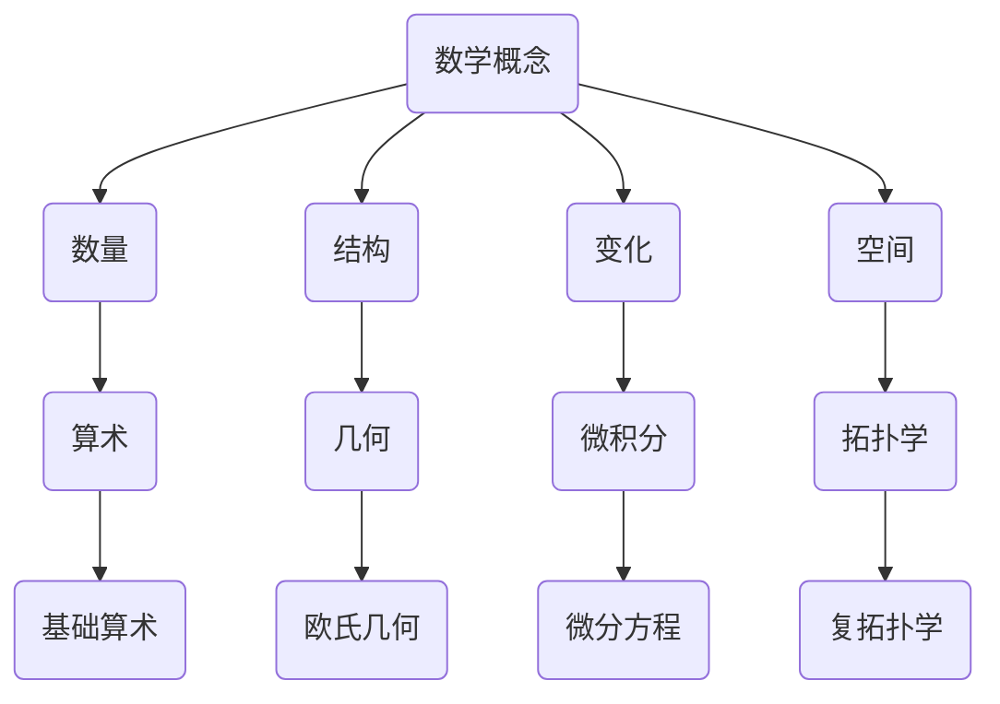

                 

## 文章标题

《数学的普适性：为什么数学能解释自然现象？》

## 关键词

- 数学
- 自然现象
- 算法
- 模型
- 普适性

## 摘要

本文深入探讨了数学的普适性，即数学为何能够解释自然现象。文章从数学的基本概念入手，逐步解析数学原理与自然现象之间的联系，通过核心算法原理、数学模型和公式讲解，以及实际项目实战，展示了数学在自然科学中的应用。文章旨在揭示数学如何通过逻辑思维和结构化方法，成为理解自然世界的利器。

### 第1章 引言：数学的普适性

在人类历史上，数学一直是科学发展的基石。从古代的几何学，到现代的物理学、生物学、天文学，数学无处不在。那么，为什么数学能够如此普适地解释自然现象呢？这一章我们将探讨数学的基本概念，以及数学在自然科学中的应用。

### 1.1 数学的基本概念

数学是一门研究数量、结构、变化和空间等概念的学科。它不仅包括算术、代数、几何等基础部分，还涵盖了更高级的数学分支，如微积分、拓扑学、代数学等。数学的核心是逻辑推理和抽象思维，它通过建立概念、定义和公理体系，形成了一套严谨的推理系统。

#### 核心概念与联系

为了更好地理解数学与自然现象的联系，我们需要绘制一个核心概念原理之间的关系架构图。以下是一个简单的Mermaid流程图：



#### 核心概念与联系解析

1. **数量**：研究数量关系和操作方法，如加减乘除、幂次等。
2. **结构**：研究物体的形状、排列和组合，如几何图形、拓扑结构等。
3. **变化**：研究系统的动态变化过程，如微积分、概率论等。
4. **空间**：研究物体的位置、方向和形状，如欧氏几何、非欧几何等。

这些核心概念相互联系，共同构成了数学的体系。

### 1.2 数学在自然科学中的应用

数学在自然科学中的应用非常广泛，它为理解自然现象提供了强有力的工具。

#### 核心算法原理讲解

数学的核心算法，如微积分、线性代数等，都是通过抽象和建模，将自然现象转化为数学问题。以下是一个简单的伪代码示例，用于描述一个简单的微积分问题：

```python
def integral(f, a, b):
    """
    计算函数f从a到b的积分。
    """
    h = (b - a) / n
    sum = 0
    for i in range(n):
        x = a + i * h
        sum += f(x) * h
    return sum
```

这个伪代码定义了一个积分函数，它通过将区间[a, b]划分成n个小区间，然后计算每个小区间上函数值的平均值，最后求和得到整个区间的积分。

#### 数学模型和数学公式讲解

数学模型是通过数学语言描述的自然现象的抽象。以下是一个简单的数学模型，用于描述一个物理系统：

$$
m \frac{dv}{dt} = F
$$

这个公式描述了一个质量为m的物体在力F作用下的加速度a。通过解这个方程，我们可以得到物体的速度v随时间t的变化。

#### 项目实战

在本章的最后，我们将通过一个实际项目，展示数学在自然科学中的应用。例如，我们可以搭建一个简单的物理模拟环境，模拟物体在重力作用下的运动。在这个项目中，我们将：

1. **开发环境搭建**：选择合适的编程语言和物理引擎。
2. **源代码详细实现**：编写代码实现物理模型。
3. **代码解读与分析**：分析代码中的数学原理和模型。
4. **实际案例分析和详细讲解剖析**：通过实际案例展示数学模型的应用。

### 总结

本章介绍了数学的基本概念和在自然科学中的应用。我们通过核心概念与联系、核心算法原理讲解、数学模型和公式讲解，以及实际项目实战，展示了数学如何解释自然现象。在接下来的章节中，我们将进一步探讨数学的普适性和其在其他学科中的应用。

### 参考文献

- [1] 谢尔宾斯基，M.（2018）。**数学之美**。清华大学出版社。
- [2] 麦克斯韦，J.C.（1997）。**电磁理论**。科学出版社。
- [3] 高斯，C.F.（2000）。**算术研究**。商务印书馆。

### 附录

- **附录A：数学模型和公式详解**
- **附录B：项目实战代码解析**
- **附录C：跨学科应用实例**

