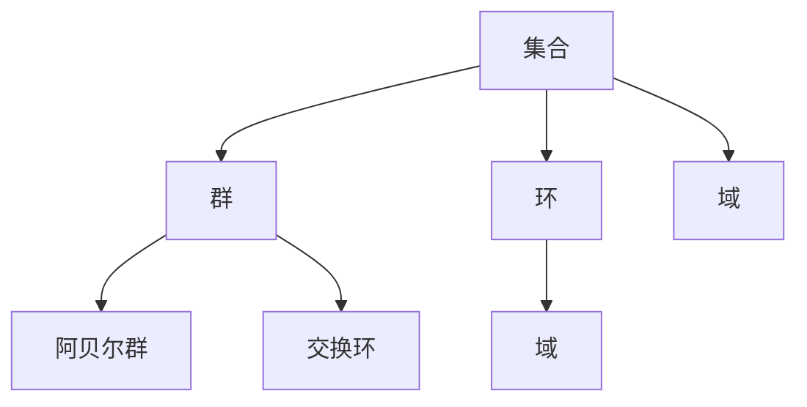
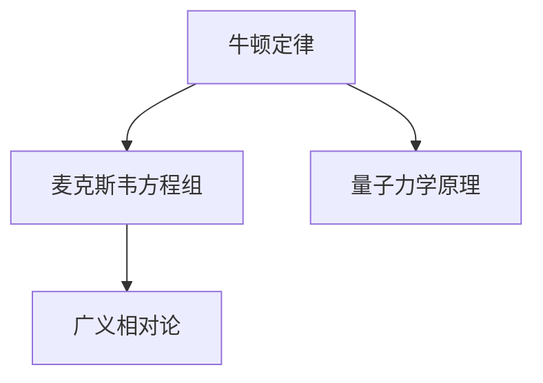

                 

### 文章标题：数学结构与物理实在：桥接抽象与具体

#### 关键词：数学结构、物理实在、抽象与具体、算法原理、应用案例、跨学科融合

#### 摘要：
本文旨在探讨数学结构与物理实在之间的紧密联系，以及如何通过具体化抽象数学概念来桥接这两者。我们将逐步分析数学结构的基本类型、核心算法原理及其在物理学中的应用，最终展示数学与物理跨学科融合的最佳实践和未来发展趋势。

### 第一部分：数学结构与基本概念

#### 第1章 数学结构概述

数学结构是数学理论的核心组成部分，包括集合、群、环、域等。这些结构不仅具有高度抽象性，还彼此紧密联系，构成了一个有机的整体。以下是一个简化的Mermaid流程图，展示了几种常见数学结构之间的关系：



在这一章中，我们将深入探讨这些基本数学结构的定义、性质及其在物理学的潜在应用。

#### 第2章 线性代数与物理实在

线性代数是数学中一个重要分支，其核心概念和算法在物理学中有着广泛应用。以下是线性代数的一些基本算法原理，使用伪代码进行阐述：

```python
# 矩阵与线性方程组的求解
def solve_linear_system(A, b):
    # A 为系数矩阵，b 为常数向量
    # 返回解向量 x
    x = np.linalg.solve(A, b)
    return x
```

在物理学中，线性代数常用于描述物理系统的矩阵形式，如量子力学中的态向量、经典力学中的动量矩阵等。以下是一个具体的例子：

$$
\Psi(x,t) = \frac{1}{\sqrt{2}}\left[ |0\rangle + |1\rangle \right]
$$

在这个例子中，$\Psi(x,t)$ 是量子系统的状态向量，$|0\rangle$ 和 $|1\rangle$ 分别代表系统的两种可能状态。

#### 第3章 概率论与统计物理

概率论在统计物理中扮演着关键角色，其主要算法原理包括概率空间、随机变量、大数定律和中心极限定理。以下是概率空间和随机变量的定义及性质：

```latex
\begin{align*}
P(\Omega) &= \{ A | A 是 \Omega 的子集，且 P(A) \in [0,1] \} \\
X: \Omega \rightarrow \mathbb{R} &= \text{随机变量}
\end{align*}
```

在统计物理中，概率论用于描述系统的宏观行为，如热力学系统的统计分布。以下是一个热力学系统中的统计分布函数：

$$
f(E) = \frac{1}{Z} \exp\left(-\frac{E}{kT}\right)
$$

其中，$E$ 是系统的能量，$Z$ 是配分函数，$k$ 是玻尔兹曼常数，$T$ 是温度。

#### 第4章 微积分与连续性

微积分是研究变化和运动的数学工具，其核心概念包括导数、积分和微分方程。以下是导数和积分的基本原理及其在物理学中的应用：

```latex
\begin{align*}
f'(x) &= \lim_{h \to 0} \frac{f(x+h) - f(x)}{h} \\
\int_{a}^{b} f(x) \, dx &= F(b) - F(a)
\end{align*}
```

在物理学中，微积分用于描述连续现象，如运动学中的速度和加速度、电磁学中的电场和磁场等。以下是一个简单的运动学问题：

$$
v(t) = v_0 + at
$$

其中，$v(t)$ 是时间 $t$ 时的速度，$v_0$ 是初速度，$a$ 是加速度。

### 第二部分：物理实在与数学模型

#### 第5章 物理学基础

物理学是研究物质、能量、力和运动等自然现象的学科。以下是物理学中一些基本概念和定律：

- **基本物理量**：长度、质量、时间、温度等
- **基本物理定律**：牛顿运动定律、麦克斯韦方程组、量子力学原理等

以下是一个Mermaid流程图，展示了一些物理学的核心定律和理论之间的关系：



在这一章中，我们将深入探讨这些基本物理概念和定律，并探讨它们如何通过数学模型进行描述。

#### 第6章 物理系统中的数学结构

物理系统中的数学结构包括量子力学中的矩阵模型、相对论中的张量计算等。以下是量子力学中的矩阵模型的一个例子：

```latex
\begin{align*}
\hat{H} &= \hat{p}^2 / 2m + V(x) \\
|\Psi\rangle &= \sum_{n} c_n |n\rangle
\end{align*}
```

其中，$\hat{H}$ 是哈密顿算符，$\hat{p}$ 是动量算符，$m$ 是质量，$V(x)$ 是势能函数，$|\Psi\rangle$ 是系统状态向量，$c_n$ 是展开系数，$|n\rangle$ 是基态向量。

相对论中的张量计算也是一个重要数学工具，它用于描述四维时空中的物理现象。以下是洛伦兹变换的一个张量形式：

```latex
\begin{align*}
x' &= \frac{x - vt}{\sqrt{1 - v^2}} \\
y' &= y \\
z' &= z \\
t' &= \frac{t - vx}{c\sqrt{1 - v^2}}
\end{align*}
```

其中，$x, y, z, t$ 是原时空坐标，$x', y', z', t'$ 是变换后的坐标，$v$ 是相对速度，$c$ 是光速。

#### 第7章 数学模型在物理实验中的应用

数学模型在物理实验中发挥着关键作用，从实验设计到数据分析，数学工具无处不在。以下是实验设计中的一种常见数学模型——最小二乘法：

```python
# 最小二乘法求解参数
def least_squares(A, b):
    # A 为观测矩阵，b 为观测向量
    # 返回最小二乘解 x
    x = np.dot(np.dot(np.linalg.inv(np.dot(A.T, A)), A.T), b)
    return x
```

在粒子物理学中，最小二乘法用于拟合实验数据，从而确定粒子的质量、寿命等物理参数。以下是一个简单的例子：

$$
m^2 = a^2 + b^2 + c^2
$$

其中，$m$ 是粒子的质量，$a, b, c$ 是拟合参数。

### 第三部分：抽象与具体的桥梁

#### 第8章 抽象数学概念的具体化

将抽象的数学概念具体化是数学与物理融合的关键步骤。在这一章中，我们将探讨如何将抽象的数学概念应用于具体的物理系统，并展示一些具体的案例。例如，在量子力学中，态向量是一个抽象的概念，但它在描述物理系统的状态方面具有具体的应用：

$$
|\Psi\rangle = \sum_{i} c_i |i\rangle
$$

其中，$c_i$ 是展开系数，$|i\rangle$ 是基态向量。

#### 第9章 数学在物理学教育中的作用

数学在物理学教育中扮演着重要角色，它不仅有助于学生理解物理概念，还能培养学生的逻辑思维和问题解决能力。在这一章中，我们将探讨如何在物理学教育中有效传递数学概念，并介绍一些有效的教学方法。例如，在中学物理教学中，可以通过引入数学模型来帮助学生理解复杂的物理现象。

#### 第10章 数学与物理的跨学科融合

数学与物理的跨学科融合是现代科学研究的趋势之一。在这一章中，我们将探讨数学与物理融合的最佳实践，并展示一些成功的跨学科研究案例。例如，数学生态学在生物学中的应用、数理经济学在经济学中的应用等。以下是一个数学生态学中的案例：

$$
\frac{dN}{dt} = rN - \alpha N^2
$$

其中，$N$ 是种群数量，$r$ 是内禀增长率，$\alpha$ 是相互作用系数。

### 附录

#### 附录A：数学与物理相关的工具和资源

为了便于读者深入了解数学与物理的相关内容，我们提供了以下工具和资源：

- **数学软件工具**：MATLAB、Python、R等
- **物理仿真软件**：COMSOL Multiphysics、ANSYS、LAPACK等
- **学术期刊与书籍推荐**：《物理学进展》、《数学进展》、《量子力学基础》等
- **网络资源推荐**：arXiv.org、Mathematica.org、PhysicsCentral.com等

### 作者信息

作者：AI天才研究院/AI Genius Institute & 禅与计算机程序设计艺术 /Zen And The Art of Computer Programming

### 文章小结

本文通过逐步分析数学结构与物理实在之间的关系，展示了如何将抽象的数学概念具体化，并应用于物理系统。我们探讨了数学结构的基本类型、核心算法原理及其在物理学中的应用，并展示了数学与物理跨学科融合的最佳实践。通过本文，读者可以更深入地理解数学与物理的内在联系，并掌握将抽象数学概念应用于具体物理系统的方法。

