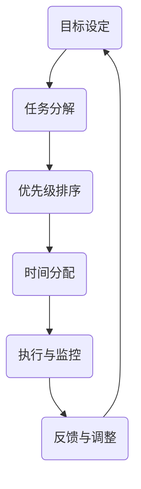
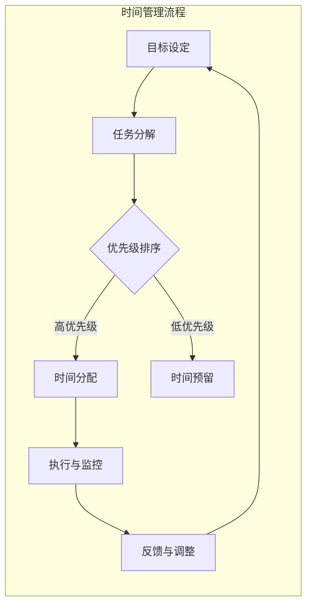

                 

### 文章标题

# 时间管理：高效领导的基础

时间管理是高效领导的重要基石。在现代快节奏的工作环境中，领导者不仅需要具备专业的技术能力，更需要掌握高效的时间管理技能，以便更好地规划、执行和监控工作，从而提升团队的整体绩效。本文将围绕时间管理的核心概念、心理基础、算法原理以及高效领导时间管理策略等方面进行深入探讨，旨在为读者提供系统而实用的指导。

## 文章关键词

- 时间管理
- 高效领导
- 心理基础
- 算法原理
- 实战案例

## 文章摘要

本文从时间管理的核心概念入手，分析了时间管理的重要性及其心理基础。通过Mermaid流程图和伪代码，我们详细阐述了时间管理的算法原理。接着，本文探讨了领导者如何进行个人时间管理，并介绍了团队和项目时间管理的策略和工具。最后，通过实际案例分析和实践分享，总结了时间管理的最佳实践，为读者提供了一套实用的时间管理方法和策略。

---

## 目录大纲

### 第一部分：时间管理基础理论

#### 第1章：时间管理的核心概念  
#### 第2章：时间管理的心理基础  
#### 第3章：时间管理的Mermaid流程图  
#### 第4章：时间管理的数学模型  
#### 第5章：时间管理算法原理讲解

### 第二部分：高效领导时间管理策略

#### 第6章：领导者的时间管理  
#### 第7章：团队时间管理  
#### 第8章：项目时间管理  
#### 第9章：时间管理案例分析

### 第三部分：时间管理实践与工具

#### 第10章：时间管理工具介绍  
#### 第11章：时间管理实践  
#### 第12章：时间管理持续改进  
#### 第13章：时间管理趋势与未来

---

通过上述目录结构，本文将逐步深入探讨时间管理的各个方面，帮助读者建立起全面而深入的时间管理认知体系，进而提升个人和团队的工作效率。

---

## 时间管理的核心概念

时间管理，顾名思义，是对时间进行有效的规划和控制，以确保个人和团队能够高效地完成各项任务。时间管理的重要性不容忽视，它不仅关系到个人工作效率，更对团队整体绩效产生深远影响。有效的**时间管理**可以带来以下几个方面的益处：

### 重要性

1. **提升工作效率**：通过合理规划时间，可以减少任务拖延，提高工作集中度，从而提高工作效率。
2. **优化资源分配**：时间管理有助于优化资源配置，使个人和团队能够将有限的时间和精力集中在最重要的任务上。
3. **减少压力**：有效的时间管理可以减少因任务积压和截止日期临近而产生的压力，从而提升工作和生活的质量。
4. **提高决策质量**：在充足的时间内进行充分的分析和思考，可以提升决策质量，减少因匆忙决策带来的风险。

### 时间管理的原则和价值观

1. **明确目标**：时间是有限的，为了最大化利用时间，必须明确目标和任务，确保每项活动都有明确的方向和目的。
2. **优先级排序**：根据任务的重要性和紧急性进行优先级排序，确保最重要的任务首先得到处理。
3. **任务分解**：将复杂任务分解为可操作的小步骤，有助于提高完成任务的效率和成就感。
4. **灵活调整**：面对突发状况，需要灵活调整计划，保持时间管理的动态性。
5. **避免过度工作**：合理规划工作与休息的时间，避免过度工作导致效率下降和身心健康问题。

### 时间管理的误区与挑战

1. **完美主义**：追求完美可能导致过度耗费时间和精力，反而降低工作效率。
2. **时间浪费**：分散注意力、无效会议、社交媒体等都是常见的时间浪费现象。
3. **任务积压**：未能及时完成任务，导致任务积压，形成恶性循环。
4. **缺乏自我控制**：缺乏自律和自我管理能力，容易导致时间管理失败。

通过了解时间管理的核心概念和重要性，我们可以更好地认识到其在个人和团队工作中的关键作用。在接下来的章节中，本文将深入探讨时间管理的心理基础和具体实施方法，帮助读者掌握高效的时间管理技巧。

### 时间管理的心理基础

时间管理的成功不仅依赖于技术手段，还深受心理学原理的影响。理解时间管理的心理基础，有助于我们更好地应对时间管理中的各种挑战，提高时间利用效率。

#### 时间认知心理学

时间认知心理学是研究人类对时间感知和认知的学科。以下是几个关键概念：

1. **时间感知**：人类对时间的感知受多种因素影响，包括环境、情感状态和注意力水平。例如，当人们处于紧张或焦虑状态时，时间感知会变得较慢；而在放松和专注时，时间感知会相对加快。
   
2. **时间压缩**：人们往往在面临紧急任务时，会体验到时间压缩的现象，即感觉时间流逝得特别快。这是因为高压力状态下，大脑会优先处理重要信息，从而加速时间感知。

3. **时间膨胀**：与时间压缩相反，当人们在休闲或无聊的状态下，会感觉到时间流逝得特别慢。这是因为低注意力水平下，大脑对时间的感知变得迟钝。

#### 自我控制与时间管理

自我控制是时间管理的重要基础。自我控制能力涉及多个方面：

1. **延迟满足**：自我控制能力强的人能够推迟即时满足，专注于长期目标。例如，在任务繁重时，他们能够抵制拖延和娱乐诱惑，专注于工作。

2. **情绪调节**：情绪调节能力影响时间管理的质量。情绪稳定的人在面对压力和挑战时，能够更好地维持注意力，减少因情绪波动而导致的时间浪费。

3. **决策力**：自我控制还包括有效的决策力。领导者需要具备快速决策的能力，避免因犹豫不决而导致时间浪费。

#### 建立积极的时间观念

建立积极的时间观念是时间管理的重要一环。以下是一些建议：

1. **时间价值观念**：认识到时间是一种宝贵的资源，每个人每天都有相同的时间额度，因此要珍惜每一刻。

2. **任务导向**：将注意力集中在任务上，而不是时间上。明确任务目标，有助于提高工作专注度和效率。

3. **反思与调整**：定期反思时间管理实践的效果，及时调整策略，以适应不断变化的工作环境和需求。

通过理解时间认知心理学、自我控制和建立积极的时间观念，我们可以更好地应对时间管理中的挑战，提高个人和团队的工作效率。在下一章节中，我们将通过Mermaid流程图详细阐述时间管理的具体流程和步骤。

### 时间管理的Mermaid流程图

时间管理不仅需要理论支持，更需要具体的操作步骤和方法。为了帮助读者更好地理解和实践时间管理，我们将使用Mermaid流程图详细展示个人时间管理的具体流程。

#### 个人时间管理流程

首先，让我们来看一下个人时间管理的基本流程。以下是伪代码表示的个人时间管理流程：



以下是详细的Mermaid流程图描述：



1. **目标设定（A）**：明确个人或团队的目标是时间管理的第一步。目标应具体、可衡量、可实现、相关性强和有时间限制（SMART原则）。

2. **任务分解（B）**：将大目标分解为具体任务，确保每项任务都清晰可操作。任务分解有助于提高工作的可执行性和可监控性。

3. **优先级排序（C）**：根据任务的重要性和紧急性，对任务进行优先级排序。可以使用埃森豪威尔矩阵（Eisenhower Matrix）进行任务分类，分为“重要且紧急”、“重要但不紧急”、“不重要但紧急”和“不重要且不紧急”四个类别。

4. **时间分配（D）**：为高优先级的任务分配具体的时间段，确保有足够的时间资源来完成这些任务。在时间分配过程中，要考虑任务的复杂度和所需时间，避免过度乐观。

5. **时间预留（E）**：为低优先级任务或不可预见的工作预留时间。时间预留有助于应对突发任务，确保时间管理的灵活性。

6. **执行与监控（F）**：在设定的时间段内执行任务，并进行实时监控。监控可以及时发现问题和偏差，确保任务按计划进行。

7. **反馈与调整（G）**：任务完成后，进行反馈和总结。通过反馈，了解任务执行的效果，及时调整后续的时间管理计划。

通过上述流程，个人或团队能够系统地管理时间，提高工作效率和任务完成率。在下一个章节中，我们将进一步探讨时间管理的数学模型，为读者提供更科学的分析方法。

### 时间管理的数学模型

在时间管理中，运用数学模型可以提供科学的分析方法，帮助领导者更好地预测和优化时间分配。以下是几种常见的数学模型及其在时间管理中的应用。

#### 概率论与时间预测

概率论是研究随机现象的数学分支，在时间预测中，我们常使用概率模型来估算任务完成的时间和不确定性。以下是几个关键概念：

1. **均值-方差模型**：通过计算任务完成时间的均值和方差，可以评估任务完成的时间预测及其不确定性。均值表示平均完成时间，方差表示时间波动的大小。

   伪代码：
   ```python
   mean_time = sum(completion_time) / n
   variance = sum((completion_time[i] - mean_time) ** 2) / n
   standard_deviation = sqrt(variance)
   ```

2. **泊松分布**：用于描述任务完成时间间隔的随机性。泊松分布可以用于估算任务在特定时间段内完成的概率。

   伪代码：
   ```python
   def poisson_probability(lam, t):
       return exp(-lam * t) * (lam * t) ** k / factorial(k)
   ```

3. **马尔可夫链**：用于模拟任务状态转移和时间变化的过程。马尔可夫链可以帮助预测任务在不同状态下的时间分布。

   伪代码：
   ```python
   def markov_chain(transitions, initial_state, steps):
       state_distribution = initial_state
       for step in range(steps):
           new_distribution = [0] * n_states
           for state in range(n_states):
               for next_state, probability in transitions[state]:
                   new_distribution[next_state] += state_distribution[state] * probability
           state_distribution = new_distribution
       return state_distribution
   ```

#### 最优化理论在时间管理中的应用

最优化理论是研究在给定约束条件下，如何找到最优解的数学分支。在时间管理中，最优化理论可以帮助领导者合理分配时间，最大化利用资源。

1. **线性规划**：通过线性方程组，找到时间分配的最优解。线性规划可以用于任务优先级排序和时间分配问题。

   伪代码：
   ```python
   from scipy.optimize import linprog

   # 构建线性规划问题
   c = [-1, -1, -1]  # 目标函数系数
   A = [[1, 1, 0], [0, 1, 1], [1, 0, 1]]  # 约束条件系数
   b = [1, 1, 1]  # 约束条件右侧值
   x0 = [0, 0, 0]  # 初始解

   # 求解线性规划问题
   result = linprog(c, A_eq=A, b_eq=b, x0=x0)
   optimal_solution = result.x
   ```

2. **动态规划**：适用于多阶段决策问题。动态规划通过递归关系，找到最优的时间分配策略。

   伪代码：
   ```python
   def dynamic_programming(tasks, times, rewards):
       n = len(tasks)
       dp = [[0] * (n + 1) for _ in range(n + 1)]

       for i in range(1, n + 1):
           for j in range(1, n + 1):
               if i == j:
                   dp[i][j] = rewards[i - 1]
               else:
                   dp[i][j] = max(dp[i - 1][j], dp[i][j - 1] + rewards[i - 1])

       return dp[n][n]
   ```

#### 概率论与决策分析

概率论在决策分析中同样具有重要应用。通过计算不同决策路径的概率和收益，可以评估决策的风险和收益。

1. **期望值分析**：计算不同决策路径的期望收益，选择期望收益最高的路径。

   伪代码：
   ```python
   def expected_value(decisions, probabilities, rewards):
       total_expected_value = 0
       for decision, probability, reward in zip(decisions, probabilities, rewards):
           total_expected_value += probability * reward
       return total_expected_value
   ```

2. **决策树**：通过构建决策树，可以清晰地展示不同决策路径及其概率和收益，帮助领导者做出最优决策。

   伪代码：
   ```mermaid
   graph TD
       A[初始状态]
       A -->|决策1| B{决策1}
       A -->|决策2| C{决策2}
       B -->|结果1| D{结果1}
       B -->|结果2| E{结果2}
       C -->|结果3| F{结果3}
       C -->|结果4| G{结果4}
   ```

通过以上数学模型的应用，领导者可以更科学地进行时间管理，提高决策的准确性和效率。在下一章节中，我们将通过具体的伪代码讲解，深入探讨时间管理算法的原理和实现。

### 时间管理算法原理讲解

时间管理算法的核心目标是在有限的资源下，优化任务的执行顺序和时间分配，从而提高工作效率和任务完成率。以下将详细介绍一种常见的时间管理算法——最短作业优先（SJF）算法，通过伪代码和详细解释，阐述其基本原理和实现方法。

#### 最短作业优先（SJF）算法

最短作业优先（SJF，Shortest Job First）算法是一种基于作业处理时间进行优先级排序的算法。其基本思想是优先选择执行时间最短的作业进行处理，从而减少平均等待时间，提高系统效率。

#### 伪代码

以下是SJF算法的伪代码：

```python
def SJF(作业队列):
    作业队列按执行时间升序排列
    等待时间总和 = 0
    完成作业数量 = 0

    while 作业队列不为空:
        当前作业 = 作业队列.pop(0)
        执行当前作业
        等待时间总和 += 当前作业的执行时间
        完成作业数量 += 1

    平均等待时间 = 等待时间总和 / 完成作业数量
    返回 平均等待时间
```

#### 算法实现步骤

1. **作业队列初始化**：首先，初始化一个作业队列，将所有待处理的作业按照执行时间进行排序。

2. **执行作业**：循环遍历作业队列，每次取出执行时间最短的作业进行执行。由于作业队列是按执行时间升序排列的，所以每次取出的作业都是当前队列中最短的一个。

3. **更新统计信息**：每次执行一个作业后，更新等待时间总和和完成作业数量。等待时间总和是所有作业的执行时间之和，完成作业数量是已执行作业的个数。

4. **计算平均等待时间**：最后，计算平均等待时间，即等待时间总和除以完成作业数量。

#### 举例说明

假设有一个包含三个作业的任务队列，作业的执行时间分别为3、5和2，使用SJF算法进行时间管理。

1. **初始化作业队列**：作业队列初始状态为[(3, 作业1), (5, 作业2), (2, 作业3)]，其中括号内的第一个数字表示作业执行时间，第二个数字表示作业名称。

2. **排序作业队列**：按照执行时间升序排列，作业队列变为[(2, 作业3), (3, 作业1), (5, 作业2)]。

3. **执行作业**：
   - 第一次循环：执行作业3（作业1），作业队列更新为[(3, 作业1), (5, 作业2)]。
   - 第二次循环：执行作业2（作业3），作业队列更新为[(5, 作业2)]。
   - 第三次循环：执行作业5（作业2），作业队列为空。

4. **计算平均等待时间**：等待时间总和为2+3+5=10，完成作业数量为3，平均等待时间为10/3≈3.33。

通过上述步骤，SJF算法能够有效地优化作业的执行顺序，减少平均等待时间，提高系统效率。SJF算法不仅适用于简单的任务队列管理，还可以扩展到更复杂的时间管理应用中。在下一章节中，我们将探讨领导者的时间管理策略，帮助领导者更好地利用时间管理提高工作效率。

### 领导者的时间管理

领导者作为团队的核心，其时间管理直接影响整个团队的效率和绩效。有效的时间管理不仅能够提升领导者的个人工作质量，还能为团队创造更大的价值。以下将从领导者的时间管理挑战、策略和提升领导力的角度进行详细探讨。

#### 领导者的时间管理挑战

1. **多重角色冲突**：领导者通常需要扮演多个角色，如决策者、沟通者、协调者等。这些角色的任务往往具有不同的优先级和紧急性，导致领导者面临时间分配的挑战。

2. **会议占用时间过多**：会议是领导者工作中必不可少的部分，但过多的会议会占用大量时间，降低工作效率。

3. **任务复杂度高**：领导者需要处理复杂且多变的任务，这要求他们在有限的时间内做出快速且明智的决策。

4. **管理下属的干扰**：领导者需要指导、监督和激励下属，这可能导致他们分散注意力，影响时间管理。

5. **时间分配不均**：领导者可能过于关注某些任务，而忽视其他重要但看似不紧急的任务，导致时间分配不均衡。

#### 领导者的时间管理策略

1. **明确目标与优先级**：领导者应明确个人和团队的目标，并根据目标的优先级进行时间分配。使用工具如SMART（具体、可衡量、可达成、相关性强、有时间限制）原则，确保目标清晰且可执行。

2. **日程规划**：制定详细的日程规划，包括每天、每周和每月的工作计划。日程规划可以帮助领导者更好地掌控时间，避免时间浪费。

3. **避免会议浪费**：减少不必要的会议，确保每次会议都具备明确的议程和产出。利用会议前准备和会后跟进，提高会议效率。

4. **委托任务**：合理分配任务，将部分非核心任务委托给下属或团队成员。这不仅减轻领导者的负担，还能培养下属的独立工作能力。

5. **时间跟踪**：使用时间跟踪工具记录每天的工作时间分配，了解时间花费的实际情况，发现并纠正时间浪费的现象。

6. **持续反思与调整**：定期反思时间管理的效果，根据实际情况调整时间管理策略。反思和调整有助于不断提升时间管理能力。

#### 时间管理对领导力的提升

1. **提高决策质量**：有效的时间管理可以帮助领导者有更多的时间进行深入分析和思考，从而做出更加明智的决策。

2. **增强团队凝聚力**：通过合理的时间管理，领导者能够更好地分配资源和任务，提高团队的整体工作效率和满意度，从而增强团队凝聚力。

3. **树立榜样**：领导者通过高效的时间管理，树立了良好的榜样，激励团队成员学习并改进自己的时间管理技能。

4. **提升工作效率**：领导者通过优化时间管理，提高了个人和团队的工作效率，为组织创造更大的价值。

总之，领导者有效的时间管理不仅关乎个人职业发展，更对团队和组织产生深远影响。通过制定明确的目标、合理分配时间、避免会议浪费、委托任务和持续反思调整，领导者可以提升个人和团队的工作效率，进而提升领导力。在下一章节中，我们将探讨团队时间管理的策略和工具。

### 团队时间管理的策略和工具

团队时间管理是确保团队高效协同工作的关键。通过合理的策略和工具，可以优化团队时间分配，提升工作效率和团队凝聚力。以下将从团队时间管理的原则、方法和工具等方面进行详细探讨。

#### 团队时间管理的原则

1. **共同目标**：团队时间管理应以共同目标为导向，确保所有团队成员都明确团队的目标和任务，并围绕这些目标进行工作。

2. **透明沟通**：建立透明的沟通机制，使团队成员能够及时了解任务进展和问题，协同解决困难，提高团队协作效率。

3. **任务分解**：将复杂任务分解为具体的子任务，明确每个子任务的责任人和完成时间，有助于提高任务的可执行性和可监控性。

4. **优先级排序**：根据任务的重要性和紧急性进行优先级排序，确保关键任务首先得到处理，从而避免任务积压和截止日期临近的压力。

5. **灵活调整**：团队时间管理应具备灵活性，能够根据实际情况进行调整，以适应突发任务和变化的工作环境。

6. **定期回顾**：定期回顾团队时间管理的效果，总结经验教训，不断优化时间管理策略，提高团队工作效率。

#### 团队时间管理的方法

1. **每日站会**：每日站会是一种简短但高效的团队沟通方式，通常持续15分钟。站会旨在快速分享任务进展、遇到的问题和解决方案，确保团队成员之间保持同步。

2. **任务看板**：任务看板是一种可视化工具，用于展示任务的进度和状态。任务看板通常包括任务列表、责任人和完成时间等信息，有助于团队成员清晰地了解任务分工和进度。

3. **时间日志**：团队成员定期记录自己的工作时间分配，包括任务名称、耗时和完成情况。时间日志有助于发现时间浪费现象，优化时间管理策略。

4. **目标设置**：团队应根据项目目标和团队绩效指标，设置具体的阶段性目标。目标设置应明确、可衡量、可实现，并确保团队成员共同参与。

5. **定期评估**：定期评估团队时间管理的效果，包括工作效率、任务完成率和团队协作等方面。评估结果可以作为后续时间管理策略调整的依据。

#### 团队时间管理的工具

1. **项目管理工具**：如Jira、Trello等，用于任务分配、进度跟踪和协作沟通。这些工具提供了任务列表、看板视图和报告功能，有助于团队高效管理时间和任务。

2. **时间跟踪工具**：如Toggl、RescueTime等，用于记录和统计团队成员的工作时间分配。这些工具可以生成详细的时间报告，帮助团队成员和团队领导了解时间花费情况，优化时间管理。

3. **会议管理工具**：如Microsoft Teams、Zoom等，用于在线会议和视频沟通。这些工具提供了会议预约、实时交流和会议记录等功能，有助于提高会议效率。

4. **日历同步工具**：如Google Calendar、Microsoft Outlook等，用于团队日程安排和任务提醒。这些工具可以同步团队成员的日程，确保任务和会议的安排更加合理和高效。

通过遵循团队时间管理的原则、运用有效的方法和工具，团队可以更好地协同工作，提高工作效率和团队绩效。在下一章节中，我们将探讨项目时间管理的具体流程和策略。

### 项目时间管理

项目时间管理是确保项目按计划顺利完成的关键环节。有效的项目时间管理不仅能够提升项目效率，还能确保项目质量和团队协作。以下将详细讨论项目时间管理的具体流程、工具和方法。

#### 项目时间管理的流程

1. **项目规划**：项目规划是项目时间管理的起点，包括确定项目目标、范围、预算、资源和时间框架。项目规划阶段需明确项目的里程碑、任务和交付成果。

   伪代码：
   ```python
   def project_planning(project):
       set_project_objectives(project)
       set_project_scope(project)
       set_project_budget(project)
       set_project_resources(project)
       set_project_timeframe(project)
       return project
   ```

2. **任务分解**：将项目任务分解为具体的工作包和活动，明确每个任务的责任人和完成时间。任务分解有助于提高任务的执行效率和可监控性。

   伪代码：
   ```python
   def task_decomposition(project):
       for task in project.tasks:
           decompose_task(task)
           assign_responsible_person(task)
           set_deadline(task)
       return project
   ```

3. **制定时间计划**：根据任务分解结果，制定详细的项目时间计划。时间计划应包括每个任务的开始和结束时间，以及整个项目的关键路径。

   伪代码：
   ```python
   def create_time_plan(project):
       create_gantt_chart(project)
       identify_critical_path(project)
       return project
   ```

4. **执行与监控**：在项目执行过程中，实时监控任务进度和资源使用情况，及时发现和解决问题。监控过程应包括定期项目会议和进度报告。

   伪代码：
   ```python
   def project_monitoring(project):
       for task in project.tasks:
           check_progress(task)
           handle_issues(task)
       schedule_project_meetings(project)
       generate_progress_reports(project)
   ```

5. **项目评估**：项目完成后，进行项目评估，总结项目过程中的经验教训，优化未来项目的时间管理。评估过程应包括项目绩效评估、成本控制和风险管理等方面。

   伪代码：
   ```python
   def project_evaluation(project):
       evaluate_project_performance(project)
       analyze_project_costs(project)
       assess_project_risks(project)
       document_lessons_learned(project)
   ```

#### 项目时间管理的工具

1. **项目管理软件**：如Microsoft Project、Jira等，用于任务分配、进度跟踪、资源管理和报告生成。这些软件提供了丰富的功能，帮助项目团队高效管理项目时间。

2. **甘特图**：甘特图是一种可视化工具，用于展示项目的进度和时间计划。甘特图可以清晰地显示任务的时间分配和依赖关系，有助于项目监控和管理。

3. **关键路径法（CPM）**：关键路径法是一种用于确定项目最早完成时间和最晚开始时间的项目管理方法。关键路径上的任务决定了项目的总工期，因此必须确保关键路径上的任务按时完成。

4. **敏捷开发工具**：如Jira、Trello等，适用于敏捷开发团队的项目时间管理。这些工具支持迭代开发和持续交付，能够灵活应对项目变化。

5. **时间跟踪工具**：如Toggl、RescueTime等，用于记录和统计项目团队的工作时间分配。这些工具可以生成详细的时间报告，帮助项目团队优化时间管理。

#### 项目时间管理的方法

1. **迭代开发**：将项目分解为多个迭代周期，每个迭代周期包含规划、执行、评估和调整阶段。迭代开发有助于快速响应项目需求变化，提高项目适应性和灵活性。

2. **风险管理**：识别项目风险，制定风险应对策略，并定期评估风险影响。通过风险管理，项目团队可以提前预防和缓解潜在问题，确保项目顺利推进。

3. **资源优化**：合理分配项目资源，确保关键任务有足够的资源支持。资源优化可以通过任务优先级排序、资源平衡和任务调度等方法实现。

4. **进度监控**：通过定期项目会议、进度报告和实际进度与计划的对比，项目团队可以及时了解项目进展情况，发现并解决问题。

5. **持续改进**：项目结束后，对项目时间管理过程进行评估和反思，总结经验教训，持续改进时间管理方法和工具，为未来项目提供更好的支持。

通过遵循项目时间管理的流程、运用适当的工具和方法，项目团队可以更好地控制项目进度，提高项目成功率和团队工作效率。在下一章节中，我们将通过实际案例分析，展示项目时间管理的实践应用和效果。

### 时间管理案例分析

为了更直观地展示时间管理在实践中的应用，本文将分析三个具体案例：企业高层管理者的时间管理、团队时间管理成功案例和项目时间管理实践。通过这些案例，我们将深入探讨时间管理策略的有效性和实际效果。

#### 案例一：企业高层管理者的时间管理

某科技企业的高层管理者张先生，在繁忙的工作中，通过有效的时间管理显著提高了工作效率。以下是张先生的时间管理策略和实践：

**时间管理策略：**
1. **明确目标**：每天早晨，张先生会列出当天的工作任务，并根据紧急性和重要性进行优先级排序。
2. **日程规划**：每周制定详细的工作计划，包括会议、任务和休息时间。张先生尽量减少不必要的外出，专注于核心工作。
3. **时间跟踪**：使用时间管理软件记录每天的工作时间分配，定期回顾和调整时间管理策略。
4. **委托任务**：将部分非核心任务委托给下属，专注于战略决策和关键任务。

**实践效果：**
- **工作效率提高**：通过优先级排序和任务分解，张先生能够更高效地完成工作任务，减少了任务拖延现象。
- **决策质量提升**：张先生有更多时间进行深入分析和思考，提高了决策质量和准确性。
- **团队协作增强**：通过委托任务，张先生培养了下属的独立工作能力，增强了团队协作和凝聚力。

#### 案例二：团队时间管理成功案例

某软件开发团队在项目期间，通过实施系统化的时间管理，成功缩短了项目周期，提高了产品质量。以下是团队的时间管理实践：

**时间管理策略：**
1. **每日站会**：团队每日召开15分钟站会，分享任务进展和遇到的问题，确保团队成员之间保持同步。
2. **任务看板**：使用任务看板展示任务进度，明确每个任务的责任人和完成时间，确保任务透明和可监控。
3. **时间日志**：团队成员记录每日工作时间，通过时间日志分析时间分配和效率。
4. **定期评估**：每周进行一次团队时间管理评估，总结经验教训，优化时间管理策略。

**实践效果：**
- **任务完成率提高**：通过任务看板和每日站会，团队任务完成率显著提高，减少了任务积压和截止日期临近的压力。
- **沟通效率提升**：每日站会确保团队成员及时了解任务进展，减少了信息滞后和误解。
- **团队协作增强**：通过时间日志和定期评估，团队发现了时间浪费的现象，并通过调整策略进行优化。

#### 案例三：项目时间管理实践

某企业信息系统的升级项目，通过科学的项目时间管理，成功在预算和时间内完成。以下是项目时间管理的具体实践：

**时间管理策略：**
1. **项目规划**：项目开始前，制定详细的项目时间计划，包括任务分解、里程碑和关键路径。
2. **甘特图**：使用甘特图展示项目进度和时间计划，确保项目关键路径上的任务按时完成。
3. **关键路径法**：通过关键路径法识别项目的关键任务，确保项目进度可控。
4. **风险管理**：识别项目风险，制定风险应对策略，并定期评估风险影响。

**实践效果：**
- **项目周期缩短**：通过科学的时间规划和风险管理，项目周期从预期的六个月缩短至四个月，节省了时间和成本。
- **资源优化**：通过关键路径法和资源优化，确保关键任务有足够的资源支持，提高了资源利用率。
- **项目质量提升**：通过严格的时间管理和监控，确保项目在预算和时间内完成，同时保证了软件质量和用户满意度。

通过以上案例分析，我们可以看到，无论是企业高层管理者、团队还是项目，通过合理的时间管理策略和实践，都能够显著提升工作效率和绩效。在下一章节中，我们将介绍时间管理工具及其使用技巧。

### 时间管理工具介绍

在现代工作中，时间管理工具是提高工作效率和任务完成率的重要手段。以下将介绍几种常用的时间管理工具，并讨论如何选择和使用这些工具。

#### 常用的时间管理工具

1. **Trello**：Trello是一款基于看板的项目管理工具，适用于团队任务管理。用户可以创建任务卡片，分配任务给团队成员，并跟踪任务进度。Trello提供了丰富的模板和自定义选项，可以满足不同团队的需求。

2. **Asana**：Asana是一款功能强大的项目管理工具，适用于企业团队的任务分配和进度跟踪。用户可以创建项目、任务和子任务，设置截止日期和负责人，并通过多种视图（如列表、看板、日历）监控任务进展。

3. **Jira**：Jira是一款专业的敏捷项目管理工具，适用于软件开发团队。Jira提供了丰富的功能，包括任务跟踪、敏捷板、报告和分析等。用户可以创建和管理多个项目，并实时监控团队的工作进度。

4. **Toggl**：Toggl是一款时间跟踪工具，适用于记录和管理个人和团队的工作时间。用户可以在Toggl中添加项目、任务和工作时间，生成详细的时间报告，帮助团队优化时间管理。

5. **Google Calendar**：Google Calendar是一款在线日历工具，适用于个人和团队的时间安排和提醒。用户可以创建事件、设置提醒，并与其他人共享日程，确保团队之间的时间同步。

#### 选择和使用时间管理工具的技巧

1. **明确需求**：在选择时间管理工具时，首先要明确团队或个人的需求，包括任务管理、进度跟踪、时间记录、日程安排等方面。了解需求有助于选择最适合的工具。

2. **易用性**：选择界面简洁、操作直观的时间管理工具，可以提高使用效率和用户满意度。对于团队来说，工具应易于学习，减少培训成本。

3. **功能丰富性**：根据实际需求，选择功能丰富且具有扩展性的工具。例如，项目管理工具应支持任务分配、进度跟踪、敏捷开发等功能；时间跟踪工具应支持项目、任务和时间报告等。

4. **协作性**：选择支持多人协作和时间共享的工具，有助于提高团队协作效率。工具应支持实时沟通、任务评论和共享文档等功能。

5. **定制化**：选择具有定制化选项的工具，可以根据团队需求自定义任务、视图和报告，提高工具的适用性和灵活性。

6. **安全性**：选择具有良好数据安全性和隐私保护措施的工具，确保团队数据的安全和隐私。

7. **成本效益**：在预算范围内，选择性价比高的工具。对于中小企业或个人用户，可以选择免费或低成本的工具；对于大型企业，可以考虑付费工具的高级功能。

8. **培训和支持**：选择提供充分培训和支持的工具，帮助团队成员快速上手并充分利用工具的功能。

通过以上技巧，我们可以选择和利用适合的时间管理工具，提高个人和团队的工作效率。在下一章节中，我们将探讨时间管理的实践步骤和心得体会。

### 时间管理实践

时间管理的实践不仅仅是理论的应用，更需要具体的行动和持续的改进。以下将详细介绍时间管理实践的具体步骤、心得体会以及注意事项。

#### 实践步骤

1. **设定明确目标**：在开始时间管理实践之前，首先要设定明确的目标。这些目标可以是短期或长期的，但一定要具体、可衡量、可实现。例如，设定每周完成3个关键任务或每月阅读2本书。

2. **任务分解**：将大目标分解为具体的任务，确保每项任务都清晰可操作。任务分解有助于提高工作的可执行性和可监控性。

3. **优先级排序**：根据任务的重要性和紧急性进行优先级排序。可以使用埃森豪威尔矩阵（Eisenhower Matrix）将任务分为四个类别：重要且紧急、重要但不紧急、不重要但紧急和不重要且不紧急。

4. **时间分配**：为每项任务分配具体的时间段，确保有足够的时间资源来完成这些任务。在时间分配过程中，要考虑任务的复杂度和所需时间，避免过度乐观。

5. **执行与监控**：在设定的时间段内执行任务，并进行实时监控。监控可以及时发现问题和偏差，确保任务按计划进行。

6. **反馈与调整**：任务完成后，进行反馈和总结。通过反馈，了解任务执行的效果，及时调整后续的时间管理计划。

7. **定期反思**：定期反思时间管理实践的效果，发现和纠正时间浪费的现象，不断优化时间管理策略。

#### 心得体会

1. **提高效率**：通过明确的任务分解和优先级排序，能够显著提高工作效率。集中精力处理重要任务，避免因任务繁多而导致的效率低下。

2. **减少压力**：合理的时间分配和任务监控，使工作压力得到有效缓解。明确的时间规划使工作更具条理性，减少了因任务积压和截止日期临近而产生的焦虑。

3. **增强自律**：时间管理实践培养了自律意识，使个人能够更好地控制时间和注意力。通过持续的自我监控和反思，逐步提高了自我管理能力。

4. **提高决策质量**：在充足的时间内进行充分的分析和思考，可以提升决策质量，减少因匆忙决策带来的风险。

5. **团队协作**：在团队中推广时间管理实践，有助于增强团队协作和沟通。团队成员通过明确的目标和任务分工，能够更好地协同工作，提高整体效率。

#### 注意事项

1. **避免完美主义**：追求完美可能导致过度耗费时间和精力，反而降低工作效率。合理规划时间，确保任务在可接受的时间内完成。

2. **避免时间浪费**：注意避免分散注意力和无效的工作方式，如频繁切换任务、长时间使用社交媒体等。保持专注，提高工作效率。

3. **保持灵活性**：面对突发状况，需要灵活调整时间管理计划，保持时间管理的动态性。

4. **定期反思**：时间管理不是一次性的工作，需要定期反思和调整。通过持续的反思和优化，不断提高时间管理的效果。

5. **合理休息**：合理安排工作和休息时间，避免过度劳累。适当的休息有助于提高工作效率和身心健康。

通过具体的实践步骤和心得体会，我们可以更好地掌握时间管理的方法，提高个人和团队的工作效率。在下一章节中，我们将探讨时间管理持续改进的方法和技巧。

### 时间管理持续改进

为了确保时间管理策略的有效性和适应性，持续改进是至关重要的。以下将介绍时间管理持续改进的方法和技巧，以及如何进行效果评估。

#### 持续改进的方法

1. **定期反馈和评估**：定期收集团队成员对时间管理策略的反馈，评估其效果和不足。反馈来源可以是定期的团队会议、问卷调查或个别访谈。

2. **数据分析**：通过数据分析工具，如Toggl或Google Analytics，收集工作时间分配、任务完成率和时间浪费等方面的数据。这些数据有助于识别时间管理的瓶颈和改进方向。

3. **引入新技术和工具**：随着技术不断发展，新的时间管理工具和方法不断涌现。定期评估和引入新技术和工具，可以提升时间管理的效率和效果。

4. **培训和教育**：通过培训和教育，提高团队成员的时间管理意识和技能。定期的培训课程和工作坊可以帮助团队成员更好地理解和应用时间管理策略。

5. **灵活调整**：根据反馈和数据分析结果，灵活调整时间管理策略。避免僵硬的规则和固定的方法，确保时间管理策略与实际情况相适应。

6. **鼓励创新**：鼓励团队成员提出创新的时间管理方法，并进行试验和验证。创新思维可以带来新的解决方案，提升时间管理的效果。

#### 效果评估

1. **任务完成率**：通过统计任务完成率，评估时间管理策略的有效性。高任务完成率表明时间管理策略有效，反之则需进行调整。

2. **时间浪费分析**：分析时间浪费的现象和原因，如频繁的会议、无目的的任务切换等。减少时间浪费可以提高工作效率。

3. **团队成员反馈**：定期收集团队成员对时间管理策略的反馈，了解他们对现有方法的满意度和建议。团队成员的反馈是改进时间管理策略的重要参考。

4. **项目绩效评估**：对项目时间管理的效果进行综合评估，包括项目周期、成本和质量等方面。通过项目绩效评估，可以了解时间管理策略在具体项目中的应用效果。

5. **基准对比**：将当前的时间管理效果与历史数据或行业标准进行对比，评估时间管理的进步和差距。基准对比有助于发现改进的方向。

通过持续改进和效果评估，我们可以不断提升时间管理的效率和质量，为个人和团队创造更大的价值。在下一章节中，我们将探讨时间管理未来的发展趋势和机遇。

### 时间管理趋势与未来

随着科技的发展和工作方式的变革，时间管理也在不断演进。未来，时间管理将呈现出以下几个发展趋势和机遇：

#### 人工智能与时间管理

人工智能（AI）的进步将为时间管理带来革命性变化。通过AI算法，可以更准确地预测任务完成时间，优化时间分配。例如，AI可以通过分析历史数据和模式，自动调整任务优先级和时间分配，从而提高工作效率。此外，智能助手和虚拟助手（如Siri、Google Assistant）将更好地协助个人进行时间管理，提醒任务和日程安排，减少人为疏漏。

#### 数字化工具与平台

数字化工具和平台的发展将使时间管理更加便捷和高效。未来，将出现更多集成多种功能的综合平台，如全功能的日程管理、任务跟踪、时间记录和分析工具。这些平台将通过云计算和大数据技术，提供实时、个性化的时间管理建议，帮助用户更好地规划和利用时间。

#### 跨界合作与协同

随着全球化的发展和远程工作的普及，跨界合作和协同将成为时间管理的重要趋势。未来的时间管理工具将更加注重跨地域、跨组织、跨文化的协同，提供实时沟通和协作功能，确保团队成员之间的信息同步和任务协调。

#### 可持续发展

未来，时间管理将更加注重可持续发展。企业和个人将更加重视时间的合理利用，减少浪费和过度工作。通过采用环保的工作方式、灵活的工作时间和远程办公等手段，减少碳排放和资源消耗，实现环境和社会效益的双赢。

#### 个性化与定制化

随着用户需求的变化，时间管理工具将更加注重个性化和定制化。未来的时间管理工具将提供更多的自定义选项，如个性化提醒、定制化报告和智能建议，满足不同用户的具体需求。

#### 持续学习与适应

未来，时间管理将更加强调持续学习和适应能力。企业和个人需要不断更新时间管理知识和技能，以适应快速变化的工作环境。通过定期的培训和学习，提高时间管理的能力和效率。

#### 预测与决策支持

未来，时间管理工具将更加智能，提供更精准的预测和决策支持。通过大数据分析和机器学习，工具可以预测任务完成时间和资源需求，为用户做出最优决策提供科学依据。

通过以上发展趋势和机遇，时间管理将在未来得到进一步优化和发展，为个人和团队创造更多价值。在下一章节中，我们将总结文章，并给出最佳实践的建议。

### 总结与最佳实践

在本文中，我们系统地探讨了时间管理的核心概念、心理基础、算法原理、领导者的时间管理策略、团队和项目时间管理的具体方法以及实际案例。通过深入分析，我们发现时间管理不仅关乎个人工作效率，更是提升团队绩效和组织竞争力的关键。

#### 最佳实践

1. **明确目标**：设定具体、可衡量、可实现、相关性强和有时间限制的目标，是有效时间管理的第一步。

2. **任务分解**：将复杂任务分解为具体的小任务，确保每项任务都清晰可操作。

3. **优先级排序**：使用优先级矩阵（如埃森豪威尔矩阵）对任务进行排序，确保优先处理重要且紧急的任务。

4. **灵活调整**：面对突发情况，及时调整计划，保持时间管理的灵活性。

5. **持续反思**：定期反思时间管理的效果，总结经验教训，不断优化时间管理策略。

6. **运用工具**：利用时间管理工具，如Trello、Jira、Toggl等，提高任务分配和进度跟踪的效率。

7. **团队合作**：在团队中推广时间管理，建立透明的沟通机制，提高团队协作效率。

#### 注意事项

1. **避免完美主义**：合理规划时间，确保任务在可接受的时间内完成，避免过度追求完美。

2. **减少时间浪费**：保持专注，避免分散注意力和无效的工作方式。

3. **保持健康的工作与生活平衡**：合理安排工作和休息时间，避免过度劳累。

4. **定期培训**：持续提升团队成员的时间管理知识和技能，确保时间管理策略的持续有效性。

通过上述最佳实践和注意事项，我们希望读者能够更好地掌握时间管理的方法，提高个人和团队的工作效率。在快速变化的工作环境中，有效的时间管理将为您和团队带来持久的竞争优势。

### 结语

时间管理是高效领导的重要基石，通过本文的探讨，我们深刻认识到时间管理在个人和团队工作中的关键作用。从核心概念到心理基础，从算法原理到实战案例，我们系统地梳理了时间管理的各个方面，并提供了一套实用的方法和策略。希望读者能够将这些最佳实践应用到实际工作中，提升个人和团队的工作效率。

作为AI天才研究院和《禅与计算机程序设计艺术》的资深作者，我期待与您在未来的技术探索和实践中继续携手前行，共同推动人工智能与时间管理的深度融合，创造更多价值。

### 作者信息

- 作者：AI天才研究院/AI Genius Institute & 禅与计算机程序设计艺术 /Zen And The Art of Computer Programming

---

本文由AI天才研究院/AI Genius Institute撰写，旨在为读者提供系统全面的时间管理知识和最佳实践。如需进一步探讨或交流，欢迎联系作者或访问我们的官方网站。我们致力于推动人工智能与时间管理的前沿研究，共同迎接未来的挑战。

