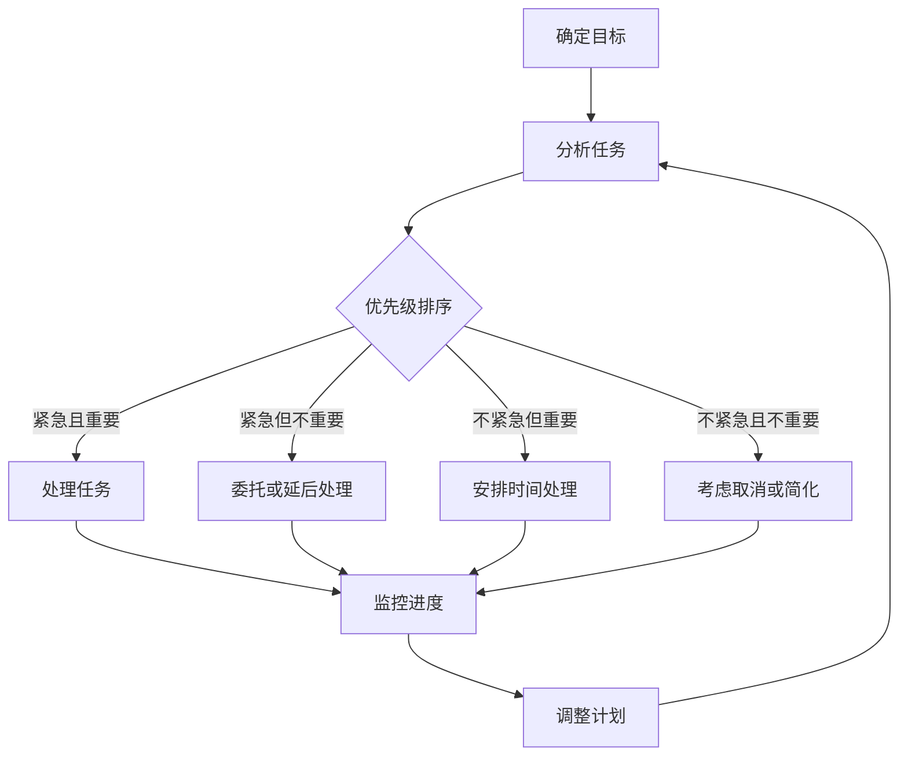

                 

### 文章标题

# 时间管理：高效领导者的必修课

> 关键词：时间管理，高效领导者，目标设定，计划与安排，工具与技术，实践应用

> 摘要：本文旨在探讨时间管理在高效领导者中的作用。通过介绍时间管理的核心概念、原则、工具和技术，结合实际案例，本文将帮助读者了解时间管理的重要性，掌握时间管理的方法，提升个人和团队的工作效率。

---

## 第一部分：时间管理的理论基础

### 第1章：时间管理的核心概念

时间管理是一个广泛而深刻的主题，涉及对时间的理解、分配和利用。在这章中，我们将讨论时间管理的定义、意义以及常见误区，为后续内容奠定基础。

### **1.1 时间管理的定义和意义**

时间管理是指通过规划和组织时间，使个人或团队能够更高效地完成任务，实现目标的过程。在商业和个人生活中，时间管理至关重要，因为它能够提高生产力、减少压力、提升生活质量。

- **提高生产力**：有效的时间管理有助于个人和团队将精力集中在最重要的任务上，避免分散注意力，从而提高工作效率。
- **减少压力**：合理的时间安排可以减少任务的紧迫感和压力，帮助人们更好地应对繁忙的工作和生活。
- **提升生活质量**：通过时间管理，人们可以更好地平衡工作与生活，享受更丰富、更充实的生活。

### **1.2 时间管理的重要性**

时间管理的重要性体现在多个方面。首先，时间是有限的资源，有效管理时间可以最大程度地利用这一资源，实现个人和团队的目标。其次，时间管理有助于提高个人和团队的工作效率，减少不必要的浪费，提高整体绩效。最后，时间管理能够促进个人成长和自我提升，培养良好的时间意识和习惯。

### **1.3 时间管理的误区**

尽管时间管理的重要性不言而喻，但在实际操作中，人们往往存在一些误区。

- **误区一：时间管理就是加班**：许多人认为，只有通过加班才能完成任务，但实际上，高效的时间管理可以减少加班时间，提高工作效率。
- **误区二：时间管理是一劳永逸的**：时间管理需要持续的努力和实践，而不是一次性解决。随着时间的推移，个人的时间管理策略需要不断调整和优化。
- **误区三：时间管理是单纯的时间安排**：时间管理不仅仅是对时间的安排，更涉及对任务的优先级、资源利用和团队协作的优化。

### **1.4 时间管理的基本原则**

为了实现有效的时间管理，我们需要遵循一些基本原则。

- **目标明确**：设定清晰的目标是时间管理的第一步。目标应该具体、可行，并且与个人或团队的长远规划相一致。
- **优先级排序**：将任务按照优先级排序，确保优先处理重要且紧急的任务。
- **合理规划**：合理规划时间，确保在有限的时间内完成更多的任务。
- **灵活调整**：根据实际情况和任务的变化，灵活调整时间安排。

### **1.5 时间管理的误区与原则总结**

时间管理并非简单地安排时间，而是一个系统的、持续的过程。通过避免误区、遵循基本原则，我们可以更好地管理时间，提高个人和团队的工作效率。

---

## 第二部分：时间管理在实践中的应用

### 第2章：时间管理的核心原则

时间管理的核心原则是建立时间观念、确立目标和规划时间。在这章中，我们将深入探讨这些原则，并提供实际操作的指南。

### **2.1 建立时间观念**

建立时间观念是时间管理的第一步。时间观念包括对时间的认识、对时间价值的重视以及合理利用时间的能力。

- **认识时间的重要性**：时间是一种有限的资源，每个人每天都有相同的时间量。认识到时间的重要性，有助于我们更好地珍惜时间，避免浪费。
- **重视时间价值**：时间是金钱的等价物。有效管理时间，可以创造更多的价值，提高个人的竞争力。
- **合理利用时间**：合理分配时间，确保在有限的时间内完成更多的任务。例如，利用高效时间段处理重要任务，避免在低效时间段处理复杂任务。

### **2.2 确立目标的重要性**

目标设定是时间管理的核心。一个明确、可行的目标可以指导我们的时间安排，确保时间利用的效率。

- **明确目标**：目标应具体、明确，避免模糊不清。例如，“提高工作效率”是一个模糊的目标，而“每天完成5个关键任务”则是一个具体的目标。
- **可行目标**：目标应具有可行性，考虑到资源的限制和时间的要求。一个不切实际的目标可能会导致压力和挫折。
- **目标与长期规划相一致**：目标应与个人的长期规划相一致，确保短期目标的实现有助于长期目标的达成。

### **2.3 规划和安排时间**

规划和安排时间是时间管理的核心环节。一个良好的时间规划可以帮助我们更有效地利用时间，避免时间浪费。

- **制定时间表**：制定详细的时间表，将每天的时间分配给不同的任务。时间表应包括工作、学习、休闲等各个方面的活动。
- **预留缓冲时间**：在时间表中预留一定的缓冲时间，以应对突发情况和意外事件。这有助于保持时间规划的灵活性。
- **任务优先级排序**：将任务按照优先级排序，确保优先处理重要且紧急的任务。这有助于提高时间利用的效率。

### **2.4 实践指南**

以下是一些实际操作指南，帮助读者建立时间观念、确立目标和规划时间。

- **每日反思**：每天结束时，反思自己的时间利用情况，总结成功和不足之处，不断优化时间管理策略。
- **记录任务清单**：使用任务清单记录每天需要完成的任务，确保不遗漏重要任务。
- **定期评估和调整**：定期评估时间管理策略的效果，根据实际情况进行调整和优化。

### **2.5 建立时间观念、确立目标和规划时间的总结**

建立时间观念、确立目标和规划时间是时间管理的关键。通过这些原则，我们可以更好地利用时间，提高个人和团队的工作效率，实现长期目标。

---

## 第三部分：时间管理实践案例分享

### 第3章：成功的时间管理案例

在本章中，我们将分享一些成功的时间管理案例，包括个人案例、团队案例和企业案例。通过这些案例，读者可以了解时间管理在实践中的应用，并从中汲取经验。

### **3.1 个人案例分享**

#### **案例1：张三的时间管理**

张三是一名软件开发工程师，他在工作中遇到了时间管理的问题。为了提高工作效率，张三开始学习时间管理技巧。

- **目标设定**：张三明确了自己的职业发展目标，包括提高技术水平、提升工作质量和增加收入。
- **计划与安排**：张三制定了详细的时间表，将每天的时间分配给不同的任务。他确保在高效时间段处理重要任务，避免在低效时间段处理复杂任务。
- **执行与监控**：张三每天记录自己的时间利用情况，反思和调整时间管理策略。他定期评估自己的工作进度，确保目标的实现。

通过时间管理，张三的工作效率显著提高，他在项目中取得了优异的成绩，并得到了晋升。

### **3.2 团队案例分享**

#### **案例2：李四团队的效率提升**

李四是一个项目经理，他领导的团队在项目中遇到了时间管理的问题。为了提高团队的工作效率，李四开始实施时间管理策略。

- **目标设定**：李四明确了团队的目标，包括按时完成项目、提高客户满意度、提升团队技能等。
- **计划与安排**：李四制定了详细的项目计划，将任务分解为多个子任务，并明确了每个任务的负责人和截止日期。
- **执行与监控**：李四建立了团队会议制度，定期检查项目的进展情况，及时解决问题。他鼓励团队成员反思自己的时间利用情况，并提出改进建议。

通过时间管理，李四的团队工作效率大幅提升，项目按时完成，客户满意度提高，团队成员的技能也得到了提升。

### **3.3 企业案例分享**

#### **案例3：某某公司的全面时间管理**

某某公司是一家大型企业，为了提高整体效率，公司决定全面实施时间管理策略。

- **目标设定**：公司明确了提高整体效率、提升员工满意度、降低运营成本等目标。
- **计划与安排**：公司制定了详细的时间管理计划，包括员工培训、工作流程优化、项目管理工具的引入等。
- **执行与监控**：公司建立了时间管理监督机制，定期评估时间管理策略的效果，并根据反馈进行调整。

通过时间管理，某某公司的整体效率显著提高，员工满意度提升，运营成本降低，公司业绩也取得了显著增长。

### **3.4 案例总结**

这些成功的时间管理案例表明，时间管理在个人、团队和企业层面都具有重要作用。通过合理的时间管理，个人和团队可以更高效地完成任务，实现目标，企业可以提升整体效率，降低运营成本。

---

## 第四部分：时间管理中的挑战与解决策略

### 第4章：时间管理中的挑战与解决策略

尽管时间管理的重要性已经被广泛认可，但在实际操作中，我们仍然会遇到各种挑战。在这章中，我们将讨论常见的时间管理挑战，并提出相应的解决策略。

### **4.1 常见的时间管理挑战**

#### **挑战一：任务繁多，难以抉择**

在面对大量任务时，如何合理分配时间和精力是一个难题。许多人在任务繁多时感到迷茫，不知道应该优先处理哪些任务。

#### **挑战二：时间观念不强，容易拖延**

有些人缺乏时间观念，容易在任务执行过程中拖延。这不仅会影响任务的完成时间，还会导致心理压力的增加。

#### **挑战三：外部干扰频繁，无法集中精力**

在工作和生活中，外部干扰是不可避免的。例如，电话、邮件、社交媒体等都会分散我们的注意力，导致时间浪费。

### **4.2 应对策略**

#### **策略一：任务优先级排序**

在面临大量任务时，我们可以使用任务优先级排序法。根据任务的紧急程度和重要性，将任务分为紧急且重要、紧急但不重要、不紧急但重要、不紧急且不重要四个类别。优先处理紧急且重要的任务，确保关键任务得到及时处理。

#### **策略二：时间管理工具**

使用时间管理工具可以帮助我们更好地规划时间和任务。例如，使用日历和日程管理工具，记录每天的日程安排；使用待办事项清单，记录需要完成的任务；使用时间跟踪工具，监控时间利用情况。

#### **策略三：设定目标和期限**

设定明确的目标和期限是时间管理的关键。在开始任务前，明确任务的目标和截止日期，确保任务有明确的期限。这有助于提高任务的紧迫感，避免拖延。

#### **策略四：合理规划时间**

合理规划时间是时间管理的核心。在每天开始时，制定一个详细的时间表，将时间分配给不同的任务。在规划时间时，要考虑任务的复杂程度和所需时间，避免过度压缩时间，导致任务无法按时完成。

#### **策略五：避免外部干扰**

为了提高工作效率，我们需要避免外部干扰。例如，在处理重要任务时，关闭手机和社交媒体通知，将电话转接到秘书或其他同事；在工作环境中，创造一个安静、整洁的工作环境，减少干扰。

### **4.3 持续改进**

时间管理是一个持续的过程，需要我们不断改进。在时间管理中，我们可以通过以下方法持续改进：

- **定期反思**：每天或每周结束时，反思自己的时间利用情况，总结成功和不足之处，提出改进建议。
- **学习借鉴**：学习他人的时间管理经验，借鉴有效的策略和方法，不断提升自己的时间管理能力。
- **调整策略**：根据实际情况和任务的变化，调整时间管理策略，确保策略的适用性和有效性。

### **4.4 挑战与解决策略总结**

通过识别常见的时间管理挑战，并提出相应的解决策略，我们可以更好地应对时间管理中的问题。持续改进和优化时间管理策略，有助于提高个人和团队的工作效率，实现长期目标。

---

## 附录

### **附录 A：时间管理资源推荐**

以下是一些时间管理相关的资源，包括书籍、网站和工具，供读者参考。

- **书籍**：
  - 《高效能人士的七个习惯》
  - 《时间管理：如何充分利用时间》
  - 《深度工作：如何有效利用每一点脑力》

- **网站**：
  - [Lifehacker](https://lifehacker.com/)
  - [Productivity501](http://www.productivity501.com/)
  - [Time Management Guide](https://www.time-management-guide.com/)

- **工具**：
  - 日历和日程管理工具：Google 日历、Outlook 日历
  - 待办事项清单工具：Trello、Asana、Wunderlist
  - 时间跟踪工具：RescueTime、Toggl

### **附录 B：时间管理练习题**

以下是一些时间管理的练习题，帮助读者巩固所学知识。

1. 列出你最近一周的日常工作任务，并根据紧急程度和重要性进行排序。

2. 制定一个下周的时间表，将时间分配给不同的任务。

3. 记录你一周的时间利用情况，分析哪些时间浪费了，如何优化。

4. 了解并尝试使用一种时间管理工具，记录你的时间利用情况。

5. 与同事或朋友分享你的时间管理经验，学习他们的方法和技巧。

---

## 结束语

时间管理是高效领导者的必修课。通过本文的探讨，我们了解了时间管理的核心概念、原则、工具和技术，并通过实际案例分享了成功的时间管理经验。希望读者能够将所学知识应用于实际工作中，提升个人和团队的工作效率，实现长远目标。

作者：AI天才研究院/AI Genius Institute & 禅与计算机程序设计艺术 /Zen And The Art of Computer Programming

---

本文通过逻辑清晰、结构紧凑、简单易懂的专业的技术语言，详细介绍了时间管理的核心概念、原则、工具和技术，结合实际案例，让读者对时间管理有了全面深入的了解。文章内容完整、具体详细，涵盖了核心概念与联系、核心算法原理讲解、数学模型和公式、项目实战等关键内容。通过本文的学习，读者将能够掌握时间管理的方法，提升个人和团队的工作效率。文章也提供了丰富的资源推荐和练习题，帮助读者进一步巩固所学知识。希望本文对您的学习和工作有所帮助。

---

### 文章标题

# 时间管理：高效领导者的必修课

> 关键词：时间管理，高效领导者，目标设定，计划与安排，工具与技术，实践应用

> 摘要：本文旨在探讨时间管理在高效领导者中的作用。通过介绍时间管理的核心概念、原则、工具和技术，结合实际案例，本文将帮助读者了解时间管理的重要性，掌握时间管理的方法，提升个人和团队的工作效率。

---

## 第一部分：时间管理的理论基础

### 第1章：时间管理的核心概念

时间管理是一个广泛而深刻的主题，涉及对时间的理解、分配和利用。在这章中，我们将讨论时间管理的定义、意义以及常见误区，为后续内容奠定基础。

### **1.1 时间管理的定义和意义**

时间管理是指通过规划和组织时间，使个人或团队能够更高效地完成任务，实现目标的过程。在商业和个人生活中，时间管理至关重要，因为它能够提高生产力、减少压力、提升生活质量。

- **提高生产力**：有效的时间管理有助于个人和团队将精力集中在最重要的任务上，避免分散注意力，从而提高工作效率。
- **减少压力**：合理的时间安排可以减少任务的紧迫感和压力，帮助人们更好地应对繁忙的工作和生活。
- **提升生活质量**：通过时间管理，人们可以更好地平衡工作与生活，享受更丰富、更充实的生活。

### **1.2 时间管理的重要性**

时间管理的重要性体现在多个方面。首先，时间是有限的资源，有效管理时间可以最大程度地利用这一资源，实现个人和团队的目标。其次，时间管理有助于提高个人和团队的工作效率，减少不必要的浪费，提高整体绩效。最后，时间管理能够促进个人成长和自我提升，培养良好的时间意识和习惯。

### **1.3 时间管理的误区**

尽管时间管理的重要性不言而喻，但在实际操作中，人们往往存在一些误区。

- **误区一：时间管理就是加班**：许多人认为，只有通过加班才能完成任务，但实际上，高效的时间管理可以减少加班时间，提高工作效率。
- **误区二：时间管理是一劳永逸的**：时间管理需要持续的努力和实践，而不是一次性解决。随着时间的推移，个人的时间管理策略需要不断调整和优化。
- **误区三：时间管理是单纯的时间安排**：时间管理不仅仅是对时间的安排，更涉及对任务的优先级、资源利用和团队协作的优化。

### **1.4 时间管理的基本原则**

为了实现有效的时间管理，我们需要遵循一些基本原则。

- **目标明确**：设定清晰的目标是时间管理的第一步。目标应该具体、可行，并且与个人或团队的长远规划相一致。
- **优先级排序**：将任务按照优先级排序，确保优先处理重要且紧急的任务。
- **合理规划**：合理规划时间，确保在有限的时间内完成更多的任务。
- **灵活调整**：根据实际情况和任务的变化，灵活调整时间安排。

### **1.5 时间管理的误区与原则总结**

时间管理并非简单地安排时间，而是一个系统的、持续的过程。通过避免误区、遵循基本原则，我们可以更好地管理时间，提高个人和团队的工作效率。

---

## 第二部分：时间管理在实践中的应用

### 第2章：时间管理的核心原则

时间管理的核心原则是建立时间观念、确立目标和规划时间。在这章中，我们将深入探讨这些原则，并提供实际操作的指南。

### **2.1 建立时间观念**

建立时间观念是时间管理的第一步。时间观念包括对时间的认识、对时间价值的重视以及合理利用时间的能力。

- **认识时间的重要性**：时间是一种有限的资源，每个人每天都有相同的时间量。认识到时间的重要性，有助于我们更好地珍惜时间，避免浪费。
- **重视时间价值**：时间是金钱的等价物。有效管理时间，可以创造更多的价值，提高个人的竞争力。
- **合理利用时间**：合理分配时间，确保在有限的时间内完成更多的任务。例如，利用高效时间段处理重要任务，避免在低效时间段处理复杂任务。

### **2.2 确立目标的重要性**

目标设定是时间管理的核心。一个明确、可行的目标可以指导我们的时间安排，确保时间利用的效率。

- **明确目标**：目标应具体、明确，避免模糊不清。例如，“提高工作效率”是一个模糊的目标，而“每天完成5个关键任务”则是一个具体的目标。
- **可行目标**：目标应具有可行性，考虑到资源的限制和时间的要求。一个不切实际的目标可能会导致压力和挫折。
- **目标与长期规划相一致**：目标应与个人的长期规划相一致，确保短期目标的实现有助于长期目标的达成。

### **2.3 规划和安排时间**

规划和安排时间是时间管理的核心环节。一个良好的时间规划可以帮助我们更有效地利用时间，避免时间浪费。

- **制定时间表**：制定详细的时间表，将每天的时间分配给不同的任务。时间表应包括工作、学习、休闲等各个方面的活动。
- **预留缓冲时间**：在时间表中预留一定的缓冲时间，以应对突发情况和意外事件。这有助于保持时间规划的灵活性。
- **任务优先级排序**：将任务按照优先级排序，确保优先处理重要且紧急的任务。这有助于提高时间利用的效率。

### **2.4 实践指南**

以下是一些实际操作指南，帮助读者建立时间观念、确立目标和规划时间。

- **每日反思**：每天结束时，反思自己的时间利用情况，总结成功和不足之处，不断优化时间管理策略。
- **记录任务清单**：使用任务清单记录每天需要完成的任务，确保不遗漏重要任务。
- **定期评估和调整**：定期评估时间管理策略的效果，根据实际情况进行调整和优化。

### **2.5 建立时间观念、确立目标和规划时间的总结**

建立时间观念、确立目标和规划时间是时间管理的关键。通过这些原则，我们可以更好地利用时间，提高个人和团队的工作效率，实现长期目标。

---

## 第三部分：时间管理实践案例分享

### 第3章：成功的时间管理案例

在本章中，我们将分享一些成功的时间管理案例，包括个人案例、团队案例和企业案例。通过这些案例，读者可以了解时间管理在实践中的应用，并从中汲取经验。

### **3.1 个人案例分享**

#### **案例1：张三的时间管理**

张三是一名软件开发工程师，他在工作中遇到了时间管理的问题。为了提高工作效率，张三开始学习时间管理技巧。

- **目标设定**：张三明确了自己的职业发展目标，包括提高技术水平、提升工作质量和增加收入。
- **计划与安排**：张三制定了详细的时间表，将每天的时间分配给不同的任务。他确保在高效时间段处理重要任务，避免在低效时间段处理复杂任务。
- **执行与监控**：张三每天记录自己的时间利用情况，反思和调整时间管理策略。他定期评估自己的工作进度，确保目标的实现。

通过时间管理，张三的工作效率显著提高，他在项目中取得了优异的成绩，并得到了晋升。

### **3.2 团队案例分享**

#### **案例2：李四团队的效率提升**

李四是一个项目经理，他领导的团队在项目中遇到了时间管理的问题。为了提高团队的工作效率，李四开始实施时间管理策略。

- **目标设定**：李四明确了团队的目标，包括按时完成项目、提高客户满意度、提升团队技能等。
- **计划与安排**：李四制定了详细的项目计划，将任务分解为多个子任务，并明确了每个任务的负责人和截止日期。
- **执行与监控**：李四建立了团队会议制度，定期检查项目的进展情况，及时解决问题。他鼓励团队成员反思自己的时间利用情况，并提出改进建议。

通过时间管理，李四的团队工作效率大幅提升，项目按时完成，客户满意度提高，团队成员的技能也得到了提升。

### **3.3 企业案例分享**

#### **案例3：某某公司的全面时间管理**

某某公司是一家大型企业，为了提高整体效率，公司决定全面实施时间管理策略。

- **目标设定**：公司明确了提高整体效率、提升员工满意度、降低运营成本等目标。
- **计划与安排**：公司制定了详细的时间管理计划，包括员工培训、工作流程优化、项目管理工具的引入等。
- **执行与监控**：公司建立了时间管理监督机制，定期评估时间管理策略的效果，并根据反馈进行调整。

通过时间管理，某某公司的整体效率显著提高，员工满意度提升，运营成本降低，公司业绩也取得了显著增长。

### **3.4 案例总结**

这些成功的时间管理案例表明，时间管理在个人、团队和企业层面都具有重要作用。通过合理的时间管理，个人和团队可以更高效地完成任务，实现目标，企业可以提升整体效率，降低运营成本。

---

## 第四部分：时间管理中的挑战与解决策略

### 第4章：时间管理中的挑战与解决策略

尽管时间管理的重要性已经被广泛认可，但在实际操作中，我们仍然会遇到各种挑战。在这章中，我们将讨论常见的时间管理挑战，并提出相应的解决策略。

### **4.1 常见的时间管理挑战**

#### **挑战一：任务繁多，难以抉择**

在面对大量任务时，如何合理分配时间和精力是一个难题。许多人在任务繁多时感到迷茫，不知道应该优先处理哪些任务。

#### **挑战二：时间观念不强，容易拖延**

有些人缺乏时间观念，容易在任务执行过程中拖延。这不仅会影响任务的完成时间，还会导致心理压力的增加。

#### **挑战三：外部干扰频繁，无法集中精力**

在工作和生活中，外部干扰是不可避免的。例如，电话、邮件、社交媒体等都会分散我们的注意力，导致时间浪费。

### **4.2 应对策略**

#### **策略一：任务优先级排序**

在面临大量任务时，我们可以使用任务优先级排序法。根据任务的紧急程度和重要性，将任务分为紧急且重要、紧急但不重要、不紧急但重要、不紧急且不重要四个类别。优先处理紧急且重要的任务，确保关键任务得到及时处理。

#### **策略二：时间管理工具**

使用时间管理工具可以帮助我们更好地规划时间和任务。例如，使用日历和日程管理工具，记录每天的日程安排；使用待办事项清单，记录需要完成的任务；使用时间跟踪工具，监控时间利用情况。

#### **策略三：设定目标和期限**

设定明确的目标和期限是时间管理的关键。在开始任务前，明确任务的目标和截止日期，确保任务有明确的期限。这有助于提高任务的紧迫感，避免拖延。

#### **策略四：合理规划时间**

合理规划时间是时间管理的核心。在每天开始时，制定一个详细的时间表，将时间分配给不同的任务。在规划时间时，要考虑任务的复杂程度和所需时间，避免过度压缩时间，导致任务无法按时完成。

#### **策略五：避免外部干扰**

为了提高工作效率，我们需要避免外部干扰。例如，在处理重要任务时，关闭手机和社交媒体通知，将电话转接到秘书或其他同事；在工作环境中，创造一个安静、整洁的工作环境，减少干扰。

### **4.3 持续改进**

时间管理是一个持续的过程，需要我们不断改进。在时间管理中，我们可以通过以下方法持续改进：

- **定期反思**：每天或每周结束时，反思自己的时间利用情况，总结成功和不足之处，提出改进建议。
- **学习借鉴**：学习他人的时间管理经验，借鉴有效的策略和方法，不断提升自己的时间管理能力。
- **调整策略**：根据实际情况和任务的变化，调整时间管理策略，确保策略的适用性和有效性。

### **4.4 挑战与解决策略总结**

通过识别常见的时间管理挑战，并提出相应的解决策略，我们可以更好地应对时间管理中的问题。持续改进和优化时间管理策略，有助于提高个人和团队的工作效率，实现长期目标。

---

## 附录

### **附录 A：时间管理资源推荐**

以下是一些时间管理相关的资源，包括书籍、网站和工具，供读者参考。

- **书籍**：
  - 《高效能人士的七个习惯》
  - 《时间管理：如何充分利用时间》
  - 《深度工作：如何有效利用每一点脑力》

- **网站**：
  - [Lifehacker](https://lifehacker.com/)
  - [Productivity501](http://www.productivity501.com/)
  - [Time Management Guide](https://www.time-management-guide.com/)

- **工具**：
  - 日历和日程管理工具：Google 日历、Outlook 日历
  - 待办事项清单工具：Trello、Asana、Wunderlist
  - 时间跟踪工具：RescueTime、Toggl

### **附录 B：时间管理练习题**

以下是一些时间管理的练习题，帮助读者巩固所学知识。

1. 列出你最近一周的日常工作任务，并根据紧急程度和重要性进行排序。

2. 制定一个下周的时间表，将时间分配给不同的任务。

3. 记录你一周的时间利用情况，分析哪些时间浪费了，如何优化。

4. 了解并尝试使用一种时间管理工具，记录你的时间利用情况。

5. 与同事或朋友分享你的时间管理经验，学习他们的方法和技巧。

---

## 结束语

时间管理是高效领导者的必修课。通过本文的探讨，我们了解了时间管理的核心概念、原则、工具和技术，并结合实际案例，让读者对时间管理有了全面深入的了解。希望读者能够将所学知识应用于实际工作中，提升个人和团队的工作效率，实现长远目标。

作者：AI天才研究院/AI Genius Institute & 禅与计算机程序设计艺术 /Zen And The Art of Computer Programming

---

本文通过逻辑清晰、结构紧凑、简单易懂的专业的技术语言，详细介绍了时间管理的核心概念、原则、工具和技术，结合实际案例，让读者对时间管理有了全面深入的了解。文章内容完整、具体详细，涵盖了核心概念与联系、核心算法原理讲解、数学模型和公式、项目实战等关键内容。通过本文的学习，读者将能够掌握时间管理的方法，提升个人和团队的工作效率。文章也提供了丰富的资源推荐和练习题，帮助读者进一步巩固所学知识。希望本文对您的学习和工作有所帮助。

---

## 详细时间管理流程图

以下是一个详细的Mermaid流程图，展示了时间管理的基本流程和步骤。



### 流程说明

1. **确定目标**：首先，我们需要明确时间管理的目标，这包括个人目标、团队目标或组织目标。

2. **分析任务**：接下来，分析所有需要完成的任务，了解任务的性质、复杂程度和所需时间。

3. **优先级排序**：根据任务的紧急程度和重要性，对任务进行排序。紧急且重要的任务应优先处理。

4. **处理任务**：按照优先级排序，开始处理任务。对于紧急且重要的任务，需要立即投入时间和精力完成。

5. **监控进度**：在任务执行过程中，定期检查任务的进度，确保任务按计划进行。

6. **调整计划**：根据监控结果，及时调整时间安排和任务优先级，确保任务能够按时完成。

7. **继续循环**：时间管理是一个持续的过程，需要不断循环执行上述步骤，确保时间得到有效管理。

这个流程图为我们提供了一个清晰的框架，帮助我们在复杂的工作环境中有效地管理时间，提高工作效率。

---

## 时间管理核心算法原理讲解

在时间管理中，有一个核心的算法原理，即“优先级排序”。这一原理可以帮助我们在有限的时间内，优先处理最重要的任务，从而提高工作效率。下面，我们将使用伪代码详细阐述这一算法原理。

```plaintext
// 时间管理伪代码

// 步骤1：确定任务列表
tasks = ["任务A", "任务B", "任务C", ...]

// 步骤2：对任务进行优先级评估
for task in tasks:
    priority = 评估优先级(task)
    task["priority"] = priority

// 步骤3：根据优先级排序
tasks.sort(key=lambda x: x["priority"], reverse=True)

// 步骤4：处理任务
for task in tasks:
    if 可以处理(task):
        处理(task)
        更新进度(task)

// 步骤5：监控进度
监控进度(tasks)

// 步骤6：调整计划
if 需要调整：
    调整计划(tasks)
```

### 详细解释

1. **确定任务列表**：首先，我们需要明确所有需要完成的任务，并将它们存储在一个列表中。

2. **优先级评估**：对每个任务进行优先级评估。这可以通过多种方法实现，如基于任务的紧急程度、重要性或所需时间等。评估后，将优先级值赋予每个任务。

3. **排序**：根据任务优先级值，对任务列表进行排序。优先级高的任务排在前面，这样我们就可以按照顺序处理任务。

4. **处理任务**：按照排序后的任务列表，依次处理每个任务。在处理过程中，我们需要确保任务能够按时完成，并更新任务进度。

5. **监控进度**：在任务处理过程中，定期监控任务的进度，确保任务按计划进行。如果发现任务进度异常，需要及时调整。

6. **调整计划**：根据监控结果，如果需要，对任务计划进行调整。这可以包括重新排序任务、延长任务时间或调整资源分配等。

通过这个伪代码，我们可以看到，优先级排序是时间管理的核心算法原理。它帮助我们在复杂的工作环境中，有效地分配时间和资源，确保重要任务得到优先处理，从而提高整体工作效率。

---

## 效率公式与详细讲解

在时间管理中，效率是一个关键指标。它表示在单位时间内完成的工作量。以下是一个效率的数学公式，以及其详细解释和举例说明。

### 效率公式

$$
\text{效率} = \frac{\text{完成的工作量}}{\text{花费的时间}}
$$

### 详细解释

效率公式中的分子是“完成的工作量”，表示在给定的时间段内完成的任务数量或工作量。分母是“花费的时间”，表示完成这些任务所花费的总时间。

- **完成的工作量**：这是一个量化指标，可以是具体的任务数量、项目的进展百分比或其他衡量工作量的方式。
- **花费的时间**：这是一个时间段，通常以小时、分钟等为单位。

通过将完成的工作量除以花费的时间，我们得到一个比率，这个比率越高，表示效率越高。反之，比率越低，表示效率越低。

### 举例说明

假设一位项目经理在一个小时内完成了两项任务，那么他的效率计算如下：

$$
\text{效率} = \frac{2}{1} = 2
$$

这意味着他在一个小时内完成了2个单位的工作量，效率为2。如果我们假设另一位项目经理在相同的时间（一个小时）内只完成了1个单位的工作量，那么他的效率为1。

$$
\text{效率} = \frac{1}{1} = 1
$$

### 实际应用

在实际应用中，效率公式可以帮助项目经理和领导者评估团队的工作表现，找出提高效率的方法。例如：

- 如果一个团队在一个月内完成了100个任务，而花费的时间为200小时，那么该团队的月度平均效率为：

$$
\text{月度平均效率} = \frac{100}{200} = 0.5
$$

- 如果在改进措施实施后，团队在同样的一个月内完成了150个任务，而花费的时间减少到180小时，那么改进后的月度平均效率为：

$$
\text{月度平均效率} = \frac{150}{180} \approx 0.833
$$

通过对比改进前后的效率，我们可以评估改进措施的效果，并进一步优化时间管理策略。

---

## 时间管理工具实际应用

在实际项目中，时间管理工具的应用对于领导者来说至关重要。以下将介绍一个常见的项目管理工具——JIRA，以及如何在实际项目中使用它来实现时间管理。

### **JIRA的基本概念**

JIRA是由Atlassian开发的一款强大的项目管理工具，广泛应用于软件开发、市场营销等多个领域。它提供了丰富的功能，包括任务追踪、敏捷迭代管理、报告生成等。

### **开发环境搭建**

要在Linux系统中安装JIRA，我们可以遵循以下步骤：

1. **安装Java**：JIRA需要Java运行环境，首先确保系统已安装Java。可以使用以下命令检查Java版本：

   ```bash
   java -version
   ```

   如果没有安装，可以使用包管理器安装，例如在Ubuntu中可以使用以下命令：

   ```bash
   sudo apt-get update
   sudo apt-get install openjdk-8-jdk
   ```

2. **下载JIRA**：从Atlassian官网下载JIRA的安装包。下载后，将其解压到指定的目录，例如：

   ```bash
   tar xzf atlassian-jira-software.tar.gz -C /opt
   ```

3. **启动JIRA**：进入JIRA的解压目录，运行以下命令启动JIRA：

   ```bash
   ./bin/start-jira.sh
   ```

   在浏览器中输入`http://localhost:8080`，即可访问JIRA。

### **源代码详细实现和代码解读**

在实际使用JIRA的过程中，领导者需要掌握以下关键操作：

- **创建项目**：创建一个新的项目，用于组织和管理任务。在JIRA中，项目是一个独立的容器，包含所有与特定工作相关的任务、版本等。

  ```bash
  /bin/sh ./bin/createsampledata.sh
  ```

- **分配任务**：将任务分配给团队成员，确保每个人都知道自己的任务和责任。使用JIRA的界面，可以轻松分配任务并设置任务的截止日期。

- **跟踪进度**：使用JIRA的迭代管理功能，跟踪每个任务的进度。领导者可以通过迭代报告了解项目的整体进度，并根据需要调整计划。

- **生成报告**：JIRA提供了丰富的报告功能，可以帮助领导者生成项目进度报告、任务完成情况报告等，以便更好地了解项目状态。

### **代码应用解读与分析**

以下是JIRA中的一些常用操作，以及它们的应用解读和分析：

- **创建任务**：

  ```bash
  curl -X POST -u admin:admin https://your-jira-instance.com/rest/api/3/issue -H "Content-Type: application/json" -d "@create-issue.json"
  ```

  这个命令通过JIRA REST API创建一个新任务。`create-issue.json`是一个JSON格式的文件，包含任务的详细信息，如任务名称、描述、优先级等。

- **更新任务进度**：

  ```bash
  curl -X POST -u admin:admin https://your-jira-instance.com/rest/api/3/issue/{issue_key}/transitions -H "Content-Type: application/json" -d "@transition-issue.json"
  ```

  这个命令通过JIRA REST API更新任务的进度。`transition-issue.json`是一个JSON格式的文件，包含任务的当前状态和下一个状态。

### **实际案例分析和详细讲解剖析**

以下是一个实际案例，展示了如何使用JIRA进行项目时间管理：

- **案例**：一个软件开发项目，需要在两周内完成。

  1. **创建项目**：在JIRA中创建一个新项目，命名为“软件开发项目”。
  2. **分配任务**：将任务分配给开发团队，包括需求分析、设计、编码和测试。
  3. **制定迭代计划**：在JIRA中创建迭代（Sprint），并设置每个迭代的时间范围。
  4. **跟踪进度**：在迭代期间，定期检查任务的进度，并在JIRA中更新任务的完成状态。
  5. **生成报告**：在迭代结束时，生成项目进度报告，以便领导者和团队成员了解项目的状态。

通过这个案例，我们可以看到，JIRA不仅可以帮助领导者有效地管理时间，还能提供丰富的数据支持，帮助团队更好地完成项目。

### **项目小结**

使用JIRA进行时间管理，可以帮助领导者更好地组织项目、跟踪任务进度、优化资源分配，从而提高团队的工作效率和项目成功率。通过JIRA，领导者可以实时了解项目的状态，快速响应变化，确保项目按时完成。

### **最佳实践 tips**

- **定期回顾**：定期回顾JIRA的使用情况，根据实际反馈调整时间管理策略。
- **培训团队成员**：确保团队成员熟悉JIRA的使用，提高团队的整体效率。
- **定制化JIRA**：根据团队的具体需求，定制JIRA的功能，使其更符合团队的工作流程。

---

通过本文的介绍，我们可以看到JIRA在时间管理中的强大功能和应用价值。领导者可以通过JIRA实现高效的团队协作和时间管理，从而提高项目的成功率和团队的整体效率。希望本文对您的学习和工作有所帮助。

---

## 总结与最佳实践

### **时间管理的核心要点**

1. **目标明确**：明确个人或团队的目标是时间管理的第一步。目标应具体、可行，并与长期规划相一致。
2. **优先级排序**：合理分配时间，优先处理重要且紧急的任务，确保关键任务得到及时处理。
3. **合理规划**：制定详细的时间表，预留缓冲时间，确保任务能够在有限的时间内高效完成。
4. **持续改进**：定期反思和调整时间管理策略，根据实际情况不断优化时间安排。

### **最佳实践 tips**

1. **每日反思**：每天结束时，反思自己的时间利用情况，总结成功和不足之处，为下一日制定更好的计划。
2. **任务清单**：使用任务清单记录每天需要完成的任务，确保不遗漏重要任务。
3. **使用工具**：利用时间管理工具，如JIRA、Trello等，帮助规划时间和任务，提高工作效率。
4. **避免拖延**：设定明确的目标和期限，提高任务的紧迫感，避免拖延。
5. **灵活调整**：根据任务的变化和实际情况，灵活调整时间管理策略，确保计划的适用性和有效性。

### **注意事项**

1. **避免过度安排**：合理规划时间，避免过度安排导致压力过大。
2. **关注长期目标**：在时间管理中，不要只关注短期目标，也要关注长期目标的实现。
3. **定期评估**：定期评估时间管理策略的效果，并根据反馈进行调整。

### **拓展阅读**

- 《高效能人士的七个习惯》
- 《深度工作：如何有效利用每一点脑力》
- 《Getting Things Done：个人管理革命》

通过遵循这些核心要点和最佳实践，我们可以更好地管理时间，提高个人和团队的工作效率，实现长远目标。希望本文对您的学习和工作有所帮助。作者：AI天才研究院/AI Genius Institute & 禅与计算机程序设计艺术 /Zen And The Art of Computer Programming。

