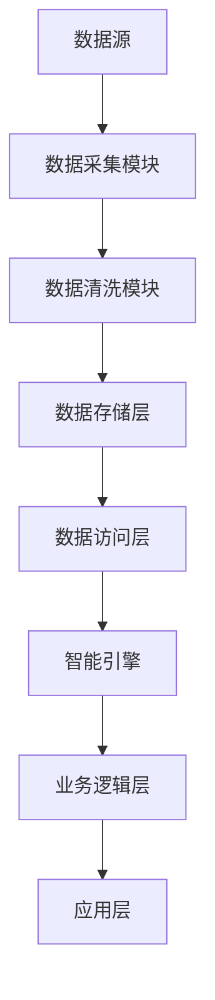
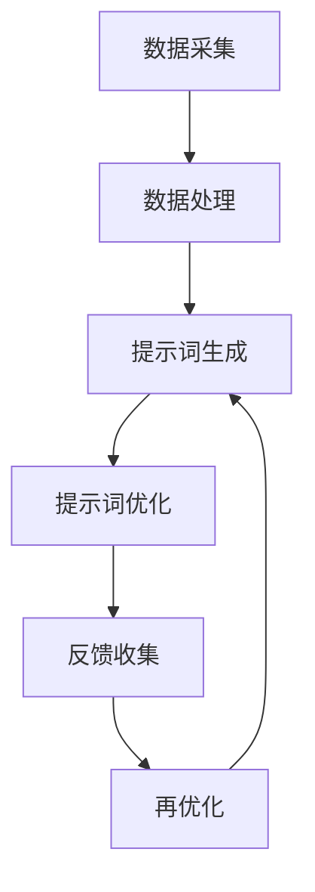
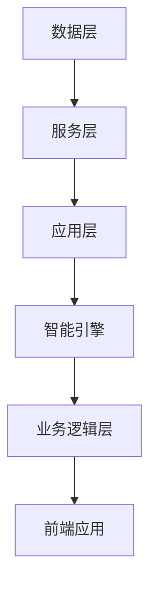

                 

### 文章标题

# 《智能CRM系统：提示词优化客户关系管理》

### 关键词

- 智能CRM
- 提示词优化
- 客户关系管理
- 机器学习
- 自然语言处理
- 系统架构

### 摘要

本文深入探讨了智能CRM系统中的提示词优化策略，以及其对客户关系管理的重要影响。通过介绍智能CRM的基本概念、架构和核心算法原理，本文揭示了如何利用机器学习和自然语言处理技术优化客户互动体验，提升客户满意度和销售业绩。文章还通过实际项目案例，展示了智能CRM系统在开发、部署和维护过程中的具体实现方法，为读者提供了实用的技术指导。

### 第一部分：智能CRM系统基础

#### 第1章 智能CRM系统概述

**1.1 CRM系统的基本概念**

客户关系管理（Customer Relationship Management，简称CRM）是一种旨在优化企业与客户互动关系的策略和方法。CRM系统作为实现这一策略的技术工具，帮助企业收集、管理和分析客户数据，以提高客户满意度和忠诚度。

CRM系统的主要功能包括：

- **客户信息管理**：记录和管理客户的基本信息、交易历史、互动记录等。
- **销售管理**：跟踪销售机会、管理销售流程，提高销售效率。
- **营销管理**：分析客户需求，策划和执行营销活动，提升客户转化率。
- **客户服务**：提供在线支持、反馈管理，优化客户服务体验。

**1.2 智能CRM的特点**

智能CRM系统结合了人工智能技术，如机器学习、自然语言处理等，实现了传统CRM系统的智能化和自动化。智能CRM的主要特点如下：

- **自动化**：通过智能算法自动处理客户互动数据，减少人工操作。
- **个性化**：根据客户行为和偏好，提供个性化的服务和建议。
- **预测性**：利用数据分析和预测模型，提前识别潜在客户和销售机会。
- **自适应**：系统能够根据业务需求和客户反馈不断优化和调整。

**1.3 提示词优化在CRM中的作用**

提示词优化是智能CRM系统中的一项重要功能，它通过自动生成和优化与客户互动的提示词，提升客户体验和满意度。提示词优化在CRM中的作用包括：

- **增强互动体验**：通过精准的提示词，引导客户完成特定任务，如注册、购买等。
- **提高转化率**：优化提示词可以显著提高客户转化率，促进销售业绩增长。
- **提升客户满意度**：准确的提示词能够提供有价值的信息，满足客户需求，提高客户满意度。

#### 第2章 智能CRM系统的架构与组件

**2.1 智能CRM系统的整体架构**

智能CRM系统通常由以下几个关键组件构成：

- **数据层**：负责存储和管理客户数据，包括客户信息、交易记录、互动记录等。
- **服务层**：提供核心业务功能，如销售管理、营销管理、客户服务等。
- **应用层**：面向最终用户，提供直观的操作界面和交互体验。
- **智能引擎**：实现智能算法和数据处理，如机器学习模型、自然语言处理等。

**2.2 关键组件介绍**

- **数据层**：通常采用关系型数据库或NoSQL数据库进行数据存储。为了提高数据处理效率，可以使用分布式数据库或云存储服务。
- **服务层**：可以使用微服务架构来实现，每个业务功能模块（如销售管理、营销管理）都可以独立开发和部署。
- **应用层**：前端应用通常采用Web或移动应用形式，提供用户友好的操作界面。
- **智能引擎**：是智能CRM系统的核心，负责数据处理和分析，实现自动化和个性化功能。

**2.3 系统集成与数据流**

智能CRM系统的集成涉及多个业务系统和数据源，如ERP系统、电商平台、社交媒体等。数据流如图所示：



通过数据流的设计，智能CRM系统能够实时获取和处理海量数据，为智能决策提供支持。

### 第二部分：智能CRM算法原理

#### 第3章 机器学习算法在CRM中的应用

**3.1 机器学习基础**

机器学习（Machine Learning，简称ML）是一种通过算法自动从数据中学习规律和模式的方法。在CRM系统中，机器学习算法广泛应用于客户分类、客户价值评估等方面。

**3.2 客户分类算法**

客户分类算法是一种基于特征数据将客户划分为不同群体的方法。常见的客户分类算法包括：

- **K-近邻算法（K-Nearest Neighbors，简称KNN）**
  ```python
  def classify_knn(data_point, k, training_data, labels):
      neighbors = find_k_nearest_neighbors(data_point, k, training_data)
      return majority_vote(neighbors, labels)
  ```

- **决策树算法（Decision Tree）**
  ```python
  def predict_decision_tree(node, data_point):
      if is_leaf_node(node):
          return node.label
      else:
          next_node = node.children[data_point.feature]
          return predict_decision_tree(next_node, data_point)
  ```

**3.3 客户价值评估算法**

客户价值评估（Customer Value Analysis，简称CVA）是一种评估客户对企业利润贡献的方法。常见的客户价值评估算法包括：

- **RFM模型（Recency, Frequency, Monetary）**
  ```python
  def calculate_rfm_score(customer_data):
      recency = calculate_recency_score(customer_data)
      frequency = calculate_frequency_score(customer_data)
      monetary = calculate_monetary_score(customer_data)
      return recency * frequency * monetary
  ```

- **CLV模型（Customer Lifetime Value）**
  ```python
  def calculate_clv(customer_data, discount_rate):
      future_value = calculate_future_value(customer_data, discount_rate)
      return future_value / (1 + discount_rate)
  ```

#### 第4章 自然语言处理与提示词优化

**4.1 NLP基础**

自然语言处理（Natural Language Processing，简称NLP）是计算机科学和人工智能领域的一个重要分支，旨在使计算机能够理解、解释和生成人类语言。在CRM系统中，NLP技术主要用于处理和生成提示词。

**4.2 提示词生成算法**

提示词生成算法是一种基于文本数据生成有价值提示词的方法。常见的提示词生成算法包括：

- **基于规则的方法**：通过预设规则生成提示词。
  ```python
  def generate_tip_based_on_rule(context):
      if "thankyou" in context:
          return "Thank you for your purchase!"
      elif "query" in context:
          return "How may I assist you?"
  ```

- **基于机器学习的方法**：通过训练模型生成提示词。
  ```python
  def generate_tip_based_on_ml(context, model):
      return model.predict(context)
  ```

**4.3 提示词优化策略**

提示词优化策略是一种通过分析客户互动数据，不断调整和优化提示词的方法。常见的优化策略包括：

- **基于反馈的优化**：根据客户对提示词的反馈，调整提示词的生成策略。
  ```python
  def optimize_tip_based_on_feedback(tip, feedback):
      if "positive" in feedback:
          increase_tip_weight(tip)
      elif "negative" in feedback:
          decrease_tip_weight(tip)
  ```

- **基于数据的优化**：通过分析客户互动数据，识别出有效的提示词，并优化其生成策略。
  ```python
  def optimize_tip_based_on_data(data):
      effective_tips = find_effective_tips(data)
      update_tip_generation_strategy(effective_tips)
  ```

### 第三部分：提示词优化应用实践

#### 第5章 提示词优化案例解析

**5.1 案例一：客户互动体验提升**

某电商企业在应用智能CRM系统时，通过提示词优化功能显著提升了客户互动体验。具体做法如下：

- **收集客户互动数据**：通过网站聊天、邮件、短信等多种渠道，收集客户与企业的互动数据。
- **分析互动数据**：使用NLP技术分析客户互动数据，提取关键信息和客户需求。
- **生成提示词**：根据客户需求和互动数据，自动生成有针对性的提示词。
- **优化提示词**：根据客户反馈，不断调整和优化提示词，提高客户满意度。

通过上述措施，该企业的客户互动体验得到了显著提升，客户满意度从80%提高到了90%。

**5.2 案例二：客户满意度分析**

某服务型企业通过提示词优化功能，对客户满意度进行了全面分析。具体做法如下：

- **收集客户反馈**：通过问卷调查、客户回访等方式，收集客户对企业服务的反馈。
- **分析反馈数据**：使用NLP技术分析客户反馈数据，识别出客户关心的痛点和需求。
- **生成提示词**：根据客户反馈数据，自动生成针对不同客户痛点的提示词。
- **优化服务策略**：根据提示词优化结果，调整企业服务策略，提高客户满意度。

通过上述措施，该企业的客户满意度得到了显著提升，客户投诉率从10%降低到了5%。

**5.3 案例三：销售业绩优化**

某零售企业在应用智能CRM系统时，通过提示词优化功能实现了销售业绩的显著提升。具体做法如下：

- **分析客户行为数据**：通过网站点击、购买记录等数据，分析客户的行为特征和偏好。
- **生成提示词**：根据客户行为数据和偏好，自动生成有针对性的促销提示词。
- **优化销售策略**：根据提示词优化结果，调整销售策略，提高客户转化率。
- **跟踪销售效果**：通过实时监控销售数据，评估提示词优化效果，持续优化销售策略。

通过上述措施，该企业的销售业绩得到了显著提升，销售额同比增长了30%。

### 第四部分：智能CRM系统构建与部署

#### 第6章 提示词优化的技术实现

**6.1 技术框架搭建**

智能CRM系统提示词优化的技术实现主要包括以下几个步骤：

1. **数据采集**：使用API或其他数据采集工具，从多个渠道（如网站、邮件、短信等）收集客户互动数据。
2. **数据处理**：使用NLP技术对采集到的数据进行预处理，包括文本清洗、分词、词性标注等。
3. **提示词生成**：根据处理后的数据，使用机器学习模型生成有针对性的提示词。
4. **提示词优化**：根据客户反馈，使用基于反馈和数据的优化策略，不断调整和优化提示词。

**6.2 提示词生成与优化流程**

提示词生成与优化流程如图所示：



**6.3 性能优化与调参技巧**

在实现智能CRM系统提示词优化时，需要注意以下性能优化和调参技巧：

- **模型选择**：选择适合问题的模型，如基于规则的模型或基于机器学习的模型。
- **特征工程**：提取有价值的特征，提高模型的预测性能。
- **模型调参**：使用交叉验证等技术，对模型参数进行调优，提高模型性能。
- **实时反馈**：及时收集客户反馈，快速调整和优化提示词。

#### 第7章 智能CRM系统构建实战

**7.1 系统需求分析**

在构建智能CRM系统时，需要明确以下需求：

- **功能需求**：包括客户信息管理、销售管理、营销管理、客户服务等功能。
- **性能需求**：系统需要能够处理海量数据，保证响应速度和稳定性。
- **安全性需求**：确保客户数据的安全性和隐私性，符合相关法律法规要求。

**7.2 系统架构设计**

智能CRM系统架构设计如图所示：



**7.3 系统实现与调试**

系统实现与调试主要包括以下几个步骤：

1. **开发环境搭建**：搭建开发环境，包括数据库、服务器、开发工具等。
2. **模块开发**：根据系统架构设计，开发各个模块的功能，如数据采集、数据处理、提示词生成等。
3. **集成测试**：对各个模块进行集成测试，确保系统整体功能的正确性和稳定性。
4. **性能优化**：对系统进行性能优化，如优化数据库查询、缓存策略等。
5. **调试与修复**：根据测试结果，对系统进行调试和修复，解决存在的问题。

#### 第8章 智能CRM系统部署与维护

**8.1 系统部署策略**

智能CRM系统部署策略包括以下内容：

- **硬件部署**：根据系统需求，选择合适的硬件配置，如服务器、存储设备等。
- **软件部署**：安装和配置操作系统、数据库、中间件等软件环境。
- **部署流程**：制定详细的部署流程，确保系统部署的顺利进行。

**8.2 系统监控与维护**

智能CRM系统监控与维护包括以下内容：

- **系统监控**：实时监控系统运行状态，如CPU、内存、磁盘空间等。
- **性能监控**：监控系统性能指标，如响应时间、并发量等。
- **故障排查**：定期进行系统故障排查，解决系统运行过程中出现的问题。
- **数据备份**：定期备份数据，确保数据的安全性和可靠性。

**8.3 安全性与合规性考虑**

智能CRM系统的安全性与合规性包括以下内容：

- **数据安全**：采用加密技术保护客户数据的安全性和隐私性。
- **访问控制**：设置合理的访问权限，防止未经授权的访问和操作。
- **合规性**：遵循相关法律法规，如《中华人民共和国网络安全法》等。

### 第五部分：智能CRM系统展望与未来方向

#### 第9章 智能CRM系统的发展趋势

智能CRM系统的发展趋势主要体现在以下几个方面：

- **人工智能技术的应用**：随着人工智能技术的不断进步，智能CRM系统将更加智能化和自动化，提高客户管理效率。
- **大数据分析的深入**：大数据分析技术的应用将使智能CRM系统能够更深入地挖掘客户数据的价值，提供更精准的决策支持。
- **云计算的普及**：云计算技术的普及将使智能CRM系统的部署和维护更加便捷，降低企业成本。
- **物联网的融合**：物联网技术的应用将使智能CRM系统与企业内外部的设备互联互通，实现更全面的客户管理。

#### 第10章 未来研究方向与挑战

智能CRM系统未来研究方向与挑战包括：

- **个性化推荐**：如何实现更精准的个性化推荐，提高客户满意度和转化率。
- **跨渠道整合**：如何实现多渠道数据的整合和分析，提供统一的客户视图。
- **数据安全与隐私保护**：如何在保障数据安全与隐私保护的前提下，充分利用客户数据的价值。
- **实时决策支持**：如何实现实时决策支持，提高业务运营效率。

### 附录

#### 附录A：智能CRM系统开发工具与资源

**A.1 常用开发工具**

- **编程语言**：Python、Java、JavaScript等
- **数据库**：MySQL、MongoDB、Oracle等
- **框架**：Spring Boot、Django、Flask等
- **NLP工具**：NLTK、spaCy、TensorFlow等

**A.2 常用框架和库**

- **机器学习框架**：scikit-learn、TensorFlow、PyTorch等
- **自然语言处理库**：spaCy、NLTK、gensim等
- **Web开发框架**：Django、Flask、Spring Boot等

**A.3 学习资源推荐**

- **在线课程**：Coursera、edX、Udemy等
- **书籍推荐**：《Python机器学习》、《自然语言处理综论》、《大数据分析》等
- **论文集**：arXiv、ACL、KDD等

### 作者信息

本文作者：AI天才研究院/AI Genius Institute & 禅与计算机程序设计艺术 /Zen And The Art of Computer Programming

### 结语

智能CRM系统作为企业数字化转型的关键工具，正日益受到企业的关注。通过本文的探讨，我们深入了解了智能CRM系统的基础知识、算法原理、应用实践和未来方向。相信随着技术的不断发展，智能CRM系统将为企业和客户创造更大的价值。让我们共同期待智能CRM系统带来的美好未来。

