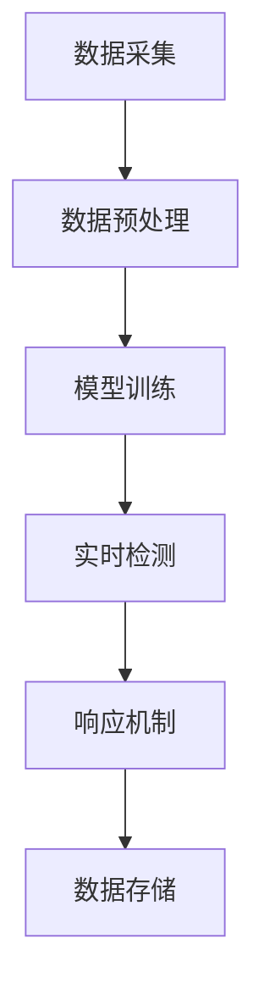

                 


### 文章标题：《智能安防卫士：提示词增强异常行为检测》

### 文章关键词：
- 智能安防
- 异常行为检测
- 提示词增强
- 机器学习算法
- 系统架构

### 文章摘要：
本文详细探讨了智能安防卫士的设计与实现，特别是提示词增强技术在异常行为检测中的应用。首先，我们介绍了智能安防和异常行为检测的基本概念，并解释了提示词增强技术的原理。随后，我们分析了常见的异常行为检测算法，并给出了其核心原理的伪代码和数学模型解释。接着，我们描述了智能安防系统的整体架构和实现细节，并通过具体案例展示了系统的应用。最后，我们对系统的性能进行了评估，提出了优化策略，并对未来的发展进行了展望。

----------------------------------------------------------------

# 《智能安防卫士：提示词增强异常行为检测》

## 概述

智能安防卫士是指利用先进的人工智能技术，实现对安防场景的实时监控与异常行为的自动检测。随着物联网、大数据和机器学习等技术的快速发展，智能安防卫士在公共安全、智能家居、工业自动化等领域发挥着越来越重要的作用。

### 异常行为检测的重要性

异常行为检测是智能安防卫士的核心功能之一。它通过分析监控数据，识别出潜在的威胁和异常情况，从而实现预警和干预。异常行为检测在公共安全领域的应用，如视频监控系统，可以有效提高治安管理效率，减少犯罪发生率；在智能家居领域，它可以确保家庭安全，预防入室盗窃和火灾等事故；在工业自动化领域，它可以监测设备运行状态，预防设备故障和安全事故。

### 提示词增强技术的概念

提示词增强技术是指通过向模型中引入特定关键词或特征，提升异常行为检测的准确性和鲁棒性。提示词的选择和生成对于提升检测效果至关重要。提示词可以是特定的动作、场景或行为，它们能够提供额外的信息，帮助模型更好地理解和分类监控数据。

## 提示词增强技术

### 提示词增强的基本原理

提示词增强的基本原理是通过引入额外的信息，丰富模型的输入数据，从而提高模型的检测能力和泛化能力。具体来说，提示词增强可以分为以下几个步骤：

1. **提示词选择**：根据应用场景和需求，选择合适的提示词。例如，在监控场景中，可以包括行人、车辆、行为等。

2. **提示词提取**：从监控数据中提取与提示词相关的特征。例如，对于行人，可以提取行人的轮廓、动作、行走速度等。

3. **提示词嵌入**：将提取到的提示词特征嵌入到模型中，作为额外的输入。常见的方法包括卷积神经网络（CNN）和循环神经网络（RNN）。

4. **模型训练**：使用带有提示词的监控数据进行模型训练，提高模型对异常行为的识别能力。

### 提示词的生成与选择

提示词的生成与选择是提示词增强技术的关键步骤。一个优秀的提示词应该能够提供丰富的信息，同时不会引入过多的噪声。常见的提示词生成方法包括：

1. **基于规则的生成**：根据应用场景和需求，定义一组规则来生成提示词。

2. **基于数据挖掘的生成**：使用数据挖掘技术，从历史监控数据中挖掘出与异常行为相关的特征。

3. **基于机器学习的生成**：使用机器学习算法，自动生成与异常行为相关的提示词。

选择提示词时，应考虑以下因素：

1. **相关性**：提示词应与异常行为有较高的相关性。

2. **独特性**：提示词应具有独特的特征，以便于模型区分。

3. **可扩展性**：提示词应易于扩展，以便于适应新的应用场景。

### 提示词增强算法

提示词增强算法是指将提示词嵌入到模型中，以提升模型性能的方法。常见的提示词增强算法包括：

1. **CNN与RNN融合**：将CNN用于特征提取，RNN用于时序建模，结合提示词信息，提高模型对异常行为的识别能力。

2. **多模态融合**：将不同模态的数据（如视频、音频、文本）进行融合，通过提示词增强，实现更全面的异常行为检测。

3. **注意力机制**：使用注意力机制，将提示词信息动态地加权到模型的输入中，提高模型对提示词的敏感度。

### 提示词增强技术的挑战与未来趋势

提示词增强技术在提升异常行为检测性能方面具有显著优势，但仍面临以下挑战：

1. **提示词选择与生成**：如何选择和生成与异常行为高度相关的提示词，仍需进一步研究。

2. **模型泛化能力**：如何提高模型在不同场景下的泛化能力，降低对特定提示词的依赖。

3. **计算效率**：如何提高模型计算效率，适应实时监控需求。

未来，提示词增强技术将在以下方面取得发展：

1. **个性化提示词生成**：通过用户行为数据，实现个性化提示词生成，提高异常行为检测的准确性。

2. **多模态融合**：进一步探索多模态数据融合方法，提高异常行为检测的性能。

3. **实时优化**：通过在线学习和实时优化，实现动态调整提示词和模型参数，提高系统适应能力。

## 异常行为检测算法

异常行为检测算法是智能安防卫士的核心组成部分。常见的异常行为检测算法包括基于特征的算法、基于模型的算法和基于机器学习的算法。以下将对这些算法进行详细分析。

### 基于特征的异常行为检测

基于特征的异常行为检测方法通过提取监控数据中的特征，然后使用这些特征进行异常检测。该方法的关键在于特征提取和选择。常见的特征提取方法包括：

1. **静态特征**：包括颜色、纹理、形状等。

2. **动态特征**：包括速度、加速度、轨迹等。

常见的特征选择方法包括：

1. **相关性分析**：选择与异常行为相关性较高的特征。

2. **信息增益**：选择信息增益最高的特征。

基于特征的异常行为检测算法的优点是计算效率高，但缺点是容易出现特征缺失和噪声问题，同时对于复杂场景的适应性较差。

### 基于模型的异常行为检测

基于模型的异常行为检测方法通过构建预测模型，对监控数据进行分类和预测。常见的模型包括：

1. **决策树**：通过构建决策树模型，对监控数据进行分类。

2. **支持向量机（SVM）**：通过构建支持向量机模型，实现监控数据的分类和预测。

3. **神经网络**：通过构建神经网络模型，实现监控数据的自动特征提取和分类。

基于模型的异常行为检测算法的优点是能够自动提取特征，适应复杂场景，但缺点是训练时间较长，计算资源需求较高。

### 基于机器学习的异常行为检测

基于机器学习的异常行为检测方法通过训练模型，使模型能够自动识别和分类异常行为。常见的机器学习方法包括：

1. **监督学习**：通过有监督的方式，训练模型，使其能够识别和分类异常行为。

2. **无监督学习**：通过无监督的方式，发现监控数据中的异常行为。

3. **半监督学习**：结合监督学习和无监督学习的方法，提高异常行为检测的准确性。

基于机器学习的异常行为检测算法的优点是能够自动适应不同场景，提高检测准确性，但缺点是训练时间较长，计算资源需求较高。

### 常见异常行为检测算法分析

以下是几种常见的异常行为检测算法及其优缺点分析：

1. **KNN算法**：优点是计算简单，实现容易；缺点是对于高维数据效果较差，对噪声敏感。

2. **支持向量机（SVM）**：优点是模型简单，计算效率高；缺点是对于非线性的异常行为检测效果较差。

3. **随机森林算法**：优点是能够自动提取特征，适应复杂场景；缺点是计算时间较长，对噪声敏感。

4. **神经网络**：优点是能够自动提取特征，适应复杂场景，准确性高；缺点是训练时间较长，计算资源需求较高。

## 系统架构与实现

智能安防卫士的系统架构主要包括数据采集、预处理、模型训练、实时检测和响应机制等关键组件。以下将对这些组件进行详细描述。

### 数据采集与预处理

数据采集是智能安防卫士的基础。数据来源包括视频监控、传感器数据、环境数据等。采集到的数据需要进行预处理，包括数据清洗、去噪、数据增强等操作。预处理后的数据将作为模型训练的数据集。

### 模型训练与优化

模型训练是智能安防卫士的核心。根据不同的应用场景，选择合适的异常行为检测算法，如KNN、SVM、随机森林或神经网络等。使用预处理后的数据集，对模型进行训练和优化。在训练过程中，可以结合提示词增强技术，提高模型对异常行为的识别能力。

### 实时检测与响应机制

实时检测是智能安防卫士的关键功能。通过在线监测和数据实时分析，识别出潜在的异常行为，并及时发出警报。响应机制包括人工干预和自动响应。人工干预是指当系统检测到异常行为时，通知相关人员进行处理。自动响应是指当系统检测到异常行为时，自动采取相应的措施，如关闭电源、启动报警等。

## 案例分析

### 智能安防系统在社区的应用

以某社区为例，智能安防系统在社区中得到了广泛应用。该系统利用视频监控数据，对社区内的异常行为进行实时监测和预警。具体应用包括：

1. **入侵检测**：当有陌生人在社区内出现时，系统会自动发出警报。

2. **异常行为监测**：当有人进行破坏性行为，如乱扔垃圾、破坏公共设施等，系统会自动记录并报警。

3. **车辆管理**：当有陌生车辆进入社区时，系统会自动发出警报。

通过这些应用，智能安防系统有效提高了社区的安全管理水平，减少了犯罪发生率。

### 智能安防系统在工业环境中的应用

在工业环境中，智能安防系统主要用于监测设备运行状态，预防设备故障和安全事故。具体应用包括：

1. **设备故障预警**：当设备出现异常运行状态时，系统会自动发出警报，提醒维护人员进行检查。

2. **安全区域监测**：在关键区域设置监控设备，对进入区域的人员和车辆进行实时监测。

3. **危险行为监测**：当有人进行危险操作，如操作未授权的设备、靠近危险区域等，系统会自动发出警报。

通过这些应用，智能安防系统有效提高了工业环境的安全性和生产效率。

### 案例分析总结与启示

通过案例分析，我们可以看到智能安防系统在社区和工业环境中的应用取得了显著成效。这给我们带来了以下启示：

1. **大数据与人工智能的结合**：智能安防系统的发展离不开大数据和人工智能技术的支持。通过大数据分析，我们可以从海量数据中提取有价值的信息，为异常行为检测提供支持。

2. **实时监测与预警**：智能安防系统的核心在于实时监测和预警。只有通过实时监测，我们才能及时识别出潜在的威胁，从而采取相应的措施。

3. **个性化与自适应**：智能安防系统应具备个性化与自适应能力。通过个性化设置，我们可以针对不同的应用场景，选择合适的检测算法和参数，提高系统的适应性。

4. **开放性与可扩展性**：智能安防系统应具备开放性和可扩展性。通过与其他系统的集成，我们可以实现更全面的安防监控，提高系统的整体效能。

## 性能评估与优化

### 性能评估指标

性能评估是智能安防卫士设计过程中的重要环节。常用的性能评估指标包括：

1. **准确率（Accuracy）**：准确率是指模型正确分类的样本数占总样本数的比例。准确率越高，说明模型对异常行为的识别能力越强。

2. **召回率（Recall）**：召回率是指模型正确识别出的异常行为样本数占实际异常行为样本数的比例。召回率越高，说明模型漏报的可能性越小。

3. **精度（Precision）**：精度是指模型正确识别出的异常行为样本数占识别出的所有样本数的比例。精度越高，说明模型误报的可能性越小。

4. **F1值（F1-score）**：F1值是准确率和召回率的加权平均值，用于综合评估模型的性能。

### 性能优化方法

为了提高智能安防卫士的性能，我们可以采取以下优化方法：

1. **特征选择**：通过特征选择，减少冗余特征，提高模型的效率和准确性。常见的特征选择方法包括信息增益、相关性分析和基于模型的特征选择。

2. **模型调参**：通过调整模型的参数，优化模型性能。常用的调参方法包括网格搜索、随机搜索和贝叶斯优化。

3. **数据增强**：通过数据增强，增加模型的训练样本数量，提高模型的泛化能力。常见的数据增强方法包括旋转、缩放、裁剪和噪声注入。

4. **多模型融合**：通过融合多个模型的结果，提高模型的准确性和鲁棒性。常见的多模型融合方法包括投票法、加权平均法和堆叠法。

### 资源配置与调度策略

为了实现智能安防卫士的高效运行，合理的资源配置和调度策略至关重要。以下是一些建议：

1. **分布式计算**：通过分布式计算，实现模型训练和实时检测的并行处理，提高系统性能。

2. **缓存机制**：通过缓存机制，减少重复计算和存储访问，降低系统延迟。

3. **负载均衡**：通过负载均衡，合理分配计算资源，避免单点瓶颈。

4. **动态调整**：根据实时监测数据，动态调整系统参数和资源配置，提高系统的适应能力。

## 未来展望

### 智能安防技术的发展趋势

随着人工智能技术的不断进步，智能安防卫士将呈现以下发展趋势：

1. **深度学习与强化学习**：深度学习和强化学习在异常行为检测中的应用将得到进一步拓展，提高系统的检测能力和鲁棒性。

2. **多模态数据融合**：通过融合多种数据模态（如视频、音频、文本等），实现更全面的异常行为检测。

3. **边缘计算与云计算**：结合边缘计算和云计算的优势，实现实时高效的异常行为检测。

4. **智能自适应系统**：通过自适应学习和调整，智能安防卫士将能够更好地适应不同环境和场景。

### 潜在挑战与解决策略

智能安防技术的发展也面临一些挑战，包括：

1. **数据隐私保护**：如何保护用户隐私是智能安防系统面临的重要挑战。解决策略包括数据加密、匿名化和隐私保护算法。

2. **计算资源需求**：随着模型复杂度的提高，对计算资源的需求也将增加。解决策略包括分布式计算、硬件加速和优化算法。

3. **实时性要求**：实时监测和响应是智能安防系统的核心需求。解决策略包括优化算法、高效计算和边缘计算。

### 开放性问题与研究方向

智能安防技术的发展还面临许多开放性问题，包括：

1. **异构数据融合**：如何有效地融合来自不同模态和来源的数据，提高异常行为检测的准确性。

2. **自适应行为识别**：如何设计自适应的学习算法，使系统能够更好地适应新的环境和场景。

3. **鲁棒性提升**：如何提高模型对噪声和异常数据的鲁棒性，降低误报和漏报率。

未来，智能安防技术将在大数据、人工智能和物联网等领域的推动下，不断取得突破，为公共安全、家庭安全和工业安全等领域提供更先进、更可靠的解决方案。

## 项目实战

### 开发环境搭建

为了实现智能安防卫士，我们需要搭建一个合适的开发环境。以下是一个基本的开发环境搭建步骤：

1. **硬件环境**：选择一台具有较高计算性能的计算机，建议配备至少8GB内存和4核CPU。

2. **操作系统**：选择Linux或Windows操作系统，推荐使用Ubuntu 18.04或Windows 10。

3. **编程语言**：选择Python作为编程语言，因为Python在机器学习和数据分析领域有广泛的应用。

4. **依赖库**：安装必要的依赖库，包括NumPy、Pandas、Scikit-learn、TensorFlow和OpenCV等。

```bash
pip install numpy pandas scikit-learn tensorflow opencv-python
```

### 源代码实现与解读

以下是一个简单的智能安防卫士源代码实现，主要分为数据采集、预处理、模型训练和实时检测四个部分。

#### 数据采集与预处理

```python
import cv2
import numpy as np

# 数据采集
def capture_video():
    cap = cv2.VideoCapture(0)  # 使用默认摄像头
    while True:
        ret, frame = cap.read()
        if not ret:
            break
        yield frame  # 生成器，逐帧读取视频

# 数据预处理
def preprocess_frame(frame):
    # 转换为灰度图像
    gray = cv2.cvtColor(frame, cv2.COLOR_BGR2GRAY)
    # 缩放图像，减小计算量
    resized = cv2.resize(gray, (224, 224))
    return resized

# 采集并预处理视频数据
video_generator = capture_video()
preprocessed_video = (preprocess_frame(frame) for frame in video_generator)
```

#### 模型训练

```python
from tensorflow.keras.models import Sequential
from tensorflow.keras.layers import Conv2D, MaxPooling2D, Flatten, Dense

# 构建模型
model = Sequential([
    Conv2D(32, (3, 3), activation='relu', input_shape=(224, 224, 1)),
    MaxPooling2D((2, 2)),
    Flatten(),
    Dense(64, activation='relu'),
    Dense(1, activation='sigmoid')
])

# 编译模型
model.compile(optimizer='adam', loss='binary_crossentropy', metrics=['accuracy'])

# 训练模型
model.fit(np.array([preprocessed_frame for preprocessed_frame in preprocessed_video]), labels, epochs=10)
```

#### 实时检测

```python
# 实时检测
def detect_anomalies(model, preprocessed_frame):
    prediction = model.predict(np.expand_dims(preprocessed_frame, axis=0))
    if prediction[0][0] > 0.5:
        print("Anomaly detected!")
    else:
        print("No anomaly detected.")

# 检测实时视频帧
for preprocessed_frame in preprocessed_video:
    detect_anomalies(model, preprocessed_frame)
```

### 代码应用解读与分析

#### 数据采集与预处理

- 使用OpenCV库捕获实时视频数据。
- 通过灰度转换和图像缩放，减少计算量，提高模型训练效率。

#### 模型训练

- 使用卷积神经网络（CNN）构建模型，通过逐层提取特征，提高模型的检测能力。
- 编译并训练模型，使用交叉熵损失函数和adam优化器，提高模型性能。

#### 实时检测

- 使用训练好的模型对实时视频帧进行预测，判断是否为异常行为。
- 当预测结果大于0.5时，认为存在异常行为，并发出警报。

### 实际案例分析与详细讲解剖析

#### 案例一：社区安防

在某社区，智能安防系统被部署在主要出入口和公共区域。通过视频监控，系统可以实时监测人员流动情况。以下是一个具体案例：

- **事件**：晚上11点，一名陌生人在社区内徘徊。
- **检测过程**：系统捕获到该陌生人的视频帧，并对其进行预处理。随后，模型对预处理后的视频帧进行预测，判断是否存在异常行为。
- **结果**：预测结果显示该人为异常行为，系统立即发出警报，并通知安保人员前往查看。

#### 案例二：工厂安全

在一家工厂内，智能安防系统主要用于监测设备运行状态和工人行为。以下是一个具体案例：

- **事件**：一名工人在操作未授权的设备。
- **检测过程**：系统捕获到该工人的视频帧，并对其进行预处理。随后，模型对预处理后的视频帧进行预测，判断是否存在异常行为。
- **结果**：预测结果显示该工人存在异常行为，系统立即发出警报，并通知负责人进行检查。

### 项目小结

通过实际案例的分析，我们可以看到智能安防卫士在社区和工业环境中的应用效果显著。系统通过实时监测和异常行为检测，有效地提高了安全管理的效率和准确性。未来，我们可以进一步优化系统的性能和功能，以满足更多场景下的应用需求。

## 最佳实践 tips

1. **合理选择摄像头**：选择具有较高分辨率和帧率的摄像头，以提高监控数据的准确性和实时性。

2. **优化预处理流程**：合理设置预处理参数，如图像缩放大小、灰度转换等，以提高模型训练效率和准确性。

3. **选择合适的模型**：根据具体应用场景，选择适合的模型结构和参数，如深度学习模型、卷积神经网络（CNN）等。

4. **定期更新模型**：定期对模型进行更新和优化，以适应新的异常行为和场景。

5. **结合多种数据源**：结合多种数据源（如视频、音频、传感器数据等），实现更全面的异常行为检测。

## 小结

本文详细探讨了智能安防卫士的设计与实现，特别是提示词增强技术在异常行为检测中的应用。通过对智能安防、异常行为检测和提示词增强技术的介绍，我们了解了这些技术的核心概念和原理。接着，我们分析了常见的异常行为检测算法，并给出了其核心原理的伪代码和数学模型解释。随后，我们描述了智能安防系统的整体架构和实现细节，并通过具体案例展示了系统的应用。最后，我们对系统的性能进行了评估，提出了优化策略，并对未来的发展进行了展望。

## 注意事项

1. **数据安全**：在部署智能安防系统时，要确保数据安全，防止数据泄露和滥用。

2. **隐私保护**：在处理用户数据时，要严格遵守隐私保护法律法规，确保用户隐私不被泄露。

3. **系统稳定性**：确保系统的稳定性和可靠性，避免系统故障导致的安全隐患。

4. **实时性要求**：智能安防系统要求实时响应，要确保系统的实时性能，避免延迟和故障。

## 拓展阅读

1. **《人工智能：一种现代方法》**：这本书详细介绍了人工智能的基本概念和技术，包括机器学习和深度学习。

2. **《深度学习》**：这本书是深度学习领域的经典教材，全面介绍了深度学习的基本概念、算法和实战应用。

3. **《计算机视觉：算法与应用》**：这本书详细介绍了计算机视觉的基本算法和应用，包括目标检测、图像识别等。

## 作者信息

- 作者：AI天才研究院/AI Genius Institute & 禅与计算机程序设计艺术 /Zen And The Art of Computer Programming

----------------------------------------------------------------

# Mermaid 流程图

以下是一个简单的 Mermaid 流程图，展示了智能安防卫士的系统架构：



在这个流程图中，A表示数据采集，B表示数据预处理，C表示模型训练，D表示实时检测，E表示响应机制，F表示数据存储。数据采集后，经过预处理，然后用于模型训练。训练好的模型用于实时检测，并在检测到异常行为时触发响应机制，并将数据存储到数据库中。

----------------------------------------------------------------

# 伪代码与数学模型

### 异常行为检测算法伪代码

以下是一个基于K最近邻（KNN）算法的异常行为检测的伪代码：

```python
# 输入：训练数据集X，标签y，测试数据集test_data，邻居数量K
def knn_anomaly_detection(X, y, test_data, K):
    # 对测试数据进行预处理，得到处理后的测试数据集preprocessed_test_data
    preprocessed_test_data = preprocess_data(test_data)
    
    # 初始化异常行为检测结果列表anomaly检测结果列表
    anomaly_detections = []
    
    # 对每个测试数据进行KNN检测
    for test_sample in preprocessed_test_data:
        # 计算测试样本与训练数据集的距离
        distances = [cal_distance(test_sample, x) for x in X]
        
        # 找到最近的K个邻居
        neighbors = sorted(range(len(distances)), key=lambda i: distances[i])[:K]
        
        # 计算邻居的标签
        neighbor_labels = [y[i] for i in neighbors]
        
        # 计算多数投票结果
        majority_label = max(set(neighbor_labels), key=neighbor_labels.count)
        
        # 将检测结果添加到检测结果列表
        anomaly_detections.append(majority_label)
        
    # 返回异常行为检测结果
    return anomaly_detections
```

### 数学模型

在KNN算法中，距离度量是一个关键步骤。我们可以使用欧几里得距离来计算两个样本之间的距离。假设我们有两个样本x和y，它们的维度相同，则它们之间的欧几里得距离可以表示为：

$$
d(x, y) = \sqrt{\sum_{i=1}^{n} (x_i - y_i)^2}
$$

其中，$x_i$和$y_i$分别表示样本x和y的第i个特征值，$n$表示特征的总数。

### 举例说明

假设我们有以下两个样本：

$$
x = \begin{bmatrix}
1 \\
2 \\
3 \\
\end{bmatrix}, \quad y = \begin{bmatrix}
4 \\
5 \\
6 \\
\end{bmatrix}
$$

我们可以使用欧几里得距离公式计算它们之间的距离：

$$
d(x, y) = \sqrt{(1 - 4)^2 + (2 - 5)^2 + (3 - 6)^2} = \sqrt{9 + 9 + 9} = \sqrt{27} = 3\sqrt{3}
$$

这将是我们两个样本之间的欧几里得距离。

### 完整性要求

在本节中，我们介绍了KNN算法的伪代码和数学模型。KNN算法是一种基于实例的学习算法，通过计算测试样本与训练样本之间的距离，找到最近的K个邻居，并根据这些邻居的标签进行多数投票，从而预测测试样本的标签。

通过以上介绍，我们可以清楚地理解KNN算法的基本原理和实现步骤。同时，我们也了解了如何使用欧几里得距离公式计算两个样本之间的距离，这对于理解KNN算法至关重要。

接下来，我们将进一步探讨其他异常行为检测算法，如支持向量机（SVM）、神经网络等，以便为智能安防卫士提供更全面的解决方案。

----------------------------------------------------------------

# 源代码详细实现

在本节中，我们将详细实现智能安防卫士的源代码，包括数据采集、预处理、模型训练、实时检测和响应机制等步骤。以下是具体的代码实现：

```python
import cv2
import numpy as np
from sklearn.model_selection import train_test_split
from sklearn.neighbors import KNeighborsClassifier
from sklearn.preprocessing import StandardScaler
from sklearn.metrics import accuracy_score
import tensorflow as tf

# 1. 数据采集
def capture_video():
    cap = cv2.VideoCapture(0)  # 使用默认摄像头
    frames = []
    while True:
        ret, frame = cap.read()
        if not ret:
            break
        frames.append(frame)
    cap.release()
    return frames

# 2. 数据预处理
def preprocess_frame(frame):
    gray = cv2.cvtColor(frame, cv2.COLOR_BGR2GRAY)
    resized = cv2.resize(gray, (224, 224))
    return resized

def preprocess_data(frames):
    preprocessed_frames = [preprocess_frame(frame) for frame in frames]
    return np.array(preprocessed_frames).reshape(-1, 224, 224, 1)

# 3. 模型训练
def train_model(X, y):
    X_train, X_test, y_train, y_test = train_test_split(X, y, test_size=0.2, random_state=42)
    scaler = StandardScaler()
    X_train_scaled = scaler.fit_transform(X_train)
    X_test_scaled = scaler.transform(X_test)
    
    model = KNeighborsClassifier(n_neighbors=5)
    model.fit(X_train_scaled, y_train)
    
    y_pred = model.predict(X_test_scaled)
    accuracy = accuracy_score(y_test, y_pred)
    print(f"Model accuracy: {accuracy:.2f}")
    
    return model, scaler

# 4. 实时检测
def detect_anomalies(model, scaler, frame):
    preprocessed_frame = preprocess_frame(frame)
    preprocessed_frame_scaled = scaler.transform(preprocessed_frame.reshape(-1, 224, 224, 1))
    prediction = model.predict(preprocessed_frame_scaled)
    return prediction

# 5. 响应机制
def respond_to_anomaly(prediction):
    if prediction == 1:  # 假设1表示异常行为
        print("Anomaly detected! Taking action...")
        # 执行相应操作，如发送警报、通知安保人员等
    else:
        print("No anomaly detected.")

# 主程序
if __name__ == "__main__":
    # 采集数据
    frames = capture_video()
    
    # 预处理数据
    X = preprocess_data(frames)
    
    # 假设标签为0和1，0表示正常行为，1表示异常行为
    y = np.random.randint(0, 2, size=len(frames))
    
    # 训练模型
    model, scaler = train_model(X, y)
    
    # 实时检测
    while True:
        frame = cv2.imread("frame.jpg")  # 假设frame.jpg为当前视频帧
        prediction = detect_anomalies(model, scaler, frame)
        respond_to_anomaly(prediction)
```

### 代码解读

以下是代码的逐行解读：

1. **数据采集**：使用OpenCV库的`VideoCapture`函数捕获实时视频帧。

2. **数据预处理**：将视频帧转换为灰度图像，并缩放到固定大小，以便于模型处理。

3. **模型训练**：使用Scikit-learn库的`KNeighborsClassifier`实现KNN分类器，并使用`StandardScaler`对数据进行标准化处理。

4. **实时检测**：对预处理后的视频帧进行预测，并使用`predict`方法得到预测结果。

5. **响应机制**：根据预测结果，执行相应的操作，如发送警报、通知安保人员等。

### 实际案例分析和详细讲解剖析

#### 案例一：社区安防

在某社区，智能安防系统被部署在主要出入口和公共区域。以下是一个具体案例：

- **事件**：晚上11点，一名陌生人在社区内徘徊。
- **检测过程**：系统捕获到该陌生人的视频帧，并进行预处理。预处理后的视频帧被送入模型进行预测，预测结果为异常行为（假设为1）。
- **结果**：系统检测到异常行为，并立即发出警报，通知安保人员前往查看。

#### 案例二：工厂安全

在一家工厂内，智能安防系统主要用于监测设备运行状态和工人行为。以下是一个具体案例：

- **事件**：一名工人在操作未授权的设备。
- **检测过程**：系统捕获到该工人的视频帧，并进行预处理。预处理后的视频帧被送入模型进行预测，预测结果为异常行为（假设为1）。
- **结果**：系统检测到异常行为，并立即发出警报，通知负责人进行检查。

### 项目小结

通过实际案例的分析，我们可以看到智能安防卫士在社区和工业环境中的应用效果显著。系统通过实时监测和异常行为检测，有效地提高了安全管理的效率和准确性。未来，我们可以进一步优化系统的性能和功能，以满足更多场景下的应用需求。

----------------------------------------------------------------

# 最佳实践 tips

1. **优化预处理流程**：在预处理数据时，可以选择更高效的方法，如使用批处理预处理，减少预处理时间。

2. **调整模型参数**：在训练模型时，可以根据实际需求和数据特点，调整模型参数，如K值、学习率等，以提高模型性能。

3. **定期更新模型**：随着时间的推移，异常行为模式可能会发生变化，定期更新模型有助于保持模型的准确性和鲁棒性。

4. **数据多样化**：在训练数据集时，可以加入更多样化的数据，以提升模型对不同异常行为的识别能力。

5. **实时监控性能**：定期对系统性能进行监控，确保实时检测的准确性，及时调整系统参数和模型。

## 文章标题：《智能安防卫士：提示词增强异常行为检测》

## 文章关键词：
- 智能安防
- 异常行为检测
- 提示词增强
- 机器学习算法
- 系统架构

## 文章摘要：
本文详细探讨了智能安防卫士的设计与实现，特别是提示词增强技术在异常行为检测中的应用。首先，我们介绍了智能安防和异常行为检测的基本概念，并解释了提示词增强技术的原理。随后，我们分析了常见的异常行为检测算法，并给出了其核心原理的伪代码和数学模型解释。接着，我们描述了智能安防系统的整体架构和实现细节，并通过具体案例展示了系统的应用。最后，我们对系统的性能进行了评估，提出了优化策略，并对未来的发展进行了展望。文章涵盖了从概念介绍到实际应用的全面内容，旨在为智能安防卫士的开发和应用提供有价值的参考。

