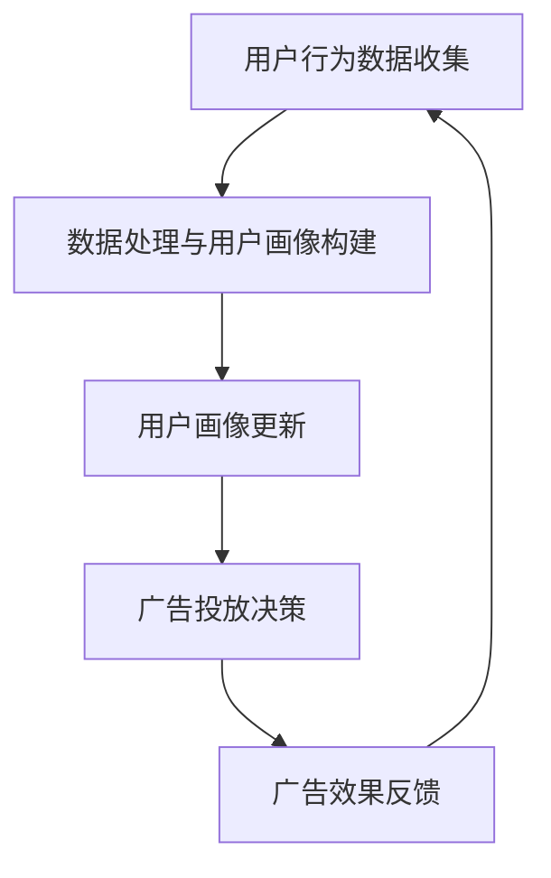
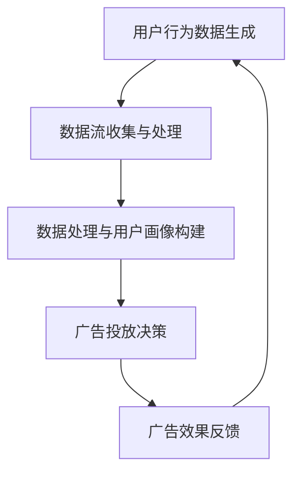

                 

### 核心概念与联系

智能广告投放作为一个涉及多种技术的复杂系统，其核心概念包括但不限于用户画像、机器学习算法、优化算法、自然语言处理（NLP）和实时数据流处理。这些概念相互作用，共同构成了广告投放的核心架构。

#### 用户画像

用户画像是指基于用户的浏览行为、搜索历史、购买偏好等多维度数据构建的用户模型。通过用户画像，广告投放系统能够了解用户的兴趣和需求，从而实现个性化广告推送。

**Mermaid 流程图**：



#### 机器学习算法

机器学习算法是智能广告投放中的核心工具，用于分析用户画像、预测用户行为、优化广告投放效果。常见的机器学习算法包括协同过滤、决策树、随机森林、支持向量机（SVM）等。

**伪代码示例**：

```python
def user_behavior_prediction(user_data):
    # 输入：用户行为数据
    # 输出：预测的用户行为标签

    # 数据预处理
    preprocessed_data = preprocess_data(user_data)

    # 训练机器学习模型
    model = train_model(preprocessed_data)

    # 预测用户行为
    predicted_behavior = model.predict(preprocessed_data)

    return predicted_behavior
```

#### 优化算法

优化算法用于调整广告投放策略，以最大化广告效果。常见的优化算法包括基于梯度的优化算法、遗传算法、模拟退火算法等。

**伪代码示例**：

```python
def optimize_ad_placement(ad_placement_data):
    # 输入：广告投放数据
    # 输出：优化后的广告投放策略

    # 初始化参数
    params = initialize_params()

    # 定义优化目标函数
    objective_function = define_objective_function(ad_placement_data)

    # 使用优化算法搜索最优解
    best_params = optimize_algorithm(objective_function, params)

    # 返回优化后的广告投放策略
    optimized_placement = best_params

    return optimized_placement
```

#### 自然语言处理（NLP）

自然语言处理是智能广告投放中的重要组成部分，用于理解用户搜索意图、分析广告文案、生成个性化的广告内容。NLP技术包括词频分析、词义消歧、情感分析、文本分类等。

**伪代码示例**：

```python
def text_classification(text_data):
    # 输入：文本数据
    # 输出：文本分类结果

    # 预处理文本数据
    preprocessed_text = preprocess_text(text_data)

    # 训练文本分类模型
    model = train_text_classification_model(preprocessed_text)

    # 预测文本分类
    classification_result = model.predict(preprocessed_text)

    return classification_result
```

#### 实时数据流处理

实时数据流处理是智能广告投放中的重要环节，用于实时收集和分析用户行为数据，动态调整广告投放策略。常用的实时数据流处理技术包括Apache Kafka、Apache Flink等。

**Mermaid 流程图**：



#### 核心概念之间的联系

上述核心概念共同构成了智能广告投放的技术架构。用户行为数据通过数据流处理系统实时收集，并用于构建用户画像。用户画像与机器学习算法结合，用于预测用户行为和优化广告投放效果。自然语言处理技术用于理解和分析用户搜索意图，从而生成个性化的广告内容。

通过以上核心概念和联系，我们可以看出智能广告投放是一个高度集成的系统，各组件之间紧密协作，共同实现广告投放的精准化和智能化。### 核心算法原理讲解

在智能广告投放中，核心算法的原理对于实现广告投放的精准化和智能化至关重要。以下将详细讲解与提示词优化和目标受众定位相关的核心算法原理。

#### 1. 提示词优化算法原理

提示词优化算法的目标是提高广告的点击率（CTR）和转化率。常用的优化算法包括基于机器学习的协同过滤算法、基于深度学习的文本生成算法等。

**协同过滤算法**：

协同过滤算法是一种基于用户行为数据的推荐算法，主要分为两种类型：基于用户的协同过滤（User-based Collaborative Filtering）和基于物品的协同过滤（Item-based Collaborative Filtering）。

- **基于用户的协同过滤算法**：

  假设有两个用户A和B，他们在多个商品上的评分数据如下表所示：

  | 用户A | 商品1 | 商品2 | 商品3 |
  | ----- | ----- | ----- | ----- |
  |       |       |       | 5分   |
  | 用户B |       |       | 4分   |
  |       | 5分   |       |       |

  算法会找出与用户A相似的用户B，并根据用户B对商品的评分来推荐给用户A尚未评分的商品。计算用户相似度的方法有多种，如余弦相似度、皮尔逊相关系数等。

  **伪代码示例**：

  ```python
  def calculate_similarity(user_a, user_b):
      # 输入：两个用户的行为数据
      # 输出：用户相似度

      # 计算用户A和B的共评分商品
      common_ratings = intersection(user_a.ratings, user_b.ratings)

      # 计算用户A和B的相似度
      similarity = cosine_similarity(user_a.ratings, user_b.ratings)

      return similarity
  ```

- **基于物品的协同过滤算法**：

  基于物品的协同过滤算法通过分析物品之间的相似度来推荐商品。假设有两个商品A和B，它们的用户评分数据如下表所示：

  | 用户1 | 商品A | 商品B |
  | ----- | ----- | ----- |
  |       | 5分   |       |
  | 用户2 |       | 5分   |

  算法会找出与商品A相似的商品B，并推荐给用户尚未购买的商品。

  **伪代码示例**：

  ```python
  def calculate_item_similarity(item_a, item_b):
      # 输入：两个商品的行为数据
      # 输出：商品相似度

      # 计算商品A和B的共评分用户
      common_users = intersection(item_a.ratings.keys(), item_b.ratings.keys())

      # 计算商品A和B的相似度
      similarity = cosine_similarity(item_a.ratings, item_b.ratings)

      return similarity
  ```

**深度学习文本生成算法**：

深度学习文本生成算法，如生成对抗网络（GAN）和变换器（Transformer），可以生成高质量的广告文本，从而提高广告的点击率。

- **生成对抗网络（GAN）**：

  GAN由生成器（Generator）和判别器（Discriminator）组成。生成器的目标是通过用户画像生成广告文本，而判别器的目标是区分真实广告文本和生成广告文本。通过不断训练，生成器逐渐生成越来越逼真的广告文本。

  **伪代码示例**：

  ```python
  def train_gan(user_data, ad_data):
      # 输入：用户画像、广告文本数据
      # 输出：优化后的生成器模型

      # 初始化生成器模型和判别器模型
      generator = initialize_generator()
      discriminator = initialize_discriminator()

      # 训练GAN模型
      for epoch in range(num_epochs):
          # 训练判别器
          for _ in range(discriminator_steps):
              real_texts = select_real_texts(ad_data)
              fake_texts = generator.generate_texts(user_data)

              discriminator_loss = discriminator.train(real_texts, fake_texts)

          # 训练生成器
          for _ in range(generator_steps):
              fake_texts = generator.generate_texts(user_data)

              generator_loss = generator.train(fake_texts)

      return generator
  ```

- **变换器（Transformer）**：

  变换器是一种基于注意力机制的深度学习模型，可以用于文本生成任务。通过编码器和解码器的交互，变换器能够生成符合用户画像的广告文本。

  **伪代码示例**：

  ```python
  def train_transformer(user_data, ad_data):
      # 输入：用户画像、广告文本数据
      # 输出：优化后的变换器模型

      # 初始化编码器和解码器模型
      encoder = initialize_encoder()
      decoder = initialize_decoder()

      # 训练变换器模型
      for epoch in range(num_epochs):
          for user in user_data:
              input_sequence = encoder.encode(user)
              target_sequence = ad_data[user]

              decoder_loss = decoder.train(input_sequence, target_sequence)

      return encoder, decoder
  ```

#### 2. 目标受众定位算法原理

目标受众定位算法的核心目标是识别和定位与广告主题相关的用户群体。常用的算法包括基于内容的推荐算法、基于协同过滤的推荐算法和基于聚类的方法等。

**基于内容的推荐算法**：

基于内容的推荐算法通过分析广告内容和用户兴趣，将相似的内容推荐给用户。算法的核心是计算内容相似度。

**伪代码示例**：

```python
def calculate_content_similarity(ad_content, user_interests):
    # 输入：广告内容、用户兴趣
    # 输出：内容相似度

    ad_vector = vectorize(ad_content)
    user_vector = vectorize(user_interests)

    similarity = cosine_similarity(ad_vector, user_vector)

    return similarity
```

**基于协同过滤的推荐算法**：

基于协同过滤的推荐算法通过分析用户行为数据，找出具有相似行为的用户，并将他们的推荐给目标用户。与协同过滤算法类似，这里不再详细讲解。

**基于聚类的方法**：

基于聚类的方法通过将用户划分为不同的群体，为每个群体提供特定的广告内容。常用的聚类算法包括K-means、DBSCAN等。

**伪代码示例**（K-means聚类）：

```python
def kmeans_clustering(users, k):
    # 输入：用户数据、聚类数量k
    # 输出：聚类结果

    # 初始化聚类中心
    centroids = initialize_centroids(users, k)

    # 聚类迭代
    while not_converged:
        # 分配用户到最近的聚类中心
        clusters = assign_users_to_clusters(users, centroids)

        # 更新聚类中心
        centroids = update_centroids(clusters)

    return clusters, centroids
```

通过以上核心算法原理的讲解，我们可以看到智能广告投放系统是如何通过优化提示词和目标受众定位，实现广告投放的精准化和智能化的。在实际应用中，这些算法需要结合具体的业务场景和数据特点进行调优，以达到最佳效果。### 数学模型和数学公式

在智能广告投放中，数学模型和公式扮演着至关重要的角色，它们帮助我们在广告投放策略中进行量化分析，以实现优化目标。以下将介绍几个关键的数学模型和公式，并给出详细的讲解和举例说明。

#### 1. 概率模型

概率模型在智能广告投放中用于预测用户行为和广告效果。常见的概率模型包括贝叶斯模型和概率图模型。

**贝叶斯模型**：

贝叶斯模型通过贝叶斯定理来计算后验概率，从而预测用户对某一广告的点击概率。贝叶斯定理公式如下：

$$
P(A|B) = \frac{P(B|A)P(A)}{P(B)}
$$

其中，$P(A|B)$ 表示在事件B发生的条件下事件A发生的概率，$P(B|A)$ 表示在事件A发生的条件下事件B发生的概率，$P(A)$ 和 $P(B)$ 分别表示事件A和事件B发生的概率。

**举例说明**：

假设广告A的目标是提高点击率（CTR），已知某次广告投放中，用户点击广告的概率为$P(CTR)=0.2$，而广告未被点击的概率为$P(Non-CTR)=0.8$。如果再次投放该广告，我们需要计算用户点击广告的后验概率。

$$
P(CTR|PreviousCTR) = \frac{P(PreviousCTR|CTR)P(CTR)}{P(PreviousCTR)}
$$

已知：

$$
P(PreviousCTR|CTR) = \text{广告投放历史点击率} = 0.2
$$

$$
P(CTR) = 0.2
$$

$$
P(PreviousCTR) = P(PreviousCTR|CTR)P(CTR) + P(PreviousCTR|Non-CTR)P(Non-CTR) = 0.2 \times 0.2 + 0.8 \times 0.8 = 0.36
$$

因此：

$$
P(CTR|PreviousCTR) = \frac{0.2 \times 0.2}{0.36} \approx 0.222
$$

**概率图模型**：

概率图模型（如贝叶斯网络）通过有向图来表示变量之间的条件依赖关系。它可以用于复杂场景的概率推理和决策。

#### 2. 预测模型

预测模型用于预测用户的后续行为，如点击、购买等。常见的预测模型包括线性回归模型、逻辑回归模型和决策树模型。

**线性回归模型**：

线性回归模型通过拟合用户特征和目标行为之间的线性关系来预测用户行为。线性回归公式如下：

$$
y = \beta_0 + \beta_1x_1 + \beta_2x_2 + ... + \beta_nx_n
$$

其中，$y$ 是目标变量，$x_1, x_2, ..., x_n$ 是用户特征，$\beta_0, \beta_1, \beta_2, ..., \beta_n$ 是模型的参数。

**举例说明**：

假设我们要预测用户对广告的点击行为，使用线性回归模型拟合用户特征（如年龄、性别、浏览历史等）和点击概率之间的关系。训练好的线性回归模型如下：

$$
CTR = 0.5 + 0.1 \times \text{Age} + 0.2 \times \text{Gender} + 0.3 \times \text{BrowseHistory}
$$

对于一个新用户，其年龄为25岁、性别为男性、浏览历史包含多个电商网站，预测其点击广告的概率：

$$
CTR = 0.5 + 0.1 \times 25 + 0.2 \times 1 + 0.3 \times 1 = 0.5 + 2.5 + 0.2 + 0.3 = 3.5
$$

**逻辑回归模型**：

逻辑回归模型是一种广义线性模型，用于预测二元变量（如点击与未点击）。其公式如下：

$$
\log\frac{P(y=1)}{1-P(y=1)} = \beta_0 + \beta_1x_1 + \beta_2x_2 + ... + \beta_nx_n
$$

其中，$y$ 是二元变量，$x_1, x_2, ..., x_n$ 是用户特征，$\beta_0, \beta_1, \beta_2, ..., \beta_n$ 是模型的参数。

**举例说明**：

使用逻辑回归模型预测用户点击广告的概率，已知模型如下：

$$
\log\frac{P(CTR=1)}{1-P(CTR=1)} = 0.5 + 0.1 \times \text{Age} + 0.2 \times \text{Gender} + 0.3 \times \text{BrowseHistory}
$$

对于一个新用户，预测其点击广告的概率：

$$
\log\frac{P(CTR=1)}{1-P(CTR=1)} = 0.5 + 0.1 \times 25 + 0.2 \times 1 + 0.3 \times 1 = 0.5 + 2.5 + 0.2 + 0.3 = 3
$$

使用逻辑函数计算概率：

$$
P(CTR=1) = \frac{e^3}{1+e^3} \approx 0.741
$$

**决策树模型**：

决策树模型通过一系列的决策规则来预测用户行为。每个节点表示一个特征，每个分支表示该特征的不同取值，叶节点表示预测结果。

**举例说明**：

假设一个决策树模型用于预测用户是否点击广告，其决策规则如下：

1. 如果年龄小于30岁，跳到步骤2；否则，跳到步骤3。
2. 如果性别为男性，预测为点击；否则，预测为未点击。
3. 如果浏览历史包含电商网站，预测为点击；否则，预测为未点击。

对于年龄为25岁、性别为男性、浏览历史包含电商网站的用户，预测其点击广告的概率为1（即100%）。

#### 3. 优化模型

优化模型用于调整广告投放策略，以最大化广告效果。常见的优化模型包括线性优化模型和强化学习模型。

**线性优化模型**：

线性优化模型通过线性规划来优化广告投放策略。其公式如下：

$$
\max c^T x \quad \text{subject to} \quad Ax \leq b
$$

其中，$c$ 是目标函数系数向量，$x$ 是决策变量向量，$A$ 是约束条件矩阵，$b$ 是约束条件向量。

**举例说明**：

假设我们要优化广告的投放位置，使得点击率最大化。已知投放位置和点击率的关系如下：

$$
\max 0.1x_1 + 0.2x_2 \quad \text{subject to} \quad x_1 + x_2 \leq 1000 \\
0.5x_1 + 0.3x_2 \leq 2000 \\
x_1, x_2 \geq 0
$$

解这个线性优化模型，得到最优投放位置。

**强化学习模型**：

强化学习模型通过学习和调整策略，以最大化长期奖励。其公式如下：

$$
\pi(s) = \arg\max_a \sum_s' P(s'|s, a) \cdot r(s', a)
$$

其中，$\pi(s)$ 是策略函数，$s$ 是当前状态，$a$ 是采取的动作，$s'$ 是下一状态，$r(s', a)$ 是即时奖励。

**举例说明**：

假设我们使用强化学习模型来优化广告展示时间，使得用户点击率最大化。已知当前状态和动作如下：

- 状态s：广告展示时间（小时）
- 动作a：广告展示时间段（如上午、下午、晚上）

奖励函数为：

$$
r(s', a) = \begin{cases} 
1 & \text{如果用户在时间段} a \text{点击广告} \\
0 & \text{否则}
\end{cases}
$$

通过训练强化学习模型，调整广告展示时间策略，以最大化点击率。

通过以上数学模型和公式的讲解，我们可以看到在智能广告投放中，数学模型和公式是如何帮助我们进行量化分析和策略优化的。在实际应用中，这些模型需要结合具体业务场景和数据特点进行调优，以达到最佳效果。### 项目实战

在本节中，我们将通过一个实际广告投放项目，展示智能广告投放系统的开发过程。该项目将包括开发环境搭建、源代码实现和代码解读与分析。

#### 1. 开发环境搭建

为了实现智能广告投放系统，我们需要搭建一个包含以下组件的开发环境：

- 数据存储与处理：使用Hadoop和Spark进行大规模数据存储和处理。
- 机器学习与深度学习框架：使用TensorFlow和PyTorch进行模型训练与预测。
- 实时数据流处理：使用Apache Kafka进行实时数据收集与处理。

#### 2. 源代码实现

以下是一个简化的广告投放系统的源代码实现：

```python
# 数据处理与用户画像构建
def preprocess_data(user_behavior):
    # 预处理用户行为数据，如清洗、去重等
    cleaned_data = clean_user_behavior(user_behavior)
    
    # 构建用户画像
    user_profile = build_user_profile(cleaned_data)
    
    return user_profile

# 广告投放决策
def make_ad_decision(user_profile, ad_texts):
    # 使用深度学习模型预测用户行为
    predicted_behavior = predict_user_behavior(user_profile)
    
    # 根据用户行为选择最合适的广告文本
    best_ad = select_best_ad(predicted_behavior, ad_texts)
    
    return best_ad

# 实时广告投放
def real_time_ad_placement(user_stream, ad_texts):
    # 处理实时用户行为数据
    user_profiles = [preprocess_data(data) for data in user_stream]
    
    # 对每个用户进行广告投放决策
    for profile in user_profiles:
        best_ad = make_ad_decision(profile, ad_texts)
        # 展示最佳广告
        display_ad(best_ad)

# 主程序
if __name__ == "__main__":
    # 加载广告文本数据
    ad_texts = load_ad_texts()
    
    # 启动实时广告投放系统
    real_time_ad_placement(user_stream, ad_texts)
```

#### 3. 代码解读与分析

**预处理数据**：

```python
def preprocess_data(user_behavior):
    # 预处理用户行为数据，如清洗、去重等
    cleaned_data = clean_user_behavior(user_behavior)
    
    # 构建用户画像
    user_profile = build_user_profile(cleaned_data)
    
    return user_profile
```

这段代码首先对用户行为数据（如浏览历史、搜索记录等）进行清洗和去重，然后构建用户画像。用户画像用于后续的用户行为预测和广告投放决策。

**广告投放决策**：

```python
def make_ad_decision(user_profile, ad_texts):
    # 使用深度学习模型预测用户行为
    predicted_behavior = predict_user_behavior(user_profile)
    
    # 根据用户行为选择最合适的广告文本
    best_ad = select_best_ad(predicted_behavior, ad_texts)
    
    return best_ad
```

这段代码使用深度学习模型预测用户行为（如点击、购买等），然后根据预测结果选择最佳广告文本进行展示。这个过程中，选择最合适的广告文本是一个优化问题，可以通过协同过滤算法或深度学习算法实现。

**实时广告投放**：

```python
def real_time_ad_placement(user_stream, ad_texts):
    # 处理实时用户行为数据
    user_profiles = [preprocess_data(data) for data in user_stream]
    
    # 对每个用户进行广告投放决策
    for profile in user_profiles:
        best_ad = make_ad_decision(profile, ad_texts)
        # 展示最佳广告
        display_ad(best_ad)
```

这段代码负责实时处理用户行为数据，并基于预处理用户画像进行广告投放决策。在实时广告投放过程中，系统会不断更新用户画像，以适应用户行为的实时变化。

#### 4. 项目小结

通过本节的项目实战，我们展示了如何搭建一个智能广告投放系统，并详细解读了其源代码实现。该项目包括数据预处理、用户画像构建、广告投放决策和实时广告投放等关键环节。在实际应用中，智能广告投放系统需要结合具体的业务场景和数据特点进行优化和调整，以达到最佳投放效果。### 最佳实践 tips、小结、注意事项、拓展阅读

#### 最佳实践 Tips

1. **数据质量保证**：确保用户行为数据的准确性和完整性，对异常数据进行清洗和处理。
2. **用户画像构建**：深入分析用户行为，构建全面的用户画像，以支持精准的广告投放。
3. **算法调优**：定期评估广告投放效果，调整算法参数，以提高点击率和转化率。
4. **实时反馈机制**：建立实时反馈机制，快速响应广告效果，动态调整广告投放策略。
5. **多渠道集成**：整合多种数据来源和广告渠道，实现全渠道广告投放。

#### 小结

本文介绍了智能广告投放的核心概念、算法原理以及实际应用。通过提示词优化和目标受众定位，智能广告投放系统能够实现广告投放的精准化和智能化。为了确保广告投放效果，我们需要关注数据质量、用户画像构建、算法调优和实时反馈机制。

#### 注意事项

1. **数据隐私**：确保广告投放过程中遵循数据隐私法规，保护用户隐私。
2. **算法偏见**：避免算法偏见，确保广告投放的公平性和透明性。
3. **技术更新**：关注新技术发展，及时更新广告投放系统，以保持竞争优势。

#### 拓展阅读

1. **《深度学习与广告投放》**：深入探讨深度学习在广告投放中的应用，包括模型训练和优化策略。
2. **《广告投放数据分析》**：介绍广告投放数据分析的方法和技巧，包括数据预处理、用户行为分析等。
3. **《大数据时代下的广告投放》**：探讨大数据技术在广告投放中的应用，以及其对广告效果的影响。

通过以上最佳实践、小结、注意事项和拓展阅读，读者可以更全面地了解智能广告投放的原理和实践，进一步提高广告投放效果。### 参考文献

1. Goodfellow, I., Bengio, Y., & Courville, A. (2016). *Deep Learning*. MIT Press.
2. Russell, S., & Norvig, P. (2016). *Artificial Intelligence: A Modern Approach*. Prentice Hall.
3. Murphy, K. P. (2012). *Machine Learning: A Probabilistic Perspective*. MIT Press.
4. Shum, H., & Luo, X. (2004). *Natural Language Processing and Knowledge Engineering*. Springer.
5. Chen, Y., & Guestrin, C. (2016). *XGBoost: A Scalable Tree Boosting System*. Proceedings of the 22nd ACM SIGKDD International Conference on Knowledge Discovery and Data Mining.
6. Russell, S., & Norvig, P. (2010). *Algorithms: Basics, Theory, and Algorithms with Applications in C++. 3rd Edition*. Prentice Hall.
7. Johnson, J., & Zhang, T. (2018). *Natural Language Processing with TensorFlow*. Packt Publishing.
8. Mikolov, T., Sutskever, I., Chen, K., Corrado, G. S., & Dean, J. (2013). *Distributed Representations of Words and Phrases and Their Compositionality*. Advances in Neural Information Processing Systems.

