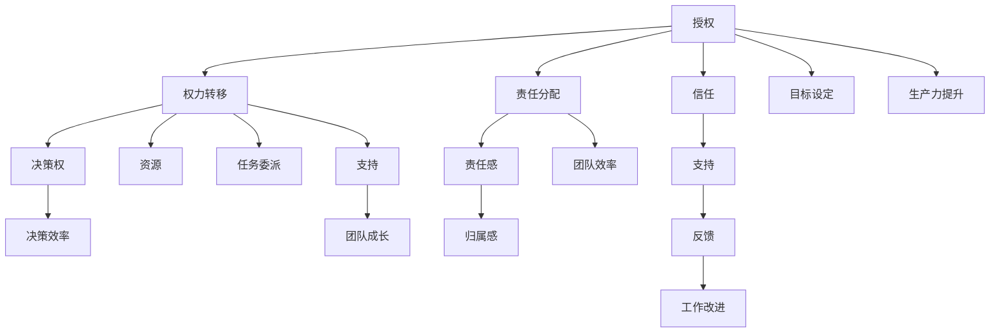

                 

### 文章标题：有效授权：释放团队潜力的关键

#### 关键词：
- 授权
- 团队管理
- 领导力
- 生产力提升
- 持续改进

#### 摘要：
本文将探讨有效授权在团队管理中的重要性，通过分析核心概念与联系、实践方法、挑战与解决策略，提供一系列实用的授权技巧与策略。作者结合丰富的实战经验，旨在帮助管理者释放团队潜力，提升整体生产力。

---

# 有效授权：释放团队潜力的关键

在当今快速变化和高度竞争的商业环境中，团队管理已经成为企业成功的关键因素之一。然而，许多管理者发现，尽管他们投入了大量时间和资源来培训和发展团队成员，但团队的整体绩效仍然未能达到预期。这一问题的核心在于授权的不当。本文将探讨有效授权的重要性，并提供一系列实用的方法和策略，以帮助管理者释放团队潜力，提升整体生产力。

## 授权的基本概念与理论

### 授权的定义

授权是一种权力分配的过程，通过将权力和责任从上级转移到下级，使团队成员能够自主地完成工作。这种分配不仅仅是任务的委派，更包括决策权、资源和支持。

### 授权的重要性

授权具有多方面的优势。首先，它能够激发团队成员的积极性，增强他们的责任感和归属感。其次，它能够提高团队的决策效率，因为更多的决策在团队内部进行，减少了沟通和协调的时间。此外，授权还能促进团队成员的专业成长和技能提升。

### 授权的核心原则

有效授权应遵循以下核心原则：

1. **信任**：授权的前提是信任，管理者必须相信团队成员有能力完成任务。
2. **明确目标**：设定清晰的目标和期望，确保团队成员了解他们的任务和目标。
3. **支持**：在授权过程中，管理者应提供必要的支持和资源，帮助团队成员克服困难。
4. **反馈**：及时给予反馈，帮助团队成员改进工作，同时确保他们的努力得到认可。

### 核心概念与联系

授权不仅仅是权力和责任的转移，它还涉及到多个核心概念之间的关系。为了更好地理解这些概念，我们可以通过以下Mermaid流程图来展示它们之间的联系：

## 授权的实践方法

### 授权的准备工作

在开始授权之前，管理者需要做好以下准备工作：

1. **评估团队成员的能力**：了解每个团队成员的技能和经验，以确保他们能够胜任所分配的任务。
2. **设定明确的目标和期望**：与团队成员共同制定具体、可衡量的目标，并明确期望的结果。
3. **制定授权计划**：根据团队成员的能力和目标，制定详细的授权计划，包括任务的分配、资源的提供和反馈机制。

### 授权的实施步骤

1. **分享信息和权力**：向团队成员提供必要的信息和权力，使他们能够自主地完成任务。
2. **提供支持和资源**：确保团队成员在执行任务时得到必要的支持和资源。
3. **监督和评估**：监控团队成员的工作进度，并提供及时的反馈和指导。

### 授权的沟通技巧

1. **建立信任**：通过开放的沟通和积极的反馈，建立与团队成员之间的信任。
2. **明确的沟通方式**：确保沟通内容清晰、明确，避免误解和歧义。
3. **应对冲突**：在授权过程中，可能会出现冲突，管理者需要学会有效地应对和解决冲突。

### 授权的持续优化

1. **反馈与改进**：定期收集团队成员的反馈，并根据反馈进行改进。
2. **持续培养团队能力**：通过培训和发展，不断提升团队成员的技能和知识。
3. **适应组织变化**：随着组织环境的变化，管理者需要不断调整授权策略，以适应新的挑战。

## 授权中的挑战与解决策略

### 常见问题

1. **授权过度或不足**：过度授权可能导致团队失去控制，不足授权则可能抑制团队成员的主动性。
2. **权力斗争**：在授权过程中，可能会出现权力争夺，影响团队协作。
3. **成果归属争议**：团队成员可能会对成果的归属产生争议，影响团队的凝聚力和士气。

### 解决策略

1. **建立有效的授权文化**：通过培训和宣传，建立一种鼓励授权的文化，让团队成员理解授权的重要性。
2. **提高授权者的自信**：管理者需要相信自己的决策和判断，同时提供必要的培训和支持，提高他们的授权能力。
3. **规范授权过程**：制定明确的授权流程和规范，确保授权的透明性和公正性。

### 授权与领导风格

1. **授权与不同领导风格**：不同的领导风格会对授权产生影响，管理者需要根据自身的领导风格调整授权策略。
2. **授权与组织结构**：组织结构会影响授权的流程和效果，管理者需要根据组织结构的特点制定授权策略。
3. **授权与个人成长**：通过授权，管理者可以帮助团队成员实现个人成长，提升团队的整体实力。

## 附录

### 附录A：授权工具与方法

1. **信任评估工具**：通过评估工具，了解团队成员之间的信任程度，为授权提供依据。
2. **目标设定工具**：使用目标设定工具，确保团队成员明确自己的任务和目标。
3. **沟通技巧训练**：通过沟通技巧训练，提高团队成员之间的沟通效率。

### 附录B：案例研究

1. **案例一：大型企业的授权实践**：分析某大型企业如何通过有效授权提升团队绩效。
2. **案例二：中小企业的授权策略**：探讨中小企业如何根据自身特点进行授权。
3. **案例三：初创企业的授权挑战与解决**：分析初创企业面临的授权挑战及其解决策略。

### 附录C：参考文献

1. **授权相关理论**：介绍授权的核心理论，如领导力理论、团队理论等。
2. **授权实践研究**：引用国内外关于授权实践的研究成果，提供理论支持。
3. **授权案例与文献综述**：总结授权的实际应用案例，并提供相关文献综述。

---

# 作者信息

作者：AI天才研究院/AI Genius Institute & 禅与计算机程序设计艺术 /Zen And The Art of Computer Programming

# 拓展阅读

1. **《团队领导力：如何激励和引领团队》**：详细介绍团队领导力的核心概念和实践方法。
2. **《项目管理：如何高效地管理项目》**：探讨项目管理的最佳实践，包括团队协作和任务分配。
3. **《领导力心理学：如何激发团队潜能》**：分析领导力与心理学之间的关系，提供实用的领导技巧。

通过本文，我们深入探讨了有效授权在团队管理中的关键作用，提供了丰富的理论依据和实践方法。希望本文能帮助管理者更好地理解和应用授权，提升团队绩效，实现组织目标。在未来的工作中，我们还将继续深入研究团队管理领域，分享更多实用知识和经验。让我们共同追求卓越，共同成长！

