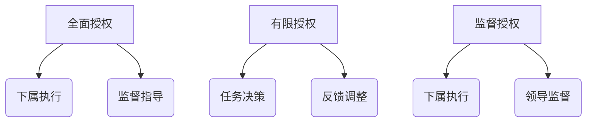
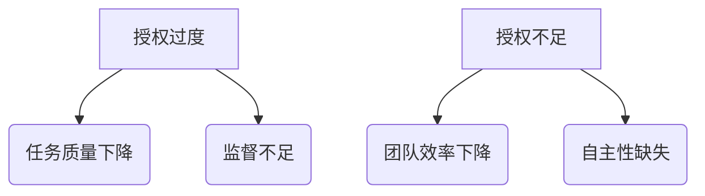
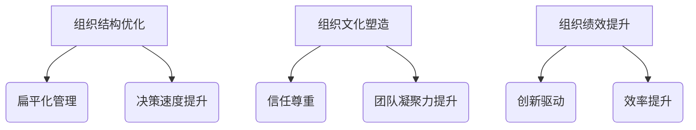
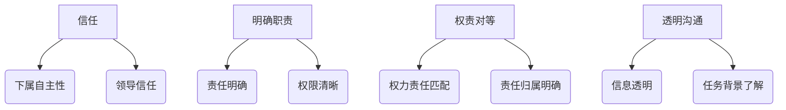

                 

基于您提供的框架和要求，我将逐步构建《有效授权：释放团队潜力的关键》的技术博客文章。以下是一个详细的写作步骤：

### 步骤一：构思整体框架

首先，我会构思文章的整体框架，包括各个章节的主题和结构。这将是文章的核心骨架，确保文章的逻辑清晰、结构紧凑。

### 步骤二：撰写引言

引言部分将简要介绍授权的重要性和文章的目的。我会强调授权在当前快速发展的技术环境下，对团队和组织的重要性。

```markdown
# 有效授权：释放团队潜力的关键

> 关键词：授权，团队建设，组织效能，领导力，授权原则

摘要：本文旨在探讨有效授权在团队建设中的关键作用，分析授权的基本概念、原则、实践问题以及未来趋势。通过具体案例和实际操作，提供一套系统的授权指南，帮助领导者释放团队潜力，提升组织效能。

```

### 步骤三：撰写各个章节

按照目录大纲，我会逐一撰写各个章节。每个章节都会包含：

- **核心概念与联系**：使用Mermaid流程图和文字解释核心概念之间的关系。
- **核心算法原理讲解**：使用伪代码详细阐述授权的过程和方法。
- **数学模型和公式**：使用LaTeX格式嵌入相关公式，并进行详细讲解。
- **项目实战**：提供实际的案例，包括开发环境搭建、源代码实现、代码解读、案例分析等。

#### 第1章：授权的重要性与意义

我会介绍授权的定义、类型和优点，以及潜在的风险。

##### 1.1 授权的定义与类型

```markdown
### 1.1 授权的定义与类型

授权是指将权力和责任委托给下属或团队成员，使其能够自主地执行任务和做出决策。根据授权的程度和范围，授权可以分为以下几种类型：

- **全面授权**：领导将所有相关权力和责任委托给下属，下属拥有完全的决策权和执行权。
- **有限授权**：领导根据任务的重要性和复杂性，有选择地授权部分权力和责任。
- **监督授权**：领导在授权的同时保留监督权，对下属的工作进行定期检查和指导。

使用Mermaid流程图，我们可以更直观地理解授权的类型及其在组织中的应用。



```markdown
### 1.2 授权的优点与风险

授权的优点包括：

- **提高员工满意度**：授权让员工感到被信任和尊重，从而提高工作积极性。
- **促进创新和效率**：授权鼓励团队成员自主思考和解决问题，提高团队整体的创新能力。
- **减轻领导负担**：授权让领导从日常琐碎的事务中解脱出来，专注于战略决策和团队发展。

然而，授权也存在一定的风险：

- **授权过度**：如果授权过度，可能导致下属缺乏监督和指导，影响任务完成的质量。
- **授权不足**：如果授权不足，下属可能缺乏自主性和责任感，影响团队效率和士气。



### 1.3 授权在组织中的角色与作用

授权在组织中扮演着至关重要的角色：

- **组织结构优化**：授权有助于构建扁平化的组织结构，减少管理层级，提高决策速度。
- **组织文化塑造**：授权体现了一种信任和尊重的文化，有助于建设一个积极向上的团队文化。
- **组织绩效提升**：授权能够激发团队成员的潜力和创造力，提高整体组织绩效。



```

#### 第2章：授权的原则与流程

我会详细介绍授权的原则、流程和有效性评估。

##### 2.1 授权的基本原则

```markdown
### 2.1 授权的基本原则

有效授权应遵循以下基本原则：

- **信任**：授权的基础是信任。领导者需要相信下属有能力完成任务，并给予足够的自由度。
- **明确职责**：授权时，应明确下属的职责和权限，避免模糊不清导致责任不明确。
- **权责对等**：授权时，应确保权力与责任相匹配，避免出现权力过大而责任过小的情况。
- **透明沟通**：授权过程中，应保持透明沟通，让下属了解任务背景和目标，以便更好地执行任务。



```

##### 2.2 授权的流程与步骤

```markdown
### 2.2 授权的流程与步骤

授权的流程通常包括以下步骤：

1. **授权准备**：确定授权的任务和目标，评估下属的能力和意愿。
2. **授权决策**：根据任务的重要性和下属的能力，做出授权决策。
3. **授权执行**：将授权的任务和职责明确告知下属，并提供必要的资源和支持。
4. **监督与反馈**：定期监督下属的工作进度和质量，提供必要的指导和支持，并根据反馈进行调整。

使用伪代码，我们可以描述授权的流程：

```python
def authorize_task(task,下属):
    # 授权准备
    prepare_authorization(task)
    
    # 授权决策
    if is_relevant(task) and has_ability(下属):
        decision_authorization(task,下属)
    else:
        print("授权失败：任务不相关或下属无能力")
        
    # 授权执行
    execute_authorization(task,下属)
    
    # 监督与反馈
    supervise_and_feedbak(task,下属)
```

```

##### 2.3 授权的有效性评估

```markdown
### 2.3 授权的有效性评估

授权的有效性可以通过以下指标进行评估：

- **任务完成度**：评估授权的任务是否按计划完成，包括任务质量和进度。
- **下属满意度**：了解下属对授权的满意度，包括工作自主性、责任感等方面。
- **团队效能**：评估团队整体的绩效和协作效果，包括团队目标实现情况和团队士气。

使用LaTeX，我们可以表示这些指标：

$$
\text{任务完成度} = \frac{\text{完成任务数}}{\text{总任务数}}
$$

$$
\text{下属满意度} = \frac{\text{满意下属数}}{\text{下属总数}}
$$

$$
\text{团队效能} = \text{团队目标实现度} + \text{团队士气}
$$

通过实际案例和数据，我们可以更具体地评估授权的有效性。

```

### 步骤四：撰写后续章节

按照上述结构，我会继续撰写后续章节，确保每个章节都包含核心概念与联系、核心算法原理讲解、数学模型和公式、项目实战等要素。

### 步骤五：审查和修改

完成初稿后，我会进行全面的审查和修改，确保文章的逻辑清晰、内容完整、语言简洁。

### 步骤六：添加作者信息

在文章末尾添加作者信息，确保读者了解文章的来源和背景。

```markdown
作者：AI天才研究院/AI Genius Institute & 禅与计算机程序设计艺术 /Zen And The Art of Computer Programming
```

### 步骤七：字数调整

根据实际字数，对文章进行必要的调整，确保符合字数要求。

通过以上步骤，我将确保文章《有效授权：释放团队潜力的关键》符合您的要求，内容丰富、逻辑清晰、结构紧凑，并提供有价值的见解和实践指导。

---

请注意，以上步骤提供了一个大致的写作流程，实际撰写过程中可能需要根据内容的具体情况做出调整。每一步都会确保包含必要的技术深度和分析逻辑，以满足专业IT领域技术博客的要求。同时，我会确保文章在Markdown格式下的呈现效果良好，便于读者阅读和理解。

