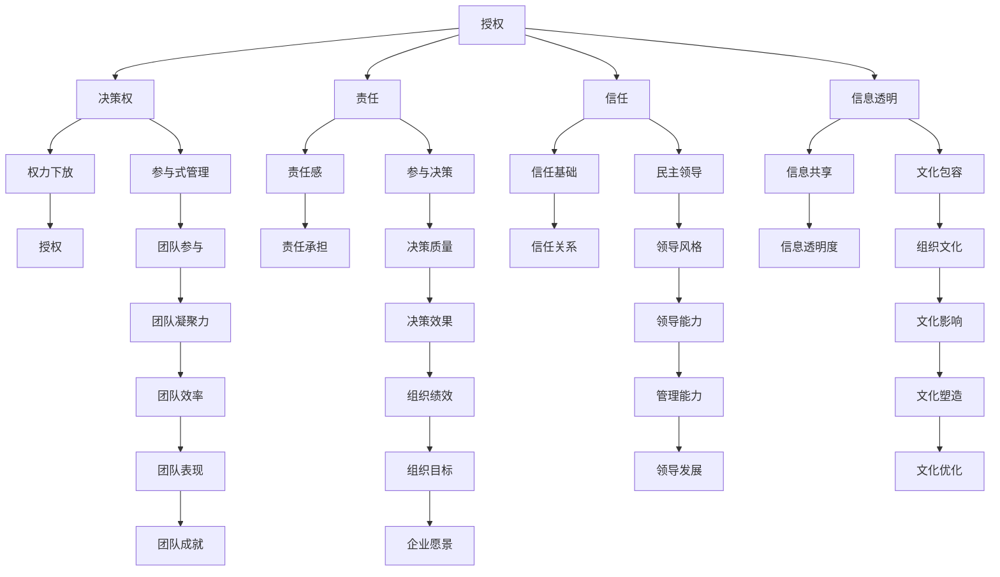

                 

### 1.4 授权在团队管理中的角色

授权在团队管理中扮演着至关重要的角色，它不仅影响着团队成员的工作效率，还直接关联到团队的整体表现和组织的长远发展。有效的授权可以激发团队成员的积极性和创造力，从而提升团队的整体效能。以下是授权在团队管理中的具体角色和影响：

#### 1.4.1 激发员工潜力

授权意味着给予员工更多的自主权和决策权，这可以激发他们的工作热情和创造力。当员工感受到自己的意见和努力受到重视时，他们会更加投入工作，努力实现团队的目标。这种积极性不仅提高了工作效率，还为团队带来了更多的创新想法和解决方案。

#### 1.4.2 提升团队凝聚力

有效的授权能够建立起领导者和团队成员之间的信任关系，增强团队的凝聚力。当团队成员在工作中获得授权并承担责任时，他们会对团队产生更强的归属感和责任感。这种团结协作的氛围有利于团队共同面对挑战，实现共同的目标。

#### 1.4.3 分散管理负担

随着组织规模的扩大，领导者面临的管理任务也越来越繁重。通过授权，领导者可以将部分决策权和责任下放给团队成员，从而减轻自己的工作负担。这不仅有助于领导者专注于更重要的事务，还可以使团队更加高效地运作。

#### 1.4.4 增强团队适应能力

在快速变化的市场环境中，团队需要具备快速适应和调整的能力。通过授权，团队成员能够在日常工作中积累经验和知识，提高团队的整体适应能力。这种能力可以帮助团队在面临不确定性和挑战时，更加灵活地应对，从而保持竞争优势。

#### 1.4.5 促进员工成长与发展

授权不仅能够提高员工的工作能力，还可以促进他们的个人成长和发展。当员工被赋予更多的责任和机会时，他们会通过实践和学习不断提升自己的技能和知识。这种成长不仅对个人有利，也为组织培养了更多具备高素质和专业技能的员工。

#### 1.4.6 提高决策质量

授权使得团队成员能够在其专业领域内做出决策，这有助于提高决策的质量。团队成员对特定领域有更深入的了解和经验，他们的决策往往更加准确和有效。此外，多角度的决策过程可以减少错误和偏见，提高决策的全面性和科学性。

综上所述，授权在团队管理中具有多重作用和深远影响。通过有效授权，领导者可以激发员工潜力，提升团队凝聚力，分散管理负担，增强团队适应能力，促进员工成长，以及提高决策质量。这些因素共同作用，有助于实现团队的长期发展和组织的整体成功。

### 1.5 授权的核心概念与关系架构

在深入探讨授权的实践与应用之前，有必要明确授权的核心概念及其相互之间的关系。授权不仅仅是一种管理工具，更是一种管理理念和哲学。以下是授权的核心概念及其相互联系：

#### 1.5.1 授权的定义

授权（Delegation）是指领导者将决策权、责任和资源分配给团队成员，使其能够自主决策并承担相应责任的过程。授权的核心在于信任和权力下放，旨在提高团队效率和员工积极性。

#### 1.5.2 授权的要素

授权的要素包括但不限于以下几点：

1. **决策权**：授权的本质是赋予团队成员决策权，使其能够在其职责范围内做出决策。
2. **责任**：授权伴随着责任，团队成员在获得决策权的同时，也需承担相应的责任。
3. **信任**：信任是授权的基础，领导者需要信任团队成员的能力和判断，以便他们能够有效行使决策权。
4. **信息透明**：为了使授权有效，信息透明至关重要。团队成员需要获得足够的信息和数据，以便做出明智的决策。

#### 1.5.3 授权与权力下放的差异

授权和权力下放（Empowerment）是两个相关但不同的概念。权力下放是指将权力分配给下属，而授权则是将决策权和责任明确分配给特定的人员。授权更强调信任和责任感，而权力下放可能更多地涉及资源分配。

#### 1.5.4 授权与参与式管理

参与式管理（Participative Management）是授权的一种形式，它强调团队成员参与决策过程。参与式管理有助于提高员工的参与感和归属感，从而增强团队的凝聚力。授权与参与式管理的结合可以最大化地发挥团队成员的潜力，提高决策的质量和团队的执行力。

#### 1.5.5 授权与领导风格

授权与领导风格密切相关。不同的领导风格对授权的影响不同。例如，民主型领导风格倾向于鼓励团队成员参与决策，这有助于授权的实施。而权威型领导风格则可能限制授权的广度和深度。

#### 1.5.6 授权与组织文化

组织文化对授权的接受程度和实施效果有着重要影响。一个开放、包容、鼓励创新和自主性的组织文化有利于授权的实施。相反，一个过于官僚、控制严格的文化可能会阻碍授权的推进。

为了更直观地展示授权的核心概念及其相互关系，我们可以使用Mermaid流程图来描述：



通过以上流程图，我们可以清晰地看到授权的核心概念及其相互之间的关系，这有助于我们更好地理解授权的内涵和实践。

### 1.6 授权的心理学原理

授权不仅仅是领导者的管理行为，更是一种心理学的应用。理解授权的心理学原理对于实现有效的授权至关重要。以下从几个关键角度探讨授权的心理学原理：

#### 1.6.1 信任与授权

信任是授权的基石。领导者必须信任团队成员的能力和判断力，以便他们能够有效行使被赋予的决策权。心理学研究表明，信任能够显著提升员工的动机和满意度。当员工感受到领导的信任时，他们更有可能投入更多精力去完成任务，并愿意承担更多责任。

#### 1.6.2 自主性与责任感

授权的核心在于赋予员工自主性，让他们在决策过程中拥有更多的自由。心理学理论指出，自主性能够激发员工的内在动机，提高工作满意度和绩效。同时，授权还伴随着责任感，这要求员工对其决策和行动负责。责任感能够增强员工的自我效能感，促使他们更加专注和努力地工作。

#### 1.6.3 期望效应

期望效应（Pygmalion Effect）是指领导者的期望对员工行为和表现产生的影响。当领导者对员工抱有积极的期望时，员工更有可能表现出高水平的绩效。在授权过程中，领导者通过明确的期望传达对团队成员的信任和期望，能够激励员工充分发挥其潜能。

#### 1.6.4 群体动力

群体动力是影响授权效果的一个重要因素。在一个协作的团队中，成员之间的相互信任和协作能够增强授权的有效性。心理学研究表明，群体动力有助于形成积极的工作氛围，减少团队内的冲突和摩擦，从而提高团队的整体效能。

#### 1.6.5 领导风格与授权

不同的领导风格对授权的效果有不同的影响。心理学家赫赛和布兰查德提出的领导风格理论指出，民主型领导风格更有利于授权的实施。在这种风格下，领导者鼓励团队成员参与决策过程，给予他们更多的自主权。相反，权威型领导风格可能限制员工的自主性，阻碍授权的推进。

#### 1.6.6 心理安全感

心理安全感是员工在工作中感到安全和被接纳的程度。当员工感受到心理安全感时，他们更愿意尝试新事物，承担更多责任。在授权过程中，领导者需要营造一个支持性的环境，让员工感到被尊重和信任，从而增强心理安全感。

综上所述，授权的心理学原理涉及信任、自主性、期望效应、群体动力、领导风格和心理安全感等多个方面。领导者需要理解和应用这些原理，以实现有效的授权。通过建立信任、提供自主性、设定明确期望、促进群体动力和营造心理安全感，领导者可以激发团队成员的潜力，提高团队的整体效能。

### 1.7 授权的组织学原理

授权不仅是心理学层面的应用，还涉及到组织结构和流程设计等组织学原理。以下从几个关键角度探讨授权的组织学原理，并解释如何通过组织设计实现有效授权：

#### 1.7.1 权力结构

权力结构是组织内部权力分配和流动的方式。有效的授权需要清晰明确的权力结构，以便团队成员知道谁有权做出决策，以及在什么情况下可以行使决策权。例如，组织可以采用矩阵式结构，将决策权分配给不同职能部门的负责人，从而实现跨部门协作和资源整合。

#### 1.7.2 职责划分

职责划分是授权的重要基础。明确团队成员的职责和权限有助于确保授权的有效性。领导者需要制定详细的职责说明，明确每个岗位的职责范围和决策权限。此外，职责划分还需要考虑团队成员的技能和能力，确保他们能够承担被赋予的责任。

#### 1.7.3 沟通机制

沟通机制是授权过程中不可或缺的一部分。有效的沟通机制有助于团队成员之间传递信息、协调行动和分享知识。领导者可以建立定期的沟通会议、工作坊和团队建设活动，以增强团队成员之间的沟通和协作。此外，现代技术工具，如即时通讯软件和项目管理平台，也有助于提升沟通效率。

#### 1.7.4 资源配置

资源配置是授权成功的关键因素之一。领导者需要确保团队成员能够获得足够的资源，包括人力、财力和技术支持，以便他们能够有效地履行职责。合理的资源配置可以提高团队成员的工作效率和创新能力，从而实现更好的授权效果。

#### 1.7.5 组织文化

组织文化对授权的实施具有重要影响。一个开放、包容和创新的组织文化有利于授权的实施。领导者可以通过制定明确的价值观和行为准则，倡导自主性和责任感，营造一个支持授权的文化氛围。此外，领导者还需要通过培训和文化传承，提高员工对授权的理解和认同。

#### 1.7.6 领导者的角色

领导者在授权过程中的角色至关重要。领导者不仅是授权的发起者，还是授权的监督者和支持者。在授权过程中，领导者需要及时提供指导和支持，帮助团队成员克服困难，确保授权目标的实现。此外，领导者还需要对授权效果进行评估和反馈，以持续改进授权策略。

#### 1.7.7 组织适应性

授权需要与组织的适应性相结合。在快速变化的市场环境中，组织需要具备快速适应和调整的能力。领导者可以通过授权，使团队在变化中保持灵活性和敏捷性。例如，在应对突发事件或市场变化时，领导者可以迅速调整团队成员的职责和权限，以确保组织能够及时响应。

综上所述，授权的组织学原理涉及权力结构、职责划分、沟通机制、资源配置、组织文化、领导者的角色和组织适应性等多个方面。通过合理设计组织结构和流程，建立有效的沟通机制和资源支持，以及营造支持授权的文化氛围，领导者可以实现对团队成员的有效授权，提高团队的整体效能和创新能力。

### 第2章 授权的基础理论

#### 2.1 授权的定义与核心要素

授权（Delegation）是一种管理行为，涉及将决策权、责任和资源从上级转移到下级的过程。授权不仅仅是简单的任务分配，它还包括对下级能力的信任和对其行为的期望。以下是授权的定义及其核心要素：

**定义**：授权是指上级将任务、决策权和相应的责任授予下级，使其能够在上级的监督下自主完成任务的过程。

**核心要素**：

1. **决策权**：授权赋予下级在特定范围内做出决策的权利。这意味着下级有权根据自己的判断和专业知识来解决问题，而不必事事向上级请示。

2. **责任**：授权伴随着责任，下级在接受任务和决策权的同时，也需要对其行为和结果负责。这种责任不仅包括完成任务的质量，还涉及可能出现的失误和问题。

3. **信任**：信任是授权的基础。上级必须信任下级的能力和判断，否则授权将无法有效实施。信任建立在相互了解和尊重的基础上，上级需要对下级的能力和潜力有充分的信心。

4. **支持**：授权不仅仅是将决策权和责任赋予下级，上级还需要提供必要的支持，包括资源、信息和培训。这种支持有助于下级更好地完成任务。

#### 2.2 授权的类型与形式

授权可以分为多种类型和形式，每种类型和形式都有其特定的应用场景和特点。以下是几种常见的授权类型：

1. **直接授权**：这是最常见的一种授权形式，上级明确地将决策权和责任授予下级。下级在授权范围内完全自主决策和执行任务。

2. **部分授权**：上级将决策权的一部分授予下级，而另一部分保留在自己的控制之下。这种形式适用于需要对关键决策进行审核和批准的情况。

3. **垂直授权**：上级将决策权逐级下放，每个下级只能在其直接上级授权的范围内做出决策。这种形式有助于明确职责和权限，避免决策权的重叠和混乱。

4. **水平授权**：多个同级成员共同享有决策权，他们可以相互协作，共同完成任务。这种形式有助于提高团队协作和创新能力。

5. **临时授权**：在特定情况下，上级将决策权临时授予下级，以应对紧急情况或特殊任务。这种授权通常有时间限制，一旦情况稳定或任务完成，决策权将回归上级。

6. **任务授权**：针对特定任务或项目，上级将决策权和责任授予一个临时团队或项目小组。这种形式有助于集中资源和精力，高效完成特定任务。

#### 2.3 授权的重要性与优势

授权对团队和组织具有多方面的重要性和优势，以下是其中一些关键点：

1. **提高效率**：授权使团队成员能够在其专业领域内自主决策，这可以显著提高工作流程的效率，减少决策时间。

2. **激发创新**：授权鼓励团队成员发挥其创造力和专业知识，从而产生更多创新想法和解决方案。

3. **促进个人发展**：通过授权，团队成员可以获得更多的机会和挑战，提高自身技能和经验，实现个人成长。

4. **增强团队凝聚力**：授权使团队成员感受到被信任和重视，这有助于增强团队的凝聚力和协作精神。

5. **减轻领导者负担**：授权将部分决策权和责任转移到下级，使领导者能够专注于更重要的事务，提高管理效率。

6. **适应性和灵活性**：授权有助于团队和组织快速适应环境变化，提高灵活性和敏捷性。

#### 2.4 授权的过程与步骤

授权是一个系统化的过程，涉及多个步骤和环节。以下是授权的一般过程和步骤：

1. **确定授权目标**：明确授权的目的和预期结果，确保授权的目标与团队和组织的目标一致。

2. **评估团队成员能力**：对团队成员的能力和潜力进行评估，确保他们具备承担授权任务的能力。

3. **制定授权计划**：根据团队成员的能力和职责，制定详细的授权计划，明确授权的范围、权限和责任。

4. **沟通与解释**：与团队成员进行沟通，解释授权的目标、范围和预期结果，确保他们理解自己的职责和权限。

5. **授权决策**：将决策权正式授予团队成员，确保他们有足够的自主性来完成任务。

6. **监督与支持**：在授权过程中，领导者需要提供必要的监督和支持，确保团队成员能够顺利完成任务。

7. **反馈与评估**：在任务完成后，对授权效果进行反馈和评估，总结经验教训，为未来的授权提供参考。

通过以上步骤，领导者可以有效地实施授权，提高团队的整体效能和创新能力。理解授权的定义、类型和重要性，掌握授权的过程和步骤，是有效授权的关键。

### 2.5 授权的理论基础与历史发展

授权作为管理实践的核心环节，有着深厚的理论基础和历史发展。以下将介绍授权的理论基础，包括主要的管理理论对授权的阐释，并探讨授权的历史演变。

#### 2.5.1 管理理论的阐释

授权与管理理论密切相关，不同的管理理论对授权有各自独特的阐释和观点。

1. **X理论和Y理论**

道格拉斯·麦克格雷格（Douglas McGregor）提出的X理论和Y理论是解释授权的重要理论之一。X理论认为员工天生懒惰，需要严格监督和惩罚来激励其工作。而Y理论则认为员工是自主和有动力的，通过授权和激励，员工能够自我管理和自我实现。Y理论支持更广泛的授权，强调领导者应信任和鼓励员工的自主性。

2. **参与管理理论**

参与管理理论强调员工的参与对决策过程的重要影响。通过授权，员工能够参与决策，从而提高其对工作的投入感和责任感。阿吉里斯（Chris Argyris）和赫赛（Paul Hersey）等学者认为，参与管理可以提高决策质量，增强团队凝聚力和员工满意度。

3. **领导生命周期理论**

赫赛和布兰查德提出的领导生命周期理论（又称情境领导理论）认为，领导风格应根据下属的成熟度进行调整。在下属成熟度较低时，领导者应采取更权威的领导风格；而在下属成熟度较高时，领导者应更多地授权，给予下属更多的自主权。这种理论为授权提供了具体的指导，即领导者应根据下属的能力和成熟度来决定授权的程度。

4. **服务型领导理论**

服务型领导理论强调领导者应首先服务团队成员，满足其需求，从而获得他们的信任和追随。通过授权，领导者可以将权力下放，使团队成员能够自主管理和创新。服务型领导理论认为，授权是一种服务行为，能够提高团队的整体效能和成员满意度。

#### 2.5.2 授权的历史演变

授权的历史可以追溯到古代的管理实践。在传统的管理理念中，领导者通常集中所有权力和决策权，这被认为是一种有效的管理方式。然而，随着管理理论和实践的不断发展，授权逐渐成为现代管理的重要原则。

1. **早期管理实践**

在工业革命时期，泰勒（Frederick Taylor）的科学管理理论强调标准化和流程优化，这为授权提供了一定的基础。泰勒主张通过明确任务和职责，使员工专注于特定工作，以提高生产效率。这种理念在一定程度上促进了授权的发展。

2. **行为科学管理理论**

在20世纪中叶，行为科学管理理论兴起，重视员工的行为和动机。麦格雷戈（Douglas McGregor）的X理论和Y理论强调了授权的重要性，认为通过信任和激励，员工能够更高效地工作。这种理论为授权提供了心理和行为层面的支持。

3. **现代管理实践**

随着信息技术的迅猛发展，现代组织越来越重视创新和灵活性。授权成为提高组织适应性和响应速度的重要手段。现代管理理论，如参与管理和服务型领导理论，进一步强调了授权在管理实践中的重要性。这些理论不仅为授权提供了理论基础，还提出了一系列具体的授权方法和策略。

4. **全球化和多元化影响**

全球化和多元化对授权也产生了深远的影响。跨国公司和多元文化组织需要更灵活和高效的授权机制，以应对不同文化和背景下的管理挑战。现代管理者越来越多地采用跨文化授权策略，以促进团队协作和知识共享。

综上所述，授权的理论基础深厚且不断发展。从早期的科学管理到现代的管理理论，授权始终是管理实践中的重要环节。随着管理理论的不断进步和组织的多样化，授权也在不断演变，成为现代管理不可或缺的一部分。

### 第3章 授权的流程与方法

授权是一个复杂且系统的过程，涉及多个环节和步骤。有效授权不仅需要明确授权的目标和范围，还需要选择合适的授权方法和工具，以实现预期的效果。以下将详细阐述授权的流程、方法及其关键步骤。

#### 3.1 授权流程概述

授权流程是一个系统化的过程，包括以下几个关键步骤：

1. **明确授权目标**：首先，领导者需要明确授权的目的和预期结果，确保授权的目标与团队和组织的目标一致。这有助于确保授权的方向和重点。

2. **评估团队成员能力**：在正式授权之前，领导者需要对团队成员的能力和潜力进行评估，确保他们具备承担授权任务的能力。这可以通过绩效评估、技能测试或个人面试等方式进行。

3. **制定授权计划**：根据团队成员的能力和职责，领导者需要制定详细的授权计划，明确授权的范围、权限和责任。授权计划应包括具体的任务分配、决策权限和监督机制。

4. **沟通与解释**：与团队成员进行沟通，解释授权的目标、范围和预期结果，确保他们理解自己的职责和权限。这可以通过会议、培训或一对一的交流等方式进行。

5. **授权决策**：将决策权正式授予团队成员，确保他们有足够的自主性来完成任务。授权决策应明确授权的范围和条件，以及团队成员在授权过程中的角色和责任。

6. **监督与支持**：在授权过程中，领导者需要提供必要的监督和支持，确保团队成员能够顺利完成任务。这可以通过定期的进度报告、现场指导和反馈机制来实现。

7. **反馈与评估**：在任务完成后，对授权效果进行反馈和评估，总结经验教训，为未来的授权提供参考。这有助于持续改进授权策略和提高团队的整体效能。

#### 3.2 授权方法

授权的方法多种多样，根据不同的管理风格和组织需求，可以选择不同的授权方法。以下是几种常见的授权方法：

1. **直接授权**：直接授权是最常见的授权形式，领导者将决策权和责任直接授予团队成员，使其在授权范围内完全自主决策和执行任务。这种方法适用于任务明确、团队成员能力较强的情况。

2. **部分授权**：部分授权是指领导者将决策权的一部分授予团队成员，而另一部分保留在自己的控制之下。这种形式适用于需要对关键决策进行审核和批准的情况，以确保决策的准确性和安全性。

3. **垂直授权**：垂直授权是指决策权逐级下放，每个下级只能在其直接上级授权的范围内做出决策。这种形式有助于明确职责和权限，避免决策权的重叠和混乱。

4. **水平授权**：水平授权是指多个同级成员共同享有决策权，他们可以相互协作，共同完成任务。这种形式有助于提高团队协作和创新能力。

5. **临时授权**：临时授权是在特定情况下，领导者将决策权临时授予团队成员，以应对紧急情况或特殊任务。这种授权通常有时间限制，一旦情况稳定或任务完成，决策权将回归领导者。

6. **任务授权**：任务授权是指针对特定任务或项目，领导者将决策权和责任授予一个临时团队或项目小组。这种形式有助于集中资源和精力，高效完成特定任务。

#### 3.3 确定授权的角色与责任

授权过程中，明确团队成员的角色和责任是至关重要的一环。以下是如何确定授权的角色与责任：

1. **角色定义**：领导者需要为每个团队成员明确角色定义，说明他们在授权过程中的职责和权限。角色定义应清晰、具体，以便团队成员了解自己的任务和期望。

2. **责任分配**：责任分配应与角色定义相匹配，确保团队成员对其承担的任务和决策负责。责任分配应明确，避免责任重叠或责任空白。

3. **决策权限**：根据角色和责任，为团队成员设定适当的决策权限。决策权限应与其能力和角色相匹配，以确保他们能够自主决策并解决问题。

4. **沟通确认**：与团队成员进行沟通，确认他们对角色、责任和决策权限的理解，确保没有误解或歧义。

#### 3.4 制定清晰的授权策略

制定清晰的授权策略是确保授权成功的关键。以下是制定授权策略的步骤：

1. **目标设定**：明确授权的目标和预期成果，确保授权策略与团队和组织的目标一致。

2. **流程设计**：设计授权的流程，包括授权申请、审批、监督和反馈等环节，确保流程清晰、规范。

3. **角色与责任**：根据团队成员的能力和任务需求，明确角色和责任，确保授权策略的可行性和有效性。

4. **决策权限**：设定明确的决策权限，确保团队成员能够在授权范围内自主决策。

5. **支持与培训**：为团队成员提供必要的支持与培训，确保他们能够胜任被赋予的任务和责任。

6. **评估与反馈**：建立评估和反馈机制，对授权效果进行持续监控和评估，及时调整和优化授权策略。

通过以上步骤，领导者可以制定出清晰的授权策略，确保团队成员在授权过程中能够高效、自主地完成任务。

### 第4章 授权的障碍与解决策略

#### 4.1 授权的障碍分析

尽管授权被认为是提高团队效率和创新能力的重要手段，但在实际操作中，常常面临各种障碍。以下是授权过程中常见的一些障碍及其原因分析：

**4.1.1 缺乏信任**

缺乏信任是授权最大的障碍之一。领导者可能担心下属的能力，害怕失去对团队的控制，或者担心下属滥用授权权力。这种担忧会导致领导者不愿意将决策权下放，从而阻碍授权的推进。

**4.1.2 组织结构限制**

传统的层级式组织结构往往限制了授权的实施。在这种结构中，决策权高度集中在上层管理层，下属缺乏足够的自主性和决策权。这种组织结构不利于授权的推广。

**4.1.3 能力不足**

团队成员可能缺乏必要的技能和经验，无法胜任被赋予的职责。在这种情况下，即使领导者愿意授权，团队成员也无法有效地执行任务，这会导致授权失败。

**4.1.4 缺乏反馈机制**

缺乏有效的反馈机制会导致团队成员在执行授权任务时感到迷茫和困惑。没有及时的反馈，团队成员无法了解自己的表现和成果，难以持续改进。

**4.1.5 文化和价值观的差异**

不同的文化和价值观对授权有不同的看法。在一些组织中，领导者可能更倾向于保持控制和权威，而不愿意授权。这种文化差异会影响授权的接受度和实施效果。

**4.1.6 过度监管**

过度的监管会削弱授权的效果。尽管授权赋予了团队成员自主权，但一些领导者可能会频繁干预或检查团队成员的工作，这使得团队成员感到束缚和压抑，无法真正发挥自主性。

#### 4.2 增强授权能力的策略

为了克服上述障碍，领导者可以采取一系列策略来增强授权能力，提高团队的整体效能。以下是几种有效的策略：

**4.2.1 建立信任**

建立信任是授权成功的关键。领导者可以通过以下几个方面来增强信任：

1. **明确期望和目标**：领导者需要明确团队成员的期望和目标，确保团队成员理解自己的职责和目标，从而增强彼此的信任。

2. **透明沟通**：领导者应保持沟通的透明度，及时分享信息，让团队成员了解决策的原因和影响，增强他们对决策的信任。

3. **认可和奖励**：领导者应认可和奖励团队成员的成就，表达对他们的信任和赞赏，从而增强团队成员的自信心和忠诚度。

4. **信任培训**：组织可以提供信任培训，帮助团队成员了解授权的重要性和如何建立信任关系。

**4.2.2 改进组织结构**

改进组织结构有助于消除授权的障碍。以下是一些改进策略：

1. **扁平化组织**：通过减少管理层级，缩短决策链，使决策权更加贴近执行层面，提高团队的整体反应速度和效率。

2. **跨职能团队**：建立跨职能团队，促进不同部门之间的协作和知识共享，提高团队的整体能力和创新力。

3. **权责明晰**：明确每个团队成员的职责和权限，确保团队成员了解自己的角色和责任，避免职责重叠和责任逃避。

**4.2.3 提升团队成员能力**

提升团队成员的能力是确保授权成功的关键。以下是一些提升能力的策略：

1. **培训和发展**：为团队成员提供持续的培训和发展机会，帮助他们提升技能和知识，增强其承担职责的能力。

2. **导师制度**：建立导师制度，让有经验的团队成员指导新成员，帮助他们更快地适应工作环境和职责。

3. **任务轮换**：通过任务轮换，让团队成员在不同岗位和项目上积累经验，提高其综合素质和适应能力。

**4.2.4 建立反馈机制**

建立有效的反馈机制是确保授权成功的重要手段。以下是一些建立反馈机制的策略：

1. **定期反馈**：领导者应定期与团队成员进行一对一的反馈交流，了解他们的工作进展和遇到的问题，提供及时的建议和支持。

2. **匿名反馈**：组织可以提供匿名反馈渠道，让团队成员能够自由表达意见和建议，增强反馈的客观性和真实性。

3. **绩效评估**：通过绩效评估，对团队成员的工作进行客观评估，并提供反馈和改进建议。

**4.2.5 融合文化价值观**

融合组织文化和价值观有助于消除授权的障碍。以下是一些融合文化价值观的策略：

1. **文化宣传**：通过内部宣传，让团队成员了解组织的价值观和文化，增强他们对组织使命和目标的认同。

2. **文化建设**：组织可以通过举办文化活动，如团队建设活动、庆祝活动等，增强团队凝聚力和认同感。

3. **领导表率**：领导者应以身作则，积极践行组织的价值观和文化，为团队成员树立榜样。

通过以上策略，领导者可以克服授权过程中遇到的障碍，增强授权能力，提高团队的整体效能和创新能力。

### 4.3 管理授权风险的方法

在授权过程中，管理者必须意识到并妥善管理授权带来的潜在风险。以下是几种常见的方法和策略，帮助管理者在授权过程中降低风险，确保授权的有效性和安全性。

#### 4.3.1 明确授权范围

首先，管理者需要明确授权的具体范围和边界。这可以通过制定详细的职责说明和权限界定来实现。授权范围应明确指出哪些决策和任务可以被授权，哪些仍需上级批准。这有助于防止下属在授权范围内越权或滥用权力。

**示例：**

$$
职责说明：
- A. 项目计划：团队成员可以自主制定项目计划，包括任务分解、时间表和资源需求。
- B. 项目执行：团队成员可以自主执行项目任务，但需每周向项目经理汇报进展。
- C. 项目决策：团队成员可以做出项目日常决策，但重大决策需报备项目经理审批。
$$

#### 4.3.2 设定监控机制

为了确保授权的有效性，管理者可以设立监控机制，对授权任务进行定期跟踪和评估。这可以通过定期的进度报告、现场检查和反馈机制来实现。监控机制可以帮助管理者及时发现潜在问题，并提供必要的指导和支持。

**示例：**

```
监控机制：
- 每周召开一次项目进度会议，团队成员汇报工作进展。
- 项目经理每月进行一次现场检查，评估团队成员的工作表现。
- 设立在线反馈系统，团队成员可以随时提交问题和建议。
```

#### 4.3.3 建立备份计划

管理者应提前建立备份计划，以应对可能出现的突发情况和风险。备份计划应包括应急响应措施和替代方案，以确保项目能够顺利进行。

**示例：**

```
备份计划：
- 确定关键任务的备份人员，确保在主要团队成员无法完成任务时，有备用人员能够接手。
- 制定替代方案，如技术故障或资源短缺时，如何调整计划和策略。
- 确保备份计划的可行性和可执行性，定期进行演练和测试。
```

#### 4.3.4 强化沟通与协作

有效的沟通和协作是管理授权风险的重要手段。管理者应确保团队成员之间保持开放和畅通的沟通渠道，鼓励他们分享信息和经验，协同解决问题。

**示例：**

```
沟通与协作：
- 定期组织团队会议，讨论项目进展和遇到的挑战。
- 鼓励团队成员之间建立协作关系，共同解决问题。
- 提供必要的技术支持和资源，帮助团队成员更好地协作。
```

#### 4.3.5 建立风险预警系统

管理者可以建立风险预警系统，通过监控关键指标和数据，提前发现潜在的风险和问题。这有助于管理者及时采取预防措施，避免问题扩大。

**示例：**

```
风险预警系统：
- 监控项目进度和关键任务完成情况，及时发现延误或异常。
- 定期分析团队成员的工作表现，评估他们的能力和潜力。
- 建立风险预警模型，对潜在风险进行预测和评估。
```

通过以上方法和策略，管理者可以有效地降低授权过程中的风险，确保授权任务能够顺利、安全地完成。这有助于提升团队的整体效能和创新能力，实现组织的目标和愿景。

### 第5章 授权实践案例

#### 5.1 案例一：初创企业的授权实践

初创企业在快速发展的过程中，面临着资源有限、任务繁重和市场变化的挑战。为了提高效率和灵活性，初创企业需要通过有效的授权来调动团队成员的积极性和创造力。以下是一个初创企业在授权实践中的具体案例：

**背景介绍**：

某初创企业成立于2020年，专注于开发一款基于人工智能的客户关系管理系统。由于公司规模较小，团队成员仅有10人，涵盖了软件开发、市场营销、客户服务和产品管理等多个职能。为了快速响应市场需求和保持竞争力，公司创始人决定采用授权的方式来管理团队。

**核心概念与联系**：

该初创企业采用了矩阵式授权模式，将决策权和责任明确分配给不同职能部门的负责人。具体而言：

1. **软件开发部门**：部门负责人负责制定产品开发计划、技术路线和关键决策，确保产品按时交付和市场竞争力。
2. **市场营销部门**：部门负责人负责市场策略制定、品牌推广和客户获取，确保市场需求的准确把握和客户满意度。
3. **客户服务部门**：部门负责人负责客户关系管理、售后服务和客户反馈，确保客户满意度和公司口碑。

**伪代码示例**：

```
# 授权决策流程
define_role(Software_Developer)
    - task: Develop product features
    - decision: Approve technical requirements
    - responsibility: Ensure product quality

define_role(Marketing_Manager)
    - task: Develop marketing strategies
    - decision: Approve marketing campaigns
    - responsibility: Achieve market targets

define_role(Customer_Support_Lead)
    - task: Manage customer relationships
    - decision: Approve customer service policies
    - responsibility: Maintain customer satisfaction

# 授权计划
assign_role(John, Software_Developer)
    - responsible_for: Product development
    - empowered_to: Approve technical changes

assign_role(Jane, Marketing_Manager)
    - responsible_for: Marketing strategies
    - empowered_to: Approve marketing budgets

assign_role(David, Customer_Support_Lead)
    - responsible_for: Customer support
    - empowered_to: Approve service processes
```

**数学模型和公式**：

为了量化授权的效果，公司采用了一个绩效评估模型，用于衡量各部门在授权期间的表现。模型主要包括以下指标：

1. **任务完成率**（Task Completion Rate）：衡量各部门完成任务的速度和质量。
2. **创新指标**（Innovation Index）：衡量各部门在产品开发和市场策略中的创新能力。
3. **客户满意度**（Customer Satisfaction Rate）：衡量客户对产品和服务的满意度。

$$
Task\ Completion\ Rate = \frac{Completed\ Tasks}{Total\ Tasks}
$$

$$
Innovation\ Index = \frac{New\ Features\ Implemented}{Total\ Features\ Requested}
$$

$$
Customer\ Satisfaction\ Rate = \frac{Satisfied\ Customers}{Total\ Customers}
$$

**实际案例分析和详细讲解剖析**：

在授权实施后，初创企业的团队成员表现出了更高的积极性和创造力。软件开发部门的负责人John在授权下，自主调整了技术路线，并引入了新的开发工具，提高了开发效率和产品质量。市场营销部门的负责人Jane通过自主制定和调整市场策略，成功实现了目标市场的高覆盖率和客户获取率。客户服务部门的负责人David通过优化服务流程和加强客户关系管理，提升了客户满意度和公司口碑。

**项目小结**：

通过授权实践，初创企业成功地提高了团队效率和创新能力，在激烈的市场竞争中保持了竞争优势。这一案例表明，授权不仅可以激发团队成员的潜力，还可以提高团队的整体绩效和组织的长期发展。在授权实践中，关键在于明确授权的范围和责任，建立有效的监控和反馈机制，以及提供必要的支持和培训。

#### 5.2 案例二：大型企业的授权实践

大型企业在管理庞大的团队和复杂的项目时，常常面临协调困难和效率低下的问题。为了提高管理效率和团队执行力，许多大型企业开始探索有效的授权模式。以下是一个大型企业在授权实践中的具体案例：

**背景介绍**：

某跨国科技公司成立于1990年，员工总数超过5000人，业务范围涵盖软件开发、市场营销、客户服务和全球运营等多个领域。随着公司规模的不断扩大，传统的集中式管理模式逐渐暴露出协调困难、响应速度慢等问题。为了提高组织的灵活性和响应能力，公司决定在各部门和项目中实施授权。

**核心概念与联系**：

该跨国科技公司采用了分权式授权模式，将决策权和责任分配给不同部门和项目的负责人。具体而言：

1. **各部门授权**：各部门负责人负责制定本部门的工作计划和战略，并在授权范围内自主决策。
2. **项目授权**：项目经理负责项目规划和执行，拥有项目范围内的决策权和资源调配权。

**伪代码示例**：

```
# 部门授权
define_department(Software_Development)
    - manager: John
    - empowered_to: Set departmental goals and approve budgets

define_department(Marketing)
    - manager: Jane
    - empowered_to: Develop marketing strategies and approve campaigns

define_department(Customer_Service)
    - manager: David
    - empowered_to: Manage customer support processes and resolve issues

# 项目授权
define_project(Project_A)
    - manager: Alice
    - empowered_to: Approve project milestones and allocate resources

define_project(Project_B)
    - manager: Bob
    - empowered_to: Implement project tasks and report progress
```

**数学模型和公式**：

为了评估授权的效果，公司采用了一个综合绩效评估模型，用于衡量各部门和项目的绩效。模型主要包括以下指标：

1. **任务完成率**（Task Completion Rate）：衡量各部门和项目完成任务的速度和质量。
2. **创新指标**（Innovation Index）：衡量各部门和项目在技术创新和市场策略中的表现。
3. **客户满意度**（Customer Satisfaction Rate）：衡量客户对产品和服务的满意度。

$$
Task\ Completion\ Rate = \frac{Completed\ Tasks}{Total\ Tasks}
$$

$$
Innovation\ Index = \frac{New\ Features\ Implemented}{Total\ Features\ Requested}
$$

$$
Customer\ Satisfaction\ Rate = \frac{Satisfied\ Customers}{Total\ Customers}
$$

**实际案例分析和详细讲解剖析**：

在授权实施后，该跨国科技公司的团队成员表现出了更高的积极性和创造力。各部门的负责人在授权下，能够更加灵活地应对市场变化和客户需求。例如，软件部门负责人John通过自主调整开发计划和资源分配，成功提高了产品的开发速度和质量。市场营销部门的负责人Jane通过自主制定和调整市场策略，成功提升了品牌知名度和市场份额。项目经理Alice和Bob在授权下，能够更有效地协调团队资源，确保项目的顺利推进和按时交付。

**项目小结**：

通过授权实践，该跨国科技公司成功地提高了各部门和项目的管理效率和创新能力，在激烈的市场竞争中保持了竞争优势。这一案例表明，授权不仅可以激发团队成员的潜力，还可以提高团队的整体绩效和组织的长期发展。在授权实践中，关键在于建立清晰的授权体系、提供必要的支持和培训，以及建立有效的监控和反馈机制。

#### 5.3 案例三：非营利组织的授权实践

非营利组织由于其独特的运作模式和目标，面临着资源有限、任务繁重和目标多样性的挑战。为了提高效率和响应能力，非营利组织也需要通过有效的授权来激发团队成员的潜力。以下是一个非营利组织在授权实践中的具体案例：

**背景介绍**：

某非营利组织成立于2005年，致力于为贫困地区提供教育援助和支持。组织规模较小，员工总数约为50人，涵盖了项目开发、资源管理、志愿者协调和社区服务等多个领域。由于资源的限制和目标的多样性，组织决定通过授权来提高效率和响应能力。

**核心概念与联系**：

该非营利组织采用了分布式授权模式，将决策权和责任分配给不同项目的负责人。具体而言：

1. **项目授权**：项目负责人负责项目的规划、执行和评估，并在授权范围内自主决策。
2. **志愿者协调**：志愿者协调人负责志愿者的招募、培训和任务分配，确保志愿者能够有效参与项目。

**伪代码示例**：

```
# 项目授权
define_project(Education_Aid_Program)
    - manager: Emily
    - empowered_to: Develop project plans and allocate resources

define_project(Volunteer_Coordination)
    - manager: James
    - empowered_to: Recruit volunteers and assign tasks

# 志愿者管理
define_volunteer(Volunteer_A)
    - assigned_to: Education Aid Program
    - role: Teaching assistant

define_volunteer(Volunteer_B)
    - assigned_to: Volunteer Coordination
    - role: Event organizer
```

**数学模型和公式**：

为了评估授权的效果，组织采用了一个综合绩效评估模型，用于衡量各个项目和志愿者团队的表现。模型主要包括以下指标：

1. **项目完成率**（Project Completion Rate）：衡量项目按计划完成的比例。
2. **志愿者参与度**（Volunteer Engagement Rate）：衡量志愿者参与项目活动的比例。
3. **社区满意度**（Community Satisfaction Rate）：衡量社区对项目的满意度。

$$
Project\ Completion\ Rate = \frac{Completed\ Projects}{Total\ Projects}
$$

$$
Volunteer\ Engagement\ Rate = \frac{Active\ Volunteers}{Total\ Volunteers}
$$

$$
Community\ Satisfaction\ Rate = \frac{Satisfied\ Community\ Members}{Total\ Community\ Members}
$$

**实际案例分析和详细讲解剖析**：

在授权实施后，该非营利组织的团队成员表现出了更高的积极性和创造力。项目负责人Emily在授权下，自主制定了详细的项目计划，并灵活调整资源分配，确保项目按时交付和高质量完成。志愿者协调人James通过自主招募和培训志愿者，成功提高了志愿者的参与度和满意度。志愿者A和B在授权下，能够更加主动地参与项目，提高了项目的执行效率和质量。

**项目小结**：

通过授权实践，该非营利组织成功地提高了项目效率和志愿者参与度，在资源有限的情况下实现了更大规模的教育援助。这一案例表明，授权不仅可以激发团队成员的潜力，还可以提高团队的整体绩效和组织的长期发展。在授权实践中，关键在于建立清晰的授权体系、提供必要的支持和培训，以及建立有效的监控和反馈机制。

### 第6章 授权与团队发展

#### 6.1 授权对团队发展的积极影响

授权作为一种管理实践，不仅能够提高团队的工作效率和创新能力，还对团队的发展产生深远的影响。以下是授权对团队发展的积极影响：

**6.1.1 增强团队凝聚力**

授权通过赋予团队成员更多的自主权和责任感，使他们感受到被信任和重视。这种信任和尊重有助于建立团队成员之间的信任关系，增强团队的凝聚力。团队成员在相互支持和协作的过程中，形成了紧密的团队氛围，促进了团队的发展和成长。

**6.1.2 促进团队成员的成长与发展**

授权为团队成员提供了更多的机会和挑战，使他们能够在实践中学习和成长。团队成员在执行被赋予的任务时，通过面对新的问题和挑战，不断积累经验，提升自己的技能和知识。这种成长不仅有助于个人职业发展，也为团队的整体能力提升奠定了基础。

**6.1.3 提高团队创新能力**

授权鼓励团队成员发挥自己的创造力和专业知识，为团队带来新的想法和解决方案。在授权的环境中，团队成员有更大的自由度去探索和尝试新的方法和技术。这种创新思维不仅能够解决当前的问题，还能够为团队带来长远的发展机遇。

**6.1.4 增强团队适应能力**

授权使得团队成员能够在实际工作中积累经验和知识，提高团队的适应能力和灵活性。在快速变化的市场环境中，团队需要具备快速适应和调整的能力。通过授权，团队成员能够在面对新挑战时，更加自信和从容地应对，从而保持团队的竞争力。

**6.1.5 提高团队绩效**

授权通过提高团队成员的自主性和责任感，激发了他们的工作热情和创造力。这种积极的工作态度有助于提高团队的整体绩效。团队成员在授权的驱动下，能够更加专注和高效地完成任务，从而实现团队的目标和预期成果。

#### 6.2 授权与团队建设的协同作用

授权与团队建设密切相关，两者之间相互促进，共同推动团队的发展和成长。以下是授权与团队建设之间的协同作用：

**6.2.1 授权促进团队建设**

授权是团队建设的重要一环，通过赋予团队成员更多的自主权和责任感，促进团队成员之间的信任和协作。在授权的过程中，团队成员需要相互依赖和合作，共同完成任务。这种协作过程有助于建立团队成员之间的信任关系，增强团队的凝聚力。

**6.2.2 团队建设支持授权**

团队建设活动为团队成员提供了一个交流和合作的平台，有助于提高团队成员的信任感和合作意识。通过团队建设活动，团队成员可以更好地理解彼此的需求和期望，建立良好的沟通渠道。这种良好的沟通和合作关系为授权的实施提供了基础和支持。

**6.2.3 授权与团队建设相辅相成**

授权和团队建设相互促进，共同推动团队的发展。授权为团队建设提供了实际的操作场景，使团队成员在实践中学习和成长。而团队建设则为授权提供了良好的环境和氛围，使团队成员能够更加顺利地执行授权任务。

#### 6.3 授权在团队绩效提升中的应用

授权在团队绩效提升中具有重要作用，通过合理运用授权，可以显著提高团队的整体绩效。以下是授权在团队绩效提升中的应用策略：

**6.3.1 明确授权目标**

在实施授权之前，领导者需要明确授权的目标，确保授权与团队和组织的目标一致。授权目标应具体、可衡量，以便团队成员明确自己的职责和目标，从而提高工作的针对性和效率。

**6.3.2 评估团队成员能力**

在授权过程中，领导者需要对团队成员的能力和潜力进行评估，确保他们具备承担授权任务的能力。这可以通过绩效评估、技能测试或个人面试等方式进行。只有当团队成员具备相应的能力时，授权才能发挥最大效益。

**6.3.3 建立清晰的授权体系**

建立清晰的授权体系是确保授权有效性的关键。领导者需要明确团队成员的职责和权限，确保授权的范围和边界清晰明确。这可以通过制定职责说明、权限界定和授权流程来实现。

**6.3.4 提供必要的支持和培训**

在授权过程中，领导者需要为团队成员提供必要的支持和培训，确保他们能够胜任被赋予的任务和责任。这包括提供技术支持、资源保障和培训机会，帮助团队成员提升技能和知识。

**6.3.5 建立反馈和评估机制**

建立有效的反馈和评估机制是确保授权效果的重要手段。领导者需要定期与团队成员进行沟通和反馈，了解他们在授权过程中的表现和遇到的问题，提供及时的指导和支持。同时，通过绩效评估，对团队成员的工作进行客观评估，为未来的授权提供参考。

**6.3.6 激励和认可**

在授权过程中，领导者需要通过激励和认可，激发团队成员的工作热情和创造力。这可以通过设置奖励机制、表彰优秀表现和提供职业发展机会等方式实现。激励和认可不仅能够提高团队成员的工作积极性，还可以增强团队的凝聚力和向心力。

通过以上策略，领导者可以有效地运用授权，提高团队的整体绩效和创新能力，实现团队的目标和愿景。

### 第7章 授权的未来趋势与挑战

#### 7.1 授权的发展趋势

随着社会和科技的不断发展，授权管理也在不断演变和进步。以下是一些授权发展的趋势：

**7.1.1 数字化授权**

随着信息技术的普及和数字化管理工具的广泛应用，数字化授权成为授权管理的新趋势。通过数字化平台，领导者可以实时监控和追踪授权任务的状态，提高授权的透明度和效率。数字化授权工具，如在线授权系统、电子签名和自动化审批流程，使得授权过程更加便捷和高效。

**7.1.2 自主性授权**

自主性授权强调给予团队成员更大的自主权和决策权，鼓励他们在工作中自主思考、解决问题。这种趋势体现在组织结构更加扁平化，管理层级减少，决策链缩短，从而提高团队的响应速度和创新能力。自主性授权有助于培养员工的独立性和责任感，提升团队的整体效能。

**7.1.3 跨界和跨职能授权**

随着全球化和多元化的发展，组织需要应对更复杂和多样化的挑战。跨界和跨职能授权成为授权管理的新趋势，通过跨部门、跨领域和跨文化的协作，实现资源的共享和优势互补。跨界授权有助于打破传统的组织边界，促进创新和协同效应，提高组织的整体竞争力。

**7.1.4 个性化和定制化授权**

随着个体化和多元化的发展，个性化授权和定制化授权成为授权管理的新需求。领导者根据团队成员的个性、能力和需求，制定个性化的授权计划和策略，使授权更加符合团队成员的特点和期望。这种个性化授权有助于激发团队成员的潜力，提高团队的工作满意度和绩效。

#### 7.2 新型工作方式下的授权挑战

新型工作方式，如远程办公、灵活工作时间和虚拟团队，为授权管理带来了新的挑战。以下是一些新型工作方式下的授权挑战及其应对策略：

**7.2.1 沟通困难**

远程办公和虚拟团队使得团队成员之间的沟通变得更加复杂。领导者需要确保信息的透明和及时传达，以避免误解和冲突。应对策略包括采用高效的沟通工具，如视频会议、即时通讯和项目管理软件，提高沟通效率和效果。

**7.2.2 难以监督和评估**

在远程工作环境中，领导者难以直接监督和评估团队成员的工作表现。这可能导致授权效果不佳和绩效下降。应对策略包括建立明确的绩效目标和考核指标，通过定期的反馈和评估，确保团队成员的工作质量。

**7.2.3 管理复杂性**

新型工作方式增加了管理的复杂性，领导者需要同时处理远程办公、灵活工作时间和跨文化协作等多重挑战。应对策略包括提高领导者的管理技能和跨文化沟通能力，采用灵活的管理策略，以适应不同的工作方式和需求。

**7.2.4 增强信任和安全感**

在远程工作环境中，领导者需要更加注重建立信任关系和增强员工的安全感。这可以通过建立开放和透明的沟通机制，提供必要的支持和资源，以及鼓励团队成员之间的合作和互助来实现。

#### 7.3 授权的可持续性与创新

授权的可持续性和创新是组织长期发展的重要保障。以下是一些确保授权可持续性和创新的方法：

**7.3.1 持续培训与发展**

为了确保授权的可持续性，组织需要为团队成员提供持续的职业培训和技能发展机会。通过培训，团队成员可以不断提升自己的能力和素质，适应新的工作环境和要求。

**7.3.2 文化建设与价值观传承**

组织文化对授权的接受度和实施效果具有重要影响。通过建设积极、开放和包容的组织文化，传承和弘扬组织的价值观，可以提高团队成员对授权的理解和认同，从而确保授权的可持续性。

**7.3.3 创新激励机制**

创新是授权的重要目标之一。为了激发团队成员的创新思维和创造力，组织可以设立创新激励机制，如创新奖励、项目奖金和职业晋升机会。这有助于营造创新氛围，促进团队的持续创新。

**7.3.4 跨界合作与知识共享**

通过跨界合作和知识共享，组织可以充分利用外部资源和知识，推动授权和创新的发展。这可以通过建立跨部门、跨领域和跨文化的合作机制，促进知识和经验的交流与共享，提高组织的整体创新能力。

综上所述，授权的未来发展趋势包括数字化授权、自主性授权、跨界和跨职能授权以及个性化和定制化授权。新型工作方式下，授权管理面临沟通困难、管理复杂性、信任不足等挑战。为了确保授权的可持续性和创新，组织需要持续培训与发展、文化建设与价值观传承、创新激励机制以及跨界合作与知识共享。

### 7.4 总结与展望

#### 7.4.1 授权的核心要点回顾

在本文中，我们探讨了授权在团队管理中的重要性、核心概念与关系架构、心理学原理、组织学原理、流程与方法、障碍与解决策略、实践案例、团队发展以及未来趋势。以下是授权的核心要点回顾：

1. **授权的重要性**：授权能够提高团队效率、激发创新、促进员工成长、增强团队凝聚力，并减轻领导者的负担。
2. **授权的核心概念**：授权涉及决策权、责任、信任和支持等要素，需要明确授权的类型与形式。
3. **授权的理论基础**：授权的理论基础包括X理论和Y理论、参与管理理论、领导生命周期理论等。
4. **授权的流程与方法**：授权包括明确授权目标、评估团队成员能力、制定授权计划、沟通与解释、授权决策、监督与支持和反馈与评估等步骤。
5. **授权的障碍与解决策略**：缺乏信任、组织结构限制、能力不足、缺乏反馈机制、文化和价值观的差异以及过度监管是授权的主要障碍，需要通过建立信任、改进组织结构、提升能力、建立反馈机制等方法来解决。
6. **授权的实践案例**：初创企业、大型企业和非营利组织等不同类型的组织在授权实践中有不同的应用和效果。
7. **授权与团队发展**：授权能够增强团队凝聚力、促进成员成长与发展，并提高团队绩效。
8. **授权的未来趋势**：数字化授权、自主性授权、跨界和跨职能授权、个性化和定制化授权是授权的未来发展趋势。

#### 7.4.2 个人或组织的改进建议

为了更好地实施授权，以下是一些建议：

1. **领导者**：建立信任关系，明确授权目标，提供必要的支持和资源，建立反馈机制，并不断提升自身的领导能力和管理技能。
2. **团队成员**：积极接受授权，明确自己的职责和权限，提高自身能力和技能，主动沟通和协作，承担责任并追求卓越。
3. **组织**：建立支持授权的文化，优化组织结构，提供培训和发展的机会，鼓励创新和自主性，建立透明的沟通机制和反馈机制。

#### 7.4.3 授权实践的未来展望

随着社会和科技的不断发展，授权实践将更加多样化和智能化。以下是对授权实践的未来展望：

1. **数字化授权**：随着数字化工具的普及，数字化授权将成为主流，提高授权的透明度和效率。
2. **自主性授权**：自主性授权将使团队成员有更大的决策权和自主性，提高团队的响应速度和创新能力。
3. **跨界和跨职能授权**：跨界和跨职能授权将促进不同部门、不同领域和不同文化的协作，实现资源的共享和优势互补。
4. **个性化和定制化授权**：根据团队成员的个性、能力和需求，制定个性化的授权计划和策略，提高授权的针对性和效果。

总之，有效授权是团队和组织成功的关键。通过不断探索和实践，我们可以更好地运用授权，激发团队的潜能，实现组织的长期发展。

### 7.4.4 文章小结与注意事项

在本文中，我们深入探讨了有效授权在团队管理中的重要性、理论基础、实践方法以及未来趋势。通过案例分析和实际应用，我们了解到授权能够显著提升团队效率和创新能力，促进团队成员的个人成长和团队发展。

**注意事项**：

1. **明确授权目标**：在实施授权前，务必明确授权的目标和预期成果，确保与组织目标一致。
2. **评估团队成员能力**：准确评估团队成员的能力和潜力，确保他们能够胜任被赋予的职责。
3. **建立信任关系**：建立领导者与团队成员之间的信任关系，这是有效授权的基石。
4. **提供必要支持**：在授权过程中，为团队成员提供必要的资源和支持，确保他们能够顺利完成任务。
5. **建立反馈机制**：建立有效的反馈和评估机制，定期对授权效果进行评估和反馈，持续优化授权策略。

通过遵循以上注意事项，组织可以更好地实施有效授权，激发团队潜能，实现持续发展和成功。

### 7.4.5 拓展阅读

为了更深入地了解授权的各个方面，以下是一些推荐的拓展阅读资源：

1. **《授权的艺术》（The Art of Delegation）**：罗伯特·海斯（Robert H. Hay）所著，详细介绍了授权的理论和实践方法。
2. **《团队授权》（Team Empowerment）**：迈克尔·马奎特（Michael Marquardt）所著，探讨了团队授权对团队发展和组织绩效的深远影响。
3. **《服务型领导》（Servant Leadership）**：詹姆斯·M·库克（James M. Kouzes）和巴里·Z. Posner所著，介绍了服务型领导在授权和团队建设中的应用。
4. **《数字化领导力》（Digital Leadership）**：里卡多·席尔瓦（Ricardo S. Vargas）所著，探讨了数字化环境下授权和领导力的发展趋势。

通过阅读这些书籍和资源，读者可以进一步拓展对授权的理解和实践，为组织的成功奠定坚实的基础。作者：AI天才研究院/AI Genius Institute & 禅与计算机程序设计艺术 /Zen And The Art of Computer Programming。

