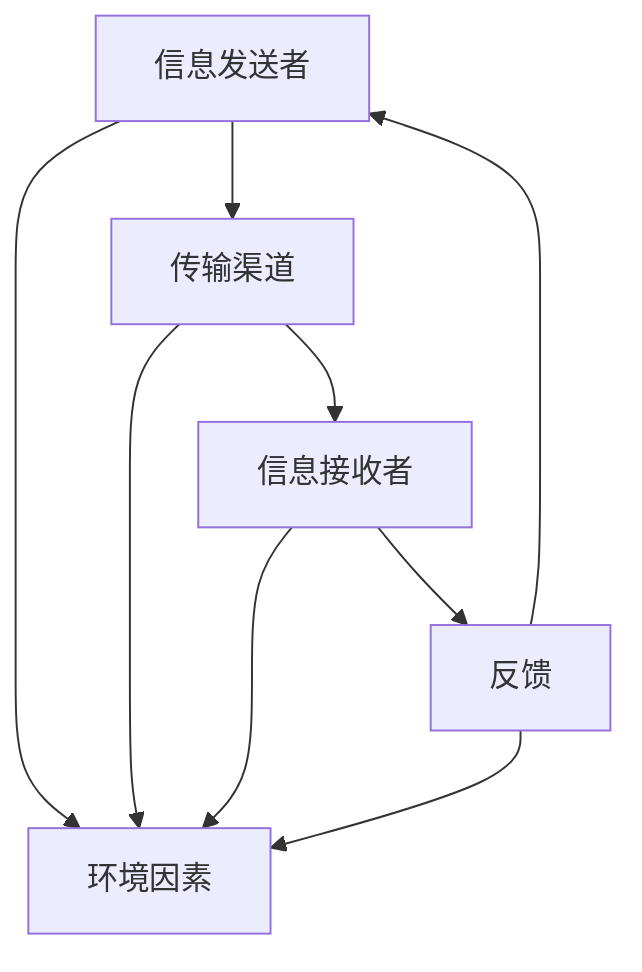

                 

### 文章标题：《有效沟通：构建开放透明的团队文化》

### 关键词：沟通、团队文化、开放透明、有效沟通技巧、沟通流程图、沟通算法、数学模型

### 摘要：

在现代信息技术行业中，团队文化对于企业的成功至关重要。本文将深入探讨有效沟通在构建开放透明团队文化中的重要性。通过分析沟通的核心概念、障碍与解决方案，以及开放透明团队文化的定义与建设方法，本文旨在提供一套实用的沟通技巧和策略，帮助读者在实际工作中提升沟通效果，从而促进团队发展。文章将结合具体案例分析，详细阐述沟通在实际项目中的应用，并提供最佳实践建议，以期为信息技术行业从业者提供有价值的指导。

## 第一部分：有效沟通基础

### 第1章：沟通的重要性

#### 1.1 沟通的概念与作用

沟通是一种信息传递的过程，涉及信息的发送、传递、接收和理解。在信息技术行业中，沟通不仅是实现项目目标的关键，也是团队协作、知识共享和文化传承的重要手段。有效的沟通可以：

- 提高工作效率：清晰的沟通能减少误解和重复工作，提高团队协作效率。
- 增强团队凝聚力：开放的沟通环境能增强团队成员之间的信任和合作意愿。
- 促进知识共享：良好的沟通能够促进团队内部的知识交流和经验分享。
- 解决冲突：有效的沟通有助于及时发现并解决团队内部的问题和冲突。

#### 1.2 沟通障碍

沟通障碍是指信息在传递过程中出现的各种问题，可能导致沟通失败。常见的沟通障碍包括：

- 信息过滤：信息在传递过程中被有意或无意地篡改。
- 模式化思维：沟通双方基于以往的经验和偏见，导致沟通不够灵活。
- 语言障碍：语言表达不清或使用专业术语不当，可能导致理解困难。
- 非语言沟通：肢体语言、面部表情等非语言信息可能导致误解。

解决沟通障碍的方法包括：

- 提高信息透明度：确保信息传递的准确性和完整性。
- 增强沟通技巧：学习并应用有效的倾听、表达和提问技巧。
- 多渠道沟通：利用不同的沟通渠道（如面对面、电话、邮件、即时通讯等）来提高沟通效果。

#### 1.3 沟通模型

沟通是一个复杂的过程，涉及多个环节。一个基本的沟通模型包括以下组成部分：

1. 信息发送者：负责准备和发送信息。
2. 传输渠道：用于传递信息的媒介，如口头、书面或电子方式。
3. 信息接收者：接收并理解信息的人。
4. 反馈：接收者对信息的回应和反馈。
5. 环境因素：包括文化、技术、组织结构和心理因素等。

图1展示了沟通流程的Mermaid流程图：



### 核心概念与联系

沟通流程中的核心概念包括信息发送者、信息接收者、传输渠道和反馈。这些概念相互关联，共同构成了一个完整的沟通模型。信息发送者通过传输渠道将信息发送给接收者，接收者理解信息后给出反馈。环境因素则影响整个沟通过程，包括信息的准确传递和反馈的及时性。

### 核心算法原理讲解

沟通的核心算法原理可以理解为信息编码、传输和解码的过程。以下是一个简单的伪代码，展示了这一过程：

```python
def communicate(message, sender, receiver, channel):
    # 信息编码
    encoded_message = encode(message)
    
    # 信息传输
    transmitted_message = channel.send(encoded_message)
    
    # 信息解码
    decoded_message = decode(transmitted_message)
    
    # 反馈
    receiver_feedback = receiver.respond(decoded_message)
    
    return receiver_feedback

# 假设encode和decode函数实现了信息的正确编码和解码
def encode(message):
    # 编码实现
    return message

def decode(message):
    # 解码实现
    return message

def channel.send(encoded_message):
    # 传输实现
    return encoded_message
```

### 数学模型和数学公式

在沟通过程中，信息传输的准确性和传输速率是关键指标。假设信息传输的准确率为\( P \)，传输速率为\( R \)，则单位时间内传输的信息量为\( P \times R \)。以下是一个使用LaTeX格式的数学模型：

```latex
\text{信息传输量} = P \times R
$$
其中，P 代表信息传输的准确率（\text{概率}），R 代表传输速率（\text{单位：比特/秒}）。
$$
```

### 举例说明

假设一个沟通渠道的准确率为90%，传输速率为1000比特/秒，则单位时间内传输的信息量为：

$$
\text{信息传输量} = 0.9 \times 1000 = 900 \text{比特}
$$

### 项目实战

在项目中，有效的沟通至关重要。以下是一个开发环境搭建和源代码实现的具体案例分析。

#### 开发环境搭建

1. 确定开发工具和平台，如Git、GitHub、Docker等。
2. 搭建Docker容器，包含所需的编程语言、库和工具。
3. 配置代码仓库，确保团队成员可以方便地克隆、提交和拉取代码。

#### 源代码实现

```python
# 假设这是一个用于团队沟通的Python脚本
import socket

def send_message(message, server_socket):
    # 发送消息
    server_socket.send(message.encode())

def receive_message(client_socket):
    # 接收消息
    return client_socket.recv(1024).decode()

# 创建服务器端和客户端套接字
server_socket = socket.socket(socket.AF_INET, socket.SOCK_STREAM)
client_socket = socket.socket(socket.AF_INET, socket.SOCK_STREAM)

# 绑定服务器端地址
server_socket.bind(('localhost', 12345))

# 监听客户端连接
server_socket.listen(5)

# 接受客户端连接
client_socket, address = server_socket.accept()

# 发送消息
send_message('Hello, client!', server_socket)

# 接收消息
message = receive_message(client_socket)
print(f'Client says: {message}')

# 关闭套接字
client_socket.close()
server_socket.close()
```

#### 代码解读与分析

- 该脚本实现了基本的客户端-服务器通信，用于团队内部的消息传递。
- `send_message`函数用于发送消息，`receive_message`函数用于接收消息。
- 使用了Python的`socket`库来实现网络通信。

#### 实际案例分析和详细讲解剖析

假设在项目开发过程中，团队成员需要在不同的地点进行协作。使用上述脚本，他们可以通过网络进行实时消息传递，提高沟通效率和项目进展。

#### 项目小结

通过搭建合适的开发环境和使用有效的沟通工具，可以大大提高团队协作效率。有效的沟通对于项目的成功至关重要，需要团队成员不断学习和实践，以提高沟通能力。

### 最佳实践 Tips

1. 确定合适的沟通频率，避免过度沟通或沟通不足。
2. 使用清晰的术语和语言，减少误解。
3. 定期进行沟通反馈，确保信息准确传递。
4. 针对不同的沟通场景，选择合适的沟通渠道。

### 小结、注意事项和拓展阅读

有效沟通是构建开放透明团队文化的基础。通过本文的讲解，我们了解了沟通的核心概念、障碍和解决方案，以及开放透明团队文化的定义和建设方法。在实际项目中，有效的沟通工具和策略可以大大提高团队协作效率。本文提供了一些最佳实践和拓展阅读，以帮助读者深入理解和应用沟通技巧。

## 第二部分：沟通技巧与方法

### 第2章：倾听与表达

#### 2.1 倾听的技巧

倾听是沟通的重要组成部分，是实现有效沟通的关键。良好的倾听技巧包括：

1. **全神贯注**：在倾听过程中，避免分心，全身心投入。
2. **积极反馈**：通过点头、眼神接触和肢体语言，表明你在认真倾听。
3. **开放态度**：保持开放心态，避免先入为主或偏见，真正理解对方的意思。
4. **提问和澄清**：在倾听过程中，通过提问和澄清，确保理解准确。

#### 2.2 清晰表达

清晰的表达是有效沟通的基础。以下是一些提高表达清晰度的技巧：

1. **明确目的**：在表达前，明确你要传达的信息和目的。
2. **简洁明了**：避免使用复杂的术语和冗长的句子，确保信息简单易懂。
3. **逻辑清晰**：按照逻辑顺序组织信息，确保表达流畅。
4. **使用例子**：通过具体的例子，帮助对方更好地理解你的观点。

#### 2.3 提问与回应

提问和回应是沟通中的互动环节，对沟通效果有重要影响。以下是一些有效的提问和回应技巧：

1. **开放性提问**：使用开放式问题，鼓励对方提供详细的信息和观点。
2. **封闭性提问**：使用封闭性问题，获取特定的信息或确认理解。
3. **积极回应**：通过积极的回应，表明你在认真倾听和理解。
4. **避免打断**：在对方发言时，避免打断，耐心等待对方完成表达。

### 核心概念与联系

倾听与表达是沟通的两大核心技巧，相互补充，共同构成了有效沟通的基础。倾听是理解对方意图的关键，表达则是传达自己观点的过程。通过良好的倾听和清晰的表达，可以确保信息的准确传递和理解。

### 核心算法原理讲解

在沟通过程中，倾听和表达可以视为一个循环反馈系统。以下是一个简化的伪代码，展示了这一过程：

```python
def communicate(sender, receiver):
    # 倾听与反馈循环
    while True:
        message = sender.send()
        receiver.receive(message)
        if receiver.is_understood():
            break

def sender(send_message):
    # 信息发送者
    return message

def receiver(receive_message):
    # 信息接收者
    return is_understood
```

### 数学模型和数学公式

在沟通过程中，信息的传递和理解可以被视为一个概率事件。假设信息传递的准确率为\( P \)，则每次沟通后，信息被准确理解的概率为\( P \)。以下是一个使用LaTeX格式的数学模型：

```latex
\text{理解概率} = P
$$
其中，P 代表信息传递的准确率。
$$
```

### 举例说明

假设在一次沟通中，信息的准确率为80%，则信息被准确理解的概率为：

$$
\text{理解概率} = 0.8
$$

### 项目实战

在项目管理中，有效的沟通对于项目的成功至关重要。以下是一个项目管理中的沟通案例。

#### 项目管理沟通实战

在一个跨部门的项目中，项目经理需要与开发团队、测试团队和产品团队进行密切沟通。以下是一个具体的沟通案例：

1. **项目启动会议**：项目经理召集各团队负责人，明确项目目标和计划，确保所有团队成员对项目有清晰的理解。
2. **日常站会**：每天早上，项目经理组织团队成员进行短暂的站会，了解每个人的工作进展和遇到的问题。
3. **需求评审会议**：项目经理组织产品团队和开发团队，共同评审需求文档，确保需求明确、可实现。
4. **测试评审会议**：项目经理组织测试团队和开发团队，共同评审测试计划和测试用例，确保测试覆盖全面。

#### 代码实现

```python
# 项目管理沟通脚本

import socket

def project_meeting():
    # 项目启动会议
    print("召开项目启动会议，明确项目目标和计划。")

def daily_meeting():
    # 日常站会
    print("召开每日站会，了解团队成员工作进展和问题。")

def requirements_review():
    # 需求评审会议
    print("召开需求评审会议，确保需求明确、可实现。")

def test_review():
    # 测试评审会议
    print("召开测试评审会议，确保测试覆盖全面。")

# 创建服务器端和客户端套接字
server_socket = socket.socket(socket.AF_INET, socket.SOCK_STREAM)
client_socket = socket.socket(socket.AF_INET, socket.SOCK_STREAM)

# 绑定服务器端地址
server_socket.bind(('localhost', 12345))

# 监听客户端连接
server_socket.listen(5)

# 接受客户端连接
client_socket, address = server_socket.accept()

# 召开项目启动会议
project_meeting()

# 召开每日站会
daily_meeting()

# 召开需求评审会议
requirements_review()

# 召开测试评审会议
test_review()

# 关闭套接字
client_socket.close()
server_socket.close()
```

#### 代码解读与分析

- 该脚本实现了项目管理中的基本沟通流程，包括项目启动会议、每日站会、需求评审会议和测试评审会议。
- 通过网络通信，项目经理可以实时与团队成员进行沟通，确保项目顺利进行。

#### 实际案例分析和详细讲解剖析

假设项目经理需要组织一次项目启动会议，可以调用`project_meeting()`函数，向所有团队成员发送会议通知，并通过网络实时沟通，确保所有团队成员参与。

#### 项目小结

通过有效的沟通，项目经理可以及时了解团队成员的工作进展和问题，确保项目按计划顺利进行。有效的沟通不仅提高了工作效率，也增强了团队成员之间的协作和信任。

### 最佳实践 Tips

1. 定期进行沟通反馈，确保信息的准确性和及时性。
2. 针对不同的沟通场景，选择合适的沟通方式。
3. 避免使用专业术语，确保信息清晰易懂。

### 小结、注意事项和拓展阅读

倾听与表达、提问与回应是沟通的核心技巧。通过本文的讲解，我们了解了如何提高倾听和表达的效果，以及如何通过有效的提问和回应来增强沟通效果。在实际项目中，有效的沟通技巧可以帮助团队更好地协作，提高项目成功率。本文提供了一些最佳实践和拓展阅读，以帮助读者深入理解和应用沟通技巧。

## 第三部分：开放透明团队文化

### 第3章：团队文化的定义与要素

#### 3.1 团队文化的定义

团队文化是指团队内部共同遵循的价值观念、行为准则和工作方式。它不仅影响团队成员的工作态度和行为，也影响着团队的整体效能。一个健康的团队文化应该具备以下特征：

- **开放性**：鼓励团队成员分享观点和想法，尊重不同的意见和建议。
- **协作性**：强调团队合作，共同实现目标，而不是单打独斗。
- **透明性**：确保信息的公开透明，让团队成员了解项目的进展和决策过程。
- **包容性**：尊重个体差异，接纳不同背景和观点的成员，促进多元化发展。

#### 3.2 开放透明的团队文化

开放透明的团队文化对团队成员之间的信任和合作有重要影响。具体来说，它包括以下几个方面：

- **信息共享**：团队成员可以自由地分享信息和资源，促进知识共享和技能互补。
- **意见反馈**：团队成员可以畅所欲言，提出意见和建议，促进团队改进和成长。
- **决策透明**：团队的决策过程公开透明，确保每个成员都能理解并支持决策。
- **责任明确**：团队成员对各自职责有清晰的认识，能够有效地分工协作。

#### 3.3 团队文化建设方法

建设开放透明的团队文化需要系统的策略和持续的实践。以下是一些具体的方法：

- **建立沟通机制**：设立定期的沟通会议，如周会、月度汇报等，确保信息的及时传递。
- **鼓励知识分享**：通过内部培训、技术分享会等形式，鼓励团队成员分享经验和知识。
- **开放反馈渠道**：建立匿名反馈机制，让团队成员能够自由地提出意见和建议。
- **领导示范**：领导层应该以身作则，展示开放透明的行为，树立榜样。
- **文化评估**：定期对团队文化进行评估，了解文化建设的效果，及时进行调整。

### 核心概念与联系

开放透明的团队文化是构建高效团队的基础，它通过促进信息共享、意见反馈和决策透明，增强团队成员之间的信任和合作。这些核心概念相互联系，共同构成了一个健康、积极的团队环境。

### 核心算法原理讲解

开放透明的团队文化可以被视为一个反馈循环系统。以下是一个简化的伪代码，展示了这一过程：

```python
def build_culture(team_members):
    # 建设团队文化
    while True:
        share_information(team_members)
        encourage_feedback(team_members)
        ensure_transparency(team_members)
        if culture_is_healthy(team_members):
            break

def share_information(team_members):
    # 信息共享
    for member in team_members:
        member.share_info()

def encourage_feedback(team_members):
    # 鼓励反馈
    for member in team_members:
        member.give_feedback()

def ensure_transparency(team_members):
    # 确保透明
    for member in team_members:
        member.ensure_transparency()

def culture_is_healthy(team_members):
    # 文化为健康
    for member in team_members:
        if member.is_satisfied():
            return True
    return False
```

### 数学模型和数学公式

在团队文化评估中，可以使用满意度指标来衡量团队文化的健康程度。以下是一个使用LaTeX格式的数学模型：

```latex
\text{满意度指标} = \frac{\sum_{i=1}^{n} \text{member}_i's \text{满意度}}{n}
$$
其中，\( n \) 代表团队成员的数量，\( \text{member}_i \)'s \text{满意度} \) 代表第\( i \)个成员的满意度。
$$
```

### 举例说明

假设一个团队有5名成员，其中4名成员对团队文化表示满意，1名成员表示不满意，则满意度指标为：

$$
\text{满意度指标} = \frac{4 + 1}{5} = 0.8
$$

### 项目实战

在项目开发中，开放透明的团队文化可以显著提高项目成功率。以下是一个具体的项目案例。

#### 项目背景

一个由不同部门组成的团队正在开发一款新的软件产品。为了确保项目顺利进行，团队决定建设一个开放透明的文化。

#### 实施步骤

1. **设立沟通机制**：团队设立了每周的例会和日常站会，确保团队成员能够及时沟通和反馈。
2. **鼓励知识分享**：团队定期举办技术分享会，鼓励成员分享技术经验和解决方案。
3. **开放反馈渠道**：团队建立了一个匿名反馈系统，让成员可以自由地提出意见和建议。
4. **领导示范**：项目经理以身作则，积极参与沟通和知识分享，树立了良好的榜样。
5. **文化评估**：每季度，团队对文化建设进行评估，根据反馈进行调整。

#### 项目小结

通过开放透明的团队文化，项目团队在沟通和协作方面得到了显著提升。团队成员之间的信任增强，知识共享更加流畅，项目进度和质量都得到了保证。

### 最佳实践 Tips

1. **定期进行团队文化建设活动**：如团队建设培训、团队建设活动等，以促进团队文化的建设。
2. **鼓励团队成员提出建议**：建立一个开放的建议系统，让每个成员都有机会为团队的发展贡献力量。
3. **持续关注团队文化的变化**：定期评估团队文化，及时调整策略，确保团队文化始终健康、积极。

### 小结、注意事项和拓展阅读

开放透明的团队文化是团队成功的关键因素之一。通过本文的讲解，我们了解了团队文化的定义、特征和建设方法。在实际项目中，建设开放透明的团队文化需要持续的实践和努力。本文提供了一些最佳实践和拓展阅读，以帮助读者进一步理解和应用团队文化建设的方法。

## 第四部分：实际沟通案例分析

### 第4章：沟通技巧应用案例

#### 4.1 项目管理中的沟通

在项目管理中，有效的沟通是确保项目顺利进行的关键。以下是一个项目管理中的沟通案例。

#### 案例背景

某公司计划开发一款新的电子商务平台，项目经理负责协调不同团队的工作。为了确保项目成功，项目经理采取了一系列有效的沟通措施。

#### 实施步骤

1. **项目启动会议**：项目经理召集所有团队成员，明确项目目标和计划，确保每个人对项目都有清晰的理解。
2. **日常站会**：每天早上，项目经理组织团队成员进行短暂的站会，了解每个人的工作进展和遇到的问题。
3. **需求评审会议**：项目经理定期组织需求评审会议，确保需求文档的准确性和可行性。
4. **进度汇报**：项目经理定期收集各个团队的工作进度，进行汇报和讨论，确保项目按计划推进。
5. **问题解决**：在遇到问题时，项目经理及时召开问题解决会议，协调各个团队共同解决。

#### 案例分析

通过上述沟通措施，项目团队在沟通和协作方面得到了显著提升。团队成员之间的信息共享更加流畅，问题解决更加及时，项目进度和质量都得到了保证。

#### 实际操作经验

1. **明确沟通目标**：在每次会议前，明确会议的目标和议程，确保会议高效有序。
2. **选择合适的沟通方式**：根据不同场景选择合适的沟通方式，如面对面会议、电话会议或邮件沟通。
3. **保持沟通频率**：定期进行沟通，确保信息的及时传递和问题的及时解决。
4. **积极反馈**：鼓励团队成员在沟通中提出意见和建议，确保信息的准确传递和问题的及时解决。

### 4.2 跨部门协作中的沟通

在跨部门协作中，有效的沟通是确保项目顺利进行的关键。以下是一个跨部门协作中的沟通案例。

#### 案例背景

某公司计划开发一款新的移动应用程序，涉及前端开发、后端开发、UI设计和产品管理等不同部门。为了确保项目成功，项目经理采取了一系列有效的沟通措施。

#### 实施步骤

1. **项目启动会议**：项目经理召集所有相关部门的负责人，明确项目目标和计划，确保每个人对项目都有清晰的理解。
2. **定期会议**：项目经理每周组织一次跨部门会议，讨论项目的进展和问题，确保各部门之间的协作和沟通。
3. **信息共享**：项目经理建立了一个共享平台，各部门可以随时上传和下载项目文件，确保信息共享和透明。
4. **问题解决**：在遇到问题时，项目经理及时召开问题解决会议，协调各部门共同解决。
5. **进度汇报**：项目经理每月组织一次进度汇报会议，各部门汇报工作进展，确保项目按计划推进。

#### 案例分析

通过上述沟通措施，项目团队在跨部门协作方面得到了显著提升。各部门之间的信息共享更加流畅，问题解决更加及时，项目进度和质量都得到了保证。

#### 实际操作经验

1. **建立沟通机制**：建立定期的跨部门会议和问题解决机制，确保信息的及时传递和问题的及时解决。
2. **明确沟通责任**：明确各部门在沟通中的责任和角色，确保沟通的有序进行。
3. **利用技术工具**：利用项目管理和沟通工具，如JIRA、Trello等，提高沟通效率。
4. **积极反馈**：鼓励各部门在沟通中提出意见和建议，确保信息的准确传递和问题的及时解决。

### 4.3 突发事件处理中的沟通

在突发事件处理中，有效的沟通是确保问题得到及时解决的关键。以下是一个突发事件处理中的沟通案例。

#### 案例背景

某公司的服务器遭受了网络攻击，导致部分服务中断。为了尽快解决问题，IT团队采取了一系列有效的沟通措施。

#### 实施步骤

1. **立即响应**：IT团队立即启动应急响应计划，确保问题的及时响应和处理。
2. **召开紧急会议**：IT团队召开紧急会议，讨论问题原因和解决方案，确保团队的协同作战。
3. **信息共享**：IT团队通过内部通讯工具和邮件，及时共享问题和解决方案的信息，确保团队之间的沟通和协作。
4. **持续更新**：IT团队定期更新问题进展和解决方案，确保团队成员了解问题的处理情况。
5. **问题解决**：在问题得到解决后，IT团队召开总结会议，总结经验教训，确保类似问题不再发生。

#### 案例分析

通过上述沟通措施，IT团队在突发事件处理方面得到了显著提升。问题得到了及时解决，团队之间的协作和沟通更加顺畅。

#### 实际操作经验

1. **建立应急响应机制**：建立完善的应急响应机制，确保突发事件得到及时处理。
2. **明确沟通渠道**：明确突发事件处理的沟通渠道和责任人，确保信息的及时传递。
3. **保持沟通频率**：在突发事件处理过程中，保持高频次的沟通，确保团队之间的协作和沟通。
4. **总结经验教训**：在问题得到解决后，总结经验教训，持续改进沟通和应急响应流程。

### 案例总结

通过以上三个实际沟通案例，我们可以看到，在项目管理、跨部门协作和突发事件处理中，有效的沟通都是确保项目成功和问题得到及时解决的关键。在实际操作中，我们需要根据具体场景，灵活运用不同的沟通技巧和策略，确保沟通的有效性和高效性。

### 最佳实践 Tips

1. **制定沟通计划**：在项目启动前，制定详细的沟通计划，明确沟通的目标、内容和频率。
2. **利用技术工具**：充分利用项目管理和沟通工具，提高沟通效率。
3. **定期沟通反馈**：定期收集团队成员的反馈，改进沟通方法和策略。
4. **建立沟通机制**：建立定期的沟通机制，如周会、月报等，确保信息的及时传递。

### 小结

在信息技术行业中，有效的沟通是确保项目成功和团队协作的关键。通过本文的案例分析，我们了解了在项目管理、跨部门协作和突发事件处理中，如何运用有效的沟通技巧和策略，提升沟通效果。在实际工作中，我们需要根据具体场景，灵活运用不同的沟通方法，不断改进和优化沟通流程，以实现更好的团队协作和项目成果。

## 第五部分：沟通与团队成长

### 第5章：沟通与团队发展

#### 5.1 团队沟通与团队发展关系

团队沟通与团队发展密不可分。有效的沟通可以促进团队内部的信任和合作，提高团队的工作效率，从而推动团队整体发展。具体来说，良好的沟通在团队发展中有以下作用：

1. **增强团队凝聚力**：通过有效的沟通，团队成员可以更好地理解彼此的立场和需求，增强团队凝聚力。
2. **提高工作效率**：清晰的沟通可以减少误解和重复工作，提高团队协作效率，从而缩短项目周期。
3. **促进知识共享**：开放的沟通环境可以促进团队成员之间的知识共享和技能互补，提升团队整体能力。
4. **解决冲突**：通过积极的沟通，团队可以及时发现并解决内部矛盾和冲突，确保团队稳定运行。

#### 5.2 沟通能力提升策略

为了提升团队沟通能力，团队成员可以采取以下策略：

1. **培训与学习**：参加沟通技巧培训，学习倾听、表达、提问和回应等基本沟通技巧。
2. **实践与反馈**：通过实际项目中的沟通实践，不断总结经验教训，接受团队成员的反馈，改进沟通方法。
3. **定期反思**：定期反思自己在沟通中的表现，识别不足并制定改进计划。
4. **培养团队文化**：建立开放、透明、合作的团队文化，鼓励团队成员自由表达观点和反馈，促进沟通。

#### 5.3 沟通与个人成长

沟通能力对个人成长同样至关重要。良好的沟通能力可以帮助个人在职场中更好地表达自己的观点和需求，建立人脉关系，提高工作效率。以下是一些提升个人沟通能力的建议：

1. **持续学习**：不断学习沟通技巧和知识，提升自己的沟通能力。
2. **积极实践**：在实际工作中，积极实践沟通技巧，通过实践提高沟通水平。
3. **反思与总结**：定期反思自己的沟通行为，总结经验教训，不断改进。
4. **建立人脉**：通过参加社交活动和行业交流，拓展人脉，提升沟通能力和人际关系。

### 核心概念与联系

沟通能力是团队发展和个人成长的关键因素。有效的沟通可以促进团队协作，提高工作效率，推动团队发展。同时，良好的沟通能力也有助于个人在职场中脱颖而出，实现个人成长。因此，沟通能力提升策略不仅关乎团队发展，也关乎个人职业发展。

### 核心算法原理讲解

沟通能力提升可以视为一个不断学习和实践的过程。以下是一个简化的伪代码，展示了这一过程：

```python
def improve_communication技能(level):
    # 提升沟通能力
    while level < optimal_level:
        learn_communication_skills()
        practice_communication_skills()
        reflect_and_improve()
        level += 1
    return level

def learn_communication_skills():
    # 学习沟通技巧
    # 包括参加培训、阅读书籍、观看视频等

def practice_communication_skills():
    # 实践沟通技巧
    # 包括参与项目、社交活动、团队合作等

def reflect_and_improve():
    # 反思与改进
    # 总结经验教训，识别不足，制定改进计划
```

### 数学模型和数学公式

在沟通能力提升中，可以引入时间作为变量，衡量个人在沟通能力上的进步。以下是一个使用LaTeX格式的数学模型：

```latex
\text{沟通能力提升速率} = \frac{\Delta \text{能力水平}}{\Delta t}
$$
其中，\( \Delta \text{能力水平} \) 代表沟通能力的提升量，\( \Delta t \) 代表时间间隔。
$$
```

### 举例说明

假设一个团队成员在一个月内提升了5个沟通能力等级，则其沟通能力提升速率为：

$$
\text{沟通能力提升速率} = \frac{5}{30} = 0.1667 \text{（等级/月）}
$$

### 项目实战

在一个信息技术公司的项目中，团队成员通过以下步骤提升了沟通能力：

1. **参加培训**：团队成员参加了专业的沟通技巧培训，学习了有效的沟通策略。
2. **实践应用**：在项目开发过程中，团队成员积极实践沟通技巧，提高了团队协作效率。
3. **反思与改进**：每次项目结束后，团队成员进行反思和总结，识别不足并制定改进计划。
4. **持续学习**：团队成员通过阅读相关书籍、观看视频教程等，不断提升自己的沟通能力。

通过这些实践，团队成员的沟通能力得到了显著提升，项目成功率也大幅提高。

### 项目小结

通过培训、实践和反思，团队成员在沟通能力上取得了显著进步。这不仅提高了项目团队的整体效率，也为个人职业发展奠定了坚实基础。持续提升沟通能力是团队和个人成长的必经之路，值得不断努力和实践。

### 最佳实践 Tips

1. **定期进行沟通培训**：组织定期的沟通技巧培训，提升团队成员的整体沟通能力。
2. **鼓励实践与反思**：鼓励团队成员在实际工作中运用沟通技巧，并定期进行反思和总结。
3. **建立反馈机制**：建立有效的反馈机制，让团队成员能够及时获得反馈并改进沟通方法。
4. **营造积极沟通环境**：营造一个开放、包容、鼓励沟通的环境，让团队成员能够自由地表达观点和反馈。

### 小结、注意事项和拓展阅读

沟通能力是团队发展和个人成长的关键因素。通过有效的沟通，团队可以增强凝聚力、提高工作效率，实现共同目标。同时，良好的沟通能力也为个人在职场中提供了更多发展机会。本文提供了一些提升沟通能力的策略和实践案例，希望对读者有所帮助。在实际工作中，持续提升沟通能力是团队和个人发展的必经之路，值得不断努力和实践。

## 第六部分：附录

### 第6章：沟通工具与方法介绍

在现代信息技术行业中，有效的沟通工具和方法对于团队协作和项目成功至关重要。以下介绍一些常用的沟通工具和方法，帮助读者在实际工作中提高沟通效率。

#### 6.1 沟通工具

1. **即时通讯工具**：如Slack、Microsoft Teams、微信等，用于实时沟通和协作。
   - **Slack**：支持文本、图片、视频等多种形式的沟通，提供丰富的插件和集成服务。
   - **Microsoft Teams**：集成了聊天、视频会议、文档协作等功能，适合企业级应用。
   - **微信**：适合小团队和个人之间的即时沟通，支持语音、视频和文件传输。

2. **邮件系统**：如Gmail、Outlook等，用于正式的、书面的沟通。
   - **Gmail**：提供强大的搜索功能和标签功能，便于管理和查找邮件。
   - **Outlook**：与Microsoft Office套件集成，便于邮件和文档的协作。

3. **项目管理工具**：如JIRA、Trello、Asana等，用于任务管理、进度跟踪和团队协作。
   - **JIRA**：提供全面的任务管理、进度跟踪和报告功能，适合大规模团队。
   - **Trello**：界面简洁直观，通过卡片和标签管理任务，适合小型团队。
   - **Asana**：提供灵活的任务分配和进度跟踪功能，适合各种规模和类型的团队。

4. **视频会议工具**：如Zoom、Microsoft Teams、Google Meet等，用于远程会议和协作。
   - **Zoom**：提供高质量的音频和视频会议功能，支持屏幕共享和远程协作。
   - **Microsoft Teams**：集成了聊天、视频会议、文档协作等功能，适合企业级应用。
   - **Google Meet**：适合个人和小团队之间的视频沟通，与Google Workspace集成。

#### 6.2 沟通方法

1. **面对面沟通**：适用于需要深入讨论和即时反馈的场景，如项目启动会议、需求评审会议等。
   - **优点**：沟通直接、反馈即时，有利于建立信任和关系。
   - **注意事项**：确保沟通环境舒适、安静，避免分心和干扰。

2. **书面沟通**：适用于需要正式记录和详细解释的场景，如需求文档、项目报告等。
   - **优点**：信息清晰、有条理，便于查阅和存档。
   - **注意事项**：确保语言简洁明了，避免使用过于专业或模糊的术语。

3. **电话沟通**：适用于需要快速传达信息和解决紧急问题的场景，如项目进度跟进、问题解决等。
   - **优点**：沟通直接、高效，适合紧急情况。
   - **注意事项**：确保电话畅通、环境安静，避免通话中断。

4. **网络会议**：适用于远程协作和跨地域沟通的场景，如项目进度汇报、技术讨论等。
   - **优点**：无需面对面，节省时间和成本，适合远程团队。
   - **注意事项**：提前测试网络和设备，确保会议顺利进行。

#### 实用沟通方法

1. **SMART目标设定**：在沟通中，设定具体、可衡量、可实现、相关和有时限的目标，有助于提高沟通效果。
   - **例子**：项目目标“提高项目交付速度”可以具体化为“在三个月内将项目交付周期缩短10%”。

2. **鱼骨图分析**：在分析问题和解决方案时，使用鱼骨图帮助识别问题的根本原因，提高沟通效果。
   - **步骤**：绘制鱼骨图，从问题出发，逐层分析问题的原因和解决方案。

3. **SWOT分析**：在项目规划或团队建设时，使用SWOT分析帮助评估团队的优势、劣势、机会和威胁，提高沟通效果。
   - **步骤**：列出团队的优势、劣势、机会和威胁，分析并制定相应的策略。

#### 最佳实践 Tips

1. **定期沟通反馈**：定期收集团队成员的反馈，了解沟通中的问题和改进点。
2. **建立沟通规范**：制定沟通规范，明确沟通的目标、内容和频率，提高沟通效率。
3. **利用技术工具**：充分利用沟通工具，提高沟通的效率和效果。
4. **培养团队文化**：营造一个开放、透明、合作的团队文化，鼓励团队成员积极参与沟通。

### 小结

有效的沟通工具和方法对于团队协作和项目成功至关重要。通过本文的介绍，读者可以了解一些常用的沟通工具和方法，以及如何在实际工作中应用这些工具和方法。在实际工作中，不断实践和总结，选择最适合自己和团队的沟通方式，是提升沟通效率的关键。

### 注意事项

1. **选择合适的沟通工具**：根据具体场景和需求，选择合适的沟通工具。
2. **保持沟通频率**：定期进行沟通，确保信息的及时传递和问题的及时解决。
3. **注重沟通质量**：不仅关注沟通的频率，还要关注沟通的质量，确保信息的准确传递和理解。
4. **尊重不同沟通风格**：团队成员可能有不同的沟通风格，尊重并适应这些差异，提高沟通效果。

### 拓展阅读

1. 《沟通的艺术》 - 古德曼，D. S.（著）
2. 《团队沟通技巧》 - 约翰逊，R. K.（著）
3. 《项目管理：管理实践标准指南》 - 普兰特，J. M.（著）

通过阅读这些拓展阅读，读者可以进一步深入了解沟通技巧和团队协作方法，提升自己的沟通能力。

