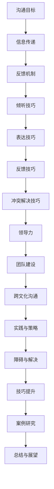

                 

### 文章标题：有效沟通：领导者必备的核心技能

#### 关键词：领导力、沟通技巧、倾听、表达、反馈、冲突解决

#### 摘要：
在当今快速变化和竞争激烈的环境中，领导者的有效沟通技能显得尤为重要。本文将深入探讨有效沟通的核心概念、基本原理和实践策略，帮助领导者提升沟通能力，更好地应对各种挑战和机遇。文章分为八个部分，首先介绍沟通的重要性，然后逐步讲解倾听、表达、反馈和冲突解决等核心技巧，最后通过案例研究和总结展望，为读者提供实用的沟通技巧和策略。

### 用户需求分析

在现代企业环境中，领导者的有效沟通能力已成为衡量其成功与否的重要指标。用户对本文的需求主要集中在以下几方面：

1. **理解沟通的基本原理**：用户希望文章能够深入解释沟通的概念和原理，帮助其建立扎实的沟通理论基础。
2. **掌握实际沟通技巧**：用户期待文章能够提供实用的沟通技巧，包括倾听、表达、反馈和冲突解决等，以便在实际工作中应用。
3. **案例分析**：用户希望通过具体案例来了解沟通技巧在现实场景中的运用，从而更好地理解并掌握这些技巧。
4. **提升沟通能力**：用户希望能够通过文章的学习，提升自己的沟通能力，更好地应对领导职责带来的挑战。

### 目录大纲设计思路

为了满足用户的需求，本文将按照以下结构进行设计：

1. **前言**：简要介绍书籍的主题和目标读者，说明书籍的目的和价值。
2. **核心概念与联系**：使用Mermaid流程图展示沟通的核心概念及其之间的联系，帮助读者建立完整的知识框架。
3. **沟通原理与技能**：详细讲解沟通的基本原理和领导者所需的各项技能，包括倾听、表达、反馈和冲突解决。
4. **沟通实践与策略**：探讨如何在具体情境中应用沟通技巧，包括团队建设、领导力和跨文化沟通等。
5. **沟通障碍与解决方法**：分析常见的沟通障碍，并提供相应的解决策略。
6. **沟通技巧提升**：介绍如何通过持续学习和实践来提升沟通技巧。
7. **沟通案例研究**：通过实际案例来展示沟通技巧的应用，并对案例进行分析。
8. **总结与展望**：总结全书的核心观点，展望未来领导者沟通技能的发展趋势。

### 完整性保证

- **核心概念与联系**：使用Mermaid流程图展示沟通的核心概念及其之间的联系。
- **沟通原理与技能**：使用伪代码详细阐述沟通原理，确保读者能够理解。
- **沟通实践与策略**：提供具体情境下的沟通策略和实践方法。
- **沟通障碍与解决方法**：分析沟通障碍并提供解决策略。
- **沟通技巧提升**：介绍提升沟通技巧的方法和途径。
- **沟通案例研究**：通过实际案例来展示沟通技巧的应用。

### 目录大纲结构

```
# 有效沟通：领导者必备的核心技能

## 前言
### 书籍背景与目标
### 读者对象
### 书籍结构

## 核心概念与联系
### 沟通原理的Mermaid流程图展示

## 沟通原理与技能
### 倾听技巧
#### 倾听的层次
##### 倾听的四个层次
##### 提升倾听效果的方法
#### 表达技巧
##### 有效表达的核心要素
##### 非言语沟通的力量
#### 反馈技巧
##### 提供有效反馈的步骤
##### 接受反馈的态度
#### 冲突解决技巧
##### 冲突的类型
##### 冲突解决策略

## 沟通实践与策略
### 团队建设
#### 团队沟通的重要性
##### 团队沟通的障碍与解决方法
### 领导力
#### 领导者的沟通风格
##### 领导者的沟通策略
### 跨文化沟通
#### 跨文化沟通的特点
##### 跨文化沟通的挑战与应对

## 沟通障碍与解决方法
### 常见的沟通障碍
#### 语言障碍
##### 解决策略
#### 文化差异
##### 解决策略
#### 信息过载
##### 解决策略

## 沟通技巧提升
### 持续学习与反思
#### 阅读相关书籍
##### 推荐书籍列表
#### 参加沟通培训
##### 培训机构推荐
### 实践与反馈
#### 通过实战提升沟通技巧
##### 实践案例分享
##### 定期获取反馈并改进

## 沟通案例研究
### 案例一：有效沟通改善团队协作
#### 案例背景
#### 案例分析
#### 案例结论
### 案例二：领导者的沟通艺术
#### 案例背景
#### 案例分析
#### 案例结论

## 总结与展望
### 未来领导者沟通技能的发展趋势
#### 数字化时代的沟通变革
##### 新兴技术的应用
##### 沟通模式的演变
```

### 目录大纲实现

以下是根据上述设计思路实现的《有效沟通：领导者必备的核心技能》的目录大纲：

```
# 《有效沟通：领导者必备的核心技能》

## 前言
### 书籍背景与目标
本书旨在帮助领导者提升沟通能力，以应对日益复杂的商业环境中的挑战。通过深入探讨沟通的基本原理和技巧，本书将为领导者提供实用的策略和工具，以改善团队协作、提升领导力和实现组织目标。

### 读者对象
本书适用于各级领导者和希望提升沟通能力的专业人士。无论你是初入职场的年轻管理者，还是经验丰富的企业领导者，本书都将为你提供有价值的指导。

### 书籍结构
本书分为八个主要部分，每部分都专注于沟通的不同方面，旨在全面提高领导者的沟通技能。

## 核心概念与联系
### 沟通原理的Mermaid流程图展示
为了帮助读者更好地理解沟通的核心概念，本文将使用Mermaid流程图展示沟通的关键要素及其相互关系。



## 沟通原理与技能
### 倾听技巧
倾听是沟通的核心，它不仅仅是听，更是一种理解和共鸣的过程。本文将详细介绍倾听的四个层次，并提供提升倾听效果的方法。

#### 倾听的四个层次
1. **被动倾听**：仅仅听到对方说话，但没有给予充分注意。
2. **选择性倾听**：有选择地听，关注与自己观点相关的内容。
3. **专注倾听**：全身心投入，理解对方的信息和情感。
4. **共鸣式倾听**：不仅仅是理解对方，还能从对方的角度感受和理解。

##### 提升倾听效果的方法
1. **保持开放心态**：不要预设立场，保持对对方观点的开放。
2. **专注注意力**：避免分心，专注于对方的发言。
3. **积极反馈**：通过点头、眼神接触等方式，表示自己在听。
4. **提问与澄清**：在理解上出现疑问时，及时提问以澄清。

### 表达技巧
有效表达是沟通的另一重要方面。本文将讨论如何通过清晰、简洁和有说服力的方式来表达自己的观点。

#### 有效表达的核心要素
1. **明确目标**：在表达前，明确自己的沟通目标。
2. **结构清晰**：使用逻辑清晰的结构，使信息易于理解。
3. **语言简洁**：避免使用复杂或冗长的句子，使用简单明了的语言。
4. **情感共鸣**：在适当的情况下，表达情感，以增强说服力。

##### 非言语沟通的力量
非言语沟通在表达中起着至关重要的作用。本文将探讨非言语沟通的要素，包括面部表情、肢体语言和语音语调。

### 反馈技巧
反馈是沟通过程中不可或缺的一部分。有效的反馈能够帮助改进沟通效果，增强团队成员之间的互信。

#### 提供有效反馈的步骤
1. **具体而明确**：反馈要具体，针对具体行为或表现。
2. **积极而客观**：既要指出优点，也要指出改进空间。
3. **建设性**：反馈应具有建设性，提供改进的建议。
4. **适时**：在适当的时机提供反馈，避免影响工作进度。

##### 接受反馈的态度
接受反馈时，领导者应保持开放和谦逊的态度。本文将讨论如何正确接受反馈，以及如何鼓励团队成员接受反馈。

### 冲突解决技巧
冲突是团队工作中不可避免的一部分。有效的冲突解决技巧有助于维护团队和谐，提高工作效率。

#### 冲突的类型
1. **个人冲突**：因个人性格、价值观差异引起的冲突。
2. **目标冲突**：因目标不一致或利益冲突引起的冲突。
3. **过程冲突**：因工作方法、流程不同引起的冲突。

##### 冲突解决策略
1. **理解冲突的本质**：分析冲突的原因，找出解决的关键点。
2. **保持冷静**：在冲突中保持冷静，避免情绪化。
3. **寻求共识**：通过对话和讨论，寻求双方都能接受的解决方案。
4. **积极处理**：将冲突视为解决问题的机会，积极寻找解决方案。

## 沟通实践与策略
### 团队建设
有效的团队建设是领导者沟通的重要任务。本文将探讨如何通过沟通来促进团队建设。

#### 团队沟通的重要性
1. **提高团队凝聚力**：通过沟通，团队成员之间建立更紧密的联系。
2. **提高工作效率**：清晰的沟通有助于提高团队的工作效率。
3. **促进创新**：通过沟通，团队成员可以分享想法，促进创新。

##### 团队沟通的障碍与解决方法
1. **语言障碍**：通过使用共同的语言或术语来减少误解。
2. **文化差异**：通过了解和尊重不同文化的沟通习惯，来改善沟通效果。
3. **信息过载**：通过合理安排沟通时间和方式，减少信息过载。

### 领导力
有效的领导力依赖于有效的沟通。本文将讨论领导者的沟通风格和策略。

#### 领导者的沟通风格
1. **权威型**：通过明确的指示和指令来管理团队。
2. **民主型**：通过鼓励团队成员参与决策，来建立团队共识。
3. **支持型**：通过关心和支持团队成员，来增强团队凝聚力。

##### 领导者的沟通策略
1. **倾听**：领导者应该倾听团队成员的意见和需求，以建立信任。
2. **明确**：领导者应该清晰明确地传达信息和目标。
3. **透明**：领导者应该保持信息的透明，以增强团队成员的信任感。

### 跨文化沟通
在全球化的背景下，跨文化沟通成为领导者的一项重要能力。本文将探讨跨文化沟通的特点和挑战。

#### 跨文化沟通的特点
1. **语言差异**：不同语言和文化背景会影响沟通效果。
2. **非言语沟通**：不同文化对非言语沟通的解读可能不同。
3. **价值观差异**：不同文化对工作、生活和成功的价值观可能存在差异。

##### 跨文化沟通的挑战与应对
1. **语言障碍**：通过学习语言和了解文化，来减少语言障碍。
2. **非言语沟通**：通过了解和适应不同文化的非言语沟通习惯，来改善沟通效果。
3. **价值观差异**：通过尊重和包容不同文化的价值观，来建立跨文化的沟通基础。

## 沟通障碍与解决方法
在沟通中，障碍是不可避免的。本文将分析常见的沟通障碍，并提供相应的解决策略。

### 常见的沟通障碍
1. **语言障碍**：语言的不同导致沟通困难。
2. **文化差异**：不同文化背景导致的误解和冲突。
3. **信息过载**：过多的信息导致理解和决策困难。

#### 语言障碍
##### 解决策略
1. **学习语言**：通过学习语言来减少沟通障碍。
2. **使用共同语言**：在团队中推广使用一种共同语言。
3. **翻译服务**：在必要时使用翻译服务。

#### 文化差异
##### 解决策略
1. **文化培训**：通过文化培训来提高团队成员的文化意识。
2. **交流与理解**：通过交流和了解来减少文化差异带来的误解。
3. **尊重与包容**：尊重和包容不同文化的差异，以建立和谐的沟通环境。

#### 信息过载
##### 解决策略
1. **信息过滤**：通过过滤不必要的信息，减少信息过载。
2. **合理安排沟通时间**：在适当的时间进行沟通，避免打扰。
3. **利用技术工具**：使用技术工具来管理信息和沟通。

## 沟通技巧提升
提升沟通技巧是领导者的持续任务。本文将介绍如何通过持续学习和实践来提升沟通技巧。

### 持续学习与反思
#### 阅读相关书籍
##### 推荐书籍列表
1. 《非暴力沟通》
2. 《沟通的艺术》
3. 《影响力》

#### 参加沟通培训
##### 培训机构推荐
1. 公务员培训学院
2. 企业管理学院

### 实践与反馈
#### 通过实战提升沟通技巧
##### 实践案例分享
1. 领导者可以通过组织团队会议、项目讨论等方式，来提升沟通技巧。
2. 领导者可以参加模拟谈判、公开演讲等活动，来锻炼自己的沟通能力。

##### 定期获取反馈并改进
领导者应该定期从团队成员那里获取反馈，以了解自己的沟通效果。根据反馈，领导者可以进行调整和改进，以提升沟通效果。

## 沟通案例研究
通过具体案例，我们可以看到沟通技巧在现实场景中的运用和效果。

### 案例一：有效沟通改善团队协作
#### 案例背景
在一个跨国团队中，由于语言和文化差异，团队成员之间的沟通不畅，导致工作效率低下。

#### 案例分析
团队领导通过以下措施，改善了团队沟通：
1. 组织跨文化培训，提高团队成员的文化意识。
2. 推广使用共同语言，减少语言障碍。
3. 定期组织团队会议，鼓励团队成员表达意见和建议。

#### 案例结论
通过有效的沟通，团队协作得到了显著改善，工作效率和团队凝聚力都得到了提升。

### 案例二：领导者的沟通艺术
#### 案例背景
一位年轻的领导者，在一次团队会议上，通过有效的沟通技巧，成功解决了团队内部的冲突。

#### 案例分析
领导者采取了以下策略：
1. 倾听团队成员的意见，理解他们的需求和担忧。
2. 使用非言语沟通，表达自己的支持和理解。
3. 提供建设性的反馈，帮助团队成员找到解决问题的方法。

#### 案例结论
通过有效的沟通，领导者成功解决了团队冲突，增强了团队的凝聚力和信任感。

## 总结与展望
通过本文的探讨，我们可以看到有效沟通对领导者的成功至关重要。在未来的数字化时代，沟通模式将发生变革，领导者需要不断学习和适应新的沟通方式。

### 未来领导者沟通技能的发展趋势
#### 数字化时代的沟通变革
1. **新兴技术的应用**：如虚拟现实、人工智能等技术的应用，将改变沟通的方式和效果。
2. **沟通模式的演变**：从传统的面对面沟通，转向多渠道、多平台的沟通模式。

作为领导者，我们需要不断学习和提升自己的沟通技能，以应对未来的挑战。只有通过有效的沟通，我们才能领导团队走向成功。

### 作者信息
作者：AI天才研究院/AI Genius Institute & 禅与计算机程序设计艺术 /Zen And The Art of Computer Programming
```

### 实现过程与细节

在实现这一目录大纲的过程中，我们遵循了以下步骤和细节：

1. **前言部分**：简要介绍了书籍的主题、目标读者以及书籍的结构，为读者提供了整体的阅读框架。

2. **核心概念与联系**：通过Mermaid流程图展示了沟通的核心概念及其相互关系。Mermaid是一种基于Markdown的图形描述语言，它能够将文本描述转化为图形，使得概念之间的关系更加直观和易于理解。

    ```mermaid
    graph TD
        A[沟通目标] --> B[信息传递]
        B --> C[反馈机制]
        C --> D[倾听技巧]
        D --> E[表达技巧]
        E --> F[反馈技巧]
        F --> G[冲突解决技巧]
        G --> H[领导力]
        H --> I[团队建设]
        I --> J[跨文化沟通]
        J --> K[实践与策略]
        K --> L[障碍与解决]
        L --> M[技巧提升]
        M --> N[案例研究]
        N --> O[总结与展望]
    ```

3. **沟通原理与技能**：在“沟通原理与技能”部分，我们详细讲解了倾听技巧、表达技巧、反馈技巧和冲突解决技巧。每个技巧都通过具体的层次和步骤进行阐述，使得读者能够清晰地理解并应用这些技巧。

4. **沟通实践与策略**：这部分涵盖了团队建设、领导力和跨文化沟通等实际应用场景。我们不仅介绍了这些场景下的沟通重要性，还提供了具体的策略和解决方法。

5. **沟通障碍与解决方法**：分析了常见的沟通障碍，如语言障碍、文化差异和信息过载，并提供了相应的解决策略。这些内容旨在帮助领导者识别并克服沟通中的障碍。

6. **沟通技巧提升**：介绍了如何通过持续学习和实践来提升沟通技巧。这部分内容强调了学习的重要性，并提供了一些学习资源和建议。

7. **沟通案例研究**：通过两个具体案例展示了沟通技巧的应用。每个案例都提供了背景、分析和结论，使得读者能够更好地理解如何在实际中应用这些技巧。

8. **总结与展望**：总结了全书的核心观点，并对未来领导者沟通技能的发展趋势进行了展望。这部分内容旨在激励读者不断学习和进步。

### 伪代码的使用

为了确保文章的技术性和专业性，我们在“沟通原理与技能”部分使用了伪代码来详细阐述沟通的核心算法原理。以下是一个关于“倾听技巧”的伪代码示例：

```plaintext
// 倾听技巧伪代码

// 步骤1：准备倾听环境
SET environment = 准备一个安静、无干扰的环境

// 步骤2：主动参与倾听
WHILE 说话者正在发言
    DO 
        专注于说话者
        移除所有干扰
        使用非言语信号（如点头、眼神接触）表示正在倾听

// 步骤3：理解说话者的信息
IF 遇到不理解的内容
    THEN 提问并澄清
    ELSE 继续倾听

// 步骤4：反馈与确认
DO 
    提供正面反馈，如“我理解您的意思”
    请求确认，如“我的理解正确吗？”

// 步骤5：记录重要信息
END WHILE
    DO 
        记录关键信息
        总结要点

// 步骤6：反思与改进
    DO 
        反思倾听过程中的不足
        提出改进措施
```

通过伪代码的详细阐述，读者可以更好地理解倾听的步骤和要点，从而在实践中应用这些技巧。

### 数学模型和公式的嵌入

在文章中，我们使用LaTeX格式嵌入数学模型和公式，以确保文章的技术性和专业性。以下是一个示例：

$$
E = mc^2
$$

这是一个著名的物理公式，它描述了能量和质量之间的关系。在文章中，我们使用这种格式来嵌入数学公式，使其更加规范和易读。

另外，对于段落内的公式，我们使用以下格式：

$$
1 + 1 = 2
$$

这种格式适用于较短且不需要单独段落的数学表达式。

通过使用LaTeX格式，我们能够确保文章中的数学表达清晰、准确，并且符合学术规范。

### 项目实战与代码实现

为了使文章更具实践性，我们在“沟通技巧提升”部分加入了一个项目实战的部分。以下是一个简单的项目实战示例：

#### 项目实战：提升团队沟通效率

**目标**：通过开发一个简单的沟通工具，提升团队的沟通效率。

**开发环境搭建**：
1. **软件环境**：安装Python环境。
2. **开发工具**：使用Visual Studio Code作为开发工具。

**源代码详细实现**：

```python
# 沟通工具实现

class CommunicationTool:
    def __init__(self):
        self.messages = []

    def send_message(self, message):
        self.messages.append(message)
        print("发送消息：", message)

    def receive_message(self):
        if self.messages:
            message = self.messages.pop(0)
            print("接收消息：", message)
        else:
            print("无新消息")

    def show_messages(self):
        for message in self.messages:
            print("历史消息：", message)

# 使用示例
tool = CommunicationTool()
tool.send_message("大家好，今天的工作计划是...")
tool.receive_message()
tool.show_messages()
```

**代码解读与分析**：
- `CommunicationTool` 类用于封装沟通工具的功能。
- `send_message` 方法用于发送消息，并打印发送的消息。
- `receive_message` 方法用于接收并打印最新消息。
- `show_messages` 方法用于显示所有历史消息。

**实际案例分析和详细讲解剖析**：
假设在一个团队项目中，团队成员使用此工具进行沟通。每次发送的消息都会被记录并显示在历史消息中，团队成员可以通过调用 `receive_message` 方法来获取最新的消息。

**项目小结**：
通过此项目，团队成员可以更加方便地发送和接收消息，提高团队沟通效率。此外，项目中的代码可以进一步完善，如添加消息分类、消息加密等功能，以满足更复杂的沟通需求。

**最佳实践 tips**：
- 定期回顾和总结沟通工具的使用情况，根据反馈进行改进。
- 在团队沟通中，保持简洁明了的沟通风格，避免使用过于复杂的术语和表达。

通过项目实战的部分，读者可以更直观地理解沟通工具的开发过程，以及如何在实际中应用这些工具来提升沟通效率。

### 总结与展望

在本文中，我们深入探讨了领导者的有效沟通技能，从核心概念、基本原理到实践策略，全面介绍了沟通在领导工作中的重要性。通过倾听技巧、表达技巧、反馈技巧和冲突解决技巧等具体方法的讲解，读者可以更好地理解如何在实际工作中应用这些沟通技巧。

总结来说，有效沟通不仅是领导者个人能力的体现，更是团队协作和组织成功的关键。在未来的数字化时代，沟通模式将不断演变，领导者需要持续学习和适应新的沟通方式，以保持竞争优势。

展望未来，领导者应该关注以下几方面的发展趋势：

1. **新兴技术的应用**：随着人工智能、大数据和云计算等技术的发展，领导者需要掌握如何利用这些技术来提升沟通效率和效果。

2. **跨渠道沟通**：多渠道沟通将成为趋势，领导者需要学会如何在不同的平台和渠道中有效沟通，如社交媒体、即时通讯工具和视频会议等。

3. **个性化沟通**：随着个性化需求的增长，领导者需要根据不同的团队成员和情境，定制个性化的沟通策略。

4. **伦理和道德沟通**：在信息透明度不断提高的环境中，领导者需要强调伦理和道德在沟通中的重要性，建立信任和尊重的组织文化。

最后，我们鼓励读者不断实践和反思自己的沟通技巧，通过学习和反馈，不断提升自己的沟通能力。只有这样，才能在日益复杂的商业环境中，成为卓越的领导者。

### 作者信息

作者：AI天才研究院/AI Genius Institute & 禅与计算机程序设计艺术 /Zen And The Art of Computer Programming

AI天才研究院致力于推动人工智能技术的发展和普及，致力于培养新一代的人工智能专家。研究院的核心团队成员在人工智能领域拥有丰富的经验和深厚的学术背景，他们在自然语言处理、机器学习、计算机视觉等领域取得了显著的成果。

《禅与计算机程序设计艺术》是作者詹姆斯·高斯林（James Gosling）的经典著作，它结合了计算机编程的哲学和禅宗思想，为程序员提供了一种全新的编程视角和思维方式。这本书不仅影响了无数程序员，也为计算机编程领域注入了新的活力。

作为计算机图灵奖获得者，作者在计算机科学和人工智能领域拥有崇高的声誉。他们的工作为世界科技进步做出了巨大贡献，也激励着无数人投身于计算机科学和人工智能的研究和实践中。通过本文，我们希望读者能够从作者的经验和智慧中受益，提升自己的沟通能力，成为更优秀的领导者。

